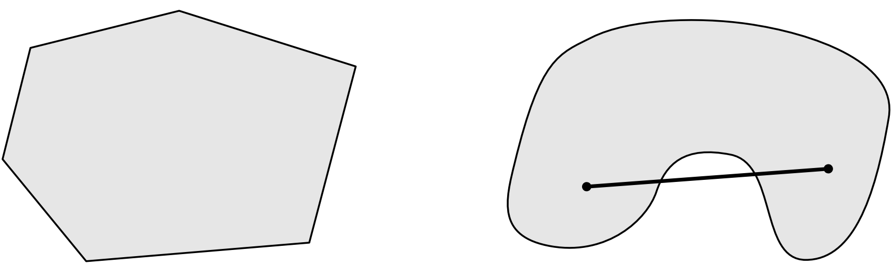
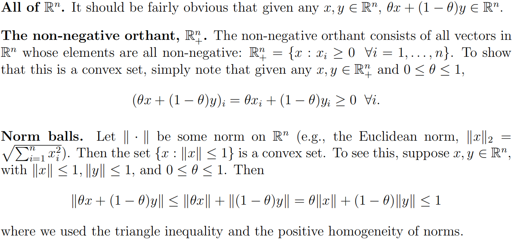
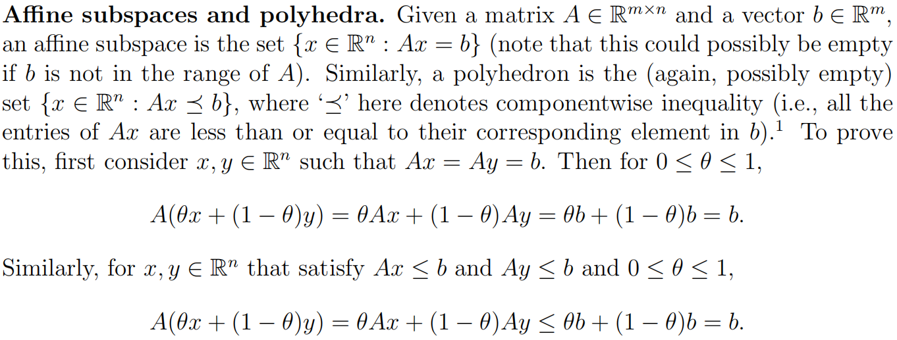
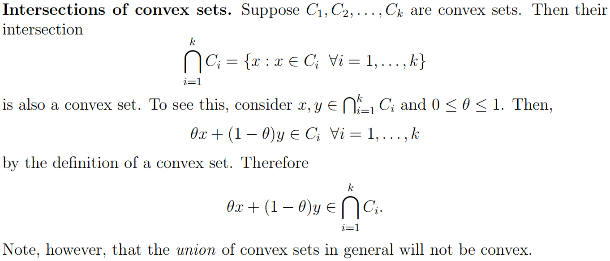
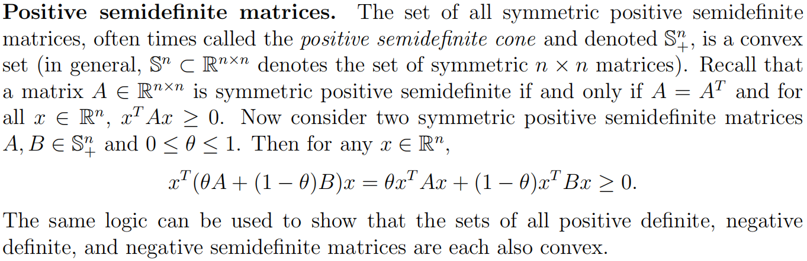
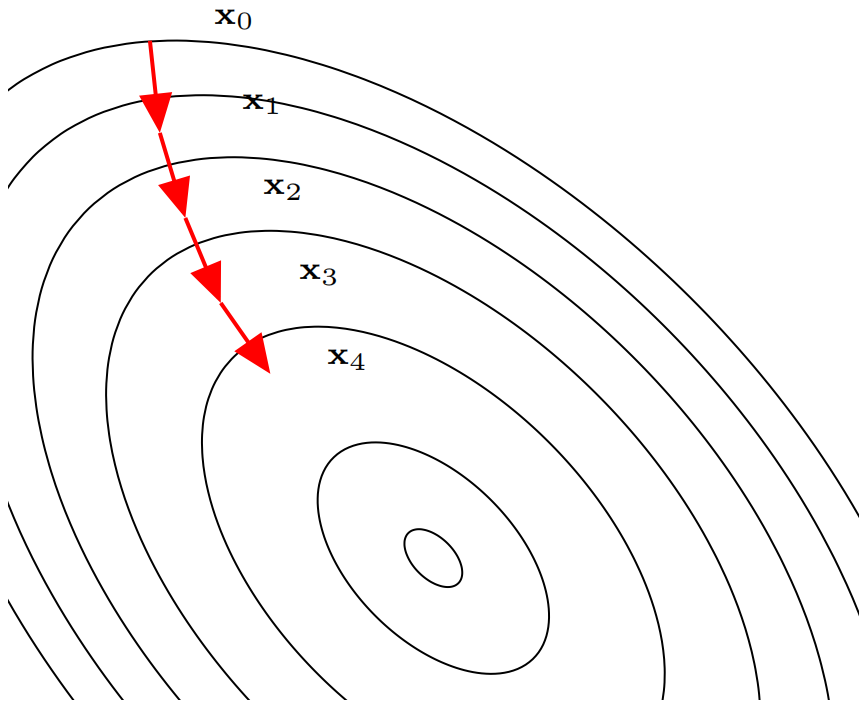
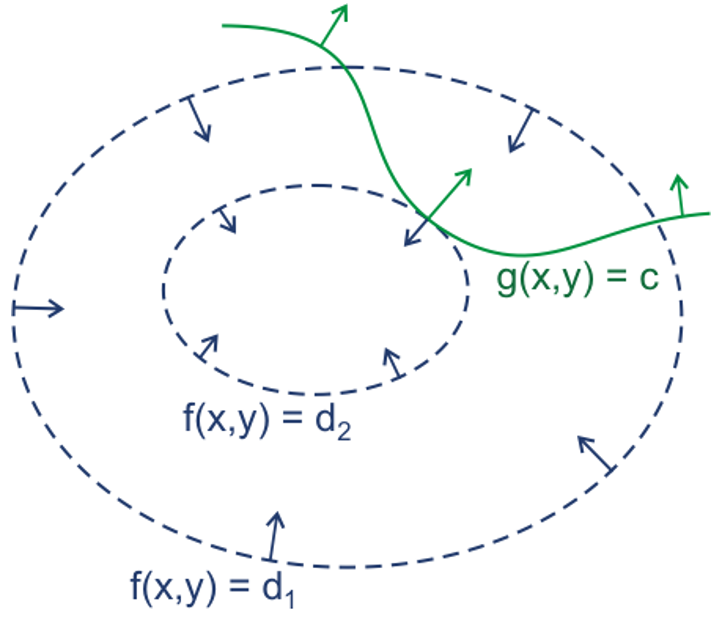

## 数学优化

**数学优化(mathematical optimization)**问题也叫最优化问题，指在一定约束条件下，求解一个目标函数的最大值或最小值问题。数学优化问题的定义为：给定一个目标函数(也叫代价函数)$f:A\rightarrow\mathbb R$，寻找一个变量$\boldsymbol x^* \in \mathcal D$，使得对于所有$\mathcal D$中的$\boldsymbol x$，$f(\boldsymbol{x}^{*}) \leqslant f(\boldsymbol{x})$(最小化)；或者$f(\boldsymbol{x}^{*}) \geqslant f(\boldsymbol{x})$(最大化)，其中$\mathcal D$为变量$\boldsymbol x$的**约束集**，也叫**可行域**；$\mathcal D$中的变量被称为**可行解**。

### 数学优化的类型

#### 离散优化和连续优化

**离散优化(discrete optimization)**问题是目标函数的输入变量为离散变量，比如为整数或有限集合中的元素。离散优化问题主要有两个分支：

(1) **组合优化(combinatorial optimization)**：其目标是从一个有限集合中找出使得目标函数最优的元素。在一般的组合优化问题中，集合中的元素之间存在一定的关联，可以表示为图结构。典型的组合优化问题有旅行商问题、最小生成树问题、图着色问题等。很多机器学习问题都是组合优化问题，比如特征选择、聚类问题、超参数优化问题以及**结构化学习(structured learning)**中标签预测问题等。

(2) **整数规划(integer programming)**：输入变量$\boldsymbol x \in \mathbb Z^d$是一个整数向量。常见的整数规划问题通常为**整数线性规划**。整数线性规划的一种最直接的求解方法是：1. 去掉输入必须为整数的限制，将原问题转换为**一般的线性规划问题**，这个线性规划问题为原问题的**松弛问题**；2. 求得相应松弛问题的解；3. 把松弛问题的解**四舍五入到最接近的整数**。但是这种方法得到的解**一般都不是最优的**，因为原问题的最优解不一定在松弛问题最优解的附近。另外，这种方法得到的解也不一定满足约束条件。

离散优化问题的求解一般都比较困难，优化算法的复杂度都比较高。

**连续优化(continuous optimization)**目标函数的输入变量为连续变量$\boldsymbol x \in \mathbb R^d$，即目标函数为实函数。机器学习中的优化问题主要是连续优化问题。

#### 无约束优化和约束优化

在连续优化问题中，根据是否有变量的约束条件，可以将优化问题分为无约束优化问题和约束优化问题。

**无约束优化(unconstrained optimization)**问题的可行域为整个实数域$\mathcal D=\mathbb R^d$，可以写为：
$$
\min _{\boldsymbol{x}} \ \ f(\boldsymbol{x})
$$
其中$\boldsymbol x \in \mathbb R^d$为输入变量，$f:\mathbb R \rightarrow \mathbb R$为目标函数。

**约束优化(constrained optimization)**问题中变量$\boldsymbol x$需要满足一些等式或不等式的约束。约束优化问题通常使用**拉格朗日乘数法**来进行求解。 

#### 线性优化和非线性优化

若目标函数和所有的约束函数都为线性函数，则该问题称为**线性规划(linear programming)**问题。相反，如果木变函数或任何一个约束函数为非线性函数，则该问题为**非线性规划(nonlinear programming)**问题。

在非线性优化问题中，有一类比较特殊的问题是**凸优化(convex programming)**问题。在凸优化问题中，变量$\boldsymbol x$的可行域为**凸集**，即对于集合中任意两点，它们的连线全部位于集合内部。目标函数$f$也必须为凸函数，即满足：
$$
f(\alpha \boldsymbol{x}+(1-\alpha) \boldsymbol{y}) \leq \alpha f(\boldsymbol{x})+(1-\alpha) f(\boldsymbol{y}), \ \ \forall \alpha \in[0,1]
$$
凸优化问题是一种特殊的约束优化问题，需满足目标函数为凸函数，并且等式约束函数为线性函数，不等式约束函数为凸函数。

### 凸优化基础

#### 凸集

对于集合$C$，如果对任意$x,y \in C,\theta \in \mathbb R,0 \leqslant \theta \leqslant 1$，有$\theta x + (1-\theta)y \in C$，则集合$C$为**凸集(convex set)**。下图中，左边为凸集，右边为非凸集：



$\theta x+(1-\theta)y$称为点$x$和$y$的凸组合。凸集有以下实例：









#### 凸函数

若函数$f:\mathbb R^n \rightarrow \mathbb R$为**凸函数(convex function)**，则其定义域$\mathcal D(f)$为凸集，且对所有$x,y \in \mathcal D(f),\theta \in [0,1]$，有$f(\theta x+(1-\theta) y) \leqslant \theta f(x)+(1-\theta) f(y)$。

若函数$f$为凸函数，则$-f$为**凹函数(concave function)**。若上式中$x \not = y$且$\theta \in (0,1)$，则称函数$f$为**严格凸**的。

#### Jensen不等式

将凸函数的定义推广到**多个变量**，可以得到下式：
$$
f\left(\sum_{i=1}^{k} \theta_{i} x_{i}\right) \leqslant \sum_{i=1}^{k} \theta_{i} f(x_{i}) \text { for } \sum_{i=1}^{k} \theta_{i}=1, \theta_{i} \geqslant 0 \ \ \forall i
$$
将上式再次推广为**连续型变量**，可以得到：
$$
f\left(\int p(x) x d x\right) \leqslant \int p(x) f(x) d x \text { for } \int p(x) dx=1, p(x) \geqslant 0 \ \ \forall x
$$
由于$p(x)$的积分为1，可以将其当做一个**概率分布**。因此上式可以写作**期望**的形式：
$$
f(\mathbb{E}[x]) \leqslant \mathbb{E}[f(x)]
$$
上式被称为**Jensen不等式(Jensen inequality)**。

### 优化算法

优化问题一般都是通过**迭代**的方式来求解，即通过猜测一个初始的估计，然后不断迭代产生新的估计，最终收敛到期望的最优解。一个好的优化算法应该能在一定的时间或空间复杂度下能够快速准确地找到最优解。同时，好的优化算法**受初始猜测点的影响较小**，通过迭代能稳定地找到最优解的邻域，然后迅速收敛于最优解。

#### 全局最优和局部最优

对于很多非线性优化问题，会存在若干个局部的极小值。局部极小值，或局部最优解$\boldsymbol x^*$定义为：存在一个$\delta>0$，对于所有的满足$\| \boldsymbol x - \boldsymbol x^* \| \leqslant \delta$的$\boldsymbol x$，公式$f(\boldsymbol X^*) \leqslant f(\boldsymbol X)$成立。也就是说，在$\boldsymbol x^*$的附近区域内，所有的函数值都会大于或者等于$f(\boldsymbol x^*)$。

对于所有的$\boldsymbol x \in A$，都有$f(\boldsymbol X^*) \leqslant f(\boldsymbol X)$成立，则$\boldsymbol X^*$为全局最小值，或**全局最优解**。求局部最优解一般是比较容易的，但很难保证其为全局最优解。**对于线性规划或凸优化问题，局部最优解就是全局最优解**。

要确认一个点$\boldsymbol x^*$是否为局部最优解，通过比较它的淋浴内有没有更小的函数值是不现实的。如果函数$f(\boldsymbol x)$是二次连续可微的，我们可以通过检查目标函数在点$\boldsymbol x^*$的梯度$\nabla f\left(\boldsymbol{x}^{*}\right)$和Hessian矩阵$\nabla^2f(\boldsymbol x^*)$来判断。

**局部最优解的一阶必要条件**如下：如果$\boldsymbol x^*$为局部最优解并且函数$f$在$\boldsymbol x^*$的邻域内一阶可微，则$\nabla f\left(\boldsymbol{x}^{*}\right)=0$。

**局部最优解的二阶必要条件**如下：如果$\boldsymbol x^*$为局部最优解并且函数$f$在$\boldsymbol x^*$的邻域内二阶可微，则$\nabla f\left(\boldsymbol{x}^{*}\right)=0$，且$\nabla^2f(\boldsymbol x^*)$为半正定矩阵。

#### 梯度下降法

**梯度下降法(gradient descent method)**经常用来求解无约束优化的极小值问题。对于函数$f(\boldsymbol x)$，如果$f(\boldsymbol x)$在点$\boldsymbol x_t$附近是连续可微的，那么$f(\boldsymbol x)$下降最快的方向是$f(\boldsymbol x)$在点$\boldsymbol x_t$梯度方向的**反方向**。

梯度下降法从一个初始值$\boldsymbol x_0$出发，通过迭代公式$\boldsymbol{x}_{t+1}=\boldsymbol{x}_{t}-\alpha_{t} \nabla f\left(\boldsymbol{x}_{t}\right), t \geqslant 0$生成序列$\boldsymbol x_0,\boldsymbol x_1,\cdots$，使得
$$
f(\boldsymbol{x}_{0}) \geqslant f(\boldsymbol{x}_{1}) \geqslant f(\boldsymbol{x}_{2}) \geqslant \cdots
$$
如果顺利的话，序列$(\boldsymbol x_n)$收敛到**局部最优解**$\boldsymbol x^*$。注意，每次迭代步长$\alpha$可以改变，但其值必须合适，如果过大就不会收敛，如果过小则收敛速度太慢。

梯度下降法的过程如下图所示：



梯度下降法为一阶收敛算法，当靠近极小值时梯度变小，收敛速度会变慢，并且可能以“之字形”的方式下降。如果目标函数为二阶连续可微，我们可以采用**牛顿法**。牛顿法为二阶收敛算法，收敛速度更快，但是**每次迭代需要计算Hessian矩阵的逆矩阵，复杂度较高**。

相反，如果我们要求解一个最大值问题，就需要向梯度正方向迭代进行搜索，逐渐接近函数的局部极大值点，这个过程则被称为**梯度上升法(gradient ascent method)**。

```python
# numpy实现梯度下降算法逼近一个函数的最小值
import numpy as np
import matplotlib.pyplot as plt

x = np.linspace(-80, 80, 5000)


def f(x):
    # 目标函数
    return x ** 2 + 5 * x + 2


def df(x):
    # 目标函数的导数
    return 2 * x + 5


alpha = 0.1  # 学习率

plt.plot(x, f(x))

init_x = 76  # x的初始值
init_value = f(init_x)

last_x = init_x
last_value = init_value

xs = [init_x]
values = [init_value]

# 10000次迭代
for i in range(10000):
    now_x = last_x - alpha * df(last_x)
    now_value = f(now_x)

    if abs(now_value - last_value) < 1e-8:  # 当某一步优化进行不明显时，终止优化
        break

    last_x = now_x
    last_value = now_value

    print('The {}th step, x={}, f(x)={}'.format(i + 1, last_x, last_value))

    xs.append(last_x)
    values.append(last_value)

plt.plot(xs, values, color='red')
plt.show()
```

### 拉格朗日乘数法与KKT条件

**拉格朗日乘数法(Lagrange multiplier)**是约束优化问题的一种有效求解方法。**约束优化问题**可以表示为：
$$
\begin{aligned}
& \min_{\boldsymbol x} \ \ f(x)\\
& \text{subject to} \ \ h_i(\boldsymbol x)=0,i=1,\cdots,m;g_j(\boldsymbol x) \leqslant 0,j=1,\cdots,n
\end{aligned}
$$
其中$h_i(\boldsymbol x)$为等式约束函数，$g_j(\boldsymbol x)$为不等式约束函数。$\boldsymbol x$的可行域为：
$$
\mathcal{D}=\operatorname{dom}(f) \cap \bigcap_{i=1}^{m} \operatorname{dom}\left(h_{i}\right) \cap \bigcap_{j=1}^{n} \operatorname{dom}\left(g_{j}\right) \subseteq \mathbb{R}^{d}
$$
其中$\operatorname{dom}(f)$是函数$f$的定义域。

#### 等式约束优化问题

如果**约束问题只有等式约束(而没有不等式约束)**，我们可以构造一个拉格朗日函数$\Lambda(\boldsymbol{x}, \lambda)$：
$$
\Lambda(\boldsymbol{x}, \lambda)=f(\boldsymbol{x})+\sum_{i=1}^{m} \lambda_{i} h_{i}(\boldsymbol{x})
$$
其中，$\lambda$为拉格朗日乘数，可以使正数或负数。如果$f(\boldsymbol x^*)$是原始约束优化问题的局部最优值，那么存在一个$\lambda^*$，使得$(\boldsymbol x^*,\lambda^*)$为拉格朗日函数$\Lambda(\boldsymbol{x}, \lambda)$的**平稳点(stationary point)**，即一阶偏导数为0的点。因此，只需要令${\partial \Lambda(\boldsymbol{x}, \lambda)}/{\partial \boldsymbol{x}}=0$和${\partial \Lambda(\boldsymbol{x}, \lambda)}/{\partial \lambda}=0$，得到：
$$
\nabla f(\boldsymbol{x})+\sum_{i=1}^{m} \lambda_{i} \nabla h_{i}(\boldsymbol{x})=0, \ \ h_i(\boldsymbol x)=0,i=0,\cdots,m
$$
上面方程组的解即为原始问题的可能解。在实际应用中，需根据问题来验证是否为极值点。

拉格朗日乘数法是将一个有$d$个**变量**和$m$个**等式约束条件**的最优化问题转换为一个有$d+m$个变量的函数求平稳点的问题。拉格朗日乘数法所得的平稳点会包含原问题的所有极值点，但**并不保证每个平稳点都是原问题的极值点**。

等式约束优化问题的解释如下：假设目标函数是二维的，即$f(x,y)$，下图蓝色虚线为目标函数的等高线图。对于凸的目标函数，**只有当等高线与目标函数的曲线相切时才有可能得到可行解**。因此在最优解处目标函数与约束函数$g(x,y)$相切，这时两者的法向量是平行的，即：$\nabla f(x,y)+\lambda \nabla g(x,y)=0$，与上文对应。



#### 不等式约束优化问题

对于一般的约束优化问题，其**广义拉格朗日函数**为：
$$
\Lambda(\boldsymbol{x}, \boldsymbol{a}, \boldsymbol{b})=f(\boldsymbol{x})+\sum_{i=1}^{m} a_{i} h_{i}(\boldsymbol{x})+\sum_{j=1}^{n} b_{j} g_{j}(\boldsymbol{x})
$$
其中$h_i(x)$为第$i$个等式约束，$g_j(x)$为第$j$个不等式约束($\leqslant$)，$\boldsymbol a=[a_1,\cdots,a_m]^\text{T}$为等式约束的拉格朗日乘数，$\boldsymbol b=[b_1,\cdots,b_n]^\text{T}$为不等式约束的拉格朗日乘数，$b_i \geqslant 0$。

当**约束条件不满足**时，$\max _{\boldsymbol{a}, \boldsymbol{b}} \Lambda(\boldsymbol{x}, \boldsymbol{a}, \boldsymbol{b})=\infty$，因为若某个$i$使约束$g_i(x) > 0$，则可令$b_i \rightarrow \infty$；若某个$j$对应的$h_j(x) \not = 0$，则可令$a_i$使得$a_ih_i(x) \rightarrow \infty$；当**约束条件满足**并且$\boldsymbol b \geqslant 0$时，$\max _{\boldsymbol{a}, \boldsymbol{b}} \Lambda(\boldsymbol{x}, \boldsymbol{a}, \boldsymbol{b})=f(\boldsymbol{x})$。因此，**原始约束优化问题等价于**：
$$
\begin{aligned}
\min _{\boldsymbol{x}} \max _{\boldsymbol{a}, \boldsymbol{b}} \ \ \  & \Lambda(\boldsymbol{x}, \boldsymbol{a}, \boldsymbol{b}) \\
\text { subject to} \ \ \ & \boldsymbol{b} \geqslant 0
\end{aligned}
$$

这个min-max优化问题称为**主问题(primal problem)**。

主问题的优化一般比较困难，我们可以通过交换min-max的顺序来简化。定义拉格朗日对偶函数为：
$$
\Gamma(\boldsymbol{a}, \boldsymbol{b})=\min _{\boldsymbol{x} \in \mathcal{D}} \Lambda(\boldsymbol{x}, \boldsymbol{a}, \boldsymbol{b})
$$
$\Gamma(\boldsymbol{a}, \boldsymbol{b})$是一个凸函数，即使$f(\boldsymbol x)$是非凸的。当$\boldsymbol b \geqslant 0$时，对于任意的$\tilde{x} \in \mathcal{D}$，有：
$$
\Gamma(\boldsymbol{a}, \boldsymbol{b})=\min _{\boldsymbol{x} \in \mathcal{D}} \Lambda(\boldsymbol{x}, \boldsymbol{a}, \boldsymbol{b}) \leqslant \Lambda(\tilde{\boldsymbol{x}}, \boldsymbol{a}, \boldsymbol{b}) \leqslant f(\tilde{\boldsymbol{x}})
$$
令$p^*$是原问题的最优值，则有$\Gamma(\boldsymbol{a}, \boldsymbol{b}) \leqslant p^*$，即**拉格朗日对偶函数为原问题最优值的下界**。优化拉格朗日对偶函数$\Gamma(\boldsymbol{a}, \boldsymbol{b})$并得到原问题的最优下界，称为**拉格朗日对偶问题(Lagrange dual problem)**，即：
$$
\begin{aligned}
\max _{\boldsymbol{a}, \boldsymbol{b}} \ \ \ & \Gamma(\boldsymbol{a}, \boldsymbol{b}) \\
\text {subject to} \ \ \ & \boldsymbol{b} \geqslant 0
\end{aligned}
$$
拉格朗日对偶函数为凸函数，因此拉格朗日对偶问题为**凸优化问题**。 

令$d^*$表示拉格朗日对偶问题的最优值，则有$d^* \leqslant p^*$，这个性质称为**弱对偶性(weak duality)**。如果$d^* = p^*$，这个性质称为**强对偶性(strong duality)**。

当强对偶性成立时，令$\boldsymbol x^*$和$\boldsymbol a^*, \boldsymbol b^*$分别是原问题和对偶问题的最优解，那么它们满足以下条件：
$$
\begin{aligned}
\nabla f\left(\boldsymbol{x}^{*}\right) +\sum_{i=1}^{m} a_{i}^{*} \nabla h_{i}(\boldsymbol{x}^{*})&+\sum_{j=1}^{n} b_{j}^{*} \nabla g_{j}(\boldsymbol{x}^{*})=0 \\
h_{i}(\boldsymbol{x}^{*})=0, \ \ & i=0, \cdots, m \\
g_{j}(\boldsymbol{x}^{*}) \leqslant 0, \ \ & j=0, \cdots, n \\
b_{j}^{*} g_{j}\left(\boldsymbol{x}^{*}\right)=0, \ \ & j=0, \cdots, n \\
b_{j}^{*} \geqslant 0, \ \ & j=0, \cdots, n
\end{aligned}
$$
称为不等式约束优化问题的**KKT条件(Karush-Kuhn-Tucker condition)**。KKT条件是拉格朗日乘数法在不等式约束优化问题上的泛化。当原问题是凸优化问题时，满足KKT条件的解也是原问题和对偶问题的最优解。

KKT条件中第四个式子称为**互补松弛(complementary slackness)条件**。如果最优解$\boldsymbol x^*$出现在不等式约束的边界上$g_j(\boldsymbol x)=0$，则$b_j^*>0$；如果最优解$\boldsymbol x$出现在不等式约束的内部$g_j(\boldsymbol x)<0$，则$b_j^*=0$。互补松弛条件说明**当最优解出现在不等式约束的内部，则约束失败**。

```python
# cvxpy解决凸优化问题
import cvxpy as cvx

# 定义要被优化的变量
x = cvx.Variable()
y = cvx.Variable()

# 定义约束，可以包含等式约束和不等式约束
constraints = [x + y == 1, x - y >= 1]

# 定义优化目标
obj = cvx.Minimize((x - y) ** 2)

# 将优化目标和约束组成优化问题
prob = cvx.Problem(obj, constraints)

# 求解
prob.solve()
print("status: ", prob.status)  # optimal
print("optimal value: ", prob.value)  # 1.0
print("optimal variables: ", x.value, y.value)  # 1.0 1.570086213240983e-22
```

### 参考资料

- 李航. 统计学习方法. 北京: 清华大学出版社, 2019.

- 邱锡鹏. 神经网络与深度学习. 北京: 机械工业出版社, 2020.

- Stanford University机器学习课程：http://cs229.stanford.edu/

- cvxpy官方网站：https://www.cvxpy.org/

