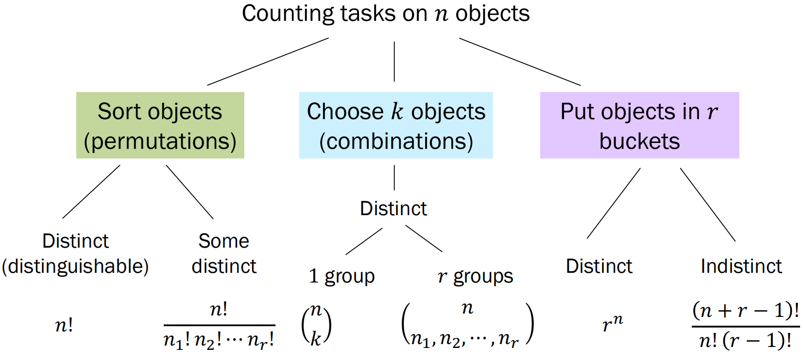
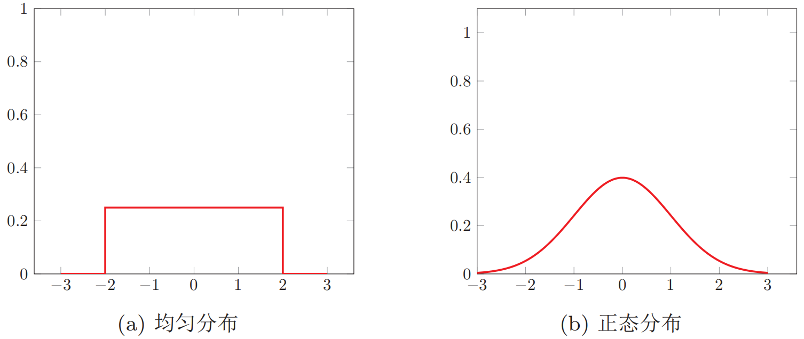
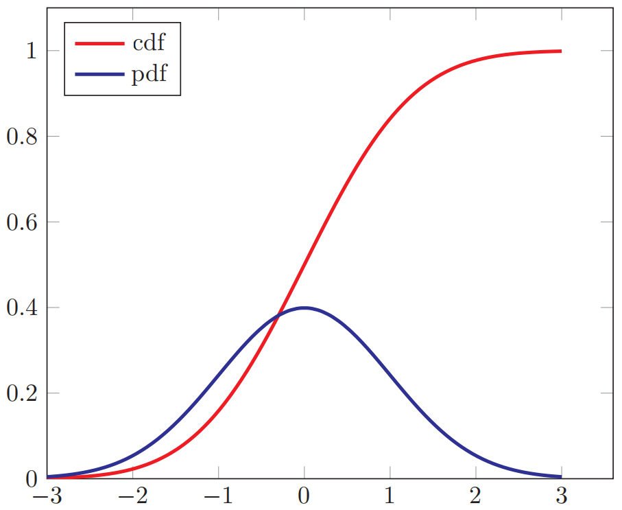
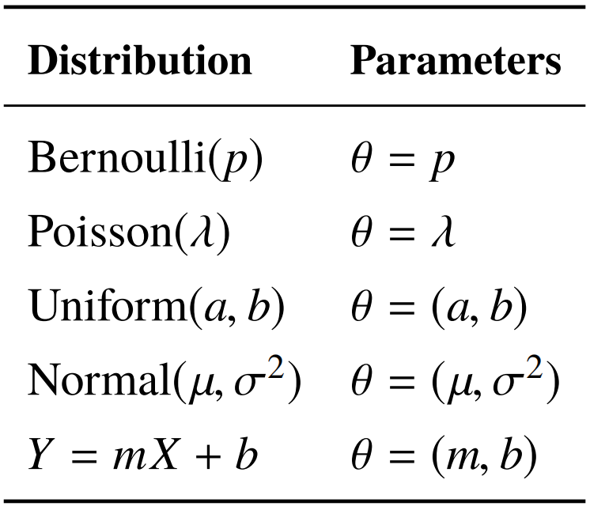

## 概率统计

### 概率统计的基本概念

#### 样本空间与随机事件

**样本空间(sample space)**是一个随机试验**所有可能结果的集合**。例如，如果抛一枚硬币，那么样本空间的集合就是{正面, 反面}；如果抛一个骰子，那么样本空间就是{1, 2, 3, 4, 5, 6}。随机试验中的每个可能结果称为**样本点**。

一般称试验$E$的样本空间$S$的子集为$E$的**随机事件**，简称事件。在每次试验中，当且仅当这一子集中的一个样本点出现时，称这一事件发生。

有些试验有**两个或多个可能的样本空间**。例如，从52张扑克牌中随机抽出一张，样本空间可以是数字(A到K)，也可以是花色(黑桃, 红桃, 梅花, 方块)。如果要完整地描述一张牌，就需要同时给出数字和花色，这时样本空间可以通过构建上述两个样本空间的**笛卡儿乘积**来得到。具体选用什么样的样本空间，由任务需求来决定。

#### 计数原理

**计数(counting)**是样本空间的基本概念。计数的基本原理是**加法原理(sum rule)**和**乘法原理(product rule)**。加法原理指的是：做一件事情，完成它有$n$类方式，第一类方式有$m_1$种方法，第二类方式有$m_2$种方法，以此类推，第$n$类方式有$m_n$种方法，那么完成这件事情共有$m_1+m_2+\cdots+m_n$种方法。乘法原理指的是：做一件事，完成它需要分成$n$个步骤，做第一 步有$m_1$种不同的方法，做第二步有$m_2$种不同的方法，以此类推，做第$n$步有$m_n$种不同的方法。那么完成这件事共有$N=m_1 \times m_2 \times \cdots \times m_n$种不同的方法。

#### 排列与组合

下图为**排列(permutation)数**、**组合(combination)数**以及将物体放入桶中问题的计算方法：



```python
# scipy实现阶乘和组合数的计算
import math
from scipy import special
from scipy import stats

# 计算阶乘
print(math.factorial(20))
# 计算组合数
print(special.binom(5, 3))
```

#### 概率的公理

将事件$E$发生的概率定义为$P(E)$，全集为$S$，则概率$P(E)$满足如下三条公理：

(1) $0 \leqslant P(E) \leqslant 1$；

(2) $P(S)=1$；

(3) 若事件$E$和事件$F$无交集，即$(E \cap F=\varnothing)$，则$P(E \cup F)=P(E)+P(F)$。

#### 概率的推论

设事件$E$的对立事件为$\bar E$，概率存在以下三个基本的推论：

(1) $P(\bar E)=1-P(E)$；

(2) 若$E \subseteq F$，则$P(E) \leqslant P(F)$；

(3) $P(E \cap F)=P(E)+P(F)-P(E \cup F)$。

### 随机变量与概率分布

#### 随机变量

在随机试验中，试验的结果可以用一个数$X$来表示，这个数$X$是随着试验结果而不断变化的，是**定义在样本空间上的实值单值函数**。我们把这种数称为**随机变量(random variable)**。例如，随机掷一个骰子，得到的点数就可以看成一个随机变量$X$，$X$的取值为$\{1, 2, 3, 4, 5, 6\}$。如果随机掷两个骰子，整个样本空间$\Omega$可以由36个元素组成：
$$
\Omega=\{(i,j)|i=1,\cdots,6;j=1,\cdots,6\}
$$
随机变量分为**离散型随机变量**和**连续型随机变量**。如果随机变量$X$所可能取的值为有限可列举的，有$n$个有限值，则称$X$为离散型随机变量。要了解$X$的统计规律，就必须知道它取每种可能值$x_i$的概率，即：
$$
P(X=x_i)=p(x_i), \ \ \forall i \in \{1,\cdots,n\}
$$
$p(x_1),\cdots,p(x_n)$称为离散型随机变量$X$的**概率分布(probability distribution)**，并且满足：
$$
\sum_{i=1}^{n}p(x_i)=1, \ \ \ \ \ \ p(x_i) \geqslant 0
$$
常见的离散型随机变量的概率分布有：

##### 伯努利分布(Bernoulli distribution)

在一次试验中，事件A出现的概率为$\mu$，不出现的概率为$1-\mu$。若用变量$X$表示事件A出现的次数，则$X$的取值为0和1，其相应的分布为：$p(x)=\mu^x(1-\mu)^{1-x}$。伯努利分布又称**两点分布**或**0-1分布**。

##### 二项分布(binomial distribution)

在$n$次伯努利试验中，若以变量$X$表示事件$A$出现的次数，则$X$的取值为$\{0,\cdots,n\}$，其相应的分布为二项分布：
$$
P(X=k)=\binom{n}{k}\mu^k(1-\mu)^{n-k}, \ \ k=1,\cdots,n
$$
一些随机变量$X$的取值是不可列举的，由全部实数或者由一部分区间组成。这种随机变量称为**连续型随机变量**。连续型随机变量的取值不可数的。对于连续型随机变量$X$，其取一个具体值$x_i$的**概率为0**，这和离散型随机变量截然不同。因此**无法列举**。连续型随机变量$X$的概率分布一般用**概率密度函数(probability density function, PDF)**$p(x)$进行描述。$p(x)$是可积函数，并满足：
$$
\int_{-\infty}^{+\infty} p(x) \text{d}x=1, \ \ \ \ \ \ \ p(x) \geqslant 0
$$
给定该利率密度函数$p(x)$，便可以计算出随机变量落入某一个区域的概率。令$\mathcal R$表示$x$的非常小的邻近区域，$|\mathcal R|$表示$\mathcal R$的大小，则$p(x)|\mathcal R|$可以反映随机变量处于区域$\mathcal R$的概率大小。

常见的连续型随机变量的概率分布有：

##### 均匀分布(uniform distribution)

若$a,b$为有限数，$[a,b]$上的均匀分布的概率密度函数定义为：
$$
p(x)=\left\{\begin{aligned}
& \frac{1}{b-a} , \ \  a \leq x \leq b \\
& 0 , \ \  x<a \ \ \text{or} \ \  x>b
\end{aligned}\right.
$$

##### 正态分布(normal distribution)

正态分布，又名**高斯分布(Gaussian distribution)**，是自然界最常见的一种分布，并且具有很多良好的性质，在许多领域都有非常重要的影响力。其概率密度函数为：
$$
p(x)=\frac{1}{\sqrt{2 \pi} \sigma} \exp \left(-\frac{(x-\mu)^{2}}{2 \sigma^{2}}\right)
$$
其中，$\delta>0$，$\mu$和$\delta$均为常数。若随机变量$X$服从一个参数为$\mu$和$\delta$的概率分布，则记为$X \sim \mathcal N(\mu,\sigma^2)$。当$\mu=0,\sigma=1$时，称为**标准正态分布(standard normal distribution)**。

下图展示了均匀分布和正态分布的概率密度函数：



对于一个随机变量$X$，其**累积分布函数(cumulative distribution function, CDF)**是随机变量$X$的取值小于等于$x$的概率：$\text{cdf}(x)=P(X \leqslant x)$。以连续型随机变量$X$为例，累积分布函数定义为：
$$
\text{cdf}(x)=\int_{-\infty}^{x}p(t)\text{d}t
$$
其中，$p(t)$为概率密度函数。下图给出了标准正态分布的概率密度函数和累积分布函数：



```python
# 常用的离散型随机变量
# 二项分布
X = stats.binom(10, 0.2)  # Declare X to be a binomial random variable X~Bin(10, 0.2)
print(X.pmf(3))  # P(X = 3)
print(X.cdf(4))  # P(X <= 4)
print(X.mean())  # E[X]
print(X.var())  # Var(X)
print(X.std())  # Std(X)
print(X.rvs())  # Get a random sample from X
print(X.rvs(10))  # Get 10 random samples form X

# 泊松分布
X = stats.poisson(2)  # Declare X to be a poisson random variable
print(X.pmf(3))  # P(X = 3)
print(X.rvs())  # Get a random sample from X

# 几何分布
X = stats.geom(0.75)  # Declare X to be a geometric random variable
print(X.pmf(3))  # P(X = 3)
print(X.rvs())  # Get a random sample from X

# 常用的连续型随机变量
# 正态分布
A = stats.norm(3, math.sqrt(16))  # Declare A to be a normal random variable
print(A.pdf(4))  # f(3), the probability density at 3
print(A.cdf(2))  # F(2), which is also P(A < 2)
print(A.rvs())  # Get a random sample from A

# 指数分布
B = stats.expon(4)  # Declare B to be a normal random variable
print(B.pdf(1))  # f(1), the probability density at 1
print(B.cdf(2))  # F(2) which is also P(B < 2)
print(B.rvs())  # Get a random sample from B

# beta分布
X = stats.beta(1, 3)  # Declare X to be a beta random variable
print(X.pdf(0.5))  # f(0.5), the probability density at 1
print(X.cdf(0.7))  # F(0.7) which is also P(X < 0.7)
print(X.rvs())  # Get a random sample from X
```

#### 随机向量

**随机向量**是指一组随机变量构成的向量。如果$X_1,X_2,\cdots,X_n$为$n$个随机变量，那么称$[X_1,X_2,\cdots,X_n]$为一个$n$维随机向量。一维随机向量称为随机变量。

随机向量也分为**离散型随机向量**和**连续型随机向量**。

离散型随机向量的**联合概率分布(joint probability distribution)**为：
$$
P(X_{1}=x_{1}, X_{2}=x_{2}, \cdots, X_{n}=x_{n})=p(x_{1}, x_{2}, \cdots, x_{n})
$$
其中$x_i \in \omega_i$为变量$X_i$的取值，$\omega_i$为变量$X_i$的样本空间。

一个常见的离散型随机向量的概率分布是**多项分布(multinomial distribution)**。多项分布式二项分布在随机向量的推广。假设一个袋子中装了很多球，总共有$K$种不同的颜色。从袋子中取出$n$个球，每次取出一个球时，就在袋子中放入一个同样颜色的球，这样保证同一颜色的球在不同试验中被取出的概率是相等的，相当于**不放回抽样**。令$\boldsymbol X$为一个$K$维的随机向量，每个元素$X_k(k=1,\cdots,K)$为取出的$n$个球中颜色为$k$的球的数量，则$X$服从多项分布，其概率分布为：
$$
p(x_{1}, \ldots, x_{K} | \boldsymbol{\mu})=\frac{n !}{x_{1} ! \cdots x_{K} !} \mu_{1}^{x_{1}} \cdots \mu_{K}^{x_{K}}
$$
其中$\boldsymbol \mu=[\mu_1,\cdots,\mu_K]^\text{T}$分别为每次抽取的球的颜色为$1,\cdots,K$的概率；$x_1,\cdots,x_K$为非负整数，其和为$n$。

多项分布的概率分布也可以用gamma函数表示：
$$
p(x_{1}, \cdots, x_{K} | \boldsymbol{\mu})=\frac{\Gamma(\sum_{k} x_{k}+1)}{\prod_{k} \Gamma(x_{k}+1)} \prod_{k=1}^{K} \mu_{k}^{x_{k}}
$$
其中$\Gamma(z)=\int_0^\infty \frac{t^{z-1}}{\exp(t)}\text{d}t$为gamma函数。这种表示形式和**狄利克雷分布(Dirichlet distribution)**类似，而**狄利克雷分布可以作为多项分布的共轭先验**。一个$n$维随机向量$\boldsymbol X$的狄利克雷分布为：
$$
p(\boldsymbol{x} | \boldsymbol{\alpha})=\frac{\Gamma(\alpha_{0})}{\Gamma(\alpha_{1}) \cdots \Gamma(\alpha_{n})} \prod_{i=1}^{n} x_{i}^{\alpha_{i}-1}
$$
其中$\boldsymbol \alpha=[\alpha_1,\cdots,\alpha_K]^\text T$为狄利克雷分布的参数。

连续型随机向量的联合概率密度函数满足：
$$
\begin{aligned}
p(\boldsymbol{x})=p(x_{1}, \cdots, x_{n}) \geq 0 \\
\int_{-\infty}^{+\infty} \cdots \int_{-\infty}^{+\infty} p(x_{1}, \cdots, x_{n}) d x_{1} \cdots d x_{n}=1
\end{aligned}
$$
一个常见的连续型随机向量分布为**多元正态分布(multivariate normal distribution)**，也称**多元高斯分布**。若$n$维向量$\boldsymbol X=[X_1,\cdots,X_n]^\text T$服从$n$元正态分布，其密度函数为：
$$
p(\boldsymbol{x})=\frac{1}{(2 \pi)^{n / 2}|\Sigma|^{1 / 2}} \exp \left(-\frac{1}{2}(\boldsymbol{x}-\boldsymbol{\mu})^{\mathrm{T}} \Sigma^{-1}(\boldsymbol{x}-\boldsymbol{\mu})\right)
$$
其中$\boldsymbol \mu$为多元正态分布的均值向量，$\Sigma$为多元正态分布的协方差矩阵，$|\Sigma|$表示$\Sigma$的行列式。如果一个多元高斯分布的协方差矩阵$\Sigma=\delta^2I$，即每一维随机变量都独立并且方差相同，那么这个高斯分布称为**各向同性高斯分布**。

#### 边际分布

对于**二维离散型随机向量**$(X,Y)$，假设$X$的取值空间为$\Omega_x$，$Y$的取值空间为$\Omega_y$。其联合概率分布满足：
$$
p(x, y) \geq 0, \quad \sum_{x \in \Omega_{x}} \sum_{y \in \Omega_{y}} p(x_{i}, y_{j})=1
$$
对于联合概率分布$p(x,y)$，我们可以分别对$x$和$y$进行求和：

(1) 对于固定的$x$，$\sum_{y \in \Omega_{y}} p(x, y)=P(X=x)=p(x)$；

(2) 对于固定的$y$，$\sum_{x \in \Omega_{x}} p(x, y)=P(Y=y)=p(y)$。

由离散型随机向量$(X,Y)$的联合概率分布，对$Y$的所有取值进行求和得到$X$的概率分布，而对$X$的所有取值进行求和得到$Y$的概率分布。这里的$p(x)$和$p(y)$称为$p(x,y)$的**边际分布(marginal distribution)**。

对于**二维连续型随机向量**$(X,Y)$，其边际分布为：
$$
p(x)=\int_{-\infty}^{+\infty} p(x, y) d y \\
p(y)=\int_{-\infty}^{+\infty} p(x, y) d x
$$
一个二元正态分布的边际分布仍为正态分布。

#### 条件概率分布

对于离散型随机向量$(X,Y)$，已知$X=x$的条件下，随机变量$Y=y$的**条件概率(conditional probability)**为：
$$
p(y | x)=P(Y=y | X=x)=\frac{p(x, y)}{p(x)}
$$
这个公式定义了随机变量$Y$关于随机变量$X$的**条件概率分布**，简称条件分布。

对于连续型随机向量$(X,Y)$，已知$X=x$的条件下，随机变量$Y=y$的**条件概率密度函数**为：
$$
p(y | x)=\frac{p(x, y)}{p(x)}
$$
同理，在已知$Y=y$的条件下，随机变量$X=x$的条件概率密度函数为：
$$
p(x | y)=\frac{p(x, y)}{p(y)}
$$

#### 贝叶斯定理

**贝叶斯定理(Bayes' theorem)**或贝叶斯公式描述了两个条件概率$p(x|y)$和$p(y|x)$之间的关系：
$$
p(y | x)=\frac{p(x | y) p(y)}{p(x)}
$$

#### 独立与条件独立

对于两个离散型(或连续型)随机变量$X$和$Y$，若其联合分布(或联合概率密度函数)$p(x,y)$满足$p(x,y)=p(x)p(y)$，则称$X$和$Y$相互独立(independent)，记为$X \perp Y$。对于三个离散型(或连续型)随机变量$X,Y,Z$，若琪条件概率(或联合条件概率密度函数)$p(x,y|z)$满足$p(x, y | z)=P(X=x, Y=y | Z=z)=p(x | z) p(y | z)$，则称在给定变量$Z$时，$X$和$Y$条件独立(conditional independent)，记为$X \perp Y | Z$。

#### 期望与方差

对于离散型随机变量$X$，其概率分布为$p(x_1),p(x_2),\cdots,p(x_n)$，$X$的**期望(expectation)**或均值定义为：
$$
\mathbb{E}[X]=\sum_{i=1}^{n} x_{i} p(x_{i})
$$
对于连续型随机变量$X$，其概率密度函数为$p(x)$，其期望定义为：
$$
\mathbb{E}[X]=\int_{\mathbb{R}} x p(x) d x
$$
随机变量$X$的**方差(variance)**用来定义它的概率分布的离散程度，定义为：
$$
\operatorname{var}(X)=\mathbb{E}[(X-\mathbb{E}[X])^{2}]
$$
随机变量$X$的方差也称为它的二阶矩。$\sqrt{\text{var}(X)}$则称为$X$的根方差或**标准差**。

两个连续随机变量$X$和$Y$的**协方差(covariance)**用来衡量两个随机变量的分布之间的总体变化性，定义为：
$$
\operatorname{cov}(X, Y)=\mathbb{E}[(X-\mathbb{E}[X])(Y-\mathbb{E}[Y])]
$$
协方差经常也用来衡量两个随机变量之间的**线性相关性**。如果两个随机变量的协方差为0，那么称这两个随机变量是**线性不相关**。 两个随机变量之间没有线性相关性，并非表示它们之间是独立的，可能存在某种非线性的函数关系。反之，如果$X$与$Y$是统计独立的，那么它们之间的**协方差一定为0**。

两个$m$维和$n$维的连续型随机向量$\boldsymbol X$和$\boldsymbol Y$，它们的协方差为$m \times n$的矩阵，定义为：
$$
\operatorname{cov}(\boldsymbol{X}, \boldsymbol{Y})=\mathbb{E}[(\boldsymbol{X}-\mathbb{E}[\boldsymbol{X}])(\boldsymbol{Y}-\mathbb{E}[\boldsymbol{Y}])^{\mathrm{T}}]
$$
协方差矩阵$\operatorname{cov}(\boldsymbol{X}, \boldsymbol{Y})$的第$(i,j)$个元素等于随机变量$X_i$和$Y_j$的协方差。两个随机向量的协方差矩阵$\operatorname{cov}(\boldsymbol{X}, \boldsymbol{Y})$和$\operatorname{cov}(\boldsymbol{Y}, \boldsymbol{X})$互为转置关系。如果两个随机向量的协方差矩阵为**对角阵**，那么称这两个随机向量是无关的。

单个随机向量$\boldsymbol X$的协方差矩阵定义为$\operatorname{cov}(\boldsymbol{X})=\operatorname{cov}(\boldsymbol{X}, \boldsymbol{X})$。

#### Jensen不等式

如果$X$是随机变量，$g$是凸函数，则$g(\mathbb E[X]) \leqslant \mathbb E[g(X)]$。等式当且仅当$X$是一个常数或者$g$是线性时成立。这个性质被称为Jensen不等式。特别地，对于凸函数$g$定义域上的任意两点$x_1,x_2$以及一个标量$\lambda \in [0,1]$，有：
$$
g(\lambda x_{1}+(1-\lambda) x_{2}) \leqslant \lambda g(x_{1})+(1-\lambda) g(x_{2})
$$
即凸函数$g$上的**任意两点的连线位**于这两点之间**函数曲线的上方**。该性质在凸优化中有着重要作用。

### 参数估计

所有概率分布都含有**参数(parameter)**，当参数未知时，通过已有数据来对参数进行估计，叫做**参数估计**任务。常见的分布以及其参数如下所示：



参数估计对于人工智能领域起到重要的作用。**许多机器学习算法的工作原理都是先定义一个含参数的概率模型，然后使用已有数据对模型参数进行学习**。**极大似然估计(maximum likelihood estimation, MLE)**和**最大后验估计(maximum a posteriori, MAP)**是两种常用的参数估计方法。

#### 极大似然估计

MLE的思想是，**选择使得观测数据出现可能性最大的参数**$\theta$。假设数据为$X_1,\cdots,X_n$，并且满足独立同分布。**所有数据的联合可能性(似然, likelihood)**可以写为：
$$
L(\theta)=\prod_{i=1}^{n} f(X_{i}|\theta)
$$
该函数是关于参数$\theta$的函数，记作似然函数。MLE的目标是寻找参数$\theta$，满足：
$$
\hat{\theta}=\underset{\theta}{\arg \max } L(\theta)
$$
为了方便计算，通常取对数似然函数：
$$
L L(\theta)=\log L(\theta)=\log \prod_{i=1}^{n} f(X_{i} | \theta)=\sum_{i=1}^{n} \log f(X_{i} | \theta)
$$
使用**求导**的方式，便可得到对数似然函数的极值，从而得到似然函数的极值。

#### 最大后验估计

MAP的思想是，在给定的数据下，选择**可能性最大的参数值**；而MLE是选择使**数据可能性最大**的参数值。给定独立同分布的随机变量$X_1,\cdots,X_n$，MAP的目标是：
$$
\begin{aligned}
\theta_{\mathrm{MAP}} &=\arg \max _{\theta} f(\theta | X_{1}, X_{2}, \ldots X_{n}) \\
&=\arg \max _{\theta} \frac{f(X_{1}, X_{2}, \ldots, X_{n} | \theta) g(\theta)}{h(X_{1}, X_{2}, \ldots X_{n})}
\end{aligned}
$$
其中，第一步到第二步的过渡利用了**贝叶斯定理**，函数$f,g,h$均为概率密度函数。接下来，首先由于数据是独立同分布的，其次上式中的分母与参数$\theta$无关，因此可以继续简化为：
$$
\begin{aligned}
\theta_{\mathrm{MAP}} &=\underset{\theta}{\arg \max } \frac{\prod_{i=1}^{n} f(X_{i} | \theta) g(\theta)}{h(X_{1}, X_{2}, \ldots X_{n})} \\
&=\underset{\theta}{\arg \max } \prod_{i=1}^{n} f(X_{i} | \theta) g(\theta)
\end{aligned}
$$
变为对数形式：
$$
\theta_{\mathrm{MAP}}=\underset{\theta}{\operatorname{argmax}}\left(\log (g(\theta))+\sum_{i=1}^{n} \log \left(f\left(X_{i} | \theta\right)\right)\right)
$$
可以看出，MAP所要最大化的目标是MLE中的**似然函数**与参数$\theta$的一个**先验分布**$g(\theta)$**之和**。

### 参考资料

- 邱锡鹏. 神经网络与深度学习. 北京: 机械工业出版社, 2020.

- Stanford University概率统计课程：http://web.stanford.edu/class/cs109/

