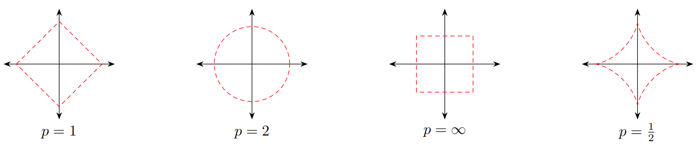
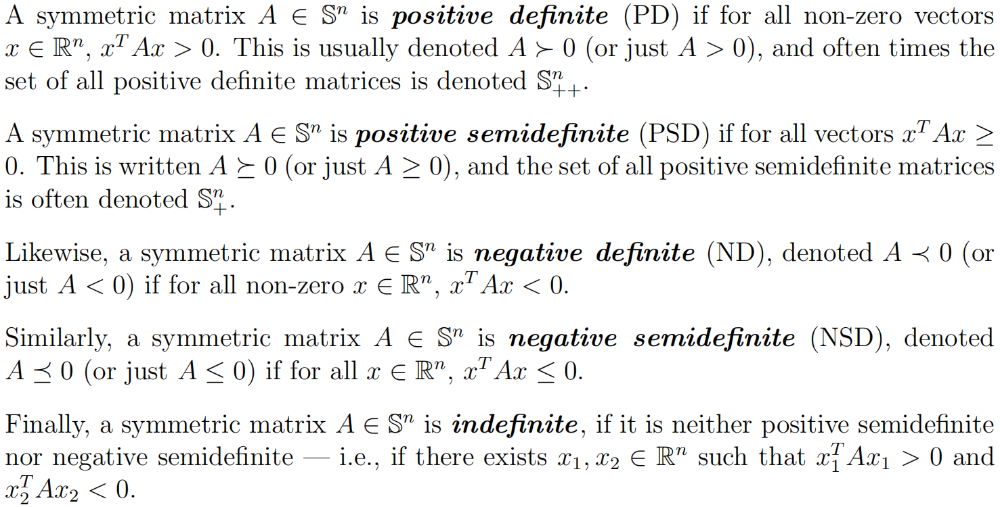
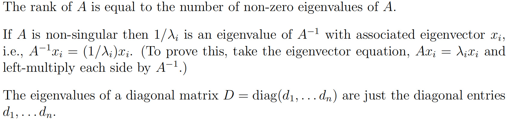
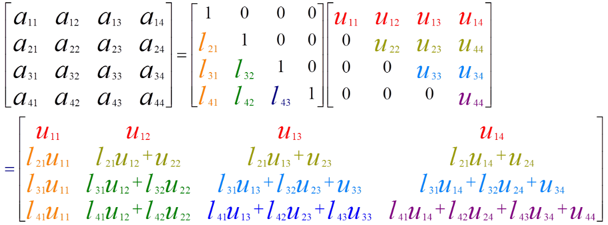

## 人工智能的数学基础-线性代数

### 向量和向量空间

#### 向量

**标量**(scalar)是一个实数，一般用斜体小写字母$`a,b,c`$来表示。**向量**(vector)是由一组实数组成的有序数组，一个$`n`$维向量$`\boldsymbol a`$由$`n`$个有序实数组成，表示为$`\boldsymbol{a}=\left[a_{1}, a_{2}, \cdots, a_{n}\right]`$，其中$`a_{i}`$称为向量$`\boldsymbol{a}`$的第$`i`$个分量(第$`i`$维)。

```python
# numpy库常用于实现线性代数中向量和矩阵的基本操作
import numpy as np
# numpy中向量的定义
v_1 = np.array([1, 2, 3, 4, 5])
v_2 = np.array([5.6, 4.6, 3.6, 2.6, 1.6])
```

#### 向量空间

**向量空间(vector space)**也称**线性空间(linear space)**，是指由向量组成的集合，并满足以下两个条件：

(1) **向量加法封闭性**：向量空间$\mathcal V$中的任意两个向量$\boldsymbol a$和$\boldsymbol b$，它们的和$\boldsymbol a+\boldsymbol b$也属于向量空间$\mathcal V$；

```python
# numpy实现向量加法
v_a = np.add(v_1, v_2)
print(v_a, v_a.shape)  # 结果为向量
```

(2) **标量乘法封闭性**：向量空间$\mathcal V$中的任一向量$\boldsymbol a$和任一标量$c$，它们的乘积$c\boldsymbol a$也属于向量空间$\mathcal V$。

```python
# numpy实现向量与标量相乘
k = 2.0
v_k2 = k * v_1
print(v_k2, v_k2.shape)  # 结果为向量
```

一个常用的线性空间是**欧式空间(Euclidean space)**，常表示为$\mathbb R^n$，其中$n$为空间**维度(dimension)**。欧式空间中的向量加法和标量乘法定义为：
$$
\begin{aligned}
\left[a_{1}, a_{2}, \cdots, a_{n}\right]+\left[b_{1}, b_{2}, \cdots, b_{n}\right] &=\left[a_{1}+b_{1}, a_{2}+b_{2}, \cdots, a_{n}+b_{n}\right] \\
c \cdot\left[a_{1}, a_{2}, \cdots, a_{n}\right] &=\left[c a_{1}, c a_{2}, \cdots, c a_{n}\right]
\end{aligned}
$$
**线性子空间**：向量空间$\mathcal V$的线性子空间$\mathcal U$是$\mathcal V$的一个子集，并且满足向量空间的条件。

设$v_1,v_2,\cdots,v_n$为向量空间$\mathcal V$中的向量，则其线性组合$a_1v_1+a_2v_2+\cdots+a_nv_n$构成$\mathcal V$的子空间，并将其称为向量$v_1,v_2,\cdots,v_n$**张成(span)**的子空间，或$v_1,v_2,\cdots,v_n$的张成，记作$\operatorname{span}(v_1,v_2,\cdots,v_n)$。

**线性无关**：线性空间$\mathcal V$中的一组向量$\left\{\boldsymbol{v}_{1}, \boldsymbol{v}_{2}, \cdots, \boldsymbol{v}_{n}\right\}$，如果对任意的一组标量$\lambda_{1}, \lambda_{2}, \cdots, \lambda_{n}$，若$\sum_i \lambda_i \boldsymbol v_i=0$，则必然$\lambda_1=\lambda_2=\cdots=\lambda_n=0$，那么$\left\{\boldsymbol{v}_{1}, \boldsymbol{v}_{2}, \cdots, \boldsymbol{v}_{n}\right\}$是线性无关的，也称为线性独立的。

**基向量**：线性空间$\mathcal V$的**基(base)**$\mathcal B=\left\{\boldsymbol{e}_{1}, \boldsymbol{e}_{2}, \cdots, \boldsymbol{e}_{n}\right\}$是$\mathcal V$的有限子集，**其元素之间线性无关**。向量空间$\mathcal V$中的所有向量都可以按唯一的方式表达为$\mathcal B$中向量的线性组合。即对任意$v \in \mathcal V$，存在一组标量$(\lambda_1,\lambda_2,\cdots,\lambda_n)$，使得：
$$
\boldsymbol{v}=\lambda_{1} \boldsymbol{e}_{1}+\lambda_{2} \boldsymbol{e}_{2}+\cdots+\lambda_{n} \boldsymbol{e}_{n}
$$
$\mathcal B$中的向量称为**基向量(base vector)**。$(\lambda_1,\lambda_2,\cdots,\lambda_n)$称为向量$\boldsymbol v$关于基$\mathcal B$的**坐标(coordinate)**。向量空间中基的个数即向量空间的维数。

**内积(inner product)**：一个$n$维线性空间中的两个向量$\boldsymbol a$和$\boldsymbol b$，其内积(也称**点积**)为：
$$
\langle\boldsymbol{a}, \boldsymbol{b}\rangle=\boldsymbol a^\text T \boldsymbol b=\sum_{i=1}^{n} a_{i} b_{i}
$$
```python
# numpy实现向量内积
v_i = np.inner(v_1, v_2)
print(v_i, v_i.shape)  # 结果为标量
```

向量内积实际上是矩阵乘法的一种特例。向量$\boldsymbol a$和$\boldsymbol b$的**外积(outer product)**定义为：
$$
\boldsymbol a \boldsymbol b^{\text T}=\left[\begin{array}{c}
a_{1} \\
a_{2} \\
\vdots \\
a_{m}
\end{array}\right]\left[\begin{array}{llll}
b_{1} & b_{2} & \cdots & b_{n}
\end{array}\right]=\left[\begin{array}{cccc}
a_{1} b_{1} & a_{1} b_{2} & \cdots & a_{1} b_{n} \\
a_{2} b_{1} & a_{2} b_{2} & \cdots & a_{2} b_{n} \\
\vdots & \vdots & \ddots & \vdots \\
a_{m} b_{1} & a_{m} b_{2} & \cdots & a_{m} b_{n}
\end{array}\right]
$$
```python
# numpy实现向量外积
v_o = np.outer(v_1, v_2)
print(v_o, v_o.shape)  # 结果为矩阵
```

**正交(orthogonal)**：如果两个向量的内积为0，则它们正交。如果一个向量$\boldsymbol v$与子空间$\mathcal U$中的每个向量都正交，那么向量$\boldsymbol v$与子空间$\mathcal U$正交。

#### 范数

**范数(norm)**是一个表示向量“长度”的函数，为向量空间内所有向量赋予非零的正长度或大小。对$n$维向量$\boldsymbol v$，一个常见的范数函数为$\ell_p$范数：
$$
\ell_{p}(\boldsymbol{v}) \equiv\|\boldsymbol{v}\|_{p}=\left(\sum_{i=1}^{n}\left|v_{i}\right|^{p}\right)^{1 / p}
$$
```python
# numpy实现L2范数
v_1_2 = v_1 * v_1  # '*'运算符代表向量对应位置相乘(即内积)
sum_l2 = np.sum(v_1_2)
l2 = np.sqrt(sum_l2)
print(l2)
```

其中$p \geqslant 0$为一个标量的参数。当$p=1$时，$\ell_1$范数为向量的各元素绝对值之和，称为**曼哈顿距离**；$p=2$时，$\ell_2$范数为向量的各元素的平方和再开平方，称为**欧氏距离**。$\ell_{\infty}$范数为向量的各个元素的最大绝对值。下图给出了常见范数的示例，其中红线表示不同范数$\ell_p=1$的点：



### 矩阵

#### 线性映射

**线性映射(linear mapping)**是指从线性空间$\mathcal V$到线性空间$\mathcal W$的一个映射函数$f:\mathcal V \rightarrow \mathcal W$，并满足：对于$\mathcal V$中任何两个向量$\boldsymbol u$和$\boldsymbol v$以及任何标量$c$，有：
$$
\begin{aligned}
f(\boldsymbol{u}+\boldsymbol{v}) &=f(\boldsymbol{u})+f(\boldsymbol{v}) \\
f(c \boldsymbol{v}) &=c f(\boldsymbol{v})
\end{aligned}
$$
即该函数对加法和数量乘法封闭。两个有限维欧式空间的映射函数$f:\mathbb R^n \rightarrow \mathbb R^m$可以表示为：
$$
y=A x \triangleq\left[\begin{array}{c}
a_{11} x_{1}+a_{12} x_{2}+\cdots+a_{1 n} x_{n} \\
a_{21} x_{1}+a_{22} x_{2}+\cdots+a_{2 n} x_{n} \\
\vdots \\
a_{m 1} x_{1}+a_{m 2} x_{2}+\cdots+a_{m n} x_{n}
\end{array}\right]
$$
其中$A$定义为$m \times n$的**矩阵(matrix)**，是一个由$m$行$n$列元素排列成的矩形阵列。一个矩阵$A$从左上角数起的第$i$行第$j$列上的元素称为第$i,j$项，通常记为$[A_{ij}]$或$a_{ij}$。矩阵$A$定义了一个从$\mathbb R^n$到$\mathbb R^m$的线性映射，向量$\boldsymbol x$和$\boldsymbol y$分别为两个空间中的**列向量**，即大小为$n \times 1$或$m \times 1$的矩阵：
$$
\boldsymbol{x}=\left[\begin{array}{c}
x_{1} \\
x_{2} \\
\vdots \\
x_{n}
\end{array}\right], \quad \boldsymbol{y}=\left[\begin{array}{c}
y_{1} \\
y_{2} \\
\vdots \\
y_{m}
\end{array}\right]
$$
**在没有特殊说明的情况下，向量默认为列向量**，且行向量表示为$[x_1,x_2,\cdots,x_n]$，列向量表示为$[x_1;x_2;\cdots;x_n]$或行向量的转置$[x_1,x_2,\dots,x_n]^\text T$。

```python
# numpy中矩阵的定义
A = [[1, 2, 3, 4],
     [5, 6, 7, 8],
     [9, 10, 11, 12]]  # (3,4)
A = np.array(A)
print(A.shape)

B = [[1, 2, 3, 4, 5],
     [6, 7, 8, 9, 10],
     [11, 12, 13, 14, 15],
     [16, 17, 18, 19, 20]]  # (4,5)
B = np.array(B)
print(B.shape)

# 满秩矩阵
X = [[2, 6, 9],
     [1, 9, 3],
     [7, 2, 4]]
```

#### 矩阵操作

(1) **加法**：$[A+B]_{ij}=a_{ij}+b_{ij}$，必须保证运算的两个矩阵的大小相同。

```python
# numpy实现矩阵加法
print(np.add(A, A))
```

(2) **乘积**：$[AB]_{ij}=\sum_{k=1}^ma_{ik}b_{kj}$，必须保证第一个矩阵的列数和第二个矩阵的行数相等。矩阵的乘积表示一个复合线性映射，即先完成线性映射$B$，再完成线性映射$A$。如果$A$是$k \times m$阶矩阵，$B$是$m \times n$阶矩阵，则其乘积$AB$是一个$k \times n$阶矩阵。矩阵乘法满足结合律和分配率：

**结合律**：$(AB)C=A(BC)$，

**分配率**：$(A+B)C=AC+BC,C(A+B)=CA+CB$。

```python
# numpy实现矩阵乘法
C = np.dot(A, B)
print(C, C.shape)  # (3,4) * (4,5) = (3,5)
```

(3) **Hadamard积**：$[A \odot B]_{i j}=a_{i j} b_{i j}$，即$A$和$B$中对应的元素相乘，必须保证运算的两个矩阵的大小相同。

```python
# numpy实现Hadamard积
print(np.multiply(A, A))
```

(4) **转置(transposition)**：$[A^\text T]_{ij}=[A]_{ji}$。显然，$(A+B)^\text T =A^\text T + B^\text T$，$(AB)^\text T=B^\text T A^\text T$。

```python
# numpy实现矩阵转置
A_T = np.transpose(A)
print(A_T, A_T.shape)
```

(5) **迹(trace)**：对于$n$阶**方阵**$A$，它的迹为主对角线上的元素之和，记作$\text{tr}(A)=\sum_{i=1}^n A_{ii}$。迹有如下性质：
$$
\begin{aligned}
\text{tr}(A^\text T)&=\text{tr}(A)\\
\text{tr}(A+B)&=\text{tr}(A)+\text{tr}(B)\\
\text{tr}(AB)&=\text{tr}(BA)\\
\text{tr}(ABC)&=\text{tr}(BCA)=\text{tr}(CAB)
\end{aligned}
$$
```python
# numpy计算方阵的迹
print(np.trace(A))  # 结果为标量
```

(6) **行列式(determinant)**：$n$阶方阵$A$的行列式定义为$\det(A)=\sum_{\sigma \in S_n}\text{par}(\sigma)A_{1\sigma_1 A_2\sigma_2 \cdots A_n\sigma_n}$，其中$S_n$为所有$n$阶排列(permutation)的集合，$\text{par}(\sigma)$的值为-1或+1取决于$\sigma$为及排列或偶排列，即其中出现降序的次数为奇数或偶数，例如$(1,3,2)$中降序次数为1，$(3,1,2)$中降序次数为2。单位阵的行列式为$\det(I)=1$。

```python
# numpy计算方阵的行列式
print(np.linalg.det(X))
print(np.linalg.det(A))  # 报错，计算行列式的矩阵必须为方阵
```

$n$阶方阵$A$的行列式有如下**性质**：

如果行列式中**有一行为零，或有两行相同，或有两行成比例**，那么行列式为零；

**对换**行列式中两行的位置，行列式**反号**；

**把一行的倍数加到另一行，行列式不变**；

行列式的其他运算性质如下：
$$
\begin{aligned}
\det(cA)&=c^n\det(A)\\
\det(A^\text T)&=\det(A)\\
\det(AB)&=\det(A)\det(B)\\
\det(A^{-1})&=\det(A)^{-1}\\
\det(A^{n})&=\det(A)^{n}
\end{aligned}
$$
低维矩阵的行列式计算举例如下：
$$
\begin{aligned}
\left|\left[a_{11}\right]\right|&=a_{11}\\
\left|\left[\begin{array}{ll}
a_{11} & a_{12} \\
a_{21} & a_{22}
\end{array}\right]\right|&=a_{11} a_{22}-a_{12} a_{21}\\
\left|\left[\begin{array}{lll}
a_{11} & a_{12} & a_{13} \\
a_{21} & a_{22} & a_{23} \\
a_{31} & a_{32} & a_{33}
\end{array}\right]\right|&=\begin{array}{c}
a_{11} a_{22} a_{33}+a_{12} a_{23} a_{31}+a_{13} a_{21} a_{32} \\
-a_{11} a_{23} a_{32}-a_{12} a_{21} a_{33}-a_{13} a_{22} a_{31}
\end{array}
\end{aligned}
$$
(7) **秩(rank)**：一个矩阵$A$的列秩是$A$的线性无关的列向量的数量，行秩是$A$的线性无关的行向量数量。**一个矩阵的列秩和行秩总是相等的**，简称为秩。一个$m \times n$阶矩阵$A$的秩最大为$\min(m,n)$。若$\text{rank}(A)=\min(m,n)$，则称矩阵$A$是**满秩**的。**如果一个矩阵不满秩，说明其包含线性相关的列向量或行向量，其行列式为0**。

```python
# numpy计算矩阵的秩
print(np.linalg.matrix_rank(X))
print(np.linalg.matrix_rank(A))
```

两个矩阵的乘积$AB$的秩$\text{rank}(AB) \leqslant \min(\text{rank}(A),\text{rank}(B))$。

矩阵$A$的秩=矩阵$A$的列秩=矩阵$A$的行秩，**矩阵的初等变换皆不改变矩阵的秩、行秩和列秩**。

(8) **范数(norm)**：与向量的范数相似，矩阵常用的$\ell_p$范数定义为：
$$
\|A\|_{p}=\left(\sum_{i=1}^{m} \sum_{j=1}^{n}\left|a_{i j}\right|^{p}\right)^{1 / p}
$$

(9) **矩阵的逆(inverse matrix)**：对于$n \times n$的**方阵**$A$，如果存在另一个方块矩阵$B$使得$AB=BA=I_n$，其中$I_n$为单位矩阵，则称$A$是可逆的。矩阵$B$称为矩阵$A$的逆矩阵，记为$A^{-1}$。矩阵的逆满足如下性质：
$$
\begin{aligned}
(A^{-1})^{-1}&=A \\
(A B)^{-1}&=B^{-1} A^{-1} \\
(A^{-1})^{T}&=(A^{T})^{-1}
\end{aligned}
$$
**一个方阵的行列式等于0当且仅当该方阵不可逆**。不可逆矩阵也称**奇异矩阵**，可逆矩阵也称**非奇异矩阵**。对非方阵或奇异矩阵，可以计算其**伪逆**。

求$A^{-1}$的算法：构造增广矩阵$[A,I]$，进行行化简，若$A$行等价于$I$，则$[A,I]$行等价于$[I,A^{-1}]$，否则$A$没有逆。

```python
# numpy计算方阵的逆
print(np.linalg.inv(X))  # print(X.I)也可以
print(np.linalg.inv(A))  # 报错，计算逆的矩阵必须为方阵

# numpy计算矩阵的伪逆
M = np.zeros((4, 4))  # 定义一个奇异阵M
M[0, -1] = 1
M[-1, 0] = -1
M = np.matrix(M)
print(M)
# print(M.I)  # 将报错，矩阵M为奇异矩阵，不可逆
print(np.linalg.pinv(M))  # 求矩阵M的伪逆(广义逆矩阵)
```

(10) **初等行变换**：对于矩阵$A$，把$A$的某一行所有元素乘以一非零元素，或把$A$的两行互换，或把$A$的某一行换乘它本身与另一行的倍数的和，这三种操作称为矩阵$A$的初等行变换。若矩阵$A$经过有限次初等行变换后可以转化为矩阵$B$，则称矩阵$A$和矩阵$B$是**行等价**的。

定理：$n \times n$矩阵$A$是可逆的，当且仅当$A$行等价于单位矩阵$I_n$。这时，将$A$化简为$I_n$的一系列初等行变换也可以将$I_n$转换为$A^{-1}$。

证明：$A \sim E_1A \sim E_2(E_1A) \sim \cdots \sim E_p(E_{p-1} \cdots E_1A)=I_n$，因此$E_p E_{p-1} \cdots E_1 I_n=A^{-1}$。

(11) **Numpy中矩阵运算的广播机制**：

```python
# 通常情况下，numpy两个数组的相加、相减以及相乘都是对应元素之间的操作
x = np.array([[2, 2, 3], [1, 2, 3]])
y = np.array([[1, 1, 3], [2, 2, 4]])
print(x * y)

# 当两个张量维度不同，numpy可以自动使用广播机制使得运算得以完成。例如：
arr = np.random.randn(4, 3)  # (4,3)
arr_mean = arr.mean(axis=0)  # shape(3,)
demeaned = arr - arr_mean  # (4,3) - (3,)
print(demeaned)

# 广播的原则：如果两个数组的后缘维度（trailing dimension，即从末尾开始算起的维度）的轴长度相符，或其中的一方的长度为1，
# 则认为它们是广播兼容的。广播会在缺失和(或)长度为1的维度上进行。

# 广播主要发生在两种情况，一种是两个数组的维数不相等，但是它们的后缘维度的轴长相符，另外一种是有一方的长度为1。

# 1. 数组维度不同，后缘维度的轴长相符
arr1 = np.array([[0, 0, 0], [1, 1, 1], [2, 2, 2], [3, 3, 3]])  # (4,3)
arr2 = np.array([1, 2, 3])  # (3,)
arr_sum = arr1 + arr2
print(arr_sum)
# 在上例中，(4,3) + (3,) = (4,3)。类似的例子还有：(3,4,2) + (4,2) = (3,4,2)

# 2. 有一方的长度为1
arr1 = np.array([[0, 0, 0], [1, 1, 1], [2, 2, 2], [3, 3, 3]])  # (4,3)
arr2 = np.array([[1], [2], [3], [4]])  # (4,1)
arr_sum = arr1 + arr2
print(arr_sum)
# 在上例中，(4,3) + (4,1) = (4,3)类似的例子还有：(4,6) + (1,6) = (4,6)；(3,5,6) + (1,5,6) = (3,5,6)；
# (3,5,6) + (3,1,6) = (3,5,6)；(3,5,6) + (3,5,1) = (3,5,6)等
```

#### 矩阵类型

(1) **对称矩阵(symmetric matrix)**：转置等于其自己的矩阵，即满足$A=A^\text T$。若$A=-A^\text T$，则称矩阵$A$为**反对称矩阵(anti-symmetric matrix)**。易证，对于矩阵$A \in \mathbb R^{m \times n}$，$A+A^\text T$为对称矩阵，$A-A^\text T$为反对称矩阵。从以上结论又可以得出，任意**方阵(square matrix)**$A \in \mathbb R^{n \times n}$都可以由一个对称矩阵和一个反对称矩阵表示：
$$
A=\frac{1}{2}(A+A^{T})+\frac{1}{2}(A-A^{T})
$$
对称矩阵在实际应用中有很多良好的性质，通常将$n$维对称矩阵的集合记为$\mathbb S^n$。

(2) **对角矩阵(diagonal matrix)**：除了主对角线外的元素皆为0的矩阵，对角线上的元素可以为0或其他值。一个$n \times n$的对角矩阵$A$满足：$[A]_{ij}=0 \ \ \text{ if } i \not = j, \forall i,j \in \{1,\cdots,n\}$。

对角矩阵也可以记作$\text{diag}(\boldsymbol a)$，其中$\boldsymbol a$为一个$n$维向量，并满足$[A]_{ii}=a_i$。一个$n \times n$阶对角矩阵$A=\text{diag}(A)$和$n$维向量$\boldsymbol b$的乘积为一个$n$维向量：$A \boldsymbol{b}=\operatorname{diag}(\boldsymbol{a}) \boldsymbol{b}=\boldsymbol{a} \odot \boldsymbol{b}$，其中$\odot$表示点乘。

(3) **单位矩阵(identity matrix)**：一种特殊的对角矩阵，其主对角线元素为1，其余元素为0。$n$阶单位矩阵$I_n$是一个$n \times n$的方块矩阵，可以记为$I_n=\text{diag}(1,1,\cdots,1)$。

一个$m \times n$的矩阵$A$和单位矩阵的乘积(左乘积和右乘积)等于其本身：$AI_n=I_mA=A$。

(4) **正定矩阵(positive-definite matrix)**：对于一个$n \times n$阶的**对称矩阵**$A$，如果对于所有的非零向量$\boldsymbol x \in \mathbb R^n$，都满足$\boldsymbol x^\text T A \boldsymbol x>0$，则$A$为正定矩阵。如果$\boldsymbol x^\text T A \boldsymbol x\ \geqslant 0$，则$A$为**半正定矩阵(positive-semidefinite matrix)**。

(5) **正交矩阵(orthogonal matrix)**：对于方阵$U \in \mathbb R^{n \times n}$，如果$UU^T = I$或$U^TU = I$，则称$U$为正交矩阵。

(6) **Gram矩阵**：向量空间中一组向量$\boldsymbol v_1,\boldsymbol v_2,\cdots,\boldsymbol v_n$的Gram矩阵$G$是内积的对称矩阵，其元素$G_{ij}=\boldsymbol v_i^\text T \boldsymbol v_j$。

### 相似矩阵与对角化

设$A$和$B$是$n \times n$矩阵，如果存在可逆矩阵$P$，使得$P^{-1}AP=B$，则称$A$相似于$B$，$B$也相似于$A$。将$A$变成$P^{-1}AP$的变换称为**相似变换**。

若$A$和$B$是相似的，那么它们有相同的特征多项式，有相同的特征值；但是有相同的特征值的矩阵并不一定相似。

证明：$P^{-1}AP=B$，则$|B-\lambda I|=|P^{-1}AP-\lambda I|=|P^{-1}(A-\lambda I)P|=|A-\lambda I|$。

若方阵$A$**相似于对角矩阵**，则称$A$**可对角化**。$n \times n$矩阵$A$可对角化的充分必要条件是$A$有$n$个线性无关的特征向量。

### 二次型与正定矩阵
给定一个方阵$A \in \mathbb R^{n \times n}$和一个列向量$x \in \mathbb R^n$，标量$x^{T} A x$被称为一个**二次型(quadratic form)**。具体地：
$$
x^{\text T} A x=\sum_{i=1}^{n} x_{i}(A x)_{i}=\sum_{i=1}^{n} x_{i}\left(\sum_{j=1}^{n} A_{i j} x_{j}\right)=\sum_{i=1}^{n} \sum_{j=1}^{n} A_{i j} x_{i} x_{j}
$$
值得注意的是：
$$
x^{\text T} A x=(x^{\text T} A x)^{\text T}=x^{\text T} A^{\text T} x=x^{\text T}(\frac{1}{2} A+\frac{1}{2} A^{\text T}) x
$$
其中，第一个等式依据**标量的转置等于其自身**的事实，而第二个等式源自以下事实：我们**对两个本身相等的量求平均**。 据此可以得出结论，只有$A$的**对称部分对二次形有帮助**。 由于这个原因，我们经常**隐式地假设以二次形式出现的矩阵是对称的**。

正定矩阵、半正定矩阵、负定矩阵、半负定矩阵以及不定矩阵的定义如下：



一个关于正定矩阵或负定矩阵的重要性质是，**其总是满秩的，因此一定是可逆矩阵**。证明如下：

假定一个矩阵$A \in \mathbb R^{n \times n}$是不满秩的，并假设$A$的第$j$列可以由其他$n-1$列进行线性表示，即$a_{j}=\sum_{i \neq j} x_{i} a_{i}$。其中，$x_{1}, \cdots, x_{j-1}, x_{j+1}, \cdots, x_{n} \in \mathbb{R}$是一系列标量。当设置$x_j=-1$时，有：
$$
A x=\sum_{i=1}^{n} x_{i} a_{i}=0
$$
对于某些非零向量$x$，上式会使得$x^{T} A x=0$，与正定或负定矩阵的定义矛盾。证毕。

### 特征值与特征向量

对矩阵$A$，如果存在一个标量$\lambda$和一个**非零向量**$x$满足$Ax = \lambda x$，则$\lambda$和$x$分别称为矩阵$A$的**特征值(eigenvalue)**和**特征向量(eigenvector)**。对于任意特征向量$x$和标量$c$，$A (cx) = \lambda (cx)$，因此$cx$也是特征向量。因此，在通常情况下，**仅讨论模为1的特征向量**。矩阵$A$可以认为是一个变换，这个变换的特殊之处是，当它作用在特征向量$x$上的时候，$x$只产生了缩放变换，并没有产生旋转变换。

上式还可以变形为：
$$
(\lambda I-A)x=\boldsymbol 0,x \not = \boldsymbol 0
$$
这是含有$n$个未知数的$n$个方程的齐次线性方程组，它**有非零解的充分必要条件**是系数行列式$|(\lambda I-A)|=0$。将该等式变形，会得到关于$\lambda$的多项式。将多项式进行求解后，会得到最多$n$个特征值$\lambda$。将特征值分别代入原式，便可以得到最多$n$个特征向量。**这种方式仅仅作为手工求解特征值和特征向量的方法，并不被实际应用**。

以下是关于特征值的一些性质。其中$A \in \mathbb R^{n \times n}$，$\lambda_1\cdots,\lambda_n$是$n$个特征值，对应$n$个特征向量。$x_1,\cdots,x_n$。



可以将所有特征向量和特征值合并成矩阵形式，并写为：$A X=X \Lambda$。其中，
$$
X \in \mathbb{R}^{n \times n}=\left[\begin{array}{cccc}
| & | & & | \\
x_{1} & x_{2} & \cdots & x_{n} \\
| & | & & |
\end{array}\right], \Lambda=\operatorname{diag}\left(\lambda_{1}, \ldots, \lambda_{n}\right)
$$
若矩阵$A$的特征向量线性无关，则矩阵$X$是可逆矩阵，则$A=X \Lambda X^{-1}$。该过程称为**对角化(diagonalization)**。

```python
# numpy实现矩阵特征值分解
X = [[1, 2, 3],
     [4, 5, 6],
     [7, 8, 9]]

eigenvalues, eigenvectors = np.linalg.eig(X)

print("eigenvalue: \n", eigenvalues)
print("eigenvector: \n", eigenvectors)
```

### 奇异值分解

#### 奇异值分解的定义与性质

任意一个$m \times n$阶矩阵，都可以表示为三个矩阵的乘积，分别是$m$阶正交矩阵、由降序排列的非负的对角线元素组成的$m \times n$阶对角矩阵和$n$阶正交矩阵，称为该矩阵的**奇异值分解(singular value decomposition, SVD)**。一个矩阵的奇异值分解**一定存在，但不唯一**。

奇异值分解可以看作是**矩阵数据压缩**的一种方法，即用因子分解的方式近似地表示原始矩阵，这种近似是**在平方损失意义下的最优近似**。

##### 定义与定理

矩阵的奇异值分解是指将一个非零的$m \times n$阶实矩阵$A \in \mathbb R^{m \times n}$表示为三个实矩阵乘积形式的运算$A=U \Sigma V^\text T$。其中，$U$是$m$阶正交矩阵，$V$是$n$阶正交矩阵，$\Sigma$是**降序排列的非负对角线元素**组成的$m \times n$阶对角矩阵，满足$UU^\text T=I$，$VV^\text T=I$，$\Sigma=\text{diag}(\sigma_1,\sigma_2,\cdots,\sigma_p)$($\sigma_i$非负且降序排列)，$p=\min(m,n)$。$U \Sigma V^\text T$称为矩阵$A$的**奇异值分解**，$\sigma_i$称为矩阵$A$的**奇异值**，$U$的列向量称为**左奇异向量**，$V$的列向量称为**右奇异向量**。

注意：奇异值分解不要求$A$是方阵，事实上，**奇异值分解可以看作方阵对角化的推广**。

**奇异值分解基本定理**：若$A$为**实矩阵**，则$A$的奇异值分解一定存在。

##### 紧奇异值分解与截断奇异值分解

$A=U \Sigma V^\text T$又称为矩阵的完全奇异值分解，实际常用的是**紧凑形式和截断形式**。

(1) **紧奇异值分解**：设$m \times n$阶实矩阵$A$的秩$\text{rank}(A)=r,r \leqslant \min(m, n)$，则称$U_r \Sigma_r V_r^\text T$为矩阵$A$的紧奇异值分解。其中$U_r$是$m \times r$矩阵，$V_r$是$n \times r$矩阵，$\Sigma_r$是$r$阶对角矩阵。

(2) **截断奇异值分解**：在矩阵的奇异值分解中，只取最大的$k$个奇异值($k<r$，$r$为矩阵的秩)对应的部分，就得到矩阵的截断奇异值分解。**实际应用中提到矩阵的奇异值分解时，通常指截断奇异值分解**。此时$\Sigma k$是$k$阶对角矩阵。

##### 几何解释

三个矩阵(对应一个线性变换)可以理解为**三个线性变换的步骤**：一个坐标系的**旋转**变换、一个坐标轴的**缩放**变换和一个坐标系的**旋转**或反射变换。

#### 奇异值分解的计算

奇异值分解的计算过程如下：

(1) 首先求$A^\text T A$的**特征值**，记作$\lambda_1,\cdots,\lambda_n$，共有$n$个，然后求解出对应的特征向量$x_1,\cdots,x_n$。

(2) 求$n$阶**正交矩阵**$V$：将特征向量**单位化**，得到单位特征向量$v_1,\cdots,v_n$构成$n$阶正交矩阵$V=[v_1 \ v_2 \ \cdots \ v_n]$。

(3) 求$m \times n$阶对角矩阵$\Sigma$：计算$A$的奇异值$\sigma_i=\sqrt{\lambda_i},i=1,2,\cdots,n$(奇异值就是$A^\text T A$的特征向量的平方根)，构造$m \times n$阶对角矩阵$\Sigma$，主对角线元素是奇异值，其余元素为0。

(4) 求$m$阶正交矩阵$U$：对$A$的前$r$个正奇异值，令$u_j=(1/\sigma_j)Av_j,j=1,2,\cdots,r$，得到$U_1=[u_1 \ u2 \cdots \ u_r]$。求$A^\text T$的零空间(即$A^\text T x=0$的解空间)一组标准正交基$\{u_{r+1},u_{r+2},\cdots,u_m\}$，令$U_2=[u_{r+1},u_{r+2},\cdots,u_m]$并令$U=[U_1 \ U_2]$，得到正交矩阵$U$。

从上述算法可以看出，奇异值分解的关键在于的$A^\text T A$特征值的计算。实际应用中的奇异值分解算法是通过求解$A^\text T A$的特征值，但不直接计算$A^\text T A$。按照这个思路，产生了许多矩阵奇异值分解的有效算法。

```python
# numpy实现矩阵的奇异值分解
U, Sigma, V = np.linalg.svd(X, )

print("U: \n", U)
print("Sigma: \n", Sigma)
print("V: \n", V)

# 通过截断奇异值分解重建矩阵X
Sigma[1:] = 0
X_rebuild = np.mat(U) * np.mat(np.diag(Sigma)) * np.mat(V)
print(X_rebuild)  # 矩阵X的近似

# 奇异值分解在图像处理中的应用
import matplotlib.pyplot as plt

lenna = plt.imread('lenna.jpg')  # 需要预先将图片lenna.jpg放入当前目录中
print(lenna.shape)  # (2318,1084,3)

lenna = lenna[:1000, :1000, 2]  # 将图像大小调整为(1000,1000)，且仅选取一个通道
print(lenna.shape)  # (1000,1000)

U, Sigma, V = np.linalg.svd(lenna)
print(U.shape, Sigma.shape, V.shape)

# 通过截断奇异值分解重建莱娜图，观察k取不同值时的重建结果
k = [1000, 500, 300, 200, 100, 50]
for i in range(len(k)):
    Sigma_k = np.copy(Sigma)
    Sigma_k[k[i]:] = 0
    lenna_rebuild = np.mat(U) * np.mat(np.diag(Sigma_k)) * np.mat(V)

    plt.subplot(2, 3, i + 1)
    plt.title('truncated k={}'.format(k[i]))
    plt.imshow(lenna_rebuild)

plt.show()
```

### LU分解

**LU分解(LU decomposition)**是矩阵分解的一种，可以将一个矩阵分解为一个**单位下三角矩阵**和一个**上三角矩阵**的乘积(有时是它们和一个置换矩阵的乘积)。LU分解主要应用在数值分析中，用来解线性方程、求反矩阵或计算行列式。本质上，LU分解是**高斯消元的一种表达方式**。首先，对矩阵$A$通过初等行变换将其变为一个**上三角矩阵**；然后，将原始矩阵$A$变为上三角矩阵的过程，**对应的变换矩阵为一个下三角矩阵**。这中间的过程，就是**Doolittle algorithm(杜尔里特算法)**。



在求解线性方程组$Ax=b$时，求解时间为$\frac{2}{3}n^3$。将矩阵$A$进行LU分解(复杂度$\frac{2}{3}n^3$)后，可以将线性方程组转换为$L y=b$和$U x=y$，二者的计算复杂度均为$n^2$，运算速度显著提升。

```python
# numpy实现矩阵LU分解
import numpy as np


def lu_decomposition(A):
    n = len(A[0])
    L = np.zeros([n, n])
    U = np.zeros([n, n])
    for i in range(n):
        L[i][i] = 1
        if i == 0:
            U[0][0] = A[0][0]
            for j in range(1, n):
                U[0][j] = A[0][j]
                L[j][0] = A[j][0] / U[0][0]
        else:
            for j in range(i, n):  # U
                temp = 0
                for k in range(0, i):
                    temp = temp + L[i][k] * U[k][j]
                U[i][j] = A[i][j] - temp
            for j in range(i + 1, n):  # L
                temp = 0
                for k in range(0, i):
                    temp = temp + L[j][k] * U[k][i]
                L[j][i] = (A[j][i] - temp) / U[i][i]
    return L, U


A = np.array([[4., -1., -1., 0., 0., 0., 0., 0.],
              [-1., 4., -1., -1., 0., 0., 0., 0.],
              [-1., -1., 4., -1., -1., 0., 0., 0.],
              [0., -1., -1., 4., -1., -1., 0., 0.],
              [0., 0., -1., -1., 4., -1., -1., 0.],
              [0., 0., 0., -1., -1., 4., -1., -1.],
              [0., 0., 0., 0., -1., -1., 4., -1.],
              [0., 0., 0., 0., 0., -1., -1., 4.]])
L, U = lu_decomposition(A)
print(L.tolist())
print(U.tolist())
```

### 参考资料

- 李航. 统计学习方法. 北京: 清华大学出版社, 2019.

- 周志华. 机器学习. 北京: 清华大学出版社, 2016.

- 邱锡鹏. 神经网络与深度学习. 北京: 机械工业出版社, 2020.

- Stanford University机器学习课程：http://cs229.stanford.edu/

- Numpy官方文档：https://numpy.org/doc/stable/index.html#

