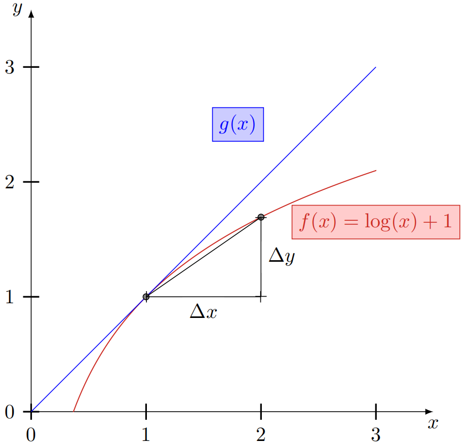
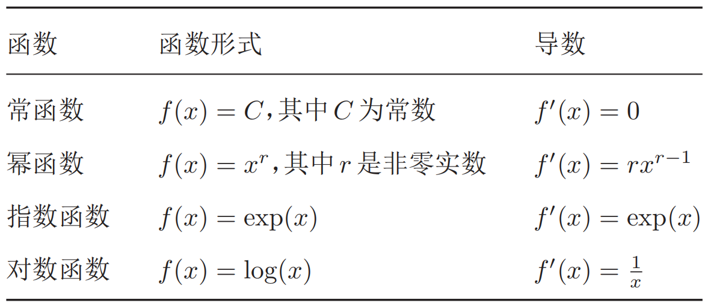
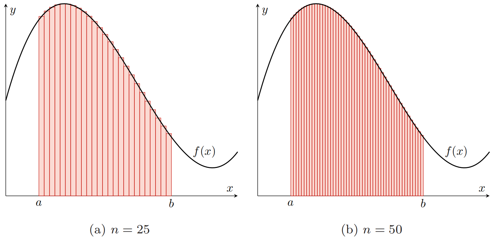

## 数理基础2 微积分

**微积分(calculus)**是研究函数的**微分(differentiation)**、**积分(integration)**及其相关应用的数学分支。

### 2.1 微分

#### 2.1.1 导数

对于定义域和值域都是实数域的函数$f: \mathbb R \rightarrow \mathbb R$，若$f(x)$在点$x_0$的某个邻域$\Delta x$内，极限
$$
f^{\prime}(x_{0})=\lim _{\Delta x \rightarrow 0} \frac{f(x_{0}+\Delta x)-f(x_{0})}{\Delta x}
$$
存在，则称函数$f(x)$在点$x_0$处可导，$f^{\prime}(x_0)$称为其**导数(derivative)**，或**导函数**，也可以记为${\text d f(x_0)}/{\text d x}$。在几何上，导数可以看做函数曲线上的切线斜率。下图给出了一个函数导数的可视化示例，其中函数$g(x)$的斜率为函数$f(x)$在点$x$的导数，$\Delta y=f(x+\Delta x)-f(x)$。



下表中给出了几个机器学习领域常见函数的导数：



**高阶导数**：对一个函数的导数继续求导，可以得到高阶导数。函数$f(x)$的导数$f^\prime(x)$称为一阶导数，$f^\prime(x)$的导数称为**二阶导数**，记为$f^{\prime\prime}(x)$、$f^{(2)}(x)$或$\text d^2f(x)/\text d x^2$。

**偏导数(partial derrivative)**：对于一个多元变量函数$f:\mathbb R^d \rightarrow \mathbb R$，其偏导数是关于其中一个变量$x_i$的导数，而保持其他变量固定，可以记为$f_{x_{i}}^{\prime}(\boldsymbol{x})$，$\nabla_{x_{i}} f(\boldsymbol{x})$或$\partial f(\boldsymbol x)/\partial x_i$。

#### 2.1.2 微分

给定一个连续函数，计算其导数的过程称为**微分(differentiation)**。若函数$f(x)$在其定义域包含的某区间内每一个点都可导，那么也可以说函数$f(x)$在这个区间内可导。如果一个函数$f(x)$在定义域中的所有点都存在导数，则$f(x)$为**可微函数(differentiable function)**。可微函数一定连续，但连续函数不一定可微。例如函数$|x|$为连续函数，但在点$x=0$处不可导。

#### 2.1.3 泰勒公式

**泰勒公式(Taylor's formula)**是一个函数$f(x)$在已知某一点的各阶导数值的情况之下，可以用这些导数值作系数构建一个多项式来近似函数在这一点的邻域中的值。如果函数$f(x)$在$a$点处$n$次可导$(n \geqslant 1)$，在一个包含点$a$的区间上的任意$x$，都有：
$$
\begin{aligned}
f(x)=f(a)+& \frac{1}{1 !} f^{\prime}(a)(x-a)+\frac{1}{2 !} f^{(2)}(a)(x-a)^{2}+\cdots \\
&+\frac{1}{n !} f^{(n)}(a)(x-a)^{n}+R_{n}(x)
\end{aligned}
$$
其中$f^{(n)}(a)$表示函数$f(x)$在点$a$的$n$阶导数。上式中的多项式部分称为函数$f(x)$在$a$出的$n$阶泰勒展开式，剩余的$R_n(x)$是泰勒公式的余项，是$(x-a)^n$的高阶无穷小。

```python
# sympy实现自动微分
import sympy

# 使用diff()函数来计算导数
x = sympy.Symbol('x')
f1 = 2 * x ** 4 + 3 * x + 6
f1_ = sympy.diff(f1, x)
print(f1_)

f2 = sympy.sin(x)
f2_ = sympy.diff(f2, x)
print(f2_)

# 计算偏导数
y = sympy.Symbol('y')
f3 = 2 * x ** 2 + 3 * y ** 4 + 2 * y
# 分别计算函数f3对于变量x和y的偏导数
f3_x = sympy.diff(f3, x)
f3_y = sympy.diff(f3, y)
print('partial derivative of x: ', f3_x)
print('partial derivative of y: ', f3_y)

# 链式法则
x = sympy.Symbol('x')
u = sympy.sin(x)
v = u ** 2
print(sympy.diff(v, x))
```

### 2.2 积分

积分(integration)是微分的逆过程，即如何从导数推算出原函数。积分通常可以分为**定积分(definite integral)**和**不定积分(indefinite integral)**。

函数$f(x)$的不定积分可以写为：
$$
F(x)=\int f(x) \mathrm{d} x
$$
其中$F(x)$称为$f(x)$的**原函数**或反导函数，$\text d x$表示积分变量为$x$。当$f(x)$是$F(x)$的导数时，$F(x)$是的不定积分。根$f(x)$据导数的性质，一个函数$f(x)$的不定积分是不唯一的。若$F(x)$是$f(x)$的不定积分，$F(x)+C$也是$f(x)$的不定积分，其中$C$为一个常数。

给定一个变量为$x$的实值函数$f(x)$和闭区间$[a,b]$，定积分可以理解为在坐标平面上由$f(x)$，垂直直线$x=a,x=b$以及$x$轴围起来的区域的带符号的面积，记为：
$$
\int_{a}^{b} f(x) \mathrm{d} x
$$
带符号的面积表示$x$轴以上的面积为正，$x$轴以下的面积为负。

积分的定义有很多种，最常见的积分定义之一是**黎曼积分(Riemann integral)**。对于闭区间$[a,b]$，我们定义$[a,b]$的一个分割为此区间中取一个有限的点列$a=x_{0}<x_{1}<x_{2}<\ldots<x_{n}=b$。这些点将区间$[a,b]$分割为$n$个子区间$[x_{i-1},x_i]$，其中$1\leqslant i \leqslant n$。每个区间取出一个点$t \in [x_{i-1},x_i]$作为代表。在这个分割上，函数$f(x)$的**黎曼和**定义为：

$$
\sum_{i=1}^{n} f(t_{i})(x_{i}-x_{i-1})
$$
即**所有子区间的带符号面积之和**。

不同分割的黎曼和不同。当$n$足够大时，如果黎曼和趋于某个极限，那么这个极限就叫做函数$f(x)$在闭区间$[a,b]$上的黎曼积分。下图给出了不同分割的黎曼和示例：



### 2.3 矩阵微积分

为了方便并行计算，有时会把单个函数对多个变量或者多元函数对单个变量的偏导数写成向量和矩阵的形式，使其可以被当成一个整体处理。**矩阵微积分(matrix calculus)**是多元微积分的一种表达方式，即**使用矩阵和向量来表示因变量每个成分关于自变量每个成分的偏导数**。

#### 2.3.1 向量求导

矩阵微积分的表示通常由两种符号约定：**分子布局(numerator layout)**和**分母布局(demoninator layout)**。两者的区别是导数的结果写成列向量还是行向量。**一般默认采用分母布局**。

##### 标量关于向量的偏导数

对于一个$p$维向量$\boldsymbol{x} \in \mathbb{R}^{p}$，函数 $y=f(\boldsymbol{x})=f\left(x_{1}, \cdots, x_{p}\right) \in\mathbb{R}$，则$y$关于$\boldsymbol{x}$的偏导数为：
$$
\begin{aligned}
&\text { 分母布局 } \quad \frac{\partial y}{\partial \boldsymbol{x}}=\left[\frac{\partial y}{\partial x_{1}}, \cdots, \frac{\partial y}{\partial x_{p}}\right]^{\mathrm{T}}  \in \mathbb{R}^{p \times 1}\\
&\text { 分子布局 } \quad \frac{\partial y}{\partial \boldsymbol{x}}=\left[\frac{\partial y}{\partial x_{1}}, \cdots, \frac{\partial y}{\partial x_{p}}\right] \ \ \in \mathbb{R}^{1 \times p}
\end{aligned}
$$
分母布局为列向量，分子布局为行向量。

##### 向量关于标量的偏导数

对于一个标量$x \in \mathbb{R}$，函数$\boldsymbol{y}=f(x) \in \mathbb{R}^{q}$，则$\boldsymbol{y}$关于$x$的偏导数为：
$$
\begin{aligned}
&\text { 分母布局 } \quad \frac{\partial \boldsymbol{y}}{\partial x}=\left[\frac{\partial y_{1}}{\partial x}, \cdots, \frac{\partial y_{q}}{\partial x}\right] \quad \in \mathbb{R}^{1 \times q}\\
&\text { 分子布局 } \quad \frac{\partial \boldsymbol{y}}{\partial x}=\left[\frac{\partial y_{1}}{\partial x}, \cdots, \frac{\partial y_{q}}{\partial x}\right]^{\mathrm{T}} \ \ \in \mathbb{R}^{q \times 1}
\end{aligned}
$$
与标量关于向量的偏导数相反，分母布局为行向量，分子布局为列向量。

##### 向量关于向量的偏导数

对于一个$d$维向量$\boldsymbol{x} \in \mathbb{R}^{p}$，函数$\boldsymbol{y}=f(\boldsymbol{x}) \in \mathbb{R}^{q}$的值也为一个向量，则$f(\boldsymbol{x})$关于$\boldsymbol{x}$的偏导数(**分母布局**)为：
$$
\frac{\partial f(\boldsymbol{x})}{\partial \boldsymbol{x}}=\left[\begin{array}{ccc}
\frac{\partial y_{1}}{\partial x_{1}} & \cdots & \frac{\partial y_{q}}{\partial x_{1}} \\
\vdots & \vdots & \vdots \\
\frac{\partial y_{1}}{\partial x_{p}} & \cdots & \frac{\partial y_{q}}{\partial x_{p}}
\end{array}\right] \in \mathbb{R}^{p \times q}
$$
该矩阵称为**雅克比矩阵(Jacobian matrix)**。

#### 2.3.2 导数法则

(1) **加减法则**：若$\boldsymbol{x} \in \mathbb{R}^{p}, \boldsymbol{y}=f(\boldsymbol{x}) \in \mathbb{R}^{q}, \boldsymbol{z}=g(\boldsymbol{x}) \in \mathbb{R}^{q}$，则：
$$
\frac{\partial(\boldsymbol{y}+\boldsymbol{z})}{\partial \boldsymbol{x}}=\frac{\partial \boldsymbol{y}}{\partial \boldsymbol{x}}+\frac{\partial \boldsymbol{z}}{\partial \boldsymbol{x}} \in \mathbb{R}^{p \times q}
$$
(2) **乘法法则**：

若$\boldsymbol{x} \in \mathbb{R}^{p}, \boldsymbol{y}=f(\boldsymbol{x}) \in \mathbb{R}^{q}, \boldsymbol{z}=g(\boldsymbol{x}) \in \mathbb{R}^{q}$，则：
$$
\frac{\partial \boldsymbol{y}^{\mathrm{T}} \boldsymbol{z}}{\partial \boldsymbol{x}}=\frac{\partial \boldsymbol{y}}{\partial \boldsymbol{x}} \boldsymbol{z}+\frac{\partial \boldsymbol{z}}{\partial \boldsymbol{x}} \boldsymbol{y} \in \mathbb{R}^{p}
$$
若 $\boldsymbol{x} \in \mathbb{R}^{p}, \boldsymbol{y}=f(\boldsymbol{x}) \in \mathbb{R}^{s}, \boldsymbol{z}=g(\boldsymbol{x}) \in \mathbb{R}^{t}, A \in \mathbb{R}^{s \times t}$和$\boldsymbol{x}$无关，则：
$$
\frac{\partial \boldsymbol{y}^{\mathrm{T}} A \boldsymbol{z}}{\partial \boldsymbol{x}}=\frac{\partial \boldsymbol{y}}{\partial \boldsymbol{x}} A \boldsymbol{z}+\frac{\partial \boldsymbol{z}}{\partial \boldsymbol{x}} A^{\mathrm{T}} \boldsymbol{y} \in \mathbb{R}^{p}
$$
若$\boldsymbol{x} \in \mathbb{R}^{p}, y=f(\boldsymbol{x}) \in \mathbb{R}, \boldsymbol{z}=g(\boldsymbol{x}) \in \mathbb{R}^{q}$，则：
$$
\frac{\partial y z}{\partial x}=y \frac{\partial z}{\partial x}+\frac{\partial y}{\partial x} z^{\mathrm{T}} \quad \in \mathbb{R}^{p \times q}
$$
(3) **链式法则(chain rule)**：

若$x \in \mathbb{R}, \boldsymbol{u}=u(x) \in \mathbb{R}^{s}, \boldsymbol{g}=g(\boldsymbol{u}) \in \mathbb{R}^{t}$，则：
$$
\frac{\partial \boldsymbol{g}}{\partial x}=\frac{\partial \boldsymbol{u}}{\partial x} \frac{\partial \boldsymbol{g}}{\partial \boldsymbol{u}} \in \mathbb{R}^{1 \times t}
$$
若$\boldsymbol{x} \in \mathbb{R}^{p}, \boldsymbol{y}=g(\boldsymbol{x}) \in \mathbb{R}^{s}, \boldsymbol{z}=f(\boldsymbol{y}) \in \mathbb{R}^{t}$，则：
$$
\frac{\partial \boldsymbol{z}}{\partial \boldsymbol{x}}=\frac{\partial \boldsymbol{y}}{\partial \boldsymbol{x}} \frac{\partial \boldsymbol{z}}{\partial \boldsymbol{y}} \in \mathbb{R}^{p \times t}
$$
若$X \in \mathbb{R}^{p \times q}$为矩阵，$\boldsymbol{y}=g(X) \in \mathbb{R}^{s}, z=f(\boldsymbol{y}) \in \mathbb{R}$，则：
$$
\frac{\partial z}{\partial X_{i j}}=\frac{\partial \boldsymbol{y}}{\partial X_{i j}} \frac{\partial z}{\partial \boldsymbol{y}}
$$

#### 2.3.3 常见函数的导数

(1) **向量函数**及其导数：
$$
\begin{aligned} \frac{\partial \boldsymbol{x}}{\partial \boldsymbol{x}} &=I \\ \frac{\partial A \boldsymbol{x}}{\partial \boldsymbol{x}} &=A^{\mathrm{T}} \\ \frac{\partial \boldsymbol{x}^{\mathrm{T}} A}{\partial \boldsymbol{x}} &=A \end{aligned}
$$
(2) **按位计算的向量函数**及其导数：

假设一个函数$f(x)$的输入是标量$x$。对于一组$K$个标量$x_1,\cdots,x_K$，我们可以通过$f(x)$得到另外一组$K$个标量，即$z_1,\cdots,z_K$，$z_k=f(x_k)$。向量形式为$\boldsymbol z=f(\boldsymbol x)$，其中$f$是按位计算的函数。$f(\boldsymbol x)$对$\boldsymbol x$的导数为：
$$
\begin{aligned} \frac{\partial f(\boldsymbol{x})}{\partial \boldsymbol{x}} &=\left[\frac{\partial f\left(x_{j}\right)}{\partial x_{i}}\right]_{K \times K} \\ &=\left[\begin{array}{cccc}f^{\prime}\left(x_{1}\right) & 0 & \cdots & 0 \\ 0 & f^{\prime}\left(x_{2}\right) & \cdots & 0 \\ \vdots & \vdots & \vdots & \vdots \\ 0 & 0 & \cdots & f^{\prime}\left(x_{K}\right)\end{array}\right] \\ &=\operatorname{diag}\left(f^{\prime}(\boldsymbol{x})\right) \end{aligned}
$$

```python
# sympy实现积分
import sympy

# 使用integrate()函数来计算定积分和不定积分
x = sympy.Symbol('x')
f = 2 * x
res = sympy.integrate(f, (x, 0, 1))  # 定积分，传入一个元组
print(res)  # 1

f = sympy.E ** x + 2 * x
res = sympy.integrate(f, x)  # 不定积分，只传入变量
print(res)  # x**2 + exp(x)
```

使sympy库还可以实现其他常用的代数操作：

```python
# sympy库实现表达式求值，方程组求解，数列求和以及求极限
import sympy

# 1. 表达式求值
# 定义单变量函数
x = sympy.Symbol('x')
fx = 5 * x + 4
# 使用evalf()函数来对变量传值
res = fx.evalf(subs={x: 6})
print(res)

# 定义多变量函数
x = sympy.Symbol('x')
y = sympy.Symbol('y')
fxy = x * x + y * y
res = fxy.evalf(subs={x: 2, y: 1})
print(res)

# 2. 方程组求解
# 单个方程的情况
x = sympy.Symbol('x')
y = sympy.Symbol('y')
fx = 3 * x + 9
print(sympy.solve(fx, x))  # [-3]

# 无穷多个解的情况，可以得到变量之间的关系
x = sympy.Symbol('x')
y = sympy.Symbol('y')
fx = x * 3 + y ** 2
print(sympy.solve(fx, x, y))  # [{x: -y**2/3}]

# 方程组的情况
x = sympy.Symbol('x')
y = sympy.Symbol('y')
f1 = x + y - 3
f2 = x - y + 5
print(sympy.solve([f1, f2], [x, y]))  # {x: -1, y: 4}

# 3. 数列求和
n = sympy.Symbol('n')
f = n
res = sympy.summation(f, (n, 1, 100))
print(res)  # 5050

# 求解带有求和形式的方程
x = sympy.Symbol('x')
i = sympy.Symbol('i')
f = sympy.summation(x, (i, 1, 5)) + 10 * x - 15
res = sympy.solve(f, x)
print(res)  # [1]

# 4. 求极限
x = sympy.Symbol('x')
f = (1 + x) ** (1 / x)
lim = sympy.limit(f, x, 0)
print(lim)
```

### 参考资料

- 邱锡鹏. 神经网络与深度学习. 北京: 机械工业出版社, 2020.
- Sympy官方文档：https://docs.sympy.org/latest/index.html

