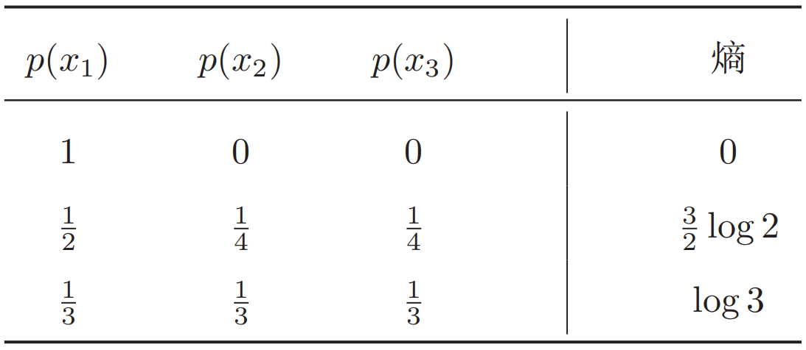

## 数理基础5 信息论

**信息论(information theory)**是数学、物理、计算机科学等多个学科的交叉领域。信息论是由Claude Shannon最早提出的，主要研究信息的量化、存储和通信等方法。这里，**“信息”是指一组消息的集合**。假设在一个噪声通道上发送消息，我们需要考虑如何对每一个信息进行编码、传输以及解码，使得接收者可以尽可能准确地重构出消息。在机器学习相关领域，信息论也有着大量的应用。比如**特征抽取、统计推断、自然语言处理**等。

### 5.1 熵

**熵(entropy)**最早是物理学的概念，用于表示一个**热力学系统的无序程度**。在信息论中，熵用来衡量一个随机事件的不确定性。

#### 5.1.1 自信息和熵

**自信息(self information)**表示一个随机事件所包含的信息量。一个随机事件发生的概率越高，其自信息越低。如果一个事件必然发生，则其自信息为0。对于一个随机变量$X$(取值集合为$\mathcal X$，概率分布为$p(x)$)，当$X=x$时的自信息$I(x)$定义为：$I(x)=-\log p(x)$。在自信息的定义中，对数的底可以使用2、自然常数$e$或是10。当以2为底时，自信息的单位为bit；当以$e$为底时，自信息的单位为nat。

对于分布为$p(x)$的随机变量$X$，其**自信息的数学期望**，即**熵(entropy)**$H(X)$定义为：
$$
\begin{aligned}
H(X) &=\mathbb{E}_{X}[\mathrm{I}(x)] \\
&=\mathbb{E}_{X}[-\log p(x)] \\
&=-\sum_{x \in \mathcal{X}} p(x) \log p(x)
\end{aligned}
$$
熵越高，则随机变量的信息越多；熵越低，则随机变量的信息越少。如果随机变量$X$当且仅当在$x$时$p(x)=1$，则其熵为0。也就是说，对于一个确定的信息，其熵为0，信息量也为0.如果其概率分布为一个均匀分布，则熵最大。

```python
import math

# 计算不同概率分布的熵
p1 = [0.1, 0.3, 0.6]
p2 = [0.33, 0.33, 0.34]
p3 = [0.0, 0.0, 1]


def entropy(p):
    ent = 0.0
    for i in range(len(p)):
        if p[i] != 0:
            ent += p[i] * math.log2(p[i])
    if ent != 0.0:
        return -ent
    else:
        return 0.0


print(entropy(p1))
print(entropy(p2))
print(entropy(p3))
```

假设一个随机变量$X$有三种可能取值$x_1,x_2,x_3$，不同概率分布对应的熵如下：



#### 5.1.2 熵编码

信息论的研究目标之一是如何用最少的编码表示传递信息。假设我们要传递一段文本信息，这段文本中包含的符号都来自于一个字母表$\mathcal A$，我们就需要对字母表$\mathcal A$中的每个符号进行编码。以二进制编码为例，**我们常用的ASCII码就是用固定的8bits来编码每个字母**。但这种固定长度的编码方案不是最优的。一种高效的编码原则是，**字母的出现概率越高，其编码长度越短**。比如对字母$a, b, c$分别编码为0*,* 10*,* 110。给定一串要传输的文本信息，其中字母$x$的出现概率为$p(x)$，其最佳编码长度为$-\log_2p(x)$，整段文本的平均编码长度为$-\sum_{x} p(x) \log _{2} p(x)$，即底为2的熵。

在对分布$p(x)$的符号进行编码时，熵$H(p)$也是理论上**最优平均编码长度**，这种编码方式称为**熵编码(entropy encoding)**。由于每个符号的自信息通常都不是整数，因此在实际编码中很难达到理论上的最优值。**霍夫曼编码(Huffman coding)和算术编码(arithmetic coding)**是两种最常见的熵编码技术。

#### 5.1.3 联合熵和条件熵

对于两个离散型随机变量$X$和$Y$，假设$X$的取值集合为$\mathcal X$；$Y$的取值集合为$\mathcal Y$，其联合概率分布为$p(x,y)$，则：

(1) $X$和$Y$的**联合熵(joint entropy)**为：
$$
H(X, Y)=-\sum_{x \in \mathcal{X}} \sum_{y \in \mathcal{Y}} p(x, y) \log p(x, y)
$$
(2) $X$和$Y$的**条件熵(conditional entropy)**为：
$$
H(X | Y)=-\sum_{x \in \mathcal{X} \atop y \in \mathcal{Y}} p(x, y) \log p(x | y)=-\sum_{x \in \mathcal{X}} \sum_{y \in \mathcal{Y}} p(x, y) \log \frac{p(x, y)}{p(y)}
$$
根据其定义，条件熵也可写为$H(X|Y)=H(X,Y)-H(Y)$。

### 5.2 互信息

**互信息(mutual information)**是衡量已知一个变量时，另一个变量**不确定性的减少程度**。两个离散型随机变量$X$和$Y$的互信息定义为：
$$
I(X ; Y)=\sum_{x \in \mathcal{X}} \sum_{y \in \mathcal{Y}} p(x, y) \log \frac{p(x, y)}{p(x) p(y)}
$$
互信息的一个性质如下：
$$
\begin{aligned}
I(X ; Y) &=H(X)-H(X | Y) \\
&=H(Y)-H(Y | X)
\end{aligned}
$$
如果变量$X$和$Y$相互独立，它们的互信息为0。

### 5.3 交叉熵和散度

#### 5.3.1 交叉熵

对于分布为$p(x)$的随机变量，熵$H(p)$表示其最有编码长度。**交叉熵(cross entropy)**是按照概率分布$q$的最优编码对真实分布为$p$的信息进行编码的长度，定义为：
$$
\begin{aligned}
H(p, q) &=\mathbb{E}_{p}[-\log q(x)] \\
&=-\sum_{x} p(x) \log q(x)
\end{aligned}
$$
在给定$p$的条件下，如果$q$和$p$越接近，交叉熵越小；如果$q$和$p$越远，交叉熵就越大。交叉熵常用于分类问题的损失函数，其中$p$为数据的**真实标签(真实分布)**，$q$为模型的**预测标签(预测分布)**。

```python
# 交叉熵的实现(交叉熵广泛应用于机器学习中的多分类任务)
p_label = [1.0, 0.0, 0.0, 0.0, 0.0]
p_predict = [0.78, 0.11, 0.02, 0.06, 0.03]


def cross_entropy(p, q):
    ent = 0.0
    assert len(p) == len(q)
    for i in range(len(p)):
        if q[i] != 0:
            ent += p[i] * math.log2(q[i])
    if ent != 0.0:
        return -ent
    else:
        return 0.0


print(cross_entropy(p_label, p_predict))
```

#### 5.3.2 KL散度

**KL散度(Kullback-Leibler divergence)**，也叫KL距离或相对熵(relative entropy)，是用概率分布$q$来近似$p$时所造成的的信息损失量。KL散度是按照概率分布$q$的最优编码对真实分布为$p$的信息进行编码，其平均编码长度(即交叉熵)$H(p,q)$和$p$的最优平均编码长度(即熵)$H(p)$之间的差异。对于离散概率分布$p$和$q$，从$p$到$q$的KL散度定义为：
$$
\begin{aligned}
D_{\mathrm{KL}}(p \| q) &=H(p, q)-H(p) \\
&=\sum_{x} p(x) \log \frac{p(x)}{q(x)}
\end{aligned}
$$
为了保证连续性，定义$0\log \frac{0}{0}=0,0\log \frac{0}{q}=0$。

**KL散度可以衡量两个概率分布之间的距离**。KL散度总是非负的，如果两个分布越接近，则KL散度越小；如果两个分布越远，KL散度就越大。但是KL散度并不是一个真正的度量或距离，一是**KL散度不满足距离的对称性**，二是**KL散度不满足距离的三角不等式性质**。

#### 5.3.3 JS散度

**JS散度(Jensen-Shannon divergence)**是一种对称的的衡量两个分布的相似度的度量方式，其定义为：
$$
D_{\mathrm{JS}}(p \| q)=\frac{1}{2} D_{\mathrm{KL}}(p \| m)+\frac{1}{2} D_{K L}(q \| m)
$$
其中$m=\frac{1}{2}(p+q)$。

JS散度是KL散度的一种改进，但两种散度都存在一个问题，即如果两布$p,q$**没有重叠或者重叠非常少时**，KL散度和JS散度都**很难衡量两个分布的距离**。

### 参考资料

- 邱锡鹏. 神经网络与深度学习. 北京: 机械工业出版社, 2020.

- 交叉熵详解：https://zhuanlan.zhihu.com/p/61944055

- 概念链(信息量→熵→KL散度→交叉熵)：https://blog.csdn.net/tyhj_sf/article/details/84933972

