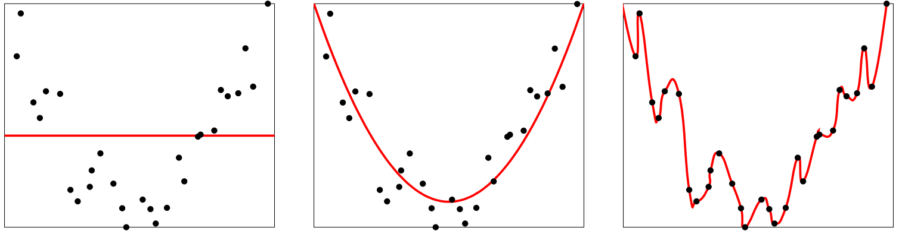
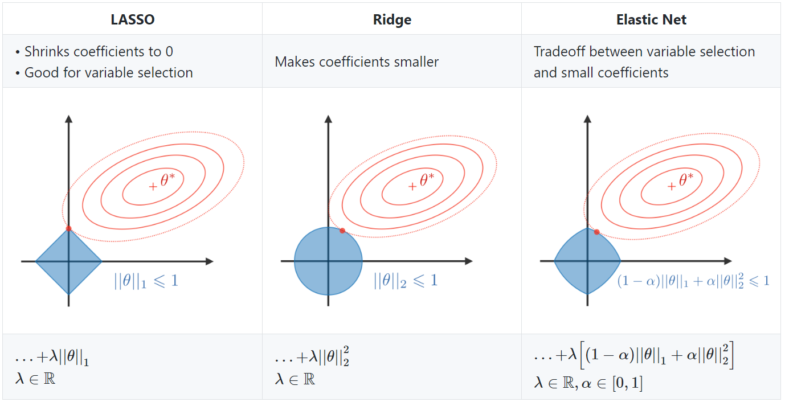
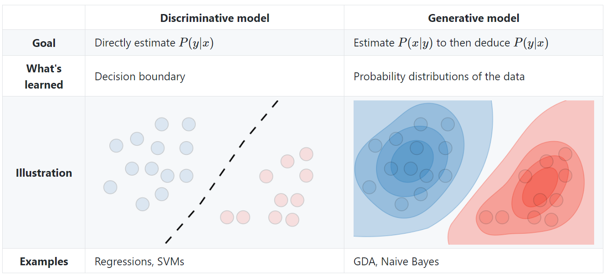
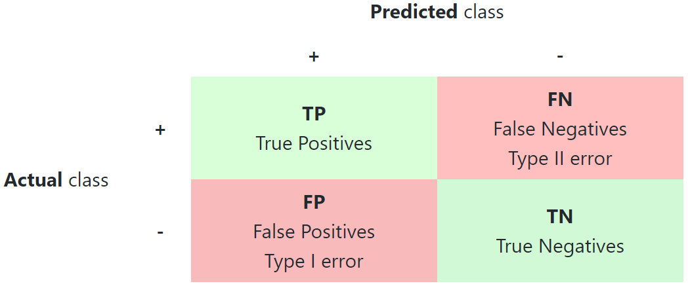
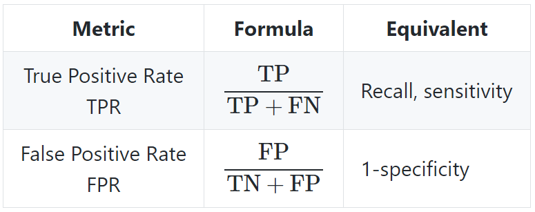
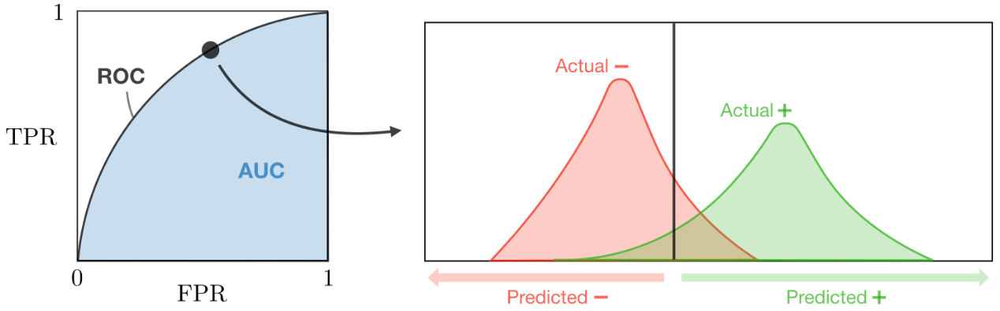
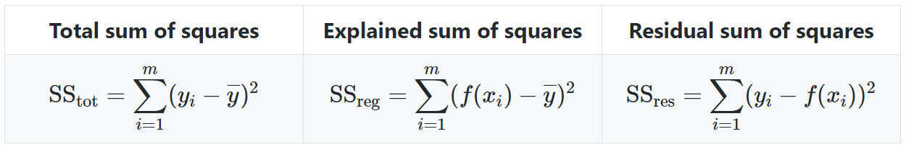

## 机器学习基础

### 人工智能

**智能(intelligence)**是现代生活中很常见的一个词，比如智能手机、智能家居、智能驾驶等。在不同使用场合中，智能的含义也不太一样。比如“智能手机”中的“智能”一般是指由计算机控制并具有某种智能行为的意思。这里的“计算机控制”+“智能行为”隐含了对人工智能的简单定义。

简单地讲，**人工智能(Artificial Intelligence, AI)**就是让机器具有人类的智能，这也是人们长期追求的目标。这里关于什么是“智能”并没有一个很明确的定义，但一般认为智能(或特指人类智能)是知识和智力的总和，都和大脑的思维活动有关。人类大脑是经过了上亿年的进化才形成了如此复杂的结构，但**至今尚未完全了解**。虽然随着神经科学、认知心理学等学科的发展，人们对大脑的结构有了一定程度的了解，但对大脑的智能究竟怎么产生的还知道的很少。我们并不理解大脑的运作原理，以及如何产生意识、情感、记忆等。因此，**通过“复制”一个人脑来实现人工智能在目前阶段是不切实际的**。

1950年，阿兰·图灵(Alan Turing)发表了一篇有着重要影响力的论文“*Computing Machinery and Intelligence*”，讨论了创造一种“智能机器”的可能性。由于“智能”一词比较难以定义，他提出了著名的**图灵测试(Turing test)**：“一个人在不接触对方的情况下，通过一种特殊的方式，和对方进行一系列的问答。如果在相当长时间内，他无法根据这些问题判断对方是人还是计算机，那么就可以认为这个计算机是智能的”。图灵测试是促使人工智能从哲学探讨到科学研究的一个重要因素，引导了人工智能的很多研究方向。因为要使得计算机能通过图灵测试，计算机必须具备理解语言、学习、记忆、推理、决策等能力。这样，人工智能就延伸出了很多不同的子学科，比如**机器感知(计算机视觉、语音信息处理)，学习(模式识别、机器学习、强化学习)，语言(自然语言处理)、记忆(知识表示)、决策(规划、数据挖掘)**等。所有这些研究领域都可以看成是人工智能的研究范畴。

人工智能是计算机科学的一个分支，主要研究、开发用于模拟、延伸和扩展人类智能的理论、方法、技术及应用系统等。和很多其它学科不同，人工智能这个学科的诞生有着明确的标志性事件，即**1956年的达特茅斯会议**。在这次会议上，“人工智能”被提出并作为本研究领域的名称。同时，人工智能研究的使命也得以确定。John McCarthy提出了人工智能的定义：**人工智能就是要让机器的行为看起来就像是人所表现出的智能行为一样**。 

目前，人工智能的主要领域大体上可以分为以下几个方面： 

(1) **感知**：即模拟人的感知能力，对外部刺激信息(视觉和语音等)进行感知和加工。主要研究领域包括语音信息处理和计算机视觉等。(2) **学习**：即模拟人的学习能力，主要研究如何从样例或与环境交互中进行学习。主要研究领域包括监督学习、无监督学习和强化学习等。(3) **认知**：即模拟人的认知能力，主要研究领域包括知识表示、自然语言理解、推理、规划、决策等。

人工智能的**发展简史**如下：

### 统计学习

**统计学习(statistical learning)**是关于计算机基于数据构建概率统计模型并运用模型对数据进行预测与分析的一门学科。统计学习也称为**统计机器学习(statistical machine learning)**。

统计学习研究对象是**数据(data)**。它从数据出发，提取数据的特征，抽象出数据的模型，发现数据中的知识，又回到对数据的分析与预测中去。统计学习**关于数据的基本假设：同类数据具有一定统计规律性**。

统计学习方法可以概况如下：从给定的、有限的、用于学习的**训练数据(training data)集合**出发，**假设数据是独立同分布产生的**；并且假设要学习的模型属于某个函数的集合，称为**假设空间(hypothesis space)**；应用某个评价准则，从假设空间中选取一个最优模型，使它对已知训练数据及未知的**测试数据(test data)**在给定的评价准则下有最优的预测；最优模型的选取由算法实现。这样，统计学习方法包括模型的假设空间、模型选择的准则以及模型学习的算法。其称为统计学习的三要素，简称为**模型(model)、策略(strategy)和算法(algorithm)**。

实现统计学习方法的一般步骤如下：

​    (1) 得到一个有限的**训练数据集合**；

​    (2) 确定包含所有偶可能的模型的**假设空间**，即学习模型的集合；

​    (3) 确定模型选择的准则，即学习的**策略**；

​    (4) 实现求解最优模型的算法，即学习的**算法**；

​    (5) 通过学习方法**选择最优模型**；

​    (6) 利用学习的最优模型**对新数据进行预测或分析**。

统计学习研究包括**统计学习方法、统计学习理论以及统计学习应用**三个方面。统计学习方法的研究旨在开发新的学习方法；统计学习理论的研究在于探求统计学习方法的有效性与效率，以及统计学习的基本理论问题；统计学习应用的研究主要考虑将统计学习方法应用到实际问题。

以一个生活中的例子来介绍机器学习中的一些基本概念：包括样本、特征、标签、模型、学习算法等。假设我们要到市场上购买芒果，但是之前毫无挑选芒果的经验，那么我们如何通过学习来获取这些知识？

首先，我们从市场上随机选取一些芒果，列出每个芒果的特征(feature)，包括颜色、大小、形状、产地、品牌，以及我们需要预测的标签(label)。标签可以是**连续值**(比如关于芒果的甜度、水分以及成熟度的综合打分)，也可以是**离散值**(比如“好”“坏”两类标签)。这里，每个芒果的标签可以通过直接品尝来获得，也可以通过请一些经验丰富的专家来进行标记。

一个标记好特征以及标签的芒果可以看作是一个**样本(sample)**。一组样本构成的集合称为**数据集(data set)**。一般将数据集分为两部分：训练集和测试集。**训练集(training set)**中的样本是用来训练模型的，也叫训练样本(training sample)，而**测试集(test set)**中的样本是用来检验模型好坏的，也叫测试样本(test sample)。我们通常用一个$d$维的向量$\boldsymbol x=[x_1,x_2,\cdots,x_d]^T$表示一个芒果的所有**特征**构成的向量，称为**特征向量(feature vector)**，其中每一维表示一个特征。而芒果的**标签**通常用标量$y$来表示。假设训练集由$N$个样本组成，其中每个样本都是**独立同分布(identically and independently distributed, IID)**的，即**独立地从相同的数据分布中抽取的**，记为：

$$
\mathcal D=\{(\boldsymbol x^{(1)}, y^{(1)}),(\boldsymbol x^{(2)}, y^{(2)}),\cdots,(\boldsymbol x^{(N)}, y^{(N)})\}
$$
给定训练集$\mathcal D$，我们希望让计算机从一个函数集合$\mathcal F=\{f_1(\boldsymbol x),f_2(\boldsymbol x),\cdots\}$中自动寻找一个**“最优”的函数**$f^*(\boldsymbol x)$来近似每个样本特征向量$\boldsymbol x$和标签$y$之间的真实映射关系。对于一个样本$\boldsymbol x$，我们可以通过函数$f^*(\boldsymbol x)$来预测其**标签的值**$\hat{y}=f^*(\boldsymbol x)$或**标签的条件概率**$\hat{p}(y|\boldsymbol x)=f^*_y(\boldsymbol x)$。

如何寻找这个最优的函数是机器学习的关键，一般需要通过**学习算法(learning algorithm)**来完成。这个寻找的过程通常称为学习(learning)或训练(training)过程。

这样，下次从市场上购买芒果(测试样本)时，可以根据芒果的特征，使用学习到的函数$f^*(\boldsymbol x)$来预测芒果的好坏。为了评价的公正性，我们还是独立同分布地抽取一组芒果作为测试集$\mathcal D'$，并在测试集中所有芒果上进行测试，计算预测结果的准确率：
$$
Acc(f^*(\boldsymbol x))=\frac{1}{|\mathcal D'|}\sum_{(\boldsymbol x,y)\in{\mathcal D'}}I(f^*(X)=y)
$$
其中$I(\cdot)$为指示函数，$|\mathcal D'|$为测试集的大小。

下图给出了**机器学习的基本流程**。对一个预测任务，输入特征向量为$\boldsymbol x$，输出标签为$y$，我们选择一个函数集合$\mathcal F$，通过学习算法$\mathcal A$和一组训练样本$\mathcal D$，从$\mathcal F$中学习到函数$f^*(\boldsymbol x)$。对新的输入$\boldsymbol x$，就可以用该函数进行预测。

### 统计学习的分类

统计学习(或机器学习)是一个范围宽阔、内容繁多、应用广泛的领域，目前并不存在一个统一的理论体系涵盖所有内容。下面从几个角度对统计学习方法进行分类。

#### 基本分类

##### 1. 监督学习

**监督学习(supervised learning)**是指从标注数据中学习预测模型的机器学习问题。标注数据表示输入输出的对应关系，预测模型对给定的输入产生相应的输出。**监督学习的本质是学习输入到输出的映射的统计规律**。

###### (1) 输入空间、特征空间和输出空间

**输入空间(input space)**和**输出空间(output space)**分别指的是**输入与输出所有可能取值的集合**。输入与输出空间可以是有限元素的集合(离散值)，也可以是整个欧式空间(连续值)。输入空间与输出空间可以是同一个空间，也可以是不同的空间，但**通常输出空间远远小于输入空间**。

有时假设输入空间和**特征空间**为相同的空间，对它们不予区分；有时假设输入空间与特征空间为不同的空间，将实例从输入空间映射到特征空间。模型实际上都是定义在特征空间上的。**在监督学习中，将输入与输出看作是定义在输入(特征)空间与输出空间上的随机变量的取值**。输入输出变量用大写字母表示，习惯上输入变量写作$X$，输出变量写作$Y$。输入输出变量的取值用小写字母表示，输入变量的取值写作$x$，输出变量的取值写作$y$。

监督学习从训练数据集合中学习模型，对测试数据进行预测。人们根据输入输出变量的不同类型，对预测人物给予不同的名称：输入变量与输出变量均为连续变量的预测问题称为**回归问题**；输出变量为有限个离散变量的预测问题称为**分类问题**；输入变量与输出变量均为序列的预测问题称为**标注问题**。

###### (2) 联合概率分布

监督学习假设输入与输出的随机变量$X$和$Y$遵循**联合概率分布**$P(X,Y)$。$P(X,Y)$表示分布函数，或分度密度函数。注意在学习过程中，假定这一联合概率分布存在，但对学习系统来说，**联合规律分布的具体定义是未知的**。训练数据与测试数据被看作是依联合概率分布$P(X,Y)$独立同分布产生的。统计学习假设数据存在一定统计规律，$X$和$Y$具有联合概率分布就是**监督学习关于数据的基本假设**。

###### (3) 假设空间

**监督学习的目的在于学习一个由输入到输出的映射**，这一映射由模型来表示。换句话说，学习的目的就在于找到最好的这样的模型。模型属于假设空间，假设空间的确定意味着学习的范围的确定。模型属于输入空间到输出空间的映射的集合，这个集合就是假设空间。比如，线性回归中的$y=\boldsymbol w x+b$就是假设空间，$\boldsymbol w$和$b$为不确定的参数。

监督学习的模型可以是概率模型或非概率模型，由**条件概率分布**$P(y|x)$或**决策函数(decision function)**$y=f(x)$表示，随具体学习方法而定。对具体的输入进行相应的输出预测时，写作$P(y|x)$或$y=f(x)$。

##### 2. 无监督学习

**无监督学习(unsupervised learning)**是指从**无标注数据**中学习预测模型的机器学习问题。无标注护具是自然得到的数据，预测模型表示数据的类别、转换或概率。**无监督学习的本质是学习数据中的统计规律或潜在结构**。

假设$X$是输入空间，$Z$是隐式结构空间。无监督学习要学习的模型可以表示为函数$z=g(x)$，条件概率分布$P(z|x)$或条件概率分布$P(x|z)$。无监督学习的主要任务包括**聚类**和**降维**两种。

##### 3. 强化学习

**强化学习(reinforcement learning)**是指智能系统在与环境的连续互动中学习最优行为策略的机器学习问题。假设只能系统与环境的互动基于**马尔可夫决策过程(Markov decision process)**，只能系统能观测到的是与环境互动得到的数据序列。**强化学习的本质是学习最优的序贯决策**。

##### 4. 半监督学习与主动学习

**半监督学习(semi-supervised learning)**是指利用标注数据和为标注数据学习预测模型的机器学习问题。**通常有少量标注数据、大量未标注数据**，因为标注数据的构建往往需要人工，成本较高，为标注数据的收集不需要提多成本。半监督学习旨在利用未标注数据中的信息，辅助标注数据，进行监督学习，以较低的成本达到较好的效果。**主动学习(active learning)**是指及其不断主动给出实例让教师进行标注，然后利用标注数据学习预测模型的机器学习问题。通常的监督学习使用给定的标注数据，往往是随机得到的，可以看作是“被动学习”；而主动学习的目标是找出对学习最有帮助的实例让教师标注，以较小的标注代价达到较好的学习效果。

#### 按模型分类

##### 1. 概率模型与非概率模型

统计学习模型可以分为**概率模型(probabilistic model)**和**非概率模型(non-probabilistic model)**或者**确定性模型(deterministic model)**。在监督学习中，概率模型取概率分布形式$P(y|x)$，非概率模型取函数形式$y=f(x)$。在无监督学习中，概率模型取条件概率分布形式$P(z|x)$或$P(x|z)$，非概率模型取函数形式$z=g(x)$。

常见的概率模型有决策树、朴素贝叶斯、隐马尔可夫模型、条件随机场、概率潜在语义分析、潜在狄利克雷分配、高斯混合模型等；常见的非概率模型有感知机、支持向量机、$k$近邻、AdaBoost、$k$均值、潜在语义分析、神经网络等。**逻辑回归既可以看作是概率模型，又可看作是非概率模型**。

条件概率分布$P(y|x)$和判别函数$y=f(x)$可以相互转化(条件概率分布$P(y|x)$和函数$z=g(x)$同样可以)。具体地，**条件概率分布最大化(argmax)后得到函数，函数归一化(概率总和为1)后得到条件概率分布**。所以，概率模型与非概率模型不在于输入与输出之间的映射关系，而在于模型的内在结构。概率模型一定可以表示为联合概率分布的形式，其中的变量表示输入、输出、隐变量甚至参数。而针对非概率模型则不应存在这样的联合概率分布。

概率模型的代表是**概率图模型(probabilistic graphical model)**，概率图模型是**联合概率分布由有向图或者无向图表示的概率模型**么人联合概率分布可以根据图的结构分解为因子乘积的形式。贝叶斯网络、马尔可夫随机场、条件随机场是概率图模型。无论模型如何复杂，均可以用最基本的**加法规则和乘法规则**进行概率推理：
$$
Addition\ Rule: P(x)=\sum_{y}P(x,y)
\\Multiplication\ Rule: P(x,y)=P(x)P(y|x)
$$
其中$x$和$y$是随机变量。

##### 2. 线性模型与非线性模型

统计学习模型，特别是非概率模型，可以分为**线性模型(linear model)**和**非线性模型(non-linear model)**。如果函数$y=f(x)$或$z=g(x)$为线性函数，则称模型是线性的，否则模型是非线性的。

常见的线性模型有感知机、线性支持向量机、$k$近邻、$k$均值、潜在语义分析等，常见的非线性模型有核函数支持向量机、AdaBoost、神经玩过等。**深度学习**实际是复杂神经网络的学习，也就是复杂的非线性模型的学习。

##### 3. 参数化模型与非参数化模型

统计学习模型又可以分为**参数化模型(parametric model)**和**非参数化模型(non-parametric model)**。参数化模型假设模型**参数的维度固定**，模型可以由有限维参数完全刻画；非参数化模型假设模型**参数的维度不固定**或者说无穷大，随着训练数据的增加而不断增大。

常见的参数化模型有感知机、朴素贝叶斯、逻辑回归、$k$均值、高斯混合模型等；常见的非参数化模型有决策树、支持向量机、AdaBoost、$k$近邻、潜在语义分析、概率潜在语义分析、潜在狄利克雷分配等。参数化模型适合问题简单的情况，现实中问题往往比较复杂，非参数化模型更加有效。

#### 按算法分类

统计学习根据算法可分为**在线学习(online learning)**与**批量学习(batch learning)**。在线学习指每次接受**一个样本**，进行预测，之后学习模型，并不断重复该操作。批量学习一次接受所有数据，学习模型，再进行预测。有些应用场景要求模型必须在线学习，比如数据依次到达无法存储，数据规模过于庞大，或者数据的模式随时间动态变化(不满足独立同分布假设)。

在线学习可以是监督学习，也可以是无监督学习。强化学习本身就拥有在线学习的特点。**利用随机梯度下降的感知机学习算法就是在线学习算法**。在线学习通常比批量学习更难，很难学到预测准确率更高的模型，因为每次模型更新中，可利用的数据有限。

#### 按技巧分类

##### 1. 贝叶斯学习

**贝叶斯学习(Bayesian learning)**，又称**贝叶斯推理(Bayesian inference)**，其主要想法是，在概率模型的学习和推理中，利用贝叶斯定理，**计算在给定数据条件下模型的条件概率**，即**后验概率**，并应用这个原理进行模型的估计，以及对数据的预测。将模型、未观测要素及其参数用变量表示，使用模型的先验分布是贝叶斯学习的特点。

假设随机变量$D$表示数据，随机变量$\theta$表示参数。根据贝叶斯定理，可以用以下公式计算后验概率$P(\theta|D)$：
$$
P(\theta|D)=\frac{P(\theta)P(D|\theta)}{P(D)}
$$
其中，$P(\theta)$是**先验概率**，$P(D|\theta)$是**似然函数**。模型估计时，估计整个后验概率分布$P(\theta|D)$。如果需要给出一个模型，通常**取后验概率最大的模型**。预测时，计算**数据对后验概率分布的期望值**：
$$
P(x|D)=\int{P(x|\theta,D)P(\theta,D)d\theta}
$$
这里$x$是新样本。

贝叶斯估计与极大似然估计在思想上有很大不同，代表统计学中**频率学派**和**贝叶斯学派**对统计的不同认识。其实，可以简单地把二者联系起来：假设先验分布是均匀分布，取后验概率最大，就能从贝叶斯估计得到极大似然估计：
$$
Maximum\ Likelihood\ Estimation:\hat{\theta}=\arg\underset{\theta} \max P(D|\theta)
\\Bayesian\ Estimation:\hat{P}(\theta|D)=\frac{P(D|\theta)P(\theta)}{P(D)}
$$
总的来说，极大似然估计直接取使得似然函数最大的$\theta$，而贝叶斯估计对$\theta$进行概率密度估计，取后验概率最大。

##### 2. 核方法

**核方法(kernel method)**是使用核函数表示和学习非线性模型的一种机器学习方法，可以用于监督学习和无监督学习。将线性模型扩展到非线性模型，直接的做法是**显式地定义从输入空间(低维空间)到特征空间(高维空间)的映射**，在特征空间中进行内积计算。核方法的技巧在于不显式地定义这个映射，而是**直接定义核函数**，即映射之后在特征空间的内积。这样可以简化计算。

假设$x_1$和$x_2$是输入空间的任意两个实例(向量)，其内积是$\langle x_1,x_2 \rangle$。假设从输入空间到特征空间的映射是$\varphi$，于是$x_1$和$x_2$在**特征空间的映像**是$\varphi(x_1)$和$\varphi(x_2)$，其内积是$\langle \varphi(x_1),\varphi(x_2) \rangle$。核方法直接在输入空间中定义核函数$K(x_1,x_2)$，使其满足$K(x_1,x_2)=\langle \varphi(x_1),\varphi(x_2) \rangle$。

### 统计学习三要素

统计学习三要素可以简单地表示为：**方法 = 模型(model) + 策略(strategy) + 算法(algorithm)**。

#### 模型

在监督学习中，模型就是所要学习的条件概率分布或决策函数。模型的假设空间包含所有可能的条件概率分布或决策函数。例如，假设决策函数是输入变量的线性函数，那么模型的假设空间就是所有这些线性函数构成的函数集合，假设空间中的模型一般有无穷多个。假设空间用$F$表示，可以定义为**决策函数的集合**：
$$
\mathcal F=\{f|Y=f(X)\}
$$
其中$X$和$Y$是定义在输入空间$\mathcal X$和输出空间$\mathcal Y$上的变量。这时$\mathcal F$通常是一个参数向量决定的函数族：
$$
\mathcal F=\{f|Y=f_{\theta}(X),\theta \in \textbf R^n\}
$$
参数向量$\theta$取值于$n$维欧式空间，称为**参数空间(parameter space)**。

假设空间也可以定义为条件概率的集合：
$$
\mathcal F =\{P|P(Y|X)\}
$$
其中$X$和$Y$是定义在输入空间$\mathcal X$和输出空间$\mathcal Y$上的变量。这时$\mathcal F$通常是由一个参数向量决定的条件概率分布族：
$$
\mathcal F =\{P_{\theta}|P(Y|X),\theta \in \textbf R^n\}
$$
参数向量$\theta$取值于$n$维欧式空间，称为**参数空间(parameter space)**。

#### 策略

有了模型的假设空间，统计学习接着需要考虑的是**按照什么样的准则学习**或选择最优的模型。

##### 1. 损失函数和风险函数

损失函数度量模型一次预测的好坏，风险函数度量平均意义下模型预测的好坏。

监督学习问题是在假设空间$\mathcal F$中选取模型$f$作为决策函数，对于给定的输入$X$，由$f(X)$给出相应的输出$Y$，则个输出的预测值$f(X)$与真实值$Y$可能一致也可能不一致。**损失函数(loss function)**或**代价函数(cost function)**用来度量预测错误的程度，它是$f(X)$和$Y$的非负实值函数，记作$L(Y,f(X))$。

统计学习中常用的损失函数有以下几种：

(1) 0-1损失函数
$$
\begin{equation}
L(Y,f(X))=\left\{
\begin{aligned}
1  ,\ \ & Y\not=f(X) \\
0  ,\ \ & Y=f(X)
\end{aligned}
\right.
\end{equation}
$$
(2) 平方损失函数
$$
L(Y,f(X))=(Y-f(X))^2
$$
(3) 绝对损失函数
$$
L(Y,f(X))=|Y=f(X)|
$$
(4) 对数损失函数
$$
L(Y,P(Y|X))=-\text{log}P(Y|X)
$$
损失函数越小，模型就越好。由于模型的输入、输出$(X,Y)$是随机变量，遵循联合分布$P(X,Y)$，所以损失函数的期望为：
$$
R_{exp}(f)=E_P[L(Y,f(X))]=\int_{\mathcal X \times \mathcal Y}L(y,f(x))P(x,y)\text{d}x\text{d}y
$$
这时理论上模型$f(X)$关于联合分布$P(X,Y)$的平均意义下的损失，称为**风险函数(risk function)**或**期望损失**。学习的目标就是选择**期望风险最小的模型**。然而由于联合分布$P(X,Y)$是未知的，**期望损失无法直接计算**。

给定一个训练数据集$T=\{(x_1,y_1),(x_2,y_2),\cdots,(x_N,y_N)\}$，模型$f(X)$关于训练数据集的**平均损失**称为**经验风险(empirical risk)**或**经验损失(empirical loss)**：
$$
R_{emp}(f)=\frac{1}{N}\sum_{i=1}^{N}L(y_i,f(x_i))
$$
**期望风险是模型关于联合分布的期望损失，经验风险是模型关于训练样本及的平均损失**。根据**大数定律**，当样本容量$N$趋向于无穷时，**经验风险趋于期望风险**。所以一个很自然的想法是用经验风险估计期望风险。但是，由于现实中训练样本数量有限，所以用经验风险估计期望风险常常并不理想，要对经验风险进行一定的矫正。这就关系到监督学习的两个基本策略：经验风险最小化和结构风险最小化。

##### 2. 经验风险最小化与结构风险最小化

**经验风险最小化(empirical risk minimization, ERM)**认为，经验风险最小的模型是最优的模型：
$$
\underset{f \in \mathcal F}\min \frac{1}{N}\sum_{i=1}^{N}L(y_i,f(x_i))
$$
当样本容量足够大时，经验风险最小化能保证有很好的学习效果，在现实中被广泛采用。例如，极大似然估计MLE就是经验风险最小化的一个例子。

但是，当样本容量很小时，经验风险最小化隵的效果就未必会好，会产生**过拟合(over-fitting)**现象。**结构风险最小化(structural risk minimization, SRM)**策略是为了防止过拟合而提出来的策略。结构风险最小化等价于**正则化(regularization)**或**罚项(penalty term)**：
$$
R_{srm}(f)=\frac{1}{N}\sum_{i=1}^{N}L(y_i,f(x_i))+\lambda J(f)
$$
其中$J(f)$为模型的复杂度，是定义在假设空间$\mathcal F$上的泛函。模型越复杂，其复杂度就越大，即**复杂度表示了对复杂模型的惩罚**。$\lambda \geq 0$是系数，用以权衡经验风险和模型复杂度。结构风险小需要经验风险与模型复杂度同时小。结构风险小的模型往往对训练数据以及未知的测试数据都有较好的预测。

贝叶斯估计中的**最大后验估计(maximum a posterior estimation, MAP)**就是结构风险最小化的一个例子。

结构风险最小化策略认为结构风险最小的模型是最优的模型。所以求解最后模型，就是求解最优化问题：
$$
\underset{f \in \mathcal F}\min \frac{1}{N}\sum_{i=1}^{N}L(y_i,f(x_i))+\lambda J(f)
$$
这样，监督学习问题就变成了经验风险或结构风险函数的最优化问题。

#### 算法

算法是指学习模型的**具体计算方法**，即如何保证全局最优解，并使求解过程高效。这时，统计学习问题归结为最优化问题，统计学习的算法称为求解最优化问题的算法。如果最优化问题有显式的解析解，这个最优化问题就比较简单。但通常解析解不存在，这就需要用数值计算的方法求解。如何保证找到全局最优解，并且使求解的过程非常高效，就成为一个重要问题。

### 模型评估与模型选择

#### 训练误差与测试误差

**训练误差(training error)**和**测试误差(test error)**是模型在训练集和测试集上的损失函数。其中，测试误差反应了学习算法对未知的测试数据集的预测能力。显然，给定两种学习方法，测试误差小的方法具有更好的预测能力，是更有效的方法。通常将学习方法对未知数据的预测能力称为**泛化能力(generalization ability)**。

#### 过拟合与模型选择

当假设空间含有不同复杂度(例如不同参数个数)的模型时，应当选择或学习一个合适的模型。如果一味追求提高对训练数据的预测能力，所选模型的复杂度往往会比真模型更高，这种现象被称为过拟合。下图阐释了**回归问题**中的过拟合情况，其中左图为欠拟合(under-fitting)，中间为正常预测，右图为过拟合。显然，右图虽然能够对训练数据拟合得很好，但是模型过于复杂，**在回归问题中表现为多项式次数太高**，因此对未知数据的预测效果较差。

应当**选择使测试误差最小的模型**。因此在学习时要防止过拟合，就要选择复杂度适当的模型。

### 正则化与交叉验证

#### 正则化

**正则化(regularization)**是结构风险最小化策略的实现，是在经验风险上加一个正则化项。正则化项一般是模型复杂度的单调递增函数。正则化一般有多种形式，两种常用的正则化方式称为$L_1$范数和$L_2$范数。其中，$L_1$正则化又称**LASSO回归(LASSO regression)**，$L_2$正则化又称**岭回归(ridge regression)**：
$$
\begin{aligned}
L_1(w)&=loss+\lambda\|w\|_1\\
L_2(w)&=loss+\frac{\lambda}{2}\|w\|^2
\end{aligned}
$$
上式中，$\|w\|_1$为参数向量$w$的$L_1$范数，$\|w\|^2$为参数向量$w$的$L_2$范数。

正则化符合**奥卡姆剃刀(Occam's razor)**原理。奥卡姆剃刀原理应用于模型选择时变为：在所有可能选择的模型中，能够很好地解释已知数据并且十分简单才是最好的模型，也就是应该选择的模型。从贝叶斯估计的角度来看，**正则化项对应于模型参数的先验概率**。可以假设复杂模型有较小的先验概率，简单模型有较大的先验概率。

正则化的图形化描述如下所示，其中最右图为**弹性网(elastic net)**，是LASSO回归和岭回归的调和：

上图中，红色的圈(norm ball)就是要最小化的**损失函数的等高线图**，最中心的“+”就是理论上**损失函数误差最小的点**。左图的蓝色正方形(圆形)边界及内部点就是$L_1$正则化所产生的约束条件。注意，**等高线与norm ball首次相交的地方(图中为红点)就是最优解**，即损失函数最小的同时让参数仍然在限制范围内。可以看出，$L_1$正则化中的最优解点往往位于坐标轴上，即参数值为0的情况；而$L_2$正则化中的最优解点对应的参数值均不为0。这是一个非常重要的性质：$L_1$正则化中往往一些参数会变为0，因而可以进行**特征选择**，并且具有良好的解释性；$L_2$正则化中参数会被限定为很小的值，从优化或者数值计算的角度来说，$L_2$正则化有助于**处理病态矩阵求逆困难的问题**。

#### 交叉验证

除了正则化外，**交叉验证(cross validation)**也是一种常用的模型选择方法。如果给定的样本数据充足，进行模型选择的一种简单方法是随机地将数据集分成三部分，分别为训练集、**验证集(validation set)**和测试集。训练集用来训练模型，验证集用于模型的选择，而测试集用于最终对学习方法的评估。

然而，在许多情况下数据是不充足的。为了更好地选择模型，可以采用交叉验证的方法。交叉验证的基本想法是重复地使用数据，把给定的数据进行切分，将切分的数据集组合为训练集与测试集，在此基础上反复地进行训练、测试以及模型选择。

(1) **简单交叉验证**：首先随机地将已给数据分为两部分，一部分作为训练集，另一部分作为测试集；然后用训练集在各种条件下(例如不同的参数个数)训练模型，从而得到不同的模型；在测试集上评价各个模型的测试误差，选出测试误差最小的模型。

(2) $S$**折交叉验证**：首先随机地将已给数据切分为$S$个互不相交、大小相同的子集，然后利用$S-1$个子集的数据训练模型，利用余下的子集测试模型；将这一过程对可能的$S$种选择重复进行；最后选出$S$次评测中平均测试误差最小的模型。

(3) **留一交叉验证**：$S$折交叉验证的特殊情形是$S=N$，称为**留一交叉验证(leave-one-out cross validation)**，往往在数据缺乏的情况下使用。这里，$N$是给定数据集的容量。

### 泛化能力

#### 泛化误差

学习方法的泛化能力是指由该方法学习到的模型对未知数据的预测能力，是学习方法本质上的重要性质。现实中采用最多的办法是通过测试误差来评价学习方法的泛化能力，但这种评价依赖于测试数据集，测试数据有限，因而有时评价结果是不可靠的。统计学习理论视图从理论上对学习方法的泛化能力进行分析。

**泛化误差(generalized error)**指的是学到的模型$\hat{f}$对未知数据预测的误差：
$$
R_{exp}(\hat f)=E_{P(X,Y)}[L(Y,\hat f(X)]=\int_{\mathcal X \times \mathcal Y}L(y,\hat f(x))P(x,y)\text{d}x\text{d}y
$$
**泛化误差是损失函数的期望**，实际上就是**所学到的模型的期望风险**，式中$P(X,Y)$为真实的数据分布。

#### 偏差-方差分解

为了避免过拟合，我们经常会在模型的拟合能力和复杂度之间进行权衡。拟合能力强的模型一般复杂度会比较高，容易导致过拟合。相反，如果限制模型的复杂度，降低其拟合能力，又可能导致欠拟合。因此，如何在模型的拟合能力和复杂度之间取得一个较好的平衡，对机器学习算法来讲十分重要。

**偏差-方差分解(bias-variance decomposition)**试图对学习算法的期望泛化错误率进行拆解。我们知道，算法在不同训练集上学得的结果很可能不同，即便这些训练集来自同一个分布。对测试样本$x$，令$y_D$为$x$在数据集中的标记，$y$为$x$的真实标记，$f(x;D)$为训练集$D$上学得模型$f$在$x$上的预测输出。

以回归任务为例，**学习算法的的期望预测**为：
$$
\bar f(x)=\mathbb E_D[f(x;D)]
$$
该期望预测也就是针对不同数据集$D$，$f$对$x$的预测值的期望。

使用样本数相同的不同训练集产生的方差为：
$$
var(x)=\mathbb E_D[(f(x;D)-\bar f(x))^2]
$$
噪声为真实标记与数据集中的实际标记间的偏差，无法优化：
$$
\varepsilon^2=\mathbb E_D[(y_D-y)^2]
$$
期望输出与真实标记之间的差别称为偏差，即：
$$
bias^2(x)=(\bar f(x)-y)^2
$$
为便于讨论，假定噪声期望为0，即$\mathbb E_D[y_D-y]=0$。通过简单的多项式展开合并，可对算法的期望泛化误差(这里表示为$E(f;D)$)进行分解：
$$
\begin{aligned}
E(f;D)&=\mathbb E_D[(f(x;D)-y_D)]\\
&=\mathbb E_D[(f(x;D)-\bar f(x)+\bar f(x)-y_D)^2]\\
&=\mathbb E_D[(f(x;D)-\bar f(x))^2]+\mathbb E_D[\bar f(x)-y_D)^2]+\mathbb E_D[2(f(x;D)-\bar f(x))(\bar f(x)-y_D)]\\
&=\mathbb E_D[(f(x;D)-\bar f(x))^2]+\mathbb E_D[(\bar f(x)-y_D)^2]\\
&=\mathbb E_D[(f(x;D)-\bar f(x))^2]+\mathbb E_D[(\bar f(x)-y+y-y_D)^2]\\
&=\mathbb E_D[(f(x;D)-\bar f(x))^2]+\mathbb E_D[(\bar f(x)-y)^2]+\mathbb E_D[(y-y_D)^2]\\
&\ \ \ \ +2\mathbb E_D[(\bar f(x)-y)(y-y_D)]\\
&=\mathbb E_D[(f(x;D)-\bar f(x))^2]+(\bar f(x)-y)^2+\mathbb E_D[(y-y_D)^2]
\end{aligned}
$$
于是，$E(f;D)=bias^2(x)+var(x)+\varepsilon^2$，也就是说，**算法的泛化误差可分解为偏差、方差与噪声之和**。其中**偏差**度量了学习算法的期望预测与真实结果的偏离程度，即刻画了学习算法本身的拟合能力；**方差**度量了同样大小的训练集的变动所导致的学习性能的变化，即刻画了数据扰动所造成的影响；**噪声**则表达了在当前任务上任何学习算法所能达到的期望泛化误差的下界，即刻画了学习问题本身的难度。偏差-方差分解说明，**泛化性能是由学习算法的能力、数据的充分性以及学习任务本身的难度所共同决定的**。

一般来说，偏差和方差是有冲突的，这称为**偏差-方差窘境**。给定一个学习任务，训练程度越高，偏差越小，方差越大，而泛化误差先降低后升高。偏差-方差分解给机器学习模型提供了一种分析途径，但在实际操作中难以直接衡量。一般来说，当一个模型在训练集上的错误率比较高时，说明模型的你和能力不够，**偏差比较高**。这种情况可以通过增加数据特征、提高模型复杂度、减少正则化系数等操作来改进模型。当模型在训练集上的错误率比较低但验证集上的错误率比较高时，说明模型过拟合，**方差比较高**。这种情况可以通过降低模型复杂度、加大正则化系数、引入先验等方法来缓解。此外，还有一种有效降低方差的方法，称为**集成模型**，即通过多个高方差的模型的平均来降低方差。

下图直观地展示了机器学习模型的四种偏差和方差的组合情况：

下图为机器学习模型的期望错误$\mathcal R(f)$、偏差和方差随复杂度的变化情况：

### 生成模型与判别模型

监督学习方法可以分成生成方法和判别方法，所学到的模型分别称为**生成模型(generative model)**和**判别模型(discriminative model)**。

生成方法由数据学习联合概率分布$P(X,Y)$，然后求出条件概率分布$P(Y|X)$作为预测的模型，即生成模型：
$$
P(Y|X)=\frac{P(X,Y)}{P(X)}
$$
判别方法由数据直接学习决策函数$f(X)$或者条件概率分布$P(Y|X)$作为预测的模型，即判别模型。

在监督学习中，生成方法和判别方法各有优缺点，适合于不同条件下的学习问题。

**生成方法的特点**：生成方法可以还原出联合概率分布$P(X,Y)$，而判别方法不能；生成方法的学习收敛速度更快，即当样本容量增加的时候，学到的模型可以更快地收敛于真实模型；当存在**隐变量**时，仍可以用生成方法学习，此时判别方法就失效了。

**判别方法的特点**：判别方法直接学习的是决策函数$f(X)$或者条件概率分布$P(Y|X)$，直接面对预测，往往学习的准确率更高；由于直接学习$f(X)$或$P(Y|X)$，可以对数据进行各种程度上的抽象、定义特征并使用特征，因此可以在一定程度上简化学习问题。

### 监督学习的评价指标

#### 分类问题的评价指标

二分类问题中，预测结果和真实标签之间有如下四种组合方式，称为**混淆矩阵(confusion matrix)**：

分类问题常用的评价指标如下：

很多时候我们有**多个二分类混淆矩阵**，例如进行多次训练/测试，每次得到一个混淆矩阵；或是在多个数据集上进行训练/测试，希望股计算法的“全局”性能；甚或是执行多分类任务，每两两类别的组合都对应一个混淆矩阵。总之，我们希望在$n$各二分类混淆矩阵上综合考察**精准率(precision)**和**召回率(recall)**。这便产生了两种方式：**宏平均(macro)**以及**微平均(micro)**。micro通过先计算总体的TP，FN和FP的数量，再计算precision、recall和F1等指标；macro分别计算每个类别的precision、recall和F1等指标，然后做平均。

上述原理和指标均可直接推广至多分类问题。

很多学习器是未测试样本产生一个实值或概率预测，然后将这个预测值与一个**分类阈值(threshold)**进行比较，若大于阈值则分为正类，否则为反类(例如神经网络、逻辑回归等算法)。这个实值或概率预测结果的好坏，直接决定了学习器的泛化能力。实际上，根据这个实值或概率预测结果，我们可将测试样本进行排序，**“最可能”是正例的排在最前面，“最不可能”是正例的排在最后面**。这样，分类过程就相当于在这个排序中以某个“截断点(cut point)”将样本分为两部分，前一部分判作正例，后一部分则判作反例。

在不同的应用任务中，我们可根据任务需求来采用不同的截断点，例如若我们**更重视precision，即需要在预测结果中正例所占数量尽量比预测结果中反例所占数量多(尽可能准)**，则可选择排序中靠前的位置进行截断；若**更重视recall，即需要在预测结果中正例所占数量尽量接近所有正例数量(尽可能全)**，则可选择靠后的位置进行截断。

**ROC曲线**便是从这个角度出发来研究学习器泛化性能的有力工具。ROC的全称是受试者工作特征(receiver operating characteristic)曲线，其根据学习器的预测结果对样例进行排序，按此顺序逐个把样本作为正例进行预测，每次计算出两个重要的值，即真正例率(true positive rate, TPR)和假正例率(false positive rate, FPR)，将二者作为横纵坐标作图，就得到了ROC曲线。这两个指标的定义如下：

ROC曲线的示意图如下所示：

**AUC(area under ROC curve)**指的是ROC曲线下的面积。进行学习器比较时，AUC更高的学习器性能被认为更高。

#### 回归问题的评价指标

回归问题常用的评价指标如下：

### 假设空间

**归纳(induction)与演绎(deduction)**是科学推理的两大基本手段，前者是从**特殊到一般**的泛化过程，即从具体的事实归结出一般性规律；后者则是从**一般到特殊**的特化过程，即从基础原理推演出具体状况。从样例中学习是一个归纳的过程，因此亦称为**归纳学习(inductive learning)**。

归纳学习有狭义和广义之分，广义的归纳学习大体相当于从样例中学习，而狭义的归纳学习则要求从训练数据中学得**概念(concept)**，因此亦称为**概念学习**。概念学习技术目前研究、应用都比较少，因为很难学到泛化性能好并且语义明确的概念，现实常用的技术大多是产生“黑箱”模型。

可以将学习过程看做一个在所有假设(hypothesis)组成的空间中进行搜索的过程，搜索目标是**找到与训练集匹配的假设**，即能够将训练集中的数据判断正确的假设。有许多策略对假设空间进行搜索例如自顶向下、自底向上等。现实问题中我们常面临很大的假设空间，但学习过程是基于有限样本训练集进行的，因此，可能有多个假设与训练集一致，即存在着一个与训练集一致的假设集合，我们称之为**版本空间(version space)**。

### 归纳偏好

通过学习得到的模型对应了假设空间中的一个假设，这些假设与训练集一致，属于版本空间(与训练集一致的假设集合)中，但不同的模型(假设)在面临新样本时会产生不同的输出。那么如何确定应该采用哪一个模型(假设)呢？

机器学习算法在学习过程中对某类假设的偏好，称为**归纳偏好(inductive bias)**。任何学习算法必须有其归纳偏好，否则它将被假设空间中看似在训练集上等效的假设所迷惑，从而无法产生确定结果。归纳偏好可看做学习算法自身在一个可能很庞大的假设空间中对假设进行选择的启发式或“价值观”。那么， 有没有一般性的原则来引导算法确立“正确的”偏好呢？**Occam's razor(奥卡姆剃刀)**是一种常用的、自然科学研究中最基本的原则，也是引导算法确立偏好的一般性原则。即“**若有多个假设与观察一致，则选择最简单的那个**”。但是有时不好判断哪个假设更“简单”，需借助其他机制。

**没有免费午餐定理(no free lunch theorem, NFL定理)**：所有学习算法的期望性能相同。脱离具体问题，空谈“什么学习算法更好”是毫无意义的，因为如果考虑所有潜在的问题，所有学习算法一样好。证明如下：

假设有两个学习算法$\mathfrak L_a$和$\mathfrak L_b$，假设样本空间$\mathcal X$和假设空间$\mathcal H$都是离散的，令$P(h|X,\mathfrak L_a)$代表算法$\mathfrak L_a$基于训练数据$X$产生假设$h$的概率，再令$f$代表我们希望学习的真实目标函数。$\mathfrak L_a$的“训练集外误差”，即$\mathfrak L_a$在训练集之外的所有样本上的误差为：
$$
E_{ote}(\mathfrak L_a|X,f)=\sum_{h}\sum_{x \in \mathcal X-X}P(x)\mathbb I(h(x) \not=f(x))P(h|X,\mathfrak L_a)
$$
其中$\mathbb I(\cdot)$为指示函数，当内容为真时取值1，否则取值0。

考虑二分类问题，且真实的目标函数可以是任何函数$\mathcal X\rightarrow\{0,1\}$，函数空间为$\{0,1\}^{|\mathcal X|}$。对所有可能的$f$按均匀分布(如$f$均匀分布，则有一半的$f$对$x$的预测与$h(x)$不一致)对误差求和，有：
$$
\begin{aligned}
\sum_{f}E_{ote}(\mathfrak L_a|X,f)&=\sum_{f}\sum_{h}\sum_{x \in \mathcal X-X}P(x)\mathbb I(h(x) \not=f(x))P(h|X,\mathfrak L_a)\\
&=\sum_{x \in \mathcal X-X}P(x)\sum_h P(h|X,\mathfrak L_a)\sum_f \mathbb I(h(x) \not=f(x))\\
&=\sum_{x \in \mathcal X-X}P(x)\sum_h P(h|X,\mathfrak L_a)\frac{1}{2}2^{|\mathcal X|}\\
&=\frac{1}{2}2^{|\mathcal X|}\sum_{x \in \mathcal X-X}P(x)\sum_h P(h|X,\mathfrak L_a)\\
&=\frac{1}{2}2^{|\mathcal X|}\sum_{x \in \mathcal X-X}P(x)\cdot 1
\end{aligned}
$$

上式显示出，**总误差与学习算法无关**。

推导：在上式中，第一步到第二步是因为$\sum_i^m\sum_j^n\sum_k^oa_ib_jc_k=\sum_i^ma_i\sum_j^nb_j\sum_k^oc_k$，在第二步到第三步中，首先要知道此时$f$的定义为任何能将样本映射到$\{0,1\}$的函数且满足均匀分布，也即不止一个$f$且每个$f$出现的概率相等，例如样本空间只有两个样本时：$\mathcal{X}=\{\boldsymbol{x}_1,\boldsymbol{x}_2\},\vert \mathcal{X} \vert=2$，那么所有的真实目标函数$f$为：
$$
f_1:f_1(x_1)=0,f_1(x_2)=0\\
f_2:f_2(x_1)=0,f_2(x_2)=1\\
f_3:f_3(x_1)=1,f_3(x_2)=0\\
f_4:f_1(x_4)=1,f_4(x_2)=1
$$
一共有$2^{|\mathcal X|}$共四个目标函数。所以此时通过算法$\mathfrak{L_a}$学习出来的模型$h(x)$对每个样本无论预测值为0还是1必然有一半的$f$与之预测值相等，例如，现在学出来的模型$h(x)$对$x_1$的预测值为1，那么有且只有$f_3$和$f_4$与$h(x)$的预测值相等，也就是有且只有一半的$f$与它预测值相等，所以；$\sum_f \mathbb I(h(x) \not=f(x))=\frac{1}{2}2^{|\mathcal X|}$。第三步到最后显然成立。值得一提的是，在这里我们定义真实的目标函数为“任何能将样本映射到$\{0,1\}$的函数且满足均匀分布”，但是实际情形并非如此，**通常我们只认为能高度拟合已有样本数据的函数才是真实目标函数**，例如，现在已有的样本数据为$\{(x_1,0),(x_2,1)\}$，那么此时$f_2$才是我们认为的真实目标函数，由于没有收集到或者根本不存在$\{(x_1,0),(x_2,0)\}$, $\{(x_1,1),(x_2,0)\}$, $\{(x_1,1),(x_2,1)\}$这类样本，所以$f_1,f_3,f_4$都不算真实的目标函数。

### 参考资料

- 李航. 统计学习方法. 北京: 清华大学出版社, 2019.

- 周志华. 机器学习. 北京: 清华大学出版社, 2016.

- 邱锡鹏. 神经网络与深度学习. 北京: 机械工业出版社, 2020.

- L1正则化与L2正则化详解及解决过拟合的方法：https://blog.csdn.net/qq_32742009/article/details/81629210

- Stanford NLP机器学习笔记：https://stanford.edu/~shervine/teaching/

- 南瓜书(西瓜书公式推导)：https://datawhalechina.github.io/pumpkin-book/#/

- 微平均与宏平均：https://www.cnblogs.com/techengin/p/8962024.html

