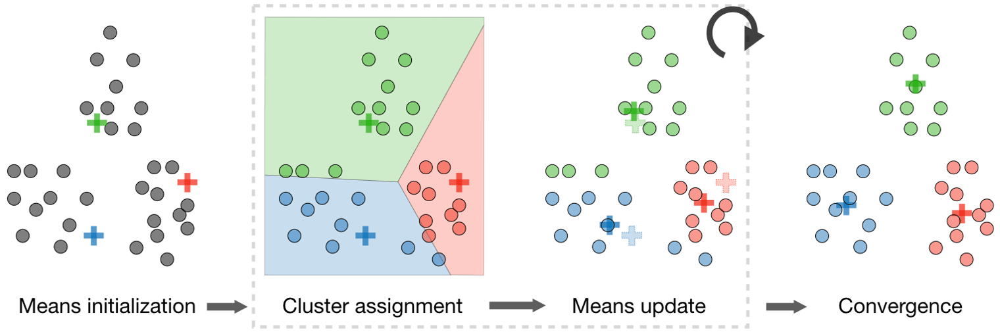

## 聚类

### 聚类的基本概念

在**无监督学习(unsupervised learning)**中，训练样本的标记信息是未知的，目标是通过对无标记样本的学习来揭示数据的内在性质及规律，为进一步的数据分析提供基础。聚类(clustering)任务是一种常见的无监督学习方法。

聚类试图将数据集中的样本划分为若干个不相交的子集，每个子集称为一个**簇(cluster)**。通过这样的划分，每个簇可能对应于一些**潜在的概念(类别)**。这些概念对聚类算法而言事先是未知的，聚类过程仅能自动形成簇结构，簇所对应的概念语义需由使用者来把握和命名。

聚类既能作为一个单独过程，用于寻找数据内在的分布结构，也可作为分类等其他学习任务的**先驱过程**。例如在一些商业应用中需对新用户的类型进行判别，但定义用户类型对商家来说却可能不太容易，此时往往可先对已有用户数据进行聚类，根据聚类结果**将每个簇定义为一个类**，然后再基于这些类训练分类模型，用于判别新用户的类型。

#### 相似度或距离

剧烈的核心概念是**相似度(similarity)**或**距离(distance)**。有多种相似度或距离的定义。因为相似度直接影响聚类的结果，所以其选择是聚类的根本问题。具体哪种相似度更合适取决于应用问题的特性。

(1) **闵可夫斯基距离(Minkowski distance)**：
$$
\operatorname{dist}_{m k}(x_{i}, x_{j})=(\sum_{u=1}^{n}|x_{i u}-x_{j u}|^{p})^{\frac{1}{p}}
$$
当$p=2$时，称为**欧氏距离(Euclidean distance)**；当$p=1$时称为曼哈顿距离(Manhattan distance)；当$p=\infty$时称为**切比雪夫距离(Chebyshev distance)**，即取各个坐标数值差的绝对值的最大值。

(2) **马哈拉诺比斯距离(Mahalanobis distance)**：简称马氏距离，也是一种常用的相似度，考虑各个分量(特征)之间的相关性并与各个分量的尺度无关。给定一个样本集合$X=(x_{ij})_{m \times n}$，其协方差矩阵记作$S$。样本$x_i$与样本$x_j$之间的马哈拉诺比斯距离$d_{ij}$定义为$d_{ij}=[(x_i-x_j)^{\text T}S^{-1}(x_i-x_j)]^{\frac{1}{2}}$。当$S$为单位矩阵时，即样本数据的各个分量相互独立且各个分量房差为1时，马氏距离等价于欧氏距离。因此马氏距离是欧氏距离的推广。

(3) 样本之间的相似性度量还有**相关系数**、**夹角余弦**等。

#### 类或簇

通过聚类得到的类或簇，本质是样本的子集。如果一个聚类方法假定一个样本只能属于一个类，那么该方法称为**硬聚类(hard clustering)**方法；如果一个样本可以属于多个类，那么该方法称为**软聚类(soft clustering)**方法。其中，硬聚类方法较为常用。用$G$表示类或簇，用$x_i,x_j$表示类中的样本，用$n_G$表示$G$中样本的个数，用$d_{ij}$表示样本$x_i$和$x_j$之间的距离。类或簇有多种定义：

(1) 设$T$为给定的正数，若集合$G$中任意两个样本$x_i$和$x_j$满足$d_{ij} \leqslant T$，则称$G$为一个类或簇。

(2) 设$T$为给定的正数，若对集合$G$中任一样本，必存在另一个样本$x_j$，使得$d_{ij} \leqslant T$，则称$G$为一个类或簇。

(3) 设$T$为给定的正数，若对集合$G$中任意一个样本$x_i$，$G$中的另一个样本$x_j$满足：
$$
\frac{1}{n_G-1}\sum_{x_i \in G} d_{ij} \leqslant T 
$$
其中$n_G$为$G$中样本的个数，则称$G$为一个类或簇。

(4) 设$T$和$V$为给定的两个正数，如果集合$G$中任意两个样本$x_i,x_j$的距离$d_{ij}$满足：
$$
\frac{1}{n_G(n_G-1)}\sum_{x_i \in G} \sum_{x_j \in G}d_{ij} \leqslant T
$$
则称$G$为一个类或簇。以上四个定义中，第一个定义最为常用。类的特征可以通过不同角度来刻画，比如**类的均值**、**类的直径(diameter, 任意两样本样本之间的最大距离)**、类的样本散布矩阵以及协方差矩阵等。

#### 类与类之间的距离

类$G_p$与类$G_q$之间的距离$D(p,q)$，也称为**连接(linkage)**，有多重定义：

(1) **最短距离或单连接**：$D_{pq}=\min\{d_{ij}|x_i \in G_p,x_j \in G_q\}$，即两类样本间的最短距离。

(2) **最长距离或完全连接**：$D_{pq}=\max\{d_{ij}|x_i \in G_p,x_j \in G_q\}$，即两类样本间的最长距离。

(3) **中心距离**：$D_{pq}=d_{\bar x_p \bar x_q}$，即两个类中心之间的距离。

(4) **平均距离**：两类中任意两个样本之间距离的平均值。

### 层次聚类

层次聚类假设类别之间存在层次结构，将样本聚到层次化的类中。层次聚类又有**聚合(agglomerative)**或**自下而上(bottom-up)**聚类、**分裂(divisive)**或**自上而下(top-down)**聚类两种方法。因为每个样本只属于异类，所以层次聚类属于硬聚类。

聚合聚类开始将每个样本各自分到一个类；之后**将相距最近的两类合并**，建立一个新的类，重复此操作**直到满足停止条件**，得到层次化的类别。分裂聚类开始将所有样本分到一个类，之后**将已有类中相距最远的样本分到两个新的类**，重复此操作直到满足停止条件，得到层次化的类别。

**聚合聚类的具体算法步骤如下**：

输入：$n$个样本组成的样本集合及样本之间的距离；

输出：对样本集合的一个层次化聚类。

(1) 计算$n$个样本两两之间的欧氏距离$d_{ij}$，记作矩阵$D=[d_{ij}]_{n \times n}$；

(2) 构造$n$个类，每个类只包含一个样本；

(3) 合并类间距离最小的两个类，构建一个新类；

(4) 计算新类与当前各类的距离。若类的个数为1，终止计算；否则，回到步骤(3)。

可以看出，聚合聚类算法的复杂度是$O(n^3m)$，其中$m$是样本特征数，$n$是样本个数。

### $\boldsymbol k$均值算法

$k$均值聚类是基于**样本集合划分**的聚类算法。$k$均值聚类将样本集合划分为$k$个子集，构成$k$个类，将$n$个样本分到$k$个类中，每个样本到其所属类的中心的距离最小。每个样本只能属于一个类，所以$k$均值为硬聚类算法。



k-均值算法的步骤：

输入： $n$个样本的集合$X$；

输出：样本集合的聚类$C$。

(1) **初始化**。令$t=0$，随机选择$k$个样本点作为初始聚类中心$m^{(0)}=(m_1^{(0)},\cdots,m_l^{(0)},\cdots,m_k^{(0)})$。

(2) **对样本进行聚类**。对固定的类中心$m^{(t)}=(m_1^{(t)},\cdots,m_l^{(t)},\cdots,m_k^{(t)})$，其中$m_l^{(t)}$为类$G_l$的中心，计算每个样本到类中心的距离，将每个样本指派到于其最近的中心的类，构成聚类结果$C^{(t)}$。

(3) 计算**新的类中心**。对聚类结果$C^{(t)}$，计算当前各个类中的样本的均值，作为新的类中心$m^{(t+1)}=(m_1^{(t+1)},\cdots,m_l^{(t+1)},\cdots,m_k^{(t+1)})$。

(4) 如果迭代收敛或者符合停止条件，输出$C^{(t)}$。否则$t=t+1$，返回步骤(2)。

$k$均值算法的复杂度是$O(mnk)$，其中$m$是样本的特征数，$n$是样本个数，$k$是类别个数。

$k$均值算法有以下特性：

(1) **总体特点**：$k$均值算法是基于划分的聚类方法，类别数$k$事先指定，以欧氏距离平方表示样本之间的距离，以中心或样本的均值表示类别，**以样本和其所属类的中心之间的距离的总和为最优化的目标函数**，得到而类别是平坦的、非层次化的，算法是迭代算法，**不能保证全局最优**。

(2) **收敛性**：$k$均值聚类属于启发式算法，不能保证收敛到全局最优，初始中心的选择会直接影响聚类结果。

(3) **类别数$\boldsymbol k$的选择**：$k$均值聚类中的类别数$k$值需要预先指定，而在实际应用中最优的$k$值是不知道的。解决这个问题的一个方法是尝试用不同的$k$值聚类，检验各自得到聚类结果的质量，推测最优的$k$值。**聚类结果的质量可以用类的平均直径来衡量**。一般地，类别数变小时，平均直径会增加；类别数变大超过某个值以后，平均直径会不变乐然这个临界值正式最优的$k$值。该方法也称为肘部法则。

### 聚类算法拓展

聚类算法的类别：

(1) **原型聚类**：此类算法假设聚类结构能通过一组原型刻画，在现实聚类任务中很常用。通常算法先对原型进行初始化，然后对原型进行迭代更新求解。包括**k-均值算法(k-means)**、学习向量量化(learning vector quantization, LVQ)、**高斯混合聚类(mixture-of-gaussian)**等。

(2) **密度聚类**：此类算法假设聚类结构能通过样本分布的紧密程度确定。通常情况下，密度聚类算法从样本密度的角度考察样本之间的可连接性，并基于可连接样本不断扩展聚类簇以获得最终的聚类结果。最著名的密度聚类算法为**DBSCAN**，它通过邻域参数来刻画样本分布的紧密程度。

(3) **层次聚类**：在不同层次上对数据集进行划分，从而形成树形的聚类结构。数据集的划分可采用自底向上或自顶向下的结合策略。最著名的层次聚类算法为AGNES。

**聚类集成(clustering ensemble)**通过对多个聚类学习器进行集成，能有效降低聚类假设与真实聚类结构不符、聚类过程中的随机性等因素带来的不利影响。**异常检测(anomaly detection)**常借助聚类或距离计算进行，如将远离所有簇中心的样本作为异常点，或将密度极低处的样本作为异常点。

### 基于numpy的k均值聚类算法实现

```python
import numpy as np


# 定义欧式距离
def euclidean_distance(x1, x2):
    distance = 0
    # 距离的平方项再开根号
    for i in range(len(x1)):
        distance += pow((x1[i] - x2[i]), 2)
    return np.sqrt(distance)


X = np.array([[0,2],[0,0],[1,0],[5,0],[5,2]])
print(euclidean_distance(X[0], X[4]))


# 定义中心初始化函数
def centroids_init(k, X):
    m, n = X.shape
    centroids = np.zeros((k, n))
    for i in range(k):
        # 每一次循环随机选择一个类别中心
        centroid = X[np.random.choice(range(m))]
        centroids[i] = centroid
    return centroids


# 定义样本的最近质心点所属的类别索引
def closest_centroid(sample, centroids):
    closest_i = 0
    closest_dist = float('inf')
    for i, centroid in enumerate(centroids):
        # 根据欧式距离判断，选择最小距离的中心点所属类别
        distance = euclidean_distance(sample, centroid)
        if distance < closest_dist:
            closest_i = i
            closest_dist = distance
    return closest_i


# 定义构建类别过程
def build_clusters(centroids, k, X):
    clusters = [[] for _ in range(k)]
    for x_i, x in enumerate(X):
        # 将样本划分到最近的类别区域
        centroid_i = closest_centroid(x, centroids)
        clusters[centroid_i].append(x_i)
    return clusters


# 根据上一步聚类结果计算新的中心点
def calculate_centroids(clusters, k, X):
    n = X.shape[1]
    centroids = np.zeros((k, n))
    # 以当前每个类样本的均值为新的中心点
    for i, cluster in enumerate(clusters):
        centroid = np.mean(X[cluster], axis=0)
        centroids[i] = centroid
    return centroids


# 获取每个样本所属的聚类类别
def get_cluster_labels(clusters, X):
    y_pred = np.zeros(X.shape[0])
    for cluster_i, cluster in enumerate(clusters):
        for X_i in cluster:
            y_pred[X_i] = cluster_i
    return y_pred


# 根据上述各流程定义kmeans算法流程
def kmeans(X, k, max_iterations):
    # 1.初始化中心点
    centroids = centroids_init(k, X)
    # 遍历迭代求解
    for _ in range(max_iterations):
        # 2.根据当前中心点进行聚类
        clusters = build_clusters(centroids, k, X)
        # 保存当前中心点
        prev_centroids = centroids
        # 3.根据聚类结果计算新的中心点
        centroids = calculate_centroids(clusters, k, X)
        # 4.设定收敛条件为中心点是否发生变化
        diff = centroids - prev_centroids
        if not diff.any():
            break
    # 返回最终的聚类标签
    return get_cluster_labels(clusters, X)


# 测试数据
X = np.array([[0, 2], [0, 0], [1, 0], [5, 0], [5, 2]])
# 设定聚类类别为2个，最大迭代次数为10次
labels = kmeans(X, 2, 10)
# 打印每个样本所属的类别标签
print(labels)
```

### 对比scikit-learn中不同的聚类算法并将聚类结果可视化

```python
import time
import warnings

import numpy as np
import matplotlib.pyplot as plt

from sklearn import cluster, datasets, mixture
from sklearn.neighbors import kneighbors_graph
from sklearn.preprocessing import StandardScaler
from itertools import cycle, islice

np.random.seed(0)

# 生成数据集
n_samples = 1500
noisy_circles = datasets.make_circles(n_samples=n_samples, factor=.5,
                                      noise=.05)
noisy_moons = datasets.make_moons(n_samples=n_samples, noise=.05)
blobs = datasets.make_blobs(n_samples=n_samples, random_state=8)
no_structure = np.random.rand(n_samples, 2), None

random_state = 170
X, y = datasets.make_blobs(n_samples=n_samples, random_state=random_state)
transformation = [[0.6, -0.6], [-0.4, 0.8]]
X_aniso = np.dot(X, transformation)
aniso = (X_aniso, y)

varied = datasets.make_blobs(n_samples=n_samples,
                             cluster_std=[1.0, 2.5, 0.5],
                             random_state=random_state)

# 设置聚类参数
plt.figure(figsize=(9 * 2 + 3, 12.5))
plt.subplots_adjust(left=.02, right=.98, bottom=.001, top=.96, wspace=.05,
                    hspace=.01)

plot_num = 1

default_base = {'quantile': .3,
                'eps': .3,
                'damping': .9,
                'preference': -200,
                'n_neighbors': 10,
                'n_clusters': 3,
                'min_samples': 20,
                'xi': 0.05,
                'min_cluster_size': 0.1}

datasets = [
    (noisy_circles, {'damping': .77, 'preference': -240,
                     'quantile': .2, 'n_clusters': 2,
                     'min_samples': 20, 'xi': 0.25}),
    (noisy_moons, {'damping': .75, 'preference': -220, 'n_clusters': 2}),
    (varied, {'eps': .18, 'n_neighbors': 2,
              'min_samples': 5, 'xi': 0.035, 'min_cluster_size': .2}),
    (aniso, {'eps': .15, 'n_neighbors': 2,
             'min_samples': 20, 'xi': 0.1, 'min_cluster_size': .2}),
    (blobs, {}),
    (no_structure, {})]

for i_dataset, (dataset, algo_params) in enumerate(datasets):
    params = default_base.copy()
    params.update(algo_params)

    X, y = dataset

    # 数据标准归一化
    X = StandardScaler().fit_transform(X)

    bandwidth = cluster.estimate_bandwidth(X, quantile=params['quantile'])

    connectivity = kneighbors_graph(
        X, n_neighbors=params['n_neighbors'], include_self=False)

    connectivity = 0.5 * (connectivity + connectivity.T)

    # 创建聚类对象
    ms = cluster.MeanShift(bandwidth=bandwidth, bin_seeding=True)
    two_means = cluster.MiniBatchKMeans(n_clusters=params['n_clusters'])
    ward = cluster.AgglomerativeClustering(
        n_clusters=params['n_clusters'], linkage='ward',
        connectivity=connectivity)
    spectral = cluster.SpectralClustering(
        n_clusters=params['n_clusters'], eigen_solver='arpack',
        affinity="nearest_neighbors")
    dbscan = cluster.DBSCAN(eps=params['eps'])
    affinity_propagation = cluster.AffinityPropagation(
        damping=params['damping'], preference=params['preference'])
    average_linkage = cluster.AgglomerativeClustering(
        linkage="average", affinity="cityblock",
        n_clusters=params['n_clusters'], connectivity=connectivity)
    birch = cluster.Birch(n_clusters=params['n_clusters'])
    gmm = mixture.GaussianMixture(
        n_components=params['n_clusters'], covariance_type='full')

    clustering_algorithms = (
        ('MiniBatchKMeans', two_means),
        ('AffinityPropagation', affinity_propagation),
        ('MeanShift', ms),
        ('SpectralClustering', spectral),
        ('Ward', ward),
        ('AgglomerativeClustering', average_linkage),
        ('DBSCAN', dbscan),
        ('Birch', birch),
        ('GaussianMixture', gmm)
    )

    for name, algorithm in clustering_algorithms:
        t0 = time.time()

        with warnings.catch_warnings():
            warnings.filterwarnings(
                "ignore",
                message="the number of connected components of the " +
                        "connectivity matrix is [0-9]{1,2}" +
                        " > 1. Completing it to avoid stopping the tree early.",
                category=UserWarning)
            warnings.filterwarnings(
                "ignore",
                message="Graph is not fully connected, spectral embedding" +
                        " may not work as expected.",
                category=UserWarning)
            algorithm.fit(X)

        t1 = time.time()
        if hasattr(algorithm, 'labels_'):
            y_pred = algorithm.labels_.astype(np.int)
        else:
            y_pred = algorithm.predict(X)

        plt.subplot(len(datasets), len(clustering_algorithms), plot_num)
        if i_dataset == 0:
            plt.title(name, size=18)

        colors = np.array(list(islice(cycle(['#377eb8', '#ff7f00', '#4daf4a',
                                             '#f781bf', '#a65628', '#984ea3',
                                             '#999999', '#e41a1c', '#dede00']),
                                      int(max(y_pred) + 1))))

        colors = np.append(colors, ["#000000"])
        plt.scatter(X[:, 0], X[:, 1], s=10, color=colors[y_pred])

        plt.xlim(-2.5, 2.5)
        plt.ylim(-2.5, 2.5)
        plt.xticks(())
        plt.yticks(())
        plt.text(.99, .01, ('%.2fs' % (t1 - t0)).lstrip('0'), transform=plt.gca().transAxes, size=15,
                 horizontalalignment='right')
        plot_num += 1

plt.show()
```

### 参考资料

- 周志华. 机器学习. 北京: 清华大学出版社, 2016.
- 李航. 统计学习方法. 北京: 清华大学出版社, 2019.
- 鲁伟. 机器学习：公式推导与代码实现. 北京: 人民邮电出版社, 2022.
- Stanford University机器学习笔记：https://stanford.edu/~shervine/teaching/cs-229/cheatsheet-unsupervised-learning

