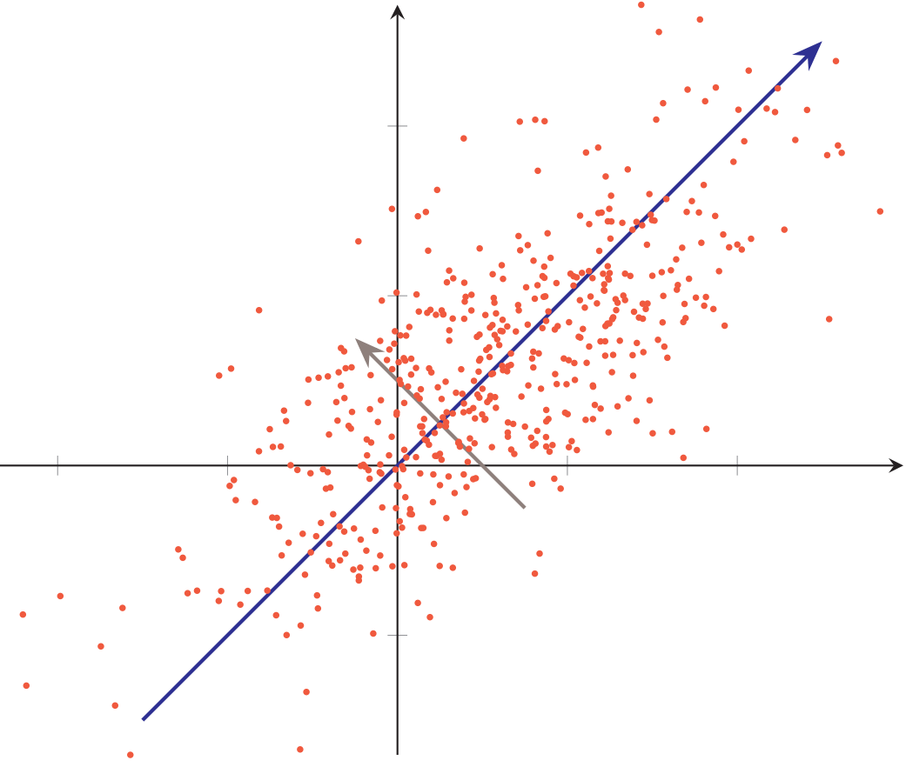

## 降维

### 主成分分析

**主成分分析(principal component analysis, PCA)**是一种最常用的数据降维方法，使得在转换后的空间中数据的方差最大。如下图所示的二维数据，如果将这些数据投影到一维空间，选择数据方差最大的方向进行投影(蓝轴)，才能最大化数据的差异性，保留更多的原始数据信息。



假设有一组$d$维样本$\boldsymbol x^{(n)} \in \mathbb R^d, 1 \leqslant n \leqslant N$，我们希望将其投影到一维空间中，投影向量为$\boldsymbol w \in \mathbb R^d$。不失一般性，限制$\boldsymbol w$的模为1，即$\boldsymbol w^\text T \boldsymbol w=1$。每个样本点$\boldsymbol x^{(n)}$投影之后的表示为$z^{(n)}=\boldsymbol w^\text T \boldsymbol x^{(n)}$。

用矩阵$X=\left[\boldsymbol{x}^{(1)}, \boldsymbol{x}^{(2)}, \cdots, \boldsymbol{x}^{(N)}\right]$表示输入样本，$\bar{\boldsymbol{x}}=\frac{1}{N} \sum_{n=1}^{N} \boldsymbol{x}^{(n)}$为原始样本点的中心店，所有样本**投影后的方差**为：
$$
\begin{aligned}
\sigma(X ; \boldsymbol{w}) &=\frac{1}{N} \sum_{n=1}^{N}(\boldsymbol{w}^{\mathrm{T}} \boldsymbol{x}^{(n)}-\boldsymbol{w}^{\mathrm{T}} \bar{\boldsymbol{x}})^{2} \\
&=\frac{1}{N}(\boldsymbol{w}^{\mathrm{T}} X-\boldsymbol{w}^{\mathrm{T}} \bar{X})(\boldsymbol{w}^{\mathrm{T}} X-\boldsymbol{w}^{\mathrm{T}} \bar{X})^{\mathrm{T}} \\
&=\boldsymbol{w}^{\mathrm{T}} \boldsymbol{S} \boldsymbol{w}
\end{aligned}
$$
其中，$\bar X=\bar{\boldsymbol x} \boldsymbol 1_d^\text T$为$d$列$\bar{\boldsymbol x}$组成的矩阵，$S=\frac{1}{N}(X-\bar{X})(X-\bar{X})^{\mathrm{T}}$是**原始样本的协方差矩阵**。

最大化投影方差$\sigma(X;\boldsymbol w)$，并满足$\boldsymbol w^\text T \boldsymbol w=1$，**利用拉格朗日方法转换为无约束优化问题**：
$$
\max _{\boldsymbol{w}} \boldsymbol{w}^{\mathrm{T}} S \boldsymbol{w}+\lambda(1-\boldsymbol{w}^{\mathrm{T}} \boldsymbol{w})
$$
其中$\lambda$为拉格朗日乘子。对上式求导并令导数为0，可得$S \boldsymbol{w}=\lambda \boldsymbol{w}$。

从上式可知，$\boldsymbol w$是协方差矩阵$S$的特征向量，$\lambda$为特征值。同时，$\sigma(X ; w)=\boldsymbol{w}^{\mathrm{T}} S \boldsymbol{w}=\boldsymbol{w}^{\mathrm{T}} \lambda \boldsymbol{w}=\lambda$。

$\lambda$也是投影后样本的方差。因此，主成分分析可以转换成一个矩阵特征值分解问题，投影向量$\boldsymbol w$为矩阵$S$的**最大特征值对应的特征向量**。

如果要通过投影矩阵$W \in R^{d \times d^{\prime}}$将样本投到$d^\prime$维空间，投影矩阵满足$W^\text T W=\boldsymbol I$，只需要将$S$的**特征值从大到小排列**，保留前$d^\prime$个特征值，**其对应的特征向量即是最优的投影矩阵**。

主成分分析是一种无监督学习方法，可以作为监督学习的数据预处理方法，用来**去除噪声并减少特征之间的相关性**，但是它**不能保证投影后数据的类别可分性更好**。提高两类可分性的方法一般为监督学习方法，比如**线性判别分析(linear discriminant analysis, LDA)**。

### 基于numpy的主成分分析算法实现

```python
import numpy as np
from sklearn import datasets
import matplotlib.pyplot as plt


class PCA():
    # 计算协方差矩阵
    def calc_cov(self, X):
        m = X.shape[0]
        # 数据标准化
        X = (X - np.mean(X, axis=0)) / np.var(X, axis=0)
        return 1 / m * np.matmul(X.T, X)

    def pca(self, X, n_components):
        # 计算协方差矩阵
        cov_matrix = self.calc_cov(X)
        # 计算协方差矩阵的特征值和对应特征向量
        eigenvalues, eigenvectors = np.linalg.eig(cov_matrix)
        # 对特征值排序
        idx = eigenvalues.argsort()[::-1]
        # 取最大的前n_component组
        eigenvectors = eigenvectors[:, idx]
        eigenvectors = eigenvectors[:, :n_components]
        # Y=PX转换
        return np.matmul(X, eigenvectors)


# 导入sklearn的鸢尾花数据集
iris = datasets.load_iris()
X = iris.data
y = iris.target

# 将数据降维到3个主成分
X_trans = PCA().pca(X, 3)
colors = ['navy', 'turquoise', 'darkorange']

# 绘制不同类别
for c, i, target_name in zip(colors, [0, 1, 2], iris.target_names):
    plt.scatter(X_trans[y == i, 0], X_trans[y == i, 1],
                color=c, lw=2, label=target_name)
plt.legend()
plt.show()
```

### 使用scikit-learn中的主成分分析算法对Olivetti人脸数据集进行降维及特征脸的提取

```python
import numpy as np
import matplotlib.pyplot as plt
from sklearn.datasets import fetch_olivetti_faces
from sklearn.decomposition import PCA

dataset = fetch_olivetti_faces(shuffle=True)
data = dataset['data']
print(data.shape)  # 原始数据的形状

pca = PCA(n_components=128)
pca.fit(data)

plt.subplot(1, 2, 1)
plt.title('raw first figure')
plt.imshow(data[0].reshape((64, 64)))

data_pca = pca.transform(data)
print(data_pca.shape)  # 降维后数据的形状

data_recover = pca.inverse_transform(data_pca).reshape(400, 64, 64)
print(data_recover.shape)

plt.subplot(1, 2, 2)
plt.title('recovered first figure (n_components=128)')
plt.imshow(data_recover[0])
plt.show()

# 获取主成分，即特征脸
comp = pca.components_
print(comp.shape)

for i in range(16):
    plt.subplot(4, 4, i + 1)
    plt.imshow(comp[i].reshape((64, 64)))
plt.show()
```

### 流形学习

**欧几里得空间(Euclidean space)**也称为平直空间。基础物理、数学都是建立在欧氏空间基础上的。在欧氏空间中，0维的欧几里得空间是一个点；1维的欧几里得空间是一条线；2维的欧几里得空间是一个平面；3维的欧几里得空间是立体空间，它们都满足两点间的最短距离是一条直线。基于欧氏空间的几何学称为欧几里得几何。

欧几里得几何的局限性：它不能包含两点间最短距离是曲线的情况，如球面上的两点间最短距离。故对于更加宏观的航海、天体物理等研究而言，通过欧几里得空间来研究它们是不适合的。由此引入了**黎曼几何**，而黎曼几何研究的对象就是**流形(manifold)**。

流形整体而言是“扭曲的”，然而其局部又类似于欧几里得空间。因此，我们可以利用欧几里得几何里已知的方法去研究流形的局部。然后再将这些局部信息拼接起来，以达到研究流形的目的。这和微分的思想很像：直接计算一条曲线的长度比较难，那我将其切分成若干小段，每段近似于一条直线，这些直线的长度相加的总和就是这条曲线的长度。


**流形学习(manifold learing)**是机器学习、模式识别中的一种方法，在维数约简方面具有广泛的应用。它的主要思想是将高维的数据映射到低维，使该低维的数据能够反映原高维数据的某些本质结构特征。流形学习的前提是有一种假设，即**某些高维数据，实际是一种低维的流形结构嵌入在高维空间中**。流形学习的目的是将其映射回低维空间中，揭示其本质。

通过流形学习来实现降维的方法有很多，其基本思想也类似：假设数据在高维具有某种结构特征，希望降到低维后，仍能保持该结构。比较常见的有**局部线性嵌入(local linear embedding, LLE)**、**拉普拉斯特征映射(Laplacian eigenmaps, LE)**、**等距映射(Isomap)**等。

**SNE(stochastic neighbor embedding)**算法于2002年提出，其出发点是：在高维空间相似的数据点，映射到低维空间距离也是相似的。常规的做法是用欧式距离表示这种相似性，而SNE把这种距离关系转换为一种条件概率来表示相似性。

SNE存在拥挤问题：降维后不同类别的数据簇挤在一起，无法区分开来。为了解决该问题，t-SNE在SNE的基础上做了两点改进：(1) 把SNE变为**对称SNE**，(2) 在低维空间中采用了$t$分布代替原来的高斯分布，高维空间不变。

### 使用scikit-learn中的t-SNE算法完成恒星光谱数据的降维

```python
import numpy as np
import matplotlib.pyplot as plt
import scipy.io as sio
from sklearn.manifold import TSNE

# 数据获取 (需要预先将数据导入当前目录下)
# A F K M类恒星数据各1000条
X_a = sio.loadmat('spectra_data\A.mat')['P1'][:1000]
X_f = sio.loadmat('spectra_data\F.mat')['P1'][:1000]
X_k = sio.loadmat('spectra_data\K.mat')['P1'][:1000]
X_m = sio.loadmat('spectra_data\M.mat')['P1'][:1000]
X_label = ['A', 'F', 'K', 'M']
X = np.vstack((X_a, X_f, X_k, X_m))

# 类别标签
y_a = np.full((X_a.shape[0],), 0)
y_f = np.full((X_f.shape[0],), 1)
y_k = np.full((X_k.shape[0],), 2)
y_m = np.full((X_m.shape[0],), 3)
y = np.hstack((y_a, y_f, y_k, y_m))

# 数据归一化
for i in range(X.shape[0]):
    X[i] -= np.min(X[i])
    if np.max(X[i]) != 0:
        X[i] /= np.max(X[i])

print('Data shape: ', X.shape)
print('Label shape: ', y.shape)

# 降维
tsne = TSNE()
X_tsne = tsne.fit_transform(X)

# 绘制降维结果
plt.scatter(X_tsne[y == 0, 0], X_tsne[y == 0, 1], label='A')
plt.scatter(X_tsne[y == 1, 0], X_tsne[y == 1, 1], label='F')
plt.scatter(X_tsne[y == 2, 0], X_tsne[y == 2, 1], label='K')
plt.scatter(X_tsne[y == 3, 0], X_tsne[y == 3, 1], label='M')
plt.legend()
plt.show()
```

### 参考资料

- 周志华. 机器学习. 北京: 清华大学出版社, 2016.
- 李航. 统计学习方法. 北京: 清华大学出版社, 2019.
- 邱锡鹏. 神经网络与深度学习. 北京: 机械工业出版社, 2020.
- 鲁伟. 机器学习：公式推导与代码实现. 北京: 人民邮电出版社, 2022.
- 流形学习：https://www.zhihu.com/question/24015486
- SNE与t-SNE：http://bindog.github.io/blog/2016/06/04/from-sne-to-tsne-to-largevis/

