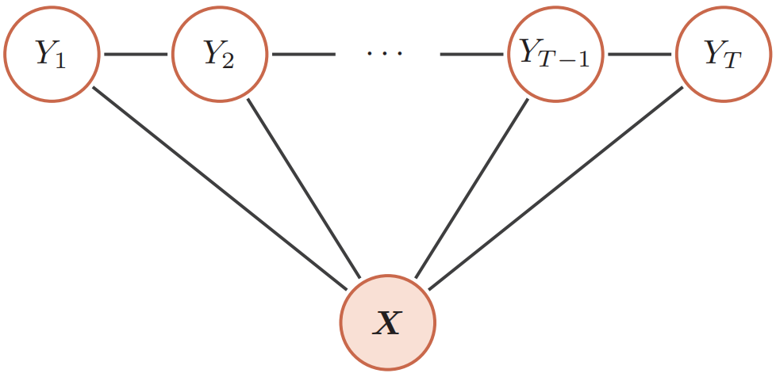

## 概率图模型

### 概率图模型概述


**概率图模型(probabilistic graphical model, PGM)**，简称图模型(graphical model, GM)，是指一种**用图结构来描述多元随机变量之间条件独立关系的概率模型**，从而给研究**高维空间中的概率模型**带来了很大的便捷性。

对于一个$K$维随机向量$\boldsymbol X=[X_1,X_2,\cdots,X_K]^\text T$，其联合概率为高维空间中的分布，一般难以直接建模。假设每个变量为离散变量并有$m$个取值，在不作任何独立假设条件下，则需要个$m^K-1$参数才能表示其概率分布，当$m$和$K$很大时，参数量远远超出了目前计算机的存储能力。

一种有效减少参数量的方法是独立性假设。一个$K$维随机向量$\boldsymbol X$的联合概率分解为$K$个**条件概率的乘积**：
$$
\begin{aligned}
p(\boldsymbol{x}) & \triangleq P(\boldsymbol{X}=\boldsymbol{x}) \\
&=p\left(x_{1}\right) p\left(x_{2} \mid x_{1}\right) \cdots p\left(x_{K} \mid x_{1}, \cdots, x_{K-1}\right) \\
&=\prod_{k=1}^{K} p\left(x_{k} \mid x_{1}, \cdots, x_{k-1}\right)
\end{aligned}
$$
其中$x_k$表示变量$X_k$的取值。如果**某些变量之间存在条件独立**，其参数量就可以大幅减少。

假设有四个二值变量$X_1,X_2,X_3,X_4$，在不知道这几个变量依赖关系的情况下，可以用一个联合概率表来记录每一种取值的概率，共需要15个参数。假设在已知$X_1$时，$X_2$和$X_3$独立，即有
$$
p(x_{2} | x_{1}, x_{3})=p(x_{2} | x_{1}) \\
p(x_{3} | x_{1}, x_{2})=p(x_{3} | x_{1})
$$
在已知$X_2$和$X_3$时，$X_4$也和$X_1$独立，即有
$$
p(x_{4} | x_{1}, x_{2}, x_{3})=p(x_{4} | x_{2}, x_{3})
$$
那么其联合概率$p(\boldsymbol x)$可以分解为：
$$
\begin{aligned}
p(\boldsymbol{x}) &=p(x_{1}) p(x_{2} | x_{1}) p(x_{3} | x_{1}, x_{2}) p(x_{4} | x_{1}, x_{2}, x_{3}) \\
&=p(x_{1}) p(x_{2} | x_{1}) p(x_{3} | x_{1}) p(x_{4} | x_{2}, x_{3})
\end{aligned}
$$
是4个局部条件概率的乘积。如果分别用4个表格来记录这4个条件概率的话，只需要1 + 2 + 2 + 4 = 9个独立参数。

当概率模型中的变量数量比较多时，其条件依赖关系也比较复杂。我们可以使用**图结构**的方式将概率模型可视化，以一种直观、简单的方式描述随机变量之间的条件独立性的性质，并可以将一个复杂的联合概率模型分解为一些简单条件概率模型的组合。下图给出了上述例子中4个变量之间的条件独立性的图形化描述。图中每个节点表示一个变量，每条连边表示变量之间的依赖关系。**对于一个非全连接的图，都存在一个或多个条件独立性假设，可以根据条件独立性将联合概率分布进行分解，表示为一组局部条件概率分布的乘积**。


图模型有以下三个基本问题。(1) **表示问题**：对于一个概率模型，如何通过图结构来描述变量之间的依赖关系。(2) **学习问题**：图模型的学习包括图结构的学习和参数的学习。通常，我们只关注**在给定图结构时的参数学习，即参数估计问题**。(3) **推断问题**：在已知部分变量时，计算其它变量的条件概率分布。很多其他机器学习模型都可以由概率图模型进行表示。

### 模型表示

图由一组**节点**和节点之间的**边**组成。在概率图模型中，**每个节点都表示一个随机变量(或一组随机变量)**，边表示这些随机变量之间的概率依赖关系。

常见的概率图模型可以分为两类：**有向图模型和无向图模型**。有向图模型的图结构为有向非循环图，如果两个节点之间有连边，表示对应的两个变量为**因果关系**。无向图模型使用无向图来描述变量之间的关系。**每条边代表两个变量之间有概率依赖关系，但是并不一定是因果关系**。

下图为有向图和无向图的示例，表示四个变量$\{X_1, X_2, X_3, X_4\}$间的依赖关系。


图中，带阴影的节点$\{X_1, X_4\}$表示**可观测到的变量**，不带阴影的节点$\{X_2, X_3\}$表示**隐变量**，连边表示两变量间的**条件依赖关系**。

#### 有向图模型

**有向图模型(directed graphcal model)**，也称为**贝叶斯网络(Bayesian network)**或**信念网络(belief network, BN)**，是指用有向图来表示概率分布的图模型。假设一个有向图$G(\mathcal V,\mathcal E)$，节点集合$\mathcal V=\{X_1,X_2,\cdots,X_K\}$表示$K$个随机变量，节点$k$对应随机变量$X_k$。$\mathcal E$为边的集合，每条边表示两个变量之间**因果关系**。

对于一个随机向量$\boldsymbol X=[X_1,X_2,\cdots,X_K]^\text T$和一个有$K$个节点的有向非循环图$G$，$G$中的每个节点都对应一个随机变量，可以是可观测的变量、隐变量或是未知参数。$G$中的每个连接$e_{ij}$表示两个随机变量$X_i$和$X_j$之间具有非独立的因果关系。$\boldsymbol X_{\pi_k}$表示变量$X_k$的所有父节点变量集合，每个随机变量的**局部条件概率分布(local conditional probability distribution)**为$|P(X_k|\boldsymbol X_{\pi_k})$。

如果$\boldsymbol X$的联合概率分布可以分解为每个随机变量$X_k$的局部条件概率连乘的形式，即
$$
p(\boldsymbol{x})=\prod_{k=1}^{K} p(x_{k} | \boldsymbol{x}_{\pi_{k}})
$$
那么$(G,\boldsymbol X)$构成了一个贝叶斯网络。

在贝叶斯网络中，如果两个节点是**直接连接**的，它们肯定是非条件独立的，是直接因果关系。父节点是因，子节点是果。如果两个节点**不是直接连接**的，但是它们之间有一条经过其它节点的路径来连接，那么这两个节点之间的条件独立性就比较复杂。以三个节点的贝叶斯网络为例，给定三个节点$X_1, X_2, X_3$，其中$X_1$和$X_3$是不直接连接的，通过节点$X_2$连接。这三个节点之间可以有四种连接关系：


上图中，在(a)和(b)中，$X_1 \not \perp X_3|\varnothing$，但$X_{1} \perp X_{3} | X_{2}$；在(c)中，同样$X_1 \not \perp X_3|\varnothing$，但$X_{1} \perp X_{3} | X_{2}$；在(d)中，$X_1 \perp X_3|\varnothing$，但$X_{1} \not \perp X_{3} | X_{2}$。四种关系分别如下：

(1) **间接因果关系**：当$X_2$已知时，$X_1$和$X_3$为条件独立；

(2) **间接果因关系(与(1)相同)**：当$X_2$已知时，$X_1$和$X_3$为条件独立；

(3) **共因关系**：当$X_2$未知时，$X_1$和$X_3$是不独立的；当$X_2$已知时，$X_1$和$X_3$条件独立；

(4) **共果关系**：当$X_2$未知时，$X_1$和$X_3$是独立的；当$X_2$已知时，$X_1$和$X_3$不独立。

对于一个更一般的贝叶斯网络，其**局部马尔可夫性质**为：**每个随机变量在给定父节点的情况下，条件独立于它的非后代节点**，即$X_k \perp Z|X_{\pi_k}$，其中$Z$为$X_k$的非后代变量。

常见的有向图模型如下：

##### sigmoid信念网络

为了减少模型参数，可以使用参数化模型来建模有向图模型中的条件概率分布。一种简单的参数化模型为**sigmoid信念网络(sigmoid belief network, SBN)**。在该网络中，变量的取值为$\{0,1\}$。对于变量$X_k$和它的父节点集合$\pi_k$，其条件概率分布表示为：
$$
P(X_{k}=1 | \boldsymbol{x}_{\pi_{k}} ; \theta)=\sigma(\theta_{0}+\sum_{x_{i} \in \boldsymbol{x}_{\pi_{k}}} \theta_{i} x_{i})
$$
其中$\sigma(\cdot)$为sigmoid函数，$\theta_i$为可学习的参数。假设变量$X_k$的父节点数量为$M$，如果使用表格来记录条件概率需要$2^M$个参数，如果使用参数化模型只需要$M+1$个参数。如果对不同的变量的条件概率都共享使用一个参数化模型，其参数数量又可以大幅减少。

值得一提的是，sigmoid信念网络与logistic回归模型都采用sigmoid函数来计算条件概率。如果**假设sigmoid信念网络中只有一个叶子节点**，其所有的父节点之间没有连接，且取值为实数，那么**sigmoid信念网络的网络结构和logistic回归模型类似**。但是，两个模型区别在于**logistic回归模型中**的$\boldsymbol x$作为一种**确定性的参数，而非变量**。 因此logistic回归模型只建模条件概率$p(y|x)$，是一种**判别模型**；而sigmoid信念网络建模$p(x,y)$，是一种**生成模型**。


##### 朴素贝叶斯分类器

**朴素贝叶斯分类器(naive Bayes classififier, NB)**是一类简单的概率分类器，在**强(朴素)独立性假设**的条件下运用贝叶斯公式来计算每个类别的条件概率。给定一个有$d$维特征的样本$\boldsymbol x$和类别$y$，类别$y$的条件概率为：
$$
\begin{aligned}
p(y | \boldsymbol{x} ; \theta) &=\frac{p(x_{1}, \cdots, x_{d} | y ; \theta) p(y ; \theta)}{p(x_{1}, \cdots, x_{d})} \\
& \propto p(x_{1}, \cdots, x_{d} | y ; \theta) p(y ; \theta)
\end{aligned}
$$
其中$\theta$为概率分布的参数。在朴素贝叶斯分类器中，假设在给定$Y$的情况下，$X_i$之间是条件独立的。下图给出了朴素贝叶斯分类器的图模型表示：


条件概率分布$p(y|\boldsymbol x)$可以分解为：
$$
p(y | \boldsymbol{x} ; \theta) \propto p(y | \theta_{c}) \prod_{i=1}^{d} p(x_{i} | y ; \theta_{i, y})
$$
其中$\theta_c$是$y$的先验概率分布的参数，$\theta_{i, y}$是条件概率分布$p(x_i | y ; \theta_{i, y})$的参数。如果$x_i$为连续值，$p(x_i | y ; \theta_{i, y})$可以用**高斯分布**建模。如果$x_i$为离散值，$p(x_i | y ; \theta_{i, y})$可以用**多项分布**建模。

虽然朴素贝叶斯分类器的条件独立性假设太强，但是在实际应用中，朴素贝叶斯分类器在很多任务上也能得到很好的结果，并且模型简单，可以有效防止过拟合。

##### 隐马尔可夫模型

**隐马尔可夫模型(hidden Markov model, HMM)**是一种含有隐变量的马尔可夫过程。下图给出隐马尔可夫模型的图模型表示：


隐马尔可夫模型的**联合概率**可以分解为：
$$
p(\boldsymbol{x}, \boldsymbol{y} ; \theta)=\prod_{t=1}^{T} p(y_{t} | y_{t-1}, \theta_{s}) p(x_{t} | y_{t}, \theta_{t})
$$
其中$p(x_t | y_t, \theta_t)$为**输出概率**，$p(y_t | y_{t-1}, \theta_s)$为**转移概率**，$\theta_s$和$\theta_t$分别表示两类条件概率的参数。

#### 无向图模型

无向图模型，也称**马尔可夫随机场(Markov random field, MRF)**或**马尔可夫网络(Markov network)**，是一类用无向图来描述一组具有局部马尔可夫性质的随机向量$X$的联合概率分布的模型。

对于一个随机向量$\boldsymbol X=[X_1,\cdots,X_K]^\text T$和一个有$K$个节点的无向图$G(\mathcal V, \mathcal E)$(可以存在循环)，图$G$中的节点$k$表示随机变量$X_k,1 \leqslant k \leqslant K$。如果$(G,\boldsymbol X)$满足局部马尔可夫性质，即一个变量$X_k$在**给定它的邻居**的情况下**独立于所有其他变量**，$p(x_k|\boldsymbol x_{\setminus k})=p(x_k|\boldsymbol x_{N(k)})$，其中$N(k)$为变量$X_k$的邻居集合，$\setminus k$为除$X_k$外其他变量的集合，那么$(G,\boldsymbol X)$就构成了一个**马尔可夫随机场**。

无向图中的局部马尔可夫性可以表示为$X_k \perp \boldsymbol X_{\setminus N(k),\setminus k} | \boldsymbol X_{N(k)}$，其中$\boldsymbol X_{N(k), \setminus k}$表示除$\boldsymbol X_{N(k)}$和$X_k$外的其他变量。

##### 无向图模型的概率分解

由于无向图模型并不提供一个变量的拓扑顺序，因此无法用链式法则对$p(x)$进行逐一分解。无向图模型的联合概率一般以全连通子图为单位进行分解。无向图中的一个全连通子图，称为**团(clique)**，即团内的所有节点之间都连边。左上角的图中共有7个团，包括$\{X_1, X_2\}$，$\{X_1, X_3\}$，$\{X_2, X_3\}$，$\{X_3, X_4\}$，$\{X_2, X_4\}$，$\{X_1, X_2, X_3\}$，$\{X_2, X_3, X_4\}$。

在所有团中，如果一个团不能被其它的团包含，这个团就是一个**最大团(maximal clique)**。如下所示：


无向图中的联合概率可以分解为一系列定义在最大团上的非负函数的乘积形式。

**Hammersley-Clifford定理**：如果一个分布$p(\boldsymbol x)>0$满足无向图$G$中的局部马尔可夫性质，当且仅当$p(\boldsymbol x)$可以表示为一系列定义在最大团上的肺腑函数的乘积形式，即：
$$
p(\boldsymbol x)=\frac{1}{Z}\prod_{c \in \mathcal C} \phi_c(\boldsymbol x_c)
$$
其中，$\mathcal C$为无向图$G$中的最大团集合，$\phi_c(\boldsymbol x_c) \geqslant 0$是定义在团$c$上的**势能函数(potential function)**，$Z$是**配分函数(partition function)**，用来将乘积归一化为概率形式：
$$
Z=\sum_{\boldsymbol x \in \mathcal X}\prod_{c \in \mathcal C}\phi_c(\boldsymbol x_c)
$$
其中$\mathcal X$为随机向量$X$的取值空间。

无向图模型与有向图模型的一个重要区别是有配分函数$Z$。配分函数的计算复杂度是指数级的，因此在推断和参数学习时都需要重点考虑。

上述分布形式也称为**吉布斯分布(Gibbs distribution)**。根据**Hammersley-Clifford定理**，无向图模型和吉布斯分布是一致的。吉布斯分布一定满足马尔可夫随机场的条件独立性质，并且马尔可夫随机场的概率分布一定可以表示成吉布斯分布。

由于势能函数必须为正，因此一般定义为：
$$
\phi_c(\boldsymbol x_c)=\exp(-E_c(\boldsymbol x_c))
$$
其中$E_c(\boldsymbol x_c)$为**能量函数(energy function)**。因此，无向图上定义的概率分布可以表示为：
$$
\begin{aligned}
P(\boldsymbol{x}) &=\frac{1}{Z} \prod_{c \in \mathcal{C}} \exp (-E_{c}(\boldsymbol{x}_{c})) \\
&=\frac{1}{Z} \exp (\sum_{c \in \mathcal{C}}-E_{c}(\boldsymbol{x}_{c}))
\end{aligned}
$$
这种形式的分布又称为**玻尔兹曼分布(Boltzmann distribution)**。任何一个无向图模型都可以用上式来表示其联合概率。 

常见的无向图模型如下：

##### 对数线性模型

势能函数一般定义为$\phi_c(\boldsymbol x_c|\theta_c)=\exp(\theta_c^\text T f_c(\boldsymbol x_c))$，其中函数$f_c(\boldsymbol x_c)$为定义在$\boldsymbol x_c$上的特征向量，$\theta_c$为权重向量，即可学习的参数。这样联合概率$p(\boldsymbol x)$的对数形式为：
$$
\log p(\boldsymbol{x} ; \theta)=\sum_{c \in \mathcal{C}} \theta_{c}^{\text{T}} f_{c}(\boldsymbol{x}_{c})-\log Z(\theta)
$$
其中$\theta$代表所有势能函数中的参数$\theta_c$。这种形式的无向图模型也称为**对数线性模型(log-linear model)**或**最大熵模型(maximum entropy model)**。如下图所示：


如果用对数线性模型来建模条件概率$p(y|\boldsymbol x)$，
$$
p(y | \boldsymbol{x} ; \theta)=\frac{1}{Z(\boldsymbol{x} ; \theta)} \exp (\theta^{\text{T}} f(\boldsymbol{x}, y))
$$
其中$Z(\boldsymbol{x} ; \theta)=\sum_{y} \exp (\theta^{\mathrm{T}} f_{y}(\boldsymbol{x}, y))$。这种对数线性模型也称为**条件最大熵模型**或**softmax回归模型**。

##### 条件随机场

**条件随机场(conditional random field, CRF)**是一种直接建模条件概率的无向图模型。和条件最大熵模型不同，条件随机场建模的条件概率$p(\boldsymbol y|\boldsymbol x)$中，$\boldsymbol y$**一般为随机向量**，因此需要对$p(\boldsymbol y|\boldsymbol x)$进行因子分解。假设条件随机场的最大团集合为$\mathcal C$，其条件概率为：
$$
p(\boldsymbol{y} | \boldsymbol{x} ; \theta)=\frac{1}{Z(\boldsymbol{x} ; \theta)} \exp (\sum_{c \in \mathcal{C}} \theta_{c}^{\mathrm{T}} f_{c}(\boldsymbol{x}, \boldsymbol{y}_{c}))
$$
其中，$Z(\boldsymbol{x} ; \theta)=\sum_{y} \exp (\sum_{c \in \mathcal{C}} f_{c}(\boldsymbol{x}, \boldsymbol{y}_{c})^{\mathrm{T}} \theta_{c})$为归一化项。

一个最常用的条件随机场为链式结构，其条件概率为：
$$
p(\boldsymbol{y} | \boldsymbol{x} ; \theta)=\frac{1}{Z(\boldsymbol{x} ; \theta)} \exp (\sum_{t=1}^{T} \theta_{1}^{\mathrm{T}} f_{1}(\boldsymbol{x}, y_{t})+\sum_{t=1}^{T-1} \theta_{2}^{\mathrm{T}} f_{2}(\boldsymbol{x}, y_{t}, y_{t+1}))
$$
其中$f_1(\boldsymbol x,y_t)$为**状态特征**，一般和**位置**$t$相关；$f_2(\boldsymbol x,y_t,y_{t+1})$为转移特征，一般可以简化为$f_2(y_t,y_{t+1})$并使用状态转移矩阵来表示。链式结构的条件随机场示意图如下所示：



#### 有向图和无向图之间的转换

有向图和无向图可以相互转换，但将无向图转为有向图通常比较困难。在实际应用中，**将有向图转为无向图更加重要**，这样可以利用无向图上的精确推断算法，比如**联合树算法(junction tree algorithm)**。无向图模型可以表示有向图模型无法表示的一些依赖关系，如循环依赖；但它不能表示有向图模型能表示的某些关系，比如因果关系。

以下图(a)中的有向图为例，其联合概率分布可以分解为$p(\boldsymbol x)=p(x_1)p(x_2)p(x_3)p(x_4|x_1,x_2,x_3)$。

其中$p(x_4|x_1, x_2, x_3)$**和四个变量都相关**。如果要转换为无向图，需要**将这四个变量都归属于一个团中**。 **道德化**的名称来源是：**有共同儿子的父节点都必须结婚(即有连边**)。因此需要将$x_4$的三个父节点之间都加上连边，如下图(b)所示。这个过程称为**道德化(moralization)**。转换后的无向图称为**道德图(moral graph)**。在道德化的过程中，原来有向图的一些独立性会丢失，比如该例中$X_1 \perp X_2 \perp X_3|\varnothing$在道德图中将不再成立。


### 概率图模型的学习

图模型的学习可以分为两部分：一是**网络结构学习**，即寻找最优的网络结构；二是**网络参数估计**，即已知网络结构，估计每个条件概率分布的参数。网络结构学习一般比较困难，一般是**由领域专家来构建**。通常只讨论**在给定网络结构条件下的参数估计问题**。图模型的参数估计问题又分为**不包含隐变量时的参数估计问题**和**包含隐变量时的参数估计问题**。

#### 不含隐变量的参数估计

如果图模型中不含隐变量，那么网络参数一般可以直接通过最大似然来进行估计。

在**有向图模型**中，所有变量$\boldsymbol x$的联合概率分布可以分解为每个随机变量$x_k$的**局部条件概率**$p(x_k|x_{\pi_k};\theta_k)$的**连乘形式**，其中$\theta_k$为第$k$个变量的局部条件概率的参数。给定$N$个训练样本$\mathcal D=\{\boldsymbol x^{(n)}\}_{n=1}^N$，其对数似然函数为
$$
\begin{aligned}
\mathcal{L}(\mathcal{D} ; \theta) &=\frac{1}{N} \sum_{n=1}^{N} \log p(\boldsymbol{x}^{(n)} ; \theta) \\
&=\frac{1}{N} \sum_{n=1}^{N} \sum_{k=1}^{K} \log p(x_{k}^{(n)} | x_{\pi_{k}}^{(n)} ; \theta_{k})
\end{aligned}
$$
其中$\theta_k$为模型中的所有参数。

因为所有变量都是可观测的，最大化对数似然$\mathcal{L}(\mathcal{D} ; \theta)$，只需要分别地最大化每个变量的条件似然来估计其参数。
$$
\theta_{k}=\arg \max \sum_{n=1}^{N} \log p(x_{k}^{(n)} | x_{\pi_{k}}^{(n)} ; \theta_{k})
$$
如果变量$\boldsymbol x$是离散的，直接简单的方式是在训练集上统计每个变量的条件概率表。但是条件概率表需要的参数比较多。假设条件概率的$p(x_k|x_{\pi_k};\theta_k)$父节点数量为$M$，所有变量为二值变量，其条件概率表需要$2^M$个参数。为了减少参数数量，可以使用**参数化的模型**，比如**sigmoid信念网络**。如果变量是连续的$\boldsymbol x$，可以使用**高斯函数**来表示条件概率分布，称为**高斯信念网络**。在此基础上，还可以通过让所有的条件概率分布共享使用同一组参数来进一步减少参数的数量。

在**无向图模型**中，所有变量$\boldsymbol x$的联合概率分布可以分解为定义在最大团上的势能函数的连乘形式。以对数线性模型为例，
$$
p(\boldsymbol{x} ; \theta)=\frac{1}{Z(\theta)} \exp (\sum_{c \in \mathcal{C}} \theta_{c}^{\mathrm{T}} f_{c}(\boldsymbol{x}_{c}))
$$
其中$Z(\theta)=\sum_{\boldsymbol{x}} \exp (\sum_{c \in \mathcal{C}} \theta_{c}^{\mathrm{T}} f_{c}(\boldsymbol{x}_{c}))$。

给定$N$个训练样本$\mathcal D=\{\boldsymbol x^{(n)}\}_{n=1}^N$，其对数似然函数为：
$$
\begin{aligned}
\mathcal{L}(\mathcal{D} ; \theta) &=\frac{1}{N} \sum_{n=1}^{N} \log p(\boldsymbol{x}^{(n)} ; \theta) \\
&=\frac{1}{N} \sum_{n=1}^{N}(\sum_{c \in \mathcal{C}} \theta_{c}^{\mathrm{T}} f_{c}(\boldsymbol{x}_{c}^{(n)}))-\log Z(\theta)
\end{aligned}
$$
其中$\theta_c$为定义在团$c$上的势能函数的参数。采用梯度上升方法进行最大似然估计，$\mathcal{L}(\mathcal{D} ; \theta)$关于参数$\theta_c$的偏导数为
$$
\frac{\partial \mathcal{L}(\mathcal{D} ; \theta)}{\partial \theta_{c}}=\frac{1}{N} \sum_{n=1}^{N}(f_{c}(\boldsymbol{x}_{c}^{(n)}))-\frac{\partial \log Z(\theta)}{\partial \theta_{c}}
$$
其中，
$$
\begin{aligned}
\frac{\partial \log Z(\theta)}{\partial \theta_{c}} &=\sum_{\boldsymbol{x}} \frac{1}{Z(\theta)} \cdot \exp (\sum_{c \in \mathcal{C}} \theta_{c}^{\mathrm{T}} f_{c}(\boldsymbol{x}_{c})) \cdot f_{c}\left(\boldsymbol{x}_{c}\right) \\
&=\sum_{\boldsymbol{x}} p(\boldsymbol{x} ; \theta) f_{c}(\boldsymbol{x}_{c}) \triangleq \mathbb{E}_{\boldsymbol{x} \sim p(\boldsymbol{x} ; \theta)}[f_{c}(\boldsymbol{x}_{c})]
\end{aligned}
$$
因此，
$$
\begin{aligned}
\frac{\partial \mathcal{L}(\mathcal{D} ; \theta)}{\partial \theta_{c}} &=\frac{1}{N} \sum_{n=1}^{N} f_{c}(\boldsymbol{x}_{c}^{(n)})-\mathbb{E}_{\boldsymbol{x} \sim p(\boldsymbol{x} ; \theta)}[f_{c}(\boldsymbol{x}_{c})] \\
&=\mathbb{E}_{\boldsymbol{x} \sim \tilde{p}(\boldsymbol{x})}[f_{c}(\boldsymbol{x}_{c})]-\mathbb{E}_{\boldsymbol{x} \sim p(\boldsymbol{x} ; \theta)}[f_{c}(\boldsymbol{x}_{c})]
\end{aligned}
$$
其中$\tilde p(x)$定义为**经验分布(empirical distribution)**。由于在最优点时梯度为0，因此无向图的最大似然估计的优化目标等价于对于每个团$c$上的特征$f_{c}(\boldsymbol{x}_{c})$，使其在经验分布下的期望$\tilde p(x)$等于其在模型分布$p(\boldsymbol x ; \theta)$下的期望。

可以看出，无向图模型的参数估计要比有向图更为复杂。在有向图中，每个局部条件概率的参数是独立的；而在无向图中，所有的参数都是相关的，无法分解。

对于一般的无向图模型，$\mathbb{E}_{\boldsymbol{x} \sim p(\boldsymbol{x} ; \theta)}[f_{c}(\boldsymbol{x}_{c})]$往往很难计算，因为涉及在联合概率空间计$p(\boldsymbol x ; \theta)$算期望。当模型变量比较多时，这个计算往往无法实现。因此，无向图的参数估计通常采用近似的方法。一是利用**采样**来近似计算这个期望；二是用**坐标上升法**，即固定其它参数，来优化势能函数的参数。

#### 含隐变量的参数估计

如果图模型中包含隐变量，即有部分变量是不可观测的，通常使用**EM算法**进行参数估计。EM算法就是**含有隐变量的概率模型参数的极大似然估计法，或极大后验概率估计法**。

### 概率图模型的推断

在图模型中，**推断(inference)**是指在观测到部分变量$\boldsymbol e=\{e_1,e_2,\cdots,e_m\}$的情况下，计算其他变量的某个子集$\boldsymbol q=\{q_1,q_2,\cdots,,q_n\}$的**后验概率**$p(\boldsymbol q|\boldsymbol e)$。

假设一个图模型中，除了变量$\boldsymbol e$和$\boldsymbol q$外，其余变量表示为$\boldsymbol z$。根据条件概率公式，有：
$$
\begin{aligned}
p(\boldsymbol{q} | \boldsymbol{e})&=\frac{p(\boldsymbol{q}, \boldsymbol{e})}{p(\boldsymbol{e})}\\
&=\frac{\sum_{\boldsymbol{z}} p(\boldsymbol{q}, \boldsymbol{e}, \boldsymbol{z})}{\sum_{\boldsymbol{q}, \boldsymbol{z}} p(\boldsymbol{q}, \boldsymbol{e}, \boldsymbol{z})}
\end{aligned}
$$
因此，图模型的推断问题可以转换为求任意一个变量子集的边际概率分布问题。在图模型中，常用的推断算法可以分为**精确推断**和**近似推断**两类。

#### 精确推断

**变量消除法**是常用的精确推断算法。以下图为例，假设推断问题为计算后验概率$p(x_1|x_4)$，需计算两个边际概率$p(x_1, x_4)$和$p(x_4)$。


根据条件独立性假设，有
$$
p(x_1,x_4)=\sum_{x_2,x_3}p(x_1)p(x_2|x_1)p(x_3|x_1)p(x_4|x_2,x_3)
$$
假设每个变量取$K$个值，计算上面的边际分布需要$K^2$次加法以及$K^2 \times 3$次乘法。根据乘法的分配律，
$$
ab+ac=a(b+c)
$$
边际概率$p(x_1,x_4)$可以写为
$$
p(x_1,x_4)=p(x_1)\sum_{x_3}p(x_3|x_1)\sum_{x_2}p(x_2|x_1)p(x_4|x_2,x_3)
$$
这样计算量可以减少到$K^2+K$次加法和$K^2+K+1$次乘法。

这种方法利用动态规划的思想，**每次消除一个变量**来减少计算边际分布的计算复杂度，称为**变量消除法(variable elimination algorithm)**。随着图模型规模的增长，变量消除法的收益越大。变量消除法可以按照不同的顺序来消除变量。比如上面的推断问题也可以按照$x_3,x_2$的消除顺序进行计算。

同理，边际概率$p(x_4)$可以通过以下方式计算：
$$
p(x_{4})=\sum_{x_{3}} \sum_{x_{2}} p(x_{4} | x_{2}, x_{3}) \sum_{x_{1}} p(x_{3} | x_{1}) p(x_{2} | x_{1}) p(x_{1})
$$
变量消除法的一个缺点是在计算多个边际分布时存在很多重复的计算。比如在上面的图模型中，计算边际概率$p(x_4)$和$p(x_3)$时很多局部的求和计算是一样的。

除了变量消除法外，**信念传播算法(belief propagation, BP)**算法也是常用的精确推断算法之一。

#### 近似推断

精确推断一般用于结构较简单的图。当图模型的结构较复杂时，精确推断开销很大。此外，若图模型中的变量是连续的，并且其积分函数没有闭型解时，也无法使用精确推断。因此，很多情况下也常采用近似的方法来进行推断。**近似推断(approximate inference)**主要有三种方法：

(1) **环路信念传播**：当图模型中存在环路，使用信念传播算法时，消息会在环路中一直传递，可能收敛或不收敛。**环路信念传播(loopy belief propagation, LBP)**是在具有环路的图上依然使用信念传播算法，即使得到不精确解，在某些任务上也可以近似精确解。

(2) **变分推断**：图模型中有些变量的局部条件分布可能非常复杂，或其积分无法计算。**变分推断(variational inference)**是引入一个变分分布(通常是简单的分布)来近似这些条件概率，然后通过迭代的方法进行计算。首先是更新变分分布的参数来最小化变分分布和真实分布的差异(如交叉熵或KL距离)，然后再根据变分分布来进行推断。

(3) **采样法**：**采样法(sampling method)**是通过模拟的方式来采集符合某个分布$p(\boldsymbol x)$的一些样本，并通过这些样本来估计和这个分布有关的运算，比如期望等。

### 基于隐马尔可夫模型的语音识别

```python
from python_speech_features import *
from scipy.io import wavfile
from hmmlearn import hmm
from sklearn.externals import joblib
import numpy as np
import os
import wave


# 生成wavdict，key=wavid，value=wavfile
def gen_wavlist(wavpath):
    wavdict = {}
    labeldict = {}
    for (dirpath, dirnames, filenames) in os.walk(wavpath):
        for filename in filenames:
            if filename.endswith('.wav'):
                filepath = os.sep.join([dirpath, filename])
                fileid = filepath
                wavdict[fileid] = filepath
                label = filepath.split('/')[1]
                labeldict[fileid] = label
    return wavdict, labeldict


# MFCC特征提取
def compute_mfcc(file):
    fs, audio = wavfile.read(file)
    mfcc_feat = mfcc(audio, samplerate=fs, numcep=13, winlen=0.025, winstep=0.01,
                     nfilt=26, nfft=2048, lowfreq=0, highfreq=None, preemph=0.97)
    d_mfcc_feat = delta(mfcc_feat, 1)
    feature_mfcc = np.hstack((mfcc_feat, d_mfcc_feat))
    return feature_mfcc


class Model:
    def __init__(self, CATEGORY=None, n_comp=1, n_mix=1, cov_type='full', n_iter=100000):
        super(Model, self).__init__()
        print(CATEGORY)
        self.CATEGORY = CATEGORY
        self.category = len(CATEGORY)
        self.n_comp = n_comp
        self.n_mix = n_mix
        self.cov_type = cov_type
        self.n_iter = n_iter
        # 初始化models，返回特定参数的模型的列表
        self.models = []
        for k in range(self.category):
            model = hmm.GMMHMM(n_components=self.n_comp, n_mix=self.n_mix, covariance_type=self.cov_type)
            self.models.append(model)

    # 模型训练
    def train(self, wavdict=None, labeldict=None):
        for k in range(10):
            model = self.models[k]
            for x in wavdict:
                if labeldict[x] == self.CATEGORY[k]:
                    print('k=', k, wavdict[x])
                    mfcc_feat = compute_mfcc(wavdict[x])
                    model.fit(mfcc_feat)

    # 使用特定的测试集合进行测试
    def test(self, filepath):
        result = []
        for k in range(self.category):
            subre = []
            model = self.models[k]
            mfcc_feat = compute_mfcc(filepath)
            # 生成每个数据在当前模型下的得分情况
            re = model.score(mfcc_feat)
            subre.append(re)
            result.append(subre)
        # 选取得分最高的种类
        result = np.vstack(result).argmax(axis=0)
        # 返回种类的类别标签
        result = [self.CATEGORY[label] for label in result]
        return result

    def save(self, path='models.pkl'):
        # 利用external joblib保存生成的hmm模型
        joblib.dump(self.models, path)

    def load(self, path='models.pkl'):
        # 导入hmm模型
        self.models = joblib.load(path)


def gen_dataset(wavdict, labeldict):
    nums = len(labeldict)
    shuf_arr = np.arange(nums)
    np.random.shuffle(shuf_arr)
    labelarr = []
    for l in labeldict:
        labelarr.append(l)
    wavdict_test = {}
    labeldict_test = {}
    wavdict_train = {}
    labeldict_train = {}
    for i in range(int(nums * 0.05)):
        wavdict_test[labelarr[shuf_arr[i]]] = wavdict[labelarr[shuf_arr[i]]]
        labeldict_test[labelarr[shuf_arr[i]]] = labeldict[labelarr[shuf_arr[i]]]
    for k in labeldict:
        if k not in labeldict_test:
            wavdict_train[k] = wavdict[k]
            labeldict_train[k] = labeldict[k]

    return wavdict_train, labeldict_train, wavdict_test, labeldict_test


if __name__ == '__main__':
    CATEGORY = ['1', '2', '3', '4', '5', '6', '7', '8', '9', '10']
    wavdict, labeldict = gen_wavlist('speech_digits')  # 需要将数据导入当前目录

    wavdict_train, labeldict_train, wavdict_test, labeldict_test = gen_dataset(wavdict, labeldict)
    print('wavdict_train', labeldict_train, len(wavdict_train))
    print('wavdict_test', labeldict_test, len(wavdict_test))

    models = Model(CATEGORY=CATEGORY)
    print('start trainging....')
    models.train(wavdict=wavdict, labeldict=labeldict)
    print('finish trainging....')
    models.save()
    models.load()

    TP, FP = 0, 0
    for k in wavdict_test:
        wav_path = wavdict_test[k]
        res = models.test(wav_path)[0]
        print(wavdict_test[k], res, labeldict_test[k])
        if res == labeldict_test[k]:
            TP += 1
        else:
            FP += 1
    print(TP, FP)
    print('acc:', TP / (TP + FP))
```

### 参考资料

- 李航. 统计学习方法. 北京: 清华大学出版社, 2019.

- 邱锡鹏. 神经网络与深度学习. 北京: 机械工业出版社, 2020.

