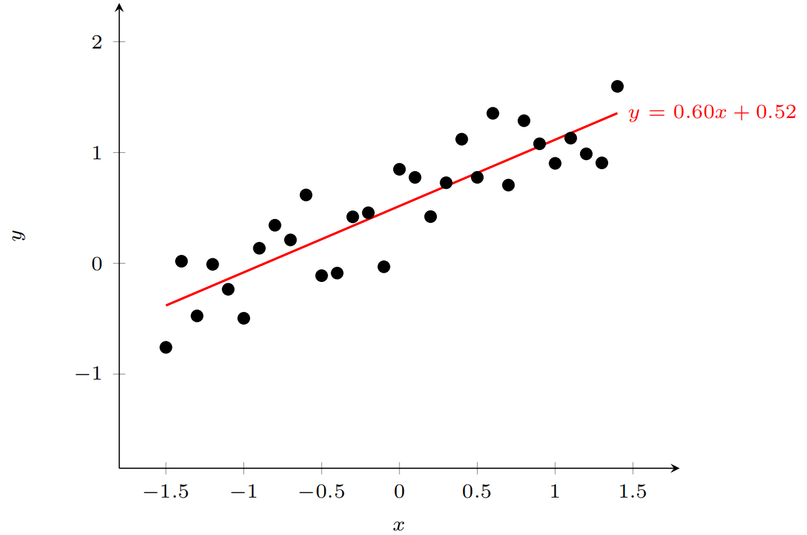
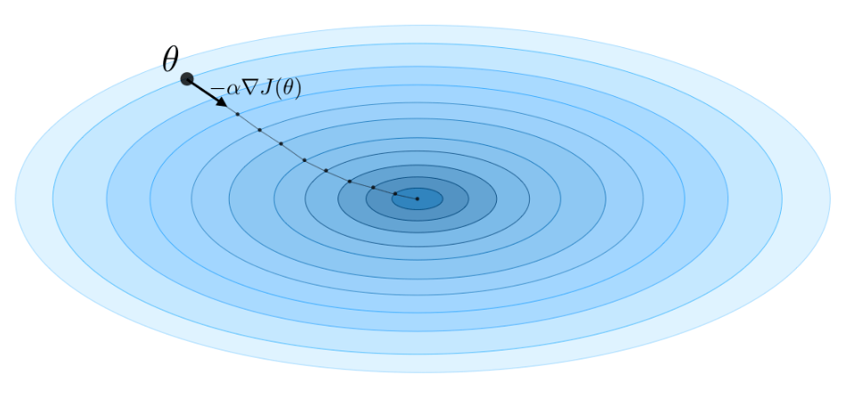

## 线性回归

### 线性回归模型

**线性回归(linear regression)**是机器学习和统计学中最基础和广泛应用的模型，是一种对自变量和隐变量之间关系进行建模的回归分析。自变量数量为1时称为**简单线性回归**，自变量数量大于1时称为**多元线性回归**。

从机器学习的角度看，输入就是样本的特征向量$\boldsymbol x\in \mathbb R^d$，其每一维对应一个自变量(数据的特征)；输出是标签$y$，这里$y\in \mathbb R$是连续值(实数或连续整数)。假设空间是一组参数化的线性函数$f(\boldsymbol x;\boldsymbol w;b)=\boldsymbol w^\text T \boldsymbol x+b$，其中**权重向量**$\boldsymbol w$与输入$\boldsymbol x$维度相同，**偏置**$b$是一个标量，二者都是**可学习的参数**。令$\boldsymbol x$再拼接一个常数$1$，$\boldsymbol w$再拼接一个偏置$b$，线性模型就可以更简洁地用$f(\boldsymbol x;\boldsymbol w)=\boldsymbol w^\text T \boldsymbol x$来表示。

线性回归的示意图如下：



### 线性回归经验风险最小化

给定一组包含$N$个训练样本的训练集$\mathcal D=\{(\boldsymbol x^{(n)},y^{(n)})\},1\leq n\leq N$，我们希望能够学习一个最优的线性回归的模型参数$\boldsymbol w$。由于线性回归的标签$y$和模型输出都为连续实值，因此**平方损失函数**非常适合来衡量真实标签和预测标签之间的差异。根据经验风险最小化准则，训练集上的经验风险定义为：
$$
\begin{aligned}
\mathcal R(w)&=\sum_{n=1}^{N}L(y^{(n)},f(\boldsymbol x^{(n)};\boldsymbol w))\\
&=\frac{1}{2}\sum_{n=1}^{N}(y^{(n)}-\boldsymbol w^\text T \boldsymbol x^{(n)})^2\\
&=\frac{1}{2}\|\boldsymbol y-X^\text T \boldsymbol w\|^2
\end{aligned}
$$

其中，$\boldsymbol y \in \mathbb R^N$是由每个样本的真实标签$y^{(1)},y^{(2)},\cdots,y^{(N)}$组成的**列向量**，$X \in \mathbb R^{(d+1)\times N}$是所有输入列向量$x^{(1)},x^{(2)},\cdots,x^{(N)}$组成的矩阵，**该矩阵一行表示一个输入特征，一列表示一个样本**：
$$
X = \begin{bmatrix}
x_1^{(1)} & x_1^{(2)} & \cdots & x_1^{(N)} \\
x_2^{(1)} & x_2^{(2)} & \cdots & x_2^{(N)} \\
\vdots & \vdots & \ddots & \vdots \\
x_d^{(1)} & x_d^{(2)} & \cdots & x_d^{(N)}\\
1 & 1 & \cdots & 1
\end{bmatrix}
$$
风险函数$\mathcal R(\boldsymbol w)$是关于$\boldsymbol w$的**凸函数**，其对$\boldsymbol w$的偏导数为(此处涉及**向量对向量求导**，$a$维向量对$b$维向量求导，结果为$b\times a$大小的**雅克比矩阵**)：
$$
\frac{\partial \mathcal R(\boldsymbol w)}{\partial \boldsymbol w}=\frac{1}{2}\frac{\partial \|\boldsymbol y-X^\text T \boldsymbol w\|^2}{\partial \boldsymbol w}=-X(\boldsymbol y-X^\text T \boldsymbol w)
$$
令该导数值为0，即可得到最优参数$\boldsymbol w^*=(XX^\text T)^{-1}X\boldsymbol y$。这便是线性回归最优解的矩阵表示形式。这种求解线性回归参数的方法也称为**最小二乘法(least square method, LSM)**。

在最小二乘法中，$X X^{\mathrm{T}} \in \mathbb{R}^{(d+1) \times(d+1)}$**必须存在逆矩阵**，即$X X^{\mathrm{T}}$是**满秩**的，$rank(XX^\text T)=d+1$。也就是说，$X$中的**行向量之间是线性不相关的**，即每一个**特征**都和其他特征不相关。一种常见的$X X^{\mathrm{T}}$不可逆的情况是样本数量$N$小于特征数量$d+1$，这时其秩为$N$，会存在很多解$\boldsymbol w^*$，使得$\mathcal R(\boldsymbol w)=0$。

当$XX^\text T$不可逆时，可以使用**主成分分析(principal components analysis)**来预处理数据，使特征独立，然后再使用最小二乘法进行求解。或者是**通过梯度下降法来迭代求解**，$\boldsymbol w$的更新公式为$\boldsymbol{w} \leftarrow \boldsymbol{w}+\alpha X\left(\boldsymbol{y}-X^{\mathrm{T}} \boldsymbol{w}\right)$。



其中$\alpha$是学习率。这种利用梯度下降法来估计参数的方法也称为**最小均方(least mean squares)**算法。由于风险函数$\mathcal R(\boldsymbol w)$是关于$\boldsymbol w$的**凸函数**，因此只要选取一个合适的学习率，最终风险函数总能收敛到全局最小值。

### 线性回归结构风险最小化

最小二乘法的基本要求是各个特征之间要互相独立，保证$XX^\text T$可逆。但即使$XX^\text T$可逆，如果特征之间有较大的**多重共线性**(即一个特征可以通过其他特征的线性组合来被较为准确地预测)，也会使得$XX^\text T$的逆**在数值上无法准确计算**。数据集$X$上一些小的扰就会导致$(XX^\text T)^{-1}$发生大的改变，进而使得最小二乘法的计算变得很不稳定。为了解决这个问题，Hoerl等人提出了**岭回归(ridge regression)**，给$XX^\text T$的对角线元素都加上一个常数$\lambda$使得$(XX^\text T+\lambda I)$满秩，即其行列式不为0,。最优的参数$\boldsymbol w^*$为：
$$
\boldsymbol w^*=(XX^\text T+\lambda I)^{-1}X\boldsymbol y
$$
其中$\lambda>0$为预先设置的超参数，$I$为单位矩阵。

岭回归的解可以看做是**结构风险最小化准则下的最小二乘法估计**，其目标函数可以写为：
$$
\mathcal R(\boldsymbol w)=\frac{1}{2}\|\boldsymbol y-X^\text T\boldsymbol w\|^2+\frac{1}{2}\lambda\|\boldsymbol w\|^2
$$

### 最大似然估计与均方误差

最小二乘法直接建模$\boldsymbol x$与$y$之间的函数关系$y=h(\boldsymbol x)$。线性回归还可以通过建模条件概率$p(y|\boldsymbol x)$来进行参数估计。

假设标签$y$为一个随机变量，其服从以均值为$f(\boldsymbol x;\boldsymbol w)=\boldsymbol w^\text T\boldsymbol x$，方差为$\sigma^2$的高斯分布：
$$
\begin{aligned}
p(y | \boldsymbol{x} ; \boldsymbol{w}, \sigma) &=\mathcal{N}\left(y ; \boldsymbol{w}^{\mathrm{T}} \boldsymbol{x}, \sigma^{2}\right) \\
&=\frac{1}{\sqrt{2 \pi} \sigma} \exp \left(-\frac{\left(y-\boldsymbol{w}^{\mathrm{T}} \boldsymbol{x}\right)^{2}}{2 \sigma^{2}}\right)
\end{aligned}
$$
参数$\boldsymbol w$在训练集$\mathcal D$上的**似然函数(likelihood)**为：
$$
\begin{aligned}
p(\boldsymbol{y} | X ; \boldsymbol{w}, \sigma) &=\prod_{n=1}^{N} p\left(y^{(n)} | \boldsymbol{x}^{(n)} ; \boldsymbol{w}, \sigma\right) \\
&=\prod_{n=1}^{N} \mathcal{N}\left(y^{(n)} ; \boldsymbol{w}^{\mathrm{T}} \boldsymbol{x}^{(n)}, \sigma^{2}\right)
\end{aligned}
$$
为了方便计算，对似然函数取对数得到**对数似然函数(log likelihood)**：
$$
\log p(\boldsymbol{y} | X ; \boldsymbol{w}, \sigma)=\sum_{n=1}^{N} \log \mathcal{N}\left(y^{(n)} ; \boldsymbol{w}^{\mathrm{T}} \boldsymbol{x}^{(n)}, \sigma^{2}\right)
$$
**最大似然估计(maximum likelihood estimation, MLE)**是指找到一组参数$\boldsymbol w$使得似然函数$p(\boldsymbol y|X;\boldsymbol w,\sigma)$最大，等价于对数似然函数$\log p(\boldsymbol y|X;\boldsymbol w,\sigma)$最大。令$\partial p(\boldsymbol y|X;\boldsymbol w,\sigma)/\partial \boldsymbol w=0$，得到$\boldsymbol{w}^{M L}=\left(X X^{\mathrm{T}}\right)^{-1} X \boldsymbol{y}$，这与最小二乘法的解相同。也可以将对数似然函数进行化简，显然得到了**均方误差(MSE)损失函数**的形式。因此，均方误差损失函数并不是凭空创造出来的，而是通过最大似然估计来最大化似然函数得到的结果。

### 最大后验估计与正则化

假设参数$\boldsymbol w$为一个随机向量，并服从一个先验分布$p(\boldsymbol{w} ; \nu)$。通常一般令$p(\boldsymbol{w} ; \nu)$为**各向同性的高斯分布**：
$$
p(\boldsymbol{w} ; \nu)=\mathcal{N}\left(\boldsymbol{w} ; \mathbf{0}, \nu^{2} I\right)
$$
其中$\nu^2$为每一维上的方差。

根据贝叶斯公式，参数$\boldsymbol w$的**后验分布(posterior distribution)**为：
$$
\begin{aligned}
p(\boldsymbol{w} | X, \boldsymbol{y} ; \nu, \sigma) &=\frac{p(\boldsymbol{w}, \boldsymbol{y} | X ; \nu, \sigma)}{\sum_{\boldsymbol{w}} p(\boldsymbol{w}, \boldsymbol{y} | X ; \nu, \sigma)} \\
& \propto p(\boldsymbol{y} | X, \boldsymbol{w} ; \sigma) p(\boldsymbol{w} ; \nu)
\end{aligned}
$$
其中，$p(\boldsymbol y|X;\boldsymbol w,\sigma)$为$\boldsymbol w$的似然函数，$p(\boldsymbol w;\nu)$为$\boldsymbol w$的先验。

这种参数估计方法称为**贝叶斯估计(Bayesian estimation)**，是一种统计推断问题。采用贝叶斯估计的线性回归也称为**贝叶斯线性回归(Bayesian linear regression)**。

贝叶斯估计是一种参数的区间估计，即参数在一个区间上的分布。如果我们希望得到一个最优的参数值(点估计)，可以使用最大后验估计。**最大后验估计(maximum a posteriori estimation, MAP)**是指最优参数为后验分布$p(\boldsymbol w|X,\boldsymbol y;\nu,\sigma)$中概率密度最高的参数$\boldsymbol w$。
$$
\boldsymbol{w}^{M A P}=\underset{\boldsymbol{w}}{\arg \max } p(\boldsymbol{y} | X, \boldsymbol{w} ; \sigma) p(\boldsymbol{w} ; \nu)
$$
令似然函数为最大似然估计中的高斯密度函数，则后验分布$p(\boldsymbol w|X,\boldsymbol y;\nu,\sigma)$的对数为：
$$
\begin{aligned}
\log p(\boldsymbol{w} | X, \boldsymbol{y} ; \nu, \sigma) & \propto \log p(\boldsymbol{y} | X, \boldsymbol{w} ; \sigma)+\log p(\boldsymbol{w} ; \nu) \\
& \propto-\frac{1}{2 \sigma^{2}} \sum_{n=1}^{N}\left(y^{(n)}-\boldsymbol{w}^{\mathrm{T}} \boldsymbol{x}^{(n)}\right)^{2}-\frac{1}{2 \nu^{2}} \boldsymbol{w}^{\mathrm{T}} \boldsymbol{w} \\
&=-\frac{1}{2 \sigma^{2}}\left\|\boldsymbol{y}-X^{\mathrm{T}} \boldsymbol{w}\right\|^{2}-\frac{1}{2 \nu^{2}} \boldsymbol{w}^{\mathrm{T}} \boldsymbol{w}
\end{aligned}
$$
可以看出，最大后验概率等价于平方损失的**结构风险最小化**，其中正则化系数$\lambda=\sigma^2/\nu^2$。值得注意的是，这里假设参数$\boldsymbol w$的先验服从**高斯分布**，因而推导出了均方误差+$L_2$正则化的损失函数形式；若假设参数$\boldsymbol w$的先验服从**拉普拉斯分布**，则能够推导出均方误差+$L_1$正则化的损失函数形式。因此，最大后验估计其实是正则化的数学根源。

### 基于numpy实现线性回归模型

```python
# 基于numpy实现线性回归模型

import numpy as np
import pandas as pd
from sklearn.datasets import load_diabetes
from sklearn.utils import shuffle


# 初始化模型参数
def initialize_params(dims):
    w = np.zeros((dims, 1))  # 初始化权重参数为零矩阵
    b = 0  # 初始化偏差参数为零
    return w, b


# 定义模型主体部分，包括线性回归公式、均方损失和参数偏导三部分
def linear_loss(X, y, w, b):
    num_train = X.shape[0]  # 训练样本数量
    num_feature = X.shape[1]  # 训练特征数量
    y_hat = np.dot(X, w) + b  # 线性回归预测输出
    loss = np.sum((y_hat - y) ** 2) / num_train  # 计算预测输出与实际标签之间的均方损失
    dw = np.dot(X.T, (y_hat - y)) / num_train  # 基于均方损失对权重参数的一阶偏导数
    db = np.sum((y_hat - y)) / num_train  # 基于均方损失对偏差项的一阶偏导数
    return y_hat, loss, dw, db


# 定义线性回归模型训练过程
def linear_train(X, y, learning_rate=0.01, epochs=10000):
    loss_his = []  # 记录训练损失的空列表
    w, b = initialize_params(X.shape[1])  # 初始化模型参数
    for i in range(1, epochs):  # 迭代训练
        # 计算当前迭代的预测值、损失和梯度
        y_hat, loss, dw, db = linear_loss(X, y, w, b)
        # 基于梯度下降的参数更新
        w += -learning_rate * dw
        b += -learning_rate * db
        loss_his.append(loss)  # 记录当前迭代的损失
        if i % 10000 == 0:  # 每1000次迭代打印当前损失信息
            print('epoch %d loss %f' % (i, loss))
        # 将当前迭代步优化后的参数保存到字典
        params = {
            'w': w,
            'b': b
        }
        # 将当前迭代步的梯度保存到字典
        grads = {
            'dw': dw,
            'db': db
        }
    return loss_his, params, grads


# 从scikit-learn中读取数据
diabetes = load_diabetes()  # 获取diabetes数据集
data, target = diabetes.data, diabetes.target  # 获取输入和标签
X, y = shuffle(data, target, random_state=13)  # 打乱数据集
offset = int(X.shape[0] * 0.8)  # 按照8/2划分训练集和测试集
X_train, y_train = X[:offset], y[:offset]  # 训练集
X_test, y_test = X[offset:], y[offset:]  # 测试集
y_train = y_train.reshape((-1, 1))  # 将训练集改为列向量的形式
y_test = y_test.reshape((-1, 1))  # 将验证集改为列向量的形式
# 打印训练集和测试集维度
print("X_train's shape: ", X_train.shape)
print("X_test's shape: ", X_test.shape)
print("y_train's shape: ", y_train.shape)
print("y_test's shape: ", y_test.shape)

# 线性回归模型训练
loss_his, params, grads = linear_train(X_train, y_train, 0.01, 200000)
print(params)  # 打印训练后得到模型参数


# 定义线性回归预测函数
def predict(X, params):
    w = params['w']
    b = params['b']
    y_pred = np.dot(X, w) + b
    return y_pred


y_pred = predict(X_test, params)
print(y_pred[:5])


# 定义R2函数
def r2_score(y_test, y_pred):
    y_avg = np.mean(y_test)  # 测试标签均值
    ss_tot = np.sum((y_test - y_avg) ** 2)  # 总离差平方和
    ss_res = np.sum((y_test - y_pred) ** 2)  # 残差平方和
    r2 = 1 - (ss_res / ss_tot)  # R2计算
    return r2


print(r2_score(y_test, y_pred))
```

### 使用scikit-learn中的线性回归算法对波士顿房价进行预测

```python
import numpy as np
import matplotlib.pyplot as plt
from sklearn.datasets import load_boston
from sklearn.linear_model import LinearRegression
from sklearn.model_selection import train_test_split
from sklearn.preprocessing import PolynomialFeatures
from sklearn.metrics import r2_score
from sklearn.decomposition import PCA

boston_data = load_boston()  # 载入波士顿房价数据

X = boston_data['data']
y = boston_data['target']
feature_names = boston_data['feature_names']

X_train, X_test, y_train, y_test = train_test_split(X, y, test_size=0.2)  # 将数据划分为训练集和测试集

print(X_train.shape, X_test.shape, y_train.shape, y_test.shape)  # 共506个样本，每个样本有13个特征
print(feature_names)  # ['CRIM' 'ZN' 'INDUS' 'CHAS' 'NOX' 'RM' 'AGE' 'DIS', ...]

# 线性回归模型
lin_reg = LinearRegression()  # 定义线性回归对象
lin_reg.fit(X_train, y_train)  # 训练
y_pred = lin_reg.predict(X_test)  # 测试
print('r2 score in test set using 13 original features: ', r2_score(y_test, y_pred))  # R2 score约为67.7

# 为原始数据添加多项式特征
poly_feature = PolynomialFeatures(degree=2)  # 当degree>2时，出现过拟合现象

X_train_poly = poly_feature.fit_transform(X_train)
X_test_poly = poly_feature.fit_transform(X_test)
print(X_train_poly.shape, X_test_poly.shape)

lin_reg_poly = LinearRegression()
lin_reg_poly.fit(X_train_poly, y_train)
y_pred = lin_reg_poly.predict(X_test_poly)
print('r2 score in test set using polynomial features: ', r2_score(y_test, y_pred))  # R2 score约为81.8

# 仅选择一个特征(5)对数据和模型进行可视化
line_reg_one = LinearRegression()
line_reg_one.fit(X_train[:, 5].reshape(-1, 1), y_train)
y_pred = line_reg_one.predict(X_test[:, 5].reshape(-1, 1))

# 绘制数据分布
plt.scatter(X_train[:, 5], y_train, label='training set')
plt.scatter(X_test[:, 5], y_test, label='test set')

# 绘制训练得到的模型
x_plot = np.linspace(3, 9, 100)
y_plot = line_reg_one.predict(x_plot.reshape(-1, 1))
plt.plot(x_plot, y_plot, color='red')
plt.title('linear regression with one feature')
plt.legend()
plt.show()

# 欠拟合、拟合和过拟合在线性回归中的的示例
X_fit = np.linspace(-2, 2, 100)
y_fit = X_fit * X_fit + np.random.normal(0, 0.5, 100)

lin_reg_fit = LinearRegression()

poly_list = [1, 2, 50]
for i in range(len(poly_list)):
    poly_feature_fit = PolynomialFeatures(degree=poly_list[i])
    X_poly_fit = poly_feature_fit.fit_transform(X_fit.reshape(-1, 1))
    print(poly_list[i], X_poly_fit.shape)

    lin_reg_fit.fit(X_poly_fit, y_fit)
    y_pred_fit = lin_reg_fit.predict(poly_feature_fit.fit_transform(X_fit.reshape(-1, 1)))
    plt.plot(X_fit, y_pred_fit, label='degree: {}'.format(poly_list[i]))

plt.scatter(X_fit, y_fit)
plt.title('under-fitting, fitting and over-fitting')
plt.legend()
plt.show()
```

### 参考资料

- 邱锡鹏. 神经网络与深度学习. 北京: 机械工业出版社, 2020.
- 鲁伟. 机器学习：公式推导与代码实现. 北京: 人民邮电出版社, 2022.
- Stanford University机器学习笔记：https://stanford.edu/~shervine/teaching/

