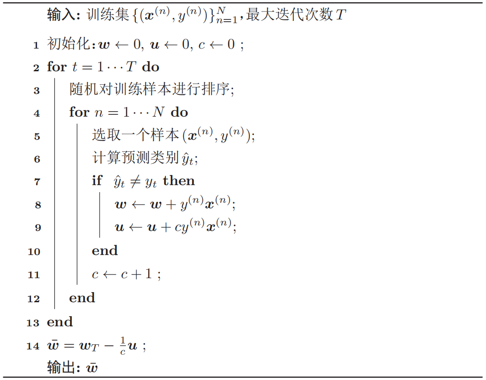

## 感知机

### 感知机算法

**感知机(perceptron)**由Frank Rosenblatt于1957年提出，是一种广泛使用的线性分类器。感知器可谓是最简单的人工神经网络，只有一个神经元，是对生物神经元的简单数学模拟，有与生物神经元相对应的部件，如**权重(突触)、偏置(阈值)及激活函数(细胞体)**，输出为+1或-1。

感知机是一种二分类线性模型，其分类准则为$\hat y=\text{sgn}(\boldsymbol w^\text T \boldsymbol x)$。给定$N$个样本的训练集$\{(\boldsymbol x^{(n)},y^{(n)})\}_{n=1}^N$，其中$y^{(n)}\in \{+1,-1\}$，感知机学习算法视图找到一组参数$\boldsymbol w^*$，使得对于每个样本$\{(\boldsymbol x^{(n)},y^{(n)})\}$有：
$$
y^{(n)} \boldsymbol{w}^{* \mathrm{T}} \boldsymbol{x}^{(n)}>0, \quad \forall n \in[1, N]
$$
只有当训练集是**线性可分**的情况下，上式才能满足。感知机的学习算法是一种错误驱动的在线学习算法。先初始化一个权重向量$\boldsymbol w \leftarrow \boldsymbol 0$，然后每次分错一个样本$(\boldsymbol x,y)$时，即$y \boldsymbol{w}^{\mathrm{T}} \boldsymbol{x}<0$，就用该样本更新权重：
$$
\boldsymbol{w} \leftarrow \boldsymbol{w}+y \boldsymbol{x}
$$
可以在$y\boldsymbol x$前加一个**学习率**。根据感知机的学习策略，可以反推出感知机在样本$(\boldsymbol x,y)$上的**损失函数**为：
$$
\mathcal{L}(\boldsymbol{w} ; \boldsymbol{x}, y)=\max \left(0,-y \boldsymbol{w}^{\mathrm{T}} \boldsymbol{x}\right)
$$
采用随机梯度下降，其每次更新的梯度为：
$$
\frac{\partial \mathcal{L}(\boldsymbol{w} ; \boldsymbol{x}, y)}{\partial \boldsymbol{w}}=\left\{\begin{array}{ll}
0 & \text { if } \quad y \boldsymbol{w}^{\mathrm{T}} \boldsymbol{x}>0 \\
-y \boldsymbol{x} & \text { if } \quad y \boldsymbol{w}^{\mathrm{T}} \boldsymbol{x}<0
\end{array}\right.
$$
具体的感知机参数学习算法如下所示：


下图给出了感知机参数学习的更新过程，其中红色实心点为正例，蓝色空心点为负例。黑色箭头表示权重向量，红色虚线箭头表示权重的更新方向。


### 感知机算法的收敛性

Novikoff证明对于两类问题，**如果训练集是线性可分的，那么感知器算法可以在有限次迭代后收敛**。然而，如果训练集不是线性可分的，那么这个算法则**不能确保会收敛**。

当数据集是两类线性可分时，对于训练集$\mathcal{D}=\left\{\left(\boldsymbol{x}^{(n)}, y^{(n)}\right)\right\}_{n=1}^{N}$，其中$\boldsymbol x^{(n)}$为样本的增广特征向量，$y^{(n)}\in \{+1,-1\}$那么存在一个正的常数$\gamma>0$和权重向量$\boldsymbol w^*$，并且$\|\boldsymbol w^*\|=1$，对所有$n$都满足$(\boldsymbol{w}^{*})^{\mathrm{T}}(y^{(n)} \boldsymbol{x}^{(n)}) \geq \gamma$。可以证明，假设$R$是训练集$\mathcal D$中最大的特征向量的模，即$R=\underset n\max \|x^{(n)}\|$，如果训练集$\mathcal D$线性可分，二分类感知机参数学习算法的权重更新次数不超过$\frac{R^2}{\gamma^2}$。

证明：

感知机的权重向量更新方式为$\boldsymbol{w}_{k}=\boldsymbol{w}_{k-1}+y^{(k)} \boldsymbol{x}^{(k)}$，其中$\boldsymbol x^{(k)},y^{(k)}$表示第$k$个被错误分类的样本。因为**初始权重向量为0**，在第$K$次更新时感知机的权重向量为：
$$
\boldsymbol{w}_{K}=\sum_{k=1}^{K} y^{(k)} \boldsymbol{x}^{(k)}
$$

分别计算$\|\boldsymbol{w}_{K}\|^2$的上下界：

(1) $\|\boldsymbol{w}_{K}\|^2$的上界为：
$$
\begin{aligned}
\left\|\boldsymbol{w}_{K}\right\|^{2} &=\left\|\boldsymbol{w}_{K-1}+y^{(K)} \boldsymbol{x}^{(K)}\right\|^{2} \\
&=\left\|\boldsymbol{w}_{K-1}\right\|^{2}+\left\|y^{(K)} \boldsymbol{x}^{(K)}\right\|^{2}+2 y^{(K)} \boldsymbol{w}_{K-1}^{\mathrm{T}} \boldsymbol{x}^{(K)} \\
& \leq\left\|\boldsymbol{w}_{K-1}\right\|^{2}+R^{2} \\
& \leq\left\|\boldsymbol{w}_{K-2}\right\|^{2}+2 R^{2} \\
& \leq K R^{2}
\end{aligned}
$$
(2) $\|\boldsymbol{w}_{K}\|^2$的下界为：
$$
\begin{aligned}
\left\|\boldsymbol{w}_{K}\right\|^{2} &=\left\|\boldsymbol{w}^{*}\right\|^{2} \cdot\left\|\boldsymbol{w}_{K}\right\|^{2} \\
& \geq\left\|\boldsymbol{w}^{* \mathrm{T}} \boldsymbol{w}_{K}\right\|^{2} \\
&=\left\|\boldsymbol{w}^{* \mathrm{T}} \sum_{k=1}^{K}\left(y^{(k)} \boldsymbol{x}^{(k)}\right)\right\|^{2} \\
&=\left\|\sum_{k=1}^{K} \boldsymbol{w}^{* \mathrm{T}}\left(y^{(k)} \boldsymbol{x}^{(k)}\right)\right\|^{2} \\
& \geq K^{2} \gamma^{2}
\end{aligned}
$$
联立上下界，可得$K^{2} \gamma^{2} \leq\left\|\boldsymbol{w}_{K}\right\|^{2} \leq K R^{2}$。进一步可得到$K^{2} \gamma^{2} \leq K R^{2}$，即$K\leq \frac{R^2}{\gamma^2}$。因此，在线性可分的条件下，感知机的参数学习算法会在有限步内收敛。

虽然感知器在线性可分的数据上可以保证收敛，但其存在以下不足：

(1) 在数据集线性可分时，感知器虽然可以找到一个超平面把两类数据分开，但**并不能保证其泛化能力。**

(2) 感知器**对样本顺序比较敏感**。每次迭代的顺序不一致时，找到的分割超平面也往往不一致。

(3) 如果训练集**不是线性可分**的，就永远不会收敛。

### 参数平均感知机

**感知器学习到的权重向量和训练样本的顺序相关**。在迭代次序上排在后面的错误样本比前面的错误样本，对最终的权重向量影响更大。比如有1000 个训练样本，在迭代100个样本后，感知器已经学习到一个很好的权重向量。在接下来的899个样本上都预测正确，也没有更新权重向量。但是，在最后第1000个样本时预测错误，并更新了权重。这次更新可能反而使得权重向量变差。

为改善这种情况，可以使用“**参数平均**”策略来提高感知机的鲁棒性，也叫投票感知机(voted perceptron)。投票感知机记录第$k$次更新后得到的权重$\boldsymbol w_k$在之后的训练过程中正确分类样本的次数$c_k$。这样最后的分类器形式为：
$$
\hat{y}=\operatorname{sgn}\left(\sum_{k=1}^{K} c_{k} \operatorname{sgn}\left(\boldsymbol{w}_{k}^{\mathrm{T}} \boldsymbol{x}\right)\right)
$$
投票感知器虽然提高了感知器的泛化能力，但是需要保存$K$个权重向量。在实际操作中会带来额外开销。因此经常会使用一个简化的版本，叫做**平均感知器(averaged perceptron)**。平均感知器的形式为：
$$
\begin{aligned}
\hat{y} &=\operatorname{sgn}\left(\sum_{k=1}^{K} c_{k}(\boldsymbol{w}_{k}^{\mathrm{T}} \boldsymbol{x})\right) \\
&=\operatorname{sgn}\left((\sum_{k=1}^{K} c_{k} \boldsymbol{w}_{k})^{\mathrm{T}} \boldsymbol{x}\right) \\
&=\operatorname{sgn}\left(\bar{\boldsymbol{w}}^{\mathrm{T}} \boldsymbol{x}\right)
\end{aligned}
$$
其中$\bar{\boldsymbol w}$为平均的权重向量。

假设$\boldsymbol w_{t,n}$是在第$t$轮更新到第$n$个样本时权重向量的值，平均的权重向量$\bar{\boldsymbol w}$也可以写为：
$$
\overline{\boldsymbol{w}}=\frac{\sum_{t=1}^{\mathrm{T}} \sum_{n=1}^{n} \boldsymbol{w}_{t, n}}{n T}
$$
这个方法非常简单，只需要在原始参数学习算法中增加一个$\bar{\boldsymbol w}$，并在处理每一个样本后更新$\bar{\boldsymbol w}$：
$$
\overline{\boldsymbol{w}} \leftarrow \overline{\boldsymbol{w}}+\boldsymbol{w}_{t, n}
$$
但这个方法需要在处理每一个样本时都要更新$\bar{\boldsymbol w}$。因为$\bar{\boldsymbol w}$和$\boldsymbol w_{t,n}$都是稠密向量，所以更新操作比较费时。为了提高迭代速度，有很多改进的方法，让这个更新只需要在错误预测发生时才进行更新。一个改进的平均感知机算法的训练过程如下所示：



### 基于numpy的感知机实现

```python
import numpy as np


class Perceptron:
    def __init__(self):
        pass

    def sign(self, x, w, b):
        return np.dot(x, w) + b
    
    def initilize_with_zeros(self, dim):
        w = np.zeros(dim)
        b = 0.0
        return w, b

    def train(self, X_train, y_train, learning_rate):
        # 参数初始化
        w, b = self.initilize_with_zeros(X_train.shape[1])
        # 初始化误分类
        is_wrong = False
        while not is_wrong:
            wrong_count = 0
            for i in range(len(X_train)):
                X = X_train[i]
                y = y_train[i]
                # 如果存在误分类点，更新参数，直到没有误分类点
                if y * self.sign(X, w, b) <= 0:
                    w = w + learning_rate * np.dot(y, X)
                    b = b + learning_rate * y
                    wrong_count += 1
            if wrong_count == 0:
                is_wrong = True
                print('There is no missclassification!')

            # 保存更新后的参数
            params = {
                'w': w,
                'b': b
            }
        return params
```

### 使用scikit-learn中的感知机算法对自行构建的数据集进行二分类

```python
import numpy as np
from sklearn.datasets import make_classification
from sklearn.linear_model import Perceptron
from matplotlib import pyplot as plt
 
# 使用sklearn内置函数生成二分类的样本
X, y=make_classification(n_samples=1000, n_features=2, n_redundant=0, n_informative=1, n_clusters_per_class=1)

# 训练数据和测试数据
X_data_train = X[:800, :]
X_data_test = X[800:, :]
y_data_train = y[:800]
y_data_test = y[800:]
positive_X1 = [X[i, 0] for i in range(1000) if y[i] == 1]
positive_X2 = [X[i, 1] for i in range(1000) if y[i] == 1]
negetive_X1 = [X[i, 0] for i in range(1000) if y[i] == 0]
negetive_X2 = [X[i, 1] for i in range(1000) if y[i] == 0]
 
# 构建感知机
clf = Perceptron(fit_intercept=False, n_iter=30, shuffle=False)
 
# 使用训练数据进行训练
clf.fit(X_data_train, y_data_train)
# 得到训练结果，权重矩阵
print(clf.coef_)
# 输出为：[[0.21720699 2.49185955]]

# 预测
acc = clf.score(X_data_test, y_data_test)
print(acc)
 
plt.scatter(positive_X1, positive_X2, c='red')
plt.scatter(negetive_X1, negetive_X2, c='blue')
# 绘制出分类超平面
line_X = np.arange(-4,4)
line_y = line_X * (-clf.coef_[0][0] / clf.coef_[0][1]) - clf.intercept_
plt.plot(line_X, line_y)
plt.show()
```

### 参考资料

- 李航. 统计学习方法. 北京: 清华大学出版社, 2019.
- 邱锡鹏. 神经网络与深度学习. 北京: 机械工业出版社, 2020.
- 鲁伟. 机器学习: 公式推导与代码实现. 北京: 人民邮电出版社, 2022.
- 利用scikit-learn实现感知机：https://blog.csdn.net/weixin_38300566/article/details/80757105

