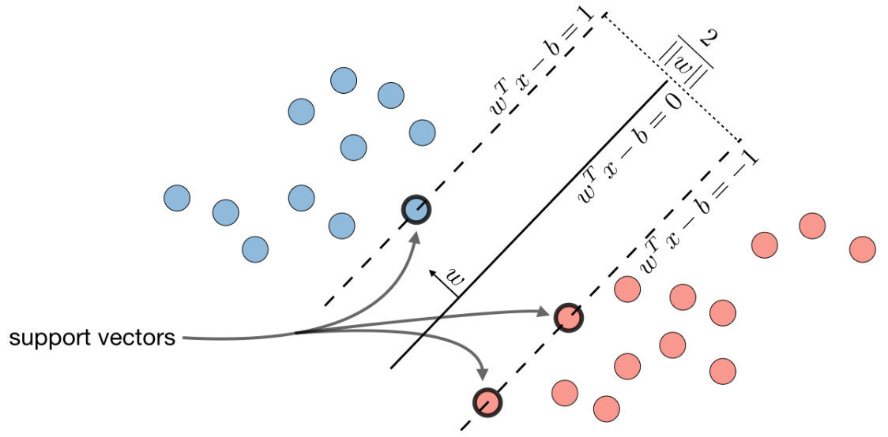
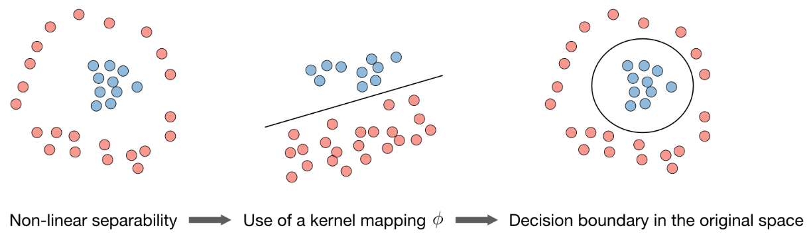

## 支持向量机

### 线性支持向量机与硬间隔最大化

**支持向量机(support vector machine, SVM)**是一个经典的机器学习二分类算法，其找到的分割超平面具有更好的鲁棒性，因此广泛使用在很多任务上，并表现出了很强的优势。

给定一个二分类数据集$\mathcal{D}=\{(\boldsymbol{x}^{(n)}, y^{(n)})\}_{n=1}^{N}$，其中$y_n \in \{+1,-1\}$，如果两类样本是线性可分的，即存在一个超平面$\boldsymbol{w}^{\mathrm{T}} \boldsymbol{x}+b=0$将两类样本分开，对于每一类样本都有$y^{(n)}(\boldsymbol{w}^{\mathrm{T}} \boldsymbol{x}^{(n)}+b)>0$。

数据集$\mathcal D$中的每个样本$\boldsymbol x^{(n)}$到分割超平面的距离为：
$$
\gamma^{(n)}=\frac{\|\boldsymbol{w}^{\mathrm{T}} \boldsymbol{x}^{(n)}+b\|}{\|\boldsymbol{w}\|}=\frac{y^{(n)}(\boldsymbol{w}^{\mathrm{T}} \boldsymbol{x}^{(n)}+b)}{\|\boldsymbol{w}\|}
$$
定义整个数据集$\mathcal D$中所有样本到分割超平面的最短距离为**间隔(margin)**，用$\gamma$来表示：
$$
\gamma=\min _{n} \gamma^{(n)}
$$
如果间隔$\gamma$越大，其分割超平面对两个数据集的划分越稳定，不容易受噪声等因素影响。支持向量机的目标是寻找一个超平面$(\boldsymbol w^*,b^*)$使得$\gamma$最大，即：
$$
\begin{aligned}
\underset{\boldsymbol{w}, b}\max \ \ & \gamma \\
\text { s.t. } \ \ & \frac{y^{(n)}\left(\boldsymbol{w}^{\mathrm{T}} \boldsymbol{x}^{(n)}+b\right)}{\|\boldsymbol{w}\|} \geq \gamma, \forall n
\end{aligned}
$$
数据集中所有满足$y^{(n)}(\boldsymbol w^\text T \boldsymbol x^{(n)}+b)=1$的样本点称为支持向量(support vector)。两个异类支持向量到超平面的距离之和为$\gamma \times 2=2\|\boldsymbol w\|^{-1}$。因此，支持向量机的目标可以等价于下式：
$$
\begin{aligned}
\underset{\boldsymbol{w}, b}\max \ \ & \frac{1}{\|\boldsymbol w\|} \\
\text { s.t. } \ \ & {y^{(n)}(\boldsymbol{w}^{\mathrm{T}} \boldsymbol{x}^{(n)}+b)} \geq 1, \forall n
\end{aligned}
$$
显然，为了最大化间隔，仅需最大化$\|\boldsymbol w\|^{-1}$，这等价于最小化$\|\boldsymbol w\|^2$。于是，上式又可以重写为：
$$
\begin{aligned}
\underset{\boldsymbol{w}, b}\min \ \  & \frac{1}{2}\|\boldsymbol w\|^2 \\
\text { s.t. } \ \ & {y^{(n)}(\boldsymbol{w}^{\mathrm{T}} \boldsymbol{x}^{(n)}+b)} \geq 1, \forall n
\end{aligned}
$$
这就是支持向量机的基本型。下图展示了分割超平面、支持向量以及间隔之间的关系。



为了找到最大间隔分割超平面，将上式目标函数写为凸优化问题：
$$
\begin{aligned}
\underset{\boldsymbol{w}, b}\min \ \ & \frac{1}{2}\|\boldsymbol w\|^2\\
\text { s.t. } \ \ & 1-y^{(n)}\left(\boldsymbol{w}^{\mathrm{T}} \boldsymbol{x}^{(n)}+b\right) \leq 0, \quad \forall n
\end{aligned}
$$
使用**拉格朗日乘数法**，上式的拉格朗日函数为：
$$
\Lambda(\boldsymbol{w}, b, \lambda)=\frac{1}{2}\|\boldsymbol{w}\|^{2}+\sum_{n=1}^{N} \lambda_{n}(1-y^{(n)}(\boldsymbol{w}^{\mathrm{T}} \boldsymbol{x}^{(n)}+b))
$$
其中，$\lambda_{1} \geq 0, \cdots, \lambda_{N} \geq 0$为拉格朗日乘数。计算$\Lambda(\boldsymbol{w}, b, \lambda)$关于$\boldsymbol w$和$b$的导数，并令其等于0，可得：
$$
\begin{aligned}
\boldsymbol{w} &=\sum_{n=1}^{N} \lambda_{n} y^{(n)} \boldsymbol{x}^{(n)} \\
0 &=\sum_{n=1}^{N} \lambda_{n} y^{(n)}
\end{aligned}
$$
将上式带入到拉格朗日函数中，得到拉格朗日对偶函数：
$$
\Gamma(\lambda)=-\frac{1}{2} \sum_{n=1}^{N} \sum_{m=1}^{N} \lambda_{m} \lambda_{n} y^{(m)} y^{(n)}(\boldsymbol{x}^{(m)})^{\mathrm{T}} \boldsymbol{x}^{(n)}+\sum_{n=1}^{N} \lambda_{n}
$$
支持向量机的主优化问题为凸优化问题，满足**强对偶性**，可以通过多种凸优化方法来进行求解，得到拉格朗日乘数的最优值$\lambda^*$。但由于其**约束条件的数量为训练样本数量**，一般的优化方法代价比较高，因此在实践中通常采用比较高效的优化算法，比如**序列最小优化(sequential minimal optimization, SMO)**算法。

在计算出$\lambda^*$后，可以计算出最优权重$\boldsymbol w^*$，最优偏置$b^*$可以通过任选一个支持向量计算得到。

最优参数的支持向量机的决策函数为：
$$
f(\boldsymbol{x})=\operatorname{sgn}(\boldsymbol{w}^{* \mathrm{T}} \boldsymbol{x}+b^{*})=\operatorname{sgn}\left(\sum_{n=1}^{N} \lambda_{n}^{*} y^{(n)}(\boldsymbol{x}^{(n)})^{\mathrm{T}} \boldsymbol{x}+b^{*}\right)
$$

### 线性支持向量机与软间隔最大化

在支持向量机的优化问题中，约束条件比较严格。如果训练集中的样本在特征空间中不是线性可分的，就无法找到最优解。为能容忍部分不满足约束的样本，我们可以引入松弛变量$\xi$，将优化问题变为：
$$
\begin{aligned}
\min _{\boldsymbol{w}, b}\ \ & \frac{1}{2}\|\boldsymbol{w}\|^{2}+C \sum_{n=1}^{N} \xi_{n} \\ \text { s.t. } \ \ & 1-y^{(n)}(\boldsymbol{w}^{\mathrm{T}} \boldsymbol{x}^{(n)}+b)-\xi_{n} \leq 0,\ \ \forall n\\
& \xi_{n} \geq 0,\ \ \forall n
\end{aligned}
$$
其中参数$C>0$用来控制间隔和松弛变量惩罚的平衡。引入松弛变量的间隔称为**软间隔(soft margin)**。上式也可以表示为**经验风险+正则化项**的形式：
$$
\min _{\boldsymbol{w}, b} \sum_{n=1}^{N} \max (0,1-y^{(n)}(\boldsymbol{w}^{\mathrm{T}} \boldsymbol{x}^{(n)}+b))+\frac{1}{C} \cdot \frac{1}{2}\|\boldsymbol{w}\|^{2}
$$
其中，$\max (0,1-y^{(n)}(\boldsymbol{w}^{\mathrm{T}} \boldsymbol{x}^{(n)}+b))$称为**Hinge损失函数**。

### 非线性支持向量机与核函数

在前面的讨论中，我们假设训练样本是线性可分的。然而在现实任务中，原始样本空间内也许并不存在一个能正确划分两类样本的超平面，比如**“异或”问题**。

对于这类问题，可以通过一个非线性变换，即**核技巧(kernel trick)**，将输入空间映射到更高维的特征空间，使得样本在这个高维特征空间内线性可分。幸运的是，如果原始空间是有限维，即属性数有限，那么一定存在一个高维特征空间使样本可分。

令$\phi(\boldsymbol x)$表示将$\boldsymbol x$映射后的特征向量，于是，在特征空间中划分超平面所对应的模型可表示为$f(\boldsymbol x)=\boldsymbol w^\text T \phi(\boldsymbol x)+b$，其中$\boldsymbol w$和$b$是模型参数，因此原始问题形式只需将$\boldsymbol x$变为$\phi(\boldsymbol x)$即可。



在一个变换后的特征空间$\phi$中，支持向量机的决策函数为：
$$
\begin{aligned}
f(\boldsymbol{x}) &=\operatorname{sgn}(\boldsymbol{w}^{* \mathrm{T}} \phi(\boldsymbol{x})+b^{*}) \\
&=\operatorname{sgn}\left(\sum_{n=1}^{N} \lambda_{n}^{*} y^{(n)} K(\boldsymbol{x}^{(n)}, \boldsymbol{x})+b^{*}\right)
\end{aligned}
$$
其中$K(\boldsymbol x,\boldsymbol z)=\phi(\boldsymbol x)^\text T \phi(\boldsymbol z)$为核函数。通常我们不需要显式地给出$\phi(\boldsymbol  x)$的具体形式，可以通过核技巧来构造。例如以$\boldsymbol x,\boldsymbol z \in \mathbb R^2$为例，可以构造一个核函数$K(\boldsymbol{x}, \boldsymbol{z})=\left(1+\boldsymbol{x}^{\mathrm{T}} \boldsymbol{z}\right)^{2}=\phi(\boldsymbol{x})^{\mathrm{T}} \phi(\boldsymbol{z})$来隐式地计算$\boldsymbol x,\boldsymbol z$在特征空间$\phi$中的内积，其中$\phi(\boldsymbol{x})=\left[1, \sqrt{2} x_{1}, \sqrt{2} x_{2}, \sqrt{2} x_{1} x_{2}, x_{1}^{2}, x_{2}^{2}\right]^{\mathrm{T}}$。

### 线性可分支持向量机的算法实现

```python
import numpy as np
import pandas as pd
import matplotlib.pyplot as plt
from sklearn.datasets import make_blobs
from sklearn.model_selection import train_test_split
from cvxopt import matrix, solvers  # 凸优化求解库
from sklearn.metrics import accuracy_score

# 生成模拟二分类数据集
X, y = make_blobs(n_samples=150, n_features=2, centers=2, cluster_std=1.2, random_state=40)
colors = {0: 'r', 1: 'g'}
plt.scatter(X[:, 0], X[:, 1], marker='o', c=pd.Series(y).map(colors))
plt.show()

# 将标签转换为1/-1
y_ = y.copy()
y_[y_ == 0] = -1
y_ = y_.astype(float)

X_train, X_test, y_train, y_test = train_test_split(X, y_, test_size=0.3, random_state=43)
print(X_train.shape, y_train.shape, X_test.shape, y_test.shape)

# cvxopt库的使用示例
# 1. 定义二次规划参数
P = matrix([[1.0, 0.0], [0.0, 0.0]])
q = matrix([3.0, 4.0])
G = matrix([[-1.0, 0.0, -1.0, 2.0, 3.0], [0.0, -1.0, -3.0, 5.0, 4.0]])
h = matrix([0.0, 0.0, -15.0, 100.0, 80.0])
# 2. 构建求解
sol = solvers.qp(P, q, G, h)
# 3. 获取最优值
print(sol['x'], sol['primal objective'])


# 实现线性可分支持向量机
class Hard_Margin_SVM:
    # 线性可分支持向量机拟合方法
    def fit(self, X, y):
        # 训练样本数和特征数
        m, n = X.shape

        # 初始化二次规划相关变量：P/q/G/h
        self.P = matrix(np.identity(n + 1, dtype=np.float))
        self.q = matrix(np.zeros((n + 1,), dtype=np.float))
        self.G = matrix(np.zeros((m, n + 1), dtype=np.float))
        self.h = -matrix(np.ones((m,), dtype=np.float))

        # 将数据转为变量
        self.P[0, 0] = 0
        for i in range(m):
            self.G[i, 0] = -y[i]
            self.G[i, 1:] = -X[i, :] * y[i]

        sol = solvers.qp(self.P, self.q, self.G, self.h)  # 构建二次规划求解

        # 对权重和偏置寻优
        self.w = np.zeros(n, )
        self.b = sol['x'][0]
        for i in range(1, n + 1):
            self.w[i - 1] = sol['x'][i]
        return self.w, self.b

    # 定义模型预测函数
    def predict(self, X):
        return np.sign(np.dot(self.w, X.T) + self.b)


hard_margin_svm = Hard_Margin_SVM()  # 创建线性可分支持向量机模型实例
hard_margin_svm.fit(X_train, y_train)  # 执行训练
y_pred = hard_margin_svm.predict(X_test)  # 模型预测
print(accuracy_score(y_test, y_pred))  # 计算测试集准确率

```

### 使用scikit-learn中的支持向量机算法对鸢尾花数据进行分类

```python
import numpy as np
import matplotlib.pyplot as plt
from sklearn.svm import SVC, LinearSVC
from sklearn.datasets import load_iris
from sklearn.model_selection import train_test_split
from sklearn.metrics import classification_report


def plot_decision_boundary(model, axis):
    """
    在axis范围内绘制模型model的决策边界
    :param model: classification model which must have 'predict' function
    :param axis: [left, right, down, up]
    """
    x0, x1 = np.meshgrid(
        np.linspace(axis[0], axis[1], int((axis[1] - axis[0]) * 100)).reshape(-1, 1),
        np.linspace(axis[2], axis[3], int((axis[3] - axis[2]) * 100)).reshape(-1, 1),
    )
    X_new = np.c_[x0.ravel(), x1.ravel()]

    y_predict = model.predict(X_new)
    zz = y_predict.reshape(x0.shape)

    from matplotlib.colors import ListedColormap
    custom_cmap = ListedColormap(['#EF9A9A', '#FFF59D', '#90CAF9'])

    plt.contourf(x0, x1, zz, linewidth=5, cmap=custom_cmap)


X, y = load_iris(return_X_y=True)
X = X[:, :2]  # 仅选择前两个特征，便于绘制决策边界
X_train, X_test, y_train, y_test = train_test_split(X, y)
print(X_train.shape, X_test.shape, y_train.shape, y_test.shape)  # (112, 2) (38, 2) (112,) (38,)

lin_svc = LinearSVC()
lin_svc.fit(X_train, y_train)
print('classification accuracy of LinearSVC: ', lin_svc.score(X_test, y_test))

svc_rf = SVC(kernel='rbf', degree=5)
svc_rf.fit(X_train, y_train)
print('classification accuracy of SVC with RBF kernel: ', svc_rf.score(X_test, y_test))

plt.subplot(1, 2, 1)
plot_decision_boundary(lin_svc, axis=[3, 8, 1, 5])
plt.scatter(X_test[y_test == 0, 0], X_test[y_test == 0, 1])
plt.scatter(X_test[y_test == 1, 0], X_test[y_test == 1, 1])
plt.scatter(X_test[y_test == 2, 0], X_test[y_test == 2, 1])

plt.subplot(1, 2, 2)
plot_decision_boundary(svc_rf, axis=[3, 8, 1, 5])
plt.scatter(X_test[y_test == 0, 0], X_test[y_test == 0, 1])
plt.scatter(X_test[y_test == 1, 0], X_test[y_test == 1, 1])
plt.scatter(X_test[y_test == 2, 0], X_test[y_test == 2, 1])

plt.show()
```

### 参考资料

- 周志华. 机器学习. 北京: 清华大学出版社, 2016.
- 邱锡鹏. 神经网络与深度学习. 北京: 机械工业出版社, 2020.
- 鲁伟. 机器学习：公式推导与代码实现. 北京: 人民邮电出版社, 2022.
- Stanford University机器学习笔记：https://stanford.edu/~shervine/teaching/

