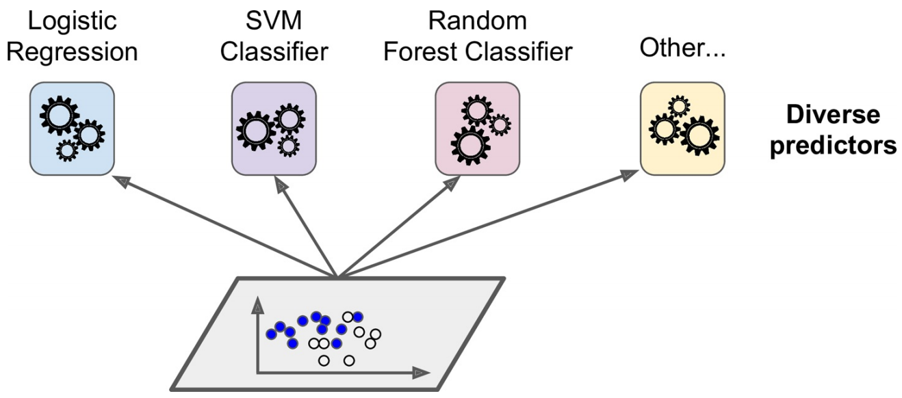
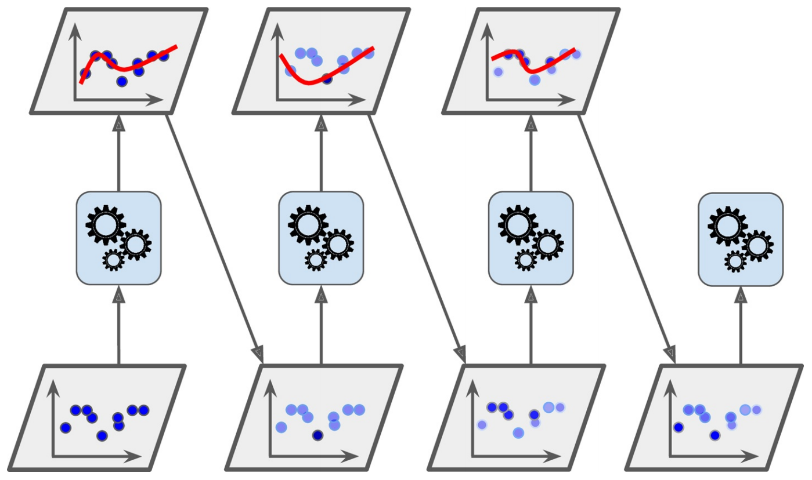
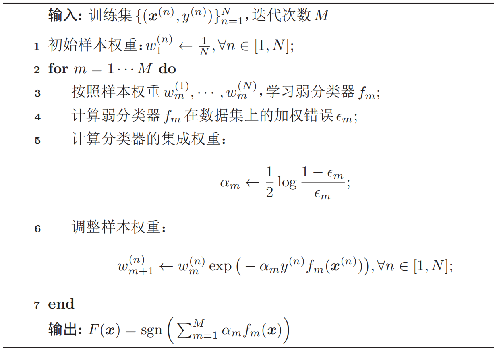
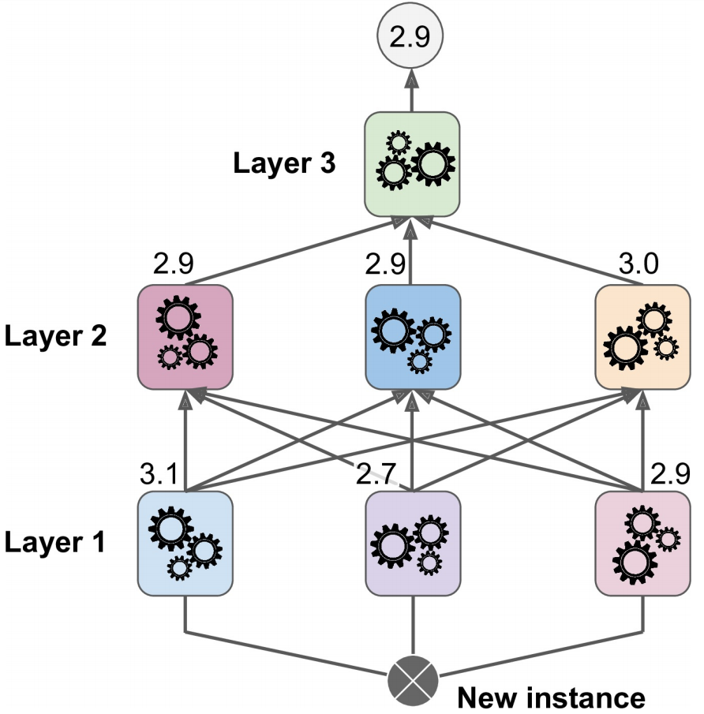

## 集成学习

### 个体与集成

**集成学习(ensemble learning)**通过构建并结合多个学习期来完成学习任务，有时也被称为**多分类器系统(multi-classifier system)**、**基于委员会的学习(committee-based learning)**等。

集成学习的思路如下：首先产生一组**个体学习器(indicidual learner)**，再用某种策略将它们结合起来。个体学习器(基学习器)通常由一个现有的学习算法(基学习算法)从训练数据中产生，例如决策树、BP神经网络等，此时集成中只包含同种类型的个体学习器，例如“决策树集成”中全是决策树，这样的集成是**同质的(homogeneous)**，同质集成中的个体学习器亦称为**基学习器(base learner)**。集成也可以包含不同类型的个体学习器，此时称其为**异质的(heterogenous)**，相应的个体学习器一般不称基学习器，而是称为**组件学习器(component learner)**。



历史上，Kearns和Valiant首先提出了**强可学习(strongly learnable)**和**弱可学习(weakly learnable)**的概念。他们指出：在**概率近似正确(probably approximately correct, PAC)**学习的框架中，一个概念(一个类)，如果存在一个多项式的学习算法能够学习它，并且正确率很高，就称这个概念是强可学习的；一个概念，如果存在一个多项式的学习算法能够学习它，学习的正确率仅比随机猜测略好，就称这个概念是弱可学习的。后来Schapire证明强可学习和弱可学习是等价的，也就是说，**在PAC学习的框架下，一个概念是强可学习的充分必要条件是这个概念是弱可学习的**。集成学习便是研究如何将弱学习算法提升为强学习算法的理论。

集成学习通过将多个学习器进行结合，常可获得比单一学习器显著优越的泛化性能。这对**弱学习器**尤为明显，因此集成学习的很多理论研究都是针对弱学习器进行的，而基学习器有时也被直接称为弱学习器。但需注意的是，虽然从理论上来说使用弱学习器集成足以获得好的性能，但在实践中，**往往会使用比较强的学习器进行集成**。

在经验中，如果把好坏不等的东西掺到一起，那么通常结果会是比最坏的要好一些，比最好的要坏一些。集成学习要获得比最好的单一学习器更好的性能，个体学习器应“**好而不同**”，即**个体学习器要同时具备准确性和多样性**。

根据个体学习器的生成方式，目前集成学习方法大致可分为两大类，即个体学习器之间存在强依赖关系、必须串行生成的**序列化方法**，以及个体学习器间不存在强依赖关系，可同时生成的**并行化方法**。前者的代表是**Boosting**，后者的代表是**Bagging和随机森林**。

### 集成学习的误差分析

给定一个学习任务，假设输入$x$与输出$y$的真实关系为$y=h(x)$。对于$M$个不同的模型$f_1(x),\cdots,f_M(x)$，每个模型的**期望错误**为：
$$
\begin{aligned}
\mathcal{R}(f_{m}) &=\mathbb{E}_{{x}}[(f_{m}({x})-h({x}))^{2}] \\
&=\mathbb{E}_{{x}}[\epsilon_{m}({x})^{2}]
\end{aligned}
$$
其中$\epsilon_{m}(\boldsymbol{x})=f_{m}({x})-h({x})$为模型$m$在样本$x$上的错误。那么所有模型的平均错误为：
$$
\bar{\mathcal{R}}(f)=\frac{1}{M} \sum_{m=1}^{M} \mathbb{E}_{\boldsymbol{x}}[\epsilon_{m}({x})^{2}]
$$
使用**投票法**进行模型结合时，最终模型的输出为：
$$
F({x})=\frac{1}{M} \sum_{m=1}^{M} f_{m}({x})
$$
对于投票法的误差，有如下定理：对于$M$个不同的模型$f_1(x),\cdots,f_M(x)$，其平均期望错误为$\bar{\mathcal R}(f)$。基于简单投票机制的集成模型$F(x)$的**期望错误**位于$\frac{1}{M}\bar{\mathcal R}(f)$和$\bar{\mathcal R}(f)$之间。证明如下：

根据定义，集成模型的期望错误为：
$$
\begin{aligned}
\mathcal{R}(F) &=\mathbb{E}_x\left[\left(\frac{1}{M} \sum_{m=1}^{M} f_{m}({x})-h({x})\right)^{2}\right] \\
&=\mathbb{E}_x\left[\left(\frac{1}{M} \sum_{m=1}^{M} \epsilon_{m}({x})\right)^{2}\right] \\
&=\frac{1}{M^{2}} \mathbb{E}_x\left[\sum_{m=1}^{M} \sum_{n=1}^{M} \epsilon_{m}({x}) \epsilon_{n}({x})\right] \\
&=\frac{1}{M^{2}} \sum_{m=1}^{M} \sum_{n=1}^{M} \mathbb{E}_{{x}}[\epsilon_{m}({x}) \epsilon_{n}({x})]
\end{aligned}
$$
其中$\mathbb{E}_{\boldsymbol{x}}[\epsilon_{m}({x}) \epsilon_{n}({x})]$是两个**不同模型错误的相关性**。若每个模型的错误**不相关**，即$\forall m \neq n, \mathbb{E}_{{x}}[\epsilon_{m}({x}) \epsilon_{n}({x})]=0$，此时$\mathcal R(F)$达到**下界**。如果每个模型的错误都是**相同的**，则$\forall m \neq n, \epsilon_{m}({x})=\epsilon_{n}({x})$，此时$\mathcal R(F)$达到**上界**。并且由于$\epsilon_{m}({x}) \geq 0, \forall m$，可以得到：
$$
\bar{\mathcal{R}}(f) \geq \mathcal{R}(F) \geq \frac{1}{M} \bar{\mathcal{R}}(f)
$$
即集成模型的期望错误大于等于所有模型的平均期望错误的$1/M$，小于等于所有模型的平均期望错误。因此模型之间的差异性对于提升模型集成效果是十分重要的。

### Boosting

Boosting类集成模型的目标是学习一个**加性模型(additive model)**。：
$$
F({x})=\sum_{m=1}^{M} \alpha_{m} f_{m}({x})
$$
其中$f_m(x)$为弱分类器或基分类器，$\alpha_m$为弱分类器的继承权重，$F(x)$称为强分类器。

Boosting类方法的关键是如何训练每个**弱分类器**$f_m(x)$以及对应的**权重**。为了提高集成的效果，应当**尽量使得每个弱分类器的差异尽可能大**。一种有效的算法是采用迭代的方法来学习每个弱分类器，即按照一定的顺序依次训练每个弱分类器。在学习了第$m$个弱分类器后，**增加其分错样本的权重**，使第$m+1$个弱分类器**更关注于前面弱分类器分错的样本**。这样增加每个弱分类器的差异，最终提升集成分类器的准确率。这种方法称为**AdaBoost算法**。



AdaBoost算法是一种**迭代式的训练算法**，通过改变数据分布来提高弱分类器的差异。在每一轮训练中，增加分错样本的权重，减少分对样本的权重，从而得到一个新的数据分布。

以**二分类**为例，AdaBoost算法的训练过程如下所示。**最初赋予每个样本同样的权重**，在每一轮迭代中，根据当前的样本权重训练一个新的弱分类器，然后根据这个弱分类器的错误率来计算其集成权重，并调整样本权重。



### 基于numpy的AdaBoost算法实现

```python
class Adaboost:
    def __init__(self, n_estimators=5):
        self.n_estimators = n_estimators  # 弱分类器个数

    # Adaboost拟合算法
    def fit(self, X, y):
        m, n = X.shape
        # (1) 初始化权重分布为均匀分布 1/N
        w = np.full(m, (1/m))
        self.estimators = []  # 基分类器列表
        # (2) for m in (1,2,...,M)
        for _ in range(self.n_estimators):
            # (2.a) 训练一个弱分类器：决策树桩
            estimator = DecisionStump()
            # 设定一个最小化误差
            min_error = float('inf')
            # 遍历数据集特征，根据最小分类误差率选择最优划分特征
            for i in range(n):
                # 获取特征值
                values = np.expand_dims(X[:, i], axis=1)
                # 特征取值去重
                unique_values = np.unique(values)
                # 尝试将每一个特征值作为分类阈值
                for threshold in unique_values:
                    p = 1
                    # 初始化所有预测值为1
                    pred = np.ones(np.shape(y))
                    # 小于分类阈值的预测值为-1
                    pred[X[:, i] < threshold] = -1
                    # 2.b 计算误差率
                    error = sum(w[y != pred])
                    
                    # 如果分类误差大于0.5，则进行正负预测翻转
                    # 例如 error = 0.6 => (1 - error) = 0.4
                    if error > 0.5:
                        error = 1 - error
                        p = -1

                    # 一旦获得最小误差则保存相关参数配置
                    if error < min_error:
                        estimator.label = p
                        estimator.threshold = threshold
                        estimator.feature_index = i
                        min_error = error
                        
            # 2.c 计算基分类器的权重
            estimator.alpha = 0.5 * np.log((1.0 - min_error) / (min_error + 1e-9))
            # 初始化所有预测值为1
            preds = np.ones(np.shape(y))
            # 获取所有小于阈值的负类索引
            negative_idx = (estimator.label * X[:, estimator.feature_index] < estimator.label * estimator.threshold)
            # 将负类设为 '-1'
            preds[negative_idx] = -1
            # 2.d 更新样本权重
            w *= np.exp(-estimator.alpha * y * preds)
            w /= np.sum(w)

            # 保存该弱分类器
            self.estimators.append(estimator)
    
    # 定义预测函数
    def predict(self, X):
        m = len(X)
        y_pred = np.zeros((m, 1))
        # 计算每个弱分类器的预测值
        for estimator in self.estimators:
            # 初始化所有预测值为1
            predictions = np.ones(np.shape(y_pred))
            # 获取所有小于阈值的负类索引
            negative_idx = (estimator.label * X[:, estimator.feature_index] < estimator.label * estimator.threshold)
            # 将负类设为 '-1'
            predictions[negative_idx] = -1
            # 2.e 对每个弱分类器的预测结果进行加权
            y_pred += estimator.alpha * predictions

        # 返回最终预测结果
        y_pred = np.sign(y_pred).flatten()
        return y_pred
```

### 使用scikit-learn中的AdaBoost算法完成自定义数据集上的分类任务

```python
import numpy as np
import matplotlib.pyplot as plt

from sklearn.ensemble import AdaBoostClassifier
from sklearn.tree import DecisionTreeClassifier
from sklearn.datasets import make_gaussian_quantiles

# 构建自定义数据集
X1, y1 = make_gaussian_quantiles(cov=2.,
                                 n_samples=200, n_features=2,
                                 n_classes=2, random_state=1)
X2, y2 = make_gaussian_quantiles(mean=(3, 3), cov=1.5,
                                 n_samples=300, n_features=2,
                                 n_classes=2, random_state=1)
X = np.concatenate((X1, X2))
y = np.concatenate((y1, - y2 + 1))

# 基学习器使用决策树
bdt = AdaBoostClassifier(DecisionTreeClassifier(max_depth=1), algorithm="SAMME", n_estimators=200)

bdt.fit(X, y)

plot_colors = "br"
plot_step = 0.02
class_names = "AB"

plt.figure(figsize=(10, 5))

# 绘制决策边界
plt.subplot(121)
x_min, x_max = X[:, 0].min() - 1, X[:, 0].max() + 1
y_min, y_max = X[:, 1].min() - 1, X[:, 1].max() + 1
xx, yy = np.meshgrid(np.arange(x_min, x_max, plot_step),
                     np.arange(y_min, y_max, plot_step))

Z = bdt.predict(np.c_[xx.ravel(), yy.ravel()])
Z = Z.reshape(xx.shape)
cs = plt.contourf(xx, yy, Z, cmap=plt.cm.Paired)
plt.axis("tight")

for i, n, c in zip(range(2), class_names, plot_colors):
    idx = np.where(y == i)
    plt.scatter(X[idx, 0], X[idx, 1], c=c, cmap=plt.cm.Paired, s=20, edgecolor='k', label="Class %s" % n)
plt.xlim(x_min, x_max)
plt.ylim(y_min, y_max)
plt.legend(loc='upper right')
plt.xlabel('x')
plt.ylabel('y')
plt.title('Decision Boundary')

twoclass_output = bdt.decision_function(X)
plot_range = (twoclass_output.min(), twoclass_output.max())
plt.subplot(122)
for i, n, c in zip(range(2), class_names, plot_colors):
    plt.hist(twoclass_output[y == i], bins=10, range=plot_range, facecolor=c, label='Class %s' % n, alpha=.5, edgecolor='k')
x1, x2, y1, y2 = plt.axis()
plt.axis((x1, x2, y1, y2 * 1.2))
plt.legend(loc='upper right')
plt.ylabel('Samples')
plt.xlabel('Score')
plt.title('Decision Scores')

plt.tight_layout()
plt.subplots_adjust(wspace=0.35)
plt.show()
```

### Bagging与随机森林

#### Bagging

Bagging是并行集成学习方法最著名的代表，其能在训练数据的变体上拟合多个模型。训练数据的变体使用自助采样法创建，即每个组件估计器只学习数据集中的一部分，而不是整个数据集。照这样，我们可采样出$T$个含$m$个训练样本的采样集，然后基于每个采样集训练一个基学习器，然后将这些基学习器进行结合。在对预测输出进行结合时，**Bagging通常对分类任务采用简单投票法，对回归任务采用简单平均法**。

假定基学习器的计算复杂度为$O(m)$，则Bagging的复杂度大致为$T(O(m)+O(s))$。考虑到采样与投票/平均过程的复杂度$O(s)$很小，而$T$通常是一个不太大的常数，因此，**训练一个Bagging集成与直接使用基学习算法训练一个学习器的复杂度同阶**，这说明Bagging是一个很高效的集成学习算法。另外，与AdaBoost只适用于二分类任务不同，Bagging能不经修改地用于多分类、回归等任务。

自助采样过程还给Bagging带来另一个优点：由于每个基学习器只使用了初始训练集中约63.2%的样本，剩下约36.8%的样本可用于验证集对泛化性能进行**包外估计(out-of-bag estimate)**。

事实上，包外样本还有许多其他用途。例如当基学习器是决策树时，可**使用包外样本来辅助剪枝**，或用于估计决策树中各结点的后验概率以辅助对零训练样本结点的处理；当基学习器是神经网络时，可**使用包外样本来辅助早期停止以减小过拟合风险**。

从偏差-方差分析的角度看，**Bagging主要关注降低方差**，因此它在不剪枝决策树、神经网络等易受样本扰动的学习器上效用更为明显。

#### 随机森林

**随机森林(random forest, RF)**是Bagging的一个变体。**RF在以决策树为基学习器构建Bagging集成的基础上，进一步在决策树的训练过程中引入了随机属性选择**。具体来说，传统决策树在选择划分属性时是在当前结点的属性集合(假设有$d$个属性)中选择一个最优属性；而在RF中，对基决策树的每个结点，先从该结点的属性集合中随机选择一个包含$k$个属性的子集，然后再从这个子集中选择一个最优属性用于划分。这里的参数$k$控制了**随机性的引入程度**：若令$k=d$，则基决策树的构建与传统决策树相同；若令$k=1$，则是随机选择一个属性用于划分；一般情况下，推荐值为$k=\log_2 d$。

随机森林中的基学习器的**多样性不仅来自样本扰动，还来自属性扰动**。这就使得最终集成的泛化性能可通过个体学习器之间的差异度的增加而进一步提升。下图为单个决策树和随机森林所学习到的决策边界。


### 结合策略

学习器结合可能会从三个方面带来好处：(1) 从**统计**的方面来看，由于学习任务的假设空间往往很大，可能有多个假设在训练集上达到同等性能，此时若使用单学习器可能因误选而导致泛化性能不佳，结合多个学习器则会减小这一风险；(2) 从**计算**的方面来看，学习算法往往会陷入局部极小，有的局部极小点所对应的泛化性能可能很糟糕，而通过多次运行之后进行结合，可降低陷入局部极小点的风险；(3) 从**表示**的方面来看，某些学习任务的真实假设可能不在当前学习算法所考虑的假设空间中，此时若使用单学习器肯定无效，而通过结合多个学习器，由于相应的假设空间有所扩大有可能学得更好的近似。学习器的三种常见结合策略如下：

(1) **平均法(averaging)**：对数值型输出(回归)最常见的结合策略，可以分为简单平均和加权平均等策略。

(2) **投票法(voting)**：对分类任务最常见的结合策略。可分为绝对多数投票法(若某标记得票超过半数，则预测为该标记，否则拒绝预测)、相对多数投票法(预测为得票最多的标记，若同时有多个标记获得最高票，则从中随机选择一个)和加权投票法等。

(3) **学习法(learning)**：通过另一个学习器来学习基学习器的结果，**Stacking**是学习法的典型代表。在学习法中，我们把个体学习器称为初级学习器，用于结合的学习器称为次级学习器或元学习器。



Stacking先从初始训练集训练处初级学习器，然后生成一个新数据集用于训练次级学习器。在新数据集中，初级学习器的输出被当做样例输入特征，而初始样本标记仍被当做样例标记。

### 提升树模型

**提升树(boosting tree)**是弱分类器为决策树的提升方法。针对提升树模型，加性模型和前向分步算法的组合是典型的求解方式。当损失函数为平方损失和指数损失时，前向分步算法的每一步迭代都较为容易，但如果是一般的损失函数，前向分步算法的迭代并不容易。所以，有研究提出使用损失函数的负梯度在当前模型的值来求解一般的提升树模型。这种基于负梯度求解提升树前向分步迭代过程的方法也叫**提升树模型(gradient boosting tree)**。

本节主要介绍GBDT模型，其改进算法XGBoost、LightGBM和CatBoost等不作详细介绍，可以阅读参考资料中的链接进行学习。

梯度提升决策树GBDT(gradient boosting decision tree)是以CART决策树为基模型的提升树模型。针对分类问题的及模型为二叉分类树，对应梯度提升模型就叫GBDT；针对回归问题的基模型为二叉回归树，对应的梯度提升模型叫做**GBRT(gradient boosting regression tree)**。

一个提升树模型的数学表达为：
$$
f_M(x) = \sum_{m=1}^M T(x; \theta_m)
$$
其中，$T(x; \theta_m)$为决策树基模型，$\theta_m$为决策树参数，$M$为决策树个数。

以梯度提升回归树GBRT为例，当确定初始提升树模型$f_0(x) = 0$，第$m$个决策树表示为$f_m(x) = f_{m-1}(x) + T(x; \theta_m)$。根据前向分步苏纳法，可以使用经验风险最小化来确定下一棵决策树的参数$\theta_m$：
$$
\hat{\theta}_m = \arg \min_{\theta_m} \sum_{i=1}^{N} L(y_i, f_{m-1}(x_i) + T(x_i, \theta_m))
$$
假设回归树的损失函数为平方损失，即$L(y_i, f_{m-1}(x_i) + T(x_i, \theta_m)) = [y - f_{m-1}(x) - T(x; \theta_m)]^2$，令$r = y - f_{m-1}(x)$，则损失函数可以表示为：
$$
L(y_i, f_{m-1}(x_i) + T(x_i, \theta_m)) = [r - T(x; \theta_m)]^2
$$
可以看出，**提升树模型每一次迭代都是在拟合一个残差函数**。当损失函数为均方误差损失时(如上)，上式是容易求解的。但在大多数情况下，**一般损失函数很难直接优化求解**，因而就有了基于负梯度求解提升树模型的**梯度提升树模型**。梯度提升树以梯度下降的方法，使用损失函数的负梯度在当前模型的值作为回归提升树中残差的近似值：
$$
r_{mi} = - \left[\frac{\part L(y_i, f(x_i))}{\part f(x_i)}\right]_{f(x) = f_{m-1}(x)}
$$
所以，综合提升树模型、前向分步算法和梯度提升，给定训练集$D = \{(x_1, y_1), (x_2, y_2), \cdots, (x_N, y_N)\}$，GBDT算法的流程可以归纳为以下步骤：

(1) 初始化提升树模型：
$$
f_0(x) = \arg \min_{c} \sum_{i=1}^N L(y_i, c)
$$
(2) 对$m = 1, 2, \cdots, M$，有

- 对每个样本$i = 1, 2, \cdots, N$，计算负梯度拟合的残差：

$$
r_{mi} = - \left[\frac{\part L(y_i, f(x_i))}{\part f(x_i)}\right]_{f(x) = f_{m-1}(x)}
$$

- 将该残差作为样本新的真实值，并将数据$(x, r_{mi}), i = 1, 2, \cdots, N$作为下一棵树的训练数据，得到一棵新的提升树$f_m(x)$，其对应的叶子结点区域为$R_{mj}, j = 1, 2, \cdots, J$，其中$J$为树$T$的叶子结点的个数。

- 对叶子区域$j = 1, 2, ,\cdots, J$，计算最优拟合值：

$$
c_{mj} = \arg \min_{c}\sum_{x_i \in R_{mj}} L(y_i, f_{m-1}(x_i) + c)
$$

- 更新提升树模型：

$$
f_m(x) = f_{m-1}(x) + \sum_{j=1}^{L}c_{mj}I(x \in R_{mj})
$$

- 得到最终的梯度提升树模型：

$$
f(x) = f_M(x) = \sum_{m=1}^{M}\sum_{j=1}^{J}c_{mj}I(x \in R_{mj})
$$

### 从零开始实现一个GBDT算法系统

#### CART决策树算法的实现

```python
import numpy as np


# 定义二叉特征分裂函数
def feature_split(X, feature_i, threshold):
    split_func = None
    if isinstance(threshold, int) or isinstance(threshold, float):
        split_func = lambda sample: sample[feature_i] >= threshold
    else:
        split_func = lambda sample: sample[feature_i] == threshold

    X_left = np.array([sample for sample in X if split_func(sample)])
    X_right = np.array([sample for sample in X if not split_func(sample)])

    return np.array([X_left, X_right])


# 计算基尼指数
def calculate_gini(y):
    y = y.tolist()
    probs = [y.count(i) / len(y) for i in np.unique(y)]
    gini = sum([p * (1 - p) for p in probs])
    return gini


# 打乱数据
def data_shuffle(X, y, seed=None):
    if seed:
        np.random.seed(seed)
    idx = np.arange(X.shape[0])
    np.random.shuffle(idx)
    return X[idx], y[idx]


# 定义树结点
class TreeNode():
    def __init__(self, feature_i=None, threshold=None, leaf_value=None, left_branch=None, right_branch=None):
        self.feature_i = feature_i  # 特征索引
        self.threshold = threshold  # 特征划分阈值
        self.leaf_value = leaf_value  # 叶子节点取值
        self.left_branch = left_branch  # 左子树
        self.right_branch = right_branch  # 右子树


# 定义二叉决策树
class BinaryDecisionTree(object):
    # 决策树初始参数
    def __init__(self, min_samples_split=2, min_gini_impurity=999, max_depth=float("inf"), loss=None):
        # 根结点
        self.root = None
        # 节点最小分裂样本数
        self.min_samples_split = min_samples_split
        # 节点初始化基尼不纯度
        self.mini_gini_impurity = min_gini_impurity
        # 树最大深度
        self.max_depth = max_depth
        # 基尼不纯度计算函数
        self.gini_impurity_calculation = None
        # 叶子节点值预测函数
        self._leaf_value_calculation = None
        # 损失函数
        self.loss = loss

    # 决策树拟合函数
    def fit(self, X, y):
        # 递归构建决策树
        self.root = self._build_tree(X, y)
        self.loss = None

    # 决策树构建函数
    def _build_tree(self, X, y, current_depth=0):
        # 初始化最小基尼不纯度
        init_gini_impurity = 999
        # 初始化最佳特征索引和阈值
        best_criteria = None
        # 初始化数据子集
        best_sets = None

        if len(np.shape(y)) == 1:
            y = np.expand_dims(y, axis=1)

        # 合并输入和标签
        Xy = np.concatenate((X, y), axis=1)
        # 获取样本数和特征数
        n_samples, n_features = X.shape
        # 设定决策树构建条件
        # 训练样本数量大于节点最小分裂样本数且当前树深度小于最大深度
        if n_samples >= self.min_samples_split and current_depth <= self.max_depth:
            # 遍历计算每个特征的基尼不纯度
            for feature_i in range(n_features):
                # 获取第i特征的所有取值
                feature_values = np.expand_dims(X[:, feature_i], axis=1)
                # 获取第i个特征的唯一取值
                unique_values = np.unique(feature_values)

                # 遍历取值并寻找最佳特征分裂阈值
                for threshold in unique_values:
                    # 特征节点二叉分裂
                    Xy1, Xy2 = feature_split(Xy, feature_i, threshold)
                    # 如果分裂后的子集大小都不为0
                    if len(Xy1) > 0 and len(Xy2) > 0:
                        # 获取两个子集的标签值
                        y1 = Xy1[:, n_features:]
                        y2 = Xy2[:, n_features:]

                        # 计算基尼不纯度
                        impurity = self.impurity_calculation(y, y1, y2)

                        # 获取最小基尼不纯度
                        # 最佳特征索引和分裂阈值
                        if impurity < init_gini_impurity:
                            init_gini_impurity = impurity
                            best_criteria = {"feature_i": feature_i, "threshold": threshold}
                            best_sets = {
                                "leftX": Xy1[:, :n_features],
                                "lefty": Xy1[:, n_features:],
                                "rightX": Xy2[:, :n_features],
                                "righty": Xy2[:, n_features:]
                            }

        # 如果计算的最小不纯度小于设定的最小不纯度
        if init_gini_impurity < self.mini_gini_impurity:
            # 分别构建左右子树
            left_branch = self._build_tree(best_sets["leftX"], best_sets["lefty"], current_depth + 1)
            right_branch = self._build_tree(best_sets["rightX"], best_sets["righty"], current_depth + 1)
            return TreeNode(feature_i=best_criteria["feature_i"], threshold=best_criteria["threshold"],
                            left_branch=left_branch, right_branch=right_branch)

        # 计算叶子计算取值
        leaf_value = self._leaf_value_calculation(y)
        return TreeNode(leaf_value=leaf_value)

    # 定义二叉树值预测函数
    def predict_value(self, x, tree=None):
        if tree is None:
            tree = self.root
        # 如果叶子节点已有值，则直接返回已有值
        if tree.leaf_value is not None:
            return tree.leaf_value
        # 选择特征并获取特征值
        feature_value = x[tree.feature_i]
        # 判断落入左子树还是右子树
        branch = tree.right_branch
        if isinstance(feature_value, int) or isinstance(feature_value, float):
            if feature_value >= tree.threshold:
                branch = tree.left_branch
        elif feature_value == tree.threshold:
            branch = tree.right_branch
        # 测试子集
        return self.predict_value(x, branch)

    # 数据集预测函数
    def predict(self, X):
        y_pred = [self.predict_value(sample) for sample in X]
        return y_pred


# CART分类树
class ClassificationTree(BinaryDecisionTree):
    # 定义基尼不纯度计算过程
    def _calculate_gini_impurity(self, y, y1, y2):
        p = len(y1) / len(y)
        gini = calculate_gini(y)
        # 基尼不纯度
        gini_impurity = p * calculate_gini(y1) + (1 - p) * calculate_gini(y2)
        return gini_impurity

    # 多数投票
    def _majority_vote(self, y):
        most_common = None
        max_count = 0
        for label in np.unique(y):
            # 统计多数
            count = len(y[y == label])
            if count > max_count:
                most_common = label
                max_count = count
        return most_common

    # 分类树拟合
    def fit(self, X, y):
        self.impurity_calculation = self._calculate_gini_impurity
        self._leaf_value_calculation = self._majority_vote
        super(ClassificationTree, self).fit(X, y)


# CART回归树
class RegressionTree(BinaryDecisionTree):
    # 计算方差减少量
    def _calculate_variance_reduction(self, y, y1, y2):
        var_tot = np.var(y, axis=0)
        var_y1 = np.var(y1, axis=0)
        var_y2 = np.var(y2, axis=0)
        frac_1 = len(y1) / len(y)
        frac_2 = len(y2) / len(y)
        # 计算方差减少量
        variance_reduction = var_tot - (frac_1 * var_y1 + frac_2 * var_y2)
        return sum(variance_reduction)

    # 节点值取平均
    def _mean_of_y(self, y):
        value = np.mean(y, axis=0)
        return value if len(value) > 1 else value[0]

    # 回归树拟合
    def fit(self, X, y):
        self.impurity_calculation = self._calculate_variance_reduction
        self._leaf_value_calculation = self._mean_of_y
        super(RegressionTree, self).fit(X, y)
```

#### GBDT算法的实现

```python
import numpy as np
from sklearn.model_selection import train_test_split
from sklearn.metrics import mean_squared_error
from sklearn import datasets


# 定义回归树的平方损失
class SquareLoss:
    # 定义平方损失
    def loss(self, y, y_pred):
        return 0.5 * np.power((y - y_pred), 2)

    # 定义平方损失的梯度
    def gradient(self, y, y_pred):
        return -(y - y_pred)


# GBDT定义
class GBDT(object):
    def __init__(self, n_estimators, learning_rate, min_samples_split,
                 min_gini_impurity, max_depth, regression):
        # 常用超参数
        self.n_estimators = n_estimators  # 树的棵树
        self.learning_rate = learning_rate  # 学习率
        self.min_samples_split = min_samples_split  # 结点最小分裂样本数
        self.min_gini_impurity = min_gini_impurity  # 结点最小基尼不纯度
        self.max_depth = max_depth  # 最大深度
        self.regression = regression  # 默认为回归树
        self.loss = SquareLoss()  # 损失为平方损失
        # 如果是分类树，需要定义分类树损失函数，这里省略，如需使用，需自定义分类损失函数
        if not self.regression:
            self.loss = None
        # 多棵树叠加
        self.estimators = []
        for i in range(self.n_estimators):
            self.estimators.append(RegressionTree(min_samples_split=self.min_samples_split,
                                                  min_gini_impurity=self.min_gini_impurity,
                                                  max_depth=self.max_depth))

    # 拟合方法
    def fit(self, X, y):
        # 前向分步模型初始化，第一棵树
        self.estimators[0].fit(X, y)
        # 第一棵树的预测结果
        y_pred = self.estimators[0].predict(X)
        # 前向分步迭代训练
        for i in range(1, self.n_estimators):
            gradient = self.loss.gradient(y, y_pred)
            self.estimators[i].fit(X, gradient)
            y_pred -= np.multiply(self.learning_rate, self.estimators[i].predict(X))

    # 预测方法
    def predict(self, X):
        # 回归树预测
        y_pred = self.estimators[0].predict(X)
        for i in range(1, self.n_estimators):
            y_pred -= np.multiply(self.learning_rate, self.estimators[i].predict(X))
        # 分类树预测
        if not self.regression:
            # 将预测值转化为概率
            y_pred = np.exp(y_pred) / np.expand_dims(np.sum(np.exp(y_pred), axis=1), axis=1)
            # 转化为预测标签
            y_pred = np.argmax(y_pred, axis=1)
        return y_pred


# GBDT分类树
class GBDTClassifier(GBDT):
    def __init__(self, n_estimators=200, learning_rate=.5, min_samples_split=2,
                 min_info_gain=1e-6, max_depth=2):
        super(GBDTClassifier, self).__init__(n_estimators=n_estimators,
                                             learning_rate=learning_rate,
                                             min_samples_split=min_samples_split,
                                             min_gini_impurity=min_info_gain,
                                             max_depth=max_depth,
                                             regression=False)

    # 拟合方法
    def fit(self, X, y):
        super(GBDTClassifier, self).fit(X, y)


# GBDT回归树
class GBDTRegressor(GBDT):
    def __init__(self, n_estimators=300, learning_rate=0.1, min_samples_split=2,
                 min_var_reduction=1e-6, max_depth=3):
        super(GBDTRegressor, self).__init__(n_estimators=n_estimators,
                                            learning_rate=learning_rate,
                                            min_samples_split=min_samples_split,
                                            min_gini_impurity=min_var_reduction,
                                            max_depth=max_depth,
                                            regression=True)


# GBDT分类树
# 导入波士顿房价数据集
boston = datasets.load_boston()
# 打乱数据集
X, y = data_shuffle(boston.data, boston.target, seed=13)
X = X.astype(np.float32)
offset = int(X.shape[0] * 0.9)
# 划分数据集
X_train, X_test, y_train, y_test = train_test_split(X, y, test_size=0.3)
# 创建GBRT实例
model = GBDTRegressor()
# 模型训练
model.fit(X_train, y_train)
# 模型预测
y_pred = model.predict(X_test)
# 计算模型预测的均方误差
mse = mean_squared_error(y_test, y_pred)
print("Mean Squared Error of NumPy GBRT:", mse)
```

### 参考资料

- 周志华. 机器学习. 北京: 清华大学出版社, 2016.
- 李航. 统计学习方法. 北京: 清华大学出版社, 2019.
- 邱锡鹏. 神经网络与深度学习. 北京: 机械工业出版社, 2020.
- 鲁伟. 机器学习：公式推导与代码实现. 北京: 人民邮电出版社, 2022.
- Géron A. Hands-On Machine Learning with Scikit-Learn, Keras, and TensorFlow: Concepts, Tools, and Techniques to Build Intelligent Systems. O'Reilly Media, 2019.
- XGBoost、LightGBM和CatBoost算法的对比：https://zhuanlan.zhihu.com/p/504646498

