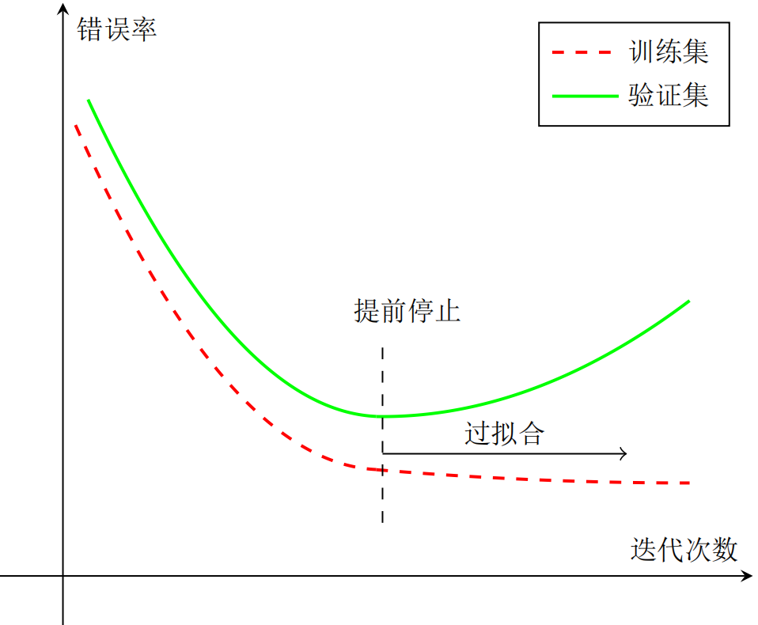

## 深度学习概述

### 表示学习

为了提高机器学习系统的准确率，需要将输入信息转换为有效的特征，或者更一般称为**表示(representation)**。如果有一种算法可以自动地学习出有效的特征，并提高最终机器学习模型的性能，那么这种学习就是可以叫做**表示学习(representation learning)**。

表示学习的关键是解决**语义鸿沟(semantic gap)**问题。语义鸿沟问题是指输入数据的底层特征和高层语义信息之间的不一致性和差异性。比如给定一些关于“车”的图片，由于图片中每辆车的颜色和形状等属性都不尽相同，不同图片在像素级别上的表示(即底层特征)差异性也会非常大。但是我们人理解这些图片是建立在比较抽象的高层语义概念上的。如果一个预测模型直接建立在底层特征之上，会导致对预测模型的能力要求过高。如果可以有一个好的表示在某种程度上可以反映出数据的高层语义特征，那么我们就可以相对容易地构建后续的机器学习模型。

在表示学习中，有两个核心问题：一是“什么是一个好的表示”；二是“如何学习到好的表示”。

#### 局部表示和分布式表示

一般而言，一个好的表示具有以下几个优点：

(1) 一个好的表示应该具有**很强的表示能力**，即同样大小的向量可以表示更多信息。

(2)  一个好的表示应该**使后续的学习任务变得简单**，即需要包含更高层的语义信息。

(3) 一个好的表示应该具有**一般性**，是任务或领域独立的。

在机器学习中，我们经常使用两种方式来表示特征：**局部表示(local representation)和分布式表示(distributed representation)**。以颜色的表示为例，二者之间的区别如下：


局部表示通常可以表示为**one-hot向量**的形式(只有一个维度为1，其他维度为0)。局部表示具有很好的解释性，方便人工进行特征总结，并通过特征组合进行高效的特征工程。通过多种特征组合得到的表示向量通常是稀疏的二值向量，当用于线性模型时计算效率非常高。但局部表示有两个不足之处：(1) one-hot向量的维数很高，且无法扩展。如果有一种新的颜色，就需要增加一维来表示；(2) **不同颜色之间的相似度为0**，这样丢失了所有语义信息。

和局部表示相比，分布式表示的表示能力要比局部表示强很多。分布式表示的向量维度一般都比较低，我们只需要用一个三维的稠密向量(例如RGB)就可以表示所有颜色。并且分布式表示也很容易表示新的颜色名。此外，不同颜色之间的相似度也很容易计算。

我们可以使用神经网络来**将高维的局部表示空间映射到一个非常低维的分布式表示空间**。在这个低维空间中，每个特征不再是坐标轴上的点，而是分散在整个低维空间中。在机器学习中，这个过程也称为**嵌入(embedding)**。嵌入通常指将一个度量空间中的一些对象映射到另一个低维的度量空间中，并尽可能保持不同对象之间的拓扑关系。比如自然语言中词的分布式表示，也经常叫做**词嵌入**。


#### 表示学习

要学习到一种好的高层语义表示(一般为分布式表示)，通常需要从底层特征开始，经过多步非线性转换才能得到。

一个**深层结构**的优点是可以**增加特征的重用性**，从而**指数级地增加表示能力**。因此，表示学习的关键是构建具有一定深度的多层次特征表示。

在传统的机器学习中，也有很多有关特征学习的方法，比如主成分分析、线性判别分析、独立成分分析等。但是传统的特征学习一般是通过人为地设计一些准则，然后根据这些准则来选取有效的特征。**特征的学习和最终预测模型的学习分开进行**，因此学习到的特征不一定可以提升最终模型的性能。

### 深度学习

**深度学习(deep learning, DL)**通过学习算法来让模型自动学习出好的特征表示(从底层特征，到中层特征，再到高层特征)，从而最终提升预测模型的准确率。**所谓“深度”是指原始数据进行非线性特征转换的次数**。如果把一个表示学习系统看作是一个有向图结构，深度也可以看作是从输入节点到输出节点所经过的最长路径的长度。

深度学习是将原始的数据特征通过多步的特征转换得到一种更高层次、更抽象的特征表示，并进一步输入到预测函数得到最终结果。这些学习到的表示可以代替人工设计的特征，从而避免“特征工程”。

和“浅层学习”不同，深度学习需要解决的关键问题是**贡献度分配问题(credit assignment problem, CAP)**，即一个系统中不同的**组件(components)**或其参数对最终系统输出结果的贡献或影响。**目前深度学习主要以深度神经网络模型及反向传播算法为基础**。

下图展示了机器学习与深度学习数据处理流程的不同：


在一些复杂任务中，传统机器学习方法需要将一个任务的输入和输出之间人为地切割成很多子模块(或多个阶段)，每个子模块分开学习。比如一个自然语言理解任务，一般需要分词、词性标注、句法分析、语义分析、语义推理等步骤。这种学习方式有两个问题：一是**每一个模块都需要单独优化**，并且其优化目标和任务总体目标并不能保证一致。二是**错误传播**，即前一步的错误会对后续造成很大的影响。这样增加了机器学习方法在实际应用的难度。

**端到端学习(end-to-end learning)**，也称端到端训练，是指在学习过程中不进行分模块或分阶段进行训练，直接优化任务的总体目标。在端到端学习中，一般不需要明确地给出不同模块或阶段的功能，中间过程不需要人为干预。端到端学习的训练数据为“输入-输出”对的形式，无需提供其它额外信息。因此，端到端学习和深度学习一样，都是要解决贡献度分配问题。目前，大部分采用神经网络模型的深度学习可以看作是一种端到端的学习。

### 神经网络

随着神经科学、认知科学的发展，我们逐渐知道人类的智能行为都和大脑活动有关。人类大脑是一个可以产生意识、思想和情感的器官。受到人脑神经系统的启发，早期的神经科学家构造了一种模仿人脑神经系统的数学模型，称为**人工神经网络**，简称**神经网络**。在机器学习领域，神经网络是指由很多人工神经元构成的网络结构模型，这些人工神经元之间的连接强度是可学习的参数。

#### 人脑神经网络

人类大脑是人体最复杂的器官，由神经元、神经胶质细胞、神经干细胞和血管组成。其中，**神经元(neuron)**，也叫**神经细胞(nerve cell)**，是携带和传输信息的细胞，是人脑神经系统中最基本的单元。人脑神经系统是一个非常复杂的组织，包含近860亿个神经元，每个神经元有上千个突触和其它神经元相连接。这些神经元和它们之间的连接形成巨大的复杂网络，其中神经连接的总长度可达数千公里。**我们人造的复杂网络，比如全球的计算机网络，和大脑神经网络相比要“简单”得多**。

早在 1904 年，生物学家就已经发现了神经元的结构。典型的神经元结构大致可分为细胞体和细胞突起。

**细胞体(soma)**中的神经细胞膜上有各种受体和离子通道，胞膜的受体可与相应的化学物质神经递质结合，引起离子通透性及膜内外电位差发生改变，产生相应的生理活动：兴奋或抑制。

**细胞突起**是由细胞体延伸出来的细长部分，又可分为树突和轴突。**树突(dendrite)**可以接收刺激并将兴奋传入细胞体。每个神经元可以有一或多个树突。**轴突(axons)** 可以把自身的兴奋状态从胞体传送到另一个神经元或其他组织。每个神经元只有一个轴突。

神经元可以接收其它神经元的信息，也可以发送信息给其它神经元。神经元间没有物理连接，中间有20纳米左右的缝隙。神经元之间靠**突触(synapse)**进行互联来传递信息，形成一个神经网络，即**神经系统**。突触可以理解为神经元之间的链接“接口”，将一个神经元的兴奋状态传到另一个神经元。一个神经元可被视为一种只有两种状态的细胞：**兴奋和抑制**。神经元的状态取决于从其它的神经细胞收到的输入信号量，及突触的强度(抑制或加强)。当信号量总和超过了某个阈值时，细胞体就会兴奋，产生电脉冲。电脉冲沿着轴突并通过突触传递到其它神经元。下图给出了一种典型的神经元结构。


一个人的智力不完全由遗传决定，大部分来自于生活经验。也就是说，人脑神经网络是一个具有学习能力的系统。在人脑神经网络中，每个神经元本身并不重要，重要的是神经元如何组成连接。不同神经元之间的突触有强有弱，其强度是可以通过学习(训练)来不断改变的，具有一定的可塑性。**赫布理论(Hebbian theory)**提出，如果两个神经元总是相关联地受到刺激，它们之间的突触强度增加。这样的学习方法被称为赫布型学习(Hebbian learning)。赫布认为人脑有两种记忆：**长期记忆和短期记忆**。短期记忆持续时间不超过一分钟。如果一个经验重复足够的次数，此经验就可储存在长期记忆中。短期记忆转化为长期记忆的过程就称为凝固作用。人脑中的**海马区**为大脑结构**凝固作用的核心区域**。

#### 人工神经网络

人工神经网络是为模拟人脑神经网络而设计的一种计算模型，它从结构、实现机理和功能上模拟人脑神经网络。人工神经网络与生物神经元类似，由多个节点(人工神经元)互相连接而成，可以对数据之间的复杂关系进行建模。不同节点之间的连接被赋予了不同的权重，**每个权重代表了一个节点对另一个节点的影响大小**。每个节点代表一种特定函数，来自其他节点的信息经过其相应的权重综合计算，输入到一个**激活函数**中并得到一个新的活性值(兴奋或抑制)。**从系统观点看，人工神经元网络是由大量神经元通过丰富和完善的连接而构成的自适应非线性动态系统**。

虽然我们可以比较容易地构造一个人工神经网络，但是如何让人工神经网络具有学习能力并不是一件容易的事情。早期的神经网络模型并不具备学习能力。**首个可学习的人工神经网络是赫布网络**，采用一种基于赫布规则的无监督学习方法。感知器是最早的具有机器学习思想的神经网络，但其学习方法无法扩展到多层的神经网络上。直到 1980 年左右，**反向传播算法**才有效地解决了多层神 经网络的学习问题，并成为最为流行的神经网络学习算法。

人工神经网络诞生之初并非用来解决机器学习问题。人工神经网络可以看作是一个通用的函数逼近器，两层的神经网络可以逼近任意的函数，因此人工神经网络可以看作一个可学习的函数，并应用到机器学习中。理论上，只要有足够的训练数据和神经元数量，人工神经网络就可以学到很多复杂的函数。人工神经网络模型的塑造任何函数的能力大小可以称为**网络容量(network capacity)**，与可被储存在网络中的信息的复杂度以及数量相关。 

#### 神经网络的而发展历史

##### 第一阶段：模型提出

第一个阶段为1943~1969年，是神经网络发展的第一个高潮期。在此期间，科学家们提出了许多神经元模型和学习规则，例如Alan Turing提出的**B型图灵机**(1948)、Rosenblatt提出的**感知机(perceptron)**(1958)等。

##### 第二阶段：冰河期

第二阶段为1969~1983年，为神经网络发展的第一个低谷期。在此期间，神经网络的研究处于长年停滞状态。1969年，Marbin Minsky出版的《感知机》一书中指出了神经网络的两个关键缺陷：第一个是**感知机无法处理异或(XOR)回路问题**；第二个是**当时的计算机无法支持处理大型神经网络所需要的计算能力**。

##### 第三阶段：反向传播算法引起的复兴

第三阶段为1983∼*1995年，为神经网络发展的第二个高潮期。这个时期中，**反向传播算法**重新激发了人们对神经网络的兴趣。在该阶段，一些新型神经网络不断涌现，例如**Hopfield网络**(1983)、**玻尔兹曼机**(1984)。

##### 第四阶段：流行度降低

第四个阶段为1995*∼*2006年，在此期间，**支持向量机**(20世纪90年代中期)和其他更简单的方法(例如线性分类器)在机器学习领域的流行度逐渐超过了神经网络。

##### 第五阶段：深度学习的崛起

2006年，Hinton等人通过**逐层预训练**来学习一个深度信念网络，并将其权重作为一个多层前馈神经网络的初始化权重，再用反向传播算法进行精调。这种“预训练 + 精调”的方式可以有效地解决深度神经网络难以训练的问题。随着深度神经网络在语音识别和图像分类等任务上的巨大成功，以神经网络为基础的深度学习迅速崛起。近年来，随着大规模并行计算以及GPU设备的普及，计算机的计算能力得以大幅提高。此外，可供机器学习的数据规模也越来越大。在**计算能力和数据规模**的支持下，计算机已经可以端到端地训练一个大规模神经网络，不再需要借助预训练的方式。各大科技公司都投入巨资研究深度学习，神经网络迎来第三次高潮，而我们正身处这次浪潮之中。

### 神经网络的学习

#### 梯度下降法

为了充分利用凸优化中一些高效、成熟的优化方法，比如共轭梯度、拟牛顿法等，很多机器学习方法都倾向于选择合适的模型和损失函数以构造一个凸函数作为优化目标。但对于神经网络模型来说，其优化目标是**非凸函数**，只能退而求其次找到局部最优解。

不同机器学习算法的区别在于模型、学习准则(损失函数)和优化算法的差异。相同的模型也可以有不同学习算法。比如线性分类模型有感知器、逻辑回归和支持向量机，它们之间的差异在于使用了**不同的学习准则和优化算法**。

在机器学习中，最简单、常用的优化算法就是梯度下降法，即首先初始化参数$\theta_0$，然后按下面的迭代公式来计算训练集$\mathcal D$上风险函数的最小值：
$$
\begin{aligned}
\theta_{t+1}&=\theta_{t}-\alpha\frac{\partial \mathcal R_\mathcal D(\theta)}{\partial \theta}\\
&=\theta_{t}-\alpha\frac{1}{N}\sum_{n=1}^{N}\frac{\partial L(y^{(n)},f(\boldsymbol x^{(n)};\theta))}{\partial \theta}
\end{aligned}
$$
其中$\theta_t$为第$t$次迭代时的参数值，$\alpha$为搜索步长，一般称为**学习率(learning rate)**。

#### 提前停止

针对梯度下降的优化算法，除了加正则化项之外，还可以通过提前停止来防止过拟合。在梯度下降训练的过程中，由于过拟合的原因，在训练样本上收敛的参数，并不一定在测试集上最优。因此，除了训练集和测试集之外，有时也会使用一个**验证集(validation set)**来进行模型选择，测试模型在验证集上是否最优。在每次迭代时，把新得到的模型$f(\boldsymbol x;\theta)$在验证集上进行测试，并计算错误率。

如果在验证集上的错误率不再下降，就停止迭代。这种策略叫**提前停止(early stop)**。如果没有验证集，可以在训练集上划分出一个小比例的子集作为验证集。下图给出了提前停止的示意图：



#### 随机梯度下降法

原始的梯度下降法中，目标函数是**训练集上的风险函数**，这种方式称为**批量梯度下降(batch gradient descent, BGD)**。批量梯度下降法在每次迭代时需要计算每个样本上损失函数的梯度并求和。当训练集中的样本数量$N$很大时，**空间复杂度比较高，每次迭代的计算开销也很大**。在机器学习中，我们假设每个样本都是独立同分布地从真实数据分布中随机抽取出来的，真正的优化目标是期望风险最小。批量梯度下降法相当于是从真实数据分布中采集个$N$样本，并由它们计算出来的经验风险的梯度来近似期望风险的梯度。为了减少每次迭代的计算复杂度，我们也可以在每次迭代时**只采集一个样本**，仅仅计算这个样本损失函数的梯度并更新参数，即**随机梯度下降法(Stochastic Gradient Descent, SGD)**。当经过足够次数的迭代时，随机梯度下降也可以收敛到局部最优解。

批量梯度下降和随机梯度下降之间的区别在于每次迭代的优化目标是对所有样本的平均损失函数还是单个样本的损失函数。随机梯度下降因为实现简单，收敛速度也非常快，因此使用非常广泛。随机梯度下降相当于在批量梯度下降的梯度上引入了随机噪声。**当目标函数非凸时，反而可以使其逃离局部最优点**。

随机梯度下降的参数更新公式：
$$
\theta=\theta-\alpha\frac{\partial L(\theta;\boldsymbol x^{(n)},y^{(n)})}{\partial \theta}
$$

#### 小批量梯度下降法

随机梯度下降法的一个缺点是无法充分利用计算机的并行计算能力。**小批量梯度下降法(mini-batch gradient descent)**是批量梯度下降和随机梯度下降的折中。每次迭代时，我们随机选取一小部分训练样本来计算梯度并更新参数，这样既可以兼顾随机梯度下降法的优点，也可以提高训练效率：
$$
\theta=\theta-\alpha\frac{1}{K} \sum_{(\boldsymbol x,y)\in L_t} \frac{\partial L(y,f(\boldsymbol x;\theta))}{\partial \theta}
$$
其中，$L_t$是训练集中包含$K$个样本的子集。

### 深度学习框架

常用的深度学习框架有Tensorflow、PyTorch以及PaddlePaddle等。

```python
# tensorflow框架(2.0+)的基本操作
import tensorflow as tf
import numpy as np

# 在tensorflow中，tensor是数据的基本元素。tensor可以是标量(0维)、向量(1维)、矩阵(2维)等。例如：
# 定义一个随机数(标量)
random_float = tf.random.uniform(shape=())
# 定义一个含有两个元素的零向量
zero_vector = tf.zeros(shape=2)

# 定义两个(2, 2)大小的矩阵
A = tf.constant([[1., 2.], [3., 4.]])
B = tf.constant([[5., 6.], [7., 8.]])

# tensor的三个最重要的属性是形状(shape)、数据类型(dtype)和值(.numpy())。例如：
print(A.shape)  # (2, 2)
print(A.dtype)  # <dtype: 'float32'>
print(A.numpy())  # [[1. 2.], [3. 4.]]

# 在tensorflow中可以对tensor进行许多运算操作:
C = tf.add(A, B)  # 矩阵加法
D = tf.matmul(A, B)  # 矩阵乘法
print(C)
print(D)

# tensorflow中的单变量自动微分
x = tf.Variable(initial_value=3.)  # 定义一个变量
with tf.GradientTape() as tape:  # 在tf.GradientTape()上下文中，所有的计算都会被记录，用于自动微分的计算
    y = tf.square(x)
y_grad = tape.gradient(y, x)  # 计算y对于x的梯度
print(y, y_grad)

# # tensorflow中的多变量自动微分
X = tf.constant([[1., 2.], [3., 4.]])
y = tf.constant([[1.], [2.]])
w = tf.Variable(initial_value=[[1.], [2.]])
b = tf.Variable(initial_value=1.)
with tf.GradientTape() as tape:
    L = tf.reduce_sum(tf.square(tf.matmul(X, w) + b - y))
w_grad, b_grad = tape.gradient(L, [w, b])  # 计算函数L(w, b)对w和b的梯度
print(L, w_grad, b_grad)

# 使用tensorflow实现线性回归
X_raw = np.array([2013, 2014, 2015, 2016, 2017], dtype=np.float32)
y_raw = np.array([12000, 14000, 15000, 16500, 17500], dtype=np.float32)

X = (X_raw - X_raw.min()) / (X_raw.max() - X_raw.min())
y = (y_raw - y_raw.min()) / (y_raw.max() - y_raw.min())

X = tf.constant(X)
y = tf.constant(y)

a = tf.Variable(initial_value=0.)
b = tf.Variable(initial_value=0.)
variables = [a, b]

num_epoch = 10000
optimizer = tf.keras.optimizers.SGD(learning_rate=5e-4)
for e in range(num_epoch):
    with tf.GradientTape() as tape:
        y_pred = a * X + b
        loss = tf.reduce_sum(tf.square(y_pred - y))
    grads = tape.gradient(loss, variables)
    optimizer.apply_gradients(grads_and_vars=zip(grads, variables))
    print(a, b)
```

```python
# pytorch库的基本操作
import torch
import numpy as np

# 和tensorflow类似，tensor也是pytorch中的数据基本元素

# 构建一个未初始化的(5, 3)大小的矩阵
x = torch.empty(5, 3)
print(x)

# 创建一个随机初始化的矩阵
x = torch.rand(5, 3)
print(x)

# 创建一个元素全为0的矩阵，数据类型为long
x = torch.zeros(5, 3, dtype=torch.long)
print(x)

# 直接使用数据创建tensor
x = torch.tensor([5.5, 3])
print(x)

# 基于现有的tensor创建一个新的tensor
x = x.new_ones(5, 3, dtype=torch.double)
print(x)

x = torch.randn_like(x, dtype=torch.float)  # 重写数据类型
print(x)  # 结果的shape相同

# 获取一个tensor的大小
print(x.size())

# pytorch中tensor的加法操作的不同写法
y = torch.rand(5, 3)

print(x + y)  # 写法1

print(torch.add(x, y))  # 写法2

result = torch.empty(5, 3)
torch.add(x, y, out=result)  # 写法3
print(result)

y.add_(x)  # 写法4
print(y)

# 像numpy一样使用切片和索引访问tensor中的元素
print(x[:, 1])

# 使用torch.view()函数来改变tensor的形状
x = torch.randn(4, 4)
y = x.view(16)
z = x.view(-1, 8)
print(x.size(), y.size(), z.size())

# 对于只有一个元素的tensor，可以使用.item()去获取python的数据类型
x = torch.randn(1)
print(x)
print(x.item())

# 将tensor转化为numpy数组
a = torch.ones(5)
print(a)
b = a.numpy()
print(b)

# 将numpy数组转化为tensor
a = np.ones(5)
b = torch.from_numpy(a)
np.add(a, 1, out=a)
print(a)
print(b)

# 自动微分

# 建立一个tensor，并设置requires_grad=True来跟踪其计算过程
x = torch.ones(2, 2, requires_grad=True)
print(x)

# 进行一个tensor操作
y = x + 2
print(y)

# y作为运算的结果，其含有属性grad_fn
print(y.grad_fn)

# 在y上进行更多的操作
z = y * y * 3
out = z.mean()
print(z, out)

# 使用.requires_grad_(...)函数改变一个tensor的requires_grad属性，默认为False
a = torch.randn(2, 2)
a = ((a * 3) / (a - 1))
print(a.requires_grad)
a.requires_grad_(True)
print(a.requires_grad)
b = (a * a).sum()
print(b.grad_fn)

# 反向传播过程。由于out仅包含一个标量，因此out.backward()等价于out.backward(torch.tensor(1.))
out.backward()
# 打印梯度d(out)/dx
print(x.grad)

# 向量的Jacobian积
x = torch.randn(3, requires_grad=True)

y = x * 2
while y.data.norm() < 1000:
    y = y * 2

print(y)

# 现在在这种情况下，y不再是一个标量。torch.autograd不能够直接计算整个雅可比，但是如果我们只想要雅可比向量积，
# 只需要简单的传递向量给backward作为参数
v = torch.tensor([0.1, 1.0, 0.0001], dtype=torch.float)
y.backward(v)

print(x.grad)

# 可以通过将代码包裹在with torch.no_grad()，来停止对从跟踪历史中的.requires_grad=True的张量自动求导。

print(x.requires_grad)
print((x ** 2).requires_grad)

with torch.no_grad():
    print((x ** 2).requires_grad)
```

### 参考资料

- 邱锡鹏. 神经网络与深度学习. 北京: 机械工业出版社, 2020.
- Tensorflow官网：https://www.tensorflow.org/
- PyTorch官网：https://pytorch.org/
- paddlepaddle官网：https://www.paddlepaddle.org.cn/

