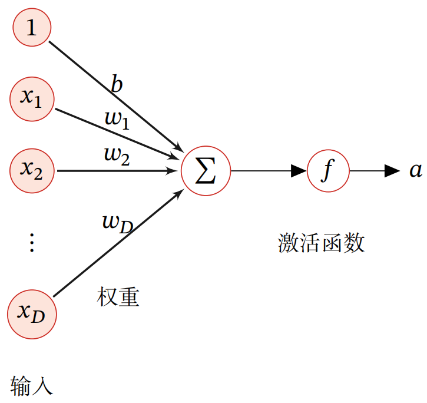
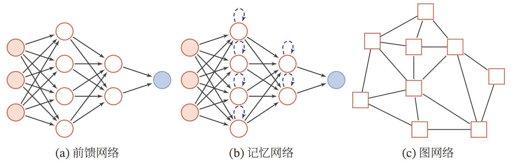
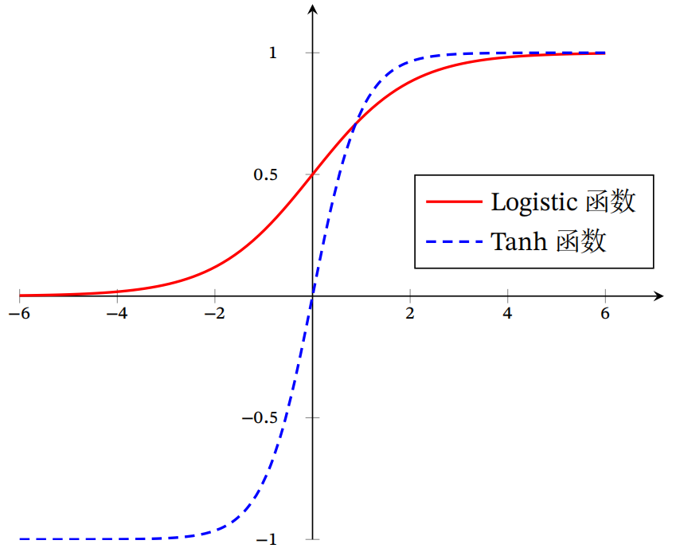
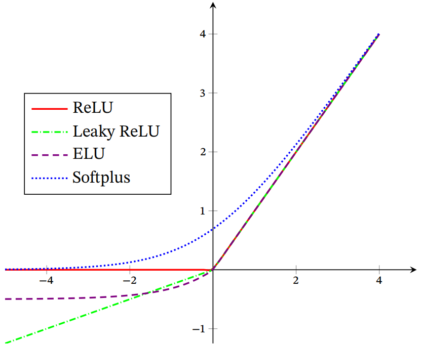
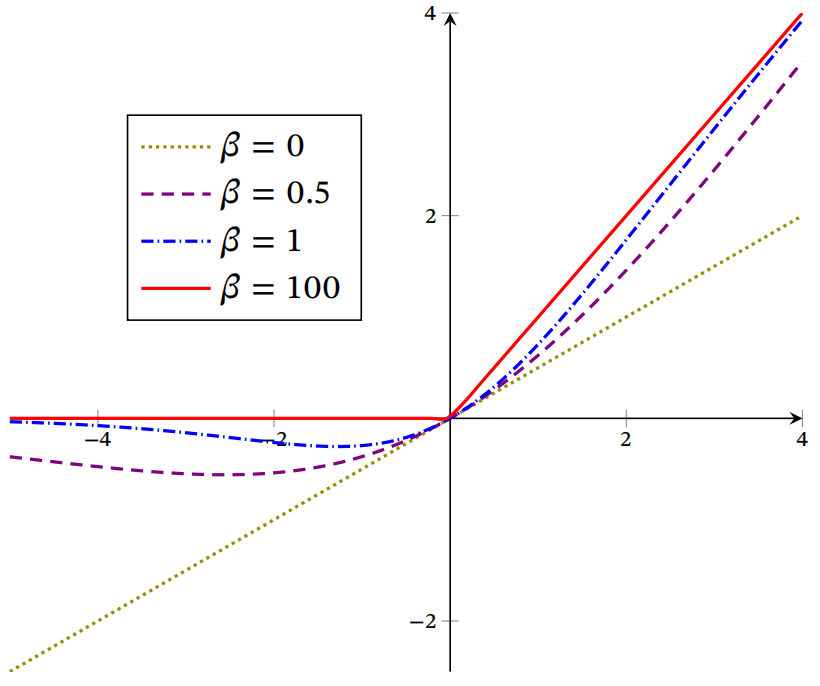
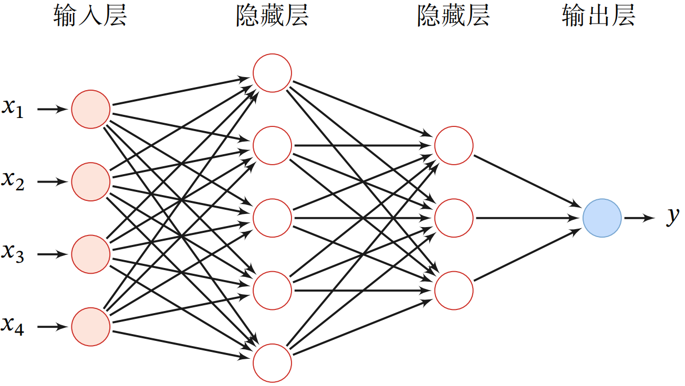
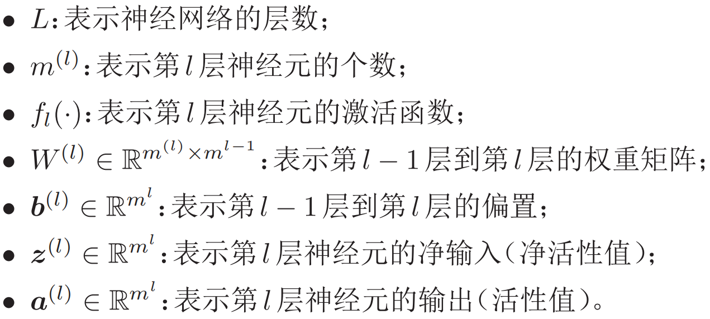
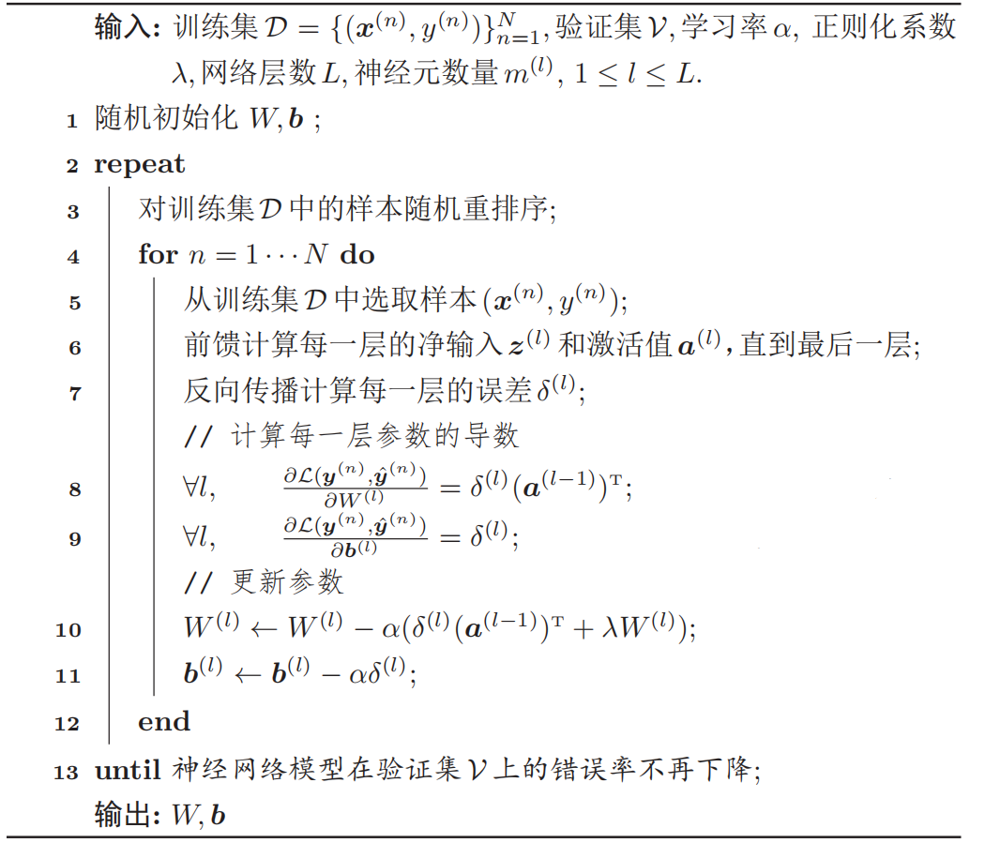
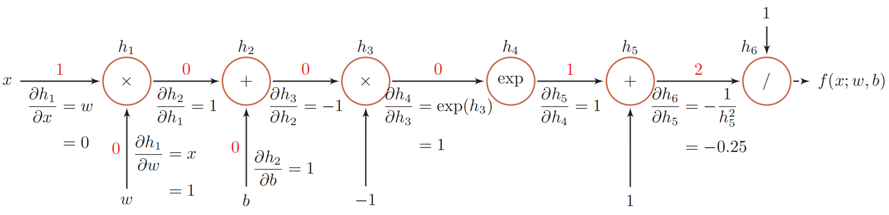
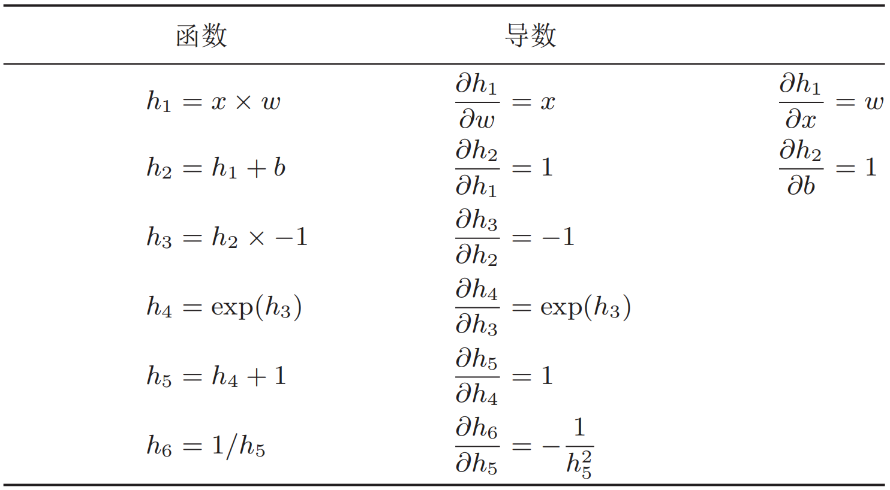

## 神经网络

**人工神经网络(artificial neural network, ANN)**是指一系列受生物学和神经科学启发的数学模型. 这些模型主要是通过对人脑的神经元网络进行抽象，构建**人工神经元**，并按照一定拓扑结构来建立人工神经元之间的连接，来模拟生物神经网络。在人工智能领域，人工神经网络也常常简称为**神经网络(neural network, NN)**。

神经网络最早是作为一种主要的**连接主义模型**。20世纪80年代中后期，最流行的一种连接主义模型是**分布式并行处理(parallel distributed processing, PDP)模型**，其有3个主要特性：(1) 信息表示是分布式的(非局部的)；(2) 记忆和知识是存储在单元之间的连接上；(3)通过逐渐改变单元之间的连接强度来学习新的知识。

连接主义的神经网络有着多种多样的网络结构以及学习方法，虽然早期模型强调模型的**生物可解释性(biological plausibility)**，但后期更关注于**对某种特定认知能力的模拟**，比如物体识别、语言理解等. 尤其在引入误差反向传播来改进其学习能力之后，神经网络也越来越多地应用在各种机器学习任务上。随着训练数据的增多以及(并行)计算能力的增强，神经网络在很多机器学习任务上已经取得了很大的突破，特别是在语音、图像等感知信号的处理任务上，神经网络表现出了卓越的学习能力。

目前受到关注的是采用**误差反向传播**来进行学习的神经网络，即作为**一种机器学习模型**的神经网络。从机器学习的角度来看，神经网络一般可以看作是一个**非线性模型**，其基本组成单元为**具有非线性激活函数的神经元**，通过大量神经元之间的连接，使得神经网络成为一种**高度非线性的模型**。神经元之间的**连接权重**就是**需要学习的参数**，可以在机器学习的**框架**下通过**梯度下降**方法来进行学习。

### 神经网络的基本结构

神经网络的基本组成单位是**神经元(neuron)**，如下所示：



假设一个神经元接收$D$个输入$x_1,x_2,\cdots,x_D$，令向量$\boldsymbol{x}=\left[x_{1} ; x_{2} ; \cdots ; x_{D}\right]$表示这组输入，并用**净输入(net input)**$z\in \mathbb R$表示一个神经元所获得的输入信号的加权和，则神经元的**前向(forward)运算**过程如下：
$$
\begin{aligned}
z &=\sum_{d=1}^{D} w_{d} x_{d}+b \\
&=\boldsymbol{w}^{\text T} \boldsymbol{x}+b
\end{aligned}
$$
其中$\boldsymbol{w}=[w_{1} ; w_{2} ; \cdots ; w_{D}] \in \mathbb{R}^{D}$是$D$维的**权重(weight)**向量，$b\in \mathbb R$是**偏置(bias)**。净输入$z$在经过一个非线性函数$f$后，得到神经元的**激活值(activation)**$a=f(z)$，其中非线性函数$f$称为**激活函数**。

与**感知机(perceptron)**相比，神经元的激活函数通常是**连续可导的函数**，而感知机的激活函数仅仅是在$x=0$处不可导的阶跃函数，用于将输出值进行二分，不需要进行反向梯度计算。

到目前为止，研究者已经发明了各种各样的神经网络结构。目前常用的神经网络结构有以下三种：

(1) **前馈网络**：前馈网络中各个神经元按接收信息的先后分为不同的组。每一组可以看作一个**神经层**。每一层中的神经元接收前一层神经元的输出，并输出到下一层神经元。整个网络中的信息是朝一个方向传播，没有反向的信息传播，可以用一个有向无环路图表示。前馈网络包括**全连接前馈网络**和**卷积神经网络**等。前馈网络可以看作一个函数，通过简单非线性函数的多次复合，实现输入空间到输出空间的复杂映射。这种网络结构简单，易于实现。

(2) **记忆网络**：也称反馈网络，网络中的神经元不但可以接收其他神经元的信息，也可以接收自己的历史信息。和前馈网络相比，记忆网络中的神经元具有记忆功能，在不同的时刻具有不同的状态。记忆神经网络中的信息传播可以是单向或双向传递，因此可用一个**有向循环图或无向图**来表示。记忆网络包括**循环神经网络**、**Hopfield网络**、**玻尔兹曼机**、**受限玻尔兹曼机**等。记忆网络可以看作一个程序，具有更强的计算和记忆能力。为了增强记忆网络的记忆容量，可以引入外部记忆单元和读写机制，用来保存一些网络的中间状态，称为**记忆增强神经网络(memory augmented neural network, MANN)**，比如**神经图灵机**和**记忆网络**等。

(3) **图网络**：前馈网络和记忆网络的输入都可以表示为向量或向量序列。但实际应用中很多数据是图结构的数据，比如知识图谱、社交网络、分子网络等。前馈网络和记忆网络很难处理图结构的数据。图网络是定义在图结构数据上的神经网络。图中每个节点都由一个或一组神经元构成。节点之间的连接可以是有向的，也可以是无向的。每个节点可以收到来自相邻节点或自身的信息.

**图网络是前馈网络和记忆网络的泛化**，包含很多不同的实现方式，比如**图卷积网络(graph convolutional network, GCN)**、**图注意力网络(graph attention network, GAT)**、**消息传递神经网络(message passing neural network, MPNN)**等。

三种网络结构示意图如下所示：



### 激活函数

**激活函数(activation function)**的作用是为神经网络的传播过程增添非线性因素。为了增强网络的表示能力，激活函数需要具备以下几点性质：

(1) **连续并可导(允许少数点不可导)的非线性函数**，可以直接利用数值优化的方法优化参数。

(2) 激活函数及其导函数要**尽可能的简单**，有利于提高网络计算效率。

(3) 导函数的值域要在一个**合适的区间**内，不能太大(影响稳定性)或太小(影响效率)。

神经网络中每个神经元常用的激活函数如下：

(1) **sigmoid函数**：可以看成是一个映射函数，把一个实数域的输入映射到$(0,1)$这一实数域中。当输入值在0附近时，sigmoid函数近似为线性函数；当输入值靠近两端时，对输入进行抑制。输入越小，函数值越接近于0；输入越大，函数值越接近于1。这样的特点也**和生物神经元类似**，对一些输入会产生兴奋(输出为1)，对另一些输入产生抑制(输出为0)。和感知器使用的阶跃激活函数相比，sigmoid函数是连续可导的，其数学性质更好。

因为sigmoid函数的性质，使得装备了sigmoid激活函数的神经元具有以下两点性质：(1) 其输出**直接可以看作是概率分布**，使得神经网络可以更好地和统计学习模型进行结合；(2) 其可以看作是一个**软性门(soft gate)**，用来控制其他神经元输出信息的数量。sigmoid函数的数学表达式如下：
$$
\sigma(x)=\frac{1}{1+\exp (-x)}
$$
(2) **tanh函数**：与sigmoid函数相似，只不过是将实数域的输入映射到$(-1,1)$区间内。其定义为：
$$
\tanh (x)=\frac{\exp (x)-\exp (-x)}{\exp (x)+\exp (-x)}
$$
下图给出了sigmoid函数和tanh函数的图像。tanh函数的输出是零中心化的(zero-centered)，而sigmoid函数的输出恒大于0。非零中心化的输出会使 得其后一层的神经元的输入发生**偏置偏移(bias shift)**，并**进一步使得梯度下降的收敛速度变慢**。



(3) **ReLU函数**：ReLU(Rectified Linear Unit, 修正线性单元)是目前深度神经网络中经常使用的激活函数。
$$
\begin{aligned}
\operatorname{ReLU}(x) &=\left\{\begin{array}{ll}
x, & x \geqslant 0 \\
0, & x<0
\end{array}\right.\\
&=\max (0, x)
\end{aligned}
$$
ReLU函数的**优**是：采用ReLU的神经元只需要进行加、乘和比较的操作，计算上更加高效。ReLU函数被认为有生物上的解释性，比如**单侧抑制**、**宽兴奋边界**(即兴奋程度也可以非常高)。在生物神经网络中，同时处于兴奋状态的神经元非常稀疏，人脑中在同一时刻大概只有1%至4%的神经元处于活跃状态。sigmoid激活函数会导致一个**非稀疏的神经网络**，而ReLU却具有很好的**稀疏性**，大约50%的神经元会处于激活状态。

在优化方面，相比于sigmoid函数的两端饱和，ReLU函数为**左饱和函数**，且在$x>0$时导数为1，在一定程度上缓解了神经网络的**梯度消失**问题，加速梯度下降的收敛速度。

ReLU函数的**缺点**：ReLU函数的输出是**非零中心化的**，会给后一层的神经网络引入偏置偏移，会影响梯度下降的效率。此外，ReLU神经元在训练时比较容易“死亡”。在训练时，如果参数在一次不恰当的更新后，隐藏层中的某个ReLU神经元在所有的训练数据上都不能被激活，那么这个神经元自身参数的梯度永远都会是0，在以后的训练过程中**永远不能被激活**。这种现象称为**死亡ReLU问题(dying ReLU problem)**。

(4) **Leaky ReLU函数**：在输入$x<0$时，保持一个很小的梯度$\lambda$. 这样当神经元非激活时也能有一个非零的梯度可以更新参数，避免永远不能被激活。
$$
\begin{aligned}
\text {LeakyReLU}(x) &=\left\{\begin{array}{ll}
x, & \text { if } x>0 \\
\gamma x, & \text { if } x \leqslant 0
\end{array}\right.\\
&=\max (0, x)+\gamma \min (0, x)
\end{aligned}
$$
(5) **ELU函数**：一个近似的零中心化的非线性函数，其定义为：
$$
\begin{aligned}
\operatorname{ELU}(x) &=\left\{\begin{array}{ll}
x & \text { if } x>0 \\
\gamma(\exp (x)-1) & \text { if } x \leqslant 0
\end{array}\right.\\
&=\max (0, x)+\min (0, \gamma(\exp (x)-1))
\end{aligned}
$$
其中$\gamma \geqslant 0$是一个**超参数**，决定$x \leqslant 0$时的饱和曲线，并调整输出均值在0附近。

(6) **Softplus函数**：可以看做ReLU函数的平滑版本，其导数刚好为sigmoid函数。Softplus函数虽然也具有单侧抑制、宽兴奋边界的特性，却没有稀疏激活性。
$$
\text {Softplus}(x)=\log (1+\exp (x))
$$
下图给出了ReLU、Leaky ReLU、ELU以及Softplus函数的示例。



(7) **Swish函数**：一种**自门控(self-gated)**激活函数，定义为：
$$
\operatorname{swish}(x)=x \sigma(\beta x)
$$
其中$\sigma(\cdot)$为sigmoid函数，$\beta$为可学习的参数或一个固定超参数，$\sigma(\cdot) \in (0,1)$可以看作是一种软性的门控机制。当$\sigma(\beta x)$接近于1时，门处于“开”状态，激活函数的输出近似于$x$本身；当$\sigma(\beta x)$接近于0时，门的状态为“关”，激活函数的输出近似于0。下图给出了Swish函数的实例。



除了以上这些激活函数外，还有各式各样其他激活函数，如**Maxout单元**、**高斯误差线性单元(GELU)**等。

### 前馈神经网络

**前馈神经网络(feed-forward neural network)**是结构最简单的神经网络，其信息从输入层通过多个隐含层传递到输出层，然后误差通过反向传播算法再从输出层逐层传播至输入层。其网络层次表示如下：



前馈神经网络可用如下参数表示：



前馈神经网络通过下面公式进行**前向传播**：
$$
\begin{aligned}
&\boldsymbol{z}^{(l)}=W^{(l)} \cdot \boldsymbol{a}^{(l-1)}+\boldsymbol{b}^{(l)}\\
&\boldsymbol{a}^{(l)}=f_{l}(\boldsymbol{z}^{(l)})
\end{aligned}
$$
上式也可以合并写作$\boldsymbol{z}^{(l)}=W^{(l)} \cdot f_{l-1}(\boldsymbol{z}^{(l-1)})+\boldsymbol{b}^{(l)}$或者$\boldsymbol{a}^{(l)}=f_{l}(W^{(l)} \cdot \boldsymbol{a}^{(l-1)}+\boldsymbol{b}^{(l)})$。

这样，前馈神经网络可以通过逐层的信息传递，得到**网络最后的输出**$a^{(l)}$。整个网络可以看作一个复合函数$\phi(\boldsymbol{x} ; W, \boldsymbol{b})$，将向量$\boldsymbol x$作为第一层的输入$\boldsymbol a^{(0)}$，将最后一层$L$的输出$\boldsymbol a^{(L)}$作为整个函数的输出：
$$
\boldsymbol{x}=\boldsymbol{a}^{(0)} \rightarrow \boldsymbol{z}^{(1)} \rightarrow \boldsymbol{a}^{(1)} \rightarrow \boldsymbol{z}^{(2)} \rightarrow \cdots \rightarrow \boldsymbol{a}^{(L-1)} \rightarrow \boldsymbol{z}^{(L)} \rightarrow \boldsymbol{a}^{(L)}=\phi(\boldsymbol{x} ; W, \boldsymbol{b})
$$

神经网络的学习过程就是通过训练集调整参数，使得输入和输出“相匹配”。给定训练集$\mathcal{D}=\{(\boldsymbol{x}^{(n)}, \boldsymbol y^{(n)})\}_{n=1}^{N}$，将每个样本$\boldsymbol{x}^{(n)}$输入给前馈神经网络，得到网络输出为$\hat{y}^{(n)}$，其在数据集$\mathcal D$上的**结构化风险函数**为：
$$
\mathcal{R}(W, \boldsymbol{b})=\frac{1}{N} \sum_{n=1}^{N} \mathcal{L}({\boldsymbol y}^{(n)}, \hat{{\boldsymbol y}}^{(n)})+\frac{1}{2} \lambda\|W\|_{F}^{2}
$$
其中$\mathcal L(\cdot)$为损失函数，分类问题一般采用**交叉熵损失函数**，而回归问题一般采用**均方误差损失函数**。有了学习准则和训练样本，网络参数可以通过**梯度下降法**来激进型学习：
$$
\begin{aligned}
W^{(l)} & \leftarrow W^{(l)}-\alpha \frac{\partial \mathcal{R}(W, b)}{\partial W^{(l)}} \\
&=W^{(l)}-\alpha\left(\frac{1}{N} \sum_{n=1}^{N}(\frac{\partial \mathcal{L}(\boldsymbol{y}^{(n)}, \hat{\boldsymbol{y}}^{(n)})}{\partial W^{(l)}})+\lambda W^{(l)}\right) \\
\boldsymbol{b}^{(l)} & \leftarrow \boldsymbol{b}^{(l)}-\alpha \frac{\partial \mathcal{R}(W, \boldsymbol{b})}{\partial \boldsymbol{b}^{(l)}} \\
&=\boldsymbol{b}^{(l)}-\alpha\left(\frac{1}{N} \sum_{n=1}^{N} \frac{\partial \mathcal{L}(\boldsymbol{y}^{(n)}, \hat{\boldsymbol{y}}^{(n)})}{\partial \boldsymbol{b}^{(l)}}\right)
\end{aligned}
$$
**输出层(output layer)**的设计要与标签$y$相符合，因此，对于分类问题，网络输出层的激活函数通常采用**softmax函数**，其神经元的个数等于类别个数，而**网络的输出相当于每个类的后验概率**。对于回归问题，输出层的激活函数一般采用**恒等函数**。

### 反向传播算法

假设采用随机梯度下降进行神经网络参数学习，给定一个样本$(\boldsymbol{x}, \boldsymbol{y})$，将其输入到神经网络模型中，得到网络输出为$\hat{\boldsymbol y}$。假设损失函数为$\mathcal{L}(\boldsymbol{y}, \hat{\boldsymbol{y}})$，要进行参数学习就需要计算损失函数关于每个参数的**偏导数**。根据链式法则，
$$
\frac{\partial \mathcal{L}(\boldsymbol{y}, \hat{\boldsymbol{y}})}{\partial w_{i j}^{(l)}}=\frac{\partial \boldsymbol{z}^{(l)}}{\partial w_{i j}^{(l)}} \frac{\partial \mathcal{L}(\boldsymbol{y}, \hat{\boldsymbol{y}})}{\partial \boldsymbol{z}^{(l)}}
$$

$$
\frac{\partial \mathcal{L}(\boldsymbol{y}, \hat{\boldsymbol{y}})}{\partial \boldsymbol{b}^{(l)}}=\frac{\partial \boldsymbol{z}^{(l)}}{\partial \boldsymbol{b}^{(l)}} \frac{\partial \mathcal{L}(\boldsymbol{y}, \hat{\boldsymbol{y}})}{\partial \boldsymbol{z}^{(l)}}
$$

上面两个公式中的第二项都是损失函数关于第$l$层神经元$\boldsymbol z^{(l)}$的偏导数，称为**误差项**，可以一次计算得到。

这样，我们只需要计算三个偏导数，分别为$\frac{\partial \boldsymbol{z}^{(l)}}{\partial w_{i j}^{(l)}}$，$\frac{\partial \boldsymbol{z}^{(l)}}{\partial \boldsymbol{b}^{(l)}}$和$\frac{\partial \mathcal{L}(\boldsymbol{y}, \hat{\boldsymbol{y}})}{\partial \boldsymbol{z}^{(l)}}$。

(1) 计算偏导数$\frac{\partial \boldsymbol{z}^{(l)}}{\partial w_{i j}^{(l)}}$(**向量关于标量的偏导数**)
$$
\begin{aligned}
\frac{\partial \boldsymbol{z}^{(l)}}{\partial w_{i j}^{(l)}} &=\left[\frac{\partial z_{1}^{(l)}}{\partial w_{i j}^{(l)}}, \cdots, \frac{\partial z_{i}^{(l)}}{\partial w_{i j}^{(l)}}, \cdots, \frac{\partial z_{m^{(l)}}^{(l)}}{\partial w_{i j}^{(l)}}\right] \\
&=\left[0, \cdots, \frac{\partial\left(\boldsymbol{w}_{i:}^{(l)} \boldsymbol{a}^{(l-1)}+b_{i}^{(l)}\right)}{\partial w_{i j}^{(l)}}, \cdots, 0\right] \\
&=\left[0, \cdots, a_{j}^{(l-1)}, \cdots, 0\right] \\
& \triangleq \mathbb{I}_{i}\left(a_{j}^{(l-1)}\right) \in \mathbb{R}^{m^{(l)}}
\end{aligned}
$$
其中$\boldsymbol{w}_{i:}^{(l)}$为权重矩阵$W^{(l)}$的第$i$行，$\mathbb{I}_{i}(a_{j}^{(l-1)})$ 表示第$i$个元素为$a_{j}^{(l-1)}$，其余为0的行向量。

(2) 计算偏导数$\frac{\partial \boldsymbol{z}^{(l)}}{\partial \boldsymbol{b}^{(l)}}$(**向量关于向量的偏导数**)
$$
\frac{\partial \boldsymbol{z}^{(l)}}{\partial \boldsymbol{b}^{(l)}}=\boldsymbol{I}_{m^{(l)}} \in \mathbb{R}^{m^{(l)} \times m^{(l)}}
$$
为$m^{(l)}\times m^{(l)}$大小的**单位矩阵**。

(3) 计算偏导数$\frac{\partial \mathcal{L}(\boldsymbol{y}, \hat{\boldsymbol{y}})}{\partial \boldsymbol{z}^{(l)}}$(**标量关于向量的偏导数**)

偏导数$\frac{\partial \mathcal{L}(\boldsymbol{y}, \hat{\boldsymbol{y}})}{\partial \boldsymbol{z}^{(l)}}$表示第$l$层神经元对最终损失的影响，也反映了最终损失对第$l$层神经元的敏感程度，因此一般称为第$l$层神经元的**误差项**，用$\delta^{(l)}$来表示：
$$
\delta^{(l)} \triangleq \frac{\partial \mathcal{L}(\boldsymbol{y}, \hat{\boldsymbol{y}})}{\partial \boldsymbol{z}^{(l)}} \in \mathbb{R}^{m^{(l)}}
$$
误差项$\delta^{(l)}$也间接反映了**不同神经元对网络能力的贡献程度**，从而比较好地解决了**贡献度分配问题(credit assignment problem, CAP)**。

根据$\boldsymbol{z}^{(l+1)}=W^{(l+1)} \boldsymbol{a}^{(l)}+\boldsymbol{b}^{(l+1)}$，有：
$$
\frac{\partial \boldsymbol{z}^{(l+1)}}{\partial \boldsymbol{a}^{(l)}}=(W^{(l+1)})^{\mathrm{T}}
$$
根据$\boldsymbol{a}^{(l)}=f_{l}(\boldsymbol{z}^{(l)})$，其中$f_l(\cdot)$为按位计算的函数，因此有：
$$
\begin{aligned}
\frac{\partial \boldsymbol{a}^{(l)}}{\partial \boldsymbol{z}^{(l)}} &=\frac{\partial f_{l}(\boldsymbol{z}^{(l)})}{\partial \boldsymbol{z}^{(l)}} \\
&=\operatorname{diag}(f_{l}^{\prime}(\boldsymbol{z}^{(l)}))
\end{aligned}
$$
因此，根据链式法则，第$l$层的误差项为：
$$
\begin{aligned}
\delta^{(l)} & \triangleq \frac{\partial \mathcal{L}(\boldsymbol{y}, \hat{\boldsymbol{y}})}{\partial \boldsymbol{z}^{(l)}} \\
&=\frac{\partial \boldsymbol{a}^{(l)}}{\partial \boldsymbol{z}^{(l)}} \cdot \frac{\partial \boldsymbol{z}^{(l+1)}}{\partial \boldsymbol{a}^{(l)}} \cdot \frac{\partial \mathcal{L}(\boldsymbol{y}, \hat{\boldsymbol{y}})}{\partial \boldsymbol{z}^{(l+1)}} \\
&=\operatorname{diag}(f_{l}^{\prime}(\boldsymbol{z}^{(l)})) \cdot(W^{(l+1)})^{\mathrm{T}} \cdot \delta^{(l+1)} \\
&=f_{l}^{\prime}(\boldsymbol{z}^{(l)}) \odot((W^{(l+1)})^{\mathrm{T}} \delta^{(l+1)})
\end{aligned}
$$
在计算出上面三个偏导数之后，损失函数$\mathcal{L}(\boldsymbol{y}, \hat{\boldsymbol{y}})$对参数$\boldsymbol w_{ij}^{(l)}$的偏导数可以写为：
$$
\frac{\partial \mathcal{L}(\boldsymbol{y}, \hat{\boldsymbol{y}})}{\partial w_{i j}^{(l)}}=\mathbb{I}_{i}(a_{j}^{(l-1)}) \delta^{(l)}=\delta_{i}^{(l)} a_{j}^{(l-1)}
$$
进一步，$\mathcal{L}(\boldsymbol{y}, \hat{\boldsymbol{y}})$关于第$l$层参数矩阵$W^{(l)}$的偏导数(梯度)为：
$$
\frac{\partial \mathcal{L}(\boldsymbol{y}, \hat{\boldsymbol{y}})}{\partial W^{(l)}}=\delta^{(l)}(\boldsymbol{a}^{(l-1)})^{\mathrm{T}}
$$
同理，$\mathcal{L}(\boldsymbol{y}, \hat{\boldsymbol{y}})$关于第$l$层偏置$\boldsymbol b^{(l)}$的偏导数(梯度)为：
$$
\frac{\partial \mathcal{L}(\boldsymbol{y}, \hat{\boldsymbol{y}})}{\partial \boldsymbol{b}^{(l)}}=\delta^{(l)}
$$
将梯度写成如上这种统一的形式，便可以实现**并行自动微分计算**，大大节省计算时间。

在计算出每一层的误差时候，我们就可以得到每一层参数的梯度。因此，使用反向传播算法的前馈神经网络的训练过程可以分为以下三步：(1) 前馈计算每一层的净输入$\boldsymbol z^{(l)}$和激活值$\boldsymbol a^{(l)}$直到最后一层；(2) 反向计算每一层的误差项$\delta^{(l)}$；(3) 计算每一层参数的偏导数，并更新参数。使用反向传播算法的随机梯度下降训练过程如下所示：



### 通用近似定理

前馈神经网络具有很强的拟合能力，常见的连续非线性函数都可以用前馈神经网络来近似。

**通用近似定理(universal approximation theorem)**如下：令$\phi(\cdot)$是一个非常数、有界、单调递增的连续函数，$\mathcal{I}_{d}$是一个$d$维的单位超立方体$[0,1]^d$，$C(\mathcal{I}_{d})$是定义在$\mathcal{I}_{d}$上的连续函数集合。对于任何一个函数$f \in C(\mathcal{I}_{d})$，存在一个整数$m$和一组实数$v_i,b_i \in \mathbb R$以及实数向量$\boldsymbol w_i \in \mathbb R^d,i=1,\cdots,m$，以至我们可以定义函数：
$$
F(\boldsymbol{x})=\sum_{i=1}^{m} v_{i} \phi(\boldsymbol{w}_{i}^{\mathrm{T}} \boldsymbol{x}+b_{i})
$$
作为函数$f$的近似实现，即$|F(\boldsymbol{x})-f(\boldsymbol{x})|<\epsilon, \forall \boldsymbol{x} \in \mathcal{I}_{d}$，其中$epsilon>0$是一个很小的正数。通用近似定理在实数空间$\mathbb R^d$中的有界闭集上依然成立。

根据通用近似定理，对于具有**线性输出层**和**至少一个使用“挤压”性质的激活函数的隐藏层**组成的前馈神经网络，只要其隐藏层神经元的数量足够，它可以以任意的精度来近似任何一个定义在实数空间$\mathbb R^d$中的有界闭集函数 。所谓**挤压性质的函数是指像sigmoid函数的有界函数**，但神经网络的通用近似性质也被证明**对于其它类型的激活函数，比如ReLU，也都是适用的**。 

通用近似定理只是说明了神经网络的计算能力可以去近似一个给定的连续函数，但并没有给出如何找到这样一个网络，以及是否是最优的。此外，当应用到机器学习时，真实的映射函数并不知道，一般是通过经验风险最小化和正则化来进行参数学习。因为神经网络的强大能力，反而容易在训练集上**过拟合**。

### 自动梯度计算

神经网络的参数主要通过梯度下降来进行优化。当确定了风险函数以及网络结构后，我们就可以手动用链式法则来计算风险函数对每个参数的梯度，并用代码进行实现。但是**手动求导并转换为计算机程序的过程非常琐碎并容易出错，导致实现神经网络变得十分低效**。实际上，参数的梯度可以让计算机来自动计算。目前，主流的**深度学习框架**都包含了自动梯度计算的功能，即我们可以只考虑网络结构并用代码实现，其梯度可以自动进行计算，无需人工干预，这样可以大幅提高开发效率。自动计算梯度的方法可以分为以下三类：数值微分、符号微分和自动微分。

#### 数值微分

**数值微分(numerical differentiation)**使用数值方法进行微分求解。函数$f(x)$的点$x$的导数定义为：
$$
f^{\prime}(x)=\lim _{\Delta x \rightarrow 0} \frac{f(x+\Delta x)-f(x)}{\Delta x}
$$
在使用数值方法进行计算时，通常将$\Delta x$设置为一个非常小的值，然后即可计算出数值结果。为了使计算结果更加稳定，实际应用中通常采用下式来表示梯度：
$$
f^{\prime}(x)=\lim _{\Delta x \rightarrow 0} \frac{f(x+\Delta x)-f(x-\Delta x)}{2 \Delta x}
$$
数值微分非常容易实现，但找到一个合适的扰动$\Delta x$十分困难。若$\Delta x$过小，会引起数值运算问题，比如**舍入误差**；若$\Delta x$过大，会增加**截断误差**，使得计算不准确。因此，数值微分的实用性较差。

#### 符号微分

**符号微分(symbolic differentiation)**是一种基于符号计算的自动求导方法。符号计算也叫代数计算，是指用计算机来处理带有变量的数学表达式。这里的变量看作是符号(symbols)，一般不需要代入具体的值。**符号计算的输入和输出都是数学表达式**，一般包括对数学表达式的化简、因式分解、微分、积分、解代数方程、求解常微分方程等运算。符号计算一般来讲是对输入的表达式，通过迭代或递归使用一些事先定义的规则进行转换。当转换结果不能再继续使用变换规则时，便停止计算。

符号微分可以在编译时就计算梯度的数学表示，并进一步利用符号计算方法进行优化。此外，符号计算的一个优点是**符号计算和平台无关，可以在CPU或GPU上运行**。符号微分也有一些不足之处。一是**编译时间较长**，特别是对于循环，需要很长时间进行编译；二是为了进行符号微分，一般需要**设计一种专门的语言来表示数学表达式**，并且要对变量(符号)进行预先声明；三是**很难对程序进行调试**。

#### 自动微分

**自动微分(automatic differentiation, AD)**是一种可以对一个(程序)函数进行计算导数的方法。符号微分的处理对象是数学表达式，而自动微分的处理对象是一个函数或一段程序。自动微分可以直接在原始程序代码进行微分，因此自动微分成为目前大多数深度学习框架的首选。

自动微分的基本原理是**所有的数值计算可以分解为一些基本操作**，包含四则运算和一些初等函数等，然后**利用链式法则来自动计算一个复合函数的梯度**。这里以一个神经网络中常见的复合函数的例子来说明自动微分的过程。令复合函数$f(x;w,b)$为：

$$
f(x ; w, b)=\frac{1}{\exp (-(w x+b))+1}
$$
该复合函数可以用如下**计算图(computational graph)**进行表示：



从计算图上可以看出，该复合函数由六个基本函数组成，每个基本函数的导数都很简单，可以通过规则实现：



整个复合函数$f(x;w,b)$关于参数$w$和$b$的梯度可以通过计算图上的结点$f(x;w,b)$与参数$w$和$b$之间路径上所有的导数连乘来得到，即：
$$
\begin{aligned}
\frac{\partial f(x ; w, b)}{\partial w}&=\frac{\partial f(x ; w, b)}{\partial h_{6}} \frac{\partial h_{6}}{\partial h_{5}} \frac{\partial h_{5}}{\partial h_{4}} \frac{\partial h_{4}}{\partial h_{3}} \frac{\partial h_{3}}{\partial h_{2}} \frac{\partial h_{2}}{\partial h_{1}} \frac{\partial h_{1}}{\partial w} \\
\frac{\partial f(x ; w, b)}{\partial b}&=\frac{\partial f(x ; w, b)}{\partial h_{6}} \frac{\partial h_{6}}{\partial h_{5}} \frac{\partial h_{5}}{\partial h_{4}} \frac{\partial h_{4}}{\partial h_{3}} \frac{\partial h_{3}}{\partial h_{2}} \frac{\partial h_{2}}{\partial b}
\end{aligned}
$$
**如果函数和参数之间有多条路径，可以将这多条路径上的导数再进行相加，得到最终的梯度**。

按照计算导数的顺序，自动微分可以分为两种模式：**前向模式和反向模式**。前向模式是按计算图中计算方向的相同方向来递归地计算梯度，反向模式是按计算图中计算方向的相反方向来递归地计算梯度。前向模式和反向模式可以看作是应用链式法则的两种梯度累积方式。可以看出，**反向模式和反向传播的计算梯度的方式相同**。

对于一般的函数形式$f: \mathbb{R}^{n} \rightarrow \mathbb{R}^{m}$，前向模式需要对每一个输入变量都进行一遍遍历，共需要$n$遍。而反向模式需要对每一个输出都进行一个遍历，共需要$m$遍。当$n>m$时，反向模式更高效。在前馈神经网络中，**风险函数**为$f: \mathbb{R}^{n} \rightarrow \mathbb{R}$，输出为标量，因此**采用反向模式为最有效的计算方式，只需要一遍计算**。

计算图按构建方式可以分为**静态计算图(static computational graph)**和**动态计算图(dynamic computational graph)**。静态计算图是在编译时构建计算图，计算图构建好之后在程序运行时不能改变，而动态计算图是在程序运行时动态构建。两种构建方式各有优缺点。静态计算图在构建时可以进行优化，并行能力强，但灵活性比较差；动态计算图则不容易优化，当不同输入的网络结构不一致时，难以并行计算，但是灵活性比较高。

在目前常用的深度学习框架里，**Tensorflow**采用的是静态计算图，而**PyTorch**采用的是动态计算图。

### Tensorflow实现全连接神经网络进行MNIST手写数字识别

```python
import tensorflow as tf

print(tf.__version__)

# 下载MNIST数据并进行归一化
mnist = tf.keras.datasets.mnist
(X_train, y_train), (X_test, y_test) = mnist.load_data()
X_train, X_test = X_train / 255.0, X_test / 255.0
print(X_train.shape, X_test.shape, y_train.shape, y_test.shape)

# 第一种构造模型的方式：使用keras序列化API，该方法仅能构造线性神经网络结构
print('1. use keras sequential API to build a neural network')
neural_network_beginner = tf.keras.models.Sequential([
    tf.keras.layers.Input(shape=(28, 28)),
    tf.keras.layers.Flatten(),
    tf.keras.layers.Dense(512, activation='relu'),
    tf.keras.layers.Dense(128, activation='relu'),
    tf.keras.layers.Dense(10, activation='softmax')
])

# 打印模型信息
neural_network_beginner.summary()

# complie函数中的常用配置：优化器、损失函数和评价指标
# categorical_crossentropy和sparse_categorical_crossentropy都是计算多分类crossentropy的，只是对y的格式要求不同。
# 如果是categorical_crossentropy，那y必须为one-hot形式
# 如果是sparse_categorical_crossentropy，那y就是原始的整数形式，比如[1, 0, 2, 0, 2]
neural_network_beginner.compile(optimizer='adam', loss='sparse_categorical_crossentropy', metrics=['accuracy'])

# 训练模型
neural_network_beginner.fit(X_train, y_train, batch_size=64, epochs=5, validation_data=(X_test, y_test))

# 评估结果
print(neural_network_beginner.evaluate(X_test, y_test))

# 第二种构造模型的方式：继承tf.keras.models.Model类，并重写__init__()和call()函数
print('2. use keras model subclassing API to build a neural network for classification')

# 将数据转化为tf.data.Dataset格式
train_ds = tf.data.Dataset.from_tensor_slices((X_train, y_train)).shuffle(10000).batch(64)
test_ds = tf.data.Dataset.from_tensor_slices((X_test, y_test)).batch(64)


class NeuralNetwork(tf.keras.models.Model):
    def __init__(self):
        super(NeuralNetwork, self).__init__()
        self.flatten = tf.keras.layers.Flatten()
        self.hidden_1 = tf.keras.layers.Dense(512, activation='relu')
        self.hidden_2 = tf.keras.layers.Dense(128, activation='relu')
        self.output_layer = tf.keras.layers.Dense(10, activation='softmax')

    def call(self, x):
        x = self.flatten(x)
        x = self.hidden_1(x)
        x = self.hidden_2(x)
        out = self.output_layer(x)
        return out


neural_network_advanced = NeuralNetwork()

# 定义损失函数和优化器
loss_function = tf.keras.losses.SparseCategoricalCrossentropy()
optimizer = tf.keras.optimizers.Adam()

# 评价指标
train_loss = tf.keras.metrics.Mean(name='train_loss')
train_accuracy = tf.keras.metrics.SparseCategoricalAccuracy(name='train_accuracy')

test_loss = tf.keras.metrics.Mean(name='test_loss')
test_accuracy = tf.keras.metrics.SparseCategoricalAccuracy(name='test_accuracy')


# 定义训练步
@tf.function
def train_step(images, labels):
    with tf.GradientTape() as tape:
        predictions = neural_network_advanced(images)
        loss = loss_function(labels, predictions)
    gradients = tape.gradient(loss, neural_network_advanced.trainable_variables)
    optimizer.apply_gradients(zip(gradients, neural_network_advanced.trainable_variables))

    train_loss(loss)
    train_accuracy(labels, predictions)


# 定义测试步
@tf.function
def test_step(images, labels):
    predictions = neural_network_advanced(images)
    loss = loss_function(labels, predictions)

    test_loss(loss)
    test_accuracy(labels, predictions)


EPOCHS = 5  # 训练轮次

for epoch in range(EPOCHS):
    # 每个epoch开始时将指标重置
    train_loss.reset_states()
    train_accuracy.reset_states()
    test_loss.reset_states()
    test_accuracy.reset_states()

    for images, labels in train_ds:
        train_step(images, labels)

    for test_images, test_labels in test_ds:
        test_step(test_images, test_labels)

    template = 'Epoch {}, Loss: {}, Accuracy: {}, Test Loss: {}, Test Accuracy: {}'
    print(template.format(epoch + 1, train_loss.result(), train_accuracy.result() * 100,
                          test_loss.result(), test_accuracy.result() * 100))
```

### Pytorch实现全连接神经网络进行MNIST手写数字识别

```python
import torch
import numpy as np
from torchvision.datasets import mnist  # 导入pytorch内置的mnist数据集
import torchvision.transforms as transforms  # 导入对图像的预处理模块
from torch.utils.data import DataLoader  # 导入dataset的分批读取包
from torch import nn  # 导入神经网络包nn（可用来定义和运行神经网络）
# functional中包含了神经网络中使用的一些常用函数，这些函数的特点是:不具有可学习的参数(如ReLU，pool，DropOut等)
import torch.nn.functional as F
import torch.optim as optim  # optim中实现了大多数的优化方法来更新网络权重和参数，如SGD、Adam

# 定义代码中用到的各个超参数
train_batch_size = 64  # 指定DataLoader在训练集中每批加载的样本数量
test_batch_size = 128  # 指定DataLoader在测试集中每批加载的样本数量
num_epoches = 20  # 模型训练轮数
lr = 0.01  # 设置SGD中的初始学习率
momentum = 0.5  # 设置SGD中的冲量

# 对数据进行预处理
# Compose方法即是将两个操作合并一起
# 使用minst数据集的均值和标准差将数据标准化处理
transform = transforms.Compose([transforms.ToTensor(), transforms.Normalize([0.1307], [0.3081])])

# 下载和分批加载数据集

# 将训练和测试数据集下载到同目录下的mnist_data文件夹下
train_dataset = mnist.MNIST('.\mnist_data', train=True, transform=transform, download=True)
test_dataset = mnist.MNIST('.\mnist_data', train=False, transform=transform, download=True)

# dataloader是一个可迭代对象，可以使用迭代器一样使用。其中shuffle参数为是否打乱原有数据顺序
train_loader = DataLoader(train_dataset, batch_size=train_batch_size, shuffle=True)
test_loader = DataLoader(test_dataset, batch_size=test_batch_size, shuffle=False)


# 定义一个神经网络模型
class Net(nn.Module):
    def __init__(self, in_dim, n_hidden_1, n_hidden_2, out_dim):
        super(Net, self).__init__()
        self.layer1 = nn.Sequential(nn.Linear(in_dim, n_hidden_1), nn.ReLU(True))
        self.layer2 = nn.Sequential(nn.Linear(n_hidden_1, n_hidden_2), nn.ReLU(True))
        self.layer3 = nn.Linear(n_hidden_2, out_dim)  # 最后一层接Softmax所以不需要ReLU激活

        x = self.layer1(x)

    def forward(self, x):
        x = self.layer2(x)
        x = self.layer3(x)
        return x


# Sequential() 即相当于把多个模块按顺序封装成一个模块

# 实例化网络模型
device = torch.device('cuda:0' if torch.cuda.is_available() else 'cpu')
# 网络模型参数分别为：输入层大小、隐藏层1大小、隐藏层2大小、输出层大小（10分类）
model = Net(28 * 28, 300, 100, 10)
# 将模型移动到GPU加速计算
model.to(device)

# 定义模型训练中用到的损失函数和优化器
criterion = nn.CrossEntropyLoss()  # 交叉熵损失函数
optimizer = optim.SGD(model.parameters(), lr=lr, momentum=momentum)
# parameters()将model中可优化的参数传入到SGD中

# 对模型进行训练
losses = []  # 记录训练集损失
acces = []  # 记录训练集准确率
eval_losses = []  # 记录测试集损失
eval_acces = []  # 记录测试集准确率

for epoch in range(num_epoches):
    train_loss = 0
    train_acc = 0
    model.train()  # 指明接下来model进行的是训练过程
    # 动态修改参数学习率
    if epoch % 5 == 0:
        optimizer.param_groups[0]['lr'] *= 0.9
    for img, label in train_loader:
        img = img.to(device)  # 将img移动到GPU计算
        label = label.to(device)
        img = img.view(img.size(0), -1)  # 把输入图像的维度由四维转化为2维，因为在torch中只能处理二维数据
        # img.size(0)为取size的第0个参数即此批样本的个数，-1为自适应参数
        # 前向传播
        out = model(img)
        loss = criterion(out, label)
        # 反向传播
        optimizer.zero_grad()  # 先清空上一轮的梯度
        loss.backward()  # 根据前向传播得到损失，再由损失反向传播求得各个梯度
        optimizer.step()  # 根据反向传播得到的梯度优化模型中的参数

        train_loss += loss.item()  # 所有批次损失的和
        # 计算分类的准确率
        _, pred = out.max(1)  # 返回输出二维矩阵中每一行的最大值及其下标，1含义为以第1个维度（列）为参考
        num_correct = (pred == label).sum().item()
        acc = num_correct / img.shape[0]  # 每一批样本的准确率
        train_acc += acc

    losses.append(train_loss / len(train_loader))  # 所有样本平均损失
    acces.append(train_acc / len(train_loader))  # 所有样本的准确率

    # 运用训练好的模型在测试集上检验效果
    eval_loss = 0
    eval_acc = 0
    # 将模型改为预测模式
    model.eval()  # 指明接下来要进行模型测试（不需要反向传播）
    # with torch.no_grad():
    for img, label in test_loader:
        img = img.to(device)
        label = label.to(device)
        img = img.view(img.size(0), -1)
        out = model(img)
        loss = criterion(out, label)
        # 记录误差
        eval_loss += loss.item()
        # 记录准确率
        _, pred = out.max(1)
        num_correct = (pred == label).sum().item()
        acc = num_correct / img.shape[0]
        eval_acc += acc

    eval_losses.append(eval_loss / len(test_loader))
    eval_acces.append(eval_acc / len(test_loader))

    print('epoch: {}, Train Loss: {:.4f}, Train Acc: {:.4f}, Test Loss: {:.4f}, Test Acc: {:.4f}'
          .format(epoch, train_loss / len(train_loader), train_acc / len(train_loader),
                  eval_loss / len(test_loader), eval_acc / len(test_loader)))
```

### 参考资料

- 邱锡鹏. 神经网络与深度学习. 北京: 机械工业出版社, 2020.
- 神经网络的可解释性综述：https://blog.csdn.net/datawhale/article/details/119066418
- 神经网络维基百科：https://en.wikipedia.org/wiki/Neural_network

- Pytorch实现手写数字识别（基于全连接神经网络）：https://blog.csdn.net/weixin_44851176/article/details/125858319

