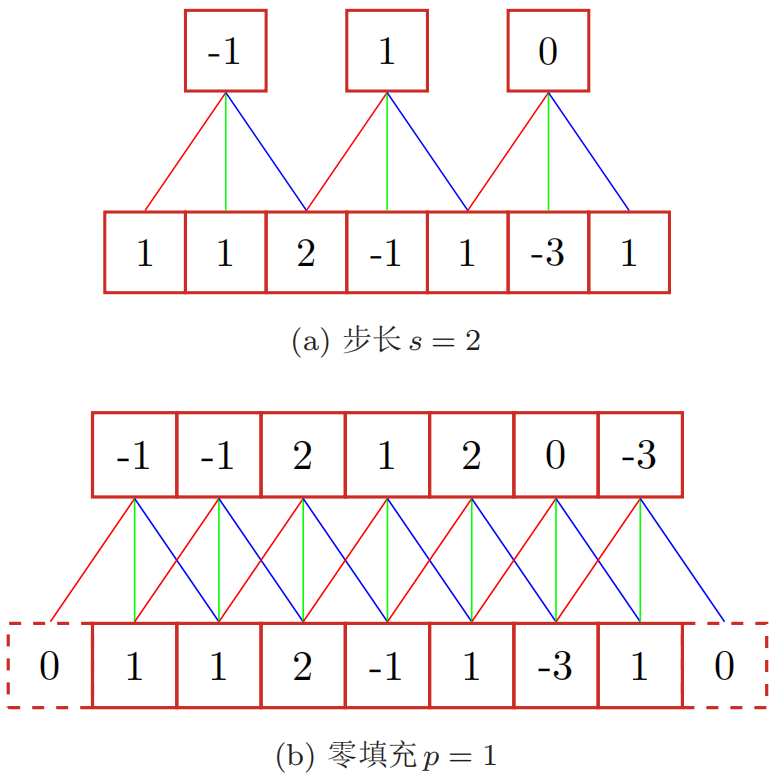

## 卷积神经网络

**卷积神经网络(convolutional neural network, CNN)**是一种具有局部连接、权重共享等特性的前馈神经网络。

卷积神经网络最早是主要用来处理图像信息。在用全连接前馈网络来处理图像时，会存在参数太多、局部特征不变形等缺陷。卷积神经网络利用**局部连接、权重共享以及汇聚**三大结构上的特性，使得数据具有一定程度上的平移、缩放和旋转不变性。和前馈神经网络相比，卷积神经网络的参数更少。

卷积神经网络主要使用在图像和视频分析的各种任务(如图像分类、人脸识别、物体识别、图像分割等)上，其准确率一般也远远超出了其它的神经网络模型。近年来卷积神经网络也广泛地应用到自然语言处理、推荐系统等领域。

### 卷积

#### 一维卷积

**卷积(convolution)**操作是分析数学中一种重要的运算，在信号处理或图像处理领域应用广泛。一维卷积经常用在信号处理中，用于计算信号的延迟累积。假设一个信号发生器每个时刻$t$产生一个信号$x_t$，其信息的衰减率为$w_k$，即在$k-1$个时间步长后，信息为原来的$w_k$倍。假设$w_1=1,w_2=1/2,w_3=1/4$，那么在时刻$t$收到的信号$y_t$为当前时刻产生的信息和以前时刻延迟信息的叠加，即：
$$
\begin{aligned}
y_{t} &=1 \times x_{t}+1 / 2 \times x_{t-1}+1 / 4 \times x_{t-2} \\
&=w_{1} \times x_{t}+w_{2} \times x_{t-1}+w_{3} \times x_{t-2} \\
&=\sum_{k=1}^{3} w_{k} \cdot x_{t-k+1}
\end{aligned}
$$
我们将$w_1,w_2,\cdots$称为**滤波器(filter)**或**卷积核(convolution kernel)**。假设滤波器长度为$m$，它和一个信号序列$x_1,x_2,\cdots$的卷积运算可以写为：
$$
y_{t}=\sum_{k=1}^{m} w_{k} \cdot x_{t-k+1}
$$
写作**向量形式**：$\boldsymbol{y}=\boldsymbol{w} \otimes \boldsymbol{x}$，其中$\otimes$表示卷积运算。当滤波器$w_k=1/m,1\leqslant k \leqslant m$时，卷积相当于信号序列的简单**移动平均(moving average, MA)**，窗口大小为$m$。

一般情况下滤波器的长度$m$远小于信号序列的长度$n$。下图为一维卷积的示意图：


#### 二维卷积

在图像处理中，将一维卷积进行拓展，可以得到二维卷积。给定一个图像$X \in \mathbb R^{M \times N}$和滤波器$W \in \mathbb R^{m \times n}$(一般滤波器的规模远小于图像的规模)，其卷积为：
$$
y_{i j}=\sum_{u=1}^{m} \sum_{v=1}^{n} w_{u v} \cdot x_{i-u+1, j-v+1}
$$
下图给出了二维卷积的示例：


**均值滤波(mean filter)**就是当前位置的像素值设为滤波器窗口中所有像素的平均值，也就是$w_{uv}=1/mn$。

在图像处理中，卷积经常作为**特征提取**的有效方法。一幅图像在经过卷积操作后得到结果称为**特征映射(feature map)**。下图给出在图像处理中几种常用的滤波器，以及其对应的特征映射。图中最上面的滤波器是常用的**高斯滤波器**，可以用来对图像进行**平滑去噪**；中间和最下面的滤波器可以用来**提取边缘特征**。


#### 互相关

在机器学习和图像处理领域，卷积的主要功能是在一个图像(或某种特征)上滑动一个卷积核(即滤波器)，通过卷积操作**得到一组新的特征**。在计算卷积的过程中，需要进行**卷积核翻转**。翻转就是从两个维度(从上到下、从左到右)颠倒次序，即旋转180度。在具体实现上，一般会以**互相关**操作来代替卷积，从而会减少不必要的或开销。

**互相关(cross-correlation)**是一个衡量两个序列相关性的函数，通常是用滑动窗口的点积计算来实现。给定一个图像$X \in \mathbb R^{M \times N}$和滤波器$W \in \mathbb R^{m \times n}$，它们的互相关为：
$$
y_{i j}=\sum_{u=1}^{m} \sum_{v=1}^{n} w_{u v} \cdot x_{i+u-1, j+v-1}
$$
写作向量形式：$Y=W \otimes X$。可以看出，互相关和卷积的区别仅在于卷积核是否进行翻转。因此互相关也可称为不翻转卷积。在神经网络中使用卷积是为了进行特征抽取，**卷积核是否进行翻转和其特征抽取的能力无关**。特别是当卷积核是可学习的参数时，卷积和互相关是等价的。**因此，为了实现上(或描述上)的方便起见，我们用互相关来代替卷积**。事实上，**很多深度学习工具中卷积操作其实都是互相关操作**。

#### 卷积的变种

在卷积的标准定义基础上，还可以引入滤波器的**滑动步长(stride)**和**零填充(padding)**来增加卷积的多样性：



假设卷积层的输入神经元个数为$n$，卷积大小为$m$，步长为$s$，输入神经元两端各填补$p$个零，那么该卷积层的神经元数量为$(n-m+2p)/s+1$。根据输出与输入的大小对比，卷积可以分为**宽卷积**、**窄卷积**和**等宽卷积**。

### 卷积神经网络

#### 卷积层

卷积层有两个重要的概念：

(1) **局部连接**：在卷积层(假设是第$l$层)中的每一个神经元都只和下一层(第$l-1$层)中**某个局部窗口内的神经元**相连接，构成一个**局部连接网络**。卷积层和下一层之间的**连接数大大减少**，由原来的$n^{(l)} \times n^{(l-1)}$个连接变为$n^{(l)} \times m$个连接，$m$为**滤波器大小**。

(2) **权重共享**：可以看出，作为参数的滤波器$w^{(l)}$对于第$l$层的**所有的神经元都是相同的**。权重共享可以理解为**一个滤波器只捕捉输入数据中的一种特定的局部特征**。因此，**如果要提取多种特征就需要使用多个不同的滤波器**。

卷积层的作用是提取一个局部区域的特征，**不同的卷积核相当于不同的特征提取器**。由于卷积网络主要应用在图像处理上，而图像为两维结构，因此为了更充分地利用图像的局部信息，通常将神经元组织为**三维结构的神经层**，其大小为$M \times N \times D$，由$D$(深度)个$M \times N$大小的特征映射构成。

**特征映射(feature map)**为**一幅图像(或其它特征映射)在经过卷积提取到的特征**，每个特征映射可以作为一类抽取的图像特征。为了提高卷积网络的表示能力，可以**在每一层使用多个不同的特征映射**，以更好地表示图像的特征。**在输入层，特征映射就是图像本身**。如果是灰度图像，就是有一个特征映射，输入层的深度$D=1$；如果是彩色图像，分别有RGB三个颜色通道的特征映射，输入层的深度$D=3$。

不失一般性，假设一个卷积层的结构如下：

(1) **输入特征映射组**：$\boldsymbol{X} \in \mathbb{R}^{M \times N \times D}$为三维张量(tensor)，其中每个切片矩阵$X^{d} \in \mathbb{R}^{M \times N}$为一个输入特征映射。

(2) **输出特征映射组**：$\boldsymbol{Y} \in \mathbb{R}^{M^{\prime} \times N^{\prime} \times P}$为三维张量，其中每个切片矩阵$Y^p \in \mathbb{R}^{M^{\prime} \times N^{\prime}}$为一个输出特征映射。

(3) **卷积核**：$\boldsymbol{W} \in \mathbb{R}^{m \times n \times D \times P}$为四维张量，其中每个切片矩阵$W^{p, d} \in \mathbb{R}^{m \times n}$为一个二维卷积核。

下图为卷积层的三维结构表示：


为了计算输出特征映射$Y^p$，用卷积核$W^{p, 1}, W^{p, 2}, \cdots, W^{p, D}$分别对输入特征映射$X^{1}, X^{2}, \cdots, X^{D}$进行卷积，然后将卷积结果相加，并加上一个标量偏置$b$得到卷积层的**净输入(指没有经过非线性激活函数的净活性值)**，再经过非线性激活函数后得到输出特征映射$Y^p$。
$$
\begin{array}{l}
Z^{p}=\boldsymbol{W}^{p} \otimes \boldsymbol{X}+b^{p}=\sum_{d=1}^{D} W^{p, d} \otimes X^{d}+b^{p} \\
Y^{p}=f(Z^{p})
\end{array}
$$
整个计算过程如下图所示：


如果希望卷积层输出$P$个特征映射，可以将上述计算机过程重复$P$次，得到$P$个输出特征映射。

#### 池化层

**池化层(pooling layer)**也叫**子采样层(subsampling layer)**或**汇聚层**，其作用是**进行特征选择，降低特征数量，从而减少参数数量**。卷积层虽然可以显著减少网络中连接的数量，但**特征映射组**中的神经元个数并没有显著减少。如果后面接一个**分类器**，分类器的输入维数依然很高，很容易出现过拟合。为了解决这个问题，可以在卷积层之后加上一个汇聚层，从而降低特征维度，避免过拟合。

假设汇聚层的输入特征映射组为$\boldsymbol{X} \in \mathbb{R}^{M \times N \times D}$，对于其中每一个特征映射$X^p$，可以将其划分为很多个区域，这些区域可以重叠，也可以不重叠。池化操作对每个区域分别进行下采样，通常有最大池化和平均池化两种方式。其中，**最大池化(max pooling)**一般是取一个区域内所有神经元的最大值，而**平均池化(mean pooling)**：一般是取区域内所有神经元的平均值。下图为最大池化示意图：


典型的汇聚层是将每个特征映射划分为$2 \times 2$大小的不重叠区域，然后使用**最大汇聚**的方式进行下采样。汇聚层也可以看做是一个**特殊的卷积层**，卷积核大小为$m \times m$，步长为$s \times s$，卷积核为max函数或mean函数。过大的采样区域会急剧减少神经元的数量，也会造成**过多的信息损失**。

### 参数学习

在卷积网络中，**参数为卷积核中权重以及偏置**。和全连接前馈网络类似，卷积网络也可以通过误差反向传播算法来进行参数学习。在全连接前馈神经网络中，梯度主要通过每一层的误差项$\delta$进行反向传播，并进一步计算每层参数的梯度。在卷积神经网络中，主要有两种不同功能的神经层：**卷积层和汇聚层**。而参数为卷积核以及偏置，因此**只需要计算卷积层中参数的梯度**。

不失一般性，对第$l$层为卷积层，第$l-1$层的输入特征映射为$\boldsymbol{X}^{(l-1)} \in \mathbb{R}^{M \times N \times D}$。通过卷积计算得到第$l$层的特征映射净输入$\boldsymbol{Z}^{(l)} \in \mathbb{R}^{M^{\prime} \times N^{\prime} \times P}$。第$l$层的第$p$个个特征映射净输入为：
$$
Z^{(l, p)}=\sum_{d=1}^{D} W^{(l, p, d)} \otimes X^{(l-1, d)}+b^{(l, p)}
$$
其中$W^{(l,p,d)}$和$b^{(l,p)}$分别为卷积核为偏置。第$l$层中共有$P \times D$个权重和$P$ 个偏置，可以分别使用链式法则来计算其梯度。根据计算，损失函数关于第$l$层的卷积核$W^{(l,p,d)}$的偏导数为：
$$
\begin{aligned}
\frac{\partial \mathcal{L}(Y, \hat{Y})}{\partial W^{(l, p, d)}} &=\frac{\partial \mathcal{L}(Y, \hat{Y})}{\partial Z^{(l, p)}} \otimes X^{(l-1, d)} \\
&=\delta^{(l, p)} \otimes X^{(l-1, d)}
\end{aligned}
$$
其中，$\delta^{(l, p)}=\frac{\partial \mathcal{L}(Y, \hat{Y})}{\partial Z^{(l, p)}}$为为损失函数关于第$l$层的第$p$个特征映射净输入$Z^{(l,p)}$的偏导数。同理可得，损失函数关于第$l$层的第$p$个偏置$b^{(l,p)}$的偏导数为：
$$
\frac{\partial \mathcal{L}(Y, \hat{Y})}{\partial b^{(l, p)}}=\sum_{i, j}[\delta^{(l, p)}]_{i, j}
$$
在卷积网络中，每层参数的梯度依赖其所在层的误差项$\delta^{(l,p)}$。卷积层和汇聚层中误差项的计算有所不同，因此我们分别计算其误差项。

(1) **汇聚层**的误差项

当第$l+1$层为汇聚层时，因为汇聚层是下采样操作，$l+1$层的每个神经元的误差项$\delta$对应于第$l$层的相应特征映射的一个区域。$l$层的第$p$个特征映射中的每个神经元都有一条边和$l+1$层的第$p$个特征映射中的一个神经元相连。根据链式法则，第$l$层的一个特征映射的误差项$\delta^{(l,p)}$，只需要将$l+1$层对应特征映射的误差项进行上采样操作(和第$\delta^{(l+1,p)}$层的大小一样)，再和$l$层特征映射的激活值偏导数逐元素相乘，就得到了$\delta^{(l,p)}$。

第$l$层的第$p$个特征映射的误差项$\delta^{(l,p)}$的具体推导过程如下：
$$
\begin{aligned}
\delta^{(l, p)} & \triangleq \frac{\partial \mathcal{L}(Y, \hat{Y})}{\partial Z^{(l, p)}} \\
&=\frac{\partial X^{(l, p)}}{\partial Z^{(l, p)}} \cdot \frac{\partial Z^{(l+1, p)}}{\partial X^{(l, p)}} \cdot \frac{\partial \mathcal{L}(Y, \hat{Y})}{\partial Z^{(l+1, p)}} \\
&=f_{l}^{\prime}(Z^{(l, p)}) \odot \operatorname{up}(\delta^{(l+1, p)})
\end{aligned}
$$
其中$f_{l}^{\prime}(\cdot)$为第$l$层使用的激活函数导数，$\text{up}$为**上采样函数，与汇聚层中使用的下采样操作刚好相反**。如果下采样是最大汇聚，误差项中每个$\delta^{(l+1,p)}$值会直接传递到上一层对应区域中的最大值所对应的神经元，该区域中其它神经元的误差项都设为0。如果下采样是平均汇聚，误差项$\delta^{(l+1,p)}$中每个值会被平均分配到上一层对应区域中的所有神经元上。

(2) **卷积层**的误差项

当第$l+1$层为卷积层时，假设特征映射净输入$\boldsymbol{Z}^{(l+1)} \in \mathbb{R}^{M^{\prime} \times N^{\prime} \times P}$，其中第$p(1 \leqslant p \leqslant P)$个特征映射净输入
$$
Z^{(l+1, p)}=\sum_{d=1}^{D} W^{(l+1, p, d)} \otimes X^{(l, d)}+b^{(l+1, p)}
$$
其中$W^{(l+1,p,d)}$和$b^{(l+1,p)}$为第$l+1$层的卷积核以及偏置。第$l+1$层中共有$P \times D$个卷积核和$P$个偏置。

第$l$层的第$d$个特征映射的误差项$δ^{(l,d)}$的具体推导过程如下：
$$
\begin{aligned}
\delta^{(l, d)} & \triangleq \frac{\partial \mathcal{L}(Y, \hat{Y})}{\partial Z^{(l, d)}} \\
&=\frac{\partial X^{(l, d)}}{\partial Z^{(l, d)}} \cdot \frac{\partial \mathcal{L}(Y, \hat{Y})}{\partial X^{(l, d)}} \\
&=f_{l}^{\prime}(Z^{(l)}) \odot \sum_{p=1}^{P}\left(\operatorname{rot} 180(W^{(l+1, p, d)}) \tilde{\otimes} \frac{\partial \mathcal{L}(Y, \hat{Y})}{\partial Z^{(l+1, p)}}\right) \\
&=f_{l}^{\prime}(Z^{(l)}) \odot \sum_{p=1}^{P}\left(\operatorname{rot} 180(W^{(l+1, p, d)}) \tilde{\otimes} \delta^{(l+1, p)}\right)
\end{aligned}
$$
其中，$\tilde{\otimes}$为宽卷积。

### 几种常见的卷积神经网络

#### LeNet-5


#### AlexNet


#### Inception网络

在Inception网络中，一个卷积层包含多个**不同大小的卷积操作**，称为Inception模块。Inception网络是由有多个Inception模块和少量的汇聚层堆叠而成。Inception模块同时使用$1 \times 1, 3 \times 3, 5 \times 5$等不同大小的卷积核，并将得到的特征映射在深度上拼接(堆叠)起来作为输出特征映射。


Inception网络最早的v1版本就是非常著名的**GoogLeNet**，其赢得了2014年ImageNet图像分类竞赛的冠军。 Inception网络有多个改进版本，其中比较有代表性的有**Inception v3**网络。Inception v3网络用多层的小卷积核来替换大的卷积核，以减少计算量和参数量，并保持感受野不变。具体包括：(1) 使用两层3×3的卷积来替换v1中的5×5的卷积；(2) 使用连续的n×1和1×n来替换n×n的卷积。此外，Inception v3网络同时也引入了标签平滑以及批量归一化等优化方法进行训练。

#### 残差网络

**残差网络(residual network, ResNet)**是通过给非线性的卷积层增加直连边的方式来提高信息的传播效率。假设在一个深度网络中，我们期望一个非线性单元(可以为一层或多层的卷积层)$f(\boldsymbol x;\theta)$去逼近一个目标函数$h(\boldsymbol x)$。可以将目标函数拆分成两部分：**恒等函数(identity function)**$\boldsymbol x$和**残差函数(residue function)**$h(\boldsymbol x) - \boldsymbol x$：$h(\boldsymbol x) = \boldsymbol x + h(\boldsymbol x) - \boldsymbol x$。

根据通用近似定理，一个由神经网络构成的非线性单元有足够的能力来近似逼近原始目标函数或残差函数，但**实际中后者更容易学习**。因此，原来的优化问题可以转换为：让非线性单元$f(\boldsymbol x;\theta)$去近似残差函数$h(\boldsymbol x) - \boldsymbol x$，并用$f(\boldsymbol x;\theta) + \boldsymbol x$去逼近$h(\boldsymbol x)$。

下图给出了一个典型的残差单元示例。残差单元由多个级联的卷积层和一个跨层的直连边组成，再经过ReLU激活后得到输出。


残差网络就是将很多个残差单元串联起来构成的一个非常深的网络。和残差网络类似的还有**Highway Network**等。

### 其他卷积方式

#### 转置卷积

我们一般可以通过卷积操作来实现**高维特征到低维特征的转换**。比如在一维卷积中，一个5维的输入特征，经过一个大小为3的卷积核，其输出为3维特征。如果设置步长大于1，可以进一步降低输出特征的维数。但在一些任务中，我们需要**将低维特征映射到高维特征**，并且依然希望通过卷积操作来实现。假设有一个高维向量$\boldsymbol x \in \mathbb R^d$和一个低维向量$\boldsymbol z \in \mathbb R^p$，其中$p < d$。如果使用仿射变换来实现高维到低维的映射$\boldsymbol z=W \boldsymbol x$，可以很容易地通过转置$W$来实现低维到高维的反向映射，即$\boldsymbol x=W^\text T \boldsymbol z$。

在**全连接网络**中，**忽略激活函数**，**前向计算和反向传播就是一种转置关系**。比如前向计算时，第$l+1$层的净输入为$\boldsymbol{z}^{(l+1)}=W^{(l+1)} \boldsymbol{z}^{(l)}$，反向传播时，第$l$层的误差项为$\delta^{(l)}=(W^{(l+1)})^\text T \delta^{(l+1)}$。

卷积操作也可以写为仿射变换的形式。假设一个5维向量$\boldsymbol x$，经过大小为3的卷积核$\boldsymbol w=[w_1,w_2,w_3]^\text T$进行卷积，得到三维向量$\boldsymbol z$，卷积操作可以写为：
$$
\begin{aligned}
\boldsymbol{z} &=\boldsymbol{w} \otimes \boldsymbol{x} \\
&=\left[\begin{array}{lllll}
w_{1} & w_{2} & w_{3} & 0 & 0 \\
0 & w_{1} & w_{2} & w_{3} & 0 \\
0 & 0 & w_{1} & w_{2} & w_{3}
\end{array}\right] \cdot \boldsymbol{x} \\
&=C \boldsymbol{x}
\end{aligned}
$$
其中$C$是一个稀疏矩阵，其非零元素来自于卷积核$\boldsymbol w$中的元素。如果要实现3维向量$\boldsymbol z$到5维向量$\boldsymbol x$的映射，可以通过仿射矩阵的转置来实现，即$\boldsymbol x=C^\text T \boldsymbol z=\operatorname{rot} 180(\boldsymbol{w}) \tilde{\oplus} \boldsymbol{z}$。

从仿射变换的角度来看，两个卷积操作$\boldsymbol{z}=\boldsymbol{w} \otimes \boldsymbol{x}$和$\boldsymbol{x}=\operatorname{rot} 180(\boldsymbol{w}) \tilde{\oplus} \boldsymbol{z}$也是形式上的转置关系。因此，我们将低维特征映射到高维特征的卷积操作称为**转置卷积(transposed convolution)**，也称为**反卷积(deconvolution)**。

在卷积网络中，卷积层的前向计算和反向传播也是一种转置关系。对一个$n$维的向量$\boldsymbol z$，和大小为$m$的卷积核，如果希望通过卷积操作来映射 到更高维的向量，只需要对向量$\boldsymbol z$进行两端补零$p=m-1$，然后进行卷积，可以得到$n+m-1$维的向量。

转置卷积同样适用于二维卷积。下图给出了一个步长$s=1$，无零填充$p=0$的二维卷积和其对应的转置卷积：


我们可以通过增加卷积操作的步长$s>1$来实现对输入特征的下采样操作，大幅降低特征维数。同样，我们也可以通过减少转置卷积的步长$s<1$来实现上采样操作，大幅提高特征维数。步长$s<1$的转置卷积也称为**微步卷积(fractionally-strided convolution)**。为了实现微步卷积，我们可以在输入特征之间插入0来间接地使得步长变小。

如果卷积操作的步长为$s>1$，希望其对应的转置卷积的步长为$\frac{1}{s}$，需要在输入特征之间插入$s-1$个0来使得其移动的速度变慢。

以一维转置卷积为例，对一个$n$维的向量$\boldsymbol z$，和大小为$m$的卷积核，通过对向量$\boldsymbol z$进行两端补零$p=m-1$，并且在每两个向量元素之间插入$d$个0，然后进行步长为1的卷积，可以得到$(d+1) \times (n-1)+m$维的向量。

下图给出了一个步长$s=2$，无零填充$p=0$的二维卷积和其对应的转置卷积：


#### 空洞卷积

**空洞卷积(atrous convolution)**是一种不增加参数数量，同时增加输出单元感受野的一种方法，也称为**膨胀卷积(dilated convolution)**。空洞卷积通过**给卷积核插入“空洞”**来变相地增加其大小。下图为空洞卷积的示例：


### Tensorflow实现卷积神经网络进行Fashion MNIST衣物识别

```python
import tensorflow as tf

print(tf.__version__)

# 下载Fashion MNIST数据并进行归一化
(X_train, y_train), (X_test, y_test) = tf.keras.datasets.fashion_mnist.load_data()
X_train, X_test = X_train / 255.0, X_test / 255.0

print(X_train.shape, X_test.shape, y_train.shape, y_test.shape)

X_train = tf.expand_dims(X_train, -1)  # 扩展通道这一维度
X_test = tf.expand_dims(X_test, -1)  # 扩展通道这一维度

print(X_train.shape, X_test.shape, y_train.shape, y_test.shape)

# 将数据转化为tf.data.Dataset类型
train_ds = tf.data.Dataset.from_tensor_slices((X_train, y_train)).shuffle(10000).batch(64)
test_ds = tf.data.Dataset.from_tensor_slices((X_test, y_test)).batch(64)


class ConvNeuralNetwork(tf.keras.Model):
    def __init__(self):
        super(ConvNeuralNetwork, self).__init__()
        self.conv1 = tf.keras.layers.Conv2D(64, (5, 5), activation='relu')
        self.pool1 = tf.keras.layers.AveragePooling2D((2, 2))
        self.conv2 = tf.keras.layers.Conv2D(128, (3, 3), activation='relu')
        self.pool2 = tf.keras.layers.AveragePooling2D((2, 2))
        self.flatten = tf.keras.layers.Flatten()
        self.dense1 = tf.keras.layers.Dense(256, activation='relu')
        self.dense2 = tf.keras.layers.Dense(10, activation='softmax')

    def call(self, x):
        x_conv1 = self.conv1(x)
        x_pool1 = self.pool1(x_conv1)
        x_conv2 = self.conv2(x_pool1)
        x_pool2 = self.pool2(x_conv2)
        x_flatten = self.flatten(x_pool2)
        x_dense1 = self.dense1(x_flatten)
        return self.dense2(x_dense1)


cnn_model = ConvNeuralNetwork()

# 定义损失函数和优化器
loss_function = tf.keras.losses.SparseCategoricalCrossentropy()
optimizer = tf.keras.optimizers.Adam()

# 评价指标
train_loss = tf.keras.metrics.Mean(name='train_loss')
train_accuracy = tf.keras.metrics.SparseCategoricalAccuracy(name='train_accuracy')

test_loss = tf.keras.metrics.Mean(name='test_loss')
test_accuracy = tf.keras.metrics.SparseCategoricalAccuracy(name='test_accuracy')


# 定义训练步
@tf.function
def train_step(images, labels):
    with tf.GradientTape() as tape:
        predictions = cnn_model(images)
        loss = loss_function(labels, predictions)
    gradients = tape.gradient(loss, cnn_model.trainable_variables)
    optimizer.apply_gradients(zip(gradients, cnn_model.trainable_variables))

    train_loss(loss)
    train_accuracy(labels, predictions)


# 定义测试步
@tf.function
def test_step(images, labels):
    predictions = cnn_model(images)
    loss = loss_function(labels, predictions)

    test_loss(loss)
    test_accuracy(labels, predictions)


EPOCHS = 10  # 训练轮次

for epoch in range(EPOCHS):
    train_loss.reset_states()
    train_accuracy.reset_states()
    test_loss.reset_states()
    test_accuracy.reset_states()

    for images, labels in train_ds:
        train_step(images, labels)

    for test_images, test_labels in test_ds:
        test_step(test_images, test_labels)

    template = 'Epoch {}, Loss: {}, Accuracy: {}, Test Loss: {}, Test Accuracy: {}'
    print(template.format(epoch + 1, train_loss.result(), train_accuracy.result() * 100,
                          test_loss.result(), test_accuracy.result() * 100))
```

### Pytorch实现卷积神经网络进行Fashion MNIST衣物识别

整体框架与全连接神经网络进行MNIST手写数字识别一致，仅在网络结构上进行修改：

```python
class Net(nn.Module):
    def __init__(self):
        super(Net,self).__init__()  
        self.conv1 = nn.Conv2d(1,10,kernel_size=5)     #灰度图像单通道
        self.conv2 = nn.Conv2d(10,20,kernel_size=5)
        self.pooling = nn.MaxPool2d(2)     #kernel_size=2的最大池化
        self.fc1 = nn.Linear(20*4*4,70)
        self.fc2 = nn.Linear(70,10)
    def forward(self,x):
        batch_size = x.size(0)
        x = self.pooling(F.relu(self.conv1(x)))
        x = self.pooling(F.relu(self.conv2(x)))
        x = x.view(batch_size,-1)
        x = F.relu(self.fc1(x))
        x = self.fc2(x)
        return x
```

### 参考资料

- 邱锡鹏. 神经网络与深度学习. 北京: 机械工业出版社, 2020.
- Khan A, Sohail A, Zahoora U, et al. A survey of the recent architectures of deep convolutional neural networks[J]. Artificial Intelligence Review, 2020, 53(8): 5455-5516.
- 卷积神经网络维基百科：https://en.wikipedia.org/wiki/Convolutional_neural_network

- Pytorch实现手写数字识别（基于卷积神经网络）：https://blog.csdn.net/weixin_44851176/article/details/125902419?spm=1001.2014.3001.5502

