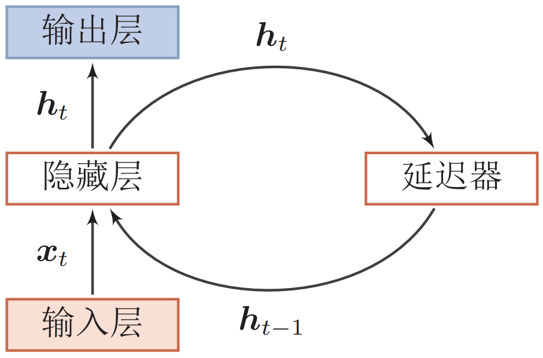
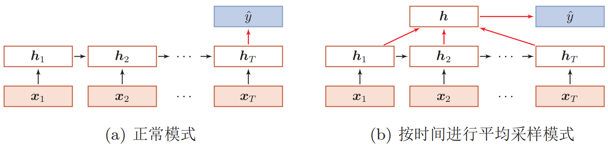
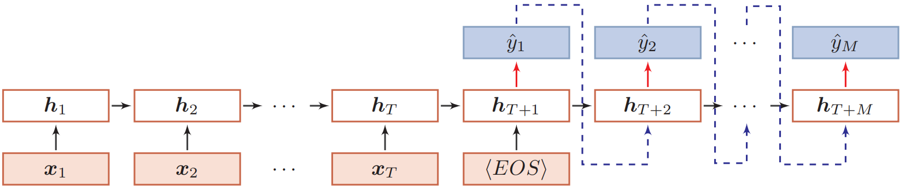
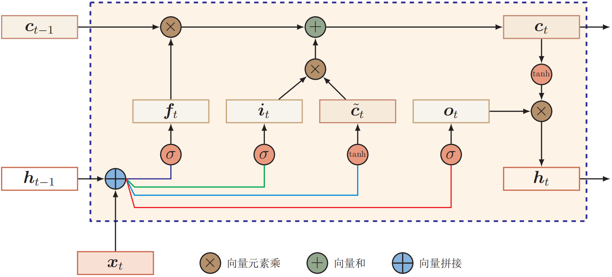
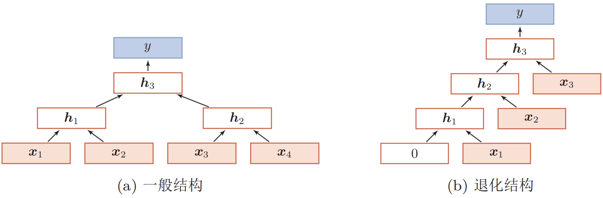

## 循环神经网络

### 序列数据和语言模型

全连接神经网络和卷积神经网络只能单独处理一个个的输入，**前一个输入和后一个输入是完全没有关系的**。但是，某些任务需要能够更好的处理序列的信息，即前面的输入和后面的输入是有关系的。比如，当我们在理解一句话意思时，孤立的理解这句话的每个词是不够的，我们需要处理这些词连接起来的整个序列；当我们处理视频的时候，我们也不能只单独的去分析每一帧，而要**分析这些帧连接起来的整个序列**。这时，就需要用到深度学习领域中另一类非常重要神经网络：**循环神经网络(recurrent neural network)**。

RNN是在自然语言处理领域中最先被用起来的，比如，RNN可以为语言模型来建模。例如我们可以和电脑玩一个游戏，我们写出一个句子前面的一些词，然后，让电脑帮我们写下接下来的一个词。比如下面这句：**我昨天上学迟到了，老师批评了__**。

语言模型是对一种语言的特征进行建模，它有很多很多用处。比如在**语音转文本(STT)**的应用中，**声学模型输出**的结果，往往是若干个可能的候选词，这时候就需要语言模型来从这些候选词中选择一个最可能的。当然，它同样也可以用在**图像到文本的识别中(OCR)**。

使用RNN之前，语言模型主要是采用**N-gram语言模型**。N可以是一个自然数，它的含义是，假设一个词出现的概率只与前面N个词相关。N-gram模型的缺陷是，**当处理任意长度的句子，N设为多少都不合适**；另外，**模型的大小和N的关系是指数级的**，4-gram模型会占用海量的存储空间。

与传统语言模型不同的是，循环神经网络理论上可以往前看(往后看)任意多个词。

### 网络结构

给定一个输入序列$\boldsymbol x_{1:T}=(\boldsymbol{x}_{1}, \boldsymbol{x}_{2}, \ldots, \boldsymbol{x}_{t}, \cdots, \boldsymbol{x}_{T})$，RNN通过下面公式更新带反馈边的隐藏层的活性值$\boldsymbol h_t$：
$$
\boldsymbol{h}_{t}=f(\boldsymbol{h}_{t-1}, \boldsymbol{x}_{t})
$$
其中$\boldsymbol h_0=0$(**即RNN隐藏层的初始值为0**)，$f(·)$为一个**非线性函数**，也可以是一个**前馈网络**。



循环层的基础结构如上图所示。循环神经网络可以看成一个**动力系统(dynamic system)**，指**系统状态**按照一定的规律**随时间变化**的系统。具体地讲，动力系统是使用一个函数来描述一个给定空间中所有点随时间的变化情况。因此，隐藏层的活性值$\boldsymbol h_t$在很多文献上也称为**状态(state)**或**隐状态(hidden state)**。**理论上，循环神经网络可以近似任意的非线性动力系统**。

最简单的循环神经网络是只有一层隐藏层的情况。假设在时刻$t$时，网络的输入为$\boldsymbol x_t$，隐藏层状态$\boldsymbol h_t$不仅和当前时刻的输入$\boldsymbol x_t$有关，也和上一个时刻的隐藏层状态$\boldsymbol h_{t-1}$有关：
$$
\begin{aligned}
\boldsymbol{z}_{t}&=U \boldsymbol{h}_{t-1}+W \boldsymbol{x}_{t}+\boldsymbol{b} \\
\boldsymbol{h}_{t}&=f\left(\boldsymbol{z}_{t}\right)
\end{aligned}
$$
其中，$\boldsymbol z_t$为隐藏层的净输入，$f(·)$是非线性激活函数，通常为sigmoid函数或tanh函数，$U$为状态-状态权重矩阵，$W$为状态-输入权重矩阵，$b$为偏置。上式也可直接写为：
$$
\boldsymbol{h}_{t}=f(U \boldsymbol{h}_{t-1}+W \boldsymbol{x}_{t}+\boldsymbol{b})
$$
在时间步$t$的输出层输出可以写为：
$$
\boldsymbol{y}_{t}=V \boldsymbol{h}_{t}
$$
其中$V$是隐含层与输出层之间的连接权重。如果我们把每个时刻的状态都看作是前馈神经网络的一层，循环神经网络可以看作是**在时间维度上权值共享的神经网络**。


**循环神经网络的通用近似定理**：一个有**足够数量的sigmoid型隐藏神经元**的循环神经网络，可以以任意的准确率去近似任何一个非线性动力系统。

**循环神经网络的图灵完备性**：所有的**图灵机**都可以被一个由使用sigmoid型激活函数的神经元构成的全连接循环网络来进行模拟。因此，一个完全连接的循环神经网络可以近似解决所有的可计算问题。

### 循环神经网络的应用

根据不同的任务特点，循环神经网络的应用可以分为如下几种模式：

(1) **序列到类别模式(文本分类、情感分析等)**：



(2) **同步的序列到序列模式(序列标注等)**：


(3) **异步的序列到序列模式(机器翻译、对话系统等)**：



### 循环神经网络的训练

循环神经网络的参数可以通过梯度下降方法来进行学习。

给定一个训练样本$(\boldsymbol x,\boldsymbol y)$，其中$\boldsymbol x_{1:T}=(\boldsymbol x_1,\cdots,\boldsymbol x_T)$是长度为$T$的输入序列，$y1:T= (\boldsymbol y_1,\cdots,\boldsymbol y_T)$是长度为$T$的标签序列。即在每个时刻$t$，都有一个监督信息$\boldsymbol y_t$，我们定义时刻的$t$损失函数为：
$$
\mathcal{L}_{t}=\mathcal{L}(y_{t}, g(\boldsymbol{h}_{t}))
$$
其中$g(\boldsymbol{h}_{t})$为第$t$时刻的输出，$\mathcal L$为可微的损失函数，比如交叉熵等。整个序列的损失函数为：
$$
\mathcal{L}=\sum_{t=1}^{T} \mathcal{L}_{t}
$$
整个序列的损失函数$\mathcal L$关于参数$U$的梯度为：
$$
\frac{\partial \mathcal{L}}{\partial U}=\sum_{t=1}^{T} \frac{\partial \mathcal{L}_{t}}{\partial U}
$$
即每个时刻损失$\mathcal L_t$对参数$U$的偏导数之和。

循环神经网络中存在一个递归调用的函数$f(\cdot)$，因此其计算参数梯度的方式和前馈神经网络不太相同。在循环神经网络中主要有两种计算梯度的方式：**随时间反向传播(BPTT)算法**和**实时循环学习(RTRL)算法**。

#### 随时间反向传播算法

**随时间反向传播(back-propagation through time, BPTT)算法**的主要思想是通过**类似前馈神经网络的错误反向传播算法**来计算梯度。BPTT算法将循环神经网络看作是一个**展开的多层前馈网络**，其中**“每一层”对应循环网络中的“每个时刻”**。这样，循环神经网络就可以按照前馈网络中的反向传播算法计算参数梯度。在“展开”的前馈网络中，所有层的参数是共享的，因此参数的真实梯度是所有“展开层”的参数梯度之和。

(1) 计算偏导数$\frac{\partial \mathcal{L}_{t}}{\partial U}$

因为参数$U$和隐藏层在每个时刻$k(1 \leqslant k \leqslant t)$的净输入$\boldsymbol z_k=U \boldsymbol h_{k-1}+W \boldsymbol x_k + b$有关，因此第$t$时刻的损失函数$\mathcal L_t$关于参数$u_{ij}$的梯度为：
$$
\frac{\partial \mathcal{L}_{t}}{\partial u_{i j}}=\sum_{k=1}^{t} \frac{\partial^{+} \boldsymbol{z}_{k}}{\partial u_{i j}} \frac{\partial \mathcal{L}_{t}}{\partial \boldsymbol{z}_{k}}
$$
其中$\frac{\partial^{+} \boldsymbol{z}_{k}}{\partial u_{i j}}$表示“直接”偏导数，即公式$\boldsymbol{z}_{k}=U \boldsymbol{h}_{k-1}+W \boldsymbol{x}_{k}+\boldsymbol{b}$中保持$\boldsymbol h_{k-1}$不变，对$u_{ij}$进行求偏导数，得到：
$$
\begin{aligned}
\frac{\partial^{+} \boldsymbol{z}_{k}}{\partial u_{i j}} &=[0, \cdots,[\boldsymbol{h}_{k-1}]_{j}, \cdots, 0] \\
& \triangleq \mathbb{I}_{i}([\boldsymbol{h}_{k-1}]_{j})
\end{aligned}
$$
其中$[\boldsymbol h_{k-1}]_j$为第$k-1$时刻隐状态的第$j$维，$\mathbb{I}_{i}(x)$是除了第$i$列值为$x$外，其余都为0的行向量。

定义误差项$\delta_{t,k}=\frac{\partial \mathcal L_t}{\partial \boldsymbol z_k}$为第$t$时刻损失对第$k$时刻隐藏神经层的净输入$\boldsymbol z_k$的导数，则当$1 \leqslant k \leqslant t$时，
$$
\begin{aligned}
\delta_{t, k} &=\frac{\partial \mathcal{L}_{t}}{\partial z_{k}} \\
&=\frac{\partial \boldsymbol{h}_{k}}{\partial \boldsymbol{z}_{k}} \frac{\partial \boldsymbol{z}_{k+1}}{\partial \boldsymbol{h}_{k}} \frac{\partial \mathcal{L}_{t}}{\partial \boldsymbol{z}_{k+1}} \\
&=\operatorname{diag}\left(f^{\prime}\left(\boldsymbol{z}_{k}\right)\right) U^{\text{T}} \delta_{t, k+1}
\end{aligned}
$$
合并以上公式，得到：
$$
\frac{\partial \mathcal{L}_{t}}{\partial u_{i j}}=\sum_{k=1}^{t}[\delta_{t, k}]_{i}[\boldsymbol{h}_{k-1}]_{j}
$$
将上式写成矩阵形式：
$$
\frac{\partial \mathcal{L}_{t}}{\partial U}=\sum_{k=1}^{t} \delta_{t, k} \boldsymbol{h}_{k-1}^{\mathrm{T}}
$$
下图给出了误差项随时间进行反向传播算法的示例：


(2) 参数梯度

整个序列的损失函数$\mathcal L$关于参数$U$的梯度为：
$$
\frac{\partial \mathcal{L}}{\partial U}=\sum_{t=1}^{T} \sum_{k=1}^{t} \delta_{t, k} \boldsymbol{h}_{k-1}^{\text{T}}
$$
同理可得，$\mathcal L$关于权重$W$和偏置$\boldsymbol b$的梯度为：
$$
\begin{aligned}
\frac{\partial \mathcal{L}}{\partial W}&=\sum_{t=1}^{T} \sum_{k=1}^{t} \delta_{t, k} \boldsymbol{x}_{k}^{\mathrm{T}} \\
\frac{\partial \mathcal{L}}{\partial \boldsymbol{b}}&=\sum_{t=1}^{T} \sum_{k=1}^{t} \delta_{t, k}
\end{aligned}
$$
(3) 计算复杂度

在BPTT算法中，参数的梯度需要在一个**完整的“前向”计算和“反向”计算**后才能得到并进行参数更新。

#### 实时循环学习算法

与反向传播的BPTT算法不同的是，**实时循环学习(real-time recurrent learning, RTRL)**是通过前向传播的方式来计算梯度的。假设循环神经网络中第$t+1$时刻的状态$\boldsymbol h_{t+1}$为：
$$
\boldsymbol{h}_{t+1}=f\left(\boldsymbol{z}_{t+1}\right)=f\left(U \boldsymbol{h}_{t}+W \boldsymbol{x}_{t+1}+\boldsymbol{b}\right)
$$
其关于参数$u_{ij}$的偏导数为：
$$
\begin{aligned}
\frac{\partial \boldsymbol{h}_{t+1}}{\partial u_{i j}} &=\left(\frac{\partial^{+} \boldsymbol{z}_{t+1}}{\partial u_{i j}}+\frac{\partial \boldsymbol{h}_{t}}{\partial u_{i j}} U^{\mathrm{T}}\right) \frac{\partial \boldsymbol{h}_{t+1}}{\partial \boldsymbol{z}_{t+1}} \\
&=\left(\mathbb{I}_{i}\left(\left[\boldsymbol{h}_{t}\right]_{j}\right)+\frac{\partial \boldsymbol{h}_{t}}{\partial u_{i j}} U^{\mathrm{T}}\right) \operatorname{diag}(f^{\prime}(\boldsymbol{z}_{t+1})) \\
&=\left(\mathbb{I}_{i}\left(\left[\boldsymbol{h}_{t}\right]_{j}\right)+\frac{\partial \boldsymbol{h}_{t}}{\partial u_{i j}} U^{\mathrm{T}}\right) \odot(f^{\prime}(\boldsymbol{z}_{t+1}))^{\mathrm{T}}
\end{aligned}
$$
其中$\mathbb{I}_{i}(x)$是除了第$i$列值为$x$外，其余都为0的行向量。

RTRL算法从第一个时刻开始，，除了计算循环神经网络的隐状态之外，还利用上式依次前向计算偏导数$\frac{\partial \boldsymbol{h}_{1}}{\partial u_{i j}}, \frac{\partial \boldsymbol{h}_{2}}{\partial u_{i j}}, \frac{\partial \boldsymbol{h}_{3}}{\partial u_{i j}}, \cdots$。

这样，假设第$t$个时刻存在一个监督信息，其损失函数为$\mathcal L_t$，就可以同时计算损失函数对$u_{ij}$的偏导数
$$
\frac{\partial \mathcal{L}_{t}}{\partial u_{i j}}=\frac{\partial \boldsymbol{h}_{t}}{\partial u_{i j}} \frac{\partial \mathcal{L}_{t}}{\partial \boldsymbol{h}_{t}}
$$
这样在第$t$时刻，可以实时地计算损失$\mathcal L_t$关于参数$U$的梯度，并更新参数。参数$W$和$\boldsymbol b$的梯度也可以同样按上述方法实时计算。

RTRL算法和BPTT算法都是基于梯度下降的算法，分别通过前向模式和反向模式应用链式法则来计算梯度。在循环神经网络中，一般网络输出维度远低于输入维度，因此**BPTT算法的计算量会更小**，但是BPTT算法需要保存所有时刻的中间梯度，**空间复杂度较高**。RTRL算法不需要梯度回传，因此非常适合用于需要**在线学习**或**无限序列**的任务中。

### 长程依赖问题

循环神经网络在学习过程中的主要问题是由于梯度消失或爆炸问题，很难建模**长时间间隔(long range)的状态之间的依赖关系**。

在BPTT算法中，将误差项计算公式展开得到：
$$
\delta_{t, k}=\prod_{\tau=k}^{t-1}(\operatorname{diag}(f^{\prime}(\boldsymbol{z}_{\tau})) U^{\mathrm{T}}) \delta_{t, t}
$$
如果定义$\gamma \cong\left\|\operatorname{diag}(f^{\prime}(\boldsymbol{z}_{\tau})) U^{\mathrm{T}}\right\|$，则
$$
\delta_{t, k} \cong \gamma^{t-k} \delta_{t, t}
$$
若$\gamma > 1$，当$t-k \rightarrow \infty$时，$\gamma^{t-k} \rightarrow \infty$。当间隔$t-k$比较大时，梯度也变得很大，会造成系统不稳定，称为**梯度爆炸问题(gradient exploding problem)**。

相反，若$\gamma < 1$，当$t-k \rightarrow \infty$时，$\gamma^{t-k} \rightarrow 0$。当间隔$t-k$比较大时，梯度也变得非常小，会出现和深层前馈神经网络类似的**梯度消失问题(gradient vanishing problem)**。

由于循环神经网络经常使用非线性激活函数为**logistic函数或tanh函数**作为非线性激活函数，其导数值都小于1，并且权重矩阵$\|U\|$也不会太大，因此如果时间间隔$t-k$ 过大，$\delta_{t,k}$会趋向于0，因而经常会出现梯度消失问题。

虽然简单循环网络**理论上**可以建立**长时间间隔的状态之间的依赖关系**，但是由于**梯度爆炸或消失问题**，实际上只能学习到短期的依赖关系。这样，如果时刻$t$的输出$y_t$依赖于时刻$k$的输入$\boldsymbol x_k$，当间隔$t-k$比较大时，简单神经网络很难建模这种长距离的依赖关系，称为**长程依赖问题(long-term dependencies problem)**。

为了避免梯度爆炸或消失问题，一种最直接的方式就是选取合适的参数，同时使用非饱和的激活函数，尽量使得$\operatorname{diag}(f^{\prime}(\boldsymbol{z})) U^{\mathrm{T}} \approx 1$，这种方式需要足够的人工调参经验，限制了模型的广泛应用。比较有效的方式是通过**改进模型**或**优化方法**来缓解循环网络的梯度爆炸和梯度消失问题。

(1) **梯度爆炸**：一般而言，循环网络的梯度爆炸问题比较容易解决，一般通过权重衰减或梯度截断来避免。**权重衰减**是通过给参数增加$l_1$或$l_2$范数的正则化项来限制参数的取值范围，从而使得$\gamma < 1$。**梯度截断**是另一种有效的启发式方法，当梯度的模大于一定阈值时，就将它截断成为一个较小的数。

(2) **梯度消失**：梯度消失是循环网络的主要问题。除了使用一些优化技巧外，更有效的方式就是改变模型，比如让$U=I$，同时令$\frac{\partial \boldsymbol{h}_{t}}{\partial \boldsymbol{h}_{t-1}}=I$为单位矩阵，即
$$
\boldsymbol{h}_{t}=\boldsymbol{h}_{t-1}+g(\boldsymbol{x}_{t} ; \theta)
$$
其中$g(\cdot)$是一个非线性函数，$\theta$为参数。上式中，$\boldsymbol h_t$和$\boldsymbol h_{t-1}$之间为线性依赖关系，且权重系数为1，这样就不存在梯度爆炸或消失问题。但是，这种改变也丢失了神经元在反馈边上的非线性激活的性质，因此也降低了模型的表示能力。为了避免这个缺点，我们可以采用**一种更加有效的改进策略**：
$$
\boldsymbol{h}_{t}=\boldsymbol{h}_{t-1}+g(\boldsymbol{x}_{t}, \boldsymbol{h}_{t-1} ; \theta)
$$
这样$\boldsymbol h_t$和$\boldsymbol h_{t-1}$之间既有线性关系，也有非线性关系，并且可以缓解梯度消失问题。以上改进仍然存在两个问题：一是**仍可能计算梯度时梯度过大**，从而产生梯度爆炸问题；二是记忆容量问题，随着$\boldsymbol h_t$不断累积存储新的输入信息，会发生饱和现象。假设$g(\cdot)$为logistic函数，则随着时间$t$的增长，$\boldsymbol h_t$会变得越来越大，从而导致h变得饱和。也就是说，隐状态$\boldsymbol h_t$可以存储的信息是有限的，随着记忆单元存储的内容越来越多，其丢失的信息也越来越多。

为了解决这两个问题，可以通过引入**门控机制**来进一步改进模型。此外，还可以通过**更换激活函数**、**批归一化**、**残差连接**等方式缓解梯度消失问题。

### LSTM


$$
\begin{aligned}
\tilde{\boldsymbol{c}}_{t} &=\tanh (W_{c} \boldsymbol{x}_{t}+U_{c} \boldsymbol{h}_{t-1}+\boldsymbol{b}_{c})\\
\boldsymbol{i}_{t} &=\sigma(W_{i} \boldsymbol{x}_{t}+U_{i} \boldsymbol{h}_{t-1}+\boldsymbol{b}_{i}) \\
\boldsymbol{f}_{t} &=\sigma(W_{f} \boldsymbol{x}_{t}+U_{f} \boldsymbol{h}_{t-1}+\boldsymbol{b}_{f}) \\
\boldsymbol{o}_{t} &=\sigma(W_{o} \boldsymbol{x}_{t}+U_{o} \boldsymbol{h}_{t-1}+\boldsymbol{b}_{o}) \\
\boldsymbol{c}_{t} &=\boldsymbol{f}_{t} \odot \boldsymbol{c}_{t-1}+\boldsymbol{i}_{t} \odot \tilde{\boldsymbol{c}}_{t} \\
\boldsymbol{h}_{t} &=\boldsymbol{o}_{t} \odot \tanh \left(\boldsymbol{c}_{t}\right)
\end{aligned}
$$

### GRU


$$
\begin{aligned}
\boldsymbol{h}_{t} &=\boldsymbol{z}_{t} \odot \boldsymbol{h}_{t-1}+\left(1-\boldsymbol{z}_{t}\right) \odot g\left(\boldsymbol{x}_{t}, \boldsymbol{h}_{t-1} ; \theta\right) \\
\boldsymbol{z}_{t} &=\sigma(\boldsymbol{W}_{z} \boldsymbol{x}_{t}+\boldsymbol{U}_{z} \boldsymbol{h}_{t-1}+\boldsymbol{b}_{z}) \\
\tilde{\boldsymbol{h}}_{t} &=\tanh (W_{h} \boldsymbol{x}_{t}+U_{h}(\boldsymbol{r}_{t} \odot \boldsymbol{h}_{t-1})+\boldsymbol{b}_{h}) \\
\boldsymbol{r}_{t} &=\sigma(W_{r} \boldsymbol{x}_{t}+U_{r} \boldsymbol{h}_{t-1}+\boldsymbol{b}_{r})
\end{aligned}
$$

### 深层循环神经网络

#### 堆叠循环神经网络

为循环神经网络添加从输入到输出的纵向深度：


计算公式如下：
$$
\boldsymbol{h}_{t}^{(l)}=f(U^{(l)} \boldsymbol{h}_{t-1}^{(l)}+W^{(l)} \boldsymbol{h}_{t}^{(l-1)}+\boldsymbol{b}^{(l)})
$$

#### 双向循环神经网络

在有些任务中，一个时刻的输出不但和过去时刻的信息有关，也**和后续时刻的信息有关**。比如给定一个句子，其中一个词的词性由它的上下文决定，即包含左右两边的信息。因此，在这些任务中，我们可以增加一个按照时间的逆序来传递信息的网络层，来增强网络的能力。


计算公式如下：
$$
\begin{aligned}
\boldsymbol{h}_{t}^{(1)} &=f(U^{(1)} \boldsymbol{h}_{t-1}^{(1)}+W^{(1)} \boldsymbol{x}_{t}+\boldsymbol{b}^{(1)}) \\
\boldsymbol{h}_{t}^{(2)} &=f(U^{(2)} \boldsymbol{h}_{t+1}^{(2)}+W^{(2)} \boldsymbol{x}_{t}+\boldsymbol{b}^{(2)}) \\
\boldsymbol{h}_{t} &=\boldsymbol{h}_{t}^{(1)} \oplus \boldsymbol{h}_{t}^{(2)}
\end{aligned}
$$
其中$\oplus$为拼接操作。

### 扩展到图结构

如果将循环神经网络按时间展开，每个时刻的隐状态$\boldsymbol h_t$看做一个节点，那么这些节点构成一个链式结构，每个节点*t*都收到其**父节点**的**消息(message)**，更新自己的状态，并传递给其**子节点**。而链式结构是一种特殊的图结构，我们可以比较容易地将这种**消息传递(message passing)**的思想扩展到**任意的图结构**上。

#### 递归神经网络

**递归神经网络(recursive neural network, RecNN)**是**循环神经网络在有向无循环图上的扩展**。其一般结构为**树状**的层次结构，如下图所示：



当递归神经网络的结构退化为线性序列结构时，递归神经网络就等价于简单循环网络，如右图所示。

递归神经网络主要用来建模自然语言句子的语义。给定一个句子的**语法结构(一般为树状结构)**，可以使用递归神经网络来按照句法的组合关系来合成一个句子的语义。句子中每个短语成分又可以分成一些子成分，即每个短语的语义都可以由它的子成分语义组合而来，并进而合成整句的语义。

#### 图网络

在实际应用中，很多数据是图结构的，比如知识图谱、社交网络、分子网络等。而前馈网络和反馈网络很难处理图结构的数据。**图网络(graph network, GN)**是将消息传递的思想扩展到图结构数据上的神经网络。

对于一个任意的图结构$G(\mathcal V,\mathcal E)$，其中$\mathcal V$表示**节点集合**，$\mathcal E$表示**边集合**。每条边表示两个节点之间的依赖关系。节点之间的连接可以是有向的，也可以是无向的。图中每个节点$v$都用一组神经元来表示其状态$\boldsymbol h^{(v)}$，初始状态可以为节点的$v$输入特征$\boldsymbol x^{(v)}$。每个节点可以收到来自**相邻节点**的消息，并更新自己的状态。
$$
\begin{aligned}
\boldsymbol{m}_{t}^{(v)}&=\sum_{u \in N(v)} f(\boldsymbol{h}_{t-1}^{(v)}, \boldsymbol{h}_{t-1}^{(u)}, \boldsymbol{e}^{(u, v)})\\
\boldsymbol{h}_{t}^{(v)}&=g(\boldsymbol{h}_{t-1}^{(v)}, \boldsymbol{m}_{t}^{(v)})
\end{aligned}
$$
其中$N(v)$表示节点$v$的**邻居**，$\boldsymbol m_t^{(v)}$表示在第$t$时刻节点$v$收到的信息，$\boldsymbol e^{(u,v)}$为 边$e(u,v)$上的特征。

### Tensorflow实现循环神经网络进行情感分析

```python
import numpy as np
import csv
import tensorflow as tf

from tensorflow.keras.layers import SimpleRNN, GRU, LSTM, Dense, Embedding
from tensorflow.keras.models import Sequential
from tensorflow.keras.preprocessing.sequence import pad_sequences
from tensorflow.keras.preprocessing.text import Tokenizer
from sklearn.model_selection import train_test_split
from tensorflow.keras.models import load_model

print(tf.__version__)


def read_data():
    FILE_NAME = 'sentiment_analysis.csv'
    sentence = []
    sentiment = []
    with open(FILE_NAME, 'r', encoding='UTF-8') as csvfile:
        csv_reader = csv.reader(csvfile)  # 使用csv.reader来读取csv文件
        for row in csv_reader:
            sentence.append(row)
    print('the first sentence is : ', sentence[0])
    for i in range(len(sentence)):
        s = ''
        for item in sentence[i]:
            s += item
        sentence[i] = s.split('\t')[1]
        sentiment.append(s.split('\t')[0])
    print('there are ', len(sentence), ' sentences in total')  # 字符串列表
    print('there are ', len(sentiment), 'sentimental labels in total (0/1)')  # 0/1的列表

    return sentence, sentiment


# 模型配置
VOCAB_SIZE = 5000  # 选取前5000个最频繁出现的单词
EMBED_SIZE = 200  # 词嵌入大小
NUM_HIDDEN = 128  # RNN中隐含层神经元个数
BATCH_SIZE = 64
NUM_EPOCH = 3


# 需要将数据导入当前目录
def process_data(sentence, sentiment):
    # word segmentation, padding and obtaining vocabulary
    tokenizer = Tokenizer(VOCAB_SIZE, oov_token='<UNK>')  # 1. define tokenizer
    tokenizer.fit_on_texts(sentence)  # 2. fit on texts
    sequence = tokenizer.texts_to_sequences(sentence)  # 3. texts to sequences
    X = pad_sequences(sequence, padding='post')  # 4. pad sequences
    X = X[:, :120]  # length cut
    Y = np.array(sentiment)

    # for Tokenizer, although when the vocabulary size has been set, for example, 5000, 
    # the vocabulary will contain all words in texts. However, when transfering texts to 
    # sequences, only words with top 5000 frequency will be converted to corresponding 
    # index, other words will be converted to <UNK>
    vocab = tokenizer.word_index
    print(vocab)
    print(len(vocab))

    vocab_size = VOCAB_SIZE + 1

    print('X: ', X)
    print("Y: ", Y)
    print('X size: ', X.shape)
    print('Y size: ', Y.shape)

    Xtrain, Xtest, Ytrain, Ytest = train_test_split(X, Y)
    print('vocabulary size: ', vocab_size)  # 5001，'0'用于填充

    return Xtrain, Xtest, Ytrain, Ytest, vocab_size


def run(MODE='TRAIN'):
    sentence, sentiment = read_data()  # 加载数据
    Xtrain, Xtest, Ytrain, Ytest, vocab_size = process_data(sentence, sentiment)

    if MODE == 'TRAIN':
        model_rnn = Sequential()
        model_rnn.add(Embedding(input_dim=vocab_size, output_dim=EMBED_SIZE, input_length=120, mask_zero=True))
        model_rnn.add(SimpleRNN(NUM_HIDDEN, activation='relu'))  # LSTM/GRU
        model_rnn.add(Dense(NUM_HIDDEN, activation='relu'))
        model_rnn.add(Dense(2, activation='softmax'))
        model_rnn.summary()

        model_rnn.compile(optimizer='adam', loss='sparse_categorical_crossentropy', metrics=['accuracy'])
        history = model_rnn.fit(Xtrain, Ytrain, batch_size=BATCH_SIZE, epochs=NUM_EPOCH, validation_data=(Xtest, Ytest))
        model_rnn.save('rnn_classifier.h5')  # 保存模型为h5格式

    elif MODE == 'TEST':
        model_rnn = load_model('rnn_classifier.h5')
        result = model_rnn.evaluate(Xtest, Ytest)
        print('RNN sentiment analysis accuracy: ', result[1])


run('TRAIN')
run('TEST')
```

### Tensorflow实现循环神经网络进行文本生成

```python
import tensorflow as tf

import numpy as np
import os
import time

# 读取数据，需要将数据导入当前目录
text = open('shakespeare.txt', 'rb').read().decode(encoding='utf-8')
print('Length of text: {} characters'.format(len(text)))

# 查看文章中的前250个字符
print(text[:250])

# 查看文件中不同字符的种类
vocab = sorted(set(text))
print('{} unique characters'.format(len(vocab)))

# 将文本向量化
char2idx = {u: i for i, u in enumerate(vocab)}  # 词典
idx2char = np.array(vocab)  # 反向词典

text_as_int = np.array([char2idx[c] for c in text])
print(text_as_int.shape)  # (1115394,)

# 查看文章中前13个字符是如何被映射到13个整数的
print('{} ---- characters mapped to int ---- > {}'.format(repr(text[:13]), text_as_int[:13]))

# 一条字符序列的最大长度
seq_length = 100
examples_per_epoch = len(text) // (seq_length + 1)

# 将数据转为tf.data.Dataset格式
char_dataset = tf.data.Dataset.from_tensor_slices(text_as_int)

sequences = char_dataset.batch(seq_length + 1, drop_remainder=True)

for item in sequences.take(5):
    print(repr(''.join(idx2char[item.numpy()])))


# 利用右移的方式构造target
def split_input_target(chunk):
    input_text = chunk[:-1]
    target_text = chunk[1:]
    return input_text, target_text


dataset = sequences.map(split_input_target)

print(dataset)
for input_example, target_example in dataset.take(1):
    print('Input data: ', repr(''.join(idx2char[input_example.numpy()])))
    print('Target data:', repr(''.join(idx2char[target_example.numpy()])))

# Batch size
BATCH_SIZE = 64

# Buffer size to shuffle the dataset
# (TF data is designed to work with possibly infinite sequences,
# so it doesn't attempt to shuffle the entire sequence in memory. Instead,
# it maintains a buffer in which it shuffles elements).
BUFFER_SIZE = 10000
dataset = dataset.shuffle(BUFFER_SIZE).batch(BATCH_SIZE, drop_remainder=True)
print(dataset)

# 词典大小
vocab_size = len(vocab)
# 词嵌入大小
embedding_dim = 300
# RNN隐含层单元数
rnn_units = 512


# 构造模型
def build_model(vocab_size, embedding_dim, rnn_units, batch_size):
    model = tf.keras.Sequential([
        tf.keras.layers.Embedding(vocab_size, embedding_dim, batch_input_shape=[batch_size, None]),
        tf.keras.layers.GRU(rnn_units, return_sequences=True, stateful=True, recurrent_initializer='glorot_uniform'),
        tf.keras.layers.Dense(vocab_size)
    ])
    return model


model = build_model(vocab_size=len(vocab), embedding_dim=embedding_dim, rnn_units=rnn_units, batch_size=BATCH_SIZE)

# 尝试模型的输出
for input_example_batch, target_example_batch in dataset.take(1):
    example_batch_predictions = model(input_example_batch)
    print(example_batch_predictions.shape, "# (batch_size, sequence_length, vocab_size)")

model.summary()


def loss(labels, logits):
    return tf.keras.losses.sparse_categorical_crossentropy(labels, logits, from_logits=True)


example_batch_loss = loss(target_example_batch, example_batch_predictions)
print("Prediction shape: ", example_batch_predictions.shape, " # (batch_size, sequence_length, vocab_size)")
print("scalar_loss:      ", example_batch_loss.numpy().mean())

# 配置检查点
checkpoint_dir = './training_checkpoints'
checkpoint_prefix = os.path.join(checkpoint_dir, "ckpt_{epoch}")

checkpoint_callback = tf.keras.callbacks.ModelCheckpoint(filepath=checkpoint_prefix, save_weights_only=True)

model.compile(optimizer='adam', loss=loss)

EPOCHS = 10

model.fit(dataset, epochs=EPOCHS, callbacks=[checkpoint_callback])

# 从检查点中恢复模型，并设置batch_size为1
model = build_model(vocab_size, embedding_dim, rnn_units, batch_size=1)
model.load_weights(tf.train.latest_checkpoint(checkpoint_dir))
model.build(tf.TensorShape([1, None]))


def generate_text(model, start_string):
    # Evaluation step (generating text using the learned model)

    # Number of characters to generate
    num_generate = 1000

    # Converting our start string to numbers (vectorizing)
    input_eval = [char2idx[s] for s in start_string]
    input_eval = tf.expand_dims(input_eval, 0)

    # Empty string to store our results
    text_generated = []

    # Low temperatures results in more predictable text.
    # Higher temperatures results in more surprising text.
    # Experiment to find the best setting.
    temperature = 1.0

    # Here batch size == 1
    model.reset_states()
    for i in range(num_generate):
        predictions = model(input_eval)
        # remove the batch dimension
        predictions = tf.squeeze(predictions, 0)

        # using a categorical distribution to predict the character returned by the model
        predictions = predictions / temperature
        predicted_id = tf.random.categorical(predictions, num_samples=1)[-1, 0].numpy()

        # We pass the predicted character as the next input to the model
        # along with the previous hidden state
        input_eval = tf.expand_dims([predicted_id], 0)

        text_generated.append(idx2char[predicted_id])

    return start_string + ''.join(text_generated)


print(generate_text(model, start_string=u"ROMEO: "))
```

### 参考资料

- 邱锡鹏. 神经网络与深度学习. 北京: 机械工业出版社, 2020.
- Lipton Z C, Berkowitz J, Elkan C. A critical review of recurrent neural networks for sequence learning[J]. arXiv preprint arXiv:1506.00019, 2015.
- 循环神经网络维基百科：https://en.wikipedia.org/wiki/Recurrent_neural_network

