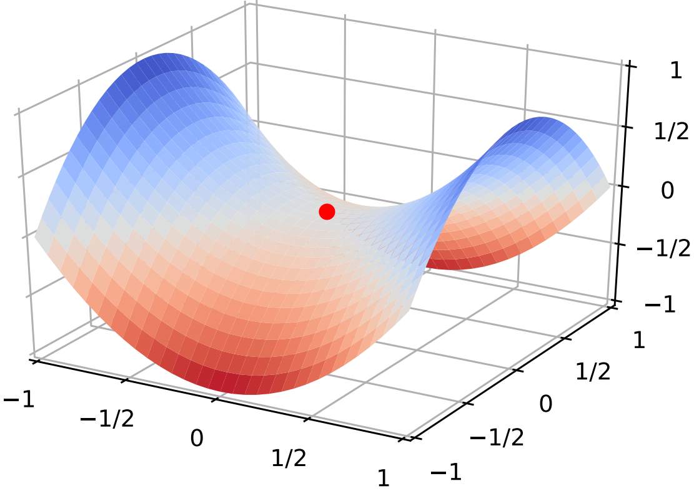
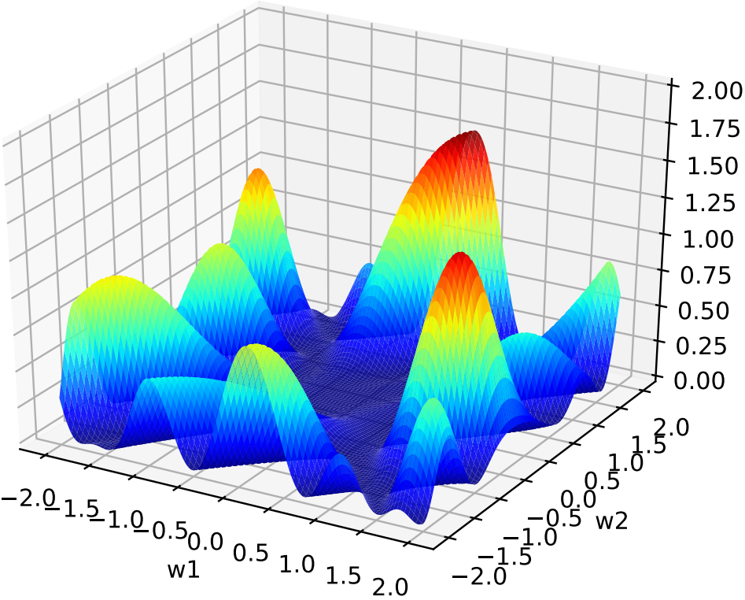
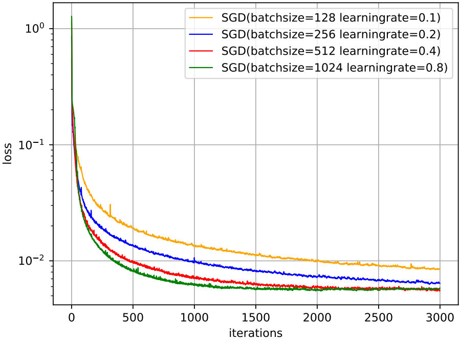
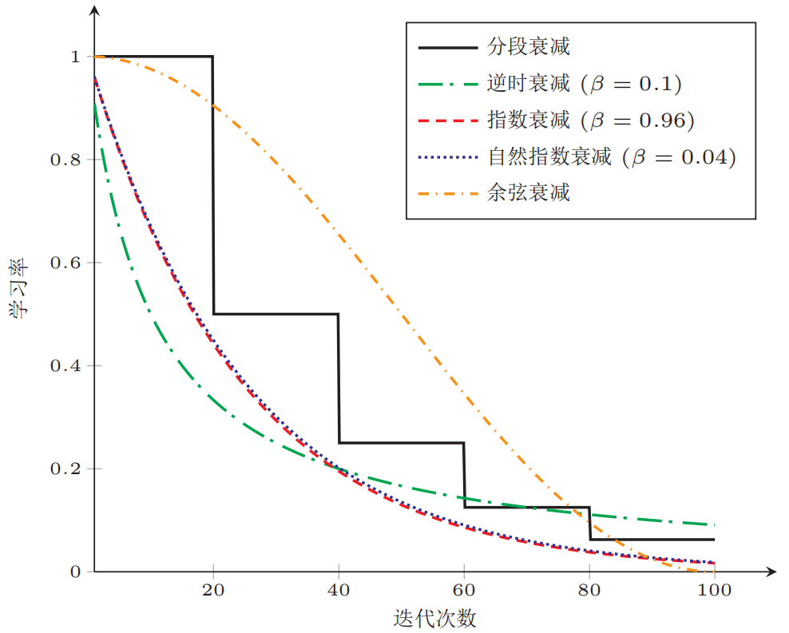
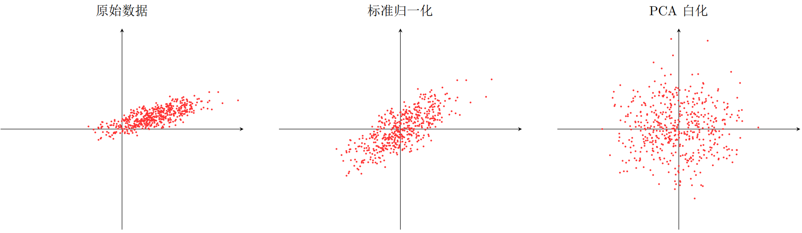

## 神经网络的优化

### 网络优化的难点

#### 网络结构多样性
神经网络的种类非常多，比如卷积网络、循环网络等，其结构也非常不同。有些比较深，有些比较宽。不同参数在网络中的作用也有很大的差异，比如连接权重和偏置的不同，以及循环网络中循环连接上的权重和其它权重的不同。由于网络结构的多样性，我们很难找到一种通用的优化方法。**不同的优化方法在不同网络结构上的差异也都比较大**。此外，网络的超参数一般也比较多，这也给优化带来很大的挑战。

#### 高维变量的非凸优化

低维空间的非凸优化问题主要是存在一些局部最优点。基于梯度下降的优化方法会陷入局部最优点，因此低维空间非凸优化的主要难点是如何选择初始化参数和逃离局部最优点。深度神经网络的参数非常多，其参数学习是在非常高维空间中的非凸优化问题，其挑战和在低维空间的非凸优化问题有所不同。在高维空间中，非凸优化的难点并不在于如何逃离局部最优点，而是如何逃离**鞍点(saddle point)**。鞍点的叫法是因为其形状像马鞍。鞍点的梯度是0，但是在一些维度上是最高点，在另一些维度上是最低点。



在高维空间中，局部最优点要求**在每一维度上都是最低点**，**这种概率非常低**。假设网络有10,000维参数，一个点在某一维上是局部最低点的概率为$p$，那么在整个参数空间中，局部最优点的概率为$p^{10,000}$，这种可能性非常小。也就是说**高维空间中，大部分梯度为0的点都是鞍点**。基于梯度下降的优化方法会**在鞍点附近接近于停滞**，同样很难从这些鞍点中逃离。

深度神经网络的参数非常多，并且冗余性很高，这使得每个参数对最终损失的影响都比较小，这导致了损失函数在局部最优点附近是一个平坦的区域，称为**平坦最小值(flat minima)**。



目前，深度神经网络的参数学习主要是通过梯度下降法来寻找一组可以最小化结构风险的参数。在具体实现中，梯度下降法可以分为**批量梯度下降、随机梯度下降以及小批量梯度下降**三种形式。除了在收敛效果和效率上的差异，这三种方法都存在一些共同的问题，比如**如何改进优化算法、如何初始化参数、如何预处理数据等**。

### 优化算法

#### 小批量梯度下降

在训练深度神经网络时，训练数据的规模通常都比较大。如果在梯度下降时，每次迭代都要计算整个训练数据上的梯度，这就需要比较多的计算资源。另外大规模训练集中的数据通常会非常冗余，也没有必要在整个训练集上计算梯度。因此，在训练深度神经网络时，经常使用**小批量梯度下降法(mini-batch gradient descent)**，即**仅在训练集中选择一个较小的子集来更新梯度**。

影响小批量梯度下降法的因素有：(1) 批量大小$K$；(2) 学习率$\alpha$；(3) 梯度估计。为了更有效地训练深度神经网络，在标准的小批量梯度下降法的基础上，也经常使用一些改进方法以加快优化速度，比如如何**选择批量大小**、如何**调整学习率**以及如何**修正梯度估计**。

#### 批量大小选择

在小批量梯度下降法中，**批量大小(batch size)**对网络优化的影响非常大。一般而言，**批量大小不影响随机梯度的期望，但是会影响随机梯度的方差**。批量大小越大，随机梯度的**方差越小**，引入的噪声也越小，训练也越稳定，因此可以设置**较大的学习率**。批量大小较小时，需要设置较小的学习率，否则模型会**不收敛**。学习率通常要随着批量大小的增大而相应地增大。一个简单有效的方法是**线性缩放规则**：当批量大小增加$m$倍时，学习率也增加$m$倍。线性缩放规则往往在批量大小较小时适用，当批量大小非常大时，线性缩放会使训练不稳定。

下图给出了从epoch(回合)和iteration(更新次数)的角度，批量大小对损失下降的影响：




从epoch图可以看出，可以看出，**批量样本数越小，适当小的批量大小会导致更快的收敛**；从iteration图可以看出，**批量大小越大，下降效果越明显，并且下降曲线越平滑**。

#### 学习率调整

学习率是神经网络优化时的重要超参数。在梯度下降法中，学习率的取值非常关键，如果**过大就不会收敛**，如果**过小则收敛速度太慢**。常用的学习率调整方法包括**学习率衰减、学习率预热、周期性学习率调整**以及一些**自适应调整学习率的方法**，如**AdaGrad、RMSprop、AdaDelta**等。自适应学习率方法可针对每个参数设置不同的学习率。

##### 学习率衰减

从经验上看，学习率在一开始要保持大些来保证收敛速度，在收敛到最优点附近时要小些以避免来回震荡。简单的学习率调整可通过**学习率衰减(learning rate decay)**来实现，也称为**学习率退火(learning rate annealing)**。不失一般性，衰减方式设置为**按迭代次数进行衰减**。假设初始化学习率为$\alpha_0$，在第$t$次迭代时的学习率$\alpha_t$，衰减率一般用$\beta$表示。常见的衰减方法有以下几种：

(1) **分段常数衰减(piecewise constant decay)**：每经过$T_1,T_2,\cdots$次迭代将学习率衰减为原来的$\beta_1,\beta_2,\cdots$倍，其中$T_i和$$\beta_i$为根据经验设置的超参数。分段常数衰减也称为**步衰减(step decay)**。

(2) **逆时衰减(inverse time decay)**：
$$
\alpha_{t}=\alpha_{0} \frac{1}{1+\beta \times t}
$$
(3) **指数衰减(exponential decay)**：
$$
\alpha_{t}=\alpha_{0} \beta^{t}
$$
(4) **自然指数衰减(natural exponential decay)**：
$$
\alpha_{t}=\alpha_{0} \exp (-\beta \times t)
$$
(5) **余弦衰减(cosine decay)**：
$$
\alpha_{t}=\frac{1}{2} \alpha_{0}\left(1+\cos \left(\frac{t \pi}{T}\right)\right)
$$
下图给出了不同衰减方法的示例(假设**初始学习率为1**)。



##### 学习率预热

在小批量梯度下降法中，当批量大小的设置比较大时，通常需要比较大的学习率。但在刚开始训练时，由于参数是随机初始化的，梯度往往也比较大，再加上比较大的初始学习率，会使得训练不稳定。为了提高训练稳定性，我们可以**在最初几轮迭代时，采用比较小的学习率**，等梯度下降到一定程度后再恢复到初始的学习率，这种方法称为**学习率预热(learning rate warmup)**。

一个常用的学习率预热方法是**逐渐预热(gradual warmup)**。假设预热的迭代次数为$T'$，初始学习率为$\alpha_0$，在预热过程中，每次更新的学习率为：
$$
\alpha_{t}^{\prime}=\frac{t}{T^{\prime}} \alpha_{0}, \quad 1 \leq t \leq T^{\prime}
$$
**当预热过程结束，再选择一种学习率衰减方法来逐渐降低学习率**。

##### 学习率周期性调整

为了使得梯度下降法能够逃离局部最小值或鞍点，一种经验性的方式是在训练过程中**周期性地增大学习率**。虽然增大学习率可能短期内有损网络的收敛稳定性，但从长期来看**有助于找到更好的局部最优解**。一般而言，当一个模型收敛一个平坦的局部最小值时，其鲁棒性会更好，即微小的参数变动不会剧烈影响模型能力；而当模型收敛到一个尖锐的局部最小值时，其鲁棒性也会比较差。具备良好泛化能力的模型通常应该是鲁棒的，因此**理想的局部最小值应该是平坦的**。周期性学习率调整可以使得梯度下降法在优化过程中**跳出尖锐的局部极小值**，虽然会短期内会损害优化过程，但最终会收敛到更加理想的局部极小值。

常用的两种周期性学习率调整方法(三角循环学习率、带热重启的余弦衰减)如下所示：


#### 梯度估计修正

除了调整学习率之外，还可以进行**梯度估计(gradient estimation)的修正**。在随机(小批量)梯度下降法中，如果每次选取样本数量比较小，损失会**呈现震荡的方式下降**。也就是说，随机梯度下降方法中每次迭代的梯度估计和整个训练集上的最优梯度并不一致，具有一定的随机性。一种有效地缓解梯度估计随机性的方式是**通过使用最近一段时间内的平均梯度来代替当前时刻的随机梯度作为参数更新的方向，从而提高优化速度**。

(1) **动量法(momentum method)**：用之前积累动量替代真正的梯度。每次迭代的梯度可以看作是加速度。在第$t$次迭代时，计算负梯度的“加权移动平均”作为参数的更新方向，
$$
\Delta \theta_{t}=\rho \Delta \theta_{t-1}-\alpha \boldsymbol{g}_{t}=-\alpha \sum_{\tau=1}^{t} \rho^{t-\tau} \boldsymbol{g}_{\tau}
$$


其中$\rho$为动量因子，通常设为0.9，$\alpha$为学习率。

(2) **Nesterov加速梯度(nesterov accelerated gradient, NAG)**：一种对动量法的改进。

在动量法中，实际的参数更新方向$\Delta \theta_t$为**上一步的参数更新方向**$\Delta \theta_{t-1}$和**当前梯度的反方向**$-\boldsymbol g_t$的**叠加**。这样，$\Delta \theta_t$可以被拆分为两步进行，先根据更新一次$\Delta \theta_{t-1}$得到参数$\hat \theta$，再用$-\boldsymbol g_t$进行更新。
$$
\begin{aligned}
\hat{\theta} &=\theta_{t-1}+\rho \Delta \theta_{t-1} \\
\theta_{t} &=\hat{\theta}-\alpha \boldsymbol{g}_{t}
\end{aligned}
$$
其中梯度$-\boldsymbol g_t$为点$\Delta \theta_{t-1}$上的梯度，因此在第二步更新中有些不太合理。更合理的更新方向应该为$\hat \theta$上的梯度。这样，合并后的更新方向为：
$$
\Delta \theta_{t}=\rho \Delta \theta_{t-1}-\alpha \mathfrak{g}_{t}(\theta_{t-1}+\rho \Delta \theta_{t-1})
$$
其中$\mathfrak{g}_{t}(\theta_{t-1}+\rho \Delta \theta_{t-1})$表示损失函数在点$\hat{\theta}=\theta_{t-1}+\rho \Delta \theta_{t-1}$上的偏导数。

下图给出了动量法和Nesterov加速梯度在参数更新时的比较：


(3) **Adam(adaptive moment estimation)**可以看作动量法和RMSprop算法的结合，不但使用动量作为参数更新方向，而且可以自适应调整学习率。

(4) **梯度截断(gradient clipping)**：在深度神经网络或循环神经网络中，除了梯度消失之外，梯度爆炸也是影响学习效率的主要因素。在基于梯度下降的优化过程中，如果梯度突然增大，用大的梯度更新参数反而会导致其远离最优点。为了避免这种情况，当梯度的模大于一定阈值时，就对梯度进行截断，称为梯度截断。

### 参数初始化

神经网络训练过程中的参数学习是基于梯度下降法进行优化的。梯度下降法需要在开始训练时给每一个参数赋一个初始值。这个初始值的选取十分关键。在**感知器和logistic回归**的训练中，我们一般将参数**全部初始化为0**。但是这**在神经网络的训练中会存在一些问题**。因为如果参数都为0，在第一遍前向计算时，**所有的隐层神经元的激活值都相同。这样会导致深层神经元没有区分性。这种现象也称为对称权重现象**。

**随机初始化参数的一个问题是如何选取随机初始化的区间**。如果参数取的太小，一是会导致神经元的输入过小，经过多层之后信号就慢慢消失了；二是还会使得sigmoid型激活函数丢失非线性的能力，因为sigmoid函数在0附近基本上是近似线性的。这样多层神经网络的优势也就不存在了。如果参数取的太大，会导致输入状态过大。对于sigmoid型激活函数来说，激活值变得饱和，从而导致梯度接近于0。

因此，要高效地训练神经网络，给参数选取一个合适的随机初始化区间是非常重要的。一般而言，参数初始化的区间应该**根据神经元的性质进行差异化的设置**。如果一个神经元的输入连接很多，它的每个输入连接上的权重就应该小一些，以避免神经元的输出过大(当激活函数为ReLU时)或过饱和(当激活函数为sigmoid函数时)。

经常使用的两种初始化方法有**高斯分布初始化**和**均匀分布初始化**。初始化一个深层网络时，一个比较好的初始化策略是**保持每个神经元输入和输出的方差一致**。

#### Xavier初始化(Glorot初始化)

当网络使用**logistic激活函数**时，**Xavier初始化**可以根据每层的**神经元数量**来自动**计算初始化参数的方差**。假设第$l$层神经元的激活函数为logistic​函数，对于第$l-1$到$l$层的权重参数区间$r$可以设置为：
$$
r=\sqrt{\frac{6}{n^{l-1}+n^{l}}}
$$
其中$n^l$和$n^{l-1}$分别代表第$l$层和第$l-1$层神经元的数量。

对于tanh函数，$r$可以设置为：
$$
r=4 \sqrt{\frac{6}{n^{l-1}+n^{l}}}
$$
假设第$l$层的一个隐藏层神经元$z^l$，其接收前一层的$n^{l-1}$个神经元的输出$a_{i}^{(l-1)}, 1 \leqslant i \leqslant n^{(l-1)}$：
$$
z^{l}=\sum_{i=1}^{n^{(l-1)}} w_{i}^{l} a_{i}^{(l-1)}
$$
为了避免初始化参数使得激活值变得饱和，我们需要尽量使得$z^l$处于激活函数的线性区间，也就是其绝对值比较小的值。这时该神经元的激活值为$a^l=f(z^l) \approx z^l$。

假设$w_i^l$和$a_i^{l-1}$的均值都为0，并且互相独立，则$a^l$的均值为：
$$
\mathbb{E}[a^{l}]=\mathbb{E}\left[\sum_{i=1}^{n^{(l-1)}} w_{i}^{l} a_{i}^{(l-1)}\right]=\sum_{i=1}^{n^{(l-1)}} \mathbb{E}\left[\boldsymbol{w}_{i}\right] \mathbb{E}[a_{i}^{(l-1)}]=0
$$
$a^l$的方差为：
$$
\begin{aligned}
\operatorname{var}[a^{l}] &=\operatorname{var}[\sum_{i=1}^{n^{(l-1)}} w_{i}^{l} a_{i}^{(l-1)}] \\
&=\sum_{i=1}^{n^{(l-1)}} \operatorname{var}[w_{i}^{l}] \operatorname{var}[a_{i}^{(l-1)}] \\
&=n^{(l-1)} \operatorname{var}[w_{i}^{l}] \operatorname{var}[a_{i}^{(l-1)}]
\end{aligned}
$$
也就是说，输入信号的方差在经过该神经元后被放大或缩小了$n^{(l-1)} \operatorname{var}[w_{i}^{l}]$倍。为了使得在经过多层网络后，信号不被过分放大或过分减弱，我们尽可能保持每个神经元的输入和输出的方差一致。这样设$n^{(l-1)} \operatorname{var}[w_{i}^{l}]$为1比较合理，即：
$$
\operatorname{var}[w_{i}^{l}]=\frac{1}{n^{(l-1)}}
$$
同理，为了使得在**反向传播**中，误差信号也不被放大或缩小，需要将$w_i^l$的方差保持为：
$$
\operatorname{var}\left[w_{i}^{l}\right]=\frac{1}{n^{(l)}}
$$
作为折中，同时考虑信号在前向和反向传播中都不被放大或缩小，可以设置
$$
\operatorname{var}[w_{i}^{l}]=\frac{2}{n^{(l-1)}+n^{(l)}}
$$
在计算出**参数的理想方差**后，可以通过高斯分布或均匀分布来随机初始化参数。若采用高斯分布来随机初始化权重，连接权重$w_i^l$可以按照
$$
\mathcal{N}\left(0, \sqrt{\frac{2}{n^{(l-1)}}+n^{(l)}}\right)
$$
的高斯分布进行初始化；假设随机变量$x$在区间$[a, b]$内均匀分布，则其方差为：
$$
\operatorname{var}[x]=\frac{(b-a)^{2}}{12}
$$
因此，若采用区间为$[r,r]$的均分分布来初始化$w_i^l$，并满足$\operatorname{var}[w_{i}^{l}]=\frac{2}{n^{(l-1)}+n^{(l)}}$，则$r$的取值为
$$
r=\sqrt{\frac{6}{n^{l-1}+n^{1}}}
$$

#### He初始化

当第$l$层神经元使用ReLU激活函数时，通常**有一半的神经元输出为0**，因此**其分布的方差也近似为使用logistic作为激活函数时的一半**。这样，**只考虑前向传播**时，参数的理想方差为：
$$
\operatorname{var}[w_{i}^{l}]=\frac{2}{n^{(l-1)}}
$$
其中$n^{(l-1)}$是第$l-1$层神经元个个数。因此当使用ReLU激活函数时，若采用高斯分布来初始化参数$w_i^l$，其方差为$\frac{2}{n^{(l-1)}}$；若采用区间为$[r, r]$的均分分布来初始化参数$w_i^l$，则$r=\sqrt{\frac{6}{n^{l-1}}}$。这种初始化方法称为$He$初始化。

### 数据预处理

一般而言，样本的原始特征中的每一维特征由于**来源以及度量单位不同**，其**特征取值的分布范围往往差异很大**。当我们计算不同样本之间的欧氏距离时，**取值范围大的特征会起到主导作用**。这样，对于基于相似度比较的机器学习方法(比如最近邻分类器)，必须先对样本进行预处理，将各个维度的特征归一化到同一个取值区间，并且消除不同特征之间的相关性，才能获得比较理想的结果。虽然**神经网络可以通过参数的调整来适应不同特征的取值范围**，但是会导致**训练效率比较低**，因为参数调整的过程需要花较长时间。

不同输入特征的取值范围差异比较大时，梯度下降法的效率也会受到影响。下图给出了**数据归一化对梯度的影响**。其中，下图(a)为未归一化数据的等高线图。取值范围不同会造成在大多数位置上的梯度方向并不是最优的搜索方向。当使用梯度下降寻求最优解时，需要很多次迭代才能收敛。


在神经网络中常用的归一化方式有以下几种：

(1) **缩放归一化**：缩放归一化是一种非常简单的归一化方法，通过缩放将每一个特征的取值范围归一到$[0,1]$或$[-1,1]$之间。假设有$N$个样本，对于每一维特征$x^{(n)}$，
$$
\hat{x}^{(n)}=\frac{x^{(n)}-\min _{n}(x^{(n)})}{\max _{n}(x^{(n)})-\min _{n}(x^{(n)})}
$$
其中$\min(x)$和$\max(x)$分别是**特征**$x$在所有样本上的最小值和最大值。

(2) **标准归一化**：标准归一化也叫**z-score归一化**，来源于统计上的标准分数。**将每一个维特征都调整为均值为0，方差为1**。对于每一维特征$x^{(n)}$，先计算它的均值和方差：
$$
\begin{aligned}
\mu &=\frac{1}{N} \sum_{n=1}^{N} x^{(n)} \\
\sigma^{2} &=\frac{1}{N} \sum_{n=1}^{N}(x^{(n)}-\mu)^{2}
\end{aligned}
$$
然后，将特征$x^{(n)}$**减去均值，并除以标准差**，得到新的特征值$\hat x^{(n)}$：
$$
\hat{x}^{(n)}=\frac{x^{(n)}-\mu}{\sigma}
$$
这里$\sigma$不能为0。**如果方差为0，说明这一维特征没有任务区分性，可以直接删掉**。

(3) **白化**：一种重要的预处理方法，用来**降低输入数据特征之间的冗余性**。输入数据经过白化处理后，**特征之间相关性较低，并且所有特征具有相同的方差**。白化的一个主要实现方式是使用**主成分分析(principal component analysis, PCA)**方法去除掉各个成分之间的相关性。下图给出了标准归一化和PCA白化的比较。



### 逐层归一化

在深度神经网络中，**中间某一层的输入是其之前的神经层的输出**。因此，**其之前的神经层的参数变化会导致其输入的分布发生较大的差异**。在使用随机梯度下降来训练网络时，每次参数更新都会导致网络中间每一层的输入的分布发生改变。越深的层，其输入的分布会改变得越明显。就像一栋高楼，低楼层发生一个较小的偏移，都会导致高楼层较大的偏移。

从机器学习角度来看，如果某个神经层的输入分布发生了改变，那么其参数需要重新学习，这种现象叫做**内部协变量偏移(internal covariate shift)**。

为了解决内部协变量偏移问题，就要使得每一个神经层的输入的分布在训练过程中保持一致。最**简单直接的方法就是对每一个神经层都进行归一化操作，使其分布保持稳定**。下面介绍几种比较常用的逐层归一化方法：批量归一化、层归一化和其它一些方法。

#### 批量归一化

**批量归一化(batch normalization, BN)**方法是一种有效的逐层归一化方法，可以**对神经网络中任意的中间层进行归一化操作**。对于一个深度神经网络，令第$l$层的净输入为$\boldsymbol z^{(l)}$，神经元的输出为$\boldsymbol a^{(l)}$，即：
$$
\boldsymbol{a}^{(l)}=f(\boldsymbol{z}^{(l)})=f(W \boldsymbol{a}^{(l-1)}+\boldsymbol{b})
$$
为了减少内部协变量偏移问题，就要使得净输入$\boldsymbol z^{(l)}$的分布一致，比如都归一化到标准正态分布。虽然归一化操作可以应用在输入$\boldsymbol a^{(l-1)}$上，但其**分布性质**不如$\boldsymbol z^{(l)}$稳定。因此，**在实践中归一化操作一般应用在仿射变换之后，激活函数之前**。

对$\boldsymbol z^{(l)}$进行归一化，相当于**每一层都进行一次数据预处理**，从而加速收敛速度。但是逐层归一化需要在中间层进行操作，要求效率比较高，因此复杂度比较高的**白化方法**就不太合适。为了提高归一化效率，一般使用**标准归一化**，将净输入$\boldsymbol z^{(l)}$的**每一维都归一到标准正态分布**。
$$
\hat{\boldsymbol{z}}^{(l)}=\frac{\boldsymbol{z}^{(l)}-\mathbb{E}[\boldsymbol{z}^{(l)}]}{\sqrt{\operatorname{var}(\boldsymbol{z}^{(l)})+\epsilon}}
$$
其中$\mathbb{E}[\boldsymbol{z}^{(l)}]$和$\operatorname{var}(\boldsymbol{z}^{(l)})$是指当前参数下，$\boldsymbol{z}^{(l)}$的**每一维在整个训练集上的期望和方差**。因为目前主要的训练方法是基于小批量的随机梯度下降法，所以准确地计算的期望$\boldsymbol{z}^{(l)}$和方差是不可行的。因此，$\boldsymbol{z}^{(l)}$的**期望和方差通常用当前小批量样本集的均值和方差近似估计**。

给定一个包含$K$个样本的小批量样本集合，第$l$层神经元的净输入$\boldsymbol{z}^{(1, l)},\cdots,\boldsymbol{z}^{(K, l)}$的均值和方差为：
$$
\begin{aligned}
\boldsymbol{\mu}_{\mathcal{B}} &=\frac{1}{K} \sum_{k=1}^{K} \boldsymbol{z}^{(k, l)} \\
\boldsymbol{\sigma}_{\mathcal{B}}^{2} &=\frac{1}{K} \sum_{k=1}^{K}(\boldsymbol{z}^{(k, l)}-\boldsymbol{\mu}_{\mathcal{B}}) \odot(\boldsymbol{z}^{(k, l)}-\boldsymbol{\mu}_{\mathcal{B}})
\end{aligned}
$$
其中$\boldsymbol{\mu}_{\mathcal{B}}$和$\boldsymbol{\sigma}_{\mathcal{B}}^{2}$均为向量，其维度与数据的特征数相等。

对净输入$\boldsymbol{z}^{(l)}$的标准归一化会使得其取值集中到0附近，如果使用 sigmoid型激活函数时，这个取值区间刚好是接近线性变换的区间，**减弱了神经网络的非线性性质**。因此，为了使得归一化不对网络的表示能力造成负面影响，可以通过一个**附加的缩放和平移变换改变取值区间**：
$$
\begin{aligned}
\hat{\boldsymbol{z}}^{(l)} &=\frac{\boldsymbol{z}^{(l)}-\boldsymbol{\mu}_{\mathcal{B}}}{\sqrt{\sigma_{\mathcal{B}}^{2}+\epsilon}} \odot \gamma+\boldsymbol{\beta} \\
& \triangleq \mathrm{B} \mathrm{N}_{\boldsymbol{\gamma}, \boldsymbol{\beta}}(\boldsymbol{z}^{(l)})
\end{aligned}
$$
其中$\boldsymbol \gamma$和$\boldsymbol \beta$分别代表缩放和平移的参数向量。从最保守的角度考虑，可通过标准归一化的逆变换来使得归一化后的变量可以**被还原为原来的值**。当$\gamma=\sqrt{\sigma_{\mathcal{B}}^{2}}$且$\beta=\mu_{\mathcal{B}}$时，$\hat{\boldsymbol{z}}^{(l)}=\boldsymbol{z}^{(l)}$。批量归一化操作可以看作是一个特殊的神经层，加在每一层非线性激活函数之前，即：
$$
\boldsymbol{a}^{(l)}=f(\mathrm{BN}_{\gamma, \boldsymbol{\beta}}(\boldsymbol{z}^{(l)}))=f(\mathrm{BN}_{\gamma, \boldsymbol{\beta}}(W \boldsymbol{a}^{(l-1)}))
$$

#### 层归一化

批量归一化是对一个中间层的**单个神经元(特征)**进行归一化操作，因此要求小批量样本的数量不能太小，否则难以计算单个神经元的统计信息。此外，如果一个神经元的净输入的分布在神经网络中是动态变化的，比如循环神经网络，那么就无法应用批量归一化操作。 

**层归一化(layer normalization)**是和批量归一化非常类似的方法。和批量归一化不同的是，层归一化是对一个中间层的所有神经元进行归一化。

对于一个深度神经网络，令第$l$层神经元的净输入为$\boldsymbol z^{(l)}$，其均值和方差为：
$$
\begin{aligned}
\mu^{(l)} &=\frac{1}{n^{l}} \sum_{i=1}^{n^{l}} z_{i}^{(l)} \\
\sigma^{(l)^{2}} &=\frac{1}{n^{l}} \sum_{i=1}^{n^{l}}(z_{i}^{(l)}-\mu^{(l)})^{2}
\end{aligned}
$$
其中$n^l$为第$l$层神经元的数量。层归一化定义为：
$$
\begin{aligned}
\hat{\boldsymbol{z}}^{(l)} &=\frac{\boldsymbol{z}^{(l)}-\mu^{(l)}}{\sqrt{\sigma^{(l)^{2}}+\epsilon}} \odot \boldsymbol \gamma+\boldsymbol{\beta} \\
& \triangleq \mathrm{LN}_{\boldsymbol{\gamma}, \boldsymbol{\beta}}(\boldsymbol{z}^{(l)})
\end{aligned}
$$
其中$\boldsymbol \gamma$和$\boldsymbol \beta$分别代表缩放和平移的参数向量，和$\boldsymbol z^{(l)}$维数相同。

层归一化可以应用在循环神经网络中，对循环神经层进行归一化操作。假设在时刻$t$，循环神经网络的隐藏层为$\boldsymbol h_t$，其层归一化的更新为：
$$
\begin{aligned}
z_{t}=U \boldsymbol{h}_{t-1}+W \boldsymbol{x}_{t} \\
\boldsymbol{h}_{t}=f(\mathrm{LN}_{\gamma, \boldsymbol{\beta}}(\boldsymbol{z}_{t}))
\end{aligned}
$$
其中$\boldsymbol x_t$为第$t$时刻的输入，$U,W$为网络参数。在标准循环神经网络中，循环神经层的净输入一般会随着时间慢慢变大或变小，从而导致梯度爆炸或消失。而**层归一化的循环神经网络可以有效地缓解这种状况**。

层归一化和批量归一化整体上是十分类似的，差别在于归一化的方法不同。对于 $K$个样本的一个小批量集合$Z^{(l)}=[\boldsymbol{z}^{(1, l)} ; \cdots ; \boldsymbol{z}^{(K, l)}]$，层归一化是对矩阵$Z^{(l)}$的**每一列**进行归一化，而批量归一化是对**每一行**进行归一化。一般而言，**批量归一化是一种更好的选择。当小批量样本数量比较小时，可以选择层归一化**。

除了上述两种归一化方法外，还有权重归一化、局部相应归一化等多种归一化方式。

### 超参数优化

在神经网络中，除了可学习参数之外，还存在很多**超参数**。这些超参数对网络性能的影响也很大。不同的机器学习任务往往需要不同的超参数。常见的超参数有以下三类：(1) **网络结构**，包括神经元间的连接关系、层数、每层的神经元数量、激活函数的类型等。(2) **优化参数**，包括优化方法、学习率、小批量的样本数量等。(3) **正则化系数**。

**超参数优化(hyperparameter optimization)**主要存在两方面的困难。(1) 超参数优化是一个**组合优化问题**，无法像一般参数那样通过梯度下降方法来优化，也没有一种通用有效的优化方法。(2) 评估一组超参数配置的**时间代价非常高**，从而导致一些优化方法在超参数优化中难以应用。

#### 网格搜索

网格搜索(grid search)是一种通过尝试所有超参数的组合来寻址合适一组超参数配置的方法。假设总共有$K$个超参数，第$k$个超参数的可以取$m_k$个值。那么总共的配置组合数量为$m_1 \times m_2 \times \cdots \times m_K$。如果超参数是连续的，可以将超参数**离散化**，选择几个“经验”值。比如学习率$\alpha$，我们可以设置$α \in \{0.01, 0.1, 0.5, 1.0\}$。

一般而言，对于连续的超参数，我们**不能按等间隔的方式进行离散化**，需要根据超参数自身的特点进行离散化。

网格搜索根据这些超参数的不同组合分别训练一个模型，然后测试这些模型在开发集上的性能，**选取一组性能最好的配置**。

#### 随机搜索

如果不同超参数对模型性能的影响有很大差异。**有些超参数(比如正则化系数)对模型性能的影响有限**，而**另一些超参数(比如学习率)对模型性能影响比较大**。在这种情况下，采用网格搜索会在不重要的超参数上进行不必要的尝试。一种在实践中比较有效的改进方法是**对超参数进行随机组合**，然后选取一个性能最好的配置，这就是**随机搜索(random search)**。随机搜索在实践中更容易实现，一般会比网格搜索更加有效。

网格搜索和随机搜索都没有利用不同超参数组合之间的相关性，即如果模型的超参数组合比较类似，其模型性能也是比较接近的。因此这两种搜索方式一般都比较低效。下面我们介绍两种**自适应的超参数优化方法**：贝叶斯优化和动态资源分配。

#### 贝叶斯优化

**贝叶斯优化(Bayesian optimization)**是一种自适应的超参数优化方法，根据当前已经试验的超参数组合来预测下一个可能带来最大收益的组合。一种比较常用的贝叶斯优化方法为**时序模型优化(sequential model-based optimization, SMBO)**。

#### 动态资源分配

在超参数优化中，每组超参数配置的评估代价比较高。如果我们可以在较早的阶段就估计出一组配置的效果会比较差，那么我们就可以中止这组配置的评估，将更多的资源留给其它配置。这个问题可以归结为**多臂赌博机问题**的一个泛化问题：**最优臂问题(best-arm problem)**，即在给定有限的机会次数下，如何玩这些赌博机并找到收益最大的臂。

由于目前神经网络的优化方法一般都采取随机梯度下降，因此我们可以通过一组超参数的学习曲线来预估这组超参数配置是否有希望得到比较好的结果。如果一组超参数配置的学习曲线不收敛或者收敛比较差，我们可以应用**早期停止(early-stopping)**策略来中止当前的训练。动态资源分配的一种有效方法是**逐次减半(successive halving)方法**，将超参数优化看作是一种非随机的最优臂问题。

#### 神经架构搜索

上面介绍的超参数优化方法都是在固定(或变化比较小)的超参数空间中进行最优配置搜索，而最重要的神经网络架构一般还是需要由有经验的专家来进行设计。从某种角度来讲，深度学习使得机器学习中的“特征工程”问题转变为“网络架构工程”问题。

**神经架构搜索(neural architecture search, NAS)**是一个新的比较有前景的研究方向，通过神经网络来自动实现网络架构的设计。一个神经网络的架构可以用一个变长的字符串来描述。利用元学习的思想，神经架构搜索利用一个控制器来生成另一个子网络的架构描述，控制器可以由一个循环神经网络来实现。控制器的训练可以通过强化学习来完成，其奖励信号为生成的子网络在开发集上的准确率。

### 网络正则化

机器学习模型的关键是**泛化问题**，即**在样本真实分布上的期望风险最小化**。而训练数据集上的经验风险最小化和期望风险并不一致。由于神经网络的拟合能力非常强，其在训练数据上的错误率往往都可以降到非常低，甚至可以到0，从而导致过拟合。因此，如何提高神经网络的泛化能力反而成为影响模型能力的最关键因素。

**正则化(regularization)**是一类通过限制模型复杂度，从而避免过拟合，提高泛化能力的方法，比如引入约束、增加先验、提前停止等。

在传统的机器学习中，提高泛化能力的方法主要是限制模型复杂度，比如采用$\ell_{1}$和$\ell_{2}$正则化等方式。而在训练深度神经网络时，特别是在**过度参数化(over-parameterization)**时，$\ell_{1}$和$\ell_{2}$正则化的效果往往不如浅层机器学习模型中显著，**过度参数化是指模型参数的数量远远大于训练数据的数量**。因此训练深度学习模型时，往往还会使用其它的正则化方法，比如数据增强、提前停止、丢弃法、集成法等。

#### $\ell_{1}$和$\ell_{2}$正则化

$\ell_{1}$和$\ell_{2}$正则化是机器学习中最常用的正则化方法，通过约束参数的$\ell_{1}$和$\ell_{2}$**范数**来减小模型在训练数据集上的过拟合现象。 通过引入$\ell_{1}$和$\ell_{2}$正则化，优化问题可以写为：
$$
\theta^{*}=\underset{\theta}{\arg \min } \frac{1}{N} \sum_{n=1}^{N} \mathcal{L}(y^{(n)}, f(\boldsymbol{x}^{(n)} ; \theta))+\lambda \ell_{p}(\theta)
$$
其中$p$通常取值1或2，代表$\ell_{1}$范式和$\ell_{2}$范式。

带正则化的优化问题等价于下面带约束条件的优化问题：
$$
\theta^{*}=\underset{\theta}{\arg \min } \frac{1}{N} \sum_{n=1}^{N} \mathcal{L}(y^{(n)}, f(\boldsymbol{x}^{(n)} ; \theta)) \\
\text{subject to } \ell_{p}(\theta) \leq 1
$$

一种折中的正则化方法是**弹性网络正则化(elastic net regularization)**： 
$$
\theta^{*}=\underset{\theta}{\arg \min } \frac{1}{N} \sum_{n=1}^{N} \mathcal{L}(y^{(n)}, f(\boldsymbol{x}^{(n)} ; \theta))+\lambda_{1} \ell_{1}(\theta)+\lambda_{2} \ell_{2}(\theta)
$$
其中$\lambda_1$和$\lambda_2$分别为两个正则化系数。

#### 权重衰减

**权重衰减(weight decay)**也是一种有效的正则化方法，**在每次参数更新时，引入一个衰减系数**：
$$
\theta_{t} \leftarrow(1-w) \theta_{t-1}-\alpha \mathbf{g}_{t}
$$
其中$\mathbf{g}_{t}$为第$t$更新的梯度，$\alpha$为学习率，$w$为**权重衰减系数**，一般取值比较小，比如0*.*0005。在标准的随机梯度下降中，权重衰减正则化和正则化的$\ell_2$效果相同。因此，权重衰减在一些深度学习框架中通过$\ell_2$正则化来实现。但是，在**较为复杂的优化方法(比如 Adam)**中，权重衰减和$\ell_2$正则化并不等价。

#### 提前停止

**提前停止(early stop)**对于深度神经网络来说是一种简单有效的正则化方法。由于深度神经网络的拟合能力非常强，因此比较容易在训练集上过拟合。在使用梯度下降法进行优化时，我们可以使用一个和训练集独立的样本集合，称为**验证集(validation set)**，并**用验证集上的错误来代替期望错误**。**当验证集上的错误率不再下降，就停止迭代**。 然而在实际操作中，验证集上的错误率变化曲线**并不一定是平衡曲线，很可能是先升高再降低**。因此，提前停止的具体停止标准需要根据实际任务进行优化。

#### 丢弃法

当训练一个深度神经网络时，我们可以随机丢弃一部分神经元并同时丢弃其对应的连接边来避免过拟合，这种方法称为**丢弃法(dropout)**。每次选择丢弃的神经元是随机的。最简单的方法是设置一个固定的概率$p$。对每一个神经元都以概率$p$来判定要不要保留。对于一个神经层$\boldsymbol y = f(W \boldsymbol x+\boldsymbol b)$，我们可以引入一个丢弃函数$d(\cdot)$，使得神经网络的运算过程变为$\boldsymbol y = f(W d(\boldsymbol x)+\boldsymbol b)$。丢弃函数的定义如下：
$$
d(\boldsymbol{x})=\left\{\begin{array}{ll}
\boldsymbol{m} \odot \boldsymbol{x} & \text { when training } \\
p \boldsymbol{x} & \text { when testing }
\end{array}\right.
$$
其中$\boldsymbol{m} \in\{0,1\}^{d}$为**丢弃掩码(dropout mask)**，通过以概率为$p$的**伯努利分布**随机生成。在**训练时**，激活神经元的平均数量为原来的$p$倍。而在测试时，所有的神经元都是可以激活的，这会造成训练和测试时网络的输出不一致。为了缓解这个问题，在**测试时**需要将神经层的输入$\boldsymbol x$乘以$p$，也相当于**把不同的神经网络做了平均**。丢弃率$p$可以通过验证集来选取一个最优的值。一般来讲，对于隐藏层的神经元，其丢弃率$p=0.5$时效果最好，这对大部分的网络和任务都比较有效。当$p=0.5$时，**在训练时有一半的神经元被丢弃，只剩余一半的神经元是可以激活的，随机生成的网络结构最具多样性**。对于**输入层的神经元**，其丢弃率通常设为更接近1的数，使得输入变化不大。对输入层神经元进行丢弃时，**相当于给数据增加噪声，以此来提高网络的鲁棒性**。


Dropout一般是针对神经元进行随机丢弃，但是也可以扩展到**对神经元之间的连接进行随机丢弃**，或**每一层进行随机丢弃**。Dropout有以下两种解释：

(1) **集成学习的解释**：每做一次丢弃，相当于从原始的网络中采样得到一个子网络。如果一个神经网络有$n$个神经元，那么总共可以采样出$2^n$个子网络。每次迭代都相当于训练一个不同的子网络，这些子网络共享原始网络的参数。那么，最终的网络可以近似看作**集成了指数级个不同网络的组合模型**。

(2) **贝叶斯学习的解释**：丢弃法也可以解释为一种贝叶斯学习的近似。 用$y = f(\boldsymbol x; \theta)$来表示要学习的神经网络，贝叶斯学习是假设参数为$\theta$随机向量，并且先验分布为$q(\theta)$，贝叶斯方法的预测为：
$$
\begin{aligned}
\mathbb{E}_{q(\theta)}[y] &=\int_{q} f(\boldsymbol{x} ; \theta) q(\theta) d \theta \\
& \approx \frac{1}{M} \sum_{m=1}^{M} f(\boldsymbol{x}, \theta_{m})
\end{aligned}
$$
其中$f(\boldsymbol{x}, \theta_{m})$为为第$m$次应用丢弃方法后的网络，其参数$\theta_m$为对全部参数$\theta$的一次**采样**。

#### 数据增强

深度神经网络一般都需要大量的训练数据才能获得比较理想的效果。在数据量有限的情况下，可以通过**数据增强(data augmentation**)来增加数据量，提高模型鲁棒性，避免过拟合。**目前，数据增强还主要应用在图像数据上，在文本等其它类型的数据上还没有太好的方法**。

图像数据的增强主要是通过算法对图像进行转变，引入噪声等方法来增加数据的多样性。增强的方法主要有几种：

(1) **旋转(rotation)**：将图像按顺时针或逆时针方向随机旋转一定角度。

(2) **翻转(flip)**：将图像沿水平或垂直方法随机翻转一定角度。

(3) **缩放(zoom in/out)**：将图像放大或缩小一定比例。

(4) **平移(shift)**：将图像沿水平或垂直方法平移一定步长。

(5) **加噪声(noise)**：加入随机噪声。

#### 标签平滑

在数据增强中，我们可以给样本特征加入随机噪声来避免过拟合。同样，我们也可以给样本的标签引入一定的噪声。假设训练数据集中有一些样本的标签是**被错误标注**的，那么最小化这些样本上的损失函数会导致过拟合。一种改善的正则化方法是**标签平滑(label smoothing)**，即在输出标签中添加噪声来避免模型过拟合。

通常样本标签为：
$$
\boldsymbol{y}=[0, \cdots, 0,1,0, \cdots, 0]^{\mathrm{T}}
$$
这种标签可以看作是**硬目标(hard target)**。如果使用**softmax分类器**并使用**交叉熵损失函数**，最小化损失函数会使得正确类和其它类的权重差异很大。根据softmax函数的性质可知，如果要使得某一类的输出概率接近于1，其未归一化的得分需要远大于其它类的得分，可能会导致其权重越来越大，并导致过拟合。此外，如果样本标签是**错误的**，会**导致更严重的过拟合现象**。为改善这种情况，我们可以引入噪声对标签进行平滑，平滑后的标签为：
$$
\tilde{\boldsymbol{y}}=\left[\frac{\epsilon}{K-1}, \cdots, \frac{\epsilon}{K-1}, 1-\epsilon, \frac{\epsilon}{K-1}, \cdots, \frac{\epsilon}{K-1}\right]^{\mathrm{T}}
$$

其中$K$为标签数量，这种标签可以看作是**软目标(soft target)**。标签平滑可以**避免模型的输出过拟合到硬目标上**，并且通常不会损害其分类能力。

### Tensorflow实现神经网络并比较不同的优化器的优化效果

```python
import tensorflow as tf
import matplotlib.pyplot as plt

# 下载MNIST数据并进行归一化
mnist = tf.keras.datasets.mnist
(X_train, y_train), (X_test, y_test) = mnist.load_data()
X_train, X_test = X_train / 255.0, X_test / 255.0
print(X_train.shape, X_test.shape, y_train.shape, y_test.shape)


# 定义网络结构
def define_network():
    neural_network = tf.keras.models.Sequential([
        tf.keras.layers.Input(shape=(28, 28)),
        tf.keras.layers.Flatten(),
        tf.keras.layers.Dense(512, activation='relu'),
        tf.keras.layers.Dense(128, activation='relu'),
        tf.keras.layers.Dense(10, activation='softmax')
    ])
    return neural_network


# 定义多个网络，后期使用不同的优化器进行优化
nn_sgd = define_network()
nn_adagrad = define_network()
nn_adam = define_network()
nn_rms = define_network()
nn_delta = define_network()

# 配置并训练优化方式不同的模型
# SGD
print('SGD')
nn_sgd.compile(optimizer=tf.keras.optimizers.SGD(), loss='sparse_categorical_crossentropy', metrics=['accuracy'])
history_sgd = nn_sgd.fit(X_train, y_train, batch_size=64, epochs=50, validation_data=(X_test, y_test), verbose=2)

# AdaGrad
print('AdaGrad')
nn_adagrad.compile(optimizer=tf.keras.optimizers.Adagrad(), loss='sparse_categorical_crossentropy',
                   metrics=['accuracy'])
history_adagrad = nn_adagrad.fit(X_train, y_train, batch_size=64, epochs=50, validation_data=(X_test, y_test),
                                 verbose=2)

# Adam
print('Adam')
nn_adam.compile(optimizer=tf.keras.optimizers.Adam(), loss='sparse_categorical_crossentropy', metrics=['accuracy'])
history_adam = nn_adam.fit(X_train, y_train, batch_size=64, epochs=50, validation_data=(X_test, y_test), verbose=2)

# RMSprop
print('RMSprop')
nn_rms.compile(optimizer=tf.keras.optimizers.RMSprop(), loss='sparse_categorical_crossentropy', metrics=['accuracy'])
history_rms = nn_rms.fit(X_train, y_train, batch_size=64, epochs=50, validation_data=(X_test, y_test), verbose=2)

# AdaDelta
print('AdaDelta')
nn_delta.compile(optimizer=tf.keras.optimizers.Adadelta(), loss='sparse_categorical_crossentropy', metrics=['accuracy'])
history_delta = nn_delta.fit(X_train, y_train, batch_size=64, epochs=50, validation_data=(X_test, y_test), verbose=2)

# 绘制不同优化器的优化过程
# loss
plt.subplot(1, 2, 1)
plt.plot(history_sgd.history['loss'], label='SGD')
plt.plot(history_adagrad.history['loss'], label='AdaGrad')
plt.plot(history_adam.history['loss'], label='Adam')
plt.plot(history_rms.history['loss'], label='RMSprop')
plt.plot(history_delta.history['loss'], label='AdaDelta')
plt.legend()

# accuracy
plt.subplot(1, 2, 2)
plt.plot(history_sgd.history['accuracy'], label='SGD')
plt.plot(history_adagrad.history['accuracy'], label='Adagrad')
plt.plot(history_adam.history['accuracy'], label='Adam')
plt.plot(history_rms.history['accuracy'], label='RMSprop')
plt.plot(history_delta.history['accuracy'], label='AdaDelta')
plt.legend()

plt.show()
```

### 参考资料

- 邱锡鹏. 神经网络与深度学习. 北京: 机械工业出版社, 2020.
- Srivastava N, Hinton G, Krizhevsky A, et al. Dropout: a simple way to prevent neural networks from overfitting. The journal of machine learning research, 2014, 15(1): 1929-1958.
- 神经网络的优化算法：https://zhuanlan.zhihu.com/p/27449596

