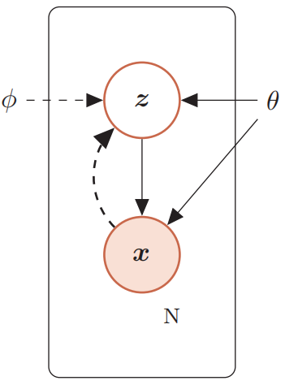
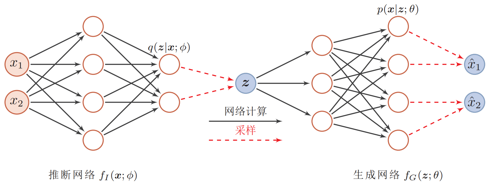
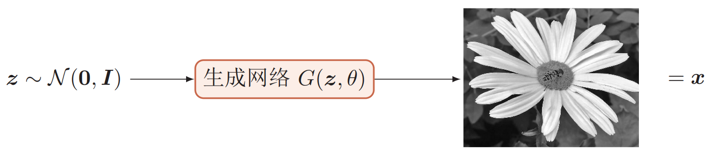
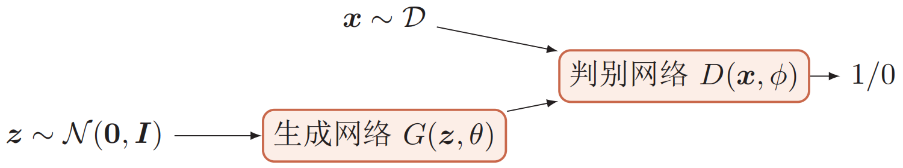
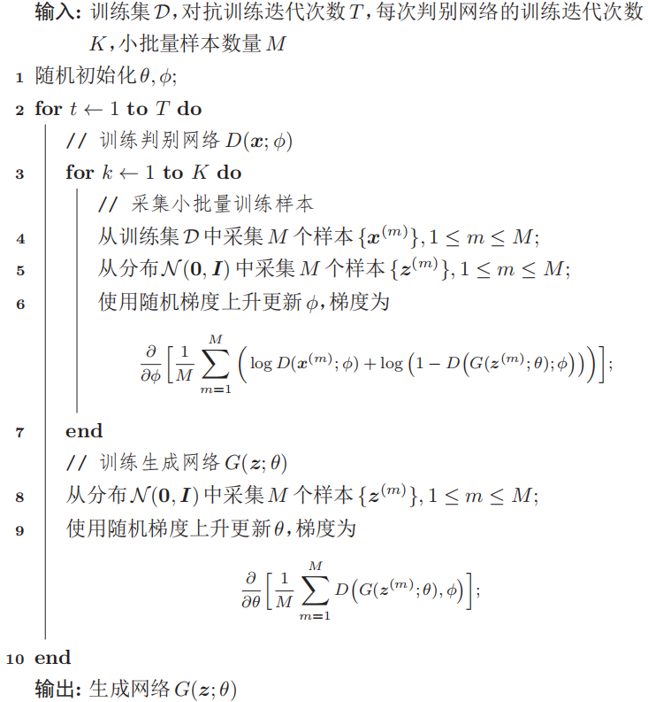

## 深度生成模型

### 概率生成模型

概率生成模型，简称**生成模型(generative model)**，是概率统计和机器学习中的一类重要模型，指一系列用于**随机生成**可观测数据的模型。假设在一个连续的或离散的高维空间$\mathcal X$中，存在一个随机向量$\boldsymbol X$服从一个未知的数据分布$p_r(\boldsymbol x),\boldsymbol x \in \mathcal X$。生成模型是根据一些可观测的样本$\boldsymbol x^{(1)},\boldsymbol x^{(2)},\cdots,\boldsymbol x^{(N)}$来学习一个参数化的模型$p_\theta(\boldsymbol x)$来近似未知分布$p_r(\boldsymbol x)$，并可以用这个模型来生成一些样本，使得**生成样本和真实样本尽可能地相似**。

自然情况下， 直接建模$p_r(\boldsymbol x)$比较困难。**深度生成模型**就是利用**深度神经网络可以近似任意函数**的能力来建模一个复杂的分布$p_r(\boldsymbol x)$。假设一个随机向量$\boldsymbol Z$服从一个简单的分布$p(\boldsymbol z),z \in \mathcal Z$(例如标准正态分布)，我们使用一个深度神经网络$g: \mathcal Z \rightarrow \mathcal X$，并使得$g(\boldsymbol z)$服从$p_r(\boldsymbol x)$。

生成模型一般具有两个功能：**密度估计**和**样本生成**。

给定一组数据$\mathcal D=\{\boldsymbol x^{(i)}\}, 1 \leqslant i \leqslant N$，假设它们都是独立地匆匆相同的概率密度函数为$p_r(\boldsymbol x)$的未知分布中产生的。**概率密度估计(probabilistic density estimation)**是根据数据集$\mathcal D$来估计其概率密度函数$p_\theta(\boldsymbol x)$。在机器学习中，概率密度估计是一种非常典型的无监督学习问题。如果要建模的分布包含隐变量(如高斯混合模型)，就需要利用EM算法来进行密度估计。

生成样本就是给定义一个概率密度函数为$p_\theta(\boldsymbol x)$的分布，生成一些服从这个分布的样本，也称为采样。对于一个概率生成模型，在得到两个变量的局部条件概率$p_\theta(\boldsymbol z)$和$p_\theta(\boldsymbol x|\boldsymbol z)$之后，我们就可以生成数据$\boldsymbol x$。具体地，首先根据隐变量的先验分布$p_\theta(\boldsymbol z)$进行采样，得到样本$\boldsymbol z$，然后根据条件分布$p_\theta(\boldsymbol x|\boldsymbol z)$进行采样，得到$\boldsymbol x$。因此，在生成模型中，**重点是估计条件分布**$p(\boldsymbol x|\boldsymbol z;\theta)$。

### 变分自编码器

假设一个生成模型中包含隐变量，即部分变量不可观测，如下图所示，其中观测变量$\boldsymbol X$是一个高维空间$\mathcal X$中的随机向量，隐变量$\boldsymbol Z$是一个相对低维空间$\mathcal Z$中的随机向量。例如，对于手写数字识别任务，$\boldsymbol X$是数字矩阵(28*28维)，而$\boldsymbol Z$是数字的具体值(10维)。



该生成模型的联合概率密度函数可以分解为：$p(\boldsymbol{x}, \boldsymbol{z} ; \theta)=p(\boldsymbol{x} | \boldsymbol{z} ; \theta) p(\boldsymbol{z} ; \theta)$。其中$p(\boldsymbol{z} ; \theta)$为隐变量$\boldsymbol z$先验分布的概率密度函数，$p(\boldsymbol{x} | \boldsymbol{z} ; \theta)$为已知$\boldsymbol z$时观测变量$\boldsymbol x$的条件概率密度函数，$\theta$表示两个密度函数的参数。一般情况下，我们可以假设这两个概率密度函数为某种参数化的分布族，例如正态分布，然后通过最大似然估计得到参数$\theta$。

给定一个样本$\boldsymbol x$，其对数边际似然$\log p(\boldsymbol x; \theta)$可以分解为：
$$
\log p(\boldsymbol{x} ; \theta)=E L B O(q, \boldsymbol{x} ; \theta, \phi)+D_{\mathrm{KL}}(q(\boldsymbol{z} ; \phi) \| p(\boldsymbol{z} | \boldsymbol{x} ; \theta))
$$
其中$q(\boldsymbol z;\phi)$是额外引入的**变分密度函数**，其参数为$\phi$，$E L B O(q, \boldsymbol{x} ; \theta, \phi)$为证据下界：
$$
E L B O(q, \boldsymbol{x} ; \theta, \phi)=\mathbb{E}_{\boldsymbol{z} \sim q(\boldsymbol{z} ; \phi)}\left[\log \frac{p(\boldsymbol{x}, \boldsymbol{z} ; \theta)}{q(\boldsymbol{z} ; \phi)}\right]
$$
最大化对数边际似然$\log p(\boldsymbol x; \theta)$可以用EM算法来求解，而在EM算法的每次迭代中，理论上最优的$q(\boldsymbol z;\phi)$为隐变量的后验概率密度函数$p(\boldsymbol z | \boldsymbol x ; \theta)$：
$$
p(\boldsymbol{z} | \boldsymbol{x} ; \theta)=\frac{p(\boldsymbol{x} | \boldsymbol{z} ; \theta) p(\boldsymbol{z} ; \theta)}{\int_{z} p(\boldsymbol{x} | \boldsymbol{z} ; \theta) p(\boldsymbol{z} ; \theta) d \boldsymbol{z}}
$$
其中，$p(\boldsymbol{z} | \boldsymbol{x} ; \theta)$和$p(\boldsymbol{x} | \boldsymbol{z} ; \theta)$两个概率密度函数很复杂，很难直接用已知的分布族函数进行建模。

变分自编码器(variational auto-encoder, VAE)是一种深度生成模型，其思想是利用神经网络来分别建模两个复杂的条件概率密度函数：

(1) 用神经网络来估计变分分布$q(\boldsymbol z ; \phi)$，称为**推断网络**。理论上$q(\boldsymbol z ; \phi)$可以不依赖$\boldsymbol x$，但由于其目标是吉尼斯后验分布$p(\boldsymbol{z} | \boldsymbol{x} ; \theta)$，其和$\boldsymbol x$相关，因此变分密度函数一般写为$q(\boldsymbol z | \boldsymbol x ; \phi)$。推断网络的输入为$\boldsymbol x$，输出为变分分布$q(\boldsymbol z | \boldsymbol x ; \phi)$。

(2) 用神经网络来估计概率分布$p(\boldsymbol x | \boldsymbol z ; \theta)$，称为**生成网络**。生成网络的输入为$\boldsymbol z$，输出为概率分布$p(\boldsymbol x | \boldsymbol z ; \theta)$。



### Pytorch实现VAE进行MNIST手写数字生成

```python
import torch
import torch.nn as nn
import torch.nn.functional as F
import torch.optim as optim
from torchvision import datasets, transforms
from torch.autograd import Variable
from torchvision.utils import save_image

bs = 100  # batch size
# MNIST Dataset
train_dataset = datasets.MNIST(root='./mnist_data/', train=True, transform=transforms.ToTensor(), download=True)
test_dataset = datasets.MNIST(root='./mnist_data/', train=False, transform=transforms.ToTensor(), download=False)
# Data Loader (Input Pipeline)
train_loader = torch.utils.data.DataLoader(dataset=train_dataset, batch_size=bs, shuffle=True)
test_loader = torch.utils.data.DataLoader(dataset=test_dataset, batch_size=bs, shuffle=False)


class VAE(nn.Module):
    def __init__(self, x_dim, h_dim1, h_dim2, z_dim):
        super(VAE, self).__init__()
 
        # encoder part
        self.fc1 = nn.Linear(x_dim, h_dim1)
        self.fc2 = nn.Linear(h_dim1, h_dim2)
        self.fc31 = nn.Linear(h_dim2, z_dim)
        self.fc32 = nn.Linear(h_dim2, z_dim)
        
        # decoder part
        self.fc4 = nn.Linear(z_dim, h_dim2)
        self.fc5 = nn.Linear(h_dim2, h_dim1)
        self.fc6 = nn.Linear(h_dim1, x_dim)
 
    def encoder(self, x):
        h = F.relu(self.fc1(x))
        h = F.relu(self.fc2(h))
        return self.fc31(h), self.fc32(h)  # mu, log_var
 
    def sampling(self, mu, log_var):
        std = torch.exp(0.5 * log_var)
        eps = torch.randn_like(std)
        return eps.mul(std).add_(mu) # return z sample
 
    def decoder(self, z):
        h = F.relu(self.fc4(z))
        h = F.relu(self.fc5(h))
        return F.sigmoid(self.fc6(h)) 
 
    def forward(self, x):
        mu, log_var = self.encoder(x.view(-1, 784))
        z = self.sampling(mu, log_var)
        return self.decoder(z), mu, log_var


# build model
vae = VAE(x_dim=784, h_dim1= 512, h_dim2=256, z_dim=2)
if torch.cuda.is_available():
    vae.cuda()

# define the optimizer and loss function
optimizer = optim.Adam(vae.parameters())
# return reconstruction error + KL divergence losses
def loss_function(recon_x, x, mu, log_var):
    BCE = F.binary_cross_entropy(recon_x, x.view(-1, 784), reduction='sum')
    KLD = -0.5 * torch.sum(1 + log_var - mu.pow(2) - log_var.exp())
    return BCE + KLD


def train(epoch):
    vae.train()
    train_loss = 0
    for batch_idx, (data, _) in enumerate(train_loader):
        data = data.cuda()
        optimizer.zero_grad()
 
        recon_batch, mu, log_var = vae(data)
        loss = loss_function(recon_batch, data, mu, log_var)
 
        loss.backward()
        train_loss += loss.item()
        optimizer.step()
 
        if batch_idx % 100 == 0:
            print('Train Epoch: {} [{}/{} ({:.0f}%)]\tLoss: {:.6f}'.format(epoch, batch_idx * len(data), len(train_loader.dataset), 100. * batch_idx / len(train_loader), loss.item() / len(data)))
    print('====> Epoch: {} Average loss: {:.4f}'.format(epoch, train_loss / len(train_loader.dataset)))


def test():
    vae.eval()
    test_loss= 0
    with torch.no_grad():
        for data, _ in test_loader:
            data = data.cuda()
            recon, mu, log_var = vae(data)
 
            # sum up batch loss
            test_loss += loss_function(recon, data, mu, log_var).item()
 
    test_loss /= len(test_loader.dataset)
    print('====> Test set loss: {:.4f}'.format(test_loss))


for epoch in range(1, 51):
    train(epoch)
    test()
    with torch.no_grad():
        z = torch.randn(64, 2).cuda()
        print(z)
        sample = vae.decoder(z).cuda()
        save_image(sample.view(64, 1, 28, 28), './sample_' + str(epoch) +  '.png')
```

### 生成式对抗网络

VAE显式地构建样本的密度函数$p(\boldsymbol x ; \theta)$，并通过最大似然估计来求解参数，称为**显式密度模型(explicit density model)**。然而，如果只是希望有一个模型能生成符合数据分布$p_r(\boldsymbol x)$的样本，那么可以不显式地估计出数据分布的密度函数。假设在低维空间$\mathcal Z$中有一个简单容易采样的分布$p(\boldsymbol z)$，$p(\boldsymbol z)$通常为**标准多元正态分布**。我们用神经网络构建一个映射函数$G: \mathcal Z \rightarrow \mathcal X$，称为生成网络。利用神经网络强大的拟合能力，使得$G(\boldsymbol z)$服从$p_r(\boldsymbol x)$。这种模型称为**隐式密度模型(implicit density model)**，如下图所示。



隐式密度模型的一个关键是如何确保生成网络产生的样本一定是服从真实的数据分布。既然我们不构建显式密度函数，就无法通过最大似然估计等方法来训练。生成对抗网络(generative adversarial networks, GAN)是通过对抗训练的方式来使得生成网络产生的样本服从真实数据分布。在生成对抗网络中，有两个网络进行对抗训练。一个是**判别网络**，目标是尽量准确地判断一个样本是来自于真实数据还是由生成网络产生；另一个是**生成网络**，目标是尽量生成判别网络无法区分来源的样本。这两个目标相反的网络不断地进行交替训练。当最后收敛时，如果判别网络再也无法判断出一个样本的来源，那么也就等价于生成网络可以生成符合真实数据分布的样本。生成对抗网络的流程如下所示。



#### 判别网络

**判别网络(discriminator network)**$D(\boldsymbol x ; \phi)$的目标是区分出一个样本$\boldsymbol x$是来源于真实分布$p_r(\boldsymbol x)$还是来源于生成模型$p_\theta(\boldsymbol x)$，因此其实际上是一个二分类的分类器。用标签$y=1$表示样本来自于真实分布，$y=0$表示样本来自于生成模型，判别网络$D(\boldsymbol x ; \phi)$的输出为$\boldsymbol x$属于真实数据分布的概率：
$$
p(y=1 | \boldsymbol{x})=D(\boldsymbol{x} ; \phi)
$$
则样本来自生成模型的概率为$p(y=0 | \boldsymbol{x})=1-D(\boldsymbol{x} ; \phi)$。因此，判别网络的目标函数为最小化交叉熵，即
$$
\min _{\phi}-\left(\mathbb{E}_{\boldsymbol{x}}[y \log p(y=1 | \boldsymbol{x})+(1-y) \log p(y=0 | \boldsymbol{x})]\right)
$$
假设分布$p(\boldsymbol{x})$是由分布$p_r(\boldsymbol{x})$和$p_\theta(\boldsymbol{x})$等比例混合而成的，则上式等价于：
$$
\begin{aligned}
& \max _{\phi} \mathbb{E}_{\boldsymbol{x} \sim p_{r}(\boldsymbol{x})}[\log D(\boldsymbol{x} ; \phi)]+\mathbb{E}_{\boldsymbol{x}^{\prime} \sim p_{\theta}\left(\boldsymbol{x}^{\prime}\right)}\left[\log \left(1-D\left(\boldsymbol{x}^{\prime} ; \phi\right)\right)\right] \\
=& \max _{\phi} \mathbb{E}_{\boldsymbol{x} \sim p_{r}(\boldsymbol{x})}[\log D(\boldsymbol{x} ; \phi)]+\mathbb{E}_{\boldsymbol{z} \sim p(\boldsymbol{z})}[\log (1-D(G(\boldsymbol{z} ; \theta) ; \phi))]
\end{aligned}
$$

#### 生成网络

**生成网络(generative network)**的目标刚好和判别网络相反，即让判别网络将自己生成的样本判别为真是样本：
$$
\begin{aligned}
& \max _{\theta}\left(\mathbb{E}_{\boldsymbol{z} \sim p(\boldsymbol{z})}[\log D(G(\boldsymbol{z} ; \theta) ; \phi)]\right) \\
=& \min _{\theta}\left(\mathbb{E}_{\boldsymbol{z} \sim p(\boldsymbol{z})}[\log (1-D(G(\boldsymbol{z} ; \theta) ; \phi))]\right)
\end{aligned}
$$
上面的这两个目标函数是等价的。但是在实际训练时，一般使用前者，因为其梯度性质更好。

#### 训练

GAN的两个网络的优化目标是相反的，训练难度较大。一般情况下，需要平衡两个网络的能力。对于判别网络来说，一开始的判别能力不能太强，否则难以提升生成网络的能力。但是，判别网络的判别能力也不能太弱，否则生成网络也不会太好。在训练时需要使用一些技巧，使得在每次迭代中，判别网络比生成网络的能力强一些，但又不能强太多。

生成对抗网络的训练流程如下所示。每次迭代时，判别网络更新$K$次而生成网络更新一次，即首先要保证判别网络足够强才能开始训练生成网络。在实践中$K$是一个超参数，其取值一般取决于具体任务。



GAN的判别网络和生成网络都可以根据不同的生成任务使用不同的网络结构，例如DCGAN使用卷积网络来实现两个网络。

### Tensorflow实现GAN进行MNIST手写数字生成

```python
import os
import tensorflow as tf
import matplotlib.pyplot as plt
from tensorflow.keras import layers

# 获取MNIST数据集(只获取训练集即可)
(train_images, train_labels), (_, _) = tf.keras.datasets.mnist.load_data()

train_images = train_images.reshape(train_images.shape[0], 28, 28, 1).astype('float32')
train_images = (train_images) / 255  # Normalize the images to [-1, 1]
print(train_images[0])

BUFFER_SIZE = 60000
BATCH_SIZE = 256

# Batch and shuffle the data
dataset = tf.data.Dataset.from_tensor_slices(train_images).shuffle(BUFFER_SIZE).batch(BATCH_SIZE, drop_remainder=True)
print(dataset)  # <BatchDataset shapes: (batch_size, 28, 28, 1), types: tf.float32>


# 使用Keras Sequential API创建生成网络
def make_generator_model():
    model = tf.keras.Sequential()
    model.add(layers.Dense(7*7*256, use_bias=False, input_shape=(100,)))
    model.add(layers.BatchNormalization())
    model.add(layers.LeakyReLU())

    model.add(layers.Reshape((7, 7, 256)))
    assert model.output_shape == (None, 7, 7, 256)  # Note: None is the batch size

    # model.add(layers.Conv2DTranspose(128, (5, 5), strides=(1, 1), padding='same', use_bias=False))
    # assert model.output_shape == (None, 7, 7, 128)
    # model.add(layers.BatchNormalization())
    # model.add(layers.LeakyReLU())

    model.add(layers.Conv2DTranspose(64, (5, 5), strides=(2, 2), padding='same', use_bias=False))
    assert model.output_shape == (None, 14, 14, 64)
    model.add(layers.BatchNormalization())
    model.add(layers.LeakyReLU())

    model.add(layers.Conv2DTranspose(1, (5, 5), strides=(2, 2), padding='same', use_bias=False, activation='tanh'))
    assert model.output_shape == (None, 28, 28, 1)

    return model


# 使用尚未训练的生成器创建一张图片
generator = make_generator_model()
noise = tf.random.normal([1, 100])
generated_image = generator(noise, training=False)
print(generated_image.shape)  # (batch_size:1, 28, 28, 1)


# 使用Keras Sequential API创建判别网络
def make_discriminator_model():
    model = tf.keras.Sequential()
    model.add(layers.Conv2D(64, (5, 5), strides=(2, 2), padding='same',
                                     input_shape=[28, 28, 1]))
    model.add(layers.LeakyReLU())
    model.add(layers.Dropout(0.3))

    model.add(layers.Conv2D(128, (5, 5), strides=(2, 2), padding='same'))
    model.add(layers.LeakyReLU())
    model.add(layers.Dropout(0.3))

    model.add(layers.Flatten())
    model.add(layers.Dense(1))

    return model


# 使用尚未训练的判别器对所生成的图像进行真伪分类
discriminator = make_discriminator_model()
decision = discriminator(generated_image)
print(decision)

# 定义损失函数和优化器
cross_entropy = tf.keras.losses.BinaryCrossentropy(from_logits=True)
# from_logits是一个布尔量，当from_logits=True的时候，该层会将output做normalize(softmax)。因此，
# 一个直观的理解就是layerA with activation + softmax + loss(from_logits=False)与layerA + loss(from_logits=True)等效


# 判别器损失
def discriminator_loss(real_output, fake_output):
    real_loss = cross_entropy(tf.ones_like(real_output), real_output)
    fake_loss = cross_entropy(tf.zeros_like(fake_output), fake_output)
    total_loss = real_loss + fake_loss
    return total_loss


# 生成器损失
def generator_loss(fake_output):
    return cross_entropy(tf.ones_like(fake_output), fake_output)


# 对应的优化器
generator_optimizer = tf.keras.optimizers.Adam(1e-4)
discriminator_optimizer = tf.keras.optimizers.Adam(1e-4)

EPOCHS = 50
noise_dim = 100
# number of example to be generated and corresponding seeds
num_examples_to_generate = 16
seed = tf.random.normal([num_examples_to_generate, noise_dim])

# 平均计算每一轮判别器和生成器的损失
gen_train_loss = tf.keras.metrics.Mean()
disc_train_loss = tf.keras.metrics.Mean()

# 训练循环在生成器接收到一个随机种子作为输入时开始。该种子用于生成一个图像
# 判别器随后被用于对真实图像（选自训练集）和伪造图像（由生成器生成）进行分类
# 为每一个模型计算损失，并使用梯度更新生成器和判别器
def train_step(images):
    noise = tf.random.normal([BATCH_SIZE, noise_dim])
    with tf.GradientTape() as gen_tape, tf.GradientTape() as disc_tape:
        generated_image = generator(noise)
        real_output = discriminator(images, training=True)
        fake_output = discriminator(generated_image, training=True)

        gen_loss = generator_loss(fake_output)
        disc_loss = discriminator_loss(real_output, fake_output)
        print(gen_loss, disc_loss)

    gradients_of_generator = gen_tape.gradient(gen_loss, generator.trainable_variables)
    gradients_of_discriminator = disc_tape.gradient(disc_loss, discriminator.trainable_variables)

    generator_optimizer.apply_gradients(zip(gradients_of_generator, generator.trainable_variables))
    discriminator_optimizer.apply_gradients(zip(gradients_of_discriminator, discriminator.trainable_variables))

    gen_train_loss(gen_loss)
    disc_train_loss(disc_loss)


def generate_and_save_images(model, epoch, test_input):
    predictions = model(test_input, training=False)
    fig = plt.figure(figsize=(4, 4))

    for i in range(predictions.shape[0]):
        plt.subplot(4, 4, i + 1)
        plt.imshow(predictions[i, :, :, 0] * 255, cmap='gray')
        plt.axis('off')

    plt.savefig('image_at_epoch_{:03d}.png'.format(epoch))


# 开始训练，并完成每个spoch后生成一组4*4的图像并保存
for epoch in range(EPOCHS):
    gen_train_loss.reset_states()
    disc_train_loss.reset_states()

    for image_batch in dataset:
        train_step(image_batch)

    print('Epoch ' + str(epoch) + ', Generator Loss: ' + str(gen_train_loss.result()) + ', Discriminator Loss: ' + str(disc_train_loss.result()))
    generate_and_save_images(generator, epoch + 1, seed)
```

### 参考资料

- 邱锡鹏. 神经网络与深度学习. 北京: 机械工业出版社, 2020.

- 多元高斯分布：https://zhuanlan.zhihu.com/p/58987388
- 变分自编码器维基百科：https://en.wikipedia.org/wiki/Variational_autoencoder

