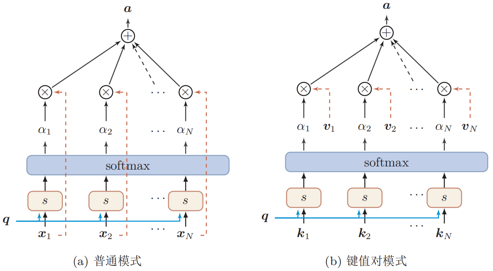
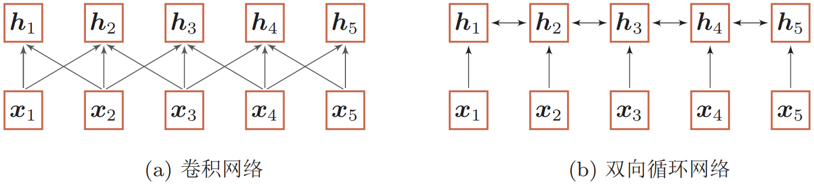
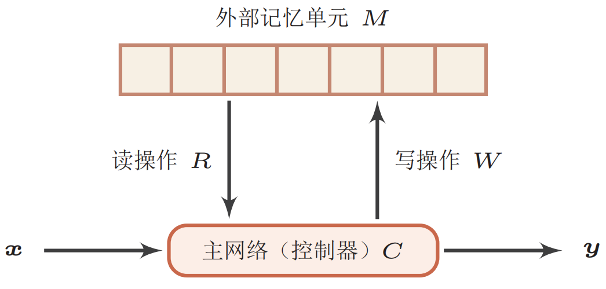
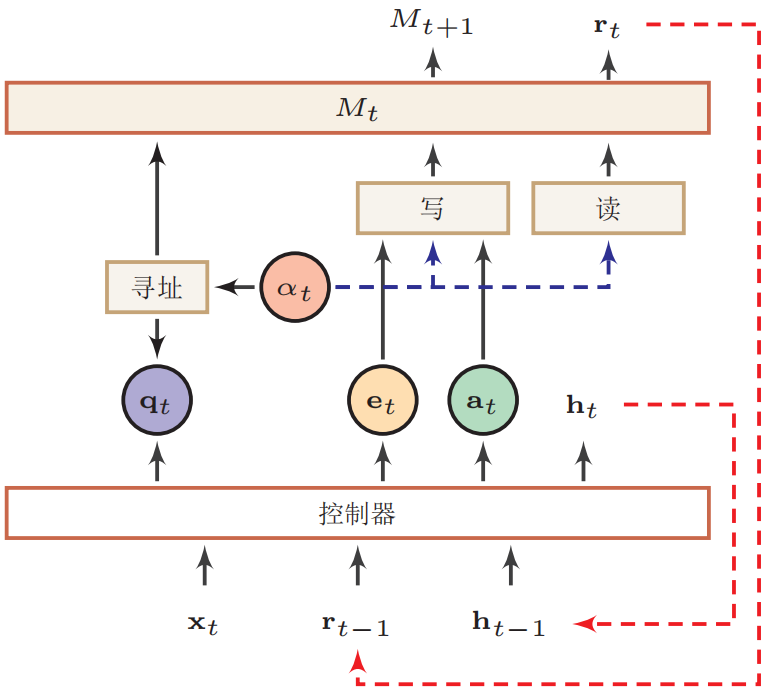

## 注意力机制与外部记忆

根据通用近似定理，前馈网络和循环网络都有很强的能力。但由于优化算法和计算能力的限制，在实践中很难达到通用近似的能力。特别是在处理复杂任务时，比如需要处理大量的输入信息或者复杂的计算流程时，目前计算机的计算能力依然是限制神经网络发展的瓶颈。

为了减少计算复杂度，通过部分借鉴生物神经网络的一些机制，我们引入了局部连接、权重共享以及汇聚操作来简化神经网络结构。虽然这些机制可以有效缓解模型的复杂度和表达能力之间的矛盾，但是我们依然希望**在不过度增加模型复杂度(主要是模型参数)的情况下来提高模型的表达能力**。

神经网络中可以存储的信息量称为**网络容量(network capacity)**。一般来讲，利用一组神经元来存储信息时，其存储容量和神经元的数量以及网络的复杂度成正比。如果要存储越多的信息，神经元数量就要越多或者网络要越复杂，进而导致神经网络的参数成倍地增加。

人脑的生物神经网络同样存在网络容量问题，工作记忆大概只有几秒钟的时间，类似于循环神经网络中的隐状态。而人脑每个时刻接收的外界输入信息非常多，包括来自于视觉、听觉、触觉的各种各样的信息。单就视觉来说，眼睛每秒钟都会发送千万比特的信息给视觉神经系统。人脑在有限的资源下，并不能同时处理这些过载的输入信息。大脑神经系统有两个重要机制可以解决信息过载问题：**注意力(attention)**和**记忆(memory)**机制。注意力机制通过自上而下的信息选择机制来过滤掉大量的无关信息；记忆机制引入额外外部记忆，优化神经网络的记忆结构来提高神经网络存储信息的容量。

### 注意力

#### 认知神经学中的注意力

注意力是一种人类不可或缺的复杂认知功能，指人可以在关注一些信息的同时忽略另一些信息的选择能力。在日常生活中，我们通过视觉、听觉、触觉等方式接收大量的感觉输入。但是人脑还能在这些外界的信息轰炸中有条不紊地工作，是因为人脑可以有意或无意地从这些大量输入信息中**选择小部分的有用信息来重点处理**，并忽略其他信息。这种能力就叫做注意力。注意力可以作用在外部的刺激(听觉、视觉、味觉等)，也可以作用在内部的意识(思考、回忆等)。注意力一般分为两种：

一种是**自上而下的有意识的注意力**，称为**聚焦式注意力(focus attention)**。聚焦式注意力是指有预定目的、依赖任务的，主动有意识地聚焦于某一对象的注意力。

另一种是**自下而上的无意识的注意力**，称为**基于显著性的注意力(saliency based attention)**。基于显著性的注意力是由外界刺激驱动的注意，不需要主动干预，也和任务无关。**如果一个对象的刺激信息不同于其周围信息，一种无意识的“赢者通吃”(winner-take-all)或者门控(gating)机制就可以把注意力转向这个对象**。不管这些注意力是有意还是无意，大部分的人脑活动都需要依赖注意力，比如记忆信息、阅读或思考等。

一个和注意力有关的例子是**鸡尾酒会效应**。当一个人在吵闹的鸡尾酒会上和朋友聊天时，尽管周围噪音干扰很多，他还是可以听到朋友的谈话内容，而**忽略其他人的声音(聚焦式注意力)**。同时，如果未注意到的背景声中有重要的词(比如他的名字)，**他会马上注意到(显著性注意力)**。

聚焦式注意力一般会随着环境、情景或任务的不同而选择不同的信息。比如当要从人群中寻找某个人时，我们会专注于每个人的**脸部**；而当要统计人群的人数时，我们只需要专注于每个人的**轮廓**。

#### 人工神经网络中的注意力

用$X = [\boldsymbol x_1, \cdots, \boldsymbol x_N]$表示$N$组输入信息，其中每个向量$\boldsymbol x_i$都表示一组输入信息。为了节省计算资源，不需要将所有信息都输入到神经网络，只需要从$X$中选择一些和任务相关的信息。**注意力机制的计算可以分为两步：一是在所有输入信息上计算注意力分布，二是根据注意力分布来计算输入信息的加权平均**。

(1) 注意力分布

为了从$N$个输入向量$X = [\boldsymbol x_1, \cdots, \boldsymbol x_N]$中选择出和某个特定任务相关的信息，我们需要引入一个**和任务相关的表示**，称为**查询向量(query vector)**，并通过一个**打分函数**来计算**每个输入向量和查询向量之间的相关性**。

给定一个和任务相关的查询$\boldsymbol q$，使用注意力变量$z \in [1,N]$来表示被选择信息的索引位置，即$z=i$表示选择了第$i$个输入向量。为了方便计算，我们采用一种**“软性”的信息选择机制**。首先计算在给定$\boldsymbol q$和$X$下，选择第$i$个输入向量的概率$\alpha_i$：
$$
\begin{aligned}
\alpha_{i} &=p(z=i | X, \boldsymbol{q}) \\
&=\operatorname{softmax}\left(s\left(\boldsymbol{x}_{i}, \boldsymbol{q}\right)\right) \\
&=\frac{\exp \left(s\left(\boldsymbol{x}_{i}, \boldsymbol{q}\right)\right)}{\sum_{j=1}^{N} \exp \left(s\left(\boldsymbol{x}_{j}, \boldsymbol{q}\right)\right)}
\end{aligned}
$$
其中$\alpha_i$称为**注意力分布(attention distribution)**，$s(\boldsymbol x_i,\boldsymbol q)$为注意力打分函数，可以使用以下几种方式来计算：

加性模型：$s(\boldsymbol{x}_{i}, \boldsymbol{q})=\boldsymbol{v}^{\mathrm{T}} \tanh (W \boldsymbol{x}_{i}+U \boldsymbol{q})$；

点积模型：$s\left(\boldsymbol{x}_{i}, \boldsymbol{q}\right)=\boldsymbol{x}_{i}^{\mathrm{T}} \boldsymbol{q}$；

缩放点积模型：$s(\boldsymbol{x}_{i}, \boldsymbol{q})=\frac{\boldsymbol{x}_{i}^{\mathrm{T}} \boldsymbol{q}}{\sqrt{d}}$；

双线性模型：$s(\boldsymbol{x}_{i}, \boldsymbol{q})=\boldsymbol{x}_{i}^{\mathrm{T}} W \boldsymbol{q}$；

其中，$W,U,\boldsymbol v$为可学习的参数，$d$为输入向量的维度。

(2) 加权平均

注意力分布$\alpha_i$可以解释为在给定任务相关的查询$\boldsymbol q$时，第$i$个输入向量受关注的程度。我们采用一种“软性”的信息选择机制对输入信息进行汇总：
$$
\begin{aligned}
\operatorname{att}(X, \boldsymbol{q}) &=\sum_{i=1}^{N} \alpha_{i} \boldsymbol{x}_{i} \\
&=\mathbb{E}_{z \sim p(z | X, \boldsymbol{q})}[\boldsymbol{x}_{z}]
\end{aligned}
$$
上式称为**软性注意力机制(soft attention mechanism)**，下图给出了软性注意力机制的示例图：



人工神经网络中注意力机制的实现：

```python
class Attention(tf.keras.layers.Layer):
    def __init__(self, units):
        super(BahdanauAttention, self).__init__()
        self.W1 = tf.keras.layers.Dense(units)
        self.W2 = tf.keras.layers.Dense(units)
        self.V = tf.keras.layers.Dense(1)

    def call(self, query, values):
        # query  shape == (batch_size, hidden size)
        # values shape == (batch_size, max_len, hidden size)
        query_with_time_axis = tf.expand_dims(query, 1)
        # we are doing this to broadcast addition along the time axis to calculate the score
        # query_with_time_axis shape == (batch_size, 1, hidden size)

        # score shape == (batch_size, max_length, 1)
        # we get 1 at the last axis because we are applying score to self.V
        # the shape of the tensor before applying self.V is (batch_size, max_length, units)
        score = self.V(tf.nn.tanh(self.W1(query_with_time_axis) + self.W2(values)))
        # 这里评分函数score可以换成其他几种实现形式

        # attention_weights shape == (batch_size, max_length, 1)
        attention_weights = tf.nn.softmax(score, axis=1)

        # context_vector shape after sum == (batch_size, hidden_size)
        context_vector = attention_weights * values
        context_vector = tf.reduce_sum(context_vector, axis=1)

        return context_vector, attention_weights
```

#### 注意力机制的变体

##### 硬性注意力

软性注意力选择的信息是所有输入向量在注意力分布下的期望，而**硬性注意力只关注某一个输入向量**。硬性注意力有两种实现方式，一种是**选取最高概率**的一个输入向量，另一种方式是在注意力分布上**随机采样**。

硬性注意力的一个缺点是基于最大采样或随机采样的方式来选择信息，使得最终的损失函数与注意力分布之间的函数关系不可导，因此无法使用反向传播算法进行训练。**为了使用反向传播算法，一般使用软性注意力来代替硬性注意力**。硬性注意力需要通过**强化学习**来进行训练。

##### 键值对注意力

**键值对是输入信息更一般的格式**。用$(K,V)=[(\boldsymbol k_1,\boldsymbol v_1), \cdots, (\boldsymbol k_N, \boldsymbol v_N)]$表示$N$组输入信息，给定任务相关的查询向量$\boldsymbol q$时，注意力函数为：
$$
\begin{aligned}
\operatorname{att}((K, V), \boldsymbol{q}) &=\sum_{i=1}^{N} \alpha_{i} \boldsymbol{v}_{i} \\
&=\sum_{i=1}^{N} \frac{\exp (s(\boldsymbol{k}_{i}, \boldsymbol{q}))}{\sum_{j} \exp (s(\boldsymbol{k}_{j}, \boldsymbol{q}))} \boldsymbol{v}_{i}
\end{aligned}
$$
当$K=V$时，键值对模式就等价于普通的注意力机制。

##### 多头注意力

**多头注意力(multi-head attention)**是利用多个查询$Q=[\boldsymbol q_1, \cdots, \boldsymbol q_M]$来平行地从输入信息中选取多组信息。每个注意力关注输入信息的不同部分：
$$
\operatorname{att}((K, V), Q)=\operatorname{att}((K, V), \boldsymbol{q}_{1}) \oplus \cdots \oplus \operatorname{att}((K, V), \boldsymbol{q}_{M})
$$
其中$\oplus$表示为向量的拼接。

##### 结构化注意力

在之前介绍中，我们假设所有的输入信息是同等重要的，是一种**扁平(flat)结构**，注意力分布实际上是在所有输入信息上的多项分布。但如果输入信息本身具有**层次(hierarchical)结构**，比如文本可以分为词、句子、段落、篇章等不同粒度的层次，我们可以使用**层次化的注意力**来进行更好的信息选择。此外，还可以假设注意力为上下文相关的二项分布，用一种图模型来构建更复杂的结构化注意力分布。

### 注意力机制的应用

注意力机制可以单独使用，但更多地用作神经网络中的一个组件。

#### 指针网络

注意力机制主要是用来做信息筛选，从输入信息中选取相关的信息。注意力机制可以分为两步：一是计算**注意力分布**$\alpha$，二是根据$\alpha$来计算输入信息的**加权平均**。我们可以只利用注意力机制中的第一步，**将注意力分布作为一个软性的指针(pointer)来指出相关信息的位置**。

**指针网络(pointer network)**是一种序列到序列模型，其输入是长度为$n$的向量序列$X=\boldsymbol x_1, \cdots, \boldsymbol x_n$，输出是**下标序列**$c_{1:m}=c_1,c_2,\cdots,c_m, c_i \in [1,n], \forall i$。

和一般的序列到序列任务不同，这里的**输出序列是输入序列的下标(索引)**。比如输入一组乱序的数字，输出为按大小排序的输入数字序列的下标。比如**输入为20*,* 5*,* 10，输出为1*,* 3*,* 2**。

条件概率$p(c_{1:m}|\boldsymbol x_{1:n})$可以写为
$$
\begin{aligned}
p(c_{1: m} | \boldsymbol{x}_{1: n}) &=\prod_{i=1}^{m} p(c_{i} | c_{1: i-1}, \boldsymbol{x}_{1: n}) \\
& \approx \prod_{i=1}^{m} p(c_{i} | \boldsymbol{x}_{c_{1}}, \cdots, \boldsymbol{x}_{c_{i-1}}, \boldsymbol{x}_{1: n})
\end{aligned}
$$
其中条件概率$p(c_{i} | \boldsymbol{x}_{c_{1}}, \cdots, \boldsymbol{x}_{c_{i-1}}, \boldsymbol{x}_{1: n})$可以通过注意力分布来计算。假设用一个循环神经网络对$\boldsymbol{x}_{c_{1}}, \cdots, \boldsymbol{x}_{c_{i-1}}, \boldsymbol{x}_{1: n}$进行编码得到向量$\boldsymbol h_i$，则
$$
p(c_{i} | c_{1: i-1}, \boldsymbol{x}_{1: n})=\operatorname{softmax}(s_{i, j})
$$
其中$s_{i,j}$为在解码过程的第$i$步时，每个输入向量的未归一化的注意力分布：
$$
s_{i, j}=\boldsymbol{v}^{\mathrm{T}} \tanh (W \boldsymbol{x}_{j}+U \boldsymbol{h}_{i}), \forall j \in[1, n]
$$
根据传统的注意力机制，所谓的$s_{i,j}$正是针对输入序列的权重，完全可以**把它拿出来作为指向输入序列的指针，在每次预测一个元素的时候找到输入序列中权重最大的那个元素**。这便是指针网络对于传统注意力机制的简化。

下图给出了指针网络的示例：


#### 自注意力模型

当使用神经网络来处理一个变长的向量序列时，我们通常可以使用卷积网络或循环网络进行编码来得到一个相同长度的输出向量序列，如下图所示：



基于卷积或循环网络的序列编码都可以看做是一种局部的编码方式，只建模了输入信息的局部依赖关系。虽然循环网络理论上可以建立长距离依赖关系，但是由于信息传递的容量以及梯度消失问题，实际上也只能建立短距离依赖关系。

如果要建立输入序列之间的长距离依赖关系，可以使用以下两种方法：一种方法是增加网络的层数，通过一个**深层网络**来获取远距离的信息交互；另一种方法是使用**全连接网络**。全连接网络是一种非常直接的建模远距离依赖的模型，但是无法处理变长的输入序列。不同的输入长度，其连接权重的大小也是不同的。自注意力也称为**内部注意力(intra-attention)**。这时我们就可以利用注意力机制来“动态”地生成不同连接的权重，这就是**自注意力模型(self-attention model)**。

假设输入序列为$X=[\boldsymbol x_1, \cdots, \boldsymbol x_N] \in \mathbb R^{d_1 \times N}$，输出序列为$H=[\boldsymbol h_1, \cdots, \boldsymbol h_N] \in \mathbb R^{d_2 \times N}$，首先我们可以通过线性变换得到**三组向量序列**：
$$
\begin{aligned}
Q&=W_{Q} X \in \mathbb{R}^{d_{3} \times N} \\
K&=W_{K} X \in \mathbb{R}^{d_{3} \times N} \\
V&=W_{V} X \in \mathbb{R}^{d_{2} \times N}
\end{aligned}
$$
其中$Q,K,V$分别为查询向量序列，键向量序列和值向量序列，$W_Q \in \mathbb R^{d_3 \times d_1}, W_K \in \mathbb R^{d_3 \times d_1}, W_V \in \mathbb R^{d_2 \times d_1}$分别为可学习的参数矩阵。利用键值对注意力机制的公式，可以得到输出向量$\boldsymbol h_i$：
$$
\begin{aligned}
\boldsymbol{h}_{i} &=\operatorname{att}((K, V), \boldsymbol{q}_{i}) \\
&=\sum_{j=1}^{N} \alpha_{i j} \boldsymbol{v}_{j} \\
&=\sum_{j=1}^{N} \operatorname{softmax}(s(\boldsymbol{k}_{j}, \boldsymbol{q}_{i})) \boldsymbol{v}_{j}
\end{aligned}
$$
其中$i,j \in [1,N]$为输出和输入向量序列的位置，连接权重$\alpha_{ij}$由注意力机制动态生成。

如果使用缩放点积来作为注意力打分函数，则输出向量序列可以写为：
$$
H=V \text{softmax}(\frac{K^TQ}{\sqrt{d_3}})
$$
其中softmax为**按列进行归一化**的函数。

自注意力模型可以作为神经网络中的一层来使用，既可以用来替换卷积层和循环层，也可以和它们一起交替使用(比如$X$可以是**卷积层或循环层的输出**)。自注意力模型计算的权重$\alpha_{ij}$只依赖$\boldsymbol q_i$和$\boldsymbol k_j$的相关性，而忽略了输入信息的位置信息。因此在单独使用时，自注意力模型一般需要加入**位置编码信息**来进行修正。

### 外部记忆

#### 人脑中的记忆

记忆在大脑皮层是**分布式存储**的，而不是存储于某个局部区域。人脑中的记忆具有周期性和联想性：

(1) 记忆周期

人脑记忆的一个特点是，记忆一般分为长期记忆和短期记忆。**长期记忆(long-term memory)**，也称为结构记忆或**知识(knowledge)**，体现为神经元之间的连接形态，其更新速度比较慢。**短期记忆(short-term memory)**体现为神经元的活动，更新较快，维持时间为几秒至几分钟。短期记忆是神经连接的暂时性强化，通过不断巩固、强化可形成长期记忆。短期记忆、长期记忆的动态更新过程称为演化（Evolution）过程。

因此，长期记忆可以类比于人工神经网络中的**权重参数**，而短期记忆可以类比于人工神经网络中的**隐状态**。

除了长期记忆和短期记忆，人脑中还会存在一个“缓存”，称为**工作记忆(working memory)**。在执行某个认知行为(比如记下电话号码，算术运算)时，工作记忆是一个记忆的临时存储和处理系统，维持时间通常为**几秒钟**。从时间上看，**工作记忆也是一种短期记忆**，但和短期记忆的内涵不同。短期记忆一般指外界的输入信息在人脑中的表示和短期存储，不关心这些记忆如何被使用；而**工作记忆是一个和任务相关的“容器”，可以临时存放和某项任务相关的短期记忆和其它相关的内在记忆**。工作记忆的容量比较小，一般可以容纳4组项目。

(2) 联想记忆

大脑记忆的一个主要特点是通过联想来进行检索的。**联想记忆(associative memory)**是指一种**学习和记住不同对象之间关系的能力**，比如看见一个人然后想起他的名字，或记住某种食物的味道等。联想记忆指一种可以通过内容匹配的方法进行寻址的信息存储方式，也称为**基于内容寻址的存储(content addressable memory, CAM)**；现代计算机的存储方式是根据地址来进行存储的，称为**随机访问存储(random access memory, RAM)**。

和LSTM中的**记忆单元**相比，**外部记忆可以存储更多的信息，并且不直接参与计算，通过读写接口来进行操作**。而LSTM模型中的记忆单元包含了信息存储和计算两种功能，不能存储太多的信息。

借鉴人脑中工作记忆，可以在神经网络中引入一个**外部记忆单元**来提高网络容量。外部记忆的实现途径有两种：一种是**结构化的记忆**，这种记忆和计算机中的信息存储方法比较类似，可以分为多个记忆片段，并按照一定的结构来存储；另一种是**基于神经动力学的联想记忆**，这种记忆方式具有更好的生物学解释性。

#### 结构化的外部记忆

为增强网络容量，一种简单的方式是引入结构化的记忆模块，**将和任务相关的短期记忆保存在记忆中，需要时再进行读取**。这种装备外部记忆的神经网络也称为**记忆网络(memory network, MN)**或**记忆增强神经网络(memory augmented neural network, MANN)**。

记忆网络结构如下所示，一般由以下几个模块构成：



(1) **主网络(控制器)**$C$：负责信息处理，并与外界进行交互(接受外界的输入信息并产生输出到外界)。主网络还同时通过读写模块和外部记忆进行交互。

(2) **外部记忆单元**$M$：外部记忆单元用来存储信息，一般可以分为很多**记忆片段(memory segment)**，这些片段按照一定的结构来进行组织。**记忆片段一般用向量来表示**，外部记忆单元可以用**一组向量**$\boldsymbol m_{1:N}=[\boldsymbol m_1, \cdots, \boldsymbol m_N]$来表示。**这些向量的组织方式可以是集合、树、栈或队列等**。大部分信息存储于外部记忆中，**不需要全时参与主网络的运算**。

(3) **读取模块**$R$：根据主网络生成的查询向量$\boldsymbol q_r$，从外部记忆单元中读取相应的信息$\boldsymbol r=R(\boldsymbol m_{1:N},\boldsymbol q_r)$。

(4) **写入模块**$W$：根据主网络生成的查询向量$\boldsymbol q_w$和要写入的信息$\boldsymbol a$来更新外部记忆$\boldsymbol m_{1:N}=W(\boldsymbol m_{1:N},\boldsymbol q_w,\boldsymbol a)$。

这种结构化的外部记忆是带有地址的，即每个记忆片段都可以按地址读取和写入。**要实现类似于人脑神经网络的联想记忆能力，就需要按内容寻址的方式进行定位，然后进行读取或写入操作**。按内容寻址通常使用**注意力机制**来进行。通过注意力机制可以实现一种**“软性”的寻址方式**，即**计算一个在所有记忆片段上的分布，而不是一个单一的绝对地址**。比如读取模块$R$的实现方式可以为：
$$
\begin{aligned}
\boldsymbol{r} &=\sum_{i=1}^{N} \alpha_{i} \boldsymbol{m}_{i} \\
\alpha_{i} &=\operatorname{softmax}(s(\boldsymbol{m}_{i}, \boldsymbol{q}_{r}))
\end{aligned}
$$
其中$\boldsymbol q_r$是主网络生成的查询向量，$s(\cdot, \cdot)$为打分函数。类比于计算机的存储器读取，**计算注意力分布的过程相当于是计算机的“寻址”过程**，信息加权平均的过程相当于计算机的“内容读取”过程。因此，结构化的外部记忆也是一种联想记忆，只是其结构以及读写的操作方式更像是受计算机架构的启发。

通过引入外部记忆，可以将神经网络的参数和记忆容量“分离”，即**在少量增加网络参数的条件下可以大幅增加网络容量**。注意力机制可以看做是一个**接口**，将信息的存储于计算分离。

##### 端到端记忆网络

**端到端记忆网络(end-to-end memory network, MemN2N)**采用一种可微的网络结构，可以多次从外部信息中读取信息。在端到端记忆网络中，外部记忆单元是只读的。

给定一组需要存储的信息$\boldsymbol m_{1:N}=\{\boldsymbol m_1, \cdots, \boldsymbol m_N\}$，其中每个$\boldsymbol m_i$是一个向量，首先将$\boldsymbol m_{1:N}$转换为两组**记忆片段**$A=[\boldsymbol a_1, \cdots, \boldsymbol a_N]$和$C=[\boldsymbol c_1, \cdots, \boldsymbol c_N]$(**原文中利用两个embedding矩阵实现**)，分别存放在两个外部记忆单元中，其中$A$用来寻址，$C$用来进行输出。主网络根据输入$\boldsymbol x$生成$\boldsymbol q$(**原文利用embeddding矩阵实现**)，并使用注意力机制来从外部记忆中读取相关信息$\boldsymbol r$：
$$
r=\sum_{i=1}^{N} \operatorname{softmax}(\boldsymbol{a}_{i}^{\mathrm{T}} \boldsymbol{q}) \boldsymbol{c}_{i}
$$
并产生输出$\boldsymbol y=f(\boldsymbol q+\boldsymbol r)$，其中$f(\cdot)$为预测函数。当应用到分类任务时，$f(\cdot)$可以设为softmax函数。

为了实现更复杂的计算，可以让主网络和外部记忆进行多轮交互。在第$k$轮交互中，主网络根据上次从外部记忆中读取的信息$\boldsymbol r^{(k-1)}$，产生新的查询向量$\boldsymbol{q}^{(k)}=\boldsymbol{r}^{(k-1)}+\boldsymbol{q}^{(k-1)}$，其中$\boldsymbol q^{(0)}$为初始查询向量，$\boldsymbol r^{(0)}=0$。

假设第$k$轮交互的外部记忆为$A^{(k)}$和$C^{(k)}$，主网络从外部记忆读取信息为：
$$
\boldsymbol{r}^{(k)}=\sum_{i=1}^{N} \operatorname{softmax}((\boldsymbol{a}_{i}^{(k)})^{\mathrm{T}} \boldsymbol{q}^{(k)}) \boldsymbol{c}_{i}^{(k)}
$$
在$K$轮交互后，用$\boldsymbol y=f(\boldsymbol q^{(K)}+\boldsymbol r^{(K)})$进行预测。这种多轮的交互方式也称为**多跳(multi-hop)**操作。多跳操作中的参数一般是共享的，为了简化起见，每轮交互的外部记忆也可以共享使用，比如$A^{(1)}=\cdots=A^{(K)}$。

端到端记忆网络结构如下所示：


##### 神经图灵机

**神经图灵机(neural Turing machine, NTM)**主要由两个部件构成：控制器和外部记忆。**外部记忆**定义为矩阵$M \in \mathbb R^{d \times N}$，其中$N$是记忆片段的数量，$d$是每个记忆片段的大小。**控制器**为一个前馈或循环神经网络。神经图灵机中的外部记忆是可读写的，其结构如下所示：



在每个时刻$t$，控制器接受当前时刻的输入$\boldsymbol x_t$、上一时刻的输出$\boldsymbol h_{t-1}$和上一时刻从外部记忆中读取的信息$\boldsymbol r_{t-1}$，并产生输出$\boldsymbol h_t$，同时生成和读写外部记忆相关的三个向量：查询向量$\boldsymbol q_t$、删除向量$\boldsymbol e_t$和增加向量$\boldsymbol a_t$，然后对外部记忆$M_t$进行读写操作，生成读向量$\boldsymbol r_t$和新的外部记忆$M_{t+1}$。

(1) 读操作

在时刻$t$，外部记忆的内容记为$M_t=[\boldsymbol{m}_{t, 1}, \cdots, \boldsymbol{m}_{t, n}]$，读操作为从外部记忆$M_t$中读取信息$\boldsymbol r_t \in \mathbb R^d$。

首先通过注意力机制来进行基于内容的寻址，即$\alpha_{t, i}=\operatorname{softmax}(s(\boldsymbol{m}_{t, i}, \boldsymbol{q}_{t}))$，其中$\boldsymbol q_t$为控制器产生的查询向量，用来进行基于内容的寻址。函数$s(\cdot,\cdot)$为加性或乘性的打分函数。注意力分布$\alpha_{t, i}$是记忆片段$\boldsymbol m_{t, i}$对应的权重，并满足$\sum_{i=1}^{n} \alpha_{t, i}=1$。根据注意力分布$\alpha_t$，可以计算读向量$\boldsymbol r_t$作为下一个时刻控制器的输入：
$$
\boldsymbol{r}_{t}=\sum_{i=1}^{n} \alpha_{i} \boldsymbol{m}_{t, i}
$$
(2) 写操作

外部记忆的写操作可以分解为两个子操作：**删除和增加**。

首先，控制器产生删除向量$\boldsymbol e_t$和增加向量$\boldsymbol a_t$，分别为要从外部记忆中删除的信息和要增加的信息。

删除操作是**根据注意力分布**来按比例地在每个记忆片段中删除$\boldsymbol e_t$，增加操作是**根据注意力分布**来按比例地给每个记忆片段加入$\boldsymbol a_t$：
$$
\boldsymbol{m}_{t+1, i}=\boldsymbol{m}_{t, i}(\mathbf{1}-\alpha_{t, i} )\boldsymbol{e}_{t}+\alpha_{t, i} \boldsymbol{a}_{t}, \forall i \in[1, n]
$$
通过写操作得到下一时刻的外部记忆$M_{t+1}$。

### 参考资料

- 邱锡鹏. 神经网络与深度学习. 北京: 机械工业出版社, 2020.
- 生物神经网络基础：https://www.jiqizhixin.com/articles/spiking-neurons
- Attention机制维基百科：https://en.wikipedia.org/wiki/Attention_(machine_learning)

