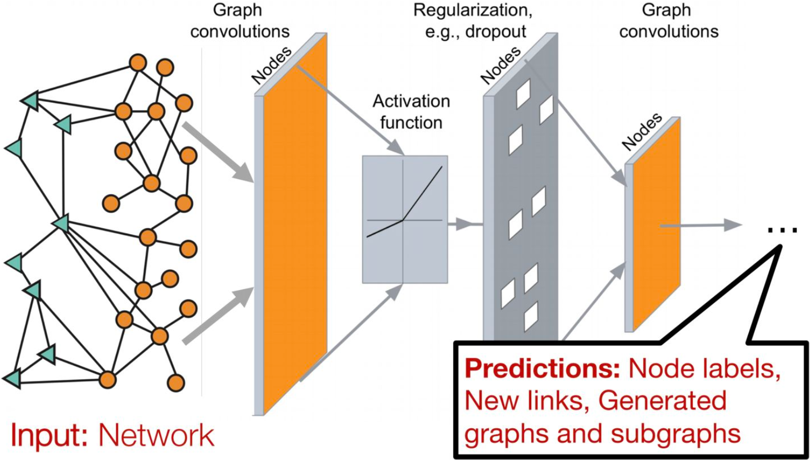
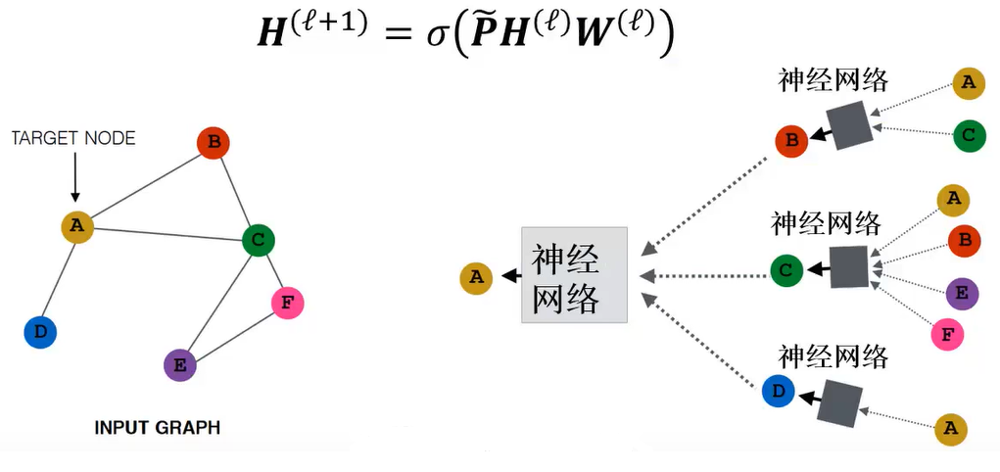
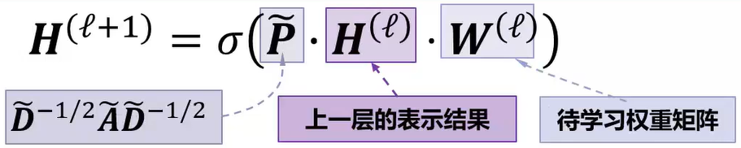
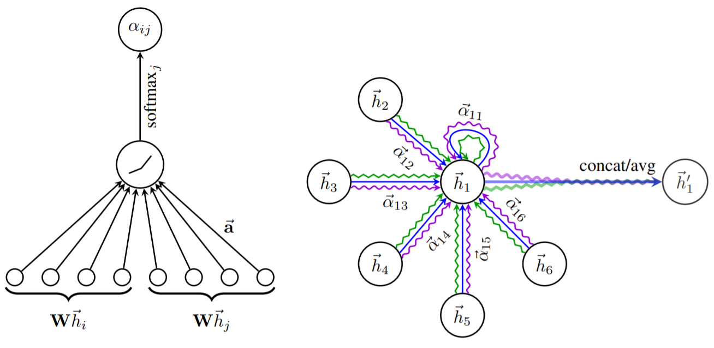
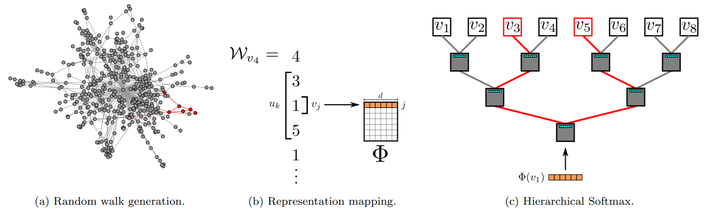

## 图神经网络

### 图神经网络概述

近年来，深度学习领域关于**图神经网络(graph neural network, GNN)**的研究热情日益高涨，图神经网络已经成为各大深度学习顶会的研究热点。GNN处理非结构化数据时的出色能力使其在网络数据分析、推荐系统、物理建模、自然语言处理和图上的组合优化问题方面都取得了新的突破。



随着机器学习、深度学习的发展，语音、图像、自然语言处理逐渐取得了很大的突破，然而语音、图像、文本都是很简单的序列或者网格数据，是很结构化的数据，深度学习很善于处理该种类型的数据。然而，现实世界中并不是所有的事物都可以表示成一个序列或者一个网格，例如社交网络、知识图谱、论文引用网络等，也就是说很多事物都是非结构化的。非结构化的数据可以使用**图(graph)**这种数据结构进行表示，其特点包括：

(1) 图的大小是任意的，图的拓扑结构复杂，没有像图像一样的空间局部性；

(2) 图没有固定的节点顺序，或者说没有一个参考节点；

(3) 图经常是动态图，而且包含多模态的特征。

图神经网络是对图进行表示，并将深度学习扩展使得能够建模问题和数据，以完成各类基于图的任务的神经网络结构。其所能够完成的常见任务包括结点分类、社区发现以及链接预测等。

### 图神经网络中的矩阵

以如下所示的图结构为例：


一个图$G$的定义为$G=(V, E)$，其中$V$为结点集，结点数量$m = |V|$；$E$为边集，边数量$n = |E|$。通常用一些矩阵来刻画图结构：

(1) 邻接矩阵$\boldsymbol A$：结点相邻接的位置标为1，其余位置为0的矩阵。**无向图的邻接矩阵为对称矩阵**。
$$
\boldsymbol A=\left[\begin{array}{llllll}
0 & 1 & 1 & 1 & 0 & 0 \\
1 & 0 & 1 & 0 & 0 & 0 \\
1 & 1 & 0 & 0 & 1 & 1 \\
1 & 0 & 0 & 0 & 0 & 0 \\
0 & 0 & 1 & 0 & 0 & 1 \\
0 & 0 & 1 & 0 & 1 & 0
\end{array}\right]
$$
(2) 度数矩阵$\boldsymbol D$：对角矩阵，标识每个结点的度。
$$
\boldsymbol D=\left[\begin{array}{llllll}
3 & 0 & 0 & 0 & 0 & 0 \\
0 & 2 & 0 & 0 & 0 & 0 \\
0 & 0 & 4 & 0 & 0 & 0 \\
0 & 0 & 0 & 1 & 0 & 0 \\
0 & 0 & 0 & 0 & 2 & 0 \\
0 & 0 & 0 & 0 & 0 & 2
\end{array}\right]
$$
(3) 归一化的邻接矩阵$\boldsymbol P = D^{-\frac{1}{2}} \boldsymbol A D^{-\frac{1}{2}}$：
$$
\boldsymbol P=\left[\begin{array}{cccccc}
0 & \frac{1}{\sqrt{3} \cdot \sqrt{2}} & \frac{1}{\sqrt{3} \cdot \sqrt{4}} & \frac{1}{\sqrt{3} \cdot \sqrt{1}} & 0 & 0 \\
\frac{1}{\sqrt{3} \cdot \sqrt{2}} & 0 & \frac{1}{\sqrt{2} \cdot \sqrt{4}} & 0 & 0 & 0 \\
\frac{1}{\sqrt{3} \cdot \sqrt{4}} & \frac{1}{\sqrt{2} \cdot \sqrt{4}} & 0 & 0 & \frac{1}{\sqrt{4} \cdot \sqrt{2}} & \frac{1}{\sqrt{4} \cdot \sqrt{2}} \\
\frac{1}{\sqrt{3} \cdot \sqrt{1}} & 0 & 0 & 0 & 0 & 0 \\
0 & 0 & 0 & \frac{1}{\sqrt{4} \cdot \sqrt{2}} & 0 & \frac{1}{\sqrt{2} \cdot \sqrt{2}} \\
0 & 0 & 0 & \frac{1}{\sqrt{4} \cdot \sqrt{2}} & \frac{1}{\sqrt{2} \cdot \sqrt{2}} & 0
\end{array}\right]
$$
(4) **归一化的拉普拉斯矩阵**$\boldsymbol L = \boldsymbol I - D^{-\frac{1}{2}} \boldsymbol A D^{-\frac{1}{2}}$($\boldsymbol I$为单位矩阵)：
$$
\boldsymbol L=\left[\begin{array}{cccccc}
1 & \frac{-1}{\sqrt{3} \cdot \sqrt{2}} & \frac{-1}{\sqrt{3} \cdot \sqrt{4}} & \frac{-1}{\sqrt{3} \cdot \sqrt{1}} & 0 & 0 \\
\frac{-1}{\sqrt{3} \cdot \sqrt{2}} & 1 & \frac{-1}{\sqrt{2} \cdot \sqrt{4}} & 0 & 0 & 0 \\
\frac{-1}{\sqrt{3} \cdot \sqrt{4}} & \frac{-1}{\sqrt{2} \cdot \sqrt{4}} & 1 & 0 & \frac{-1}{\sqrt{4} \cdot \sqrt{2}} & \frac{-1}{\sqrt{4} \cdot \sqrt{2}} \\
\frac{-1}{\sqrt{3} \cdot \sqrt{1}} & 0 & 0 & 1 & 0 & 0 \\
0 & 0 & 0 & \frac{-1}{\sqrt{4} \cdot \sqrt{2}} & 1 & \frac{-1}{\sqrt{2} \cdot \sqrt{2}} \\
0 & 0 & 0 & \frac{-1}{\sqrt{4} \cdot \sqrt{2}} & \frac{-1}{\sqrt{2} \cdot \sqrt{2}} & 1
\end{array}\right]
$$
(5) **结点特征矩阵**$\boldsymbol X \in \mathbb R^{n \times f}$，其中$f$为特征维数：GNN中每个结点通常有一个特征，而结点特征矩阵便用于记录每个结点的特征。为简便起见，下图中用one-hot向量作为每个结点的特征向量。通常会将结点特征矩阵和图结构矩阵融合进行学习。


### 图卷积神经网络

图神经网络引起人们的关注始于**图卷积神经网络(graph convolutional network, GCN)**的提出。其核心思想是在图结构上聚合邻居的特征信息，进行消息传递，并借助神经网络训练消息传递中的权重。其消息传递的架构如下所示(两层结构)：



将其消息传递公式进行分解，如下：



其中，$\boldsymbol H^{(\ell)}$为图卷积网络第$\ell$层的表示，是一个$n \times f$维矩阵。$\boldsymbol{\widetilde P}$为带有自环的归一化邻接矩阵，是一个$n \times n$维矩阵。$\boldsymbol H^{(\ell)}$与$\boldsymbol{\widetilde P}$相乘的过程也称为图卷积操作。$\boldsymbol W^{(\ell)}$是待学习的权重矩阵，大小为$f \times k$，$k$为该层的输出维度。$\sigma$表示非线性激活函数。由于层数太多会存在过平滑等问题，通常GCN是一个两层结构。输出层可以通过特定任务计算损失函数，从而训练权重矩阵。

值得注意的是，卷积神经网络(CNN)也是一种图卷积网络，其卷积的过程便是聚合周围邻居结点和自身的特征信息：


与GCN不同的是，CNN聚合邻居结点信息的权重$w_i$通过学习得到，而GCN聚合的过程是$\boldsymbol H^{(\ell)}$与$\boldsymbol{\widetilde P}$相乘的过程，这一过程没有需要学习的权重，聚合信息的多少只与结点的度数(无权图)或者预设的权重(有权图)有关。

GCN可以从两个角度来进行解释，即**基于谱(spectral-based)**和**基于空间(spatial-based)**。基于谱的角度从图信号处理引入滤波器来定义图卷积，其中图卷积操作被解释为从图信号中去除噪声。基于空间的方法将图卷积表示为从邻域聚合特征信息。

### Text Graph Convolutional Networks

论文《Semi-supervised classification with graph convolutional networks》提出用于文本分类的图卷积网络Text GCN。从非结构化数据(图、文本)生成图结构是该论文中非常重要的一部分，也是图神经网络需要解决的一个开放性问题之一。作者**将词和文档同时作为节点进行建图**，如下图所示：


图中节点的数量是**单词数量**与**文档数量**之和，$O$开头的是文档节点，其他的是词节点。图中黑线的线代表文档-词的边，灰色的表示词-词的边。$R(x)$表示$x$的嵌入表示。节点的不同颜色代表文档的不同类型。本文提出的Text GCN的初始输入向量(矩阵)$\boldsymbol X$是词和文档的one-hot编码表示。文档-词的边基于词在文档中的出现信息，并**使用TF-IDF作为边的权重**。词-词的连边基于词的全局词共现信息，词共现信息使用一个固定大小的滑动窗口在语料库中滑动统计词共现信息，然后**使用点互信息(PMI)计算两个词节点连线的权重**。

使用一个二层的GCN结构进行特征聚合：$\boldsymbol Z = \text{softmax}(\boldsymbol{\widetilde P} \ \text{ReLU}(\boldsymbol{\widetilde P} \boldsymbol X \boldsymbol W_0) \boldsymbol W _1)$。第一层使用ReLU作为激活函数，第二层使用softmax作为激活函数并计算损失，以训练分类任务。

以下为使用Tensorflow实现GCN进行文本分类的代码示例：

```python
# coding=utf-8
import os
import numpy as np
import tensorflow as tf
import tf_geometric as tfg
import pickle
from tf_geometric.utils import tf_utils
from collections import Counter
from tqdm import tqdm
from sklearn.model_selection import train_test_split
from tensorflow.keras.preprocessing.text import Tokenizer
from tensorflow import keras

data_dir = "rt-polarity"  # 数据集路径，需要在运行前导入当前目录

texts = []
labels = []
for fname, label in [["rt-polarity.pos", 1], ["rt-polarity.neg", 0]]:
    fpath = os.path.join(data_dir, fname)
    with open(fpath, "r", encoding="utf-8") as f:
        for line in f:
            texts.append(line.strip())
            labels.append(label)

train_texts, test_texts, train_labels, test_labels = train_test_split(texts, labels, test_size=0.2)

tokenizer = Tokenizer()
tokenizer.fit_on_texts(train_texts)

train_sequences = tokenizer.texts_to_sequences(train_texts)
test_sequences = tokenizer.texts_to_sequences(test_texts)


class PMIModel(object):
    def __init__(self):
        self.word_counter = None
        self.pair_counter = None

    def get_pair_id(self, word0, word1):
        pair_id = tuple(sorted([word0, word1]))
        return pair_id

    def fit(self, sequences, window_size):
        self.word_counter = Counter()
        self.pair_counter = Counter()
        num_windows = 0
        for sequence in tqdm(sequences):
            for offset in range(len(sequence) - window_size):
                window = sequence[offset:offset + window_size]
                num_windows += 1
                for i, word0 in enumerate(window):
                    self.word_counter[word0] += 1
                    for j, word1 in enumerate(window[i + 1:]):
                        pair_id = self.get_pair_id(word0, word1)
                        self.pair_counter[pair_id] += 1

        for word, count in self.word_counter.items():
            self.word_counter[word] = count / num_windows
        for pair_id, count in self.pair_counter.items():
            self.pair_counter[pair_id] = count / num_windows

    def transform(self, word0, word1):
        prob_a = self.word_counter[word0]
        prob_b = self.word_counter[word1]
        pair_id = self.get_pair_id(word0, word1)
        prob_pair = self.pair_counter[pair_id]

        if prob_a == 0 or prob_b == 0 or prob_pair == 0:
            return 0

        pmi = np.log(prob_pair / (prob_a * prob_b))
        pmi = np.maximum(pmi, 0.0)
        return pmi


def build_word_graph(num_words, pmi_model, embedding_size):
    x = tf.Variable(tf.random.truncated_normal([num_words, embedding_size], stddev=1 / np.sqrt(embedding_size)), dtype=tf.float32)
    edges = []
    edge_weight = []
    for (word0, word1) in pmi_model.pair_counter.keys():
        pmi = pmi_model.transform(word0, word1)
        if pmi > 0:
            edges.append([word0, word1])
            edge_weight.append(pmi)
            edges.append([word1, word0])
            edge_weight.append(pmi)
    edge_index = np.array(edges).T
    return tfg.Graph(x=x, edge_index=edge_index, edge_weight=edge_weight)


def build_combined_graph(word_graph, sequences, embedding_size):
    num_words = word_graph.num_nodes
    x = tf.zeros([len(sequences), embedding_size], dtype=tf.float32)
    edges = []
    edge_weight = []
    for i, sequence in enumerate(sequences):
        doc_node_index = num_words + i
        for word in sequence:
            edges.append([doc_node_index, word])  # only directed edge
            edge_weight.append(1.0)  # use BOW instaead of TF-IDF

    edge_index = np.array(edges).T
    x = tf.concat([word_graph.x, x], axis=0)
    edge_index = np.concatenate([word_graph.edge_index, edge_index], axis=1)
    edge_weight = np.concatenate([word_graph.edge_weight, edge_weight], axis=0)
    return tfg.Graph(x=x, edge_index=edge_index, edge_weight=edge_weight)


# building PMI model is time consuming, using cache to optimize
pmi_cache_path = "cached_pmi_model.p"
if os.path.exists(pmi_cache_path):
    with open(pmi_cache_path, "rb") as f:
        pmi_model = pickle.load(f)
else:
    pmi_model = PMIModel()
    pmi_model.fit(train_sequences, window_size=6)
    with open(pmi_cache_path, "wb") as f:
        pickle.dump(pmi_model, f)

embedding_size = 150
num_words = len(tokenizer.word_index) + 1
word_graph = build_word_graph(num_words, pmi_model, embedding_size)
train_combined_graph = build_combined_graph(word_graph, train_sequences, embedding_size)
test_combined_graph = build_combined_graph(word_graph, test_sequences, embedding_size)

print(word_graph)
print(train_combined_graph)
print(test_combined_graph)

num_classes = 2


# 构建GCN模型
class GCNModel(tf.keras.Model):
    def __init__(self, *args, **kwargs):
        super().__init__(*args, **kwargs)
        self.gcn0 = tfg.layers.GCN(100, activation=tf.nn.relu)
        self.gcn1 = tfg.layers.GCN(num_classes)
        self.dropout = keras.layers.Dropout(0.5)

    def call(self, inputs, training=None, mask=None, cache=None):
        x, edge_index, edge_weight = inputs
        h = self.gcn0([x, edge_index, edge_weight], cache=cache)
        h = self.dropout(h, training=training)
        h = self.gcn1([h, edge_index, edge_weight], cache=cache)
        return h


model = GCNModel()
model.gcn0.cache_normed_edge(train_combined_graph)
model.gcn0.cache_normed_edge(test_combined_graph)


@tf_utils.function
def forward(graph, training=False):
    logits = model([graph.x, graph.edge_index, graph.edge_weight], cache=graph.cache, training=training)
    logits = logits[num_words:]
    return logits


def compute_loss(logits, labels):
    losses = tf.nn.softmax_cross_entropy_with_logits(
        logits=logits,
        labels=tf.one_hot(labels, depth=num_classes)
    )
    mean_loss = tf.reduce_mean(losses)
    return mean_loss


optimizer = tf.keras.optimizers.Adam(learning_rate=5e-2)
for step in tqdm(range(1000)):
    with tf.GradientTape() as tape:
        logits = forward(train_combined_graph, training=True)
        mean_loss = compute_loss(logits, train_labels)

    vars = tape.watched_variables()
    grads = tape.gradient(mean_loss, vars)
    optimizer.apply_gradients(zip(grads, vars))

    if step % 10 == 0:
        logits = forward(test_combined_graph)
        preds = tf.argmax(logits, axis=-1)
        corrects = tf.cast(tf.equal(preds, test_labels), tf.float32)
        accuracy = tf.reduce_mean(corrects)
        print("step = {}\tloss = {}\ttest_accuracy = {}".format(step, mean_loss, accuracy))
```

### 图注意力网络

**图注意力网络(graph attention network, GAT)**是一种基于空间的图卷积网络，它在聚合特征信息时，**将注意力机制用于确定节点邻域的权重**。GAT由多个图注意力层组成，在注意力层中，结点$i$对结点$j$的注意力计算如下(不满足对称性，即$\alpha_{i j} \not = \alpha_{j i}$)：
$$
\alpha_{i j}=\operatorname{softmax}(\sigma(\vec{a}^{T}[W \overrightarrow{h_{i}} \| W \overrightarrow{h_{j}}]))
$$
其中，权重矩阵$W$是一个$F \times F'$尺寸的矩阵，$F$表示输入结点的特征维数，$F'$表示输出结点的特征维数。$\overrightarrow{h_{i}}$和$\overrightarrow{h_{j}}$表示结点$i$和结点$j$的特征表示。如果该层为输入层，则结点特征就是图的原始结点特征$x$。"||"表示拼接操作，$\vec{a}^{T}$表示**attention kernel**，是一个将结点$i$和结点$j$的信息进行综合的向量，并输入一个标量，代表结点$i$对结点$j$的注意力值。该运算过程如下图左半图所示。

在注意力值计算完成后，便可以计算当前注意力层的输出：
$$
\overrightarrow{h'_{i}}=\sigma(\sum_{j \in N_{i}} \alpha_{i j} W \overrightarrow{h_{j}})
$$
其中$\overrightarrow{h'_{i}}$表示当前注意力层对于结点$i$的输出特征，$N_i$表示结点$i$的邻接结点集合，$\alpha_{i j}$表示注意力系数。可以使用多头注意力机制，如下图右半图所示。



### 图嵌入

**图嵌入(graph embedding)**是一种将图数据(通常为高维稠密的矩阵)映射为低维稠密向量的过程，能够很好地解决图数据难以高效输入机器学习算法的问题。与自然语言处理中的词嵌入类似，图嵌入的目的是获取图中结点的分布式表示，结点表示之间的相似性表示结点之间的关系强度。图嵌入是将属性图转换为向量或向量集。嵌入应该捕获图的**拓扑结构、顶点到顶点的关系以及关于图、子图和顶点的其他相关信息**。更多的属性嵌入编码可以在以后的任务中获得更好的结果。可以将嵌入式大致分为两类：(1) **顶点嵌入**：每个顶点(结点)用其自身的向量表示进行编码。这种嵌入一般用于在顶点层次上执行可视化或预测。比如**结点分类，或者基于顶点相似性的链接预测**等；(2) **图嵌入**：用单个向量表示整个图。这种嵌入用于在图的层次上做出预测，可者想要比较或可视化整个图。例如**给定化学分子的结构，预测分子的化学性质**等。

图嵌入方法大致分为三类：基于因子分解的方法、基于随机游走的方法和基于深度学习的方法。

#### DeepWalk

DeepWalk方法受到word2vec的启发，首先选择某一结点为起始点，做随机游走得到结点序列，然后将该序列视为句子，用word2vec的方法学习，得到结点的表示向量。DeepWalk通过随机游走可以获图中结点的局部上下文信息，因此学到的表示向量反映的是结点在图中的**局部结构**，两个结点在图中共有的邻近结点(或者高阶邻近结点)越多，则对应的两个向量之间的距离就越短。



 #### node2vec

与DeepWalk相似，node2vec通过最大化随机游走得到序列中的结点出现的概率来保持结点之间的高阶邻近性。与DeepWalk的区别在于，node2vec采用有偏随机游走，在**广度优先(BFS)和深度优先(DFS)**图搜索之间进行权衡，从而产生比DeepWalk更高质量和更多信息量的嵌入。

使用node2vec实现结点嵌入和边嵌入的Python程序如下所示：

```python
import networkx as nx
from node2vec import Node2Vec
# Embed edges using Hadamard method
from node2vec.edges import HadamardEmbedder
import matplotlib.pyplot as plt

graph = nx.fast_gnp_random_graph(n=20, p=0.2)  # 建图，可以给出自己的graph
node2vec = Node2Vec(graph, dimensions=64, walk_length=30, num_walks=200, workers=4)  # Precompute probabilities and generate walks
model = node2vec.fit(window=10, min_count=1, batch_words=4)  # Any keywords acceptable by gensim.Word2Vec can be passed
print(graph)
nx.draw(graph)
plt.savefig('network.png')  # draw the network figure

print(model.wv.most_similar('2'))  # Look for most similar nodes. Output node names are always strings

model.wv.save_word2vec_format('embedding.txt')  # Save embeddings for later use
# model.save('embedding_model')  # Save model for later use

# 获取边的嵌入
edges_embs = HadamardEmbedder(keyed_vectors=model.wv)
print(edges_embs[('1', '2')])  # Look for embeddings on the fly - here we pass normal tuples
```

### 参考资料

- Kipf T N, Welling M. Semi-supervised classification with graph convolutional networks. arXiv preprint arXiv:1609.02907, 2016.
- Yao L, Mao C, Luo Y. Graph convolutional networks for text classification. Proceedings of the AAAI conference on artificial intelligence. 2019, 33(01): 7370-7377.
- Veličković P, Cucurull G, Casanova A, et al. Graph Attention Networks. International Conference on Learning Representations. 2018.
- Perozzi B, Al-Rfou R, Skiena S. Deepwalk: Online learning of social representations. Proceedings of the 20th ACM SIGKDD international conference on Knowledge discovery and data mining. 2014: 701-710.
- Grover A, Leskovec J. node2vec: Scalable feature learning for networks. Proceedings of the 22nd ACM SIGKDD international conference on Knowledge discovery and data mining. 2016: 855-864.
- 图神经网络入门：https://zhuanlan.zhihu.com/p/136521625
- 图神经网络视频：https://www.bilibili.com/video/BV1Ur4y1S7e3?from=search&seid=645353518432127826&spm_id_from=333.337.0.0
- 图嵌入参考：https://zhuanlan.zhihu.com/p/100586855

