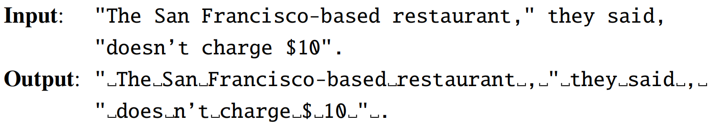
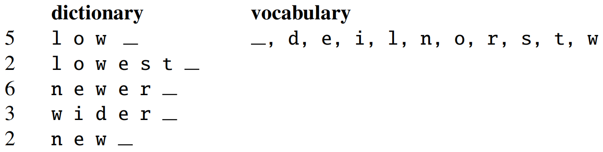
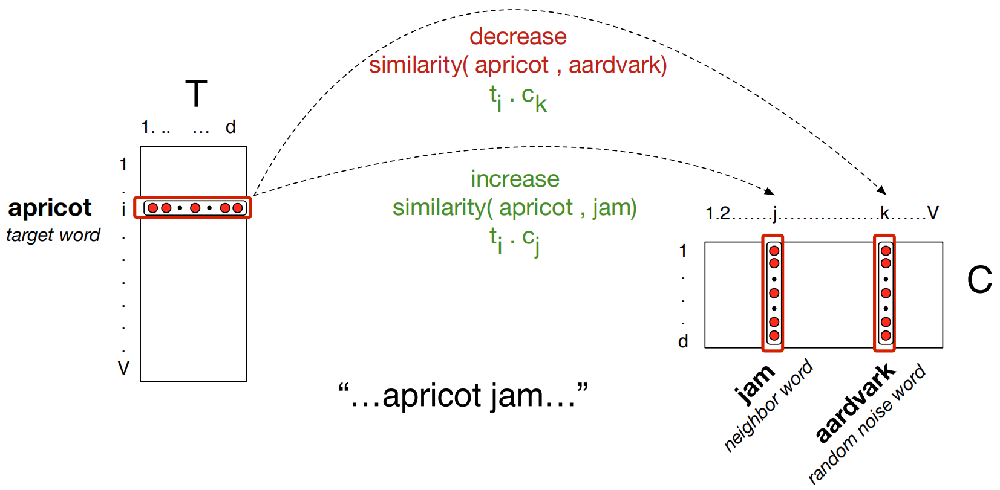
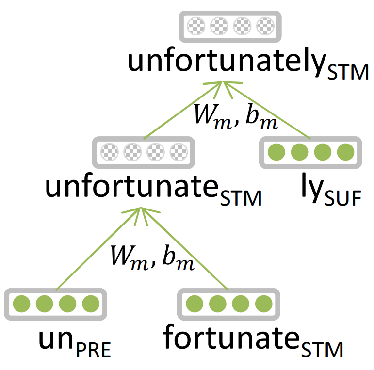
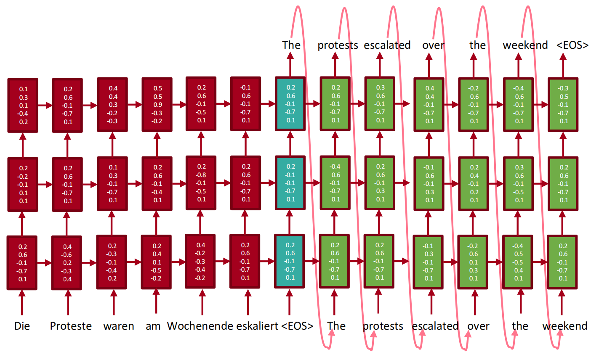

## 自然语言处理概述

### 自然语言与编程语言

**自然语言处理(natural language processing, NLP)**是一门融合了计算机科学、人工智能以及语言学的交叉学科(interdisciplinary field)。这门学科研究的是如何通过机器学习等技术，让计算机学会处理人类语言，乃至实现最终目标：**理解人类语言或人工智能**。

自然语言处理同义词：注重语言学结构的学者喜欢使用**计算语言学(conputational linguistics)**，而强调最终目的的学者则更偏好**自然语言理解(natural language understanding)**这个术语。

完全理解和表达语言是极其困难的，正确的语言表达也没有精确并完备的特性。

虽然自然语言和编程语言都称为“语言”，但二者有极大差异。自然语言和编程语言之间的不同：

(1) **词汇量**：编程语言的关键词数量有限且确定，而自然语言的词汇量是无尽的、可创造的。

(2) **结构化**：自然语言是非结构化的，而编程语言是结构化的。

(3) **歧义性**：自然语言含有大量歧义，这些歧义根据语境的不同而表现为特定的义项。语言中的歧义问题是自然语言难以处理的原因。

(4) **容错性**：自然语言具有很高的容错性，人们可以猜出有错的句子的含义；编程语言的拼写必须保证绝对正确，语法必须保证绝对规范。

(5) **易变性**：编程语言的变化缓慢温和，而自然语言的变化迅速嘈杂。

(6) **简略性**：人类语言往往简洁干练，我们经常省略大量背景知识或常识。

### 自然语言处理的任务

(1) 语音、图像和文本的处理

自然语言处理系统的输入源有语音、图像和文本。其中文本占主要地位，语音和图像受制于存储容量和传输速度的限制，它们的信息总量不如文本多。通常进行**语音识别(speech recognition)**将语音转化为文本，使用**光学字符识别(optical character recognition, OCR)**将图像转化为文本。

(2) 词法分析

这三个任务都是围绕词语进行的分析，所以统称**词法分析(lexical analysis)**。词法分析的主要任务是：将文本分隔为有意义的词语，即**分词(segmentation)**；确定每个词语的类别和浅层的歧义消除，即**词性标注(part-of-speech tagging)**；并且识别出一些较长的专有名词，即**命名实体识别(named entity recognition, NER)**。

(3) 信息抽取

词法分析以后，文本已经呈现出部分结构化的趋势，计算机看到的不再是一个长字符串，而是有意义的单词列表，且每个单词还附有自己的词性及其他标签。根据这些单词与标签，可以利用**信息抽取(information extraction)**技术来抽取文本中的有用信息，从简单的**高频词**到高级算法提取出的**关键词**，从**公司名称**到**专业术语**，其中词语级别的信息已经可以进行很多的抽取。我们还可以根据词语之间的统计学信息抽取出关键短语乃至句子，更大粒度的文本对用户更加友好。

(4) 文本分类与文本聚类

**文本分类(text classification)**任务可以判断一段话是褒义还是贬义、分析一句话的感情是积极还是消极、判断一封邮件是否是垃圾邮件等。**文本聚类(text clustering)**任务可以将相似的文本归档到一起、排除重复文档等，在信息检索等领域有着广泛的应用。

(5) 句法分析

**句法分析(syntactic parsing)**将零散词汇信息进行分析，得到**词语间的关系**。问答系统、搜索引擎和机器翻译等系统中，句法分析都是很重要的。

(6) 语义分析

相较于语法分析，**语义分析(semantic analysis)**侧重语义而非语法。它包括**词意消解**(确定一个词在语境中的含义)、**语义角色标注**(标准组句子中的谓语与其他成分的关系)乃至**语义依存分析**(分析句子中词语之间的语义关系)。

(7) 其他高级任务

除了上述任务以外，还有很多综合性的任务，与终端应用级产品联系更加紧密。比如：**自动问答(QA)**、**自动摘要(summarization)**、**机器翻译(machine translation)**等。注意，一般认为**信息检索(information retrieve, IR)**是区别于自然语言处理的独立学科。虽然二者具有密切的联系，但**IR的目标是查询信息，而NLP的目标是理解语言**，二者的目标具有本质上的区别。

### 自然语言处理的知识域

计算机分析所接受声音信号，并且把单词序列转换成声音信号，分别需要**语音学**和**音系学**的知识，这样的知识可以帮助我们建立词如何在话语中发音的模型。

识别I'm以及can't的缩写形式以及单词的各种变体需要**形态学**方面的知识。这些知识能够反映关于上下文中词的形态和行为的有关信息。

关于单词排列顺序以及组词成句的知识称为**句法**(syntax)。

为了完成问答系统，需要**词汇语义学和组合语义学**方面的知识。此外，关于说话人使用句子来表达意图的行为的知识称为**语用学**或对话。

在回答一些问题的时候，需要**话语学**的知识，例如“How many states were  in the US that year?”这句话中，为了理解that year，必须检查前面已经回答过的问题。这种明确代词指向的问题称为同指消解问题。

总而言之，在复杂的语言行为中需要的语言知识有如下六个方面：

(1) **语音学(phonetics)与音系学(phonology)**：关于语言和语音的知识。

(2) **形态学(morphology)**：关于词的有意义的组成成分的知识。

(3) **句法学(syntax)**：关于词语词之间结构关系的知识。

(4) **语义学(semantics)**：关于意义的知识。

(5) **语用学(pragmatic)**：关于意义与说话人的目的和意图之间的关系的知识。

(6) **话语学(discourse)**：关于比一个单独的话段更大的语言单位的知识。

### 歧义

**语音和语言计算机处理的绝大多数或者全部的研究内容都可以看成是在其中的某个层面上消解歧义**。如果我们把某个意思输入计算机，而存在着若干个不同的结构来表示这个意思，那么，我们就说这样的输入时有歧义的。考虑口语中的一个句子：**I made her duck**，这个句子有着非常多的意思(我给她烹饪鸭子/我创造了她的鸭子/我使她很快地把头或者身体放低一些)，这些意思都是由于歧义引起，歧义由形态或句法的不同而引起。

歧义的处理可以采取消解方法，或者排歧模型和算法。例如，使用**词类标注**的办法来确定duck是名词还是动词；使用**词类排歧**的办法来确定duck是名词还是动词；使用**词义排歧**的办法来确定make的意思是create还是cook。**词类排歧和词义排歧视词汇排歧的两个主要内容**。很多研究内容都可以纳入到词汇排歧的框架内，比如一些单词的读音随着词性的不同而不同。

除词汇排歧外，还有**句法排歧**，可以通过概率剖析来解决。此外，一些歧义可以通过**言语行为解释**的办法来解决。

### 传统模型和算法

**传统自然语言处理领域**重要的模型和理论包括：状态机、形式规则系统、逻辑、概率模型和向量空间模型。这些模型本身又可以给出一些算法，其中最重要的算法是如动态规划算法的状态空间搜索算法、分类器和最大期望算法的机器学习算法以及其他的学习算法。

(1) **状态机(state machine)**：简单来说，状态机就是形式模型，形式模型包括状态、状态间的转移以及输入表示。这种模型的变体有确定有限状态自动机、非确定有限状态自动机和有限状态转录机。

(2) **形式规则系统(rule system)**：形式规则系统中重要的模型有正则语法、正则关系、上下文无关语法、特征增益语法以及与这些语法的概率变体。

(3) **逻辑(logic)**：基于逻辑的模型是对获取语言知识起着关键性作用的模型，包含一阶逻辑、谓词演算等。

(4) **概率模型(probabilistic model)**：概率论是非常关键的一个部分，包含隐马尔科夫模型等重要模型和理论。此外，状态机可以使用概率论来提升称为加权自动机或者马尔科夫模型。

(5) **向量空间模型(vector-space model)**：基于线性代数的向量空间模型是信息检索和语义处理的基础。
典型地说，使用这些模型来处理语言就是通过表示输入假定的状态的空间来进行搜索。

### 语言、思维和理解

Turing在他的论文开头就指出，关于什么是机器思维的问题是不能回答的，因为机器和思维这两个术语本身就是含糊不清的。因此，他建议做一个游戏来进行测试，在游戏中，计算机对语言的使用情况就可以用来作为判断计算机是否能进行思维的根据。这种方式被认为是判断机器是否具有智能的标准，该标准称为**图灵测试(Turing test)**。

下面是Turing在他的论文中所描述的一个交互过程。显而易见，计算机要模拟人，并不能要求它成为一个无所不知的专家，而是需要**在各方面的行为与人相似**。

Q: Please write me a sonnet on the topic of Forth Bridge.

A: Count me out for this one. **I never could write poetry**.

Q: Add 34957 to 70764.

A: **(Pause about 30s and then give answer as)** 105621.

在现代社会中，不管人们相信什么，不管人们是否已经知道了计算机的内部工作情况，他们都在谈论计算机，并且都在与计算机进行交互，把计算机当成一个社会实体。这样的社会背景导致了一个称为会话代理的研究焦点，所谓会话代理就是通过会话进行交际的计算机人造实体，会话代理的研究将会持续很长的时间。

### 正则表达式

**正则表达式(regular expression, RE)**是一种用于描述文本搜索符号串的语言。从形式上说，正则表达式是用来可符号串集合的一个代数表达。因此它可以用于描述搜索符号串，也可以用于以形式的方法定义一种语言。正则表达式的搜索要求有一个我们试图搜索的模式和一个被搜索的文本语料库。正则表达式的搜索函数将对整个的语料库进行搜索，并返回包含该模式的所有文本。

正则表达式、**有限状态自动机(finite-state automaton, FSA)**和正则语法三者是等价且对应的关系。

常用的正则表达式字符如下：

|  字符  |                             描述                             |
| :----: | :----------------------------------------------------------: |
|   \    | 将下一个字符标记为一个特殊字符、或一个原义字符、或一个向后引用、或一个八进制转义符。例如，"n"匹配字符"n"。"\n"匹配一个换行符。"\\\\"匹配"\\"而"\("则匹配"("。 |
|   ^    | 匹配输入串的**开始位置**。如果设置了RegExp对象的Multiline属性，^也匹配"\n"或"\r"之后的位置。 |
|   $    | 匹配输入串的**结束位置**。如果设置了RegExp对象的Multiline属性，$也匹配“\n"或"\r"之前的位置。 |
|   *    | 匹配前面的子表达式**零次或多次**。例如，zo能匹配"z"以及"zoo"。 |
|   +    | 匹配前面的子表达式**一次或多次**。例如，"zo+"能匹配"zo"以及"zoooooo"，但不能匹配"z"。 |
|   ?    | 匹配前面的子表达式**零次或一次**。例如，"do(es)?"可以匹配"does"或"does"中的"do"。 |
|  {n}   | **匹配确定的n次**。例如，"o{2}"不能匹配"Bob"中的"o"，但是能匹配"food"中的两个o。 |
|  {n,}  | **至少匹配n次**。例如，"o{2,}"不能匹配"Bob"中的"o"，但能匹配"foooood"中的所有o。"o{1,}"等价于"o+"。"o{0,}"则等价于"o"。 |
| {n,m}  | m和n均为非负整数，其中n<=m。**最少匹配n次且最多匹配m次**。例如，"o{1,3}"将匹配"fooooood"中的前三个o。"o{0,1}"等价于"o?"。请注意在逗号和两个数之间不能有空格。 |
|   ?    | 当该字符紧跟在任何一个其他限制符(*, +, ?, {n}, {n,}, {n,m})后面时，**匹配模式是非贪婪的**。非贪婪模式尽可能少的匹配所搜索的字符串，而默认的贪婪模式则尽可能多的匹配所搜索的字符串。例如，对于字符串"oooo"，"o+?"将匹配单个"o"，而"o+"将匹配所有"o"。 |
|   .    | 匹配**除"\n"之外的任何单个字符**。要匹配包括"\n"在内的任何字符，请使用像"(.\|\n)"的模式。 |
|  x\|y  | 匹配x或y。例如，"z\|food"能匹配"z"或"food"。"(z\|f)ood"则匹配"zood"或"food"。 |
| [xyz]  | 字符集合。匹配所包含的任意一个字符。例如，"[abc]"可以匹配"plain"中的"a"。 |
| [^xyz] | 负值字符集合。匹配未包含的任意字符。例如，"\[^abc\]"可以匹配"plain"中的"p"。 |
| [a-z]  | 字符范围。匹配**指定范围内的任意字符**。例如，"[a-z]"可以匹配"a"到"z"范围内的任意小写字母。 |
| [^a-z] | 负值字符范围。匹配**任何不在指定范围内的任意字符**。例如，"\[^a-z\]"可以匹配任何除了小写字母外的任意字符。 |
|   \b   | 匹配一个单词边界，也就是指单词和空格间的位置。例如，"er\b"可以匹配"never"中的"er"，但不能匹配"verb"中的"er"。 |
|   \B   | 匹配非单词边界。"er\B"能匹配"verb"中的"er"，但不能匹配"never"中的"er"。 |
|   \d   |             匹配一个**数字字符**。等价于[0-9]。              |
|   \D   |           匹配一个**非数字字符**。等价于\[^0-9\]。           |
|   \f   |              匹配一个换页符。等价于\x0c和\cL。               |
|   \n   |              匹配一个换行符。等价于\x0a和\cJ。               |
|   \r   |              匹配一个回车符。等价于\x0d和\cM。               |
|   \s   | 匹配任何空白字符，包括空格、制表符、换页符等等。等价于[\f\n\r\t\v]。 |
|   \S   |       匹配任何**非空白字符**。等价于\[^\f\n\r\t\v\]。        |
|   \t   |              匹配一个制表符。等价于\x09和\cI。               |
|   \v   |            匹配一个垂直制表符。等价于\x0b和\cK。             |
|   \w   |   匹配**包括下划线的任何单词字符**。等价于"[A-Za-z0-9_]"。   |
|   \W   |      匹配任何**非单词字符**。等价于"\[^A-Za-z0-9_\]"。       |

### 词

在自然语言处理领域，词的识别是最基本的任务。通常情况下，普通单词的辨认显而易见，但有些语言元素是否应被当做单词，要看具体的应用场景。

(1) He stepped out into the hall, was delighted to encounter a water brother.

通常认为以上这句话有13个单词，但算上**标点符号(punctuation)**逗号(comma)和句号(period)后变为15个单词。标点符号对于查找事物的边界(逗号，句号，冒号)和识别含义的某些方面(问号，感叹号，引号)至关重要。 对于某些任务，例如词性标记、语法分析或语音合成，有时我们将标点符号视为单独的单词。

(2) I do uh main- mainly business data processing.

言语表达(utterance)是话语语料库中常见的元素，以上这句话中有两种utterance，一种称作fragment，像main-这种**说到一半的话**；另一种叫filters或filled pause，比如uh这种**语气词**。这些utterance是否被当做单词，还要看所实现系统的应用场景。如果我们要构建语音转录系统，则可能最终希望消除这些disfluencies。

但是我们有时也会保持这些disfluencies。 诸如uh或um之类的词在**语音识别**任务中有助于预测即将到来的单词，因为它们可能表示说话者正在重新构想，因此对于语音识别，它们被视为常规单词。 由于人们使用不同的disfluencies，因此也可以作为说话人识别的提示。

(3) They和they是否认为是同一个单词？

在**语音识别**等任务中，它们被认为是同一单词；在**NER**等任务中，首字母大写有帮助作用。

(4) cat和cats是否认为是同一个单词？

这两个词具有相同的**词元(lemma)**，但是具有不同的**词形(wordform)**。对于形态复杂的语言(例如阿拉伯语)，我们经常需要处理词形化。 但是，对于英语任务来说，词元就足够了。

(5) word type and word token

type指语料库中**不同的词的个数(即词典大小)**，而token指语料库中**出现的词的总个数**。以下这句话中，有16个tokens和14个types：They picnicked by the pool, then lay back on the grass and looked at the stars. 不同语料库中types数量$|V|$和tokens数量$N$的关系可用下式来表示：$|V|=kN^\beta$，其中$k$和$\beta$是常量。

### 文本规范化

在正式处理任何一段文本之前，通常需要对文本进行规范化处理。以下三个任务是在任何规范化处理中经常被应用的过程：

(1) **分词(tokenizing/segmenting words)**；

(2) **规范文本格式(normalizingword formats)**；

(3) **句子切分(segmenting sentences)**。

#### 分词

最朴素的分词工具是UNIX系统中的$\text{tr}$命令，通过使用该命令能够得到大致的词汇统计。为了获取更加精确的词汇信息，需要使用**分词(tokenization)**技术。在$\text{tr}$工具中，所有的数字和标点符号都被移除了，但是在很多NLP任务中这些元素是必不可少的。我们通常希望**将标点符号切分为独立的标记**，但是有时我们也希望**保留字母之间的标点符号**，例如Ph.D、can't等情况。此外，**日期、金钱数值、网站**等情况中的特殊字符都要予以识别并保留。

分词器还应具备其他一些功能，例如处理**附着语素(clitic)**，将what're转化为what are。此外，还应该将New York和rock' n' roll识别为一个单词，这就需要一个记录多单词表示的**字典(dictionary)**。

目前常用的英语分词标准是**Penn Treebank tokenization标准**，一个使用该标准的分词实例如下：



在实际应用中，由于分词是在其他NLP处理之前的步骤，其需要很快的完成速度。目前**英语**分词的通用方法是使用NLTK(http://www.nltk.org)。**汉语**分词比英语更复杂，常用的分词工具是jieba(https://github.com/fxsjy/jieba)。但一些研究发现，汉语直接按汉字进行切分的效果要比分词更好，因为一个汉字代表一个独立的语素，而且产生的单词表更小，且不会产生非常多的低频词汇。然而，在**日语和泰语**等语言中，单个字符作为一个独立单元太小了，因此必须分词。对于汉语、日语和泰语这类语言的标准分词算法使用**神经序列模型(neural sequence model)**，通过监督学习的方式训练模型在手工切分的数据集上学习切分的方式。

#### 比特对编码

**比特对编码(byte-pair encoding)**是一种**子词模型(subword model)**。该算法能够解决未知词汇的问题，其核心思想是迭代地合并频繁出现的字符对，并逐步扩大词汇表，直到进行$k$次合并，$k$为算法的超参数。算法一开始设置词汇表为文本中出现的所有单个的字符(每个单词后面添加一个特殊的结束符"_")，经过$k$次合并后，词汇表中会新增$k$个标记，这些标记通常是一些单词的一部分，并且是经常出现的，因此可以**捕获单词某一部分的统计信息**。以下展示了该算法的一个实例步骤：

(1) 第一步，vocabulary里只有单个字符，dictionary表示文本中出现的所有单词及其相应的词频：



(2) 第二步，“(r, _)”这一字符对出现的频率最高，将其合并后加入vocabulary中：


(3) 第三步，“(e, r_)”这一字符对出现的频率最高，将其合并后加入vocabulary中：


(4) 第四步，以此类推：


(5) 继续合并，会得到如下结果：


对于测试句子的切分，首先将其分解为单个字符，然后按照训练时合并的顺序，对测试句子进行逐个合并，直到无法合并为止。因此在上例中，**“n e w e r _”会被合并为“newer\_”，而“l o w e r _”会被合并成“low er\_”**。

在实际应用中，该算法通常会进行成千上万次合并。合并的结果是，大部分单词都能够被vocabulary里的一个元素完整地表示，而一些稀少的词汇或者未知词汇会被多个vocabulary中的元素表示。

#### 词规范化

**词规范化(word normalization)**指的是将文本中的单词/标记变为其标准的形式，为一个词的多种写法选择一个标准的单一格式。例如US和USA、color和colour等。这种标准化过程是有价值的，但值得注意的是，在信息检索领域，通常搜索US时返回包括US**或者USA**的文档，因此词的规范化过程可能造成了拼写信息的缺失。

词规范化包含多种子任务，如**大写转换(case folding)**，**词形还原(lemmatization)**和**词干提取(stemming)**等。

#### 句子切分

**句子切分(sentence segmentation)**是文本预处理的另一个重要步骤。句子切分所使用的最重要的线索是文本中的句号、问号和感叹号。其中问号和感叹号作为句子边界是十分模糊的，但另一方面，句号是否作为句子边界是更加模糊的，因为文本中通常包含许多像Mr. 或者Inc. 这样的词汇。而**Inc. 恰好在句子结尾的情况更加复杂，因为其既作为缩略词(abbreviation)，又作为句子的结尾**。因此，句子切分通常和分词同时进行。

通常情况下，句子切分算法首先判断句号是句子边界标记还是作为单词的一部分(通过规则或者机器学习的方式)。缩略词字典对于句号的判断是很有帮助的。在**Stanford CoreNLP toolkit**中，句子的切分是通过规则实现的。

### 深度学习与自然语言处理

**深度自然语言处理(deep NLP)**使用表征学习和深度学习的方法去解决传统自然语言处理中的问题。

(1) **词的表示(word representation)**：词是自然语言处理许多任务中最基础的单元。在使用深度学习来解决NLP中的任务的时候，词如何表示成为了一个核心的问题。在deep NLP中，词通常通过词向量(或词嵌入)的方式进行表示。**词嵌入(word embedding)**技术将每个单词嵌入到一个低维空间中，相似的单词在空间中的距离较近。



(2) **形态学(morphology)**：在传统NLP任务中，词由语素(morphemes)组成，如词干、前缀和后缀等；而在deep NLP中，为了描述词的多样的形态变换，解决方案是将每个语素看做一个向量，**神经网络将多个语素向量结合**，最终形成一个词向量(应用：句法分析器)。



(3) **语义学(semantics)**：传统NLP通常使用lambda演算，即精巧设计的函数来表达语义；在deep NLP中依然是**将每个语义单位用向量来进行表示**(应用：情感分析)。


(4) **问答系统(question answering)**：传统方法需要大量特征工程来捕获知识。在深度学习中，使用神经网络可以很好地解决该问题，因为deep NLP认为**Facts are stored in vectors**。

(5) **对话代理(dialog agent)**：deep NLP中的对话代理通常使用神经语言模型(RNN的一种实例)进行实现。

(6) **机器翻译(machine translation)**：传统的翻译系统是一个非常大的多层结构，而深度学习中可以使用神经网络完成**端到端翻译过程**，并使翻译性能得到极大的提高。



### jieba库的分词、词性标注与关键词提取操作示例

```python
import jieba

text = '2013年政府工作报告提出，缩小收入分配差距，使发展成果更多更公平地惠及全体人民，这与以往政府提出的“尽快扭转收入差距扩大趋势”相比，有了一个更高的视角。下列对收入分配差距认识正确的是：①收入分配差距的存在违背了社会主义的本质要求；②收入分配差距过大，违背了公平原则，不利于社会稳定；③适度的收入分配差距有利于激发劳动者的生产积极性；④消除收入差距是社会土义市场经济的根本目标'

seg_result1 = jieba.cut(text, cut_all=True)  # 全切分
print('cut_all true：', ' '.join(seg_result1))

seg_result2 = jieba.cut(text, cut_all=False)
print('cut_all false：', ' '.join(seg_result2))

seg_result3 = jieba.cut(text)
print('cut_all default：', ' '.join(seg_result3))

seg_result4 = jieba.cut_for_search(text)
print('cut_for_search：', ' '.join(seg_result4))

# 使用jieba.load_userdict(file_name)可以加载用户词表

# 使用jieba.posseg进行词性标注
import jieba.posseg as pseg

words = pseg.cut(text)
for word, flag in words:
    print('%s %s' % (word, flag))

# 使用jieba.analyse进行关键词提取
import jieba.analyse as analyse

print(" ".join(analyse.extract_tags(text, topK=20, withWeight=False, allowPOS=())))
print(" ".join(analyse.textrank(text, topK=20, withWeight=False, allowPOS=('ns', 'n'))))
```

### 参考资料

- Dan Jurafsky, H. Martin. Speech and Language Processing(3rd ed. draft).

- 何晗. 自然语言处理入门.  北京: 人民邮电出版社, 2019.

- 正则表达式速查表：https://www.jb51.net/tools/regexsc.htm

- Stanford University CS224n课程官网：http://web.stanford.edu/class/cs224n/

