## 词向量

### 词向量概述

在自然语言处理领域，词的**表示(representation)**是一个核心问题。我们希望将单词通过某种嵌入的形式表示，以捕获词的**含义(meaning)**以及词和词之间的**关系(relationship)**。一个解决方法是，使用wordnet(a thesaurus containing lists of **synonym sets** and **hypernyms**)，如下所示：

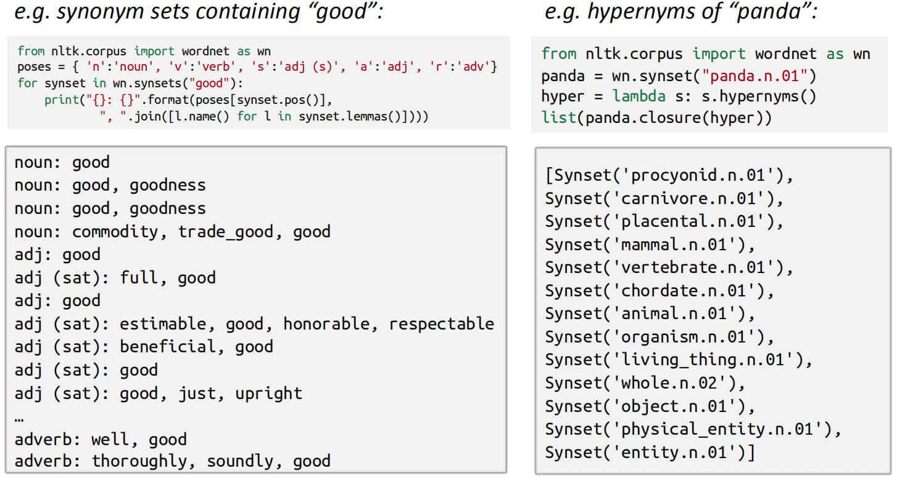

然而，wordnet存在着许多问题，例如新词汇含义的缺失、上下文无关以及对人类劳动力的需求过大等。

另一种想法是将单词用one-hot向量来表示。假设词汇表大小为$|V|$，则每个单词所对应的向量如下所示：
$$
w^{\text {aardvark}}=\left[\begin{array}{c}1 \\0 \\0 \\\vdots \\0\end{array}\right], w^{a}=\left[\begin{array}{c}0 \\1 \\0 \\\vdots \\0\end{array}\right], w^{a t}=\left[\begin{array}{c}0 \\0 \\1 \\\vdots \\0\end{array}\right], \cdots w^{z e b r a}=\left[\begin{array}{c}0 \\0 \\0 \\\vdots \\1\end{array}\right]
$$
即**每个向量中只有一个位置为1，其余位置为0，为1的位置的下标对应单词的id**。这样的词表示存在两个问题：(1) 没有给出两个单词之间的相似性，即任何两个向量的余弦相似度为0，这样会丢失语义信息；(2) 当词汇表很大时，每个单词对应的向量是一个高维稀疏向量。

因此，或许可以尝试降低维度，使用一个**子空间**(维度为$N$，$N\ll |V|$)来表达单词。在传统机器学习方法中，可以利用**奇异值分解(single value decomposition, SVD)**实现该过程。

首先遍历一个很大的数据集，统计词的共现计数矩阵$X$，然后对矩阵$X$进行奇异值分解得到$USV^\text T$，然后我们使用矩阵$U$的行来作为字典中所有词的词向量。$X$矩阵有两种选择的方式：(1) 统计每个单词在每个文档中出现的次数，生成**单词-文本矩阵(word-document matrix)**，这种方式称为**潜在语义分析(latent semantic analysis)**；(2) 计算每个单词在感兴趣单词的**附近特定大小的窗口**中出现的次数，生成**基于窗口的单词-单词共现矩阵(window based co-occurence matrix)**。以下为该方法的示例(假定窗口大小为1)：

(1) I enjoy flflying.

(2) I like NLP.

(3) I like deep learning.

则基于窗口的共现矩阵如下所示：

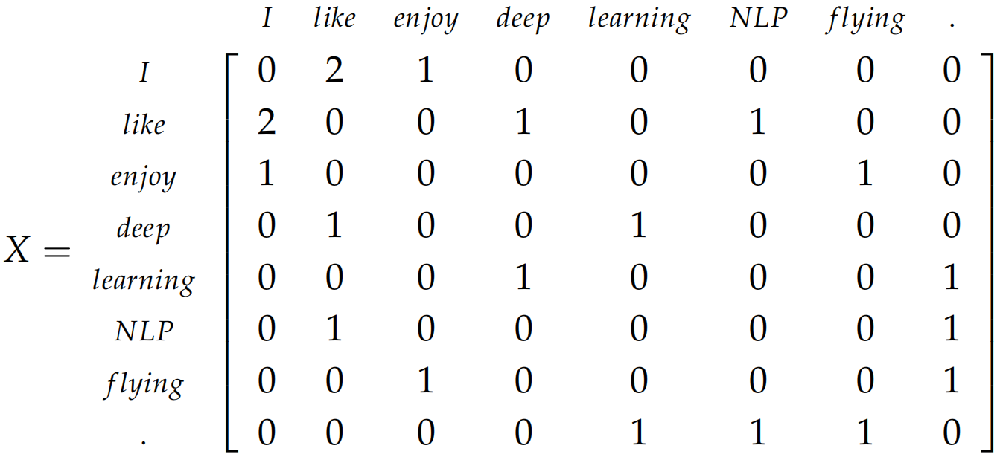

对矩阵$X$进行奇异值分解：

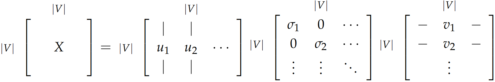

通过选择前$k$个**奇异向量**来降低维度，该过程也称$k$-截断奇异值分解：

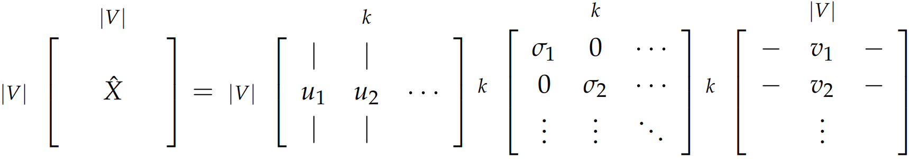

词-文档矩阵和基于窗口的词共现矩阵都能**使得到的词的表示充分编码语义和句法(词性标注)的信息**，但是这些方法会存在许多问题：(1) 矩阵的维度会经常发生改变(增加**新的单词**导致语料库大小的变化)；(2) 矩阵会非常稀疏，因为很多词不会共现；(3) 矩阵的维度一般会非常高；(4) 基于SVD的方法的计算复杂度一般为$O(N^3)$。(5) 需要在$X$上加入一些技巧处理来解决词频的极剧的不平衡。

对上述讨论中存在的问题存在以下的解决方法：(1) 忽略**功能词**，例如“the”，“he”，“has”等等；(2) 使用ramp window，即基于词与词之间的距离给共现计数加上一个**权值**；(3) 使用皮尔逊相关系数将负数的计数设为0，而不是使用原始的计数。

word2vec[1]\[2]于2013年被提出，其核心思想是：**一个词的含义由这个词旁边出现的词决定(You shall know a word by the company it keeps)**。word2vec为每个单词创建一个**分布式表示(distributed representation)**的向量，其中上下文相似的单词的向量表示在向量空间内距离会更近，上下文不相似的单词的词向量距离会更远。word2vec通过以下步骤完成词向量的训练：

(1) 获取足够大的**文本语料库(text corpus)**；

(2) 创建一个**词汇表(vocabulary)**，词汇表中的每个单词都有一个向量表示；

(3) 遍历文本中的每一个位置$t$，将位置$t$的单词记为$c$(center)，$c$的上下文(比如左右各$n$个单词)记为$o$(outside)；

(4) 使用$c$和$o$的**词向量的相似性**来计算给定$c$的条件下$o$的概率(或者计算给定$c$的条件下$o$的概率)；

(5) 不断调整词向量以最大化此概率。

通过中间词$c$预测周围词$o$的概率分布的示意图如下所示：

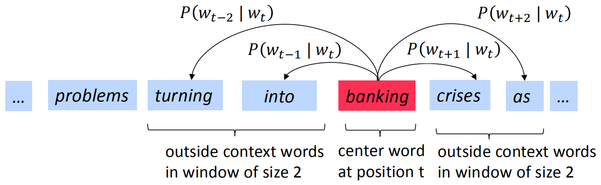

依然以中间词预测周围词为例，设文本共有$T$个单词，那么对每个位置$t$的单词$w_t$，设窗口大小为$m$，则文本的**似然函数(likelihood function)**为：
$$
Likelihood=L(\theta)=\prod_{t=1}^{T} \prod_{-m\leqslant j \leqslant m,j \not =0}P(w_{t+j}|w_t;\theta)
$$
**最大化似然函数，等价于最小化目标函数(损失函数)**：
$$
J(\theta)=-\frac{1}{T}\sum_{t=1}^{T} \sum_{-m\leqslant j \leqslant m,j \not =0}\log P(w_{t+j}|w_t;\theta)
$$
为了优化$J(θ)$，必须计算$P(w_{t+j}|w_t;θ)$。对每个单词$w$，使用两个向量$v_w$(当$w$是**中心词**)和$u_w$(当$w$是**周围词**)，则当中心词为$c$时，上下文中的某一个单词$o$的概率为：
$$
P(o|c)=\frac{\exp(u_o^\text T v_c)}{\sum_{w \in V}\exp(u_w^\text T v_c)}
$$
上式中，分子计算出中心词$c$和周围词$o$的相似性，分母将这种相似性归一化，这是典型的**softmax函数**的实例。通过语料可以构建这种有标签的训练数据($X$是中间词，$Y$是周围词)，然后通过梯度优化的方式进行求解。

值得注意的是，对于每个单词$w$，word2vec将学得两个词向量，即当$w$**作为中心词时的词向量**$v_w$和当$w$**作为周围词时的词向量**$u_w$。可以让$w$最终的词向量表示等于$u_w+v_w$或者二者取平均，这样可以获得最好的学习效果，并且使用两个单独的矩阵**使优化过程更简单**，但一个词仅使用一个向量也可以实现。上例是word2vec中的一种训练词向量的算法。总的来说，word2vec主要包括如下模块：

(1) 两个算法：**CBOW和skip-gram**。CBOW是根据中心词周围的上下文单词来预测该词的词向量。skip-gram则相反，是根据中心词预测周围上下文的词的概率分布。

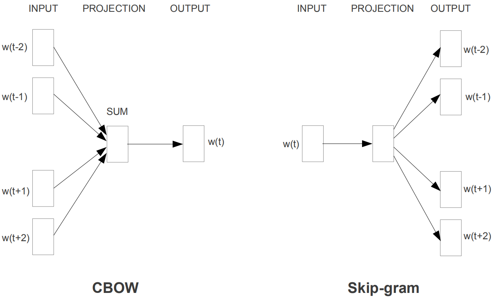

(2) 两个训练优化方法：**负采样(negative sampling)和层次化softmax(hierarchical softmax)**。前者通过抽取负样本来定义目标，后者通过使用一个有效的树结构计算所有词的概率来定义目标。

### CBOW

**CBOW(Continuous Bag of Words)**模型通过中心词的上下文来预测该中心词。首先假设句子中的单词由one-hot编码表示，在CBOW模型中，我们创建两个矩阵：$\mathcal V \in \mathbb R^{n\times |V|},\mathcal U \in \mathbb R^{|V|\times n}$，其中$n$是人为设定的**词向量的维度**。$\mathcal V$是输入词向量矩阵，其第$i$**列**是单词$w_i$作为输入时的$n$维词向量表示，记为$v_i$；类似地，$\mathcal U$是输出词向量矩阵，其第$j$**行**是单词$w_j$作为输出时的$n$维词向量表示，记为$u_j$。

CBOW的执行过程如下：

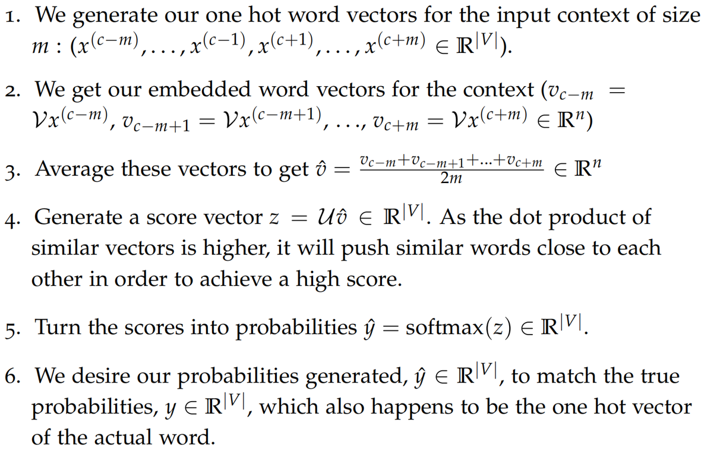

**所预测的输出向量和真实的单词one-hot向量**分别为$\hat y$和$y$，二者之间的**交叉熵(cross entropy)**为：
$$
H(\hat y,y)=-\sum_{j=1}^{|V|}y_j\log(\hat y_j)
$$
由于$y$是one-hot限量，其只有一个位置$c$的值为1，因此交叉熵可以写为$H(\hat y,y)=-y_c\log(\hat y_c)$。交叉熵衡量了预测值与真实值的差异，并且是一个可优化的函数。将交叉熵函数展开，得到**具体的CBOW模型的损失函数**：
$$
\begin{aligned}
\operatorname{minimize} J &=-\log P(w_{c} | w_{c-m}, \ldots, w_{c-1}, w_{c+1}, \ldots, w_{c+m}) \\
&=-\log P(u_{c} | \hat{v}) \\
&=-\log \frac{\exp (u_{c}^{T} \hat{v})}{\sum_{j=1}^{|V|} \exp (u_{j}^{T} \hat{v})} \\
&=-u_{c}^{T} \hat{v}+\log \sum_{j=1}^{|V|} \exp (u_{j}^{T} \hat{v})
\end{aligned}
$$
实现损失函数后，便可以使用梯度法对$u_c$和每个位置$j$的$v_j$不断进行优化。

### skip-gram

**skip-gram**模型通过中心词来预测其上下文中的单词，其执行过程如下：

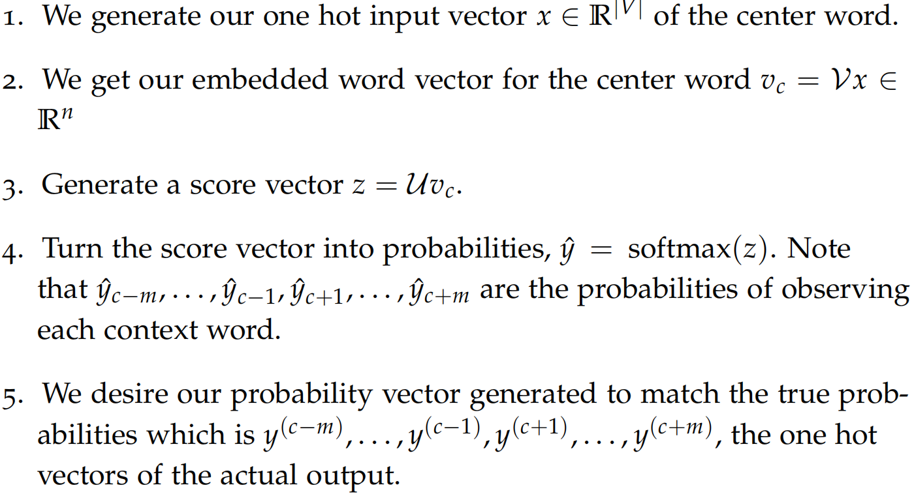

对skip-gram损失函数的推导采用了**朴素贝叶斯假设**：
$$
\begin{aligned}
\operatorname{minimize} J&=-\log P\left(w_{c-m}, \ldots, w_{c-1}, w_{c+1}, \ldots, w_{c+m} | w_{c}\right)\\
&=-\log \prod_{j=0, j \neq m}^{2 m} P(w_{c-m+j} | w_{c}) \\
&=-\log \prod_{j=0, j \neq m}^{2 m} P(u_{c-m+j} | v_{c}) \\
&=-\log \prod_{j=0, j \neq m}^{2 m} \frac{\exp (u_{c-m+j}^{T} v_{c})}{\sum_{k=1}^{|V|} \exp (u_{k}^{T} v_{c})} \\
&=-\sum_{j=0, j \neq m}^{2 m} u_{c-m+j}^{T} v_{c}+2 m \log \sum_{k=1}^{|V|} \exp (u_{k}^{T} v_{c})
\end{aligned}
$$
该式也是由交叉熵推导得来，注意：
$$
\begin{aligned}
J &=-\sum_{j=0, j \neq m}^{2 m} \log P(u_{c-m+j} | v_{c}) \\
&=\sum_{j=0, j \neq m}^{2 m} H(\hat{y}, y_{c-m+j})
\end{aligned}
$$
可以看出，skip-gram的损失函数为$2m$个交叉熵之和CBOW和skip-gram在损失函数上的区别是，CBOW的每次计算只需要计算一个单词的损失，因为其一次预测的目标仅仅是一个单词；而skip-gram的每次计算需要计算$2m$个位置的单词上的损失，因为其一次要预测两个大小为$m$的窗口内的所有单词。

### word2vec的优化

#### 负采样

由于CBOW和skip-gram模型的损失函数中涉及softmax计算，因此需要遍历整个词汇表$V$，这会耗费相当长的时间，每一次更新权重的时间复杂度都为$O(|V|)$。负采样(negative sampling)技术不直接计算损失函数，而是通过采样负样例的方式进行损失函数的逼近。

以skip-gram模型为例，考虑一个**中心词和上下文对**$(w,c)$，通过$P(D=1|w,c)$表示$(w, c)$是来自语料库。相应地，$P(D=0|w,c)$表示$(w,c)$不是来自语料库。首先，我们对$P(D=1|w,c)$用sigmoid函数建模，即表示$(w,c)$来自语料库的概率：
$$
P(D=1 | w, c, \theta)=\sigma(u_{w}^{\text T} v_{c})=\frac{1}{1+e^{(-u_{w}^{\text T} v_{c})}}
$$
现在，我们建立一个新的目标函数，如果中心词和上下文词确实在语料库中，就最大化概率$P(D=1|w,c)$，如果中心词和上下文词确实不在语料库中，就最大化概率$P(D=0|w,c)$。我们对这两个概率采用一个简单的极大似然估计方法(这里将$θ$作为模型的参数，在skip-garm模型中是$U$和$V$两个参数矩阵)。
$$
\begin{aligned}
\theta &=\underset{\theta}{\operatorname{argmax}} \prod_{(w, c) \in D} P(D=1 | w, c, \theta) \prod_{(w, c) \in \tilde{D}} P(D=0 | w, c, \theta) \\
&=\underset{\theta}{\operatorname{argmax}} \prod_{(w, c) \in D} P(D=1 | w, c, \theta) \prod_{(w, c) \in \tilde{D}}(1-P(D=1 | w, c, \theta)) \\
&=\underset{\theta}{\operatorname{argmax}} \sum_{(w, c) \in D} \log P(D=1 | w, c, \theta)+\sum_{(w, c) \in \tilde{D}} \log (1-P(D=1 | w, c, \theta)) \\
&=\underset{\theta}{\operatorname{argmax}} \sum_{(w, c) \in D} \log \frac{1}{1+\exp (-u_{w}^{\text T} v_{c})}+\sum_{(w, c) \in \tilde{D}} \log (1-\frac{1}{1+\exp (-u_{w}^{\text T} v_{c})}) \\
&=\underset{\theta}{\operatorname{argmax}} \sum_{(w, c) \in D} \log \frac{1}{1+\exp (-u_{w}^{\text T} v_{c})}+\sum_{(w, c) \in \tilde{D}} \log (\frac{1}{1+\exp (u_{w}^{\text T} v_{c})})
\end{aligned}
$$
注意最大化似然函数等同于最小化负对数似然：注意最大化似然函数等同于最小化负对数似然：
$$
J=-\sum_{(w, c) \in D} \log \frac{1}{1+\exp (-u_{w}^{\text T} v_{c})}-\sum_{(w, c) \in \tilde{D}} \log (\frac{1}{1+\exp (u_{w}^{\text T} v_{c})})
$$
注意，$\tilde D$是“假的”或者“负的”语料。例如我们有句子类似“stock boil fish is toy”，这种无意义的句子出现时会得到一个很低的概率。

对于skip-gram模型，我们对给定中心词$c$来观察的上下文单词$c-m+j$的新目标函数为：
$$
-\log \sigma(u_{c-m+j}^{\text T} \cdot v_{c})-\sum_{k=1}^{K} \log \sigma(-\tilde{u}_{k}^{\text T} \cdot v_{c})
$$
对CBOW模型，我们对给定上下文向量的均值$\hat{v}=\frac{v_{c-m}+v_{c-m+1}+\ldots+v_{c+m}}{2 m}$来观察中心词$u_c$的新的目标函数为：
$$
-\log \sigma(u_{c}^{\text T} \cdot \hat{v})-\sum_{k=1}^{K} \log \sigma(-\tilde{u}_{k}^{\text T} \cdot \hat{v})
$$
其中，$\{\tilde{u}_{k} | k=1 \ldots K\}$是从$P_n(w)$中随机抽取的的样本。有很多关于如何选择$P_n(w)$以得到最好近似的讨论，从实际效果看来最好的是指数为3/4的unigram模型，即每个单词被选中的概率为其词频的3/4次方。假设文本中有如下三个单词以及其相应的词频：
$$
\begin{aligned}
&\text { is: } 0.9^{3 / 4}=0.92\\
&\text { Constitution: } 0.09^{3 / 4}=0.16\\
&\text { bombastic: } 0.01^{3 / 4}=0.032
\end{aligned}
$$
可以看出，当词频变为原来的3/4次方后，**低频词“bombastic”被采样的概率变为原来的三倍，而高频词is被采样的概率仅有微小的增加**，这便启发性地解释了为什么要取3/4次方。

#### 层次化softmax

**层次化softmax(hierarchical softmax)**可以替换输出层softmax，使得word2vec的训练过程具有更好的效率，通常对于**低频词**有效。而negative sampling通常对于**高频词和低维词向量**有效。

hierarchical softmax使用一个二叉树来表示词表中的所有词。树中的每个叶结点都是一个单词，而且只有一条路径从根结点到叶结点。在这个模型中，没有词的输出表示。相反，**图的每个结点(根结点和叶结点除外)关联一个模型要学习的向量**。**每个单词作为输出单词的概率被定义为从根结点随机游走到该单词对应的叶子结点的概率**。

在这个模型中，给定一个向量$w_i$的下的单词$w$的概率$P(w|w_i)$，等于从根结点开始到对应$w$的叶结点结束的随机漫步概率。这个方法最大的优势是将计算复杂度从$O(|V|)$降低至$O(\log|V|)$，对应着路径的长度。

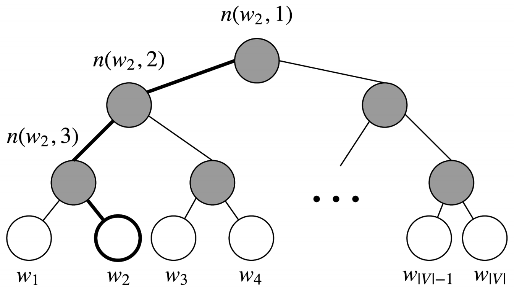

令$L(w)$为从根结点到叶结点$w$的路径中**非叶节点数目**。例如，上图中的$L(w_2)$为3。定义$n(w,i)$为与向量$v_n(w,i)$相关的路径上第$i$个结点。因此$n(w,1)$是根结点，而$n(w,L(w))$是$w$的父结点。现在对每个内部结点$n$，我们任意选取一个它的子节点并且定义为$ch(n)$(**一般是左结点**)。然后，我们可以计算概率为：
$$
P(w | w_{i})=\prod_{j=1}^{L(w)-1} \sigma([n(w, j+1)=\operatorname{ch}(n(w, j))] \cdot v_{n(w, j)}^{T} v_{w_{i}})
$$
其中，
$$
[x]=\left\{\begin{array}{l}
1 \text { if } x \text { is true } \\
-1 \text { otherwise }
\end{array}\right.
$$
$\sigma(\cdot)$是sigmoid函数。上式的解释如下，首先，我们将根据从根结点$n(w,1)$到叶结点$w$的**路径的形状**来计算**相乘的项**。如果我们假设$ch(n)$一直都是$n$的左结点，然后当路径往左时公式$[n(w,j+1)=ch(n(w,j))]$返回1，往右则返回-1。此外，$[n(w,j+1)=ch(n(w,j))]$提供了**归一化**的作用。在节点$n$处，如果我们将去往左和右结点的概率相加，对于$v_{n}^{T} v_{w_{i}}$的任何值，$\sigma\left(v_{n}^{T} v_{w_{i}}\right)+\sigma\left(-v_{n}^{T} v_{w_{i}}\right)=1$总是成立。

归一化也保证了$\sum_{w=1}^{|V|}P(w | w_{i})=1$，这与原始的softmax是一致的。

最后，通过点积的方式比较**输入向量**$v_{w_i}$和每个内部结点向量$v^\text T_{n(w,j)}$之间的相似度。以上图中预测$w_2$的概率为例：
$$
\begin{aligned}
P(w_{2} | w_{i}) &=p(n(w_{2}, 1), \text {left}) \cdot p(n(w_{2}, 2), \text{left}) \cdot p(n(w_{2}, 3), \text {right}) \\
&=\sigma(v_{n(w_{2}, 1)}^{T} v_{w_{i}}) \cdot \sigma(v_{n(w_{2}, 2)}^{T} v_{w_{i}}) \cdot \sigma(-v_{n(w_{2}, 3)}^{T} v_{w_{i}})
\end{aligned}
$$
训练含hierarchical softmax的模型的目标仍然是最小化负对数似然$-\log P(w | w_{i})$。但是与传统softmax的参数更新过程不同的是，**传统的softmax每次会更新全部单词的输出向量，而hierarchical softmax仅更新二叉树中位于走过的路径上结点的向量**。

二叉树的选取通常决定了hierarchical softmax的速度，论文中选取的是**赫夫曼树**，即最优二叉树。

#### 其他优化

除了负采样和层次化softmax之外，word2vec原文中还包含两个较为细节的优化：

(1) **窗口大小的设置**：除了设置一个固定值以外，还可以设置一个窗口的最大值$M$，然后每次取一个$[1,M]$区间内的随机数作为一次训练的窗口大小。这样做使得更相近的单词被选择的概率更大，能够更好地编码更近的单词。

(2) **高频词降采样**：在非常大的语料库中，有些出现频数很高的词(例如a, the, in)实际上无法提供有用的信息。这些词的词向量在使用大量语料库训练的过程几乎不会改变。为了改善这种情况，word2vec原文提出一种简单的降采样方式：在训练集中的每个单词$w_i$以以下的概率进行丢弃：
$$
P(w_i)=1-\sqrt{\frac{t}{f(w_i)}}
$$
其中，$f(w_i)$是单词$w_i$的频率，$t$是人工设置的一个阈值，典型的$t$值大概为$10^{-5}$。词频越高，$P(w_i)$就越大，即高频单词会以更大的概率会剔除，而词频小于$t$的单词则不会被剔除。将高频词降采样带来的另一个好处是，**每个词实际上关注的其上下文的范围增加了**，因为这些没有实际意义的高频词都被去除了。

### GloVe

**基于奇异值分解的词嵌入方法**有效地利用了词的全局统计信息，主要用于捕获单词的相似性，但是对类似**词类比**的任务上表现不好。而**基于浅层窗口的词嵌入方法(CBOW、skip-gram)**通过在局部上下文窗口预测来学习词向量，其除了在单词相似性任务上表现良好外，还展示了捕获复杂语言模式能力，但**未能利用到全局共现统计数据**。

相比之下，**GloVe[3]**使用**全局统计信息**，以**最小二乘**为目标，来预测单词$i$出现在单词$j$的上下文中的概率。这个模型生成了具有有意义的子结构的单词向量空间，在词类比任务上表现非常出色，在多种单词相似性任务中超过了其他方法。令$X$表示为单词共现矩阵，其中$X_{ij}$表示词$j$出现在词$i$的上下文的**次数**。令$X_{i}=\sum_{k} X_{i k}$为任意词$k$出现在词$i$的上下文的次数。最后，令$P_{ij}=P(w_{j}|w_{i})=\frac{X_{ij}}{X_{i}}$为词$j$出现在词$i$上下文的**概率**。显然$X$是一个对称矩阵。计算这个矩阵需要遍历一次整个语料库获得统计信息。对庞大的语料库，这样的遍历会产生非常大的计算量，但是这只是一次性的前期投入成本。

skip-gram模型使用softmax来计算词$j$出现在词$i$的上下文的概率：
$$
Q_{i j}=\frac{\exp (\vec{u}_{j}^{T} \vec{v}_{i})}{\sum_{w=1}^{W} \exp (\vec{u}_{w}^{T} \vec{v}_{i})}
$$
训练过程以**在线**的方式通过**梯度下降法**进行，但是暗含**全局交叉熵损失**可以如下计算：
$$
J=-\sum_{i \in \text {corpus}} \sum_{j \in \text {context}(i)} \log Q_{ij}
$$
同样的单词$i$和$j$可能在语料库中出现多次，因此首先将$i$和$j$相同的值组合起来**更有效**：
$$
J=-\sum_{i=1}^{W} \sum_{j=1}^{W} X_{i j} \log Q_{i j}
$$
其中共现频率$X_{ij}$的值通过共现矩阵$X$给定。上式表明，单词$i$和$j$在语料库中共现数量更大时，其损失更大，因此更新速度更快。交叉熵损失的一个显著缺点是要求分布$Q$被正确归一化(每个单词都除以softmax相应分母)，因此对整个词汇的求和的计算量非常大。因此，我们使用一个最小二乘的目标函数，其中$P$和$Q$的归一化因子被丢弃：
$$
\hat{J}=\sum_{i=1}^{W} \sum_{j=1}^{W} X_{i}(\hat{P}_{i j}-\hat{Q}_{i j})^{2}
$$
其中$\hat{P}_{ij}=X_{ij}$和$\hat{Q}_{i j}=\exp (\vec{u}_{j}^{T} \vec{v}_{i})$是非归一化分布。这个公式带来了新的问题，$X_{ij}$经常会是很大的值，从而难以优化。一个有效方法是最小化$\hat{P}_{ij}=X_{ij}$和$\hat{Q}_{i j}=\exp (\vec{u}_{j}^{T} \vec{v}_{i})$对数的平方误差：
$$
\begin{aligned}
\hat{J} &=\sum_{i=1}^{W} \sum_{j=1}^{W} X_{i}(\log (\hat{P})_{i j}-\log (\hat{Q}_{i j}))^{2} \\
&=\sum_{i=1}^{W} \sum_{j=1}^{W} X_{i}\left(\vec{u}_{j}^{T} \vec{v}_{i}-\log X_{i j}\right)^{2}
\end{aligned}
$$
另外一个问题是权值因子$X_i$不能保证最优。因此，我们引入更一般化的权值函数，将$X_i$替换为一个函数$f(X_{ij})$，因此可以自由依赖于上下文单词：
$$
\hat{J}=\sum_{i=1}^{W} \sum_{j=1}^{W} f(X_{i j})(\vec{u}_{j}^{T} \vec{v}_{i}-\log X_{i j})^{2}
$$

### 词向量的评估

#### 内部评估
词向量的**内部评估(intrinsic evaluation)**是对一组由如word2vec或GloVe生成的词向量在特定**的中间子任务(如词类比)**上的评估。这些子任务通常简单而且计算速度快，从而能够帮助我们理解生成的的词向量。内部评估通常应该返回一个数值，来表示这些词向量在评估子任务上的表现。

在下图中，左子系统(红色，**目标系统**)训练的计算量大，因此改为一个简单的子系统(绿色，**词类比**)作内部评估。例如，在对话系统任务中，训练一个端到端的对话系统需要很大的计算量，因此通过对话结果直接评估词向量是不现实的，需要使用内部任务进行评估。

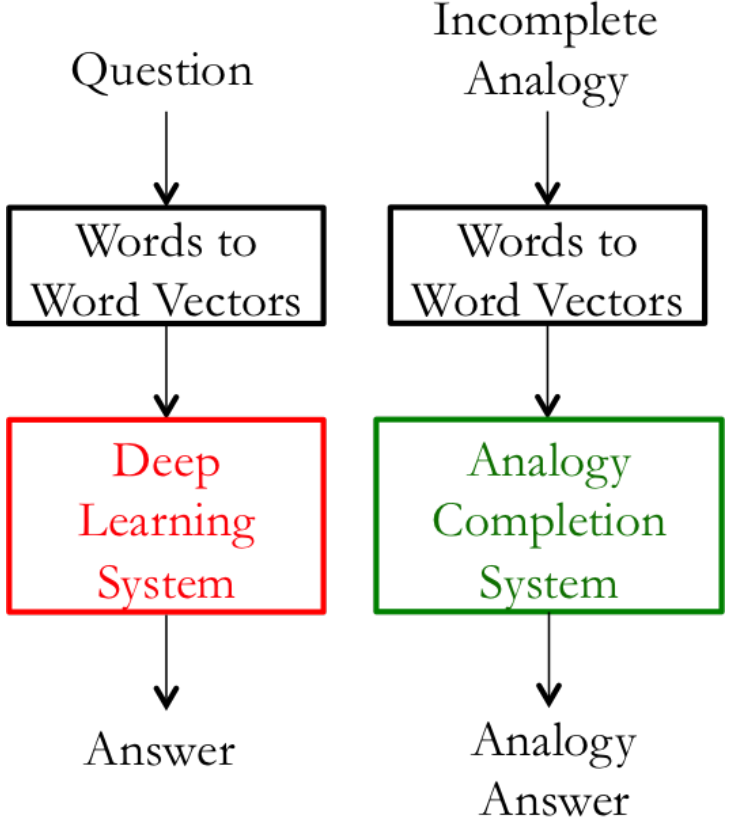

#### 外部评估

词向量的**外部评估(extrinsic evaluation)**是在**实际任务**中对一组生成的词向量的评估。这些任务通常复杂而且计算速度慢。在问答系统的例子中，外部评估系统对问题对应的答案进行评估。通常，优化表现不佳的外部评估系统使我们难以确定哪个特定子系统存在错误，这就需要进一步的内部评估。

#### 内部评估的例子：词类比

一个常用的内部评估的方法是**词向量的类比**。在词向量类比中，给定以下形式的不完整类比：
$$
a : b : : c : ?
$$
然后内部评估系统计算使得以下余弦相似度最大的词向量：
$$
d=\underset{i}{\operatorname{argmax}} \frac{\left(x_{b}-x_{a}+x_{c}\right)^{\text T} x_{i}}{\left\|x_{b}-x_{a}+x_{c}\right\|}
$$
上式的解释如下：理想情况下，我们希望$x_b-x_a=x_d-x_c$(例如，$queen-king=actress-actor$)。这暗含着我们希望$x_b-x_a+x_c=x_d$。因此，我们的目标是寻找向量$x_d$，该向量与$x_b-x_a+x_c$的**余弦相似度最大**。

使用诸如词类比等内部评估技术应该小心处理(考虑到预训练的语料库的各个方面)。例如，考虑以下的类比形式：

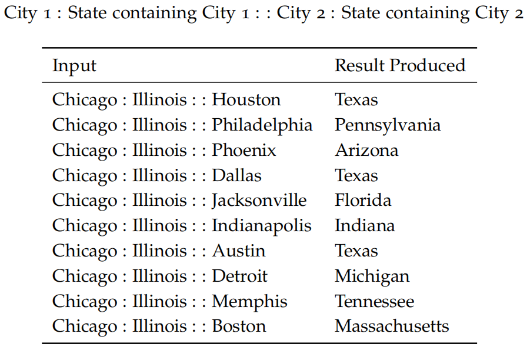

上图是可能受到具有相同名称的不同城市的影响的语义词向量类比(内在评估)。再考虑如下的类比形式：

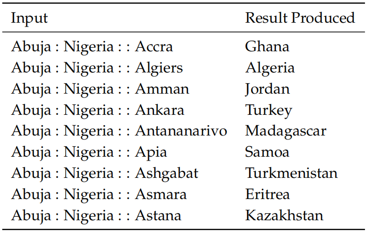

在以上词类比中，一个国家在不同的时期可能有不同首都。前两个例子说明如何使用词向量进行**语义(semantic)**测试，也可以使用词向量进行**语法(syntactic)**测试。以下内部评估测试词向量捕获形容词的**最高级**的能力：

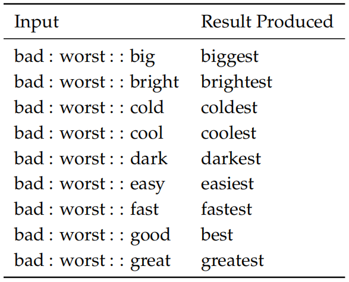

类似地，下图的内部评估展示了测试词向量捕获**过去时态**的能力：

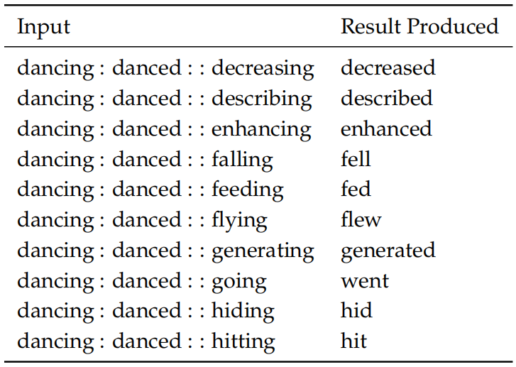

在完成词向量的训练后，可以在NLP任务中直接使用；但也可以在训练外部任务的时候，**重新训练**输入的词向量。我们用于外部评估的词向量是通过一个简单的内部评估来进行优化并初始化。在许多情况下，这些预训练的词向量在外部评估中表现良好。但是，这些预训练的词向量在外部评估中的表现仍然有提高的可能。

然而，重新训练存在着一定的风险。如果我们在外部评估中重新训练词向量，这就需要**外部任务的训练集足够大并能覆盖词汇表中大部分的单词**。这是因为word2vec或GloVe产生的词向量中，原本语义相关测词向量位于单词向量空间的相近的部分，但如果我们在很小的词汇表上重新训练这些词，这些词就会在词空间移动，因此在最终的任务上，模型的表现反而会降低。

### 句子与文档的嵌入

许多机器学习任务要求输入的表示为定长的。word2vec已经能够实现将每个词映射到定长的空间中，但是对于文档或是段落这类长文本，仅依赖于词向量是不够的。一个常用的定长文本特征表示是**词袋模型**，但词袋模型忽略了单词的顺序以及其语法结构。为了解决该问题，Tomas Mikolov在2014年提出了**paragraph vector**[4]，用于从**变长文本(例如句子、段落以及文档)**中学习定长特征表示。该算法通过**预测文档内单词**的方式进行训练，从而能够为每个文档学习出一个定长的“文档向量”。

论文中paragraph vector的学习方式受启发于神经语言模型学习词向量的方式，即通过某个单词$w$的前$k$个单词来预测$w$。其模型示意图如下：

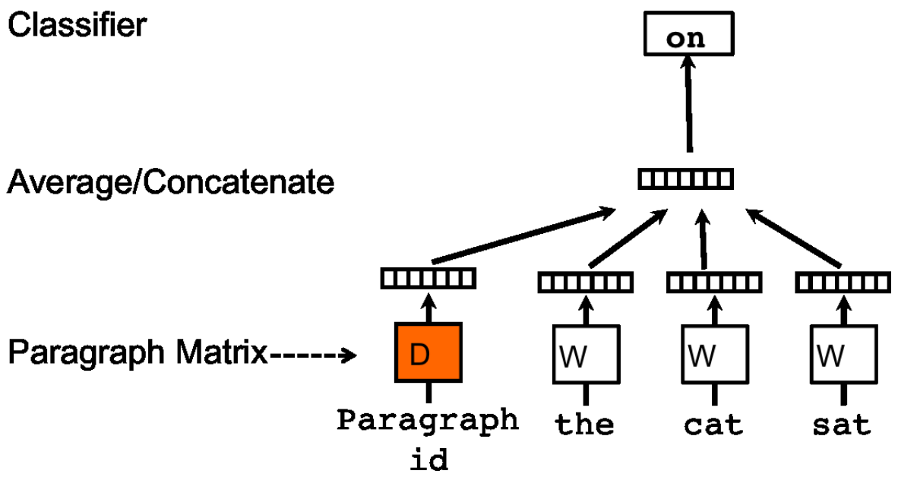

在该模型当中，**每个paragraph被映射为一个单独的向量**，使用矩阵$D$中的一列来表示；**每个词也同样被映射为一个单独的向量**，使用矩阵$W$中的一列来表示。一个文档可以采样出一些上下文，例如图中的“the cat sat on”，而该模型将paragraph vector和“the”、“cat”和“sat”这三个单词的word vectors以拼接或相加的方式组合在一起，用于预测其下一个单词“on”。文档中所采样的上下文长度都是相等的，可以用一个滑动窗口来进行采样。**一个paragraph vector在本paragraph的context预测内是共享的，但是在paragraph之间不共享**。

在训练后，我们得到了word vectors $W$、paragraph vectors $D$以及其他神经网络的权重参数。对于不在语料库中的测试paragraphs，首先随机初始化这些paragraphs的权重参数，然后将其添加到$D$中，再通过和训练时相同的方式训练每个paragraph在$D$中的向量，但保持词向量矩阵$W$和神经网络的**其他参数不变**。在获取其paragraph vector后，便可以用于其他任务，例如文本分类等。

### 使用gensim中的word2vec工具训练词向量

```python
# 语料库选用某IT招聘网站的信息

from gensim.models import Word2Vec
import matplotlib.pyplot as plt
from sklearn.manifold import TSNE

# 需要将数据导入当前目录
f_obj = open('word2vec_data_split.txt', 'r', encoding='utf-8')  # 语料库中的单词被空格分隔
data = f_obj.read()
data = data.split('\n')
print(len(data))  # 85399条数据

# 按空格分离单词串为列表
for i in range(len(data)):
    data[i] = data[i][:-1].split(' ')

# 构建word2vec模型
word2vec_model = Word2Vec(data, size=300, min_count=10, iter=5)  # 300维

# 获取正向词典和反向词典
vocab = {word: index for index, word in enumerate(word2vec_model.wv.index2word)}
reverse_vocab = {index: word for index, word in enumerate(word2vec_model.wv.index2word)}
print(vocab)
print(reverse_vocab)

# 获取词嵌入矩阵
embedding_matrix = word2vec_model.wv.vectors
print('shape of embedded matrix: ', embedding_matrix.shape)  # 词典大小：15368

# 寻找某个单词在向量空间中最近的10个单词
print('most similar top 10 words with "python": ', word2vec_model.wv.most_similar(['python'], topn=10))
print('most similar top 10 words with "产品": ', word2vec_model.wv.most_similar(['产品'], topn=10))
print('most similar top 10 words with "良好": ', word2vec_model.wv.most_similar(['良好'], topn=10))

SAVE_MODEL_PATH = 'word2vec.model'

# 保存模型
word2vec_model.save(SAVE_MODEL_PATH)

# 加载模型
word2vec_model_load = Word2Vec.load(SAVE_MODEL_PATH)
```


### 参考资料

- Mikolov T, Chen K, Corrado G, et al. Efficient estimation of word representations in vector space. arXiv preprint arXiv:1301.3781, 2013.

- Mikolov T, Sutskever I, Chen K, et al. Distributed representations of words and phrases and their compositionality. Advances in neural information processing systems. 2013: 3111-3119.

- Pennington J, Socher R, Manning C D. Glove: Global vectors for word representation. Proceedings of the 2014 conference on empirical methods in natural language processing (EMNLP). 2014: 1532-1543.

- Le Q, Mikolov T. Distributed representations of sentences and documents. International conference on machine learning. 2014: 1188-1196.

- Stanford University CS224n课程官网：http://web.stanford.edu/class/cs224n/

