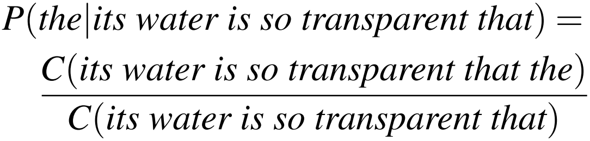
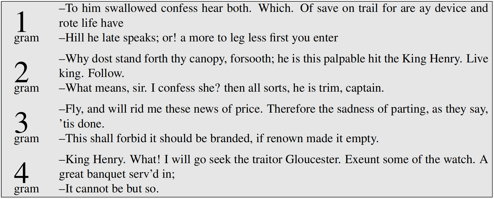
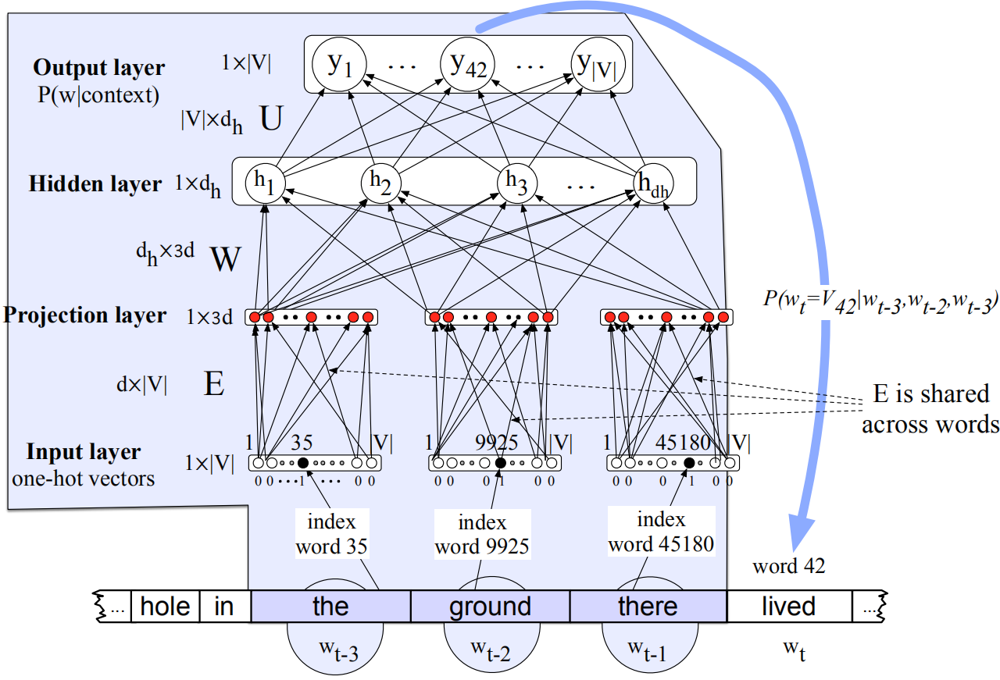

## 语言模型

### N元语法

N元语言模型可以用来**预测一个句子的下一个单词的概率**，或者**计算一个句子的概率**。该模型常用于语音识别、拼写检查以及语法检查等领域。

首先，**一个句子“its water is so transparent that”后出现某一单词“the”的概率**为：




但是由于语料的多样性以及巨大的数量，许多句子不会在语料中出现，并且计数过程会消耗大量的时间。同样，对于**一个句子的概率**进行计算，有：

$$
\begin{aligned}
P(X_{1} \cdots X_{n}) &=P(X_{1}) P(X_{2}|X_{1}) P(X_{3}|X_{1}^{2}) \cdots P(X_{n}|X_{1}^{n-1}) \\
&=\prod_{k=1}^{n} P(X_{k}|X_{1}^{k-1})
\end{aligned}
$$

$$
\begin{aligned}
P(w_{1}^{n}) &=P(w_{1}) P(w_{2}|w_{1}) P(w_{3}|w_{1}^{2}) \cdots P(w_{n}|w_{1}^{n-1}) \\
&=\prod_{k=1}^{n} P(w_{k}|w_{1}^{k-1})
\end{aligned}
$$

应用N-gram语言模型，假设一个单词只由其之前$N-1$个单词决定，可以减少计算量。比如二元语言模型：
$$
P(w_k|w_1^{k-1})=P(w_k|w_{k-1})
$$
二元语言模型的假设也称为**马尔可夫假设**。

根据马尔可夫假设，一个句子的概率计算公式为：
$$
P(w_{1}^{n}) \approx \prod_{k=1}^{n} P(w_{k}|w_{k-1})
$$
上式中，**二元条件概率**$P(w_{k}|w_{k-1})$的计算公式为：
$$
P(w_{k}|w_{k-1})=\frac{C(w_{k-1} w_{k})}{C(w_{k-1})}
$$
在实践中，常常使用**三元语法模型(3-gram language model)**，甚至四元、五元语法模型(当数据量充足时)。实现时，往往对概率取log，将乘法变为加法，提升运算速度。

### 评估语言模型

语言模型的评估分为**外部评估(extrinsic evaluation)**与**内部评估(intrinsic evaluation)**两种。在外部评估中，语言模型被某个应用使用，对语言模型的评估体现在外部应用任务性能的提高上。然而**运行外部NLP系统需要很大开销**，因此**使用内部评估对模型快速进行评估，通常是将语料库划分为训练集和测试集，在训练集上训练语言模型，然后在测试集上进行内部评估**。

**困惑度(perplexity)**常作为评价语言模型的指标：
$$
\begin{aligned}
\operatorname{PP}(W) &=P\left(w_{1} w_{2} \cdots w_{N}\right)^{-\frac{1}{N}} \\
&=\sqrt[N]{\frac{1}{P\left(w_{1} w_{2} \cdots w_{N}\right)}} \\
&=\sqrt[N]{\prod_{i=1}^{N} \frac{1}{P(w_{i}|w_{1} \ldots w_{i-1})}}
\end{aligned}
$$
如果应用二元语法模型，困惑度变为：
$$
\operatorname{PP}(W)=\sqrt[N]{\prod_{i=1}^{N} \frac{1}{P(w_{i}|w_{i-1})}}
$$
根据上式，**最小化困惑度就是最大化测试集的概率**。

### 泛化与未知词汇

N-gram模型与其他统计模型一样依赖于训练语料库。一种含义是**概率模型能够编码给定训练语料库**的事实，另一种含义是**N-gram的效果**随着$N$的增加而增加。

可以使用不同N来生成句子从而在直观上判定不同N-gram模型的效果(语料为莎士比亚文集)：



可以看出，当上下文更长($N$更大)时，生成的句子越连贯。尤其是4-gram生成的语句中，**语句it cannot be but so直接来源于莎士比亚的King John**。

当更换训练语料库后，生成的句子之间几乎没有交叉。因此当训练集和测试集不同时，统计模型的作用会消失。解决方案是，**对需要完成的任务，选取相同体裁的训练语料库对统计语言模型进行训练**。

此外，N-gram语言模型仍然受到**稀疏性(sparsity)**的影响。对于出现频度较高的$N$元短语，模型可能对其概率有一个较好的估计；但是由于**任何语料库都是有限的**，许多自然语言中常见的$N$元短语不会出现在语料库中。因此许多$N$元短语的概率为0，带来**未知词汇(zeros)**问题。因此zeros指的是**在训练集中未出现但是在测试集中出现**$N$元短语的问题。

为解决zeros问题，首先可以考虑测试集中出现的unknown words，即**训练集未出现过的单词**。有些情况下，unknown words不可能发生，我们称之为**closed vocabulary system**，其中测试集中的单词一定来自训练集的lexicon，因此不会出现unknown words。这种假设对于一些领域是合理的，比如语音识别或者机器翻译。

在其他情况下，我们应当处理unknown words问题，或者称为**OOV(out of vocabulary) words**，这种系统称为open vocabulary system。在这种情况下，我们通常添加一个单词\<UNK\>。

有两种方法对包含\<UNK\>的数据集进行训练的方法。第一种方法是学习closed vocabulary：(1) 创建一个字典；(2) 将训练集中不在字典中的单词转换为\<UNK\>；(3) **像计算其他单词的概率一样对\<UNK\>的概率进行计算**。第二种方法针对无法创建先验字典的情况，我们基于训练集中单词出现的频率，将出现次数小于$n$的单词标记为\<UNK\>，然后**将\<UNK\>视为普通单词**。

### 平滑

为防止计算一个语言模型概率为0的情况(通常由zeros导致)，通常采取**平滑(smotthing)**策略。常见平滑策略有：add-1平滑，**add-k平滑**，stupid backoff和**Kneser-Ney平滑**。

#### Laplace Smoothing

最简单的平滑方式称为**拉普拉斯平滑(Laplace smoothing)**，它在现代$N$元语法模型中表现一般，但是为其他平滑方法提供了灵感，并且是一个很有用的baseline。对于一元概率计算：
$$
P(w_{i})=\frac{c_{i}}{N} \quad P_{\text {Laplace }}(w_{i})=\frac{c_{i}+1}{N+V}
$$
因此Laplace平滑也称add-1平滑。对于二元概率计算：
$$
P(w_{n} \mid w_{n-1})=\frac{C(w_{n-1} w_{n})}{C(w_{n-1})} \quad P_{\text {Laplace }}^{*}(w_{n}|w_{n-1})=\frac{C(w_{n-1} w_{n})+1}{\sum_{w}(C(w_{n-1} w)+1)}=\frac{C(w_{n-1} w_{n})+1}{C(w_{n-1})+V}
$$

#### Add-k Smoothing

add-k平滑将add-1平滑中的系数改为$k$：
$$
P_{\text{Add-} k}^{*}(w_{n}|w_{n-1})=\frac{C(w_{n-1} w_{n})+k}{C(w_{n-1})+kV}
$$
其中，$k$是一个超参数，可以通过交叉验证优化。

### 神经语言模型

神经网络可以用作语言模型，以预测一个单词序列后的下一个单词。经大量实验表明，**神经语言模型在效果上超过N-gram语言模型，但是训练速度较慢**。在某些应用中，N-gram仍然是值得使用的工具。作为神经语言模型的网络结构如下图所示：



神经语言模型通过预测下一个单词的方式进行训练，不断调整网络内部的参数，为每个单词学得一个嵌入表示，从而捕获单词之间的关系。

该模型解决了$n$元语言模型的**稀疏性和存储问题**，但是依然有以下的问题：

(1) fixed window太小；

(2) 如果扩大window大小的话，参数矩阵$W$的大小也会扩大，而**window can never be large enough**；

(3) 每个输入$x$不共享$W$中的参数，而是于不同的行相乘。

以上三个问题通过使用**循环神经网络(recurrent neural network)**可以得到解决。

### Tensorflow实现神经语言模型

```python
import numpy as np
import tensorflow as tf
from sklearn.model_selection import train_test_split

# 读取数据，需要将数据导入当前目录
data_path = 'nnlm_comments_data.txt'
with open(data_path, 'r', encoding='utf-8') as f:
    lines = f.read().split('评论')

for i in range(len(lines)):
    lines[i] = lines[i].strip().split(' ')[:-1]

# 构建数据词典
word_index = {}
word_idx = 0
for i in range(len(lines)):
    for j in range(len(lines[i])):
        if lines[i][j] not in word_index.keys():
            word_index[lines[i][j]] = word_idx
            word_idx += 1
word_index['[END]'] = len(word_index.keys())

# 构建反向词典
index_word = {word_index[word]: word for word in word_index.keys()}

# 构建训练数据，每生成一个词时，考虑前四个词
lines_index = []
for i in range(len(lines)):
    lines[i].append('[END]')
    line_index = [word_index[word] for word in lines[i]]
    lines_index.append(line_index)

X_data = []
y_data = []
for i in range(len(lines_index)):
    if len(lines_index[i]) > 4:
        for j in range(0, len(lines_index[i]) - 4):
            X_data.append(lines_index[i][j:j + 4])
            y_data.append(lines_index[i][j + 4])

X_data = np.array(X_data)
y_data = np.array(y_data)
print(X_data.shape, y_data.shape)

X_train, X_test, y_train, y_test = train_test_split(X_data, y_data)
print(X_train.shape, y_train.shape, X_test.shape, y_test.shape)
X_train = X_train[:100000]
X_test = X_test[:10000]
y_train = y_train[:100000]
y_test = y_test[:10000]

# 将数据转化为tf.data.Dataset格式
train_ds = tf.data.Dataset.from_tensor_slices((X_train, y_train)).shuffle(10000).batch(64)
test_ds = tf.data.Dataset.from_tensor_slices((X_test, y_test)).batch(64)


# 定义NNLM模型
class NNLM(tf.keras.models.Model):
    def __init__(self, vocab_size, embedding_dim, hidden_size):
        super(NNLM, self).__init__()
        self.embed_layer = tf.keras.layers.Embedding(vocab_size, embedding_dim, mask_zero=True)
        self.reshape_layer = tf.keras.layers.Reshape((-1,))
        self.fc_layer = tf.keras.layers.Dense(hidden_size, activation='relu')
        self.out_layer = tf.keras.layers.Dense(vocab_size)

    def call(self, x):
        # x shape: (batch_size, seq_len:4)
        embed = self.embed_layer(x)  # (batch_size, seq_len:4, embedding_dim)
        reshape = self.reshape_layer(embed)  # (batch_size, seq_len * embedding_dim)
        fc = self.fc_layer(reshape)  # (batch_size, hidden_size)
        out = self.out_layer(fc)  # (batch_size, vocab_size)
        return out


# 网络参数
vocab_size = len(index_word.keys())
embedding_dim = 256
hidden_size = 256
batch_size = 128

# 定义NNLM对象
nnlm = NNLM(vocab_size, embedding_dim, hidden_size)

# 定义优化器与损失函数
optimizer = tf.keras.optimizers.Adam()
loss_function = tf.keras.losses.SparseCategoricalCrossentropy(from_logits=True)
# 记录每个epoch的平均loss
train_loss = tf.keras.metrics.Mean(name='train_loss')
test_loss = tf.keras.metrics.Mean(name='test_loss')


# 定义训练步
# @tf.function
def train_step(batch_X, batch_y):
    with tf.GradientTape() as tape:
        predictions = nnlm(batch_X)
        loss = loss_function(batch_y, predictions)
    gradients = tape.gradient(loss, nnlm.trainable_variables)
    optimizer.apply_gradients(zip(gradients, nnlm.trainable_variables))

    train_loss(loss)


# 定义测试步
# @tf.function
def test_step(batch_X, batch_y):
    predictions = nnlm(batch_X)
    loss = loss_function(batch_y, predictions)

    test_loss(loss)


EPOCHS = 5  # 训练轮次

for epoch in range(EPOCHS):
    # 每个epoch开始时将指标重置
    train_loss.reset_states()
    test_loss.reset_states()

    for batch_X, batch_y in train_ds:
        train_step(batch_X, batch_y)

    for batch_X, batch_y in test_ds:
        test_step(batch_X, batch_y)

    template = 'Epoch {}, Loss: {}, Test Loss: {}'
    print(template.format(epoch + 1, train_loss.result(), test_loss.result()))

# 使用NNLM生成句子：从前四个单词出发，生成第五个单词，然后后取第2-5个单词，生成第六个单词，以此类推
```

### 参考资料

- Dan Jurafsky, H. Martin. Speech and Language Processing(3rd ed. draft).

- Bengio Y, Ducharme R, Vincent P, et al. A neural probabilistic language model. Journal of machine learning research, 2003, 3(Feb): 1137-1155.

- Stanford University CS224n课程官网：http://web.stanford.edu/class/cs224n/

