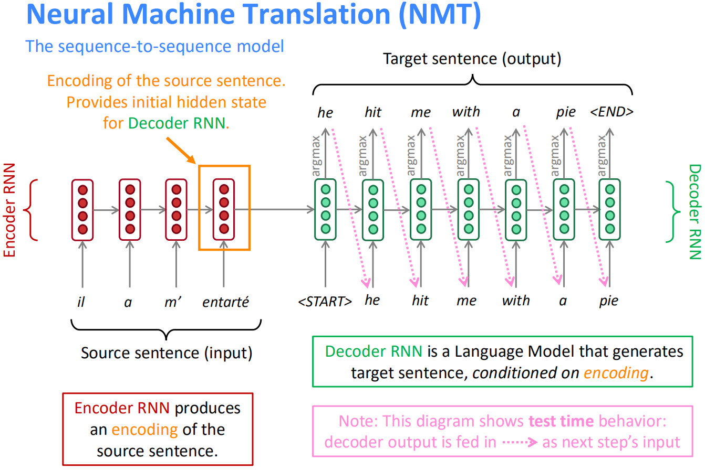
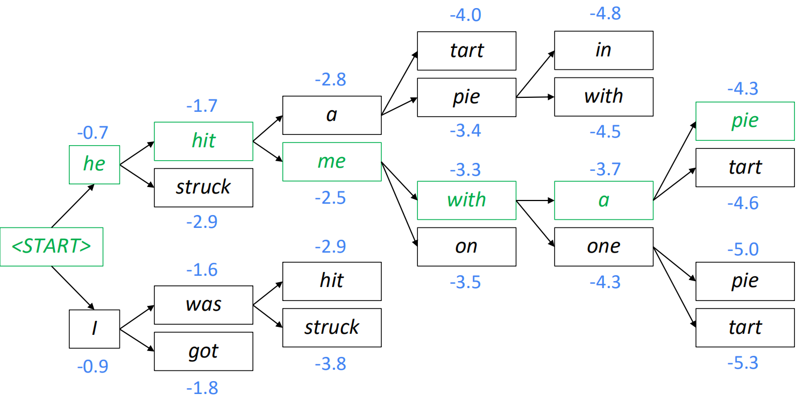
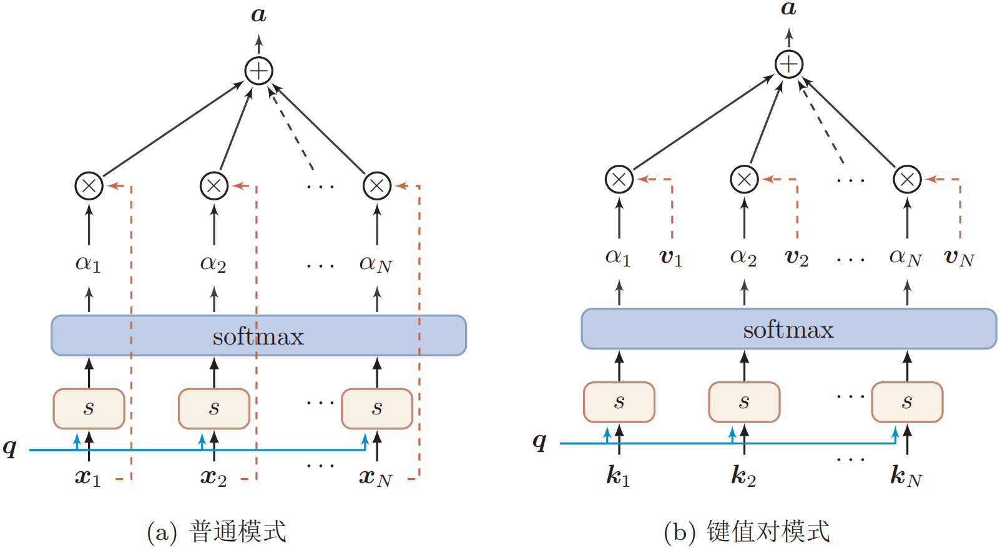
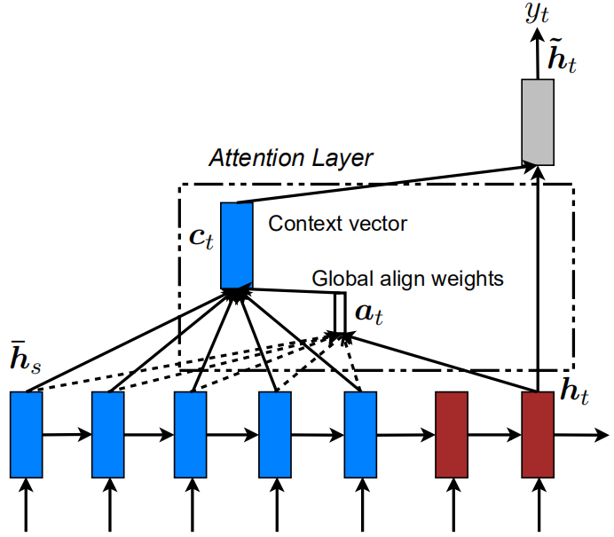
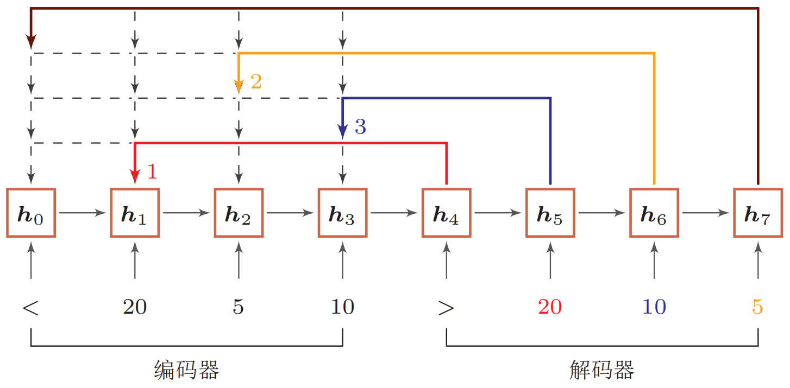
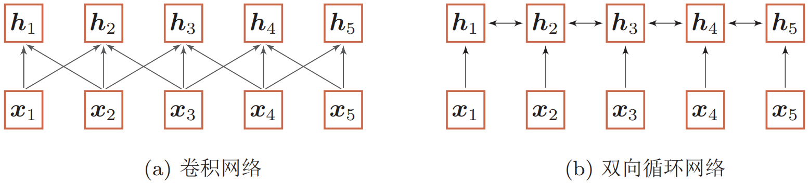

## seq2seq与attention

### 序列到序列模型

许多单输出问题得以解决，比如命名实体识别、单词预测等。然而许多任务的输出是一个**序列**，比如机器翻译、对话系统以及自动摘要等。这种问题应当使用seq2seq实现。

**序列到序列，或者seq2seq**，是一个比较新的模型，在2014年被提出用于**英语-法语翻译**。在更高的层面上，seq2seq是一个**由两个循环神经网络组成的端到端模型**：

(1) 一个**编码器(encoder)**，将模型的输入序列作为输入，然后编码固定大小的“上下文向量”。

(2) 一个**解码器(decoder)**，使用来自解码器生成的上下文向量作为从其生成输出序列的“种子”。

因此，seq2seq模型通常被称为“**编码器-解码器模型**”。其示意图如下：



首先，编码器将输入句子编码为一个**隐含层向量**作为整个输入句子的嵌入向量，然后将该向量作为解码器的**初始隐含层向量**，输入一个\<START\>特殊标记，通过**自回归**的方式不断生成单词，直到生成\<END\>符号，或者达到长度限制为止。以上decoder生成(测试)句子的方式为**greedy decoding**，即**每次选取输出softmax值最大的单词**。

greedy decoding的缺陷是无法undo decision，即**一步错，步步错**。解决方案是**beam search**，即explore several hypotheses and select the best one。On each step of decoder, keep track of the k(beam size) most probable partial translations。beam search相当于**全局搜索的剪枝过程**，其不保证找到最优解，但是效果更好。beam size为2的情况如下：



### 注意力机制

当人们听到句子“the ball is on the field”，人们不会认为这6个单词都一样重要，而是首先会注意到“ball”，“on” 和 “field”，因为这些单词是人们觉得最重要的。类似的，Bahdanau等人注意到**使用RNN的最终状态作为seq2seq模型的单个“上下文向量”的缺点**：**输入的不同部分具有不同的重要程度**。再者，**输出的不同部分甚至可以考虑输入的不同部分“重要”**。例如，在翻译任务中，输出的第一个单词是一般是基于输入的前几个词，输出的最后几个词可能基于输入的后几个词。

**注意力机制(attention mechanism)**的核心思想：on each step of the decoder, focus on a particular part of the source sequence。

#### 认知神经学中的注意力

注意力是一种人类不可或缺的复杂认知功能，指人可以在关注一些信息的同时忽略另一些信息的选择能力。在日常生活中，我们通过视觉、听觉等方式接收大量的感觉输入。但是人脑还能在这些外界的信息轰炸中有条不紊地工作，是因为人脑可以有意或无意地从这些大量输入信息中选择小部分的有用信息来重点处理，并忽略其他信息。这种能力就叫做**注意力(attention)**。注意力可以作用在外部的刺激(听觉、视觉、味觉等)，也可以作用在内部的意识(思考、回忆等)。注意力一般分为两种：

(1) **聚焦式注意力(focus attention)**：有预定目的、依赖任务的，主动有意识地聚焦于某一对象的注意力。

(2) **显著性注意力(saliency-based attention)**：由外界刺激驱动的注意，不需要主动干预，也和任务无关。如果一个对象的刺激信息不同于其周围信息，一种无意识的“赢者通吃”(winner-take-all)或者门控(gating)机制就可以把注意力转向这个对象。不管这些注意力是有意还是无意，大部分的人脑活动都需要依赖注意力，比如记忆信息、阅读或思考等。

一个和注意力有关的例子是**鸡尾酒会效应**。当一个人在吵闹的鸡尾酒会上和朋友聊天时，尽管周围噪音干扰很多，他还是可以听到朋友的谈话内容，而忽略其他人的声音(聚焦式注意力)。同时，如果未注意到的背景声中有重要的词(比如他的名字)，他会马上注意到(显著性注意力)。

聚焦式注意力一般会随着环境、情景或任务的不同而选择不同的信息。比如当要从人群中寻找某个人时，我们会专注于每个人的脸部；而当要统计人群的人数时，我们只需要专注于每个人的轮廓。

#### 人工神经网络中的注意力机制

当用神经网络来处理大量的输入信息时，也可以借鉴人脑的注意力机制，只选择一些关键的信息输入进行处理，来提高神经网络的效率。在目前的神经网络模型中，我们可以将**最大汇聚(max pooling)**、**门控(gating)机制**近似地看作是自下而上的基于显著性的注意力机制。除此之外，自上而下的聚焦式注意力也是一种有效的信息选择方式。以阅读理解任务为例，给定一篇很长的文章，然后就此文章的内容进行提问。提出的问题只和段落中的一两个句子相关，其余部分都是无关的。为了减小神经网络的计算负担，**只需要把相关的片段挑选出来让后续的神经网络来处理**，而不需要把所有文章内容都输入给神经网络。

用$X=[\boldsymbol x_1, \cdots, \boldsymbol x_N]$表示$N$组输入信息，其中每个向量$\boldsymbol x_i$都表示**一组输入信息**。为了节省计算资源，**不需要将所有信息都输入到神经网络**，只需要从$X$中**选择一些和任务相关的信息**。注意力机制的计算可以分为两步：一是在所有输入信息上计算**注意力分布**，二是根据注意力分布来计算**输入信息的加权平均**。

(1) **注意力分布**

为了从$N$个输入向量中$[\boldsymbol x_1, \cdots, \boldsymbol x_N]$选择出**和某个特定任务相关的信息**，我们需要引入一个**和任务相关的表示**，称为**查询向量(query vector)**，并通过一个**打分函数**来计算每个输入向量和查询向量之间的**相关性**。

给定一个和任务相关的查询向量$\boldsymbol q$(可以是**动态生成**的，也可以是**可学习的参数**)，我们用注意力变量$z \in [1,N]$来表示被选择信息的**索引位置**，即$z=i$表示选择了第$i$个输入向量。为了方便计算，我们采用一种“**软性**”的信息选择机制。首先计算在给定和$\boldsymbol q$和$X$下，选择第$i$个输入向量的**概率**$\alpha_i$：
$$
\begin{aligned}
\alpha_{i} &=p(z=i|X, \boldsymbol{q}) \\
&=\operatorname{softmax}(s(\boldsymbol{x}_{i}, \boldsymbol{q})) \\
&=\frac{\exp (s(\boldsymbol{x}_{i}, \boldsymbol{q}))}{\sum_{j=1}^{N} \exp (s(\boldsymbol{x}_{j}, \boldsymbol{q}))}
\end{aligned}
$$
其中$\alpha_i$称为**注意力分布(attention distribution)**，$s(\boldsymbol x_i,\boldsymbol q)$为**注意力打分函数**，其衡量了查询$\boldsymbol q$和输入$\boldsymbol x_i$的**相关性**，可以使用以下几种方式来计算：

**加性模型**：$s(\boldsymbol{x}_{i}, \boldsymbol{q})=\boldsymbol{v}^{\mathrm{T}} \tanh (W \boldsymbol{x}_{i}+U \boldsymbol{q})$

**点积模型**：$s(\boldsymbol{x}_{i}, \boldsymbol{q})=\boldsymbol{x}_{i}^{\mathrm{T}} \boldsymbol{q}$

**缩放点积模型**：$s(\boldsymbol{x}_{i}, \boldsymbol{q})=\boldsymbol{x}_{i}^{\mathrm{T}} \boldsymbol{q}/\sqrt d$

**双线性模型**：$s(\boldsymbol{x}_{i}, \boldsymbol{q})=\boldsymbol{x}_{i}^{\mathrm{T}} W \boldsymbol{q}$

其中$W,U,\boldsymbol v$为**可学习的参数**，$d$为**输入向量的维度**。理论上，加性模型和点积模型的复杂度差不多，但是**点积模型在实现上可以更好地利用矩阵乘积，从而计算效率更高**。但当输入向量的维度$d$比较高时，点积模型的值通常有**比较大的方差**，从而导致**softmax函数的梯度会比较小**。因此，**缩放点积模型可以较好地解决这个问题**。双线性模型可以看做是一种**泛化的点积模型**。

(2) **加权平均**

注意力分布$\alpha_i$可以解释为在给定任务相关的查询$\boldsymbol q$时，第$i$个**输入向量受关注的程度**。我们采用一种“软性”的信息选择机制对输入信息进行汇总：
$$
\begin{aligned}
\operatorname{att}(X, \boldsymbol{q}) &=\sum_{i=1}^{N} \alpha_{i} \boldsymbol{x}_{i} \\
&=\mathbb{E}_{z \sim p(z| X, \boldsymbol{q})}[\boldsymbol{x}_{z}]
\end{aligned}
$$
上式称为**软性注意力机制(soft attention mechanism)**，下图给出了软性注意力机制的示意。



#### 注意力机制的变体

(1) **硬性注意力**：上文中的注意力机制为soft attention，其选择的信息是所有输入向量在注意力分布下的期望。而hard attention**只关注某一个输入向量**。硬性注意力有两种实现方式，一种是**选取最高概率的一个输入向量**，另一种是**在注意力分布式上随机采样**。硬性注意力的缺点是损失函数与注意力分布间的函数不可导，因此**无法使用反向传播进行训练**。因此一般使用软性注意力来代替硬性注意力。 硬性注意力需要通过强化学习进行训练。

(2) **键值对注意力**：更一般地，我们可以用**键值对(key-value pair)格式**来表示**输入信息**，其中“键”用来计算注意力分布$\alpha_i$，“值”用来计算聚合信息。

用$(K, V)=[(\boldsymbol{k}_{1}, \boldsymbol{v}_{1}), \cdots,(\boldsymbol{k}_{N}, \boldsymbol{v}_{N})]$表示$N$组输入信息，给定任务相关的查询向量$\boldsymbol q$时，注意力函数为：
$$
\begin{aligned}
\operatorname{att}((K, V), \boldsymbol{q}) &=\sum_{i=1}^{N} \alpha_{i} \boldsymbol{v}_{i} \\
&=\sum_{i=1}^{N} \frac{\exp (s(\boldsymbol{k}_{i}, \boldsymbol{q}))}{\sum_{j} \exp (s(\boldsymbol{k}_{j}, \boldsymbol{q}))} \boldsymbol{v}_{i}
\end{aligned}
$$
其中$s(\boldsymbol{k}_{i}, \boldsymbol{q})$为打分函数。当$K=V$时，键值对模式就等价于普通的注意力机制。

(3) **多头注意力**：多头注意力(multi-head attention)是利用**多个查询**$Q = [\boldsymbol q_1,\cdots,\boldsymbol q_M]$来平行地计算从输入信息中选取多组信息。**每个注意力关注输入信息的不同部分**。
$$
\operatorname{att}((K, V), Q)=\operatorname{att}((K, V), \boldsymbol{q}_{1}) \oplus \cdots \oplus \operatorname{att}((K, V), \boldsymbol{q}_{M})
$$
其中$\oplus$表示**向量拼接**。

(4) **结构化注意力**：之前，我们假设所有的输入信息是同等重要的，是一种扁平结构，注意力分布实际上是在所有输入信息上的多项分布。但若输入信息本身具有层次结构，如文本可以分为词、句子、段落等不同粒度层次，我们可以使用层次化注意力进行更好的信息选择。

### 注意力机制在序列模型中的应用

#### seq2seq中的注意力机制

以机器翻译这一seq2seq任务为例，论文[1]和[2]设计了如下所示的global attention机制：



在每个时间步$t$，计算解码器当前时间步的输出$\boldsymbol h_t$和所有编码器隐含状态$\boldsymbol{\bar h}_s$的得分函数，并得到权重向量$\boldsymbol a_t$。然后将编码器每个时间步的输出与$\boldsymbol a_t$进行加权平均，得到上下文向量$\boldsymbol c_t$。公式描述如下：
$$
\operatorname{score}(\boldsymbol{h}_{t}, {\bar{\boldsymbol h}}_{s})=\left\{\begin{array}{l}
\boldsymbol{h}_{t}^{\text{T}} \boldsymbol{W} {\bar{\boldsymbol h}}_{s} \\

\boldsymbol{v}_{a}^{\text{T}} \tanh (\boldsymbol{W}_{1} \boldsymbol{h}_{t}+\boldsymbol{W}_{2} {\bar{\boldsymbol h}}_{s})
\end{array}\right. \ \ \ \ \ \ \ [\text{score function}]\\
\alpha_{ts}=\frac{\exp (\operatorname{score}(\boldsymbol{h}_{t}, {\boldsymbol{\bar h}}_{s}))}{\sum_{s^{\prime}=1}^{S} \exp (\operatorname{score}(\boldsymbol{h}_{t}, {\boldsymbol{\bar h}}_{s^{\prime}}))} \ \ \ \ \ \ \ [\text{attention weights}]\\

c_{t}=\sum_{s} \alpha_{t s} \bar{\boldsymbol h}_{s} \ \ \ \ \ \ \ [\text{context vector}]\\

\boldsymbol{a}_{t}=f(\boldsymbol{c}_{t}, \boldsymbol{h}_{t})=\tanh (\boldsymbol{W}_{\boldsymbol{c}}[\boldsymbol{c}_{t} ; \boldsymbol{h}_{t}]) \ \ \ \ \ \ \ [\text{attention vector}]
$$

#### 指针网络

注意力机制主要是用来做信息筛选，从输入信息中选取相关的信息。注意力机制可以分为两步：一是计算**注意力分布**$\alpha$，二是根据$\alpha$来计算输入**信息的加权平均**。我们可以只利用注意力机制中的第一步，将注意力分布作为一个**软性的指针(pointer)**来指出相关信息的位置。

**指针网络(pointer network)**[3]是一种**序列到序列模型**，输入是长度为$n$的向量序列$X=\boldsymbol x_1,\cdots,\boldsymbol x_n$，输出是**下标序列**$c_{1:m}=c_1,c_2,\cdots,c_m,c_i \in [1,n],\forall i$。和一般的序列到序列任务不同，这里的输出序列是输入序列的下标(索引)。比如输入一组乱序的数字，输出为按大小排序的输入数字序列的下标。比如输入为20*,* 5*,* 10，输出为1*,* 3*,* 2。

条件概率$p(c_{1: m}|\boldsymbol{x}_{1: n})$可以写为：
$$
\begin{aligned}
p(c_{1: m}|\boldsymbol{x}_{1: n}) &=\prod_{i=1}^{m} p(c_{i}|c_{1: i-1}, \boldsymbol{x}_{1: n}) \\
& \approx \prod_{i=1}^{m} p(c_{i}|\boldsymbol{x}_{c_{1}}, \cdots, \boldsymbol{x}_{c_{i-1}}, \boldsymbol{x}_{1: n})
\end{aligned}
$$
其中条件概率$p(c_{i} \mid \boldsymbol{x}_{c_{1}}, \cdots, \boldsymbol{x}_{c_{i-1}}, \boldsymbol{x}_{1: n})$可以通过**注意力分布**来计算。假设用一个循环神经网络对$\boldsymbol{x}_{c_{1}}, \cdots, \boldsymbol{x}_{c_{i-1}}, \boldsymbol{x}_{1: n}$进行编码得到向量$\boldsymbol h_i$，则
$$
p\left(c_{i} \mid c_{1: i-1}, \boldsymbol{x}_{1: n}\right)=\operatorname{softmax}(s_{i, j})
$$
其中$s_{i,j}$为在解码过程的第$i$步时，每个输入向量的为归一化的注意力分布，即
$$
s_{i, j}=\boldsymbol{v}^{\mathrm{T}} \tanh (W \boldsymbol{x}_{j}+U \boldsymbol{h}_{i}), \forall j \in[1, n]
$$
其中$\boldsymbol v,W,U$为可学习的参数。下图给出了指针网络的示例。



#### 自注意力机制

当使用神经网络来处理一个变长的向量序列时，我们通常可以使用卷积网络[4]或循环网络进行编码来得到一个相同长度的输出向量序列，如下图所示：



**基于卷积或循环网络的序列编码都可以看做是一种局部的编码方式**，只建模了**输入信息的局部依赖关系**。虽然循环网络理论上可以建立长距离依赖关系，但是由于信息传递的容量以及梯度消失问题，**实际上也只能建立短距离依赖关系**。

如果要建立输入序列之间的长距离依赖关系，可以使用以下两种方法：一种方法是**增加网络的层数**，通过一个深层网络来获取远距离的信息交互；另一种方法是使用**全连接网络**。全连接网络是一种非常直接的建模远距离依赖的模型，但是**无法处理变长的输入序列**。不同的输入长度，其连接权重的大小也是不同的。这时我们就可以利用注意力机制来**“动态”地生成不同连接的权重**，这就是**自注意力模型(self-attention model)**。

### 序列生成模型的评价指标

(1) 困惑度：计算测试集合中的句子的联合概率。联合概率越高，困惑度越低，表明生成的句子效果越好。

(2) BELU(bilingual evaluation understudy)：衡量模型生成序列和参考序列之间的N-gram重合度。

(3) ROUGE(recall-oriented understudy for gisting evaluation)：和BLEU相似，但计算的是召回率。

### Tensorflow实现Seq2Seq+Attention完成机器翻译任务

```python
import tensorflow as tf

import matplotlib.pyplot as plt
import matplotlib.ticker as ticker
from sklearn.model_selection import train_test_split

import unicodedata
import re
import numpy as np
import jieba
import os


def process_english(w):
    # creating a space between a word and the punctuation following it
    # eg: "he is a boy." => "he is a boy ."
    # Reference:- https://stackoverflow.com/questions/3645931/python-padding-punctuation-with-white-spaces-keeping-punctuation
    w = re.sub(r"([?.!,¿])", r" \1 ", w)

    # replacing everything with space except (a-z, A-Z, ".", "?", "!", ",")
    w = re.sub(r"[^a-zA-Z?.!,¿';]+", " ", w)
    w = w.strip()

    # adding a start and an end token to the sentence
    # so that the model know when to start and stop predicting.
    w = '<start> ' + w + ' <end>'
    return w


def process_chinese(w):
    seg_list = jieba.cut(w)  # word segmentation by jieba
    w = " ".join(seg_list)
    w = w.strip()
    w = '<start> ' + w + ' <end>'
    return w


print(process_english("I'm a good boy!"))
print(process_chinese('我只是一個甜甜的男孩子。'))

# 读取并处理数据(需要将数据导入当前目录)
data_path = 'seq2seq_attention_data.txt'

file = open(data_path, 'r', encoding='utf-8')
lines = file.readlines()

english = []
chinese = []
for i in range(len(lines)):
    eng, chi, _ = lines[i].split('\t')
    english.append(process_english(eng))
    chinese.append(process_chinese(chi))

print(len(english))
print(len(chinese))
print(english[10000])
print(chinese[10000])


def tokenize(lang):
    # convert texts to sequences of word index
    lang_tokenizer = tf.keras.preprocessing.text.Tokenizer(filters='')
    lang_tokenizer.fit_on_texts(lang)
    tensor = lang_tokenizer.texts_to_sequences(lang)
    tensor = tf.keras.preprocessing.sequence.pad_sequences(tensor, padding='post')

    return tensor, lang_tokenizer


input_tensor, inp_lang_tokenizer = tokenize(english)  # english
target_tensor, targ_lang_tokenizer = tokenize(chinese)  # chinese

# calculate max_length of the target tensors
max_length_targ, max_length_inp = target_tensor.shape[1], input_tensor.shape[1]

# creating training and validation sets using an 80-20 split
input_tensor_train, input_tensor_val, target_tensor_train, target_tensor_val = train_test_split(input_tensor, target_tensor, test_size=0.2)

# show length, 18755 train sample, 4689 test sample
print(len(input_tensor_train), len(target_tensor_train), len(input_tensor_val), len(target_tensor_val))

# create a tf.data dataset
BUFFER_SIZE = len(input_tensor_train)
BATCH_SIZE = 64
steps_per_epoch = len(input_tensor_train) // BATCH_SIZE
embedding_dim = 300
units = 512
vocab_inp_size = len(inp_lang_tokenizer.word_index) + 1
vocab_tar_size = len(targ_lang_tokenizer.word_index) + 1

dataset = tf.data.Dataset.from_tensor_slices((input_tensor_train, target_tensor_train)).shuffle(BUFFER_SIZE)
dataset = dataset.batch(BATCH_SIZE, drop_remainder=True)
example_input_batch, example_target_batch = next(iter(dataset))
print(example_input_batch.shape, example_target_batch.shape)


# model architecture
class Encoder(tf.keras.Model):
    def __init__(self, vocab_size, embedding_dim, enc_units, batch_sz):
        super(Encoder, self).__init__()
        self.batch_sz = batch_sz
        self.enc_units = enc_units
        self.embedding = tf.keras.layers.Embedding(vocab_size, embedding_dim, mask_zero=True)
        self.gru = tf.keras.layers.GRU(self.enc_units,
                                       return_sequences=True,
                                       return_state=True,
                                       recurrent_initializer='glorot_uniform')

    def call(self, x, hidden):
        x = self.embedding(x)
        output, state = self.gru(x, initial_state=hidden)
        return output, state

    def initialize_hidden_state(self):
        return tf.zeros((self.batch_sz, self.enc_units))


encoder = Encoder(vocab_inp_size, embedding_dim, units, BATCH_SIZE)

# sample input
sample_hidden = encoder.initialize_hidden_state()
sample_output, sample_hidden = encoder(example_input_batch, sample_hidden)
print('Encoder output shape: (batch size, sequence length, units) {}'.format(sample_output.shape))
print('Encoder Hidden state shape: (batch size, units) {}'.format(sample_hidden.shape))


class BahdanauAttention(tf.keras.layers.Layer):
    def __init__(self, units):
        super(BahdanauAttention, self).__init__()
        self.W1 = tf.keras.layers.Dense(units)
        self.W2 = tf.keras.layers.Dense(units)
        self.V = tf.keras.layers.Dense(1)

    def call(self, query, values):
        # query hidden state shape == (batch_size, hidden size)
        # query_with_time_axis shape == (batch_size, 1, hidden size)
        # values shape == (batch_size, max_len, hidden size)
        # we are doing this to broadcast addition along the time axis to calculate the score
        query_with_time_axis = tf.expand_dims(query, 1)

        # score shape == (batch_size, max_length, 1)
        # we get 1 at the last axis because we are applying score to self.V
        # the shape of the tensor before applying self.V is (batch_size, max_length, units)
        score = self.V(tf.nn.tanh(self.W1(query_with_time_axis) + self.W2(values)))

        # attention_weights shape == (batch_size, max_length, 1)
        attention_weights = tf.nn.softmax(score, axis=1)

        # context_vector shape after sum == (batch_size, hidden_size)
        context_vector = attention_weights * values
        context_vector = tf.reduce_sum(context_vector, axis=1)

        return context_vector, attention_weights


attention_layer = BahdanauAttention(10)
attention_result, attention_weights = attention_layer(sample_hidden, sample_output)

print("Attention result(context vector) shape: (batch size, units) {}".format(attention_result.shape))
print("Attention weights shape: (batch_size, sequence_length, 1) {}".format(attention_weights.shape))


class Decoder(tf.keras.Model):
    def __init__(self, vocab_size, embedding_dim, dec_units, batch_sz):
        super(Decoder, self).__init__()
        self.batch_sz = batch_sz
        self.dec_units = dec_units
        self.embedding = tf.keras.layers.Embedding(vocab_size, embedding_dim, mask_zero=True)
        self.gru = tf.keras.layers.GRU(self.dec_units,
                                       return_sequences=True,
                                       return_state=True,
                                       recurrent_initializer='glorot_uniform')
        self.fc = tf.keras.layers.Dense(vocab_size)

        # used for attention
        self.attention = BahdanauAttention(self.dec_units)

    def call(self, x, hidden, enc_output):
        # enc_output shape == (batch_size, max_length, hidden_size)
        context_vector, attention_weights = self.attention(hidden, enc_output)
        # x shape after passing through embedding == (batch_size, 1, embedding_dim)
        x = self.embedding(x)
        # x shape after concatenation == (batch_size, 1, embedding_dim + hidden_size)
        x = tf.concat([tf.expand_dims(context_vector, 1), x], axis=-1)
        # passing the concatenated vector to the GRU
        output, state = self.gru(x)
        # output shape == (batch_size * 1, hidden_size)
        output = tf.reshape(output, (-1, output.shape[2]))
        # output shape == (batch_size, vocab)
        x = self.fc(output)

        return x, state, attention_weights


decoder = Decoder(vocab_tar_size, embedding_dim, units, BATCH_SIZE)
sample_decoder_output, _, _ = decoder(tf.random.uniform((BATCH_SIZE, 1)), sample_hidden, sample_output)
print('Decoder output shape: (batch_size, vocab size) {}'.format(sample_decoder_output.shape))

# define the optimizer and the loss function
optimizer = tf.keras.optimizers.Adam()
loss_object = tf.keras.losses.SparseCategoricalCrossentropy(from_logits=True, reduction='none')


def loss_function(real, pred):
    mask = tf.math.logical_not(tf.math.equal(real, 0))
    loss_ = loss_object(real, pred)

    mask = tf.cast(mask, dtype=loss_.dtype)
    loss_ *= mask

    return tf.reduce_mean(loss_)


checkpoint_dir = './training_checkpoints'
checkpoint_prefix = os.path.join(checkpoint_dir, "ckpt")
checkpoint = tf.train.Checkpoint(optimizer=optimizer, encoder=encoder, decoder=decoder)


# training
# 1. pass the input through the encoder which return encoder output and the encoder hidden state.
# 2. the encoder output, encoder hidden state and the decoder input (which is the start token) is passed to the decoder.
# 3. the decoder returns the predictions and the decoder hidden state.
# 4. the decoder hidden state is then passed back into the model and the predictions are used to calculate the loss.
# 5. use teacher forcing to decide the next input to the decoder.
# 6. teacher forcing is the technique where the target word is passed as the next input to the decoder.
# 7. the final step is to calculate the gradients and apply it to the optimizer and backpropagate.
@tf.function
def train_step(inp, targ, enc_hidden):
    loss = 0

    with tf.GradientTape() as tape:
        enc_output, enc_hidden = encoder(inp, enc_hidden)
        dec_hidden = enc_hidden
        dec_input = tf.expand_dims([targ_lang_tokenizer.word_index['<start>']] * BATCH_SIZE, 1)

        # Teacher forcing - feeding the target as the next input
        for t in range(1, targ.shape[1]):
            # passing enc_output to the decoder
            predictions, dec_hidden, _ = decoder(dec_input, dec_hidden, enc_output)
            loss += loss_function(targ[:, t], predictions)

            # using teacher forcing
            dec_input = tf.expand_dims(targ[:, t], 1)

    batch_loss = (loss / int(targ.shape[1]))
    variables = encoder.trainable_variables + decoder.trainable_variables
    gradients = tape.gradient(loss, variables)
    optimizer.apply_gradients(zip(gradients, variables))

    return batch_loss


EPOCHS = 10

for epoch in range(EPOCHS):
    enc_hidden = encoder.initialize_hidden_state()
    total_loss = 0

    for (batch, (inp, targ)) in enumerate(dataset.take(steps_per_epoch)):
        batch_loss = train_step(inp, targ, enc_hidden)
        total_loss += batch_loss

        if batch % 100 == 0:
            print('Epoch {} Batch {} Loss {:.4f}'.format(epoch + 1, batch, batch_loss.numpy()))
    # saving (checkpoint) the model every 2 epochs
    if (epoch + 1) % 2 == 0:
        checkpoint.save(file_prefix=checkpoint_prefix)

    print('Epoch {} Loss {:.4f}'.format(epoch + 1, total_loss / steps_per_epoch))


# evaluate
def evaluate(sentence):
    attention_plot = np.zeros((max_length_targ, max_length_inp))

    sentence = process_english(sentence)

    inputs = [inp_lang_tokenizer.word_index[i] for i in sentence.split(' ')]
    inputs = tf.keras.preprocessing.sequence.pad_sequences([inputs], maxlen=max_length_inp, padding='post')
    inputs = tf.convert_to_tensor(inputs)

    result = ''

    hidden = [tf.zeros((1, units))]
    enc_out, enc_hidden = encoder(inputs, hidden)

    dec_hidden = enc_hidden
    dec_input = tf.expand_dims([targ_lang.word_index['<start>']], 0)

    for t in range(max_length_targ):
        predictions, dec_hidden, attention_weights = decoder(dec_input, dec_hidden, enc_out)

        # storing the attention weights to plot later on
        attention_weights = tf.reshape(attention_weights, (-1,))
        attention_plot[t] = attention_weights.numpy()

        predicted_id = tf.argmax(predictions[0]).numpy()

        result += targ_lang.index_word[predicted_id] + ' '

        if targ_lang_tokenizer.index_word[predicted_id] == '<end>':
            return result, sentence, attention_plot

        # the predicted ID is fed back into the model
        dec_input = tf.expand_dims([predicted_id], 0)

    return result, sentence, attention_plot


def translate(sentence):
    result, sentence, attention_plot = evaluate(sentence)
    print('Input: %s' % sentence)
    print('Predicted translation: {}'.format(result))
```

### 参考资料

- Luong M T, Pham H, Manning C D. Effective approaches to attention-based neural machine translation. arXiv preprint arXiv:1508.04025, 2015.

- Bahdanau D, Cho K, Bengio Y. Neural machine translation by jointly learning to align and translate. arXiv preprint arXiv:1409.0473, 2014.

- Vinyals O, Fortunato M, Jaitly N. Pointer networks. Advances in neural information processing systems. 2015: 2692-2700.

- Gehring J, Auli M, Grangier D, et al. Convolutional sequence to sequence learning. arXiv preprint arXiv:1705.03122, 2017.

- 邱锡鹏. 神经网络与深度学习. 北京: 机械工业出版社, 2020.

- Stanford University CS224n课程官网：http://web.stanford.edu/class/cs224n/

