## 预训练模型

### ELMo

预训练词向量(如word2vec和GloVe等)通常只能为一个单词产生一个特定的词向量，而忽略了该单词的**上下文(context)**关系，因而无法解决**一词多义**或**一义多词**的问题。**ELMo(embeddings from language models)**本质上是一个深度双向LSTM模型，用于为一个句子中的每个单词生成上下文相关的词向量。将这些上下文相关词向量编码了单词的深层次语义和句法信息，因此当ELMo应用到许多NLP任务中，这些任务的效果相对于使用静态的词向量往往能得到很大的提升。

ELMo是整个输入句子的函数，其输出为句子中每个单词的上下文相关词向量。给定一个含有$N$个标记的序列$(t_1,t_2,\cdots,t_N)$，**前向语言模型(forward language model)**通过建模在给定之前的标记序列$(t_1,\cdots,t_{k-1})$下$t_k$的概率来计算该句子(标记序列)的概率：
$$
p\left(t_{1}, t_{2}, \cdots, t_{N}\right)=\prod_{k=1}^{N} p\left(t_{k} | t_{1}, t_{2}, \cdots, t_{k-1}\right)
$$

在ELMo之前的语言模型通常为第$k$个位置的单词(通过embedding等方式)计算出一个上下文无关的词表示$\mathbf x_k^{LM}$，然后将其送入一个$L$层的前向LSTM。在每个位置$k$，每一层LSTM会输出一个上下文相关的表示为$\overrightarrow{\mathbf h}_{k,j}^{LM}$，其中$j=1,2,\cdots,L$。最顶层的LSTM输出$\overrightarrow{\mathbf h}_{k,L}^{LM}$在下游任务被用来预测下一个标记(通过sottmax层等方式)，即$t_{k+1}$。

**反向语言模型(backward language model)**与前向语言模型的计算方向正好相反：
$$
p\left(t_{1}, t_{2}, \cdots, t_{N}\right)=\prod_{k=1}^{N} p\left(t_{k} | t_{k+1}, t_{k+2}, \cdots, t_{N}\right)
$$
因此在第$k$个位置，第$j$层LSTM的输出表示为$\overleftarrow{\mathbf h}_{k,j}^{LM}$。

**双向语言模型(biLM)**可以结合前向和反向的语言模型。其可以形式化表示为**最大化前向和反向语言模型的对数似然函数之和**：
$$
\sum_{k=1}^{N} (\log p(t_{k} | t_{1}, \cdots, t_{k-1} ; \Theta_{x}, \overrightarrow{\Theta}_{LSTM}, \Theta_{s})+\log p(t_{k} | t_{k+1}, \cdots, t_{N} ; \Theta_{x}, \overleftarrow{\Theta}_{L S T M}, \Theta_{s}))
$$
在ELMo中，将第$k$ 个位置的标记一个$L$层的双向语言模型，可以得到$2L+1$个词的表示：
$$
\begin{aligned}
R_{k} &=\{\mathbf{x}_{k}^{L M}, \overrightarrow{\mathbf{h}}_{k, j}^{L M}, \overleftarrow{\mathbf{h}}_{k, j}^{L M} | j=1, \cdots, L\} \\
&=\left\{\mathbf{h}_{k, j}^{L M} | j=0, \cdots, L\right\}
\end{aligned}
$$
其中，${\mathbf h}_{k,0}^{LM}$代表$\mathbf{x}_{k}^{L M}$，${\mathbf h}_{k,0}^{LM}=[\overrightarrow{\mathbf h}_{k,j}^{LM};\overleftarrow{\mathbf h}_{k,j}^{LM}]$。

对于下游任务，ELMo将上述词的表示的向量集合使用一个单独的词向量$\mathbf{ELMo}_k=E(R_k;\Theta_e)$进行表示。最简单的情况是直接选出**最上层的词表示**作为最终结果，即$E(R_k)=\mathbf h^{LM}_{k,L}$，TagLM以及CoVe便是使用了这样的方法。更一般的方法是使用参数学习的方式来表示最终的上下文相关词向量：
$$
\mathbf{ELMo}_{k}^{t a s k}=E\left(R_{k} ; \Theta^{t a s k}\right)=\gamma^{t a s k} \sum_{j=0}^{L} s_{j}^{t a s k} \mathbf{h}_{k, j}^{L M}
$$
其中，$s^{task}$用于调节每一层的词表示$\mathbf h^{LM}_{k,j}$的权重，$\gamma^{task}$用于调节整个ELMo向量的权重。考虑到每一层的激活值会有不同的分布，可以在每一层后面添加一个层归一化(layer normalization)。

给定一个目标NLP任务的预训练biLM和一个有监督的体系结构，使用biLM改进任务模型是一个简单的过程。我们只需运行biLM并记录每个单词在所有层中的表示，然后将每个层产生的词表示合并为最终单一的词表示向量$\mathbf{ELMo}_k^{task}$。在这之后，便可以直接将该单一的词表示向量送入下游任务中，如将一句话中的单词逐个输入RNN中进行文本分类、问答等任务。

作为一种双向语言模型，ELMo**预训练的方式**是根据一个单词左右两边的单词来预测当前单词。

ELMo在多个NLP任务及数据集上的实验结果如下所示：

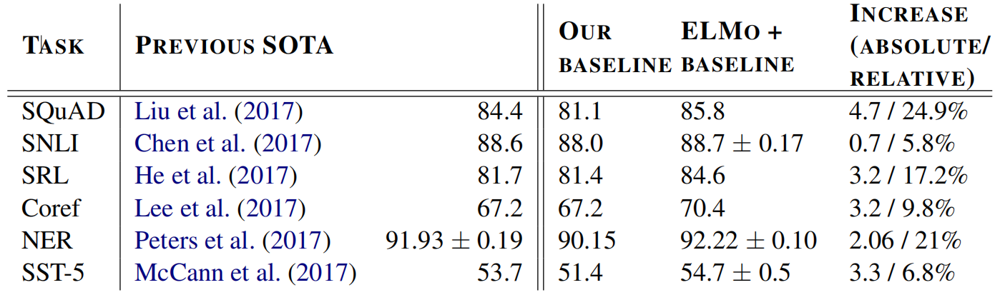

### Transformer

在Transformer之前的序列模型均采用了**循环层(recurrent layer)和卷积层(convolution layer)**，其中效果最好的模型均采用了**注意力(attention)**机制。Transformer摒弃了全部循环层和卷积层，只基于注意力机制，实现了**计算的并行化**。原论文采用机器翻译以及其他NLP任务来验证Transformer的有效性。Transformer的模型结构如下所示，其中左半部分是多个编码器，右半部分是多个解码器：

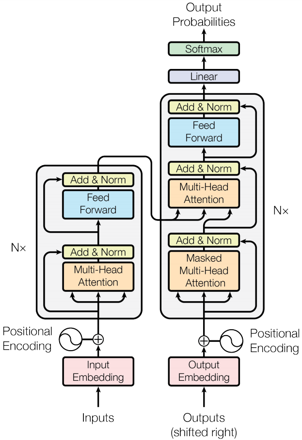

#### Encoder and Decoder Stacks

**编码器(encoder)**是由$N=6$个编码器层组成的栈式结构，其中每个编码器层中有两个sub-layers，即**多头注意力机制(multi-head attentin)**层和**全连接前馈神经网络**层。每一个sub-layer都采用了**残差连接(residual connection)**以及**层归一化(layer normalization)**。因此，每个sub-layer的输出为$\text{LayerNorm}(x+\text{Sublayer}(x))$。为了方便进行残差连接，模型中所有sub-layers的输出维度，以及embedding层的输出维度，均为$d_{model}=512$。**解码器(decoder)**也是由$N=6$个解码器层组成的栈式结构，但解码器层比编码器层多一个sub-layer，即掩码多头注意力机制，保证了在位置$i$的预测仅仅依赖于在$i$之前已知的预测。

#### Attention

注意力函数可以描述为**将查询(query)和一组键(key)-值(value)对映射到输出**，其中查询、键、值和输出都是向量。**输出被计算为值的加权和**，其中分配给每个值的权重由查询的兼容函数和相应的键计算。

论文中的attention机制称为“scaled dot-product attention”，如下图所示：

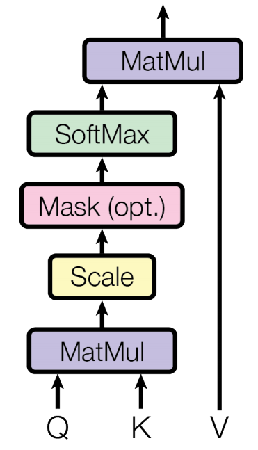

其输入包括queries(维度为$d_k$)、keys(维度为$d_k$)以及values(维度为$d_v$)。当并行处理多个输入的时候，可以将其组成三个矩阵$Q,K,V$，并且以下式来计算注意力输出：
$$
\text{Attention}(Q, K, V)=\operatorname{softmax}\left(\frac{Q K^{T}}{\sqrt{d_{k}}}\right) V
$$
两种最常用的注意力函数分别是加性注意力(additive attention)和点积注意力(dot-product attention)。论文中使用了点积注意力，并且除以$\sqrt{d_k}$。与加性注意力相比，点积注意力计算更快，并且在实际应用中更加节省空间。值得注意的是，$QK^T$除以$\sqrt{d_k}$的原因如下：当$d_k$的值比较大时，点积的增长速度很快，导致sotfmax函数来到梯度非常小的区域。因此，因子$\sqrt{d_k}$的作用是**控制sotfmax函数的值的范围，减少梯度消失的问题**。

论文提出，将输入线性映射到$h$个不同的空间内并且使用多个并行的注意力机制能够提高模型性能。该方式称为多头注意力机制，如下图所示：

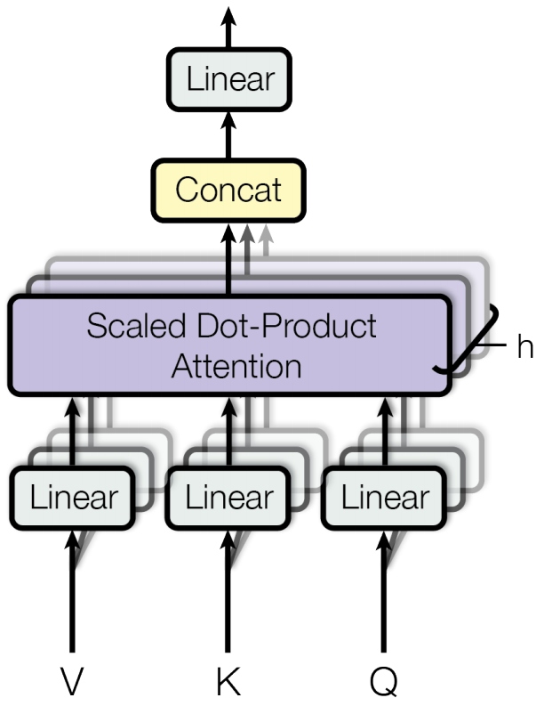

多头注意力机制可以形式化地表示为：
$$
\begin{aligned}
\text {MultiHead}(Q, K, V) &=\text {Concat}\left(\text {head}_{1}, \ldots, \text {head}_{\mathrm{h}}\right) W^{O} \\
\text {where head}_{\mathrm{i}} &=\text {Attention}(Q W_{i}^{Q}, K W_{i}^{K}, V W_{i}^{V})
\end{aligned}
$$
该式可以利用下图进行理解：


假设模块的输入为$X$(即原始句子的词嵌入序列，维度为$(len,d_{model})$)或者$R$(即上一个编码器模块传来的输入，维度也为$(len,d_{model})$)。图中的$X$或$R$等价于原文公式中的$Q,K,V$，首先分别乘以$3\times h$个不同的权重矩阵(维度分别为$(d_{model},d_k),(d_{model},d_k),(d_{model},d_v)$)以映射到$3\times h$个不同的空间，然后分别按照每一个注意力头的$Q,K,V$进行单头注意力计算，产生每个注意力头的结果$Z_i$，维度为$(len,d_v)$。将$h$个$Z_i$连接在一起，得到维度为$(len,hd_v)$大小的矩阵。将连接后的矩阵$Z$与参数矩阵$W^O$(维度为$(hd_v,d_{model})$)相乘，得到最终的结果为$Z$，维度为$(len,d_{model})$。原文取$h=8,d_k=d_v=d_{model}/h=64$。

Transformer中的多头注意力机制有如下三种不同的方式：

(1) 在encoder-decoder attention中，queries来自于**上一个解码器层的输出**，keys和values来自于**每一个编码器层的输出**。这种方式使得解码器输出的每一步都能关注编码器输入的每一个位置。

(2) 在编码器中，**所有的keys、values和queries都来自于同一个矩阵**，即最初的词向量序列输入$X$或者上一个编码器层的输出$R$。

(3) 在解码器中，每一步解码器能够关注当前步以及当前步之前的向量。我们需要保留解码器中输出句子每一步左边的信息流来维持其**自回归(auto-regression)**的特性。该方法通过**遮盖(mask)**实现。

#### Position-wise Feed-Forward Networks

在多头注意力层后，加入一层全连接前馈神经网络层，该网络层由两次线性映射以及一个ReLU非线性映射组成，即：
$$
FFN(x)=max(0,xW_1+b_1)W_2+b_2
$$
在该网络中，输入和输出的维度均为$d_{model}=512$，中间层的维度为$d_{ff}=2048$。

#### Embeddings and Softmax

与其他序列模型相似，Transformer编码器的inputs和解码器的outputs(都是输入)均是学习得到的词向量，维度均为$d_{model}$。sotfmax层在解码器之后，结合一个线性变换层用于预测当前单词的概率分布。

#### Positional Encoding

由于模型中不含循环层以及卷积层，为了使模型得以利用句子中的顺序信息，必须向输入中加入相对或绝对的位置信息。文章通过给编码器和解码器的输入词向量$X$加入**位置编码(positional encodings)**来实现顺序信息的引入。位置编码的维度与输入词向量相同，均为$d_{model}$。最终输入编码器和解码器的向量为**原始词向量与其对应位置编码之和**。

在论文中，位置编码采用如下形式：
$$
\begin{aligned}
P E_{(p o s, 2 i)} &=\sin (pos / 10000^{2 i / d_{\text{model}}}) \\
P E_{(\text {pos}, 2 i+1)} &=\cos (pos / 10000^{2 i / d_{\text{model}}})
\end{aligned}
$$
其中，$pos$是每个单词在句子中的位置(position)，$i$代表每个词向量的第$i$个维度(dimension)。

下表分析了self-attention与循环层和卷积层相比时间复杂度的差异：


实验结果如下：

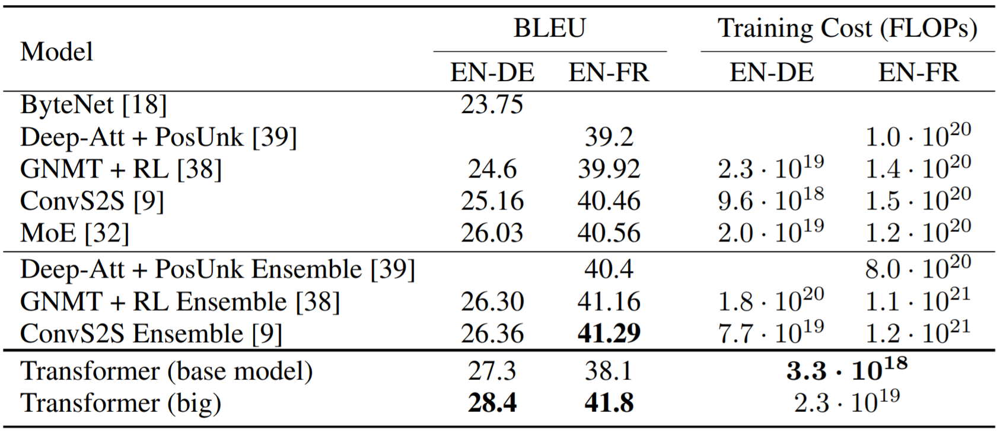

#### Tensorflow实现Transformer用于机器翻译

```python
import unicodedata
import re
import numpy as np
import os
import io
import time
import tensorflow as tf
import matplotlib.pyplot as plt
import matplotlib.ticker as ticker
from sklearn.model_selection import train_test_split

# 数据路径，需要将数据导入当前目录
path_to_file = 'transformer_pt_en_data.txt'


# 数据预处理，将unicode文件转换为ascii
def unicode_to_ascii(s):
    return ''.join(c for c in unicodedata.normalize('NFD', s) if unicodedata.category(c) != 'Mn')


def preprocess_sentence(w):
    w = unicode_to_ascii(w.lower().strip())
    # 在单词与跟在其后的标点符号之间插入一个空格，例如： "he is a boy." => "he is a boy ."
    w = re.sub(r"([?.!,¿])", r" \1 ", w)
    w = re.sub(r'[" ]+', " ", w)
    # 除了 (a-z, A-Z, ".", "?", "!", ",")，将所有字符替换为空格
    w = re.sub(r"[^a-zA-Z?.!,¿]+", " ", w)
    w = w.rstrip().strip()
    # 给句子加上开始和结束标记，以便模型知道何时开始和结束预测
    w = '<start> ' + w + ' <end>'
    return w


# 测试句子预处理是否正确
en_sentence = "May I borrow this book?"
sp_sentence = "¿Puedo tomar prestado este libro?"
print('句子的预处理: ')
print(en_sentence, '  ->  ', preprocess_sentence(en_sentence))
print(sp_sentence, '  ->  ', preprocess_sentence(sp_sentence))


# 构造数据集，返回这样格式的单词对：[英语, 葡萄牙语]
def create_dataset(path, num_examples):
    lines = io.open(path, encoding='UTF-8').read().strip().split('\n')
    word_pairs = [[preprocess_sentence(w) for w in l.split('\t')[:2]] for l in lines[:num_examples]]
    return zip(*word_pairs)


def max_length(tensor):
    return max(len(t) for t in tensor)


def tokenize(lang):
    lang_tokenizer = tf.keras.preprocessing.text.Tokenizer(filters='')
    lang_tokenizer.fit_on_texts(lang)
    tensor = lang_tokenizer.texts_to_sequences(lang)
    tensor = tf.keras.preprocessing.sequence.pad_sequences(tensor, padding='post')  # 后部补0
    return tensor, lang_tokenizer


def load_dataset(path, num_examples=None):
    # 创建清理过的输入输出对
    targ_lang, inp_lang = create_dataset(path, num_examples)  # 英语和西班牙语
    input_tensor, inp_lang_tokenizer = tokenize(inp_lang)
    target_tensor, targ_lang_tokenizer = tokenize(targ_lang)
    return input_tensor, target_tensor, inp_lang_tokenizer, targ_lang_tokenizer


# 限制数据集的大小以加快实验速度
num_examples = 20000
# 读取input(葡萄牙语)向量、output(英语)向量以及两个语言的tokenizer
input_tensor, target_tensor, tokenizer_pt, tokenizer_en = load_dataset(path_to_file, num_examples)
# 计算目标张量的最大长度 （max_length）
max_length_inp, max_length_targ = max_length(input_tensor), max_length(target_tensor)
print('前20000条语料中，葡萄牙语的最大长度为: ', max_length_inp, '英语的最大长度为: ', max_length_targ)

# 采用80-20的比例切分训练集和验证集
input_tensor_train, input_tensor_val, target_tensor_train, target_tensor_val = train_test_split(input_tensor, target_tensor, test_size=0.2)
# 显示长度
print('训练和测试集的长度(均为ndarray)，每一条代表一条句子index序列): ', len(input_tensor_train), len(target_tensor_train), len(input_tensor_val), len(target_tensor_val))

# 创建tf.data.Data数据集(这里仅构建了训练集)
train_dataset = tf.data.Dataset.from_tensor_slices((input_tensor_train, target_tensor_train))
train_dataset = train_dataset.batch(64, drop_remainder=True)
print('数据集: ', train_dataset)

example_input_batch, example_target_batch = next(iter(train_dataset))
print('一个批次的训练数据和标签的shape: ')
print(example_input_batch.shape, '\n', example_target_batch.shape)
print('至此，数据集处理完毕\n')


# 位置编码(Positional encoding)
def get_angles(pos, i, d_model):
    # pos为单词在句子中的绝对位置，i指的是单词embedding向量的第i维
    angle_rates = 1 / np.power(10000, (2 * (i // 2)) / np.float32(d_model))
    return pos * angle_rates


def positional_encoding(position, d_model):
    # d_model是位置编码的维度，也是embedding向量的维度
    angle_rads = get_angles(np.arange(position)[:, np.newaxis], np.arange(d_model)[np.newaxis, :], d_model)
    # 将sin应用于数组中的偶数索引2i
    angle_rads[:, 0::2] = np.sin(angle_rads[:, 0::2])
    # 将cos应用于数组中的奇数索引2i+1
    angle_rads[:, 1::2] = np.cos(angle_rads[:, 1::2])
    pos_encoding = angle_rads[np.newaxis, ...]
    return tf.cast(pos_encoding, dtype=tf.float32)


pos_encoding = positional_encoding(50, 512)
print('位置编码的shape: ', pos_encoding.shape)


# 填充遮挡(padding mask)遮挡一批序列中所有的填充标记。这确保了模型不会将填充作为输入。该mask表明填充值0出现的位置：在这些位置mask输出1，否则输出0
def create_padding_mask(seq):
    seq = tf.cast(tf.math.equal(seq, 0), tf.float32)
    # 添加额外的维度来将填充加到注意力对数(logits)
    return seq[:, tf.newaxis, tf.newaxis, :]  # (batch_size, 1, 1, seq_len)


x = tf.constant([[7, 6, 0, 0, 1], [1, 2, 3, 0, 0], [0, 0, 0, 4, 5]])
print('[[7, 6, 0, 0, 1], [1, 2, 3, 0, 0], [0, 0, 0, 4, 5]]对0进行mask后: ', create_padding_mask(x))


# 前瞻遮挡(look-ahead mask)用于遮挡一个序列中的后续标记，用于Transformer解码器
# 这意味着要预测第三个词，将仅使用第一个和第二个词。与此类似，预测第四个词，仅使用第一个，第二个和第三个词，依此类推
def create_look_ahead_mask(size):
    mask = 1 - tf.linalg.band_part(tf.ones((size, size)), -1, 0)
    return mask  # (seq_len, seq_len)


x = tf.random.uniform((1, 3))
temp = create_look_ahead_mask(x.shape[1])
print('tf.random.uniform((1, 3))的前瞻遮挡: ', temp)


def scaled_dot_product_attention(q, k, v, mask):
    """计算注意力权重。
    q, k, v必须具有匹配的后置维度，k, v必须有匹配的倒数第二个维度，例如：seq_len_k = seq_len_v。
    虽然mask根据其类型（填充或前瞻）有不同的形状，但是mask必须能进行广播转换以便求和。
    参数:
      q: 请求的形状 == (..., seq_len_q, depth)
      k: 主键的形状 == (..., seq_len_k, depth)
      v: 数值的形状 == (..., seq_len_v, depth)
      mask: Float 张量，其形状能转换成(..., seq_len_q, seq_len_k)，默认为None。
    返回值:
      输出，注意力权重
    """
    matmul_qk = tf.matmul(q, k, transpose_b=True)  # (..., seq_len_q, seq_len_k)

    # 缩放matmul_qk
    dk = tf.cast(tf.shape(k)[-1], tf.float32)
    scaled_attention_logits = matmul_qk / tf.math.sqrt(dk)

    # 将mask加入到缩放后的张量上
    if mask is not None:
        scaled_attention_logits += (mask * -1e9)

    # softmax在最后一个轴（seq_len_k）上归一化，因此分数相加等于1
    attention_weights = tf.nn.softmax(scaled_attention_logits, axis=-1)  # (..., seq_len_q, seq_len_k)
    output = tf.matmul(attention_weights, v)  # (..., seq_len_q, depth)
    return output, attention_weights


# 当softmax在K上进行归一化后，它的值决定了分配到Q的重要程度
# 输出表示注意力权重和 V(数值)向量的乘积。这确保了要关注的词保持原样，而无关的词将被清除掉
def print_out(q, k, v):
    temp_out, temp_attn = scaled_dot_product_attention(q, k, v, None)
    print('Attention weights are:')
    print(temp_attn)
    print('Output is:')
    print(temp_out)


np.set_printoptions(suppress=True)
temp_k = tf.constant([[10, 0, 0], [0, 10, 0], [0, 0, 10], [0, 0, 10]], dtype=tf.float32)  # (4, 3)
temp_v = tf.constant([[1, 0], [10, 0], [100, 5], [1000, 6]], dtype=tf.float32)  # (4, 2)

# 这条query符合第二个key，因此返回了第二个value
temp_q = tf.constant([[0, 10, 0]], dtype=tf.float32)  # (1, 3)
print_out(temp_q, temp_k, temp_v)


# 多头注意力(Multi-head attention)
class MultiHeadAttention(tf.keras.layers.Layer):
    def __init__(self, d_model, num_heads):
        super(MultiHeadAttention, self).__init__()
        self.num_heads = num_heads
        self.d_model = d_model

        assert d_model % self.num_heads == 0

        self.depth = d_model // self.num_heads

        self.wq = tf.keras.layers.Dense(d_model)
        self.wk = tf.keras.layers.Dense(d_model)
        self.wv = tf.keras.layers.Dense(d_model)

        self.dense = tf.keras.layers.Dense(d_model)

    def split_heads(self, x, batch_size):
        """
        输入维度: (batch_size, seq_len, d_model)
        分拆最后一个维度到(num_heads, depth)，转置结果使得输出维度为(batch_size, num_heads, seq_len, depth)
        """
        x = tf.reshape(x, (batch_size, -1, self.num_heads, self.depth))
        return tf.transpose(x, perm=[0, 2, 1, 3])

    def call(self, v, k, q, mask):  # seq_len_q == seq_len_k == seq_len_v
        batch_size = tf.shape(q)[0]

        q = self.wq(q)  # (batch_size, seq_len, d_model)
        k = self.wk(k)  # (batch_size, seq_len, d_model)
        v = self.wv(v)  # (batch_size, seq_len, d_model)

        q = self.split_heads(q, batch_size)  # (batch_size, num_heads, seq_len_q, depth)
        k = self.split_heads(k, batch_size)  # (batch_size, num_heads, seq_len_k, depth)
        v = self.split_heads(v, batch_size)  # (batch_size, num_heads, seq_len_v, depth)

        # scaled_attention.shape == (batch_size, num_heads, seq_len_q, depth)
        # attention_weights.shape == (batch_size, num_heads, seq_len_q, seq_len_k)
        scaled_attention, attention_weights = scaled_dot_product_attention(q, k, v, mask)

        scaled_attention = tf.transpose(scaled_attention, perm=[0, 2, 1, 3])
        # scaled_attention shape after transpose: (batch_size, seq_len_q, num_heads, depth)

        # 将多个attention head进行concat，由于是在一个数组中的，只需reshape即可
        concat_attention = tf.reshape(scaled_attention, (batch_size, -1, self.d_model))
        # concat_attention shape: (batch_size, seq_len_q, d_model)

        output = self.dense(concat_attention)  # (batch_size, seq_len_q, d_model)

        return output, attention_weights


temp_mha = MultiHeadAttention(d_model=512, num_heads=8)
y = tf.random.uniform((1, 60, 512))  # (batch_size, encoder_sequence, d_model)
out, attn = temp_mha(y, k=y, q=y, mask=None)
print(out.shape, attn.shape)


# 点式前馈网络(Point wise feed forward network)
# 点式前馈网络由两层全联接层组成，两层之间有一个ReLU激活函数
def point_wise_feed_forward_network(d_model, dff):
    return tf.keras.Sequential([
        tf.keras.layers.Dense(dff, activation='relu'),  # input shape: (batch_size, seq_len, dff)
        tf.keras.layers.Dense(d_model)  # output shape: (batch_size, seq_len, d_model)
    ])


sample_ffn = point_wise_feed_forward_network(512, 2048)
print(sample_ffn(tf.random.uniform((64, 50, 512))).shape)


# 编码器层
# 每个编码器层包括以下子层：
# 1. 多头注意力(有填充遮挡)
# 2. 点式前馈网络(Point wise feed forward networks)
# 每个子层在其周围有一个残差连接，然后进行层归一化。残差连接有助于避免深度网络中的梯度消失问题。

# 每个子层的输出是 LayerNorm(x + Sublayer(x))。归一化是在 d_model(最后一个)维度完成的。
# Transformer中有N个编码器层。
class EncoderLayer(tf.keras.layers.Layer):
    def __init__(self, d_model, num_heads, dff, rate=0.1):
        super(EncoderLayer, self).__init__()

        self.mha = MultiHeadAttention(d_model, num_heads)
        self.ffn = point_wise_feed_forward_network(d_model, dff)

        self.layernorm1 = tf.keras.layers.LayerNormalization(epsilon=1e-6)
        self.layernorm2 = tf.keras.layers.LayerNormalization(epsilon=1e-6)

        self.dropout1 = tf.keras.layers.Dropout(rate)
        self.dropout2 = tf.keras.layers.Dropout(rate)

    def call(self, x, training, mask):
        attn_output, _ = self.mha(x, x, x, mask)  # (batch_size, input_seq_len, d_model)
        attn_output = self.dropout1(attn_output, training=training)
        out1 = self.layernorm1(x + attn_output)  # (batch_size, input_seq_len, d_model)

        ffn_output = self.ffn(out1)  # (batch_size, input_seq_len, d_model)
        ffn_output = self.dropout2(ffn_output, training=training)
        out2 = self.layernorm2(out1 + ffn_output)  # (batch_size, input_seq_len, d_model)

        return out2


sample_encoder_layer = EncoderLayer(512, 8, 2048)  # 定义编码器层的一个实例
sample_encoder_layer_output = sample_encoder_layer(tf.random.uniform((64, 43, 512)), False, None)
print('编码器层的输出shape: ', sample_encoder_layer_output.shape)  # (batch_size, input_seq_len, d_model)


# 解码器层(Decoder layer)
# 每个解码器层包括以下子层：
# 1. 遮挡的多头注意力(前瞻遮挡和填充遮挡)
# 2. 多头注意力(用填充遮挡)。V(数值)和K(主键)接收编码器输出作为输入。Q(请求)接收遮挡的多头注意力子层的输出。
# 3. 点式前馈网络
# 每个子层在其周围有一个残差连接，然后进行层归一化。每个子层的输出是LayerNorm(x + Sublayer(x))。归一化是在d_model(最后一个)维度完成的
# Transformer中共有N个解码器层。

# 当Q接收到解码器的第一个注意力块的输出，并且K接收到编码器的输出时，注意力权重表示根据编码器的输出赋予解码器输入的重要性
# 换一种说法，解码器通过查看编码器输出和对其自身输出的自注意力，预测下一个词。参看按比缩放的点积注意力部分的演示
class DecoderLayer(tf.keras.layers.Layer):
    def __init__(self, d_model, num_heads, dff, rate=0.1):
        super(DecoderLayer, self).__init__()

        self.mha1 = MultiHeadAttention(d_model, num_heads)
        self.mha2 = MultiHeadAttention(d_model, num_heads)
        self.ffn = point_wise_feed_forward_network(d_model, dff)

        self.layernorm1 = tf.keras.layers.LayerNormalization(epsilon=1e-6)
        self.layernorm2 = tf.keras.layers.LayerNormalization(epsilon=1e-6)
        self.layernorm3 = tf.keras.layers.LayerNormalization(epsilon=1e-6)

        self.dropout1 = tf.keras.layers.Dropout(rate)
        self.dropout2 = tf.keras.layers.Dropout(rate)
        self.dropout3 = tf.keras.layers.Dropout(rate)

    def call(self, x, enc_output, training, look_ahead_mask, padding_mask):
        # enc_output.shape == (batch_size, input_seq_len, d_model)
        attn1, attn_weights_block1 = self.mha1(x, x, x, look_ahead_mask)  # (batch_size, target_seq_len, d_model)
        attn1 = self.dropout1(attn1, training=training)
        out1 = self.layernorm1(attn1 + x)

        attn2, attn_weights_block2 = self.mha2(enc_output, enc_output, out1,
                                               padding_mask)  # (batch_size, target_seq_len, d_model)
        attn2 = self.dropout2(attn2, training=training)
        out2 = self.layernorm2(attn2 + out1)  # (batch_size, target_seq_len, d_model)

        ffn_output = self.ffn(out2)  # (batch_size, target_seq_len, d_model)
        ffn_output = self.dropout3(ffn_output, training=training)
        out3 = self.layernorm3(ffn_output + out2)  # (batch_size, target_seq_len, d_model)

        return out3, attn_weights_block1, attn_weights_block2


# 测试解码器层
sample_decoder_layer = DecoderLayer(512, 8, 2048)
sample_decoder_layer_output, _, _ = sample_decoder_layer(tf.random.uniform((64, 50, 512)), sample_encoder_layer_output, False, None, None)

print('解码器层的输出shape: ', sample_decoder_layer_output.shape)  # (batch_size, target_seq_len, d_model)


# 编码器(Encoder)包括：
# 1. 输入嵌入(Input Embedding)
# 2. 位置编码(Positional Encoding)
# 3. N个编码器层(encoder layers)
# 输入经过嵌入(embedding)后，该嵌入与位置编码相加。该加法结果的输出是编码器层的输入。编码器的输出是解码器的输入
class Encoder(tf.keras.layers.Layer):
    def __init__(self, num_layers, d_model, num_heads, dff, input_vocab_size,
                 maximum_position_encoding, rate=0.1):
        super(Encoder, self).__init__()

        self.d_model = d_model
        self.num_layers = num_layers

        self.embedding = tf.keras.layers.Embedding(input_vocab_size, d_model)
        self.pos_encoding = positional_encoding(maximum_position_encoding, self.d_model)

        self.enc_layers = [EncoderLayer(d_model, num_heads, dff, rate) for _ in range(num_layers)]

        self.dropout = tf.keras.layers.Dropout(rate)

    def call(self, x, training, mask):
        seq_len = tf.shape(x)[1]

        # 将嵌入和位置编码相加
        x = self.embedding(x)  # (batch_size, input_seq_len, d_model)
        x *= tf.math.sqrt(tf.cast(self.d_model, tf.float32))
        x += self.pos_encoding[:, :seq_len, :]

        x = self.dropout(x, training=training)

        for i in range(self.num_layers):
            x = self.enc_layers[i](x, training, mask)

        return x  # (batch_size, input_seq_len, d_model)


sample_encoder = Encoder(num_layers=2, d_model=512, num_heads=8, dff=2048, input_vocab_size=8500, maximum_position_encoding=10000)
sample_encoder_output = sample_encoder(tf.random.uniform((64, 62)), training=False, mask=None)
print('编码器的输出shape: ', sample_encoder_output.shape)  # (batch_size, input_seq_len, d_model)


# 解码器(Decoder)包括：
# 输出嵌入(Output Embedding)
# 位置编码(Positional Encoding)
# N 个解码器层(decoder layers)
# 目标(target)经过一个嵌入后，该嵌入和位置编码相加。该加法结果是解码器层的输入。解码器的输出是最后的线性层的输入
class Decoder(tf.keras.layers.Layer):
    def __init__(self, num_layers, d_model, num_heads, dff, target_vocab_size,
                 maximum_position_encoding, rate=0.1):
        super(Decoder, self).__init__()

        self.d_model = d_model
        self.num_layers = num_layers

        self.embedding = tf.keras.layers.Embedding(target_vocab_size, d_model)
        self.pos_encoding = positional_encoding(maximum_position_encoding, d_model)

        self.dec_layers = [DecoderLayer(d_model, num_heads, dff, rate)
                           for _ in range(num_layers)]
        self.dropout = tf.keras.layers.Dropout(rate)

    def call(self, x, enc_output, training, look_ahead_mask, padding_mask):
        seq_len = tf.shape(x)[1]
        attention_weights = {}

        x = self.embedding(x)  # (batch_size, target_seq_len, d_model)
        x *= tf.math.sqrt(tf.cast(self.d_model, tf.float32))
        x += self.pos_encoding[:, :seq_len, :]

        x = self.dropout(x, training=training)

        for i in range(self.num_layers):
            x, block1, block2 = self.dec_layers[i](x, enc_output, training, look_ahead_mask, padding_mask)

            attention_weights['decoder_layer{}_block1'.format(i + 1)] = block1
            attention_weights['decoder_layer{}_block2'.format(i + 1)] = block2

        # x.shape == (batch_size, target_seq_len, d_model)
        return x, attention_weights


sample_decoder = Decoder(num_layers=2, d_model=512, num_heads=8, dff=2048, target_vocab_size=8000, maximum_position_encoding=5000)
output, attn = sample_decoder(tf.random.uniform((64, 26)),
                              enc_output=sample_encoder_output,
                              training=False, look_ahead_mask=None,
                              padding_mask=None)
print('解码器的输出shape: ', output.shape, attn['decoder_layer2_block2'].shape)


# 创建Transformer
# Transformer包括编码器，解码器和最后的线性层。解码器的输出是线性层的输入，返回线性层的输出。
class Transformer(tf.keras.Model):
    def __init__(self, num_layers, d_model, num_heads, dff, input_vocab_size, target_vocab_size, pe_input, pe_target, rate=0.1):
        super(Transformer, self).__init__()
        self.encoder = Encoder(num_layers, d_model, num_heads, dff, input_vocab_size, pe_input, rate)
        self.decoder = Decoder(num_layers, d_model, num_heads, dff, target_vocab_size, pe_target, rate)
        self.final_layer = tf.keras.layers.Dense(target_vocab_size)  # 用于预测的最后一层

    def call(self, inp, tar, training, enc_padding_mask, look_ahead_mask, dec_padding_mask):
        enc_output = self.encoder(inp, training, enc_padding_mask)  # (batch_size, inp_seq_len, d_model)
        # dec_output.shape == (batch_size, tar_seq_len, d_model)
        dec_output, attention_weights = self.decoder(tar, enc_output, training, look_ahead_mask, dec_padding_mask)
        final_output = self.final_layer(dec_output)  # (batch_size, tar_seq_len, target_vocab_size)
        return final_output, attention_weights


sample_transformer = Transformer(num_layers=2, d_model=512, num_heads=8, dff=2048, input_vocab_size=8500, target_vocab_size=8000, pe_input=10000, pe_target=6000)
temp_input = tf.random.uniform((64, 62))
temp_target = tf.random.uniform((64, 26))
fn_out, _ = sample_transformer(temp_input, temp_target, training=False, enc_padding_mask=None, look_ahead_mask=None, dec_padding_mask=None)
print('Transformer输出的shape: ', fn_out.shape)  # (batch_size, tar_seq_len, target_vocab_size)

# 配置超参数（hyperparameters）
# 为了让本示例小且相对较快，已经减小了num_layers、 d_model和dff的值
# Transformer的基础模型使用的数值为：num_layers=6，d_model = 512，dff = 2048
num_layers = 4
d_model = 128
dff = 512
num_heads = 8

input_vocab_size = len(tokenizer_pt.word_index) + 2
target_vocab_size = len(tokenizer_en.word_index) + 2
dropout_rate = 0.1


# 优化器(Optimizer)，根据论文中的公式，将Adam优化器与自定义的学习速率调度程序(scheduler)配合使用
class CustomSchedule(tf.keras.optimizers.schedules.LearningRateSchedule):
    def __init__(self, d_model, warmup_steps=4000):
        super(CustomSchedule, self).__init__()
        self.d_model = d_model
        self.d_model = tf.cast(self.d_model, tf.float32)
        self.warmup_steps = warmup_steps

    def __call__(self, step):
        arg1 = tf.math.rsqrt(step)
        arg2 = step * (self.warmup_steps ** -1.5)
        return tf.math.rsqrt(self.d_model) * tf.math.minimum(arg1, arg2)


learning_rate = CustomSchedule(d_model)
optimizer = tf.keras.optimizers.Adam(learning_rate, beta_1=0.9, beta_2=0.98, epsilon=1e-9)  # 定义优化器
temp_learning_rate_schedule = CustomSchedule(d_model)

plt.ylabel("Learning Rate")
plt.xlabel("Train Step")
plt.plot(temp_learning_rate_schedule(tf.range(40000, dtype=tf.float32)))

# 损失函数与指标
# 由于目标序列是填充过的，因此在计算损失函数时，应用填充遮挡非常重要
loss_object = tf.keras.losses.SparseCategoricalCrossentropy(from_logits=True, reduction='none')


def loss_function(real, pred):
    mask = tf.math.logical_not(tf.math.equal(real, 0))
    loss_ = loss_object(real, pred)

    mask = tf.cast(mask, dtype=loss_.dtype)
    loss_ *= mask

    return tf.reduce_mean(loss_)


train_loss = tf.keras.metrics.Mean(name='train_loss')
train_accuracy = tf.keras.metrics.SparseCategoricalAccuracy(name='train_accuracy')

# 训练与检查点(Training and checkpointing)
transformer = Transformer(num_layers, d_model, num_heads, dff, input_vocab_size, target_vocab_size, pe_input=input_vocab_size, pe_target=target_vocab_size, rate=dropout_rate)


def create_masks(inp, tar):
    # 编码器填充遮挡
    enc_padding_mask = create_padding_mask(inp)

    # 在解码器的第二个注意力模块使用，该填充遮挡用于遮挡编码器的输出
    dec_padding_mask = create_padding_mask(inp)

    # 在解码器的第一个注意力模块使用，用于填充(pad)和遮挡(mask)解码器获取到的输入的后续标记(future tokens)
    look_ahead_mask = create_look_ahead_mask(tf.shape(tar)[1])
    dec_target_padding_mask = create_padding_mask(tar)
    combined_mask = tf.maximum(dec_target_padding_mask, look_ahead_mask)

    return enc_padding_mask, combined_mask, dec_padding_mask


# 创建检查点的路径和检查点管理器(manager)。这将用于在每n个周期(epochs)保存检查点
checkpoint_path = "checkpoints/pt_en"
ckpt = tf.train.Checkpoint(transformer=transformer, optimizer=optimizer)
ckpt_manager = tf.train.CheckpointManager(ckpt, checkpoint_path, max_to_keep=5)

# 如果检查点存在，则恢复最新的检查点。
if ckpt_manager.latest_checkpoint:
    ckpt.restore(ckpt_manager.latest_checkpoint)
    print('模型从检查点中恢复')

# 目标(target)被分成了 tar_inp 和 tar_real。tar_inp作为输入传递到解码器。tar_real是位移了1的同一个输入：在tar_inp中的每个位置，tar_real包含了应该被预测到的下一个标记

# 例如，sentence = "SOS A lion in the jungle is sleeping EOS"
# tar_inp = "SOS A lion in the jungle is sleeping"
# tar_real = "A lion in the jungle is sleeping EOS"

# Transformer是一个自回归模型：它一次作一个部分的预测，然后使用到目前为止的自身的输出来决定下一步要做什么。
# 在训练过程中，本示例使用了teacher-forcing的方法。无论模型在当前时间步骤下预测出什么，teacher-forcing方法都会将真实的输出传递到下一个时间步骤上。
# 当 transformer预测每个词时，自注意力功能使它能够查看输入序列中前面的单词，从而更好地预测下一个单词。
# 为了防止模型在期望的输出上达到峰值，模型使用了前瞻遮挡(look-ahead mask)。

# 该@tf.function将追踪-编译train_step到TF图中，以更快执行。该函数专用于参数张量的精确形状。为了避免由于可变序列长度或可变
# 批次大小(最后一批次较小)导致的再追踪，使用input_signature指定更多的通用形状。

train_step_signature = [
    tf.TensorSpec(shape=(None, None), dtype=tf.int64),
    tf.TensorSpec(shape=(None, None), dtype=tf.int64),
]


# @tf.function(input_signature=train_step_signature)
def train_step(inp, tar):
    tar_inp = tar[:, :-1]
    tar_real = tar[:, 1:]

    enc_padding_mask, combined_mask, dec_padding_mask = create_masks(inp, tar_inp)

    with tf.GradientTape() as tape:
        predictions, _ = transformer(inp, tar_inp, True, enc_padding_mask, combined_mask, dec_padding_mask)
        loss = loss_function(tar_real, predictions)

    gradients = tape.gradient(loss, transformer.trainable_variables)
    optimizer.apply_gradients(zip(gradients, transformer.trainable_variables))

    train_loss(loss)
    train_accuracy(tar_real, predictions)


def train(EPOCHS):
    print('模型训练')

    # 葡萄牙语作为输入语言，英语为目标语言
    for epoch in range(EPOCHS):
        start = time.time()

        train_loss.reset_states()
        train_accuracy.reset_states()

        # inp -> portuguese, tar -> english
        for (batch, (inp, tar)) in enumerate(train_dataset):
            train_step(inp, tar)

            if batch % 10 == 0:
                print('Epoch {} Batch {} Loss {:.4f} Accuracy {:.4f}'.format(
                    epoch + 1, batch, train_loss.result(), train_accuracy.result()))

        if (epoch + 1) % 2 == 0:
            ckpt_save_path = ckpt_manager.save()
            print('Saving checkpoint for epoch {} at {}'.format(epoch + 1, ckpt_save_path))

        print('Epoch {} Loss {:.4f} Accuracy {:.4f}'.format(epoch + 1, train_loss.result(), train_accuracy.result()))
        print('Time taken for 1 epoch: {} secs\n'.format(time.time() - start))


def evaluate(inp_sentence):
    start_token = tokenizer_pt.word_index['<start>']
    end_token = tokenizer_pt.word_index['<end>']

    inp_sentence_list = []
    for i in inp_sentence.split(' '):
        if i in tokenizer_pt.word_index.keys():
            inp_sentence_list.append(tokenizer_pt.word_index[i])

    # inp sentence is portuguese, hence adding the start and end token
    inp_sentence = [start_token] + inp_sentence_list + [end_token]
    encoder_input = tf.expand_dims(inp_sentence, 0)

    # as the target is english, the first word to the transformer should be the english <start> token.
    decoder_input = [tokenizer_en.word_index['<start>']]
    output = tf.expand_dims(decoder_input, 0)  # 变为二维数据

    for i in range(50):
        enc_padding_mask, combined_mask, dec_padding_mask = create_masks(encoder_input, output)

        # predictions.shape == (batch_size, seq_len, vocab_size)
        predictions, attention_weights = transformer(encoder_input,
                                                     output,
                                                     False,
                                                     enc_padding_mask,
                                                     combined_mask,
                                                     dec_padding_mask)

        # select the last word from the seq_len dimension
        predictions = predictions[:, -1:, :]  # (batch_size, 1, vocab_size)

        predicted_id = tf.cast(tf.argmax(predictions, axis=-1), tf.int32)

        # concatentate the predicted_id to the output which is given to the decoder as its input.
        output = tf.concat([output, predicted_id], axis=-1)

    return tf.squeeze(output, axis=0), attention_weights


def translate(sentence):
    print('进行一次翻译')
    result, attention_weights = evaluate(sentence)

    result = list(result.numpy())
    result = result[1:]  # 去掉<start>开始标记
    for i in range(len(result)):
        if result[i] == tokenizer_en.word_index['<end>']:
            result = result[:i]  # 去掉<end>结束标记
            break

    predicted_sentence = [tokenizer_en.index_word[i] for i in result if i <= len(tokenizer_en.word_index)]

    print('Input: {}'.format(sentence))
    print('Predicted translation: {}'.format(" ".join(predicted_sentence)))


if __name__ == '__main__':
    mode = 'translate'  # train/translate
    if mode == 'train':
        train(EPOCHS=20)
    elif mode == 'translate':
        pt_sent = "não gosto de maçã e pêssego ."
        en_sent = "i don't like apple and peach ."
        translate(pt_sent)
        print("Real translation: ", en_sent)
```

### BERT

**BERT(bidirectional encoder representations from transformers)**是一种语言模型，用于从无标签文本中学习词的**深度双向表示**，这个过程称为**预训练(pre-train)**。在BERT预训练后，可以附加下游任务，通过**微调(fine-tuning)**的方式来完成NLP任务，如句子级别的自然语言推断、解释任务以及单词级别的NER、QA等任务。

目前有两种将预训练语言表示应用于下游任务的策略，即**基于特征(feature-based)**的方法及**微调(fine-tuning)**。二者的典型代表分别是**ELMo**和**GPT**。两种方法在预训练过程中使用的目标函数都是相同的，都是使用单向的语言模型取学习一般的语言表示(ELMo是由两个单向的LSTM拼接实现的，本质还是单向模型)。

BERT的作者认为，ELMo和GPT这类模型的**单向性**限制了下游任务的效果。BERT通过两种方式进行预训练：(1) **masked language model, MLM**：将输入中的标记(token)随机mask一部分，使其不可见，然后让模型去基于这些被遮盖的标记的上下文来预测这些单词的id。(2) **next sentence prediction, NSP**：给出两个句子A和B，让模型去判断B是否是A的下一个句子。

BERT模型的两种预训练方式以及其在下游任务中的应用示意图如下所示：


BERT模型与ELMo和GPT的区别如下所示：


#### 模型结构

BERT模型本质上是一个多层的双向Transformer的编码器。设Transformer编码器层的数量为$L$，隐含层单元的数量为$H$，注意力头的数量为$A$。论文中提出了两种尺寸的BERT，即$\bold{BERT}_{\bold{BASE}}(L=12,H=768,A=12)$，以及$\bold{BERT}_{\bold{LARGE}}(L=12,H=1024,A=16)$。

为了让BERT能处理更多类型的下游任务，输入数据可以包含两种形式，即一个单独的句子以及一个句子对(例如question和answer)。文章使用wordpiece embedding对输入单词进行表示，词汇表大小为30,000。每个句子的开头标记都是一个特殊类别标记“[CLS]”，**最终对应这个标记的隐含状态便是用于分类任务的整个句子的表示**。包含两个输入句子的桔子堆被合并为一个序列，并使用两种方法对这两个句子进行区分：(1) 在两个句子之间添加一个特殊标记[SEP]；(2) 为每个标记添加一个学习得到的嵌入，该嵌入表明每个标记属于句子A还是句子B。记$E$为输入标记的嵌入，$C \in \mathbb R^H$为[CLS]对应的最终隐含层向量，第$i$个输入标记对应的最终隐含层向量为$T_i \in \mathbb R^H$。

对于一个给定的标记，**其输入表示为token embedding、segment embedding和position embedding之和**。


#### 预训练BERT

BERT通过masked language model和next sentence prediction两种方式进行预训练。

(1) **masked language model, MLM**：为了训练一个深度双向的表示，论文简单地将输入标记序列中的一些单词随机遮盖后让BERT完成预测这些单词的任务。被遮盖的单词最终的隐含层向量被送入一个输出的softmax层，通过训练的方式不断提高模型预测的准确率。实验遮盖了**每个序列中15%的wordpiece标记**。MLM产生的一个缺点是，[MASK]标记导致了预训练与微调的不匹配，因为[MASK]标记不出现在微调过程中。为了解决这个问题，对于被随机选中第$i$个masked标记，其**以80%的可能性被替换为[MASK]标记，10%的可能性被替换为一个随机的标记，10%的可能性保持不变**。然后，$T_i$被用于预测原始标记。

(2) **next sentence prediction, NSP**：许多例如QA、NLI的下游任务基于理解句子之间的关系，这种关系无法直接被语言模型捕获。NSP任务可用于捕获句子之间的关系，其具体做法如下：从每个预训练样本中选择句子A和B时，有50%的可能性句子B确实是跟在句子A后面的句子(被标记为**IsNext**)，还有50%的可能性句子B是从语料库中随机选取的(被标记为**NotNext**)。在BERT中，$C$([CLS]标记对应位置的最终隐含层向量)用于NSP。这个预训练方法对QA和NLI任务非常有效。

预训练的数据来自BooksCorpus(300M words)和Wikipedia(2,500M words)。使用像维基百科这样文档级别的语料库非常有帮助，因为其能够使得BERT更好地捕获长程依赖。

#### 微调BERT

仅需要改变输入和输出，BERT便能用于完成很多种类的NLP任务。在微调的过程中，BERT中的全部参数都会以端到端的方式进行微调。下图展示了对于不同任务，BERT输入和输出的变化：

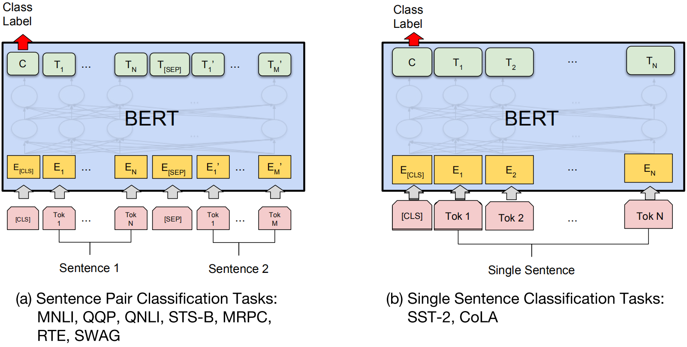


#### 实验结果

在不同NLP任务上的实验结果如下：

(1) GLUE


(2) SQuAD 1.1

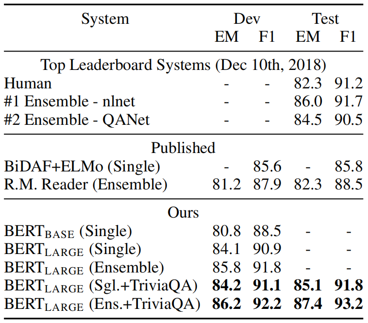

(3) SQuAD 2.0


(4) SWAG

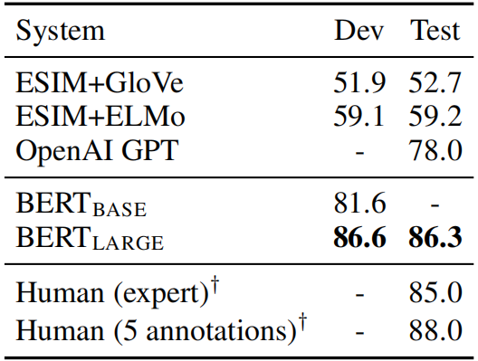

(5) 预训练方式调整对实验结果的影响

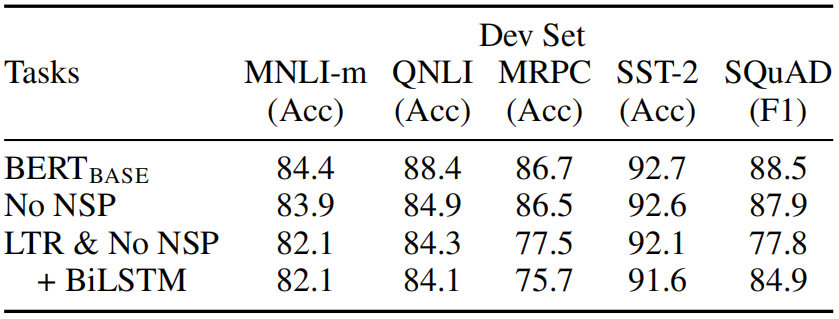

(6) 网络结构调整对实验结果的影响


(7) 命名实体识别

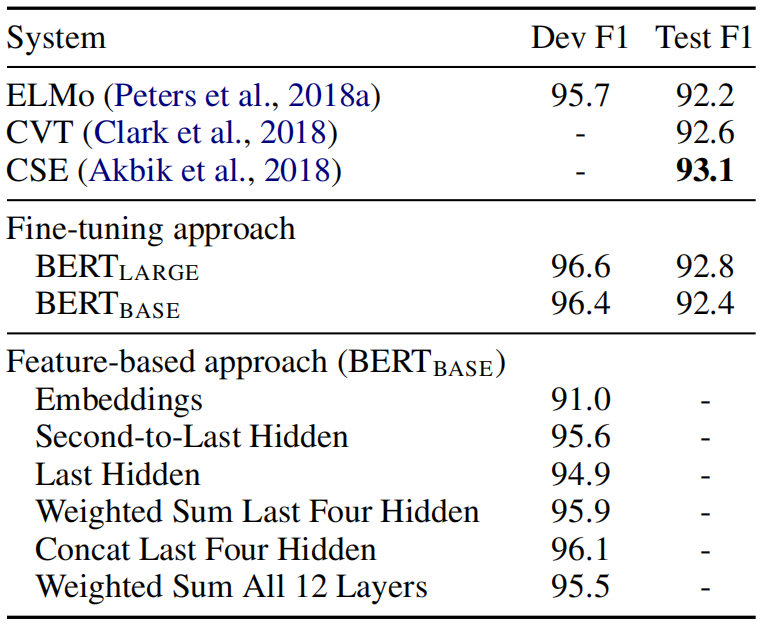

### ERNIE

#### ERNIE 1.0

Google提出的BERT模型，利用Transformer的多层self-attention双向建模能力，在各项NLP下游任务中都取得了很好的成绩。但是，BERT模型主要是**聚焦在针对字或者英文word粒度的完形填空学习上面**，没有充分利用**训练数据当中词法结构，语法结构，以及语义信息**去学习建模。比如“我要买苹果手机”，BERT模型将“我 要 买 苹 果 手 机”每个字都统一对待，**在预训练时随机进行遮盖(mask)**，丢失了“苹果手机”是一个很火的名词这一信息，这个是**词法信息**的缺失。同时“我 + 买 + 名词”是一个非常明显的购物意图的句式，BERT没有对此类**语法结构**进行专门的建模，如果预训练的语料中只有“我要买苹果手机”，“我要买华为手机”，哪一天出现了一个新的手机牌子比如栗子手机，而这个手机牌子在预训练的语料当中并不存在，**没有基于词法结构以及句法结构的建模，对于这种新出来的词是很难给出一个很好的向量表示的**，而ERNIE 1.0通过进行**实体(entity)和短语(phrase)的masking**，极大地增强了通用语义表示能力，在多项任务中均取得了大幅度超越BERT的效果。

**ERNIE和BERT不同的masking策略**如下所示：


与BERT相同，ERNIE的整体网络架构也使用Transformer的编码器。Transformer可以通过**自注意力机制**捕捉句子中每个标记的上下文信息，并**生成一系列上下文嵌入(contextual embedding)**。

ERNIE使用先验知识来增强预训练语言模型，其提出了一种**多阶段的知识masking策略**，将短语和实体层次的知识整合到语言表达中，而**不是直接加入知识嵌入**。下图描述了句子的不同masking级别：


(1) **Basic-level masking**：Basifc-level masking是第一个阶段，它把一个句子看作一个基本语言单位的序列，对于英语，基本语言单位是**单词**，对于汉语，基本语言单位是**汉字**。在训练过程中，随机屏蔽15%的基本语言单元，并使用句子中的其他基本单元作为输入，训练一个Transformer的编码器来预测屏蔽单元。基于Basic-level masking，我们可以得到一个基本的单词表示。**因为它是在基本语义单元的随机掩码上训练的，所以很难对高层语义知识进行完全建模**。这个过程与BERT相同。

(2) **Phrase-level masking**：Phrase-level masking是第二个阶段。**短语**是作为概念单位的一小组单词或字符。**对于英语，我们使用词汇分析和分块工具来获取句子中短语的边界**，并**使用一些依赖于语言的切分工具来获取其他语言(如汉语)中的单词/短语信息**。在Phrase-level masking阶段，**仍然使用基本语言单元作为训练输入**，与随机基本单元mask不同，这次我们随机选择句子中的几个短语，对同一短语中的**所有基本单元进行mask和预测**。**在此阶段，短语信息被编码到单词嵌入中**。

(3) **Entity-level masking**：Entity-level masking是第三个阶段。**名称实体**包含个人、地点、组织、产品等，可以用适当的名称表示。它可以是抽象的，也可以是物理存在的。通常**实体在句子中包含重要信息**。和Phrase-level masking阶段一样，**首先分析句子中的命名实体**，然后屏蔽和预测实体中的所有语言单元。经过三个阶段的学习，得到了一个**由丰富的语义信息增强的词表示**。

ERNIE使用中文维基百科、百度百科、百度新闻和百度贴吧的综合语料库进行预训练。

此外，ERNIE**使用多轮对话修改BERT中的NSP(next sentence prediction)任务**：

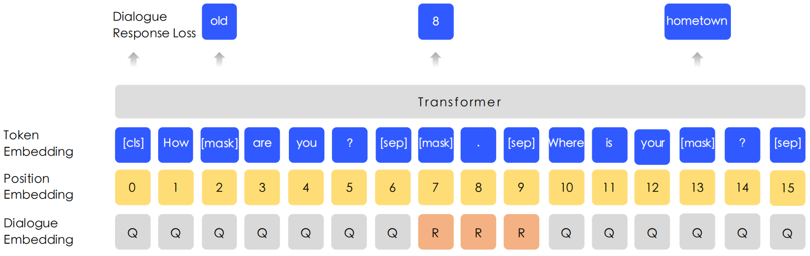

在ERNIE中，NSP任务变为了**DLM(dialogue language model)**任务。使用dialogue embedding来区分不同的对话角色，可以表示多轮对话。与BERT中的**MLM(masked language model)**一样，masks被应用于强制模型来预测查询和响应条件下的丢失单词。此外，通过用随机选择的句子替换查询Q或响应R来生成假样本。该模型用于判断多回合对话是真是假。DLM任务帮助ERNIE学习对话中的隐含关系，这也增强了模型学习语义表示的能力。

#### ERNIE 2.0

ERNIE 2.0在ERNIE 1.0的基础上继续进行改进：其构建了3类任务，包括word-aware tasks、structure-aware tasks和semantic-aware tasks。这些任务都是无监督或弱监督，所以可以从海量数据中获取到。对于**多任务的预训练**，本文框架是在一个持续的学习模式中训练所有这些任务。ERNIE 2.0先用一个简单的任务训练一个初始模型，然后不断引入新的预训练任务对模型进行升级。对于一个新任务，先用前一个任务的参数进行初始化。然后，新任务将与之前的任务一起训练，以确保模型不会忘记它所学到的知识。


如上图所示，ERNIE 2.0的输入包括四部分：Token embedding、Sentence embedding、Position embedding和Task embedding。作者设计了七个预训练任务，并归属于三个类别，以此来提升预训练效果。

### GPT

BERT模型使用Transormer encoder结构对文本进行编码并预训练，然后通过fine-tuning完成下游任务。与BERT不同，GPT是基于Transformer decoder进行构建的，其可以看作是一个**语言模型(language model)**，通过一个接一个生成单词，从而生成连续的句子。在每个新单词产生后，该单词就被添加在之前生成的单词序列后面，这个序列会成为模型下一步的新输入。这种机制叫做**自回归(auto-regression)**。

GPT使用语言模型任务进行预训练，然后可以进一步fine-tuning从而适应多种不同的下游任务，如下所示：


GPT-1的思想是先通过在无标签的数据上学习一个通用的语言模型，然后再根据特定热任务进行微调。而GPT2的目的是训练一个泛化能力更强的词向量模型，**使用无监督的预处训练做有监督的任务**，即，将各类有监督任务构建为语言模型的形式进行预训练。GPT2并没有网络结构上进行更多的创新和设计，而是使用了更多的参数和更大的数据集。GPT-2的核心思想概括为：任何有监督任务都是语言模型的一个子集，当模型的容量非常大且数据量足够丰富时，仅仅靠训练语言模型的学习便可以完成其他有监督学习的任务。

GPT-3进一步提升了语言模型的能力，仅仅需要zero-shot或者few-shot，GPT-3就可以在下游任务表现的非常好。除了几个常见的NLP任务，GPT-3还在很多非常困难的任务上也有惊艳的表现，例如撰写人类难以判别的文章，甚至编写SQL查询语句，React或者JavaScript代码等。而这些强大能力的能力则依赖于GPT-3的1,750亿参数量， 45TB的训练数据以及高达1,200万美元的训练费用。GPT、GPT-2和GPT-3的对比如下。


### 参考资料

- Peters M E, Neumann M, Iyyer M, et al. Deep contextualized word representations. arXiv preprint arXiv:1802.05365, 2018.
- Vaswani A, Shazeer N, Parmar N, et al. Attention is all you need. Advances in neural information processing systems. 2017: 5998-6008.
- Devlin J, Chang M W, Lee K, et al. Bert: Pre-training of deep bidirectional transformers for language understanding. arXiv preprint arXiv:1810.04805, 2018.
- Sun Y, Wang S, Li Y, et al. Ernie: Enhanced representation through knowledge integration. arXiv preprint arXiv:1904.09223, 2019.
- Sun Y, Wang S, Li Y, et al. Ernie 2.0: A continual pre-training framework for language understanding. arXiv preprint arXiv:1907.12412, 2019.
- 图解Transformer：https://jalammar.github.io/illustrated-transformer/
- ERNIE简介：https://blog.csdn.net/PaddlePaddle/article/details/102713947

