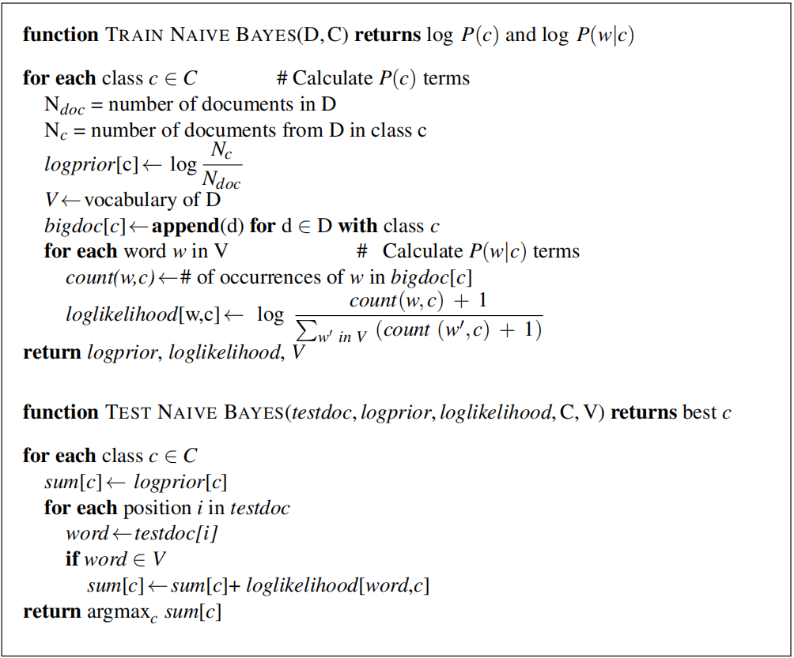
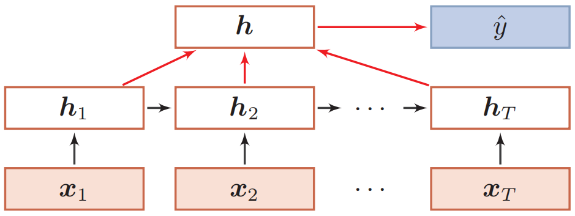

## 自然语言处理应用

自然语言处理的应用（即NLP任务）分布非常广泛。本章节以任务的形式进行划分，主要介绍三类具有代表性的自然语言处理应用，包括文本分类（序列-编码-类别）、文本摘要（序列-编码-解码-序列）、以及机器阅读理解（序列-编码-同步序列）。每个部分首先介绍了应用的概念及挑战，然后介绍了一些具有代表性的论文工作。**注意，从接触一个领域的具体任务开始，已经初步进入到了对该科研领域的探索之中。每个领域都有一些具体的任务，而确定一个任务往往就是着手开展一项研究工作的第一步。**

本节介绍的相关工作均为大语言模型流行之前的工作范式。

### 文本分类

**文本分类(text classification)**在自然语言处理领域有着广泛的应用，例如**垃圾邮件检测(spam detection)**、**情感分析(sentiment analysis)**、**语言识别(language id)**以及**新闻类别标注(news classification)**等。文本分类有着非常多的实现方法，每种实现方法中文本的表示也存在着很大的不同。但总的来说，文本分类是一个**监督学习问题**，需要数据样本以及其对应标签。

分类问题又可以分为**二分类**、**多分类**以及**多标签分类**等类型。其中的**多标签分类**指的是为每个数据标定数量不相同的标签，其由于类标签数量不确定、**类标签之间可能有相互依赖**、多标签的训练集比较难以获取等原因，难度是分类问题中最大的，因此也称为了分类问题的研究热点。目前主流的多标签分类的实现方式有如下几种：

(1) **不考虑标签之间的关联性**：将每个标签的出现与否视为二分类任务。

(2) **考虑标签的关联性**：分类器链、序列生成任务、通过**标签共现(组合)**的方式转换为多分类任务。

对于基于神经网络的分类器，实现多标签分类，只需**将输出层的softmax激活函数改为sigmoid激活函数**，对每个类别进行二分类即可。在这个过程中，每个标签之间不是独立的，其关联性也会被神经网络学习到。

分本分类通常用**准确率(accuracy)、召回率(recall)、精准率(precision)和F1(又分为micro和macro)**等指标进行评价。

### 基于朴素贝叶斯算法的文本分类

朴素贝叶斯算法是一种生成模型，其实现简单，常常用于**文本分类的baseline**。在朴素贝叶斯算法中，文本常用词袋模型进行表示，即每个文档表示为一个大小为$|V|$的向量，其中$|V|$为词汇表的大小，每一个维度表示对应下标的单词在文档中出现的次数：


朴素贝叶斯分类器是一个概率模型，其理论基础是贝叶斯定理，“朴素”一词指的是**条件独立性假设**。对于文档$d$，朴素贝叶斯算法预测使得后验概率$P(c|d)$最大的类别$c\in C$。**朴素贝叶斯算法的过程如下所示**：



### 基于卷积神经网络的文本分类

与朴素贝叶斯算法等这类传统机器学习方法不同，使用卷积神经网络(CNN)进行文本分类需要将词使用**词向量(例如Word2Vec)**进行表示。CNN最初是针对图像设计的，其利用卷积核(convolving filters)来提取图像的局部特征。然而CNN也可以用于文本的特征提取，其通常被称为**TextCNN**。

Yoon Kim在论文《Convolutional Neural Networks for Sentence Classification》中提出了如下CNN网络结构用于文本分类任务：


整个网络仅使用了一个卷积层、一个池化层和一个全连接层。输入层为词向量，其可以一开始将词向量矩阵随机初始化，并在训练的过程中进行学习(作为实验的baseline)，也可以一直**保持静态**(即使用其他语料训练完成后便不再改变)，还可以预训练后在该网络训练的过程中进行**微调**(在实验中能够取得更好的效果)。该论文还将输入设置为两个通道，其均为词向量，但**其中一个通道保持静态，另一个通道可以在训练过程汇中进行微调**。

另一篇关于TextCNN的论文提出了如下所示的网络结构：


该论文进行了**大量的实验**来优化TextCNN中的参数，其中比较重要的一些**结论和建议**如下：

(1) 预训练word2vec或GloVe效果好于one-hot编码形式。

(2) 卷积核大小对实验结果有较大影响，一般取1~10，文本越长，可设置卷积核大小越大。

(3) 卷积核的数量对实验结果有较大的影响，一般取100~600 ，一般使用Dropout比率为0~0.5。

(4) 选用ReLU和tanh作为激活函数优于其他的激活函数。

(5) 1-max pooling在该实验中优于其他pooling策略。

(6) 正则化对实验结果有相对小的影响。

(7)当评估一个模型的性能时，考虑模型的方差是必要的。因此，评估模型时应当使用交叉验证，同时考虑模型每次结果的方差以及范围。

```python
# Tensorflow实现用于多标签文本分类的TextCNN结构
def TextCNN(seq_len, token_num, embed_dim, out_dim, model_img_path=None, embed_matrix=None):
    """
    TextCNN模型
    1. embedding layers
    2. convolution layer
    3. max-pooling
    4. softmax layer
    """
    x_input = tf.keras.Input(shape=(max_seq_len,))
    if embedd_matrix is None:
        x_emb = tf.keras.layers.Embedding(input_dim=token_num,
                                          output_dim=embed_dim,
                                          input_length=seq_len)(x_input)
    else:  # 加载预训练好的词向量矩阵
        x_emb = tf.keras.layers.Embedding(input_dim=token_num,
                                          output_dim=embed_dim,
                                          input_length=seq_len,
                                          weights=[embed_matrix],
                                          trainable=True)(x_input)

    # x_embed shape: (batch_size, seq_len, token_num)
    pool_output = []
    kernel_sizes = [2, 3, 4]  # 设置多种卷积核
    for kernel_size in kernel_sizes:
        # Conv1D input shape: 形如(samples, steps, input_dim)的3D张量
        # Conv1D output shape: 形如(samples，new_steps，nb_filter)的3D张量
        c = tf.keras.layers.kerasConv1D(filters=100, kernel_size=kernel_size, strides=1)(x_emb)
        p = tf.keras.layers.MaxPool1D(pool_size=int(c.shape[1]))(c)
        pool_output.append(p)

    pool_output = tf.keras.layers.concatenate([p for p in pool_output])  # 将多个池化结果进行拼接
    x_flatten = tf.keras.layers.Flatten()(pool_output)
    # output_dim个sigmoid输出，是多标签分类的实现方式，实质上是对每个标签的二分类
    y = tf.keras.layers.Dense(output_dim, activation='sigmoid')(x_flatten)

    model = tf.keras.Model([x_input], outputs=[y])
    model.summary()
    return model
```

### 基于FastText的文本分类

Armand Joulin等人提出了如下FastText模型，可用于快速的文本分类， 并且准确度接近state-of-art模型。


其中$x_1,x_2,\cdots,x_N$是一个句子中的$N$个特征，可以是词向量，也可以是**N-gram特征**。这些词的特征表示(word representation)在隐含层(hidden)被平均为**句子的特征表示(sentence representation)**，然后被送入一个线性分类器。当输出空间很大时，论文使用**层次化softmax(hierarchical softmax)**对结果类别进行计算以减少计算复杂度。对于一个由$N$个文档祖晨的集合，该模型的目标是最小化如下所示的**损失函数(或负对数似然函数)**：
$$
-\frac{1}{N}\sum_{n=1}^{N}y_n\log(f(BAx_n))
$$
其中，$A$是一个look-up表，用于将输入特征$x_n$映射到其对应的嵌入向量；$B$是隐含层到输出层的参数矩阵，$f$是softmax激活函数。

```python
# 使用Tensorflow序列方式构建FastText文本多分类模型
def build_fasttext_model(vocab, embed, length, num_hidden, num_classes):
    fasttext = tf.keras.Sequential()
    fasttext.add(tf.keras.layers.Embedding(input_dim=vocab,
                                           output_dim=embed,
                                           input_length=length,
                                           mask_zero=True))
    fasttext.add(tf.keras.layers.GlobalAveragePooling1D())
    fasttext.add(tf.keras.layers.Dense(num_hidden, activation='relu'))
    fasttext.add(tf.keras.layers.Dense(num_classes, activation='softmax'))
    fasttext.summary()
    return fasttext
```

### 基于循环神经网络的文本分类

使用循环神经网络(recurrent neural network, RNN)进行文本分类时，通常每个**时间步(time step)**的输入是文本中每个单词的词向量，将最后一个单词对应的RNN的输出通过全连接层+softmax的形式映射到类别的概率分布：


还可以使用**双向结构**，能够在一定程度上提升分类效果。除了将最后时刻的状态作为**序列表示**之外，我们还可以**对整个序列的所有状态进行平均**，并用这个平均状态来作为整个序列的表示：



本质上，RNN是在产生一个**句嵌入(sentence smbeeding)**，然后使用全连接+softmax的方式对该句嵌入进行分类。除了单向RNN和双向RNN以外，还可以**利用每个时间步的输出组合成一个新的向量**作为句嵌入。除了原始的RNN以外，还可以将每一层替换为LSTM或者GRU。

```python
# 使用Tensorflow序列方式构建RNN文本多分类模型
def build_rnn_model(vocab, embed, length, num_hidden, num_classes):
    rnn = tf.keras.Sequential()
    rnn.add(tf.keras.layers.Embedding(input_dim=vocab,
                                      output_dim=embed,
                                      input_length=length,
                                      mask_zero=True))
    rnn.add(tf.keras.layers.SimpleRNN(num_hidden, activation='relu'))  # 可替换为LSTM/GRU
    rnn.add(tf.keras.layers.Dense(num_hidden, activation='relu'))
    rnn.add(tf.keras.layers.Dense(num_classes, activation='softmax'))
    rnn.summary()
    return rnn
```

### 基于预训练语言模型的文本分类

基于Transformer encoder的语言模型(如BERT)非常适合完成文本分类任务。以BERT为例，按照分类的对象，可以有**句子对分类任务(sentence pair classification)、单个句子分类任务(single sentence classification)以及标记分类(token classification)任务**等，其分别作用于不同场景下：句子对分类任务可以解决语义匹配问题，单个句子分类任务可以解决情感分析、垃圾邮件识别等问题，而标记分类任务可以实现**命名实体识别(named entity recognition)**等任务。

```python
# 微调transformers中的BERT模型进行中文文本分类(新闻标题分类)
import os
import tensorflow as tf
from transformers import BertTokenizer, TFBertForSequenceClassification
os.environ['CUDA_VISIBLE_DEVICES'] = '0'

# 设置模型和文件路径，运行前需要将模型和文件导入当前文件夹
bert_model_path = 'bert-chinese'
bert_fine_tuned_path = 'bert-cls'
train_data_path = 'bert_classification_train.txt'
dev_data_path = 'bert_classification_dev.txt'
test_data_path = 'bert_classification_test.txt'

gpus = tf.config.experimental.list_physical_devices('GPU')
print(gpus)
# 设置按需申请，multi-GPU需要for一下
tf.config.experimental.set_memory_growth(gpus[0], True)

# mapping
y_map = {'财经': 0, '彩票': 1, '房产': 2, '股票': 3, '家居': 4, '教育': 5, '科技': 6, 
         '社会': 7, '时尚': 8, '时政': 9, '体育': 10, '星座': 11, '游戏': 12, '娱乐': 13}
y_map_reverse = {y_map[k] : k for k in y_map.keys()}
print(y_map, y_map_reverse)

def load_model(bert_model_path):
    tokenizer = BertTokenizer.from_pretrained(bert_model_path)
    model = TFBertForSequenceClassification.from_pretrained(bert_model_path, num_labels=14)  # 类别数目
    tokenizer.pad_token = '[PAD]'
    return tokenizer, model


def build_dataset():
    # 读取文件
    X_train, X_dev, y_train, y_dev = [], [], [], []
    with open(train_data_path, 'r', encoding='utf-8') as f:
        lines = f.read().split('\n')
    for i in range(len(lines)):
        text, label = lines[i].split('\t')
        X_train.append(text)
        y_train.append(y_map[label])
    with open(dev_data_path, 'r', encoding='utf-8') as f:
        lines = f.read().split('\n')
    for i in range(len(lines)):
        text, label = lines[i].split('\t')
        X_dev.append(text)
        y_dev.append(y_map[label])
    return X_train, X_dev, y_train, y_dev


def fine_tuning(bert_model_path, X_train, y_train, X_dev, y_dev, model_save_path, epochs=20, batch_size=64):
    tokenizer, model = load_model(bert_model_path)
    print(len(X_train), len(y_train), len(X_dev), len(y_dev))
    print('encoding train set and dev set by tokenizer')
    train_encodings = tokenizer(X_train, truncation=True, padding=True, max_length=32, return_tensors='tf')
    dev_encodings = tokenizer(X_dev, truncation=True, padding=True, max_length=32, return_tensors='tf')
    print(train_encodings.keys())  # ['input_ids', 'token_type_ids', 'attention_mask']

    train_tensor_inputs = tf.convert_to_tensor(train_encodings['input_ids'])
    train_tensor_labels = tf.convert_to_tensor(y_train)
    train_tensor_mask = tf.convert_to_tensor(train_encodings['attention_mask'])
    train_ds = tf.data.Dataset.from_tensor_slices(
        (
            {'input_ids': train_tensor_inputs, 'attention_mask': train_tensor_mask},
            train_tensor_labels,
        )
    )

    dev_tensor_inputs = tf.convert_to_tensor(dev_encodings['input_ids'])
    dev_tensor_labels = tf.convert_to_tensor(y_dev)
    dev_tensor_mask = tf.convert_to_tensor(dev_encodings['attention_mask'])
    dev_ds = tf.data.Dataset.from_tensor_slices(
        (
            {'input_ids': dev_tensor_inputs, 'attention_mask': dev_tensor_mask},
            dev_tensor_labels,
        )
    )

    train_ds = train_ds.shuffle(len(X_train)).batch(batch_size, drop_remainder=True)
    dev_ds = dev_ds.batch(batch_size)

    print(train_ds)
    print(dev_ds)

    optimizer = tf.keras.optimizers.Adam(learning_rate=3e-5, epsilon=1e-08, clipnorm=1.0)
    loss = tf.keras.losses.SparseCategoricalCrossentropy(from_logits=True)
    model.compile(optimizer=optimizer, loss=loss, metrics=['accuracy'])
    model.summary()

    # train and save the model
    for i in range(epochs):
        print('training epoch', i + 1)
        hist = model.fit(train_ds, epochs=1, validation_data=dev_ds)
        model.save_pretrained(model_save_path + '_' + str(i + 1) + '_epoch')


def inference(bert_model_path, result_path):
    tokenizer, model = load_model(bert_model_path)
    with open(test_data_path, 'r', encoding='utf-8') as f:
        test_data = f.read().split('\n')[:-1]
    print(len(test_data))
    test_encodings = tokenizer(test_data, truncation=True, padding=True, max_length=32, return_tensors='tf')
    test_tensor_inputs = tf.convert_to_tensor(test_encodings['input_ids'])
    test_tensor_mask = tf.convert_to_tensor(test_encodings['attention_mask'])
    test_ds = tf.data.Dataset.from_tensor_slices(({'input_ids': test_tensor_inputs, 'attention_mask': test_tensor_mask}))
    test_ds = test_ds.batch(128)
    print(test_ds)

    with open(result_path, 'a', encoding='utf-8') as f:
        for i, batch_data in enumerate(test_ds):
            if i % 10 == 0:
                print(i)
            out_dist = model(batch_data)[0]
            out_softmax = tf.nn.softmax(out_dist, axis=1)
            preds = list(tf.math.argmax(out_softmax, axis=1).numpy())
            for pred in preds:
                label = y_map_reverse[pred]
                f.write(label + '\n')


if __name__ == '__main__':
    X_train, X_dev, y_train, y_dev = build_dataset()
    # fine_tuning(bert_model_path, X_train, y_train, X_dev, y_dev, bert_fine_tuned_path)
    inference(bert_fine_tuned_path + '_3_epoch', 'result.txt')
```

### 文本摘要

随着互联网产生的文本数据越来越多，文本信息过载问题日益严重，对各类文本进行一个“降 维”处理显得非常必要，**文本摘要(text summarization)**便是其中一个重要的手段。文本摘要旨在**将文本或文本集合转换为包含关键信息的简短摘要**。文本摘要按照**输入类型**可分为**单文档摘要和多文档摘要**。单文档摘要从给定的一个文档中生成摘要，多文档摘要从给定的一组主题相关的文档中生成摘要。按照**输出类型**可分为**抽取式摘要和生成式摘要**。抽取式摘要从源文档中抽取关键句和关键词组成摘要，**摘要全部来源于原文**；生成式摘要根据原文，允许**生成新的词语、短语来组成摘要**。按照有无监督数据可以分为**有监督摘要和无监督摘要**。

常用的**文本摘要数据集**有DUC数据集、New York Times数据集、CNN / Daily Mail数据集、 Gigaword数据集、LCSTS数据集等。**文本摘要的结果通常使用ROUGE指标及其变体进行评价**。

### TextRank抽提式文本摘要

TextRank是一种**基于PageRank**的**无监督文本摘要**算法。在TextRank算法中，句子等价于网页，使用任意两个句子的相似性等价于网页转换概率，将相似性得分存储在一个矩阵中，类似于PageRank中的概率转移矩阵。

TextRank算法步骤如下：

(1) 把所有文章整合成**文本数据**；

(2) 接下来把文本分割成**单个句子**；

(3) 将为每个句子找到向量表示，通常是先使用word2vec预训练每个单词的词向量，然后**将一句话中的所有单词的word2vec进行平均**，从而得到一句话的向量表示；

(4) 计算句子向量间的**相似性(通常使用余弦相似度)**并存放在矩阵中；

(5) 将相似矩阵转换为以句子为节点、相似性得分为边的**图结构**，用于句子TextRank计算；

(6) 最后，**将一定数量的排名最高的句子构成最后的摘要**。

```python
# 利用textrank4zh中的TextRank4Sentence实现中文抽提式文本摘要
from textrank4zh import TextRank4Sentence

results = []  # results用于保存摘要结果
tr4s = TextRank4Sentence()  # TextRank4Sentence对象

for i in range(len(texts)):  # texts为文档集合
    text = texts[i]
    text_divide = re.split('[。]', text)  # 每个文档可以切分为多个句子，tr4s模型负责选出重要的句子完成摘要

    sort_dict = {j: text_divide[j] for j in range(len(text_divide))}  # 句子按照原顺序排序的字典(次序: 句子)
    reverse_sort_dict = {text_divide[j]: j for j in range(len(text_divide))}  # 反向排序字典(句子: 次序)

    # 利用tr4s完成摘要
    tr4s.analyze(text=text, lower=True, source='all_filters')
    result = tr4s.get_key_sentences(num=3, sentence_min_len=3)  # 选取长度大于等于3的最重要的3条句子
    result_list = []
    for item in result:
        result_list.append(item.sentence)

    # 对句子顺寻按照原文档顺序重新排序
    for j in range(len(result_list)):
        result_list[j] = reverse_sort_dict[result_list[j]]  # 变成顺序下标
    result_list.sort()  # 对顺序下标进行排序
    for j in range(len(result_list)):
        result_list[j] = sort_dict[result_list[j]]  # 利用词典恢复成句子

    results.append(result_list)
```

### seq2seq与attention生成式文本摘要

基于seq2seq+attention结构的生成式文本摘要示意图如下：


原始文本(source text)中的单词$w_i$被逐步输入一个编码器(论文中使用的是单层双向LSTM)，产生一个编码器隐藏层序列$h_i$，其长度与原始文本长度相同。在解码时的第$t$个时间步中，解码器接受前一个单词的词向量(在训练时是参考摘要的词向量，在测试阶段是decoder上一步输出的词向量)，并产生解码器隐含状态$s_t$。**注意力分布**可使用如下公式计算得出：
$$
\begin{array}{l}
e_{i}^{t}=v^{T} \tanh (W_{h} h_{i}+W_{s} s_{t}+b_{\mathrm{attn}})\\
a^{t}=\operatorname{softmax}(e^{t})
\end{array}
$$
然后，注意力分布用于计算上下文向量$h_t^*$：
$$
h_t^*=\sum_i a_i^t h_i
$$
上下文向量$h_t^*$可以看作是**从源文本读取的内容的固定大小表示形式**，它与解码器状态$s_t$串联在一起，并通过两个线性层以产生词汇分布$P_{\text{vocab}}$：
$$
P_{\text{vocab}}=\operatorname{softmax}(V^{\prime}(V[s_{t}, h_{t}^{*}]+b)+b^{\prime})
$$
最终预测单词的概率分布就等于在词表上所计算得到的概率分布$P_{\text{vocab}}$，即$P(w)=P_{\text{vocab}}$。

在训练过程中，时间步$t$的损失为目标单词$w_t^*$的负对数似然，即$\text{loss}_t=-\log P(w_t^*)$，整个句子的损失为：
$$
\operatorname{loss}=\frac{1}{T} \sum_{t=0}^{T} \operatorname{loss}_{t}
$$
使用如上结构进行文本摘要时，存在**三个问题**：(1) **对事实细节的错误描述(例如2-0变为2-1)**；(2) **无法处理未知词汇(OOV)问题**；(3) **容易产生重复(repetition)**。

### PGN生成式文本摘要

**PGN(pointer-generator network)**在seq2seq+attention结构的基础上进行两个改进：(1) 引入**指针网络**，从原文中复制部分单词，从而**提高摘要准确性，并解决OOV问题**；(2) 利用**coverage机制**减少重复。

PGN的结构如下图所示：


在PGN中，注意力分布$a^t$和上下文向量$h_t^*$与原始seq2seq+attention结构的计算方式一致。此外，定义在时间步$t$的**生成概率**$p_{\text{gen}}$：
$$
p_{\mathrm{gen}}=\sigma(w_{h^{*}}^{T} h_{t}^{*}+w_{s}^{T} s_{t}+w_{x}^{T} x_{t}+b_{\mathrm{ptr}})
$$
其中$\sigma$为sigmoid函数。然后，$p_{\text{gen}}$被用作一个“软开关”，来选择**从词典中生成一个单词**，或者根据注意力分布$a^t$**从输入句子中复制一个单词**。对于每一个文档，其**拓展词表(extended vocabulary)**指原词表与当前文档中未在原词表中出现的词汇的并集。因此，生成单词$w$的概率分布建立在拓展词表上：
$$
P(w)=p_{\text{gen}} P_{\text{vocab}}(w)+(1-p_{\text{gen}})\sum_{i: w_{i}=w} a_{i}^{t}
$$
注意，当$w$是OOV词汇时，$P_{\text{vocab}}(w)$值为0；类似地，当$w$未出现在源文档中时，$\sum_{i: w_{i}=w} a_{i}^{t}$值也为0。

为了解决生成过程中出现的重复问题，引入coverage机制。在模型中，维持一个coverage向量$c^t$：
$$
c^{t}=\sum_{t^{\prime}=0}^{t-1} a^{t^{\prime}}
$$
直觉上，$c_i^t$表示从$0-t$时间步中，单词$w_i$**已经得到attention的程度**。其中，$c^0$是一个零向量，因为在第一个时间步中，源文档中所有部分都未被覆盖。coverage向量被用于注意力机制的一个额外输入：

$$
e_{i}^{t}=v^{T}\tanh(W_{h} h_{i}+W_{s} s_{t}+w_{c} c_{i}^{t}+b_{\mathrm{attn}})
$$
上式可以确保**注意力机制的当前决定(选择下一个注意力分布)考虑到其先前的决定(隐含在$c_t$中)**。 这应该使注意力机制更容易**避免重复关注相同的位置，从而避免生成重复的文本**。

定义coverage损失来对**频繁attend相同的位置**这一现象进行惩罚：
$$
\text{covloss}_t=\sum_i \min(a_i^t,c_i^t)
$$
最终模型的损失函数为：
$$
\operatorname{loss}_{t}=-\log P(w_{t}^{*})+\lambda \sum_{i} \min(a_{i}^{t}, c_{i}^{t})
$$
其中$\lambda$为超参数。

### 基于预训练语言模型的文本摘要

应用BERT可以实现抽提式文本摘要，模型如下图所示：


首先将文档(document)以句子进行切分，在每个句子前加入[CLS]标记。将多种embeddings相加后用BERT编码，然后对每个[CLS]对应位置的输出进行分类：(1) 该句子作为摘要的一部分；(2) 该句子不作为摘要的一部分。

BertSum在CNN/DailyMail数据集上的效果超过了现有模型：


类似地，微调GPT-2等生成式模型，也可以实现生成式摘要，并且结果显著优于未经过预训练的seq2seq等模型。

```python
# 微调transformers中的GPT-2模型进行文本摘要(汽车大师对话摘要)
import os
import pandas as pd
import tensorflow as tf
from transformers import BertTokenizer, TFGPT2LMHeadModel
os.environ['CUDA_VISIBLE_DEVICES'] = '0'

# 设置模型和文件路径，运行前需要将模型和文件导入当前文件夹
gpt2_model_path = 'gpt2-chinese'
gpt2_fine_tuned_path = 'gpt2-sum'
train_data_path = 'gpt2_summarization_train.csv'
test_data_path = 'gpt2_summarization_test.csv'

gpus = tf.config.experimental.list_physical_devices('GPU')
print(gpus)
# 设置按需申请，multi-GPU需要for一下
tf.config.experimental.set_memory_growth(gpus[0], True)


def load_model(gpt2_model_path):
    tokenizer = BertTokenizer.from_pretrained(gpt2_model_path)
    tokenizer.pad_token = '[PAD]'
    # 设置eos_token_id用于early stopping
    model = TFGPT2LMHeadModel.from_pretrained(gpt2_model_path, pad_token_id=tokenizer.pad_token_id, eos_token_id = tokenizer.pad_token_id)

    return tokenizer, model


def build_dataset():
    # 读取原始csv文件
    train_df = pd.read_csv(train_data_path, engine='python', encoding='utf-8')  # 必须utf-8
    test_df = pd.read_csv(test_data_path, engine='python', encoding='utf-8')  # 必须utf-8
    # 空值去除
    train_df.dropna(subset=['Question', 'Dialogue', 'Report'], how='any', inplace=True)
    test_df.dropna(subset=['Question', 'Dialogue'], how='any', inplace=True)

    train_question_set = list(train_df['Question'])
    train_dialogue_set = list(train_df['Dialogue'])
    train_report_set = list(train_df['Report'])
    test_question_set = list(test_df['Question'])
    test_dialogue_set = list(test_df['Dialogue'])

    train_dataset = []
    test_dataset = []
    for i in range(len(train_question_set)):
        context = train_question_set[i] + ' [CLS] ' + train_dialogue_set[i]
        if len(context) > 480:
            context = context[:480]
        data = context + ' [SEP] ' + train_report_set[i]
        train_dataset.append(data)
    for i in range(len(test_question_set)):
        context = test_question_set[i] + ' [CLS] ' + test_dialogue_set[i]
        if len(context) > 480:
            context = context[:480]
        data = context + ' [SEP]'
        test_dataset.append(data)

    return train_dataset, test_dataset


def fine_tuning(gpt2_model_path, train_set, model_save_path, epochs=20, batch_size=4):
    tokenizer, model = load_model(gpt2_model_path)
    print(len(train_set))
    print('encoding train set by tokenizer')
    train_encodings = tokenizer(train_set, truncation=True, padding=True, max_length=512, return_tensors='tf', add_special_tokens=False)

    train_encodings['labels'] = [x[1:] for x in train_encodings['input_ids']]
    train_encodings['input_ids'] = [x[:-1] for x in train_encodings['input_ids']]
    train_encodings['attention_mask'] = [x[:-1] for x in train_encodings['attention_mask']]

    train_tensor_inputs = tf.convert_to_tensor(train_encodings['input_ids'])
    train_tensor_labels = tf.convert_to_tensor(train_encodings['labels'])
    train_tensor_mask = tf.convert_to_tensor(train_encodings['attention_mask'])
    train_ds = tf.data.Dataset.from_tensor_slices(
        (
            {'input_ids': train_tensor_inputs, 'attention_mask': train_tensor_mask},
            train_tensor_labels,
        )
    )

    train_ds = train_ds.shuffle(len(train_set)).batch(batch_size, drop_remainder=True)
    print(train_ds)

    optimizer = tf.keras.optimizers.Adam(learning_rate=3e-5, epsilon=1e-08, clipnorm=1.0)
    loss = tf.keras.losses.SparseCategoricalCrossentropy(from_logits=True)
    model.compile(optimizer=optimizer, loss=[loss, *[None] * model.config.n_layer])
    model.summary()

    # 训练并保存模型
    for i in range(epochs):
        print('training epoch', i + 1)
        model.fit(train_ds, epochs=1)
        model.save_pretrained(model_save_path + '_' + str(i + 1) + '_epoch')


def generate(gpt2_model_path, test_set, result_path):
    tokenizer, model = load_model(gpt2_model_path)

    for i in range(len(test_set)):
        sentence = test_set[i]
        input_ids = tokenizer.encode(sentence, return_tensors='tf', add_special_tokens=False)

        # sampling (文本摘要使用sampling会导致结果不准确)
        # outputs = model.generate(input_ids, do_sample=True, max_length=min(512, input_ids.shape[1] + 256), top_k=100, top_p=0.98, early_stopping=True, no_repeat_ngram_size=2, num_return_sequences=10)
        # greedy search
        # outputs = model.generate(input_ids, max_length=min(512, input_ids.shape[1] + 256), early_stopping=True)
        # beam search (用于摘要效果最佳)
        outputs = model.generate(input_ids, max_length=min(512, input_ids.shape[1] + 256), num_beams=5, early_stopping=True)

        output_str = str(tokenizer.decode(outputs[0], skip_special_tokens=False))
        output_str = ''.join(output_str.split(' '))
        print(i + 1, output_str)

        # 保存结果文件
        with open(result_path, 'a', encoding='utf-8') as f:
             f.write('Q' + str(i + 1) + ',' + output_str.split('[SEP]')[-1] + '\n')


if __name__ == '__main__':
    train_set, test_set = build_dataset()

    # fine_tuning(gpt2_model_path, train_set, gpt2_fine_tuned_path + '_1_epoch')
    # 指明使用训练了几轮的模型进行inference，此处仅使用了训练一轮的GPT-2
    generate(gpt2_fine_tuned_path + '_1_epoch', test_set, 'result.csv')
```

### 机器阅读理解

#### MRC的形式化定义

给定上下文$C$以及问题$Q$，**机器阅读理解(machine reading comprehension, MRC)**任务要求模型给出问题$Q$正确的回答$A$，该过程通过学习函数$\mathcal F$得到，即$A=\mathcal F(C,Q)$。

#### MRC中的四大任务

机器阅读理解的四大任务分别为：**完形填空(cloze test)、多项选择(multiple choice)、答案抽取(span extraction)以及自由问答(free answering)**。


四大任务的**常用数据集**如下：

(1) 完形填空：**CNN & Daily Mail**，The Children's Book Test，LAMBADA。


(2) 多项选择：MC Test，RACE。


(3) 答案抽取：**SQuAD**，**NewsQA**，TriviaQA。


(4) 自由问答：**bAbI**，MS MARCO，SearchQA，**DuReader**。


#### MRC的四大基础模块

MRC任务有以下四大基础模块：


(1) **Embeddings**：该模块将context和question嵌入到向量空间中，使用包含语义信息的向量来表示单词、句子以及段落的含义。常用的方法有one-hot、word2vec、**预训练语言模型(ELMo、GPT、BERT)**等，还可以**融合其他特征**，例如字符嵌入(character embedidng)、词性、命名实体等。

(2) **Feature Extraction**：该模块用于提取context和question更多上下文相关的特征。常用模型有RNN、CNN、Transformer等。

(3) **Context-Question Interaction**：该模块通过将context和question进行特征关联来产生好的答案。常用模型有单向注意力机制、**双向注意力机制(bidirectional attention)**、one-hop交互和**multi-hop交互**。该模块被认为是机器阅读理解领域最重要的模块。

(4) **Answer Prediction**：该模块生成答案。根据四大任务，产生答案的方式也对应有**word predictor、option selector、span extractor和answer generator**四种。

#### MRC方法的发展

最早的MRC主要是基于特征工程结合传统机器学习方法进行的；第二个阶段是设计各式各样的神经网络模型(QA架构)在MRC任务上进行全监督学习；随着预训练语言模型的发展，MRC的第三个阶段主要方法是预训练+微调，并配合一些tricks进行MRC。

#### MRC的主要评价指标

(1) Accuracy：主要用于**完形填空**和**多项选择**任务。当共有$m$个任务，有$n$道回答正确，则accuracy为：
$$
\text{Accuracy} =\frac{n}{m}
$$
(2) F1-score：主要用于**答案抽取**任务。在该任务中，**候选答案(产生的答案)**和**参考答案(实际的答案)**都被当做**a bag of tokens**，可以给出混淆矩阵：


精准率、召回率以及F1-score的计算方式分别如下：
$$
\begin{aligned}
\text{precision}&=\frac{\text{TP}}{\text{TP}+\text{FP}}\\
\text{recall}&=\frac{\text{TP}}{\text{TP}+\text{FN}}\\
\text{F}_1&=\frac{2 \times P \times R}{P+R}
\end{aligned}
$$
(3) ROUGE-L：主要用于**自由问答**任务，pyrouge工具可以很容易地实现ROUGE值的计算。


$$
\begin{aligned}
R_{lcs}&=\frac{LCS(X, Y)}{m} \\
P_{lcs}&=\frac{LCS(X, Y)}{n} \\
F_{lcs}&=\frac{(1+\beta)^{2} R_{lcs} P_{lcs}}{R_{lcs}+\beta^{2} P_{lcs}}
\end{aligned}
$$


(4) BLEU：主要用于**自由问答**任务。BLEU的计算主要基于如下指标：

$$
P_{n}(C, R)=\frac{\sum_{i} \sum_{k} \min (h_{k}(c_{i}), \max (h_{k}(r_{i})))}{\sum_{i} \sum_{k} h_{k}(c_{i})}
$$
其中$h_k(c_i)$指**候选答案**$c_i$中出现的第$k$个**n-gram的数量**，$h_k(r_i)$指**真正答案**$r_i$中出现的第$k$个**n-gram的数量**。当答案更短时，$P_n(C,R)$往往容易取得较高的分数。因此，通常设定一个惩罚因子BP：
$$
\mathrm{BP}=\left\{\begin{array}{l}
1, l_{c}>l_{r} \\
e^{1-\frac{l_{r}}{l_{c}}}, l_{c} \leq l_{r}
\end{array}\right.
$$
完整的BLEU计算方式如下：
$$
\mathrm{BLEU}=\mathrm{BP} \cdot \exp (\sum_{n=1}^{N} w_{n} \log P_{n})
$$
其中，$N$为gram的大小，例如若$N=4$，则称其为BLEU-4；$w_i$通常取$1/N$。

### Attentive Reader & Impatient Reader

**Attentive Reader & Impatient Reader**由论文《Teaching Machines to Read and Comprehend》提出，是机器阅读理解**一维匹配模型和二维匹配模型**的开山之作。其适用于MRC中的**完形填空**任务。

文章提出了三种神经模型，用于估计根据文档$d$回答查询$q$单词类型$a$的概率$p(a|d, q)$：


(1) **Deep LSTM Reader** (c)：将query和document输入LSTM，并用"|||"分隔符隔开，将编码后的query和document输入模块$g$(文中采用全连接神经网络)，模型即可进行答案预测。

(2) **Attentive Reader** (a)：Deep LSTM Reader受到query和document长度影响，会存在信息瓶颈问题。Attentive Reader模型将document和query分开表示，分别使用一个双向LSTM来进行编码。对于query，模型将两个方向上最后一步的隐含层向量拼接实现query表示；对于document，模型使用注意力机制对document中所有token进行加权表示。权重越大表示回答query时对应document中的token越重要，因此注意力机制能够在一定程度上解决信息瓶颈问题。与Deep LSTM Reader类似，模型最后用query和document的表示做分类，选出最合适的答案$a$。
(3) Impatient Reader (c)：Attentive Reader可以集中注意到document中最有可能得到答案的段落。进一步，在Impatient Reader中，当query中的每个词被阅读的时候，模型都会重新阅读document。

在CNN & Daily Mail数据上的实验结果如下：


该论文引出了MRC领域**一维匹配模型**和**二维匹配模型**的概念：一维匹配模型将query编码为固定长度的向量，计算document每个词在特定问题上下文向量中作为答案的概率；二维匹配模型将query每一个词编码，计算document中每一个词对query中每一个词的注意力，形成词与词的二维匹配结构，模型效果要稍优于一维匹配模型。

### Bi-DAF

论文《Bidirectional Attention Flow for Machine Comprehension》提出使用双向注意力流机制实现机器阅读理解，确立了编码层-交互层-输出层的MRC结构。所提出的模型如下图所示：


(1) 在三个**嵌入层(embedding layer)**中，首先对每个token分别使用字符级别和词级别的嵌入进行标识，然后用LSTM进行编码。经过LSTM后得到两个矩阵：$H \in \mathbb R^{2d \times T}$以及$U \in \mathbb R^{2d \times J}$，其中$d$是词嵌入和字符嵌入得到的表示的长度，$T$和$J$分别表示上下文(context)和查询(query)的长度。到这一步，查询和上下文是分开并行处理的。

(2) **注意力流层(attention flow layer)**：该层进行context-to-query和query-to-context双向注意力的计算。首先计算出一个相似度矩阵$S \in \mathbb R^{T \times J}$，其中$S^{t, j} = \alpha(H_{:,t}, U_{:,j})$，$\alpha$是一个计算两个向量之间相似度的可训练的标量函数，文中选用$\alpha(h, u) = w_S^T [h;u;h \cdot u]$，其中"$;$"表示向量拼接，"$\cdot$"表示向量按位乘法。对于context-to-query注意力的计算，计算query中每个word与context中word的相似度；对于query-to-context注意力的计算，取出每一行的最大值，然后经过softmax函数计算得到。

(3) **建模层(modeling layer)**：将注意力流层的两个注意力输出和嵌入曾context对应的输出进行拼接，就构成了context的query-aware表示，将该表示经过建模层即可获取进一步的高层表示。

(4) **输出层(output layer)**：这一层是问题相关的。在QA任务中，需要从文章的内部摘出一段作为回答，即给出一个开始位置和一个结束位置，分别表示为$p_1$和$p_2$。在计算$p_1$时，将建模层的输出通过一个全连接层并通过softmax函数得到概率，对于$p_2$的操作也类似，但作者又加入了一个LSTM函数。对于损失函数，作者将$p_1$和$p_2$的预测定义为分类任务，并将损失函数定义为交叉熵相加的形式进行优化。

### QA-Net

基于RNN结构的模型训练和推断速度较慢。论文《QANet: Combining Local Convolution with Global Self-Attention for Reading Comprehension》提出了一种基于卷积和自注意力操作的网络用于机器阅读理解，其能够在准确率不下降的情况下，以3-13倍的训练增速以及4-9倍的推断增速实现加速。模型的整体架构如下图所示：


其输入层设计为300维的GloVe词向量和200维的字符嵌入。对于context-query attention层，其采用的策略与Bi-DAF一致。该论文的重点在于将Bi-DAF中的LSTM编码层替换为了多个Encoder Blocks，如上图右侧所示。在这些blocks中，卷积操作可以对局部相互作用建模(捕获文本的局部结构)，而使用自注意力机制则可以对全局交互进行建模(学习每对单词之间的相互作用)。对于SQuAD 1.1数据集，模型输出层预测的是各个位置作为开始和结束位置的概率，因此与Bi-DAF类似，将起始位置和结束位置交叉熵之和作为损失函数进行优化。

### 基于预训练语言模型的MRC

包括BERT、GPT在内，许多预训练语言模型如Transformer-XL、RoBERTa、ALBERT等，均能够通过简单改动去适配MRC任务。

当数据集(如SQuAD 2.0)中包含了无法回答的问题时，除了基本的encoder-decoder结构，还需要在解码器端加上一个验证模块(verifier)。先前的工作一般都用一个强大的预训练模型作为encoder来完成阅读的任务。论文《Retrospective Reader for Machine Reading Comprehension》提出了Retro-Reader的模型，为MRC中无法回答的问题设计了更好的verifier。这个模型包含两阶段的阅读(reading)和验证(verification)策略：(1) **粗读阶段**，先整体阅读文段和问题，得到一个基本的判断。(2) **细读阶段**：再次验证答案并给出最终的预测。该模型在SQuAD2.0和NewsQA数据集上达到了新的SOTA。

在下图中，[a]展示了最直接的阅读理解模型，即不存在验证模块的模型；[b]和[c]两种方式分别在模型encoder端和decoder端中加入了验证模块，并在训练时采用多任务学习的策略，从而使模型能够判断不可回答的问题并进行忽略。该论文主要提出两个模块：泛读器(sketchy reading module)和精读器(intensive reading module)，通过两阶段的方式完成阅读。下图中[d]和[e]展示了该论文所提出的结构：


#### Sketchy Reading Module

泛读器由以下部分组成：

(1) Embedding：将question和passage拼接在一起，通过tokenizer切割为token，每一个token都是三个部分的加和：token embedding + positon embedding + token-type embedding。

(2) Interaction：通过一个多层Transformer的encoder部分来实现，得到输入的上下文表示。

(3) External Front Verification(E-FV)：机器给出一个粗糙的判断，通过E-FV来构造一个二分类器，让机器来初步判断此时的问题是不是可回答的。这里的输入是上一层输出的隐藏层的值，将上一层[CLS]对应的输出作为整个序列的表示，传入一个全连接层来判断此时的问题是否是可以回答的。给出的输出是预测概率，并使用交叉熵损失函数进行训练。E-FV同时计算了一个external verification score，在后面的部分会用到这个值：
$$
score_{ext} = logit_{na} - logit_{an}
$$
这里的na表示问题不能回答，ans表示可以回答。

#### Intensive Reading Module

(1) Embedding + interaction：和泛读器的Embedding以及Interaction部分一样，模型通过一个多层Transformer的encoder部分来实现，得到输入的上下文表示$H$。之前的BERT、XLNET、ALBERT等预训练模型都是直接将$H$直接送进线性层生成预测结果。

(2) Question-aware Matching：根据位置信息，将表示$H$分为$H^Q$和$H^P$，然后提出交叉注意力(cross attention)和匹配注意力(matching attention)两种机制供选择。其中，前者将$H$和$H^Q$送入一个**revised** one-layer multi-head attention layer ($Q, K, V$)，将$Q$替换为$H$，将$K$和$V$替换为$H^Q$，得到最后的表示$H'$。后者将$H$和$H^Q$送入一个传统的matching attention层中，得到$H'$。

(3) Span Prediction：以$H'$为输入，用一个全连接层+softmax函数学习开始和结束位置，使用交叉熵损失函数进行训练。

(4)  Internal Front Verification(I-FV)：再来进一步确认这个问题是不是可以回答的，输入为$H'$的[CLS]对应表示$h_1$，将$h_1$送入一个全连接层，再通过基于分类方法或基于回归方法得到最终的概率。训练时将Span Prediction和I-FV的损失加权进行多任务学习。

(5) Threshold-based Answerable Verification：与先前工作类似，令问题对应的文章中各个token为开始或结束位置的概率的向量分别为$s$和$e$，则分别计算存在答案的得分$score_{has}$和不存在答案的得分$score_{null}$：
$$
\begin{aligned}
score_{has} &=\max (s_{k}+e_{l}), 1<k \leq l \leq n, \\
score_{null} &=s_{1}+e_{1},
\end{aligned}
$$
继续计算上面两个概率的差值：$score_{diff}=score_{has}-score_{diff}$。

#### Rear Verification

Rear Verification模块结合泛读器和精读器的结果，最终对是否存在答案做出判断。定义$v=\beta_{1} score_{diff}+\beta_{2} score_{ext}$，其中$\beta_1$和$\beta_2$代表权重。将$v$认为是最终判断有答案的概率，如果$v$大于预先设定的阈值$\delta$，此时认为问题存在答案，返回Span Prediction的结果；反之不存在，返回空字符串。

#### Summary

Retro-Reader利用了人类"先泛读，再精读"的习惯作为核心思想，训练一个泛读器粗略地学习问题的答案是否存在答案，再训练一个泛读器以细粒度的注意力机制来同时学习问题的答案是否存在，以及问题答案的具体范围。最终，将泛读器和精读器的结果进行融合从而判定问题的答案是否存在。

```python
# 微调transformers中的BERT模型实现SQuAD 1.1阅读理解任务
import os
import re
import json
import string
import numpy as np
import tensorflow as tf
from tensorflow import keras
from tensorflow.keras import layers
from tokenizers import BertWordPieceTokenizer
from transformers import TFBertModel, BertConfig

max_len = 384

# BertWordPieceTokenizer比transformers库中的BertTokenizer速度更快
tokenizer = BertWordPieceTokenizer('bert-base-uncased/vocab.txt', lowercase=True)

# 读取数据，需要将数据导入当前目录
pretrained_path = "bert-base-uncased/"
train_path = 'squad-v1.1-train.json'
eval_path = 'squad-v1.1-dev.json'


class SquadExample:
    def __init__(self, question, context, start_char_idx, answer_text, all_answers):
        self.question = question
        self.context = context
        self.start_char_idx = start_char_idx
        self.answer_text = answer_text
        self.all_answers = all_answers
        self.skip = False

    def preprocess(self):
        context = self.context
        question = self.question
        answer_text = self.answer_text
        start_char_idx = self.start_char_idx

        # Clean context, answer and question
        context = ' '.join(str(context).split())
        question = ' '.join(str(question).split())
        answer = ' '.join(str(answer_text).split())

        # Find end character index of answer in context
        end_char_idx = start_char_idx + len(answer)
        if end_char_idx >= len(context):
            self.skip = True
            return

        # Mark the character indexes in context that are in answer
        is_char_in_ans = [0] * len(context)
        for idx in range(start_char_idx, end_char_idx):
            is_char_in_ans[idx] = 1

        # Tokenize context
        tokenized_context = tokenizer.encode(context)

        # Find tokens that were created from answer characters
        ans_token_idx = []
        for idx, (start, end) in enumerate(tokenized_context.offsets):
            if sum(is_char_in_ans[start:end]) > 0:
                ans_token_idx.append(idx)

        if len(ans_token_idx) == 0:
            self.skip = True
            return

        # Find start and end token index for tokens from answer
        start_token_idx = ans_token_idx[0]
        end_token_idx = ans_token_idx[-1]

        # Tokenize question
        tokenized_question = tokenizer.encode(question)

        # Create inputs
        input_ids = tokenized_context.ids + tokenized_question.ids[1:]
        token_type_ids = [0] * len(tokenized_context.ids) + [1] * len(
            tokenized_question.ids[1:]
        )
        attention_mask = [1] * len(input_ids)

        # Pad and create attention masks.
        # Skip if truncation is needed
        padding_length = max_len - len(input_ids)
        if padding_length > 0:  # pad
            input_ids = input_ids + ([0] * padding_length)
            attention_mask = attention_mask + ([0] * padding_length)
            token_type_ids = token_type_ids + ([0] * padding_length)
        elif padding_length < 0:  # skip
            self.skip = True
            return

        self.input_ids = input_ids
        self.token_type_ids = token_type_ids
        self.attention_mask = attention_mask
        self.start_token_idx = start_token_idx
        self.end_token_idx = end_token_idx
        self.context_token_to_char = tokenized_context.offsets


with open(train_path) as f:
    raw_train_data = json.load(f)
with open(eval_path) as f:
    raw_eval_data = json.load(f)


def create_squad_examples(raw_data):
    squad_examples = []
    for item in raw_data['data']:
        for para in item['paragraphs']:
            context = para['context']
            for qa in para['qas']:
                question = qa['question']
                answer_text = qa['answers'][0]['text']
                all_answers = [_['text'] for _ in qa['answers']]
                start_char_idx = qa['answers'][0]['answer_start']
                squad_eg = SquadExample(
                    question, context, start_char_idx, answer_text, all_answers
                )
                squad_eg.preprocess()
                squad_examples.append(squad_eg)
    return squad_examples


def create_inputs_targets(squad_examples):
    dataset_dict = {
        'input_ids': [],
        'token_type_ids': [],
        'attention_mask': [],
        'start_token_idx': [],
        'end_token_idx': [],
    }
    for item in squad_examples:
        if item.skip == False:
            for key in dataset_dict:
                dataset_dict[key].append(getattr(item, key))
    for key in dataset_dict:
        dataset_dict[key] = np.array(dataset_dict[key])

    x = [
        dataset_dict['input_ids'],
        dataset_dict['token_type_ids'],
        dataset_dict['attention_mask'],
    ]
    y = [dataset_dict['start_token_idx'], dataset_dict['end_token_idx']]
    return x, y


train_squad_examples = create_squad_examples(raw_train_data)
x_train, y_train = create_inputs_targets(train_squad_examples)
print(f'{len(train_squad_examples)} training points created.')

eval_squad_examples = create_squad_examples(raw_eval_data)
x_eval, y_eval = create_inputs_targets(eval_squad_examples)
print(f'{len(eval_squad_examples)} evaluation points created.')


def create_model():
    encoder = TFBertModel.from_pretrained(pretrained_path)  # BERT encoder

    input_ids = layers.Input(shape=(max_len,), dtype=tf.int32)
    token_type_ids = layers.Input(shape=(max_len,), dtype=tf.int32)
    attention_mask = layers.Input(shape=(max_len,), dtype=tf.int32)

    embedding = encoder(input_ids, token_type_ids=token_type_ids, attention_mask=attention_mask)[0]

    start_logits = layers.Dense(1, name='start_logit', use_bias=False)(embedding)
    start_logits = layers.Flatten()(start_logits)

    end_logits = layers.Dense(1, name='end_logit', use_bias=False)(embedding)
    end_logits = layers.Flatten()(end_logits)

    start_probs = layers.Activation(keras.activations.softmax)(start_logits)
    end_probs   = layers.Activation(keras.activations.softmax)(end_logits)

    model = keras.Model(
        inputs=[input_ids, token_type_ids, attention_mask],
        outputs=[start_probs, end_probs],
    )
    loss = keras.losses.SparseCategoricalCrossentropy(from_logits=False)
    optimizer = keras.optimizers.Adam(lr=5e-5)
    model.compile(optimizer=optimizer, loss=[loss, loss])
    return model


model = create_model()
model.summary()


def normalize_text(text):
    text = text.lower()
    # Remove punctuations
    exclude = set(string.punctuation)
    text = ''.join(ch for ch in text if ch not in exclude)
    # Remove articles
    regex = re.compile(r'\b(a|an|the)\b', re.UNICODE)
    text = re.sub(regex, ' ', text)
    # Remove extra white space
    text = ' '.join(text.split())
    return text


# 构造回调函数，在每个epoch结束后通过验证数据计算出当前模型效果
class ExactMatch(keras.callbacks.Callback):
    def __init__(self, x_eval, y_eval):
        self.x_eval = x_eval
        self.y_eval = y_eval

    def on_epoch_end(self, epoch, logs=None):
        pred_start, pred_end = self.model.predict(self.x_eval)
        count = 0
        eval_examples_no_skip = [_ for _ in eval_squad_examples if _.skip == False]
        for idx, (start, end) in enumerate(zip(pred_start, pred_end)):
            squad_eg = eval_examples_no_skip[idx]
            offsets = squad_eg.context_token_to_char
            start = np.argmax(start)
            end = np.argmax(end)
            if start >= len(offsets):
                continue
            pred_char_start = offsets[start][0]
            if end < len(offsets):
                pred_char_end = offsets[end][1]
                pred_ans = squad_eg.context[pred_char_start:pred_char_end]
            else:
                pred_ans = squad_eg.context[pred_char_start:]

            normalized_pred_ans = normalize_text(pred_ans)
            normalized_true_ans = [normalize_text(_) for _ in squad_eg.all_answers]
            if normalized_pred_ans in normalized_true_ans:
                count += 1
        acc = count / len(self.y_eval[0])
        print(f'\nepoch={epoch+1}, exact match score={acc:.2f}')


# 训练模型，这里仅使用部分数据做演示
exact_match_callback = ExactMatch(x_eval, y_eval)
model.fit(x_train[:1000], y_train[:1000], epochs=1, batch_size=16, callbacks=[exact_match_callback])
```

### 参考资料

- Dan Jurafsky, H. Martin. Speech and Language Processing(3rd ed. draft).

- Kim Y. Convolutional neural networks for sentence classification. arXiv preprint arXiv:1408.5882, 2014.

- Zhang Y, Wallace B. A sensitivity analysis of (and practitioners' guide to) convolutional neural networks for sentence classification. arXiv preprint arXiv:1510.03820, 2015.

- Joulin A, Grave E, Bojanowski P, et al. Bag of tricks for efficient text classification. arXiv preprint arXiv:1607.01759, 2016.

- Devlin J, Chang M W, Lee K, et al. Bert: Pre-training of deep bidirectional transformers for language understanding. arXiv preprint arXiv:1810.04805, 2018.

- Mihalcea R, Tarau P. Textrank: Bringing order into text. Proceedings of the 2004 conference on empirical methods in natural language processing. 2004: 404-411.
- See A, Liu P J, Manning C D. Get to the point: Summarization with pointer-generator networks. arXiv preprint arXiv:1704.04368, 2017.
- Liu Y. Fine-tune BERT for extractive summarization. arXiv preprint arXiv:1903.10318, 2019.
- 文本摘要简述：https://www.jiqizhixin.com/articles/2019-03-25-7
- TextRank算法详细讲解与代码实现：https://www.cnblogs.com/motohq/p/11887420.html
- 百度AI问答摘要与推理常规赛官网：https://aistudio.baidu.com/aistudio/competition/detail/80/0/introduction

- Liu S, Zhang X, Zhang S, et al. Neural machine reading comprehension: Methods and trends. Applied Sciences, 2019, 9(18): 3698.
- Hermann K M, Kocisky T, Grefenstette E, et al. Teaching machines to read and comprehend. Advances in neural information processing systems, 2015, 28: 1693-1701.
- Seo M, Kembhavi A, Farhadi A, et al. Bidirectional attention flow for machine comprehension. arXiv preprint arXiv:1611.01603, 2016.
- Yu A W, Dohan D, Luong M T, et al. QANet: Combining Local Convolution with Global Self-Attention for Reading Comprehension. International Conference on Learning Representations. 2018.
- Zhang Z, Yang J, Zhao H. Retrospective Reader for Machine Reading Comprehension. Proceedings of the AAAI Conference on Artificial Intelligence. 2021, 35(16): 14506-14514.

- Liu S, Zhang X, Zhang S, et al. Neural machine reading comprehension: Methods and trends. Applied Sciences, 2019, 9(18): 3698.
- Hermann K M, Kocisky T, Grefenstette E, et al. Teaching machines to read and comprehend. Advances in neural information processing systems, 2015, 28: 1693-1701.
- Seo M, Kembhavi A, Farhadi A, et al. Bidirectional attention flow for machine comprehension. arXiv preprint arXiv:1611.01603, 2016.
- Yu A W, Dohan D, Luong M T, et al. QANet: Combining Local Convolution with Global Self-Attention for Reading Comprehension. International Conference on Learning Representations. 2018.
- Zhang Z, Yang J, Zhao H. Retrospective Reader for Machine Reading Comprehension. Proceedings of the AAAI Conference on Artificial Intelligence. 2021, 35(16): 14506-14514.


