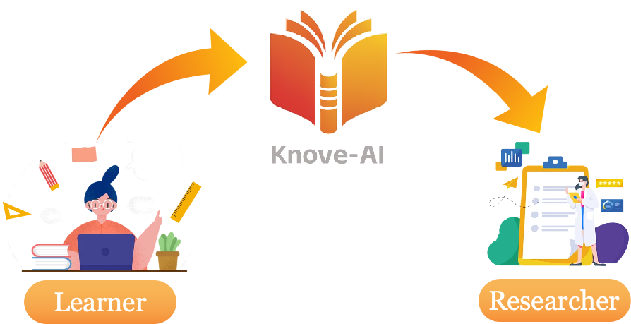
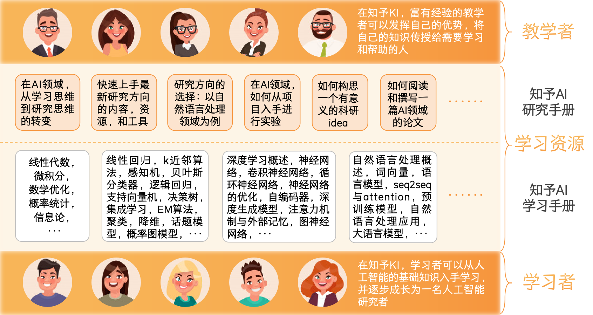
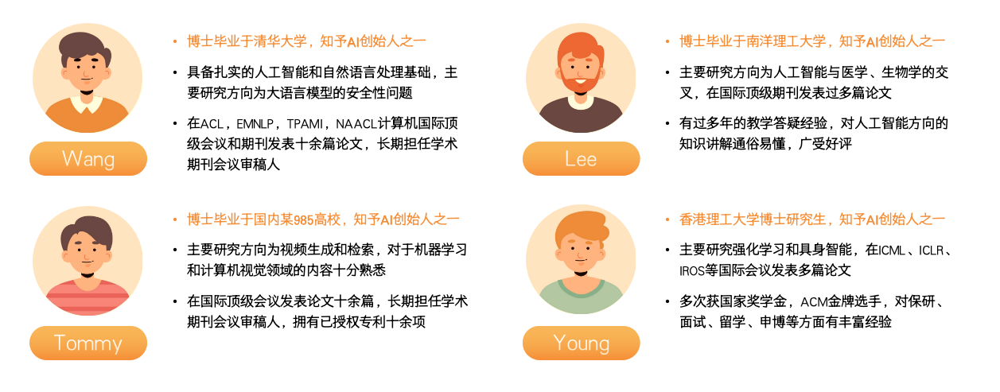

# 🪐 知予AI：大语言模型时代，助力AI学习者成长为研究者

<a href="#Brief-Intro" style="color: #FFC04C;">平台简介</a> |
<a href="#What-To-Get" style="color: #FFA500;">学习者能在知予AI获得什么</a> |
<a href="#Knove-AI-Learn" style="color: #FF8C00;">知予AI学习手册</a> |
<a href="#Knove-AI-Research" style="color: #FF7F50;">知予AI研究手册</a> |
<a href="#Contact-Us" style="color: #FF4500;">联系我们（寻找/成为知予AI教学者）</a>

**大语言模型**时代，越来越多的学生和从业者投身于**人工智能**（Artificial Intelligence, AI）的学习与研究，并将其应用到生活与工作中。然而，学习与研究过程中常常充满挑战，无论是难以理解算法概念、解决编程bug，还是在研究内容上感到迷茫。**知予AI**（Knove-AI）应运而生，致力于为学习者提供支持与帮助。

首先，知予AI是一份内容丰富、结构清晰的**中英文手册**，涵盖人工智能领域的**基础知识、算法原理和代码实现**，系统引导学习者从入门迈向前沿研究，包括**研究方向的确定、实验设计与论文撰写**，帮助学习者逐步成长为研究者。

此外，知予AI还是连接**经验丰富的人工智能学者**与**新手学习者**的桥梁。手册由来自**清华大学、北京大学、中国人民大学、哥伦比亚大学**等高校的博士研究生与研究员精心编写，这些学者深知学习与研究的艰难。因此，知予AI还提供**一对一交流**机会，帮助学习者高效解决问题（联系方式见末尾）。

目前，知予AI主要聚焦于**自然语言处理**（Natural Language Processing, NLP）领域，提供详尽示例与研究指导。与此同时，其模式也适用于其他人工智能领域，为更多行业的学习者与研究者提供启发与支持。

## ⚡ 知予AI致力于打造“学习者+资源+教学者”三位一体的AI学习平台

2016年，人工智能学习热潮兴起，许多大学生投身AI行业，立志从事研究或相关职业。到2023年，大语言模型技术飞速发展，学习资源层出不穷，如何高效选择适合的资料、系统入门人工智能、掌握自然语言处理并迈向科研，已成为学习者面临的共同难题。

为此，**知予AI**汇聚了来自**清华大学、北京大学、中国人民大学、哥伦比亚大学**等高校的博士研究生和研究员团队，梳理了人工智能领域的**基础知识、算法原理和代码实现**，并总结科研全过程，从研究方向的确定到实验设计与论文撰写，推出了“**知予AI学习手册**”和“**知予AI研究手册**”。手册内容严谨、结构系统，助力学习者从入门到深入，逐步掌握AI核心技能。此外，这些研究者还加入知予AI平台，成为**教学者**，通过一对一指导与答疑，为学习者提供针对性帮助，帮助其克服学习与科研中的难题。知予AI的核心体系示例图如下：

### 🧑‍🎓 (1) 学习者（Learner）

无论你是人工智能领域的小白、正在学习的大学生，还是致力于从事AI研究的研究生，抑或准备参与**科研立项**、**科技竞赛**、发表AI领域**论文**，甚至为**考研、保研、申博或留学**努力，**知予AI**都能为你提供强有力的支持，只要你对AI学习和研究充满热情。

### 📑 (2) 学习资源（Resource）

网络学习资源五花八门，质量参差不齐，耗费时间筛选效率低。**知予AI**整合了AI多个方向的**基础知识、算法原理、代码实现**，并编撰成统一格式的学习手册，涵盖从入门到研究的完整路径。同时，我们精选了高价值的**书籍、课程、网站、博客和论文**，并对主流学习资源提供中肯评价，帮助学习者节省时间，快速找到适合的资源。

### 🧑‍🏫 (3) 教学者（Teacher）

在AI学习和研究中，许多问题无法通过查阅资料解决，但经验丰富的前辈往往能带来关键帮助。**知予AI**不仅提供学习资源，还引入教学者角色——这些教学者是在顶级会议/期刊发表过多篇论文的学者与研究员。通过平台，学习者可与教学者**一对一交流**，获得针对性指导，解决学习和研究中的实际难题。

## 🤔 学习者能在知予AI获得什么

如果你——

- 想学习人工智能基础知识，并将算法应用于学习和工作
- 需要规划学习路径、研究方向，或希望一对一向专家请教问题
- 正在准备升学、留学、求职，却对AI领域了解不足
- 希望参与AI竞赛、项目或撰写论文，却缺乏专业指导

**知予AI**是你的理想选择。我们为学习者提供以下服务：

### 💡 (1) **人工智能基础知识的学习**

汇集多位博士生和领域专家整理的学习手册，覆盖**数学基础、机器学习、深度学习、自然语言处理、计算机视觉**等方向。手册内容广度与深度兼具，包括知识点、算法详解、代码实现、练手项目及参考资源。采用图文并茂的Markdown格式，简洁美观，学习体验出色。

### 🧐 (2) **从AI“学习者”变成“研究者**”

帮助学习者完成从“学习知识”到“开展研究”的思维转变。知予AI推出研究手册系列，涵盖**研究思维的培养、方向选择、跨学科探索、论文撰写与发表、科研实验方法**等内容，缩小信息差，助力进入科研领域。

### 💬 (3) **与富有经验的教学者一对一交流**

平台提供与富有经验的AI领域优秀博士生/研究人员一对一交流的机会，帮助解决学习与研究中的实际问题。通过对接客服（微信号见末尾“联系我们”）描述自己的学习需求，可直接匹配并联系教学者。**我们承诺：不收取任何中介费用，放心交流。**

## 📖 目录

⚠️ **注意**：每个章节的学习手册提供两种格式：`.md` 和 `.html`。

- **`.md` 文件**为源文件，可下载后使用第三方软件（如 Typora）进行编辑。
- **`.html` 文件**为通过 Typora 导出的可视化版本，适合无需 Markdown 格式的读者。

请注意，文件需下载后打开查看（因 GitHub 无法直接渲染行内公式格式），或打开我们的Github Page进行查看。

每章节的参考资源可在 `.md` 和 `.html` 文件底部找到。除此之外，根目录还附有推荐学习资源、思维导图等材料，供进一步学习使用。

### 知予AI学习手册

<table>
  <thead>
    <tr>
      <th width=20%>章节</th>
      <th width=15%>子章节</th>
      <th>内容</th>
    </tr>
  </thead>
  <tbody>
    <tr>
      <td rowspan="5"><a href="https://github.com/Knove-AI/Knove-AI/tree/main/1-数学基础">人工智能数学基础：介绍学习人工智能需要的基本数学知识，主要包括线性代数、微积分、概率统计等</a></td>
      <td><a href="https://github.com/Knove-AI/Knove-AI/blob/main/1-数学基础/MATH1-线性代数.md">线性代数</a></td>
      <td>向量，向量空间，矩阵，相似矩阵，对角化，二次型，正定矩阵，特征值，特征向量，奇异值分解，LU分解</td>
    </tr>
    <tr>
      <td><a href="https://github.com/Knove-AI/Knove-AI/blob/main/1-数学基础/MATH2-微积分.md">微积分</a></td>
      <td>微分，积分，矩阵微积分</td>
    </tr>
    <tr>
      <td><a href="https://github.com/Knove-AI/Knove-AI/blob/main/1-数学基础/MATH3-数学优化.md">数学优化</a></td>
      <td>数学优化的类型，凸优化基础，优化算法，拉格朗日乘数法与KKT条件</td>
    </tr>
    <tr>
      <td><a href="https://github.com/Knove-AI/Knove-AI/blob/main/1-数学基础/MATH4-概率统计.md">概率统计</a></td>
      <td>概率统计的基本概念，随机变量，概率分布，参数估计</td>
    </tr>
    <tr>
      <td><a href="https://github.com/Knove-AI/Knove-AI/blob/main/1-数学基础/MATH5-信息论.md">信息论</a></td>
      <td>熵，互信息，交叉熵和散度</td>
    </tr>
    <tr>
      <td rowspan="15"><a href="https://github.com/Knove-AI/Knove-AI/tree/main/2-机器学习">机器学习：介绍机器学习的基础知识、理论，以及各类主流的机器学习算法</a></td>
      <td><a href="https://github.com/Knove-AI/Knove-AI/blob/main/2-机器学习/ML1-机器学习概述.md">机器学习概述</a></td>
      <td>人工智能，统计学习，统计学习的分类，统计学习三要素，模型评估，模型选择，正则化，交叉验证，泛化能力，生成模型与判别模型，监督学习的评价指标，假设空间，归纳偏好</td>
    </tr>
    <tr>
      <td><a href="https://github.com/Knove-AI/Knove-AI/blob/main/2-机器学习/ML2-线性回归.md">线性回归</td>
      <td>线性回归模型，经验风险最小化，结构风险最小化，最大似然估计与均方误差，最大后验估计与正则化，基于numpy实现线性回归模型，使用scikit-learn中的线性回归算法对波士顿房价进行预测</td>
    </tr>
    <tr>
      <td><a href="https://github.com/Knove-AI/Knove-AI/blob/main/2-机器学习/ML3-k近邻算法.md">k近邻算法</td>
      <td>k近邻算法原理，k近邻算法的参数，kd树，基于numpy的k近邻算法实现，使用scikit-learn中的k近邻算法对鸢尾花数据进行分类</td>
    </tr>
    <tr>
      <td><a href="https://github.com/Knove-AI/Knove-AI/blob/main/2-机器学习/ML4-感知机.md">感知机</td>
      <td>感知机算法，感知机算法的收敛性，参数平均感知机，基于numpy的感知机实现，使用scikit-learn中的感知机算法对自行构建的数据集进行二分类</td>
    </tr>
    <tr>
      <td><a href="https://github.com/Knove-AI/Knove-AI/blob/main/2-机器学习/ML5-贝叶斯分类器.md">贝叶斯分类器</td>
      <td>朴素贝叶斯的学习与分类，朴素贝叶斯的参数估计，高斯朴素贝叶斯，半朴素贝叶斯分类器，基于numpy的朴素贝叶斯实现，使用scikit-learn中的多项式朴素贝叶斯算法对新闻文本进行分类</td>
    </tr>
    <tr>
      <td><a href="https://github.com/Knove-AI/Knove-AI/blob/main/2-机器学习/ML6-逻辑回归与最大熵模型.md">逻辑回归与最大熵模型</td>
      <td>逻辑回归模型，softmax回归模型，最大熵模型，基于numpy的逻辑回归实现，使用scikit-learn中的逻辑回归算法完成自定义数据集上的分类任务</td>
    </tr>
    <tr>
      <td><a href="https://github.com/Knove-AI/Knove-AI/blob/main/2-机器学习/ML7-支持向量机.md">支持向量机</td>
      <td>线性支持向量机与硬间隔最大化，线性支持向量机与软间隔最大化，非线性支持向量机与核函数，线性可分支持向量机的算法实现，使用scikit-learn中的支持向量机算法对鸢尾花数据进行分类</td>
    </tr>
    <tr>
      <td><a href="https://github.com/Knove-AI/Knove-AI/blob/main/2-机器学习/ML8-决策树与随机森林.md">决策树与随机森林</td>
      <td>决策树模型，特征选择，决策树的生成，决策树的剪枝，连续与缺失值，多变量决策树，使用scikit-learn中的决策树算法对鸢尾花数据进行分类</td>
    </tr>
    <tr>
      <td><a href="https://github.com/Knove-AI/Knove-AI/blob/main/2-机器学习/ML9-集成学习.md">集成学习</td>
      <td>个体与集成，集成学习的误差分析，Boosting，基于numpy的AdaBoost算法实现，使用scikit-learn中的AdaBoost算法完成自定义数据集上的分类任务，Bagging与随机森林，结合策略，提升树模型，从零开始实现一个GBDT算法系统</td>
    </tr>
    <tr>
      <td><a href="https://github.com/Knove-AI/Knove-AI/blob/main/2-机器学习/ML10-EM算法.md">EM算法</td>
      <td>EM算法的引入，EM算法过程，EM算法的Python实现</td>
    </tr>
    <tr>
      <td><a href="https://github.com/Knove-AI/Knove-AI/blob/main/2-机器学习/ML11-聚类.md">聚类</td>
      <td>聚类的基本概念，层次聚类，k均值聚类，聚类算法拓展，基于numpy的k均值聚类算法实现，对比scikit-learn中不同的聚类算法并将聚类结果可视化</td>
    </tr>
    <tr>
      <td><a href="https://github.com/Knove-AI/Knove-AI/blob/main/2-机器学习/ML12-降维.md">降维</td>
      <td>主成分分析，基于numpy的主成分分析算法实现，使用scikit-learn中的主成分分析算法对Olivetti人脸数据集进行降维及特征脸的提取，流形学习，使用scikit-learn中的t-SNE算法完成恒星光谱数据的降维</td>
    </tr>
    <tr>
      <td><a href="https://github.com/Knove-AI/Knove-AI/blob/main/2-机器学习/ML13-特征选择.md">特征选择</td>
      <td>子集搜索与评价，过滤式选择，包裹式选择，嵌入式选择与L1正则化，稀疏表示与字典学习，scikit-learn实现几种特征选择方法</td>
    </tr>
    <tr>
      <td><a href="https://github.com/Knove-AI/Knove-AI/blob/main/2-机器学习/ML14-话题模型.md">话题模型</td>
      <td>单词向量空间与话题向量空间，潜在语义分析算法，概率潜在语义分析模型，潜在狄利克雷分配，使用gensim中的潜在狄利克雷分配对题目文本进行主题分析</td>
    </tr>
    <tr>
      <td><a href="https://github.com/Knove-AI/Knove-AI/blob/main/2-机器学习/ML15-概率图模型.md">概率图模型</td>
      <td>概率图模型概述，模型表示，概率图模型的学习，概率图模型的推断，基于隐马尔可夫模型的语音识别，基于隐马尔可夫模型的语音识别</td>
    </tr>
    <tr>
      <td rowspan="9"><a href="https://github.com/Knove-AI/Knove-AI/tree/main/3-深度学习">深度学习：介绍基于神经网络的学习范式，以及一些常见的神经网络结构</a></td>
      <td><a href="https://github.com/Knove-AI/Knove-AI/blob/main/3-深度学习/DL1-深度学习概述.md">深度学习概述</a></td>
      <td>表示学习，深度学习，神经网络，神经网络的学习，深度学习框架</td>
    </tr>
    <tr>
      <td><a href="https://github.com/Knove-AI/Knove-AI/blob/main/3-深度学习/DL2-神经网络.md">神经网络</a></td>
      <td>神经网络的基本结构，激活函数，前馈神经网络，反向传播算法，通用近似定理，自动梯度计算，Tensorflow实现全连接神经网络进行MNIST手写数字识别，Pytorch实现全连接神经网络进行MNIST手写数字识别</td>
    </tr>
    <tr>
      <td><a href="https://github.com/Knove-AI/Knove-AI/blob/main/3-深度学习/DL3-卷积神经网络.md">卷积神经网络</a></td>
      <td>卷积，卷积神经网络，参数学习，几种常见的卷积神经网络，其他卷积方式，Tensorflow实现卷积神经网络进行Fashion MNIST衣物识别，Pytorch实现卷积神经网络进行Fashion MNIST衣物识别</td>
    </tr>
    <tr>
      <td><a href="https://github.com/Knove-AI/Knove-AI/blob/main/3-深度学习/DL4-循环神经网络.md">循环神经网络</a></td>
      <td>序列数据和语言模型，网络结构，循环神经网络的应用，循环神经网络的训练，长程依赖问题，LSTM，GRU，深层循环神经网络，扩展到图结构，Tensorflow实现循环神经网络进行情感分析，Tensorflow实现循环神经网络进行文本生成</td>
    </tr>
    <tr>
      <td><a href="https://github.com/Knove-AI/Knove-AI/blob/main/3-深度学习/DL5-神经网络的优化.md">神经网络的优化</a></td>
      <td>网络优化的难点，优化算法，参数初始化，数据预处理，逐层归一化，超参数优化，网络正则化，Tensorflow实现神经网络并比较不同的优化器的优化效果</td>
    </tr>
    <tr>
      <td><a href="https://github.com/Knove-AI/Knove-AI/blob/main/3-深度学习/DL6-自编码器.md">自编码器</a></td>
      <td>自编码器，稀疏自编码器，堆叠自编码器，降噪自编码器，Tensroflow实现自编码器完成光谱数据的降维与重构</td>
    </tr>
    <tr>
      <td><a href="https://github.com/Knove-AI/Knove-AI/blob/main/3-深度学习/DL7-深度生成模型.md">深度生成模型</a></td>
      <td>概率生成模型，变分自编码器，Pytorch实现VAE进行MNIST手写数字生成，生成式对抗网络，Tensorflow实现GAN进行MNIST手写数字生成</td>
    </tr>
    <tr>
      <td><a href="https://github.com/Knove-AI/Knove-AI/blob/main/3-深度学习/DL8-注意力机制与外部记忆.md">注意力机制与外部记忆</a></td>
      <td>注意力，注意力机制的应用（指针网络，自注意力机制），外部记忆</td>
    </tr>
    <tr>
      <td><a href="https://github.com/Knove-AI/Knove-AI/blob/main/3-深度学习/DL9-图神经网络.md">图神经网络</a></td>
      <td>图神经网络概述，图神经网络中的矩阵，图卷积神经网络，Text Graph Convolutional Networks，图注意力网络，图嵌入</td>
    </tr>
    <tr>
      <td rowspan="7"><a href="https://github.com/Knove-AI/Knove-AI/tree/main/4-自然语言处理">自然语言处理：介绍了NLP的基础知识和应用，以及NLP发展历程上的重大里程碑技术，包括词向量、语言模型、序列到序列模型、预训练模型、大语言模型</a></td>
      <td><a href="https://github.com/Knove-AI/Knove-AI/blob/main/4-自然语言处理/NLP1-自然语言处理概述.md">自然语言处理概述</a></td>
      <td>自然语言与编程语言，自然语言处理的任务，自然语言处理的知识域，歧义，传统模型和算法，语言、思维和理解，正则表达式，词，文本规范化，深度学习与自然语言处理，jieba库的分词、词性标注与关键词提取操作示例，</td>
    </tr>
    <tr>
      <td><a href="https://github.com/Knove-AI/Knove-AI/blob/main/4-自然语言处理/NLP2-词向量.md">词向量</a></td>
      <td>词向量概述，CBOW，skip-gram，word2vec的优化，GloVe，词向量的评估，句子与文档的嵌入，使用gensim中的word2vec工具训练词向量，</td>
    </tr>
    <tr>
      <td><a href="https://github.com/Knove-AI/Knove-AI/blob/main/4-自然语言处理/NLP3-语言模型.md">语言模型</a></td>
      <td>N元语法，评估语言模型，泛化与未知词汇，平滑，神经语言模型，Tensorflow实现神经语言模型</td>
    </tr>
    <tr>
      <td><a href="https://github.com/Knove-AI/Knove-AI/blob/main/4-自然语言处理/NLP4-seq2seq与attention.md">seq2seq与attention</td>
      <td>序列到序列模型，注意力机制，注意力机制在序列模型中的应用，序列生成模型的评价指标，Tensorflow实现Seq2Seq+Attention完成机器翻译任务</td>
    </tr>
    <tr>
      <td><a href="https://github.com/Knove-AI/Knove-AI/blob/main/4-自然语言处理/NLP5-预训练模型.md">预训练模型</a></td>
      <td>ELMo，Transformer，BERT，ERNIE，GPT</td>
    </tr>
    <tr>
      <td><a href="https://github.com/Knove-AI/Knove-AI/blob/main/4-自然语言处理/NLP6-自然语言处理应用.md">自然语言处理应用</a></td>
      <td>文本分类（序列到类别），文本摘要（异步序列到序列），机器阅读理解（同步序列到序列）</td>
    </tr>
  </tbody>
</table>

### 知予AI研究手册

<table>
  <thead>
    <tr>
      <th>章节</th>
      <th>内容</th>
    </tr>
  </thead>
  <tbody>
    <tr>
      <td><a href="https://github.com/Knove-AI/Knove-AI/tree/main/1-数学基础">在AI领域，从学习思维到研究思维的转变</a></td>
      <td>基础知识学习与科学研究的区别，</td>
    </tr>
    <tr>
      <td><a href="https://github.com/Knove-AI/Knove-AI/tree/main/1-数学基础">快速上手最新研究内容，资源，和工具：以大语言模型为例</a></td>
      <td>大语言模型概述，最新论文</td>
    </tr>
    <tr>
      <td><a href="https://github.com/Knove-AI/Knove-AI/tree/main/1-数学基础">研究方向的选择：以自然语言处理领域为例</a></td>
      <td>研究方向的分类，研究方向的来源，如何自主选择研究方向</td>
    </tr>
    <tr>
      <td><a href="https://github.com/Knove-AI/Knove-AI/blob/main/1-数学基础/MATH5-信息论.md">如何构思一个有意义的idea</a></td>
      <td>idea的种类，看论文与想idea的关系</td>
    </tr>
    <tr>
      <td><a href="https://github.com/Knove-AI/Knove-AI/blob/main/1-数学基础/MATH2-微积分.md">如何阅读一篇AI领域（以NLP为例）的论文</a></td>
      <td>一篇AI领域（以NLP为例）论文的结构，如何撰写一篇论文</td>
    </tr>
    <tr>
      <td><a href="https://github.com/Knove-AI/Knove-AI/blob/main/1-数学基础/MATH2-微积分.md">如何撰写一篇AI领域（以NLP为例）的论文</a></td>
      <td>摘要，Introduction，Related Work，Methods，Experiments，Conclusion</td>
    </tr>
  </tbody>
</table>

## ☎️ 联系我们

**如需要与教学者进行一对一交流，请添加对接小姐姐微信号PhiNorm，或扫描以下二维码：**

